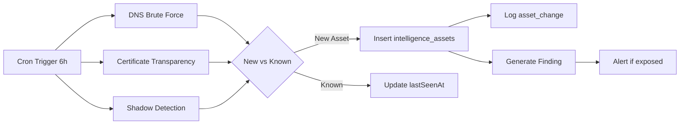
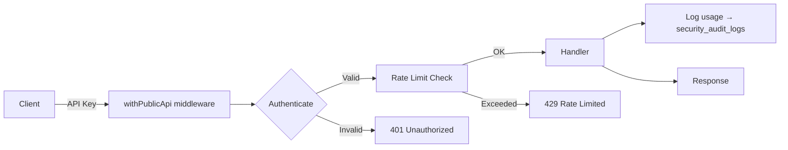
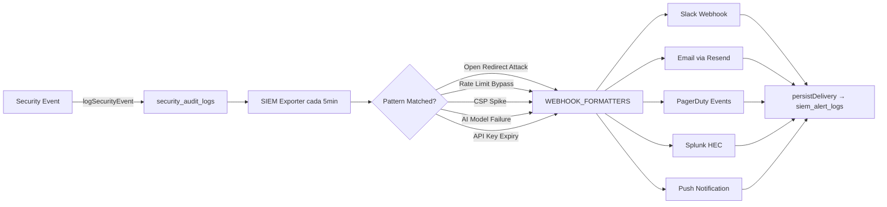
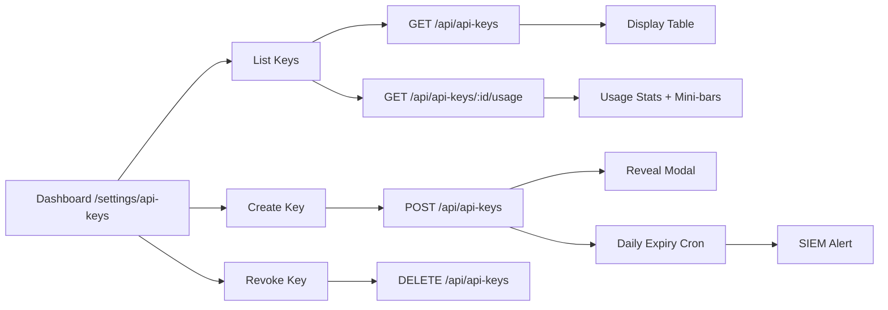

<p align="center">
  <picture>
    <source media="(prefers-color-scheme: dark)" srcset="https://raw.githubusercontent.com/StrategicConnex/StrategicConnexAudit/main/public/logo-dark.svg">
    
  </picture>
</p>

<h1 align="center">StrategicAudit Pro (SCAUDIT)</h1>

<p align="center">
  <strong>Enterprise Cyber Intelligence & Technical Auditing Platform</strong>
</p>

<p align="center">
  <a href="https://scaudit.vercel.app"></a>
  <a href="https://github.com/StrategicConnex/StrategicConnexAudit/actions"></a>
  <a href="https://codecov.io/gh/strategicconnex/strategicaudit-pro"></a>
  
  
  
</p>

> **Sitio en vivo:** [scaudit.vercel.app](https://scaudit.vercel.app) · **Swagger UI:** [/swagger](https://scaudit.vercel.app/swagger) · **API Docs:** [/docs/api](https://scaudit.vercel.app/docs/api) · **MITRE Coverage:** [/mitre-coverage](https://scaudit.vercel.app/mitre-coverage)

---

StrategicAudit Pro (SCAUDIT) es una plataforma **enterprise-grade** de inteligencia de red, monitoreo de superficie de ataque, auditoría técnica SEO y ciberseguridad continua. Diseñada para equipos de seguridad, analistas de threat intelligence y consultores técnicos que necesitan visibilidad profunda de su infraestructura digital.

---

## Tabla de contenidos

- [Capacidades clave](#-capacidades-clave)
- [Roadmap de mejoras](#-roadmap-de-mejoras)
- [Arquitectura](#%EF%B8%8F-arquitectura)
- [Stack tecnológico](#-stack-tecnológico)
- [Estructura del proyecto](#-estructura-del-proyecto)
- [Módulos destacados](#-módulos-destacados)
  - [Descubrimiento Continuo de Activos](#-descubrimiento-continuo-de-activos-p01)
  - [MITRE ATT&CK Mapping](#-mitre-attck-mapping-p16)
  - [API Pública REST](#-api-pública-rest-p11)
  - [Reportes PDF White-Label](#-reportes-pdf-white-label-p12)
  - [Mapa Geo Interactivo](#-mapa-geo-interactivo-p21)
  - [Alertas Multi-Canal + SIEM](#-alertas-multi-canal--siem-p03)
  - [API Keys Dashboard](#-api-keys-dashboard)
  - [Swagger UI + Documentación API](#-swagger-ui--documentación-api)
  - [Security Audit Dashboard](#-security-audit-dashboard)
  - [AI Health Dashboard](#-ai-health-dashboard)
  - [Push Notifications](#-push-notifications)
- [Instalación](#-instalación)
- [Configuración](#-configuración)
- [Scripts](#-scripts)
- [Design System](#-design-system)
- [Seguridad](#-seguridad)
- [Pruebas](#-pruebas)
- [API & Endpoints](#-api--endpoints)
- [Deploy](#-deploy)
- [Contribuir](#-contribuir)
- [Licencia](#-licencia)

---

## 🚀 Capacidades clave

### 🖥️ Dashboard de Proyectos
- **Gestión multi-proyecto** con cards de estado visuales (health score, última auditoría, integraciones)
- **Monitoreo en vivo** con heartbeat pulse, latencia y uptime de cada proyecto
- **Auditorías técnicas** con crawler SEO profundo (títulos, metadatos, H1/H2, estructura de contenido)
- **Integraciones**: Google Search Console (GSC), Google Analytics 4 (GA4), Bing Webmaster Tools
- **Métricas de rendimiento**: Core Web Vitals (LCP, INP, CLS, TTFB, FCP), Lighthouse scores
- **Keywords**: seguimiento de posiciones, volumen de búsqueda, CPC, competencia
- **Exportación**: Reportes PDF white-label y CSV

### 🔍 Inteligencia Cibernética
- **Escaneo de infraestructura**: DNS (lookup, MX, TXT, NS, SOA, CNAME, DMARC, SPF), WHOIS, GeoIP
- **Monitoreo de superficie de ataque**: descubrimiento de subdominios, IPs, puertos abiertos
- **Ejecutores de red**: ping, traceroute, HTTP headers, SSL/TLS certificate inspection
- **OSINT**: shodan queries, email breach detection, reverse DNS
- **Análisis de drift**: detección de cambios en la postura de seguridad a lo largo del tiempo
- **Risk Engine**: scoring de vulnerabilidades con severidad y confianza
- **Tool Registry**: 25+ herramientas de inteligencia disponibles con rate limiting y caching
- **Protección SSRF**: `egress-guard` con validación CIDR matemática IPv4/IPv6
- **Mapa Geo interactivo**: visualización GeoIP de activos con Leaflet.js

### 🌐 Descubrimiento Continuo de Activos (NUEVO)
- **DNS Brute Force**: descubrimiento de subdominios por diccionario
- **Certificate Transparency Logs**: monitoreo de logs CT para nuevos certificados
- **Shadow Asset Detection**: detección de activos olvidados o no autorizados
- **Orquestador automatizado**: ejecución cada 6h via Trigger.dev
- **Persistencia**: assets en `intelligence_assets`, cambios en `asset_changes`, hallazgos de seguridad

### 🎯 MITRE ATT&CK Mapping (NUEVO)
- **25+ técnicas** MITRE mapeadas por toolId exacto
- **Badges visuales** en cada hallazgo con tooltip de técnica
- **Dashboard de cobertura** en `/mitre-coverage` con gráficos
- **Cobertura**: Reconnaissance, Resource Development, Initial Access, Discovery, C2, Defense Evasion

### 🤖 AI Copilot & Reportes
- **Copilot de Infraestructura**: asistente IA para planes de remediación técnica
- **Incident Brief**: generación automática de resúmenes ejecutivos de seguridad
- **Reportes SEO**: análisis generativo con datos de GSC/GA4
- **Modelos gratuitos**: OpenRouter free pool (Gemini Flash, DeepSeek, Llama 4, Mistral, Qwen)
- **Fallback automático**: encadenamiento de 5 modelos con circuit breaker
- **Health Check**: monitoreo periódico de disponibilidad de modelos + dashboard

### 🛡️ Seguridad & SIEM
- **CSP dinámico**: Content-Security-Policy con nonce por request (Next.js 16 proxy)
- **Rate limiting**: `withRateLimit` decorator genérico con Upstash Redis (por IP o user)
- **Headers estándar**: `RateLimit-Limit`, `RateLimit-Remaining`, `RateLimit-Reset` en todas las respuestas
- **Audit logging**: eventos estructurados en `security_audit_logs` con persistencia en Supabase
- **SIEM Exporter**: detección de patrones sospechosos (open redirect attacks, rate limit bypass, CSP spikes)
  - Alertas a **Slack**, **PagerDuty**, **Splunk** y **Email** (Resend)
  - Heartbeat cada 30 min para verificar pipeline
  - Push notifications al navegador
- **Egress Guard**: protección SSRF con validación CIDR matemática
- **Validación de email**: anti-spam, anti-desechables, anti-typosquatting (400+ dominios bloqueados)
- **Middleware de seguridad**: HSTS, X-Frame-Options, X-Content-Type-Options, Permissions-Policy
- **Security Audit Dashboard** en `/security/audit` con filtros por tipo, IP y fecha

### 🔐 API Pública REST (NUEVO)
- **Endpoints públicos** con autenticación via API Key
- **Rate limiting dedicado** por key
- **Documentación OpenAPI 3.0** en `/openapi.json`
- **Swagger UI interactiva** en `/swagger` (lazy-loaded)
- **API Playground** en `/docs/api/playground`
- **Health check público** en `GET /api/public/v1/health`
- **Documentación completa** en `/docs/api` con ejemplos curl

### 📊 Monitoreo & Telemetría
- **Real User Monitoring (RUM)**: Web Vitals desde el navegador del usuario
- **Uptime monitoring**: checks periódicos con Vercel Cron + Trigger.dev
- **Alertas de drift**: detección de cambios en infraestructura
- **AI Health Dashboard**: gráficos de salud por modelo, latencia promedio diaria, eventos de fallo

### 🔐 Autenticación
- **Magic Link**: login sin contraseña via Supabase Auth
- **Validación de email en tiempo real**: detecta correos desechables, temporales, typosquatting
- **Rate limiting por IP**: 20 intentos/min en validate-email, 10 intentos/min en callback
- **Protección anti-open-redirect**: validación estricta del parámetro `next`

---

## 🗺️ Roadmap de mejoras

Basado en análisis competitivo de 10 herramientas (Shodan, Censys, SecurityTrails, GreyNoise, AttackIQ, Detectify, Moz Pro, SEMrush, Datadog, Grafana).

| Fase | Items | Completado | % |
|------|-------|------------|---|
| Fase 0 — Cimientos | 15 | 15 | ✅ 100% |
| Fase 1 — P0 Fundación | 3 | 2 | 🟡 67% |
| Fase 2 — P1 Core Features | 6 | 3 | 🟡 50% |
| Fase 3 — P2 UX/Dashboard | 6 | 1 | 🟢 17% |
| Fase 4 — P3 Deseable | 4 | 0 | ⬜ 0% |
| **Total** | **34** | **21** | **62%** |

**Próximo:** P0.2 Historical DNS/WHOIS Tracking · P1.3 Team RBAC · P2.2 Custom Dashboards

> 📖 Ver plan completo: [`docs/improvements/ROADMAP.md`](./docs/improvements/ROADMAP.md) · Análisis competitivo: [`docs/improvements/COMPETITIVE-ANALYSIS.md`](./docs/improvements/COMPETITIVE-ANALYSIS.md)

---

## 🏗️ Arquitectura

```
                          ┌─────────────────────┐
                          │    Vercel Edge       │
                          │   (proxy.ts)         │
                          │  CSP · HSTS · Auth   │
                          └──────────┬──────────┘
                                     │
                    ┌────────────────┼────────────────┐
                    │                │                │
              ┌─────▼─────┐   ┌─────▼─────┐   ┌─────▼─────┐
              │ Next.js    │   │ API Routes │   │ Server    │
              │ App Router │   │  (50+      │   │ Actions   │
              │ (pages)    │   │  endpoints)│   │ (auth'd)  │
              └─────┬─────┘   └─────┬─────┘   └─────┬─────┘
                    │                │                │
              ┌─────▼───────────────▼────────────────▼─────┐
              │              Supabase (Postgres)            │
              │     · RLS (Row Level Security)              │
              │     · Auth (Magic Link)                     │
              │     · 35+ tablas (proyectos, auditorías,    │
              │       inteligencia, monitoreo, seguridad,   │
              │       api_keys, audit_logs, health, etc.)   │
              └──────────────────┬─────────────────────────┘
                                 │
                    ┌────────────┴────────────┐
                    │                         │
              ┌─────▼─────┐           ┌───────▼──────┐
              │  Upstash   │           │   Trigger.dev │
              │  Redis     │           │  (background  │
              │  (ratelimit│           │   jobs + cron)│
              │   + cache) │           │               │
              └───────────┘           └───────┬───────┘
                    │                         │
              ┌─────▼─────────────────────────▼──────┐
              │         OpenRouter AI (free pool)     │
              │  · Gemini Flash · DeepSeek · Llama 4  │
              │  · Mistral · Qwen · Nemotron          │
              └──────────────────────────────────────┘
```

### Módulos server

```
src/server/
├── ai/                           # AI Router (model pool + fallback)
│   └── ai-router.ts              #   callAIWithFallback con 5 modelos
├── api/
│   └── public-router.ts          #   withPublicApi middleware (API Key auth)
├── intelligence/
│   ├── core/                     #   Dispatcher, cache, circuit-breaker, rate-limiter
│   ├── discovery/                #   🆕 DNS brute force, CT monitor, shadow detection
│   ├── executors/                #   DNS, network, email, OSINT, website (25+ tools)
│   ├── mitre/                    #   🆕 MITRE ATT&CK mapping + coverage
│   ├── registry/                 #   Tool registry + policies
│   └── security/                 #   Egress guard (SSRF protection)
├── notifications/                #   Push notification service (VAPID)
└── security/                     #   SIEM exporter, audit, API key expiry alerts
```

### Background jobs (Trigger.dev)

| Task | Schedule | Descripción |
|------|----------|-------------|
| `siem.trigger.ts` | Cada 5 min | SIEM exporter + heartbeat |
| `discovery.trigger.ts` | 🆕 Cada 6h | Descubrimiento continuo de activos |
| `api-key-expiry.trigger.ts` | 🆕 Diario 09:00 UTC | Alertas de expiración de API Keys |
| `audit.trigger.ts` | Bajo demanda | Auditorías programadas |
| `monitoring.trigger.ts` | Bajo demanda | Monitoreo de infraestructura |
| `uptime.trigger.ts` | Diario | Verificación de uptime |

---

## 🛠️ Stack tecnológico

### Frontend
- **Framework**: Next.js 16.2.4 (App Router, Turbopack)
- **Lenguaje**: TypeScript 5
- **UI**: Tailwind CSS v4 + OKLCH tokens
- **Fonts**: DM Sans (display), Inter (body), JetBrains Mono (code)
- **Gráficos**: Recharts, React Flow, Leaflet.js 🆕
- **PDF**: @react-pdf/renderer 🆕
- **Documentación API**: swagger-ui-react 🆕
- **3D**: Three.js / React Three Fiber
- **Estado**: Zustand, TanStack React Query
- **Iconos**: Lucide React

### Backend & Database
- **ORM**: Drizzle ORM 0.45
- **Database**: PostgreSQL (Supabase)
- **Auth**: Supabase Auth (Magic Link)
- **Cache**: Upstash Redis
- **Background Jobs**: Trigger.dev 4.4
- **AI**: OpenRouter API (free models)

### Infraestructura
- **Hosting**: Vercel (Standalone output)
- **CI/CD**: GitHub Actions + Playwright + Vitest
- **Coverage**: Codecov
- **Push Notifications**: Web Push API (VAPID)

---

## 📁 Estructura del proyecto

```
src/
├── app/                          # Next.js App Router
│   ├── actions/                  # Server Actions (auth'd)
│   │   ├── audits.ts             #   Crear/ejecutar auditorías
│   │   ├── projects.ts           #   CRUD de proyectos
│   │   └── reports.ts            #   Generar reportes
│   ├── ai/                       # AI Health Dashboard 🆕
│   │   └── health/               #   Dashboard de salud de modelos
│   ├── api/                      # API Routes (50+ endpoints)
│   │   ├── ai/                   #   Copilot, reportes, healthcheck
│   │   ├── api-keys/             #   🆕 CRUD + usage tracking + expiry
│   │   ├── auth/                 #   Validate email, callback
│   │   ├── cron/                 #   SIEM exporter, uptime
│   │   ├── docs/                 #   🆕 API documentation pages
│   │   ├── intelligence/         #   Investigaciones, tools, health, discovery
│   │   ├── monitoring/           #   Monitoreo y alertas
│   │   ├── notifications/        #   Push subscriptions 🆕
│   │   ├── public/v1/            #   🆕 Public REST API (API Key auth)
│   │   ├── reports/pdf/          #   🆕 PDF generation endpoint
│   │   └── security/             #   Audit logs, SIEM, CSP reports
│   ├── components/               # UI Components (Dashboard)
│   │   ├── tabs/                 #   Overview, Intelligence, Reports, etc.
│   │   ├── DashboardContainer.tsx
│   │   ├── DashboardSidebar.tsx
│   │   ├── ScoreGauge.tsx
│   │   ├── AttackSurfaceGraph.tsx
│   │   ├── MitreBadge.tsx        #   🆕 MITRE technique badge
│   │   └── DownloadPdfButton.tsx #   🆕 PDF download con progress
│   ├── docs/                     # 🆕 Documentation pages
│   │   └── api/                  #   API reference + playground
│   ├── intelligence/             # Intelligence page/layout
│   ├── login/                    # Login con Magic Link
│   ├── mitre-coverage/           # 🆕 MITRE ATT&CK coverage dashboard
│   ├── projects/                 # Project detail + audit pages
│   ├── security/                 # 🆕 Security audit dashboard
│   │   └── audit/                #   Audit logs + SIEM alerts
│   ├── settings/                 # 🆕 Settings pages
│   │   └── api-keys/             #   API Keys dashboard
│   └── swagger/                  # 🆕 Swagger UI (lazy-loaded)
│
├── features/                     # Feature modules
│   └── intelligence/             #   Intelligence Shell, Tool Catalog, Geo Map
│
├── server/                       # Server-only logic
│   ├── ai/                       #   AI Router (model pool, fallback)
│   ├── api/                      #   🆕 Public API middleware (withPublicApi)
│   ├── intelligence/
│   │   ├── core/                 #     Dispatcher, cache, circuit-breaker
│   │   ├── discovery/            #     🆕 DNS brute, CT monitor, shadow detector
│   │   ├── executors/            #     25+ intelligence tools
│   │   ├── mitre/                #     🆕 MITRE ATT&CK mapping
│   │   └── security/             #     Egress guard
│   └── security/                 #     SIEM exporter, API key expiry alerts 🆕
│
├── shared/                       # Shared across app
│   ├── config/                   #   Env validation
│   ├── data/                     #   🆕 MITRE mapping data (shared)
│   ├── db/                       #   Drizzle schemas (35+ tablas)
│   │   └── schemas/              #     health, intelligence, monitoring,
│   │                             #     security-audit, api-keys, push-subscriptions
│   ├── lib/                      #   Auth, ratelimit, audit-log, withPublicApi
│   └── utils/                    #   Network, PDF export, email validation
│
├── proxy.ts                      # Next.js 16 proxy (CSP, HSTS, security headers)
└── trigger/                      # Trigger.dev background tasks
    ├── siem.trigger.ts           #   SIEM exporter (cada 5 min)
    ├── discovery.trigger.ts      #   🆕 Discovery continuo (cada 6h)
    ├── api-key-expiry.trigger.ts #   🆕 Expiración API Keys (diario)
    ├── audit.trigger.ts          #   Auditorías programadas
    ├── monitoring.trigger.ts     #   Monitoreo de infraestructura
    ├── uptime.trigger.ts         #   Uptime checks
    └── webhook.trigger.ts        #   Webhook delivery
```

---

## 📦 Módulos destacados

### 🔄 Descubrimiento Continuo de Activos (P0.1)



Módulo de descubrimiento automático que ejecuta cada 6 horas:
- **DNS Brute Force**: prueba miles de subdominios contra el dominio objetivo
- **CT Log Monitor**: consulta logs de Certificate Transparency para nuevos certificados
- **Shadow Detector**: compara activos descubiertos vs conocidos, detecta shadow IT

**Archivos:** `src/server/intelligence/discovery/` (5 archivos) · `src/trigger/discovery.trigger.ts`

---

### 🎯 MITRE ATT&CK Mapping (P1.6)

```mermaid
flowchart LR
    A[Tool Registry] -->|toolId| B[MITRE_MAPPING]
    B --> C{MitreTechnique}
    C --> D[Reconnaissance TA0043]
    C --> E[Resource Dev TA0042]
    C --> F[Initial Access TA0001]
    C --> G[Discovery TA0007]
    C --> H[C2 TA0011]
    C --> I[Defense Evasion TA0005]
    D --> J[Badge in IntelligenceTab]
    E --> J
    F --> J
    G --> J
    H --> J
    I --> J
    J --> K[/mitre-coverage dashboard]
```

Cada hallazgo de inteligencia se mapea automáticamente a técnicas MITRE ATT&CK:
- **25+ técnicas** cubriendo 6 tácticas
- **Badge visual** con tooltip: `T1583.001 · DNS Zone Transfer`
- **Dashboard** en `/mitre-coverage` con gráficos de cobertura por táctica
- **Tooltip expandible** con técnica ID, nombre, táctica, descripción y link a MITRE

**Archivos:** `src/server/intelligence/mitre/mapping.ts` · `src/app/components/MitreBadge.tsx` · `src/app/mitre-coverage/`

---

### 🌐 API Pública REST (P1.1)



Endpoints públicos con autenticación via API Key + rate limiting + audit logging:

| Endpoint | Método | Auth | Descripción |
|----------|--------|------|-------------|
| `GET /api/public/v1/health` | GET | ❌ | Health check público |
| `GET /api/public/v1/intelligence` | GET | ✅ API Key | Listar investigaciones |
| `POST /api/public/v1/intelligence` | POST | ✅ API Key | Crear investigación |

**Arquitectura:** `withPublicApi(handler)` middleware reusable en `src/server/api/public-router.ts`

---

### 📄 Reportes PDF White-Label (P1.2)

```mermaid
flowchart LR
    A[Download Button] -->|POST| B[/api/reports/pdf]
    B --> C[Fetch Findings]
    B --> D[Fetch Assets]
    B --> E[Fetch Branding]
    C --> F[Generate PDF]
    D --> F
    E --> F
    F --> G[Buffer → Response]
    G --> H[Browser Download]
```

Reportes PDF profesionales con:
- **Logo y colores** del cliente (branding desde localStorage)
- **Donut chart** de severidad de findings (SVG nativo)
- **Bar chart** de scores por investigación
- **Página de assets** (subdominios, IPs, certificados)
- **Progress bar** durante la generación
- **Notificaciones toast** de éxito/error

**Archivos:** `src/app/api/reports/pdf/route.ts` · `src/app/components/DownloadPdfButton.tsx`

---

### 🗺️ Mapa Geo Interactivo (P2.1)

Mapa Leaflet.js incrustado en IntelligenceTab que muestra:
- **Markers** de IPs con coordenadas GeoIP
- **Clusters** para múltiples activos en misma región
- **Tooltips** con severidad y tipo de activo
- **Colores**: chartreuse (bajo), amber (medio), destructive (alto)
- **Interactivo**: zoom, pan, click para detalles

---

### 🚨 Alertas Multi-Canal + SIEM (P0.3)



**7 reglas de detección:**
| Regla | Patrón | Canales |
|-------|--------|---------|
| Open Redirect Attack | Múltiples open_redirect_attempt desde misma IP | Slack, Email, PagerDuty |
| Rate Limit Bypass | rate_limit_hit desde IPs rotadas | Slack, Email |
| AI Model Failure | ai_model_health con status=down | Slack, Email, PagerDuty |
| CSP Spike | >10 csp_violation en 5 min | Slack, Email |
| Auth Failure Burst | auth_failure en 1 min | Slack, PagerDuty |
| API Key Expiry 🆕 | Keys expirando en 1-7 días | Slack, Email |
| Heartbeat | Ping cada 30 min | Todos los canales |

**Archivos:** `src/server/security/siem-exporter.ts` · `src/server/security/api-key-expiry-alert.ts` 🆕 · `src/trigger/siem.trigger.ts` · `src/trigger/api-key-expiry.trigger.ts` 🆕

---

### 🔑 API Keys Dashboard

Dashboard visual en `/settings/api-keys` para gestionar keys de acceso programático:



| Feature | Descripción |
|---------|-------------|
| **Stat cards** | Active Keys, Used This Week, Total Requests, Expiring Soon |
| **Create form** | Nombre + expiración (30/90/365d o Never) + reveal modal one-time |
| **Key table** | Nombre, prefix, creado, último uso, requests con mini-bars, expiración |
| **Filters** | Búsqueda por nombre, checkbox expiring soon, sort newest/oldest, refresh |
| **Usage tracking** | `GET /api/api-keys/:id/usage` consulta `security_audit_logs` |
| **Expiry alerts** | Cron diario + alerta SIEM multi-canal (Slack/Email/PagerDuty) |

**Archivos:** `src/app/settings/api-keys/` (2 archivos) · `src/server/security/api-key-expiry-alert.ts` · `src/trigger/api-key-expiry.trigger.ts`

---

### 📖 Swagger UI + Documentación API

```mermaid
flowchart LR
    A[/swagger] --> B[Dynamic Import ~3MB]
    A --> C[Page Shell renders instantly]
    B --> D[swagger-ui-react loads]
    D --> E[openapi.json spec]
    E --> F[Interactive Try It]
    A --> G[/docs/api]
    G --> H[Static reference]
    G --> I[API Playground]
    I --> J[Execute real queries]
```

| Ruta | Descripción | Bundle |
|------|-------------|--------|
| `/swagger` | Swagger UI interactivo (lazy) | ~3MB (carga bajo demanda) |
| `/openapi.json` | OpenAPI 3.0 spec raw | ~5KB |
| `/docs/api` | Documentación estática con ejemplos | 0 (inline) |
| `/docs/api/playground` | Try-it-yourself con API keys | 0 (inline) |
| `/api/public/v1/health` | Health check público (sin auth) | 0 |

**Arquitectura:** swagger-ui-react cargado con `next/dynamic` + `ssr: false` para no impactar otras páginas

---

### 🛡️ Security Audit Dashboard

Dashboard en `/security/audit` para monitorear eventos de seguridad:

| Feature | Descripción |
|---------|-------------|
| **Timeline** | Lista paginada de últimos 100 eventos |
| **Filtros** | Por tipo de evento, IP, rango de fechas |
| **SIEM Alerts tab** | Historial de alertas enviadas + estado de delivery |
| **Test Webhooks** | Botón que dispara `GET /api/security/siem/test` |
| **Eventos trackeados** | rate_limit_hit, open_redirect_attempt, csp_violation, auth_failure, ai_model_health, api_key_expiry |

**Archivos:** `src/app/security/audit/` · `src/server/security/` · `src/shared/lib/audit-log.ts`

---

### 🤖 AI Health Dashboard

Dashboard en `/ai/health` que monitorea los modelos de IA:
- **Gráfico de salud** por modelo (healthy/degraded/down)
- **Latencia promedio** diaria por modelo
- **Timeline de fallos** con eventos de error
- **Uptime** por modelo en porcentaje

**Backend:** `GET /api/ai/healthcheck` ejecutado cada 6h via Vercel Cron

---

### 📱 Push Notifications

Sistema de notificaciones push al navegador:
- **Web Push API** con claves VAPID
- **Botón de suscripción** en el dashboard
- **Alertas SIEM** enviadas como push
- **Suscripción persistida** en `push_subscriptions` table

**Archivos:** `src/server/notifications/push.ts` · `src/app/components/PushSubscribeButton.tsx`

---

## 💻 Instalación

### Requisitos

- Node.js >= 20
- pnpm >= 9
- Una cuenta de [Supabase](https://supabase.com) (gratuita)
- Una cuenta de [Upstash](https://upstash.com) (gratuita, para Redis)
- Una cuenta de [OpenRouter](https://openrouter.ai/keys) (gratuita, sin tarjeta)

### Pasos

```bash
# 1. Clonar el repositorio
git clone https://github.com/StrategicConnex/StrategicConnexAudit.git
cd StrategicConnexAudit

# 2. Instalar dependencias
pnpm install

# 3. Configurar variables de entorno
cp .env.example .env.local
# Editar .env.local con tus credenciales (ver sección Configuración)

# 4. Ejecutar migraciones de base de datos
pnpm db:push

# 5. Iniciar servidor de desarrollo
pnpm dev
# Abrir http://localhost:3000
```

---

## ⚙️ Configuración

### Variables de entorno

```env
# ─── Supabase (obligatorio) ─────────────────────────────────────
NEXT_PUBLIC_SUPABASE_URL=https://xxx.supabase.co
NEXT_PUBLIC_SUPABASE_ANON_KEY=eyJ...
SUPABASE_SERVICE_ROLE_KEY=eyJ...    # Para bypass de RLS en server
DIRECT_URL=postgresql://...         # URL directa para migraciones

# ─── Upstash Redis (obligatorio para rate limiting) ─────────────
UPSTASH_REDIS_REST_URL=https://xxx.upstash.io
UPSTASH_REDIS_REST_TOKEN=xxx

# ─── OpenRouter (opcional — AI Copilot, Reportes) ───────────────
OPENROUTER_API_KEY=sk-or-v1-...    # https://openrouter.ai/keys

# ─── SIEM Webhooks (opcional) ───────────────────────────────────
SIEM_WEBHOOK_SLACK=https://hooks.slack.com/services/...
SIEM_WEBHOOK_PAGERDUTY=https://events.pagerduty.com/v2/...
SIEM_WEBHOOK_SPLUNK=https://http-inputs-mysplunk.splunkcloud.com/...
SIEM_PAGERDUTY_ROUTING_KEY=xxx

# ─── Email (Resend) para SIEM y Magic Links ─────────────────────
RESEND_API_KEY=re_xxx                # https://resend.com/api-keys
SIEM_EMAIL_FROM=alerts@scaudit.com   # Remitente de alertas SIEM
SIEM_EMAIL_TO=admin@company.com      # Destinatario de alertas SIEM

# ─── Push Notifications (opcional) ──────────────────────────────
VAPID_PUBLIC_KEY=xxx               # npx web-push generate-vapid-keys
VAPID_PRIVATE_KEY=xxx

# ─── Desarrollo (opcional) ──────────────────────────────────────
NEXT_PUBLIC_DEV_BYPASS_AUTH=true   # Saltea auth en dev
CRON_SECRET=xxx                    # Para endpoints de cron
```

### Base de datos

El proyecto usa Drizzle ORM con migraciones SQL. Para sincronizar:

```bash
pnpm db:generate   # Generar migración desde schemas
pnpm db:push       # Aplicar migraciones a Supabase
```

Las migraciones se almacenan en `drizzle/` (11 migrations hasta la fecha, incluyendo tablas `developer_api_keys`, `security_audit_logs`, `siem_alert_logs`, `ai_health_logs`, `push_subscriptions`).

---

## 📜 Scripts

| Comando | Descripción |
|---------|-------------|
| `pnpm dev` | Iniciar servidor de desarrollo (Turbopack) |
| `pnpm build` | Build de producción |
| `pnpm start` | Iniciar servidor de producción |
| `pnpm lint` | Ejecutar ESLint |
| `pnpm test` | Tests unitarios (Vitest) |
| `pnpm test:coverage` | Tests con reporte de cobertura |
| `pnpm test:e2e` | Tests E2E con Playwright |
| `pnpm db:generate` | Generar migración Drizzle |
| `pnpm db:push` | Aplicar migraciones a la BD |
| `pnpm setup-admin` | Crear usuario administrador |

---

## 🎨 Design System

SCAUDIT Pro usa un **design system propietario** definido en OKLCH, inspirado en instrumentos de precisión forense y consolas de monitoreo SOC.

### Paleta de color

| Token | OKLCH | Uso |
|-------|-------|-----|
| `bg-background` | `oklch(1.8% 0.003 265)` | Fondo near-black |
| `text-foreground` | `oklch(93% 0.008 265)` | Texto principal |
| `bg-card` | `oklch(3% 0.006 265)` | Cards |
| `text-primary` | `oklch(68% 0.14 230)` | Índigo — acciones, links |
| `text-chartreuse` | `oklch(78% 0.18 140)` | Señal viva, indicadores OK |
| `text-destructive` | `oklch(55% 0.22 25)` | Errores, severidad crítica |
| `border-border` | `oklch(15% 0.008 265)` | Bordes de cards |
| `text-muted-fg` | `oklch(35% 0.02 260)` | Texto secundario |

### Tipografía

| Rol | Fuente | Pesos |
|-----|--------|-------|
| Display | DM Sans | 400–1000 |
| Body | Inter | 400–800 |
| Mono | JetBrains Mono | 400–600 |

### Glass utilities

- `glass-panel`: Panel translúcido para sidebars/headers
- `glass-card`: Card estándar con gradiente sutil
- `glass-card-hero`: Card destacada con glow primario

### Animaciones globales

`scan-pulse`, `pulse-beat`, `fade-in`, `slide-in-right`, `scale-check`, `message-in`, `shimmer`

> **Ver documentación completa:** [`SCAUDIT-THEME.md`](./SCAUDIT-THEME.md)

---

## 🛡️ Seguridad

### Content Security Policy (CSP)
- Aplicada dinámicamente por `proxy.ts` con nonce por request
- `strict-dynamic` para scripts (excepto en dev con `unsafe-eval`)
- Report endpoint: `/api/security/csp-report`
- Meta tag CSP defense-in-depth para páginas prerendered
- Header `Permissions-Policy` para restringir APIs de navegador

### Rate Limiting
- **Decorator genérico**: `withRateLimit(config, handler)` envuelve cualquier route handler
- **Headers estándar**: `RateLimit-Limit`, `RateLimit-Remaining`, `RateLimit-Reset` en todas las respuestas
- **Identificación por IP**: extracción jerárquica (x-vercel-forwarded-for → x-real-ip → x-forwarded-for)
- **Fail closed** en producción si Redis no está disponible
- **Audit logging**: cada rate limit hit se registra en `security_audit_logs`
- **Rate limit por API Key**: 60 req/min en API pública

### Protección SSRF
- `egress-guard.ts`: validación CIDR matemática para IPv4 e IPv6
- 16 rangos privados IPv4 + 7 rangos IPv6 bloqueados
- `assertPublicHostname()`: verifica resolución DNS contra IPs privadas
- `safeFetch()`: wrapper de fetch con timeout, redirect manual y validación de destino

### SIEM (Security Information & Event Management)
- **Exportador** que corre cada 5 min via Vercel Cron
- **7 reglas de detección**: open redirect attacks, rate limit bypass, AI model failure, CSP spikes, auth failure bursts, API key expiry, heartbeat
- **4 canales de alerta**: Slack, PagerDuty, Splunk, Email (Resend)
- **2 alertas adicionales**: Push notifications + heartbeat cada 30 min
- **Dashboard** en `/security/audit` con filtros por tipo, IP y fecha

### Autenticación
- Magic Link sin contraseña
- Validación de email anti-spam/anti-desechables (400+ dominios bloqueados)
- Protección anti-open-redirect en callback
- Rate limiting dedicado por endpoint (20/min validate-email, 10/min callback)

### API Keys Security
- Keys generadas con criptografía segura (`crypto.randomBytes(64)`)
- Solo se muestra una vez (reveal modal)
- Rate limiting por key
- Detección de keys expiradas o próximas a expirar
- Audit trail de cada uso

---

## 🧪 Pruebas

### Unitarias (Vitest)

```bash
pnpm test              # Ejecutar todas las pruebas
pnpm test:coverage     # Con reporte de cobertura
```

**Cobertura actual:** 25%+ líneas, 20%+ branches (umbrales de CI)

| Archivo | Cobertura |
|---------|-----------|
| `ratelimit.ts` | ✅ Probado (rate limiting + IP extraction) |
| `siem-exporter.ts` | ✅ Probado (pattern detection + webhooks) |
| `network.ts` | ✅ Probado (utilidades de red) |
| `egress-guard.ts` | ✅ Probado (SSRF prevention) |
| `executors.ts` | ✅ Probado (tool execution) |
| `supabase-live-test.mjs` | 🟡 Live tests (requiere BD real) |

### E2E & Penetración (Playwright)

```bash
pnpm test:e2e          # Ejecutar todos los tests E2E
npx playwright test    # Con interfaz gráfica
```

**Tests incluidos:**
- Autenticación (login, callback, magic link)
- Rate limiting (20+ requests en 60s, bypass por IP rotation)
- CSP (bloqueo de inline scripts maliciosos)
- Open redirect (next parameters maliciosos)
- Visual regression (login, ScoreGauge, AttackSurfaceGraph, IntelligenceTab SVGs)
- API key auth (public endpoints)

### CI/CD Pipeline

El pipeline de GitHub Actions ejecuta:
1. Lint (ESLint)
2. TypeScript type-check
3. Tests unitarios con cobertura
4. Tests de penetración con Playwright
5. Upload de cobertura a Codecov

---

## 🌐 API & Endpoints

### AI & Copilot

| Endpoint | Método | Descripción |
|----------|--------|-------------|
| `/api/ai/copilot` | POST | Chat con AI Copilot de infraestructura |
| `/api/ai/report` | POST | Generar reporte SEO ejecutivo |
| `/api/ai/healthcheck` | GET | Health check de modelos AI (cron cada 6h) |

### Inteligencia

| Endpoint | Método | Descripción |
|----------|--------|-------------|
| `/api/intelligence` | GET/POST | Investigaciones de inteligencia |
| `/api/intelligence/copilot` | POST | Plan de remediación técnica |
| `/api/intelligence/brief` | POST | Incident Brief ejecutivo |
| `/api/intelligence/health` | GET | Estado del engine de inteligencia |
| `/api/intelligence/runs` | POST | Ejecutar herramientas |
| `/api/intelligence/drift` | GET/POST | Análisis de drift de seguridad |
| `/api/intelligence/assets/graph` | GET | Graph de activos descubiertos |
| `/api/intelligence/discovery` | 🆕 GET/POST | Descubrimiento continuo de activos |

### API Pública (REST)

| Endpoint | Método | Auth | Descripción |
|----------|--------|------|-------------|
| `GET /api/public/v1/health` | GET | ❌ | Health check público |
| `GET /api/public/v1/intelligence` | GET | ✅ API Key | Listar investigaciones |
| `POST /api/public/v1/intelligence` | POST | ✅ API Key | Crear investigación |

### API Keys

| Endpoint | Método | Descripción |
|----------|--------|-------------|
| `GET /api/api-keys` | GET | Listar todas las keys |
| `POST /api/api-keys` | POST | Crear nueva key |
| `DELETE /api/api-keys` | DELETE | Revocar key |
| `GET /api/api-keys/:id/usage` | 🆕 GET | Estadísticas de uso real |

### Reportes

| Endpoint | Método | Descripción |
|----------|--------|-------------|
| `POST /api/reports/pdf` | 🆕 POST | Generar PDF white-label descargable |

### Seguridad

| Endpoint | Método | Descripción |
|----------|--------|-------------|
| `/api/security/audit-logs` | GET | Logs de auditoría (paginados) |
| `/api/security/siem-alerts` | GET | Historial de alertas SIEM |
| `/api/security/csp-report` | POST | Reportes de violación CSP |
| `/api/security/siem/run` | POST | Ejecutar SIEM exporter manualmente |
| `/api/security/siem/test` | GET | Probar conectividad de webhooks |

### Auth

| Endpoint | Método | Descripción |
|----------|--------|-------------|
| `/api/auth/validate-email` | POST | Validación de email en tiempo real |
| `/auth/callback` | GET | Callback de Magic Link |

### Notificaciones

| Endpoint | Método | Descripción |
|----------|--------|-------------|
| `POST /api/notifications/push-subscribe` | 🆕 POST | Suscribir navegador a push notifications |

### Monitoreo

| Endpoint | Método | Descripción |
|----------|--------|-------------|
| `/api/monitoring` | GET | Estado de monitoreo de proyectos |
| `/api/telemetry/vitals` | POST | Web Vitals desde RUM |
| `/api/webhooks` | POST | Webhooks de integración externa |

### Cron (Vercel Cron Jobs + Trigger.dev)

| Task | Schedule | Descripción |
|------|----------|-------------|
| `api/cron/uptime` | `0 0 * * *` (diario) | Verificación de uptime |
| `api/cron/siem` | `*/5 * * * *` (cada 5 min) | SIEM exporter |
| `api/ai/healthcheck` | `0 */6 * * *` (cada 6h) | Health check de modelos AI |
| `trigger/discovery.trigger` | 🆕 Cada 6h | Descubrimiento continuo de activos |
| `trigger/api-key-expiry.trigger` | 🆕 Diario 09:00 UTC | Alertas de expiración API Keys |

---

## 🚢 Deploy

### Vercel (recomendado)

El proyecto está preconfigurado para Vercel con output standalone:

```bash
# 1. Conectar repo a Vercel
vercel connect

# 2. Configurar variables de entorno en Vercel Dashboard
# Ver sección "Configuración" arriba

# 3. Deploy
vercel --prod
```

El archivo `vercel.json` ya incluye:
- Framework `nextjs` con standalone output
- Cron jobs para uptime, SIEM y health check
- Configuración de imágenes y headers de seguridad

**Importante:** NO configurar `NEXT_PUBLIC_DEV_BYPASS_AUTH=true` en producción — el guard `NODE_ENV === 'development'` lo desactiva automáticamente.

### Base de datos

Las migraciones se ejecutan automáticamente al hacer `pnpm db:push`. Para entornos de producción:

1. Configurar `DIRECT_URL` en Vercel (la URL directa de Supabase)
2. Ejecutar `pnpm db:push` en el pipeline de CI o manualmente

---

## 🤝 Contribuir

1. Hacer fork del repositorio
2. Crear rama: `git checkout -b feature/nueva-funcionalidad`
3. Commit: `git commit -m 'feat: agregar nueva funcionalidad'`
4. Push: `git push origin feature/nueva-funcionalidad`
5. Abrir Pull Request

### Convenciones

- **Commits**: [Conventional Commits](https://www.conventionalcommits.org/) (`feat:`, `fix:`, `security:`, `docs:`, `refactor:`)
- **Branch**: `feature/`, `fix/`, `security/`, `docs/`
- **Tests**: Toda nueva funcionalidad debe incluir tests unitarios

---

## 📄 Licencia

MIT © [StrategicConnex](https://github.com/StrategicConnex)

---

<p align="center">
  <sub>Built with ❤️ by the StrategicConnex Team</sub><br>
  <sub>© 2026 StrategicConnex — Enterprise Cyber Intelligence</sub>
</p>
