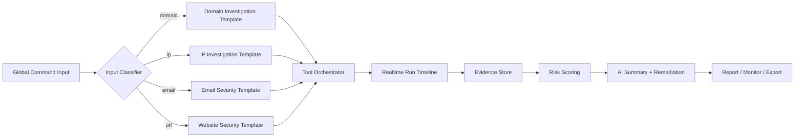
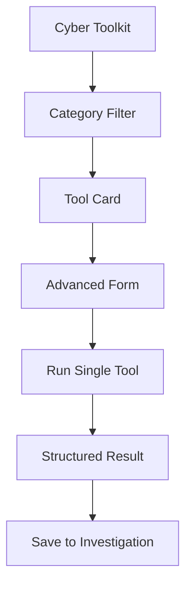
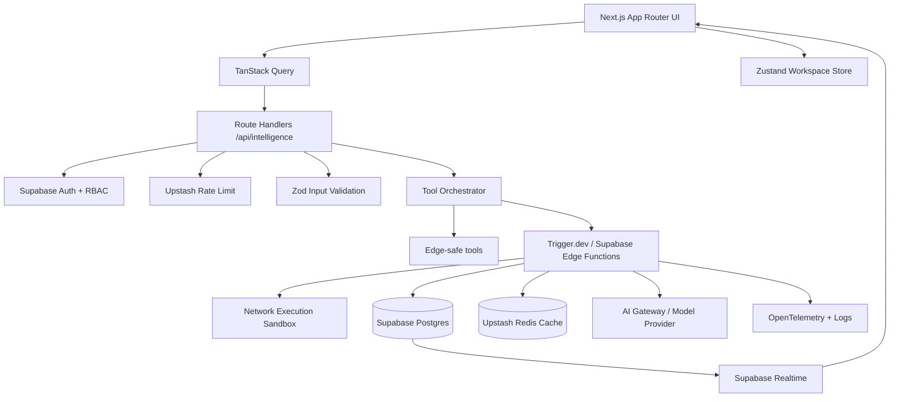
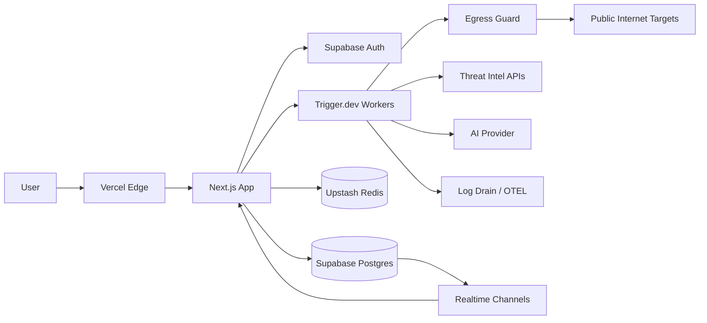
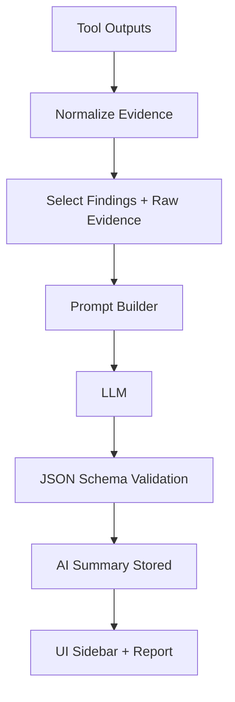

# SCAudit Enterprise Network Intelligence Platform

**Documento:** plan enterprise de arquitectura, producto, UX/UI e implementación  
**Proyecto base:** StrategicAudit Pro / SCAudit  
**Stack objetivo:** Next.js App Router, React, TypeScript, TailwindCSS, shadcn/ui, Framer Motion, Motion One, Zustand, TanStack Query, Supabase, PostgreSQL, Edge Functions, Vercel, React Hook Form, Zod, Lucide Icons, React Virtuoso, Recharts, Sonner, React Email  
**Fecha:** 2026-05-18  

---

## 1. Executive Summary

SCAudit debe evolucionar desde una plataforma de auditoría SEO/técnica hacia un **AI-native Infrastructure Intelligence Workspace**: una consola enterprise para diagnóstico de DNS, red, email security, SSL/TLS, web security, OSINT, attack surface y recomendaciones de remediación asistidas por IA.

El objetivo no es replicar CentralOps o MXToolbox con una piel moderna. El objetivo es conservar su eficiencia técnica, reorganizar su taxonomía, agregar memoria histórica, flujos multi-step, seguridad operacional, resultados explicables y una capa AI-native que convierta herramientas aisladas en **investigaciones inteligentes**.

### Decisión principal

Crear una nueva sección principal:

```txt
/intelligence
  Network Intelligence
  Infrastructure Intelligence
  Cyber Toolkit
  AI Diagnostics
  Threat Intelligence Workspace
```

Esta sección funcionará como:

| Capa | Función |
|---|---|
| Command Center | Entrada rápida para dominios, IPs, emails, ASNs, URLs y rangos autorizados |
| Tool Registry | Catálogo modular de herramientas diagnósticas versionadas |
| Investigation Workspace | Sesiones persistentes con timeline, evidencia, resultados y notas IA |
| Risk Engine | Scoring normalizado por severidad, confianza, explotación y blast radius |
| AI Copilot | Explicación, priorización, correlación, remediación y reportes |
| Monitoring Layer | Checks recurrentes, alertas, baseline e historial |
| Enterprise Layer | RBAC, cuotas, auditoría, exportación, API keys, billing-ready metering |

---

## 2. Product Vision

### Posicionamiento

SCAudit será la evolución moderna de:

| Referencia | Qué conservar | Qué reemplazar |
|---|---|---|
| CentralOps | Dossier integral, input único, utilidad directa, resultados técnicos transparentes | UI de frames, navegación legacy, outputs planos, falta de historial, nula colaboración |
| MXToolbox | Taxonomía amplia, email security fuerte, favoritos, herramientas especializadas | Densidad visual antigua, workflows fragmentados, resultados poco contextuales, UX mobile débil |
| Datadog | Observabilidad, timeline, alertas, exploración densa | Complejidad inicial alta |
| Cloudflare | Network/security mental model, edge-first, postura de seguridad | Vendor lock visual |
| Linear | Navegación rápida, command palette, microinteractions, claridad | Falta de dashboards técnicos densos |
| OpenAI/Cursor | AI-native workflows, explicación contextual, generación de acciones | Opacidad si no se preserva evidencia |

### Propuesta de valor

> "Un workspace de inteligencia técnica que transforma dominios, IPs, emails y URLs en diagnósticos accionables, riesgo priorizado, evidencia reproducible y planes de remediación generados por IA."

---

## 3. Reference Analysis: CentralOps

Fuente: https://centralops.net/co/ y documentación pública de Domain Dossier / Email Dossier.

### Arquitectura funcional observada

CentralOps se organiza alrededor de herramientas de red interactivas y dossiers agregados:

| Área | Herramientas / capacidades | Patrón |
|---|---|---|
| Domain Dossier | Address lookup, domain whois, network whois, DNS records, traceroute, service scan | Reporte compuesto |
| Email Dossier | Sintaxis email, MX, SMTP session, confidence rating | Validación paso a paso |
| Utilities | Domain Check, Browser Mirror | Herramientas puntuales |
| Network | Ping, Traceroute, NsLookup / Dig | Diagnóstico directo |

### Inputs y outputs

| Input | Interpretación | Output |
|---|---|---|
| Dominio | DNS + WHOIS + red + servicios | Dossier técnico |
| IP | Reverse DNS + network whois + traceroute + service scan | Perfil de infraestructura |
| URL | Extracción de host/canonical domain | Diagnóstico derivado |
| Email | Dominio + MX + SMTP handshake | Validez y mail path |

### Qué conservar

- **Input flexible único:** dominio, IP, URL o email en una misma barra.
- **Dossier compuesto:** una investigación no debe obligar al usuario a abrir 12 herramientas.
- **Transparencia técnica:** mostrar raw evidence, headers, DNS answers, hops y timestamps.
- **Cost accounting:** CentralOps usa unidades de servicio; SCAudit debe usar usage metering enterprise.

### Qué rediseñar completamente

- Navegación por frames y herramientas sueltas.
- Ausencia de workspace, historial, colaboración, favoritos inteligentes y automatización.
- Resultados planos sin scoring ni correlación.
- Mobile y accesibilidad.

---

## 4. Reference Analysis: MXToolbox

Fuente: https://mxtoolbox.com/NetworkTools.aspx

### Taxonomía observada

MXToolbox expone una biblioteca extensa con categorías visibles:

| Categoría | Herramientas detectadas |
|---|---|
| DNS | MX, A, AAAA, CNAME, TXT, SOA, SRV, DNSKEY, CERT, LOC, IPSECKEY, RRSIG, NSEC, DS, NSEC3PARAM |
| Email | SMTP, SPF, DKIM, DMARC, BIMI, MTA-STS, TLSRPT, Email Health, Header Analyzer, Mailflow, Deliverability |
| Network | ASN, TCP port, Ping, Trace, ARIN/IP blocks, WhatIsMyIP |
| Website | HTTP, HTTPS |
| Operations | Bulk lookup, DNS propagation, compliance checks, generators |

### UX y modelos mentales

| Usuario | Trabajo que intenta hacer | Necesidad real |
|---|---|---|
| Email admin | "Por qué mis emails caen en spam" | SPF/DKIM/DMARC/BIMI/MTA-STS + reputación + remediación |
| Network engineer | "Qué pasa entre mi origen y el destino" | Ping, traceroute, ASN, BGP, CDN, WAF, GeoIP |
| Security engineer | "Cuál es la superficie expuesta" | Puertos, TLS, headers, tech stack, WHOIS, IP reputation |
| Consultant | "Necesito un reporte para cliente" | Export, narrativa, evidencia, prioridades |
| SOC analyst | "Esto cambió o es anómalo" | Historial, diff, alerts, timeline |

### Limitaciones detectadas

- Catálogo amplio pero disperso.
- Inputs por herramienta, no por investigación.
- UI centrada en tabla/lista, no en flujo.
- Falta de correlación entre resultados.
- IA ausente o no estructural.
- Enterprise parcial: monitoreo y reporting existen, pero no se sienten como workspace moderno.

---

## 5. Strategic Product Decisions

| Decisión | Justificación |
|---|---|
| Investigación primero, herramienta después | Los usuarios no quieren "abrir MX lookup"; quieren diagnosticar un dominio, email o incidente |
| Tool registry declarativo | Permite agregar herramientas sin reescribir UI/API/colas |
| Evidence-first AI | La IA nunca reemplaza evidencia; resume y correlaciona outputs verificables |
| Edge + worker split | Edge para normalización/auth/rate limit; workers para scans con red, timeouts y colas |
| Risk engine común | Todos los módulos emiten findings normalizados |
| Historial y diff | Diferencia enterprise clave frente a utilidades públicas |
| Seguridad por defecto | SSRF, abuso de scanners, cuotas, allowlists, RBAC y auditoría desde el día 1 |

---

## 6. Complete Sitemap

```txt
/dashboard
  /projects
  /projects/[id]
  /projects/[id]/audits/[auditId]
  /intelligence
    /overview
    /investigations
    /investigations/[id]
    /tools
      /dns
      /network
      /email-security
      /website
      /ssl-tls
      /threat
      /osint
    /realtime
    /attack-surface
    /monitoring
    /reports
    /settings
      /sources
      /api-keys
      /rate-limits
      /rbac
      /retention
/api/intelligence
  /investigations
  /investigations/[id]
  /runs
  /runs/[id]
  /tools/[toolId]
  /ai/summary
  /ai/remediation
  /exports
  /webhooks
```

---

## 7. Navigation Flows

### Primary flow: one input to full investigation



### Secondary flow: expert tool mode



---

## 8. User Journeys

| Journey | Trigger | Flow | Success metric |
|---|---|---|---|
| Diagnose domain | User enters `example.com` | DNS + WHOIS + TLS + headers + email + reputation | Full score in < 45s |
| Email deliverability | User enters `admin@example.com` or domain | MX + SPF + DKIM + DMARC + BIMI + SMTP + blacklist | Remediation plan generated |
| Incident triage | User enters suspicious IP | GeoIP + ASN + reputation + reverse IP + BGP + ports | Risk priority and evidence |
| Pre-sales audit | Consultant runs domain report | Full investigation + branded PDF | Export under 2 min |
| Monitoring setup | User promotes finding to monitor | Baseline + schedule + alert | Alert configured |

---

## 9. UX Strategy

### Layout

```txt
┌──────────────────────────────────────────────────────────────────────────────┐
│ Topbar: project switcher | command palette | env | notifications | account  │
├──────────────┬───────────────────────────────────────────────┬───────────────┤
│ Sidebar      │ Investigation Workspace                        │ AI Sidebar    │
│              │                                               │               │
│ Overview     │ Target identity bar                            │ Summary       │
│ Tools        │ Live run timeline                              │ Findings      │
│ Investigate  │ Evidence panels / topology / charts            │ Remediation   │
│ Monitoring   │ Result tabs                                    │ Export        │
│ Reports      │                                               │               │
└──────────────┴───────────────────────────────────────────────┴───────────────┘
```

### Principles

| Principle | Implementation |
|---|---|
| Dense but calm | Split panes, monospace evidence, compact metrics, no legacy table overload |
| Investigation over utility | Results attach to sessions, not disposable pages |
| AI contextual, not decorative | AI sidebar bound to selected evidence and findings |
| Keyboard-first | `Cmd/Ctrl+K`, quick run, rerun, save monitor, export |
| Enterprise trust | Timestamps, resolver region, source, confidence, raw output |

---

## 10. UI Strategy

### Visual direction

- Dark mode cinematic with neutral graphite base.
- Accent palette: electric blue for realtime/network, amber for warnings, red for critical, green for verified, violet only for AI affordances.
- Geist Sans for product UI, Geist Mono for evidence, DNS records, IPs, ASNs, ports and trace IDs.
- Ambient background must be subtle; avoid cheap neon/cyberpunk.

### Core surfaces

| Surface | UI pattern |
|---|---|
| Global input | Command bar with target classifier chips |
| Tool catalog | Dense cards, category tabs, favorites, recent |
| Investigation timeline | Vertical event stream with live status |
| Evidence panel | Virtualized rows, copy actions, raw/parsed toggle |
| Topology | Node-link graph for domain/IP/CDN/ASN relationships |
| AI sidebar | Contextual summary, root cause, action plan |
| Risk panel | Score ring, severity distribution, confidence |

---

## 11. Wireframes

### Intelligence overview

```txt
┌─ Network Intelligence ─────────────────────────────────────────────┐
│ [Scan domain, IP, URL, email, ASN...] [Run] [Templates] [⌘K]       │
├───────────────────────────────────────────────────────────────────┤
│ Risk trend     Active monitors     Recent investigations           │
│ ┌──────────┐   ┌──────────────┐    ┌────────────────────────────┐ │
│ │ 82 High  │   │ 24 healthy   │    │ acme.com  High  2m ago     │ │
│ └──────────┘   └──────────────┘    │ 8.8.8.8   Low   12m ago    │ │
│                                    └────────────────────────────┘ │
├───────────────────────────────────────────────────────────────────┤
│ Modules: DNS | Network | Email | Website | TLS | Threat | OSINT    │
└───────────────────────────────────────────────────────────────────┘
```

### Investigation detail

```txt
┌─ acme.com ──────────────────────────────────────────────── Score 74 │
│ domain · first seen today · monitored · export                         │
├──────────────┬──────────────────────────────────────┬─────────────────┤
│ Timeline     │ Evidence / Results                   │ AI Diagnostics  │
│ ✓ DNS        │ Tabs: Summary Raw Graph Findings      │ Root cause      │
│ ✓ MX         │                                      │ Top risks       │
│ … TLS        │ DNS records table                    │ Remediation     │
│ running BGP  │ Topology graph                       │ Report draft    │
└──────────────┴──────────────────────────────────────┴─────────────────┘
```

---

## 12. Technical Architecture



### Runtime split

| Layer | Runtime | Use |
|---|---|---|
| Next Server Components | Node.js | Page shells, authenticated data, cached views |
| Route Handlers | Node.js | Run creation, result fetch, streaming status |
| Edge Functions | Edge | Lightweight input classification, auth-adjacent checks, webhooks |
| Trigger.dev workers | Node.js controlled | DNS, WHOIS, SMTP, TLS, traceroute, port scans |
| Supabase Realtime | Managed | Live run events and investigation updates |
| Upstash Redis | Managed | Rate limits, cache, locks, dedupe |

---

## 13. Infrastructure Architecture



### Egress security model

All scanning must go through an `EgressGuard`:

- Normalize target.
- Resolve DNS before every network call.
- Block private, loopback, link-local, carrier-grade NAT, multicast, metadata IPs and reserved ranges.
- Re-resolve on redirects.
- Enforce max redirects, max response size, max duration.
- Require explicit user ownership or plan entitlement for intrusive scans.
- Throttle per user, project, org, target, CIDR and tool class.
- Record every egress attempt in audit logs.

---

## 14. Folder Structure

```txt
src/
  app/
    intelligence/
      layout.tsx
      page.tsx
      loading.tsx
      error.tsx
      investigations/
        page.tsx
        [id]/
          page.tsx
          loading.tsx
      tools/
        page.tsx
        [category]/
          page.tsx
    api/
      intelligence/
        investigations/route.ts
        investigations/[id]/route.ts
        runs/route.ts
        runs/[id]/route.ts
        tools/[toolId]/route.ts
        ai/summary/route.ts
        ai/remediation/route.ts
  features/
    intelligence/
      components/
        IntelligenceShell.tsx
        GlobalTargetCommand.tsx
        ToolCatalog.tsx
        ToolRunPanel.tsx
        InvestigationTimeline.tsx
        EvidenceTable.tsx
        RiskScorePanel.tsx
        AiDiagnosticsSidebar.tsx
        InfrastructureTopology.tsx
      hooks/
        useCreateInvestigation.ts
        useRunTool.ts
        useInvestigationRealtime.ts
      stores/
        intelligence-store.ts
      types/
        intelligence.ts
      validators/
        intelligence.schema.ts
  server/
    intelligence/
      registry/
        tool-registry.ts
        tool-taxonomy.ts
      orchestration/
        create-run.ts
        execute-tool.ts
        normalize-result.ts
        risk-engine.ts
      tools/
        dns.ts
        network.ts
        email-security.ts
        website.ts
        tls.ts
        threat.ts
        osint.ts
      security/
        egress-guard.ts
        abuse-guard.ts
        entitlement.ts
      ai/
        summarize-investigation.ts
        remediation-plan.ts
      cache/
        intelligence-cache.ts
      observability/
        telemetry.ts
  shared/
    db/
      schemas/
        intelligence.ts
supabase/
  functions/
    classify-target/
    intelligence-webhook/
drizzle/
  0003_intelligence_platform.sql
```

---

## 15. Core Modules

| Module | Scope | Primary entities |
|---|---|---|
| DNS Intelligence | DNS records, DNSSEC, propagation, zone posture | domain, record, resolver |
| Network Intelligence | Ping, trace, ASN, BGP, GeoIP, ports, reputation | IP, ASN, route, port |
| Email Security | MX, SPF, DKIM, DMARC, BIMI, SMTP, blacklists | domain, selector, server |
| Infrastructure Intelligence | CDN, WAF, reverse IP, hosting, exposed services | host, provider, service |
| Website Intelligence | Headers, CSP, cookies, redirect, tech stack, performance | URL, response, asset |
| SSL/TLS Intelligence | Cert chain, protocol, ciphers, expiry, CT | hostname, certificate |
| Threat Intelligence | Reputation, blocklists, IOC enrichment | IP, domain, hash, URL |
| AI Security Insights | Summaries, anomalies, remediations | finding, evidence |
| Monitoring & Alerting | Schedules, baselines, notifications | monitor, alert |
| Reporting & Exports | PDF, CSV, XLSX, API, email | report |
| Realtime Analysis | Live run events and streaming evidence | run_event |
| Recommendations | Prioritized action graph | recommendation |
| Risk Scoring | Severity, exploitability, confidence | risk_signal |
| Historical Analysis | Diffs, trends, baseline drift | snapshot |
| OSINT Intelligence | WHOIS, RDAP, public signals, relationships | identity, registrar |
| Attack Surface | Correlated exposed assets | asset, exposure |

---

## 16. Tool Taxonomy

### Mandatory tools

| Category | Tools |
|---|---|
| DNS Intelligence | DNS Lookup, MX Lookup, TXT Lookup, NS Lookup, SPF Analyzer, DKIM Analyzer, DMARC Analyzer, DNSSEC Validation, Reverse DNS, DNS Propagation, Zone Analysis |
| Network Intelligence | Ping, Traceroute, ASN Lookup, WHOIS, IP Reputation, GeoIP, Port Scanner, TLS Scanner, HTTP Headers, CDN Detection, WAF Detection, Reverse IP, BGP Analysis |
| Email Security | Mail Health, SMTP Diagnostics, Blacklist Checks, BIMI Analysis, Email Security Score, Mail Server Reputation |
| Website Intelligence | SSL Scanner, Security Headers, Tech Stack Detection, Redirect Analysis, Cookie Analysis, CSP Analysis, Performance Diagnostics, Fingerprinting, Lighthouse-style Analysis |
| AI Modules | AI summaries, infrastructure explanations, anomaly detection, attack surface explanations, recommendations, threat insights, AI-generated reports, remediation plans |

### Tool implementation matrix

| Tool | Backend executor | Output | AI enhancement | Cache TTL | Risk signals |
|---|---|---|---|---:|---|
| DNS Lookup | `dns.resolveAny` + authoritative resolver option | records | Explain DNS posture | 5m | missing A/AAAA, stale TTL |
| MX Lookup | DNS MX + A/AAAA follow-up | mail exchangers | Explain routing | 15m | no MX, weak provider redundancy |
| TXT Lookup | DNS TXT parser | TXT sets | Classify records | 15m | missing SPF/DMARC |
| NS Lookup | DNS NS + glue checks | nameservers | Delegation summary | 30m | single NS, lame delegation |
| SPF Analyzer | TXT SPF parser | mechanisms, includes | Flattening advice | 30m | permerror, >10 DNS lookups |
| DKIM Analyzer | selector-based TXT | public key metadata | Selector guidance | 30m | weak/missing keys |
| DMARC Analyzer | `_dmarc` TXT parser | policy, rua/ruf | Enforcement plan | 30m | p=none, invalid syntax |
| DNSSEC Validation | DS/DNSKEY/RRSIG chain | validation state | Chain explanation | 30m | unsigned, broken chain |
| Reverse DNS | PTR lookup | names | Identity inference | 30m | no PTR, mismatch |
| DNS Propagation | multi-resolver fanout | resolver matrix | Drift explanation | 2m | inconsistent answers |
| Zone Analysis | SOA, NS, DNSSEC, common records | posture report | Hardening plan | 30m | misconfigurations |
| Ping | controlled ICMP/TCP fallback | latency/loss | Availability summary | 30s | packet loss |
| Traceroute | worker trace | hops | Bottleneck explanation | 2m | high RTT, route anomaly |
| ASN Lookup | Team Cymru/RDAP | ASN org/range | Ownership summary | 1h | risky ASN |
| WHOIS | RDAP preferred, WHOIS fallback | registration | Entity summary | 6h | recent domain, privacy |
| IP Reputation | threat APIs | scores | Threat narrative | 15m | listed IP |
| GeoIP | Geo provider/local db | location | Region risk | 24h | unexpected geography |
| Port Scanner | allowlisted ports | open ports | Exposure explanation | 10m | risky open service |
| TLS Scanner | TLS handshake | cert/protocol/ciphers | TLS remediation | 30m | expired, TLS 1.0 |
| HTTP Headers | fetch HEAD/GET | header map | Header hardening | 5m | missing HSTS/CSP |
| CDN Detection | headers/DNS/CNAME | provider | Architecture inference | 30m | no edge protection |
| WAF Detection | passive signatures | provider/confidence | Protection summary | 30m | absent WAF |
| Reverse IP | external source/provider | co-hosted domains | Shared host risk | 6h | noisy neighbors |
| BGP Analysis | RIPE/RouteViews APIs | prefixes/routes | Routing risk | 15m | hijack-like change |
| Mail Health | composed email template | score | Deliverability plan | 30m | composite |
| SMTP Diagnostics | TCP 25 handshake | transcript | SMTP explanation | 10m | no TLS, rejection |
| Blacklist Checks | DNSBL fanout | listings | Delisting guidance | 30m | listed |
| BIMI Analysis | TXT + SVG/VMC checks | BIMI state | Brand trust plan | 30m | missing VMC |
| Email Security Score | SPF/DKIM/DMARC/BIMI/MTA-STS/TLSRPT | score | Priority roadmap | 30m | composite |
| Mail Server Reputation | MX IP reputation | score | Provider guidance | 30m | listed MX |
| Security Headers | HTTP headers | checks | Hardening diff | 5m | missing headers |
| Tech Stack Detection | passive fingerprint | technologies | Exposure mapping | 30m | outdated stack |
| Redirect Analysis | fetch chain | redirect graph | Canonical advice | 5m | loops, insecure hop |
| Cookie Analysis | Set-Cookie parser | cookie flags | Privacy/security plan | 5m | missing secure/httpOnly |
| CSP Analysis | CSP parser | directives | CSP hardening | 10m | unsafe-inline |
| Performance Diagnostics | Lighthouse-style worker | metrics | Bottleneck summary | 30m | poor LCP/TTFB |
| Fingerprinting | passive signatures | surface profile | Attack surface notes | 30m | verbose banners |

---

## 17. Database Schema

Create `src/shared/db/schemas/intelligence.ts`.

```ts
import {
  pgTable, pgEnum, uuid, text, timestamp, integer, jsonb, boolean,
  numeric, inet, index, unique
} from "drizzle-orm/pg-core";
import { users, projects } from "./index";

export const targetTypeEnum = pgEnum("target_type", [
  "domain", "hostname", "url", "ip", "email", "asn", "cidr"
]);

export const investigationStatusEnum = pgEnum("investigation_status", [
  "draft", "queued", "running", "completed", "failed", "canceled"
]);

export const toolRunStatusEnum = pgEnum("tool_run_status", [
  "queued", "running", "completed", "failed", "canceled", "rate_limited"
]);

export const findingSeverityEnum = pgEnum("finding_severity", [
  "info", "low", "medium", "high", "critical"
]);

export const intelligenceInvestigations = pgTable("intelligence_investigations", {
  id: uuid("id").defaultRandom().primaryKey(),
  projectId: uuid("project_id").references(() => projects.id, { onDelete: "cascade" }).notNull(),
  ownerId: uuid("owner_id").references(() => users.id, { onDelete: "set null" }),
  title: text("title").notNull(),
  target: text("target").notNull(),
  normalizedTarget: text("normalized_target").notNull(),
  targetType: targetTypeEnum("target_type").notNull(),
  status: investigationStatusEnum("status").notNull().default("draft"),
  score: integer("score"),
  summary: text("summary"),
  metadata: jsonb("metadata").$type<Record<string, unknown>>().default({}),
  createdAt: timestamp("created_at", { withTimezone: true }).defaultNow(),
  updatedAt: timestamp("updated_at", { withTimezone: true }).defaultNow(),
  completedAt: timestamp("completed_at", { withTimezone: true }),
}, (t) => [
  index("idx_intel_investigations_project_created").on(t.projectId, t.createdAt),
  index("idx_intel_investigations_target").on(t.normalizedTarget),
]);

export const intelligenceToolRuns = pgTable("intelligence_tool_runs", {
  id: uuid("id").defaultRandom().primaryKey(),
  investigationId: uuid("investigation_id").references(() => intelligenceInvestigations.id, { onDelete: "cascade" }).notNull(),
  projectId: uuid("project_id").references(() => projects.id, { onDelete: "cascade" }).notNull(),
  toolId: text("tool_id").notNull(),
  category: text("category").notNull(),
  status: toolRunStatusEnum("status").notNull().default("queued"),
  input: jsonb("input").$type<Record<string, unknown>>().notNull(),
  output: jsonb("output").$type<Record<string, unknown>>(),
  error: text("error"),
  cacheKey: text("cache_key"),
  durationMs: integer("duration_ms"),
  costUnits: integer("cost_units").notNull().default(1),
  startedAt: timestamp("started_at", { withTimezone: true }),
  completedAt: timestamp("completed_at", { withTimezone: true }),
  createdAt: timestamp("created_at", { withTimezone: true }).defaultNow(),
}, (t) => [
  index("idx_intel_tool_runs_investigation").on(t.investigationId),
  index("idx_intel_tool_runs_tool_created").on(t.toolId, t.createdAt),
]);

export const intelligenceFindings = pgTable("intelligence_findings", {
  id: uuid("id").defaultRandom().primaryKey(),
  investigationId: uuid("investigation_id").references(() => intelligenceInvestigations.id, { onDelete: "cascade" }).notNull(),
  toolRunId: uuid("tool_run_id").references(() => intelligenceToolRuns.id, { onDelete: "set null" }),
  projectId: uuid("project_id").references(() => projects.id, { onDelete: "cascade" }).notNull(),
  severity: findingSeverityEnum("severity").notNull(),
  confidence: numeric("confidence", { precision: 4, scale: 3 }).notNull().default("0.7"),
  title: text("title").notNull(),
  description: text("description").notNull(),
  recommendation: text("recommendation"),
  evidence: jsonb("evidence").$type<Record<string, unknown>>().default({}),
  affectedAsset: text("affected_asset"),
  createdAt: timestamp("created_at", { withTimezone: true }).defaultNow(),
}, (t) => [
  index("idx_intel_findings_project_severity").on(t.projectId, t.severity),
]);

export const intelligenceAssets = pgTable("intelligence_assets", {
  id: uuid("id").defaultRandom().primaryKey(),
  projectId: uuid("project_id").references(() => projects.id, { onDelete: "cascade" }).notNull(),
  investigationId: uuid("investigation_id").references(() => intelligenceInvestigations.id, { onDelete: "cascade" }),
  assetType: text("asset_type").notNull(),
  value: text("value").notNull(),
  ip: inet("ip"),
  firstSeenAt: timestamp("first_seen_at", { withTimezone: true }).defaultNow(),
  lastSeenAt: timestamp("last_seen_at", { withTimezone: true }).defaultNow(),
  metadata: jsonb("metadata").$type<Record<string, unknown>>().default({}),
}, (t) => [
  unique("uniq_intel_asset_project_type_value").on(t.projectId, t.assetType, t.value),
]);

export const intelligenceRunEvents = pgTable("intelligence_run_events", {
  id: uuid("id").defaultRandom().primaryKey(),
  investigationId: uuid("investigation_id").references(() => intelligenceInvestigations.id, { onDelete: "cascade" }).notNull(),
  toolRunId: uuid("tool_run_id").references(() => intelligenceToolRuns.id, { onDelete: "cascade" }),
  eventType: text("event_type").notNull(),
  message: text("message").notNull(),
  payload: jsonb("payload").$type<Record<string, unknown>>().default({}),
  createdAt: timestamp("created_at", { withTimezone: true }).defaultNow(),
});

export const intelligenceUsageEvents = pgTable("intelligence_usage_events", {
  id: uuid("id").defaultRandom().primaryKey(),
  projectId: uuid("project_id").references(() => projects.id, { onDelete: "cascade" }).notNull(),
  userId: uuid("user_id").references(() => users.id, { onDelete: "set null" }),
  toolId: text("tool_id").notNull(),
  targetHash: text("target_hash").notNull(),
  units: integer("units").notNull().default(1),
  allowed: boolean("allowed").notNull(),
  reason: text("reason"),
  createdAt: timestamp("created_at", { withTimezone: true }).defaultNow(),
});
```

### SQL migration with RLS

```sql
alter table intelligence_investigations enable row level security;
alter table intelligence_tool_runs enable row level security;
alter table intelligence_findings enable row level security;
alter table intelligence_assets enable row level security;
alter table intelligence_run_events enable row level security;
alter table intelligence_usage_events enable row level security;

create policy "project members can read investigations"
on intelligence_investigations for select
using (
  exists (
    select 1 from projects p
    where p.id = project_id
    and p.owner_id = auth.uid()
  )
);

create policy "project owners can insert investigations"
on intelligence_investigations for insert
with check (
  exists (
    select 1 from projects p
    where p.id = project_id
    and p.owner_id = auth.uid()
  )
);

create policy "project members can read tool runs"
on intelligence_tool_runs for select
using (
  exists (
    select 1 from projects p
    where p.id = project_id
    and p.owner_id = auth.uid()
  )
);

create policy "project members can read findings"
on intelligence_findings for select
using (
  exists (
    select 1 from projects p
    where p.id = project_id
    and p.owner_id = auth.uid()
  )
);
```

---

## 18. API Architecture

| Route | Method | Purpose |
|---|---:|---|
| `/api/intelligence/investigations` | GET | List investigations |
| `/api/intelligence/investigations` | POST | Create investigation |
| `/api/intelligence/investigations/[id]` | GET | Detail with runs/findings |
| `/api/intelligence/runs` | POST | Start selected tools |
| `/api/intelligence/runs/[id]` | GET | Poll run result |
| `/api/intelligence/tools/[toolId]` | POST | Expert single-tool run |
| `/api/intelligence/ai/summary` | POST | Evidence-grounded summary |
| `/api/intelligence/ai/remediation` | POST | Remediation plan |
| `/api/intelligence/exports` | POST | Generate PDF/CSV/XLSX |

### Shared validator

```ts
import { z } from "zod";

export const targetTypeSchema = z.enum(["domain", "hostname", "url", "ip", "email", "asn", "cidr"]);

export const createInvestigationSchema = z.object({
  projectId: z.string().uuid(),
  target: z.string().trim().min(3).max(512),
  template: z.enum(["auto", "domain", "email", "ip", "website", "attack_surface"]).default("auto"),
  tools: z.array(z.string()).max(40).optional(),
});

export const runToolSchema = z.object({
  investigationId: z.string().uuid().optional(),
  projectId: z.string().uuid(),
  toolId: z.string().min(2).max(80),
  input: z.record(z.string(), z.unknown()),
});
```

### Create investigation route

```ts
import { NextResponse } from "next/server";
import { createInvestigationSchema } from "@/features/intelligence/validators/intelligence.schema";
import { getCurrentUserOrThrow } from "@/shared/lib/auth";
import { createInvestigation } from "@/server/intelligence/orchestration/create-run";

export async function POST(request: Request) {
  const user = await getCurrentUserOrThrow();
  const json = await request.json();
  const input = createInvestigationSchema.parse(json);

  const investigation = await createInvestigation({
    ...input,
    userId: user.id,
  });

  return NextResponse.json({ investigation }, { status: 201 });
}
```

### Run tool route

```ts
import { NextResponse } from "next/server";
import { runToolSchema } from "@/features/intelligence/validators/intelligence.schema";
import { getCurrentUserOrThrow } from "@/shared/lib/auth";
import { enforceToolRunPolicy } from "@/server/intelligence/security/abuse-guard";
import { enqueueToolRun } from "@/server/intelligence/orchestration/execute-tool";

export async function POST(request: Request) {
  const user = await getCurrentUserOrThrow();
  const body = runToolSchema.parse(await request.json());

  await enforceToolRunPolicy({
    userId: user.id,
    projectId: body.projectId,
    toolId: body.toolId,
    input: body.input,
  });

  const run = await enqueueToolRun({ ...body, userId: user.id });
  return NextResponse.json({ run }, { status: 202 });
}
```

---

## 19. Tool Registry

```ts
import { z } from "zod";

export type ToolCategory =
  | "dns" | "network" | "email-security" | "website"
  | "ssl-tls" | "threat" | "osint" | "ai";

export type ToolRisk = "passive" | "active-safe" | "active-intrusive";

export interface IntelligenceToolDefinition<TInput extends z.ZodTypeAny = z.ZodTypeAny> {
  id: string;
  name: string;
  category: ToolCategory;
  description: string;
  inputSchema: TInput;
  requiredPlan: "free" | "pro" | "business" | "enterprise";
  risk: ToolRisk;
  costUnits: number;
  cacheTtlSeconds: number;
  timeoutMs: number;
  executor: string;
}

const domainInput = z.object({ domain: z.string().min(3).max(253) });
const hostInput = z.object({ host: z.string().min(3).max(253) });
const ipInput = z.object({ ip: z.string().min(3).max(64) });
const urlInput = z.object({ url: z.string().url() });

export const toolRegistry: IntelligenceToolDefinition[] = [
  { id: "dns.lookup", name: "DNS Lookup", category: "dns", description: "Resolve core DNS records.", inputSchema: domainInput, requiredPlan: "free", risk: "passive", costUnits: 1, cacheTtlSeconds: 300, timeoutMs: 8000, executor: "dns.lookup" },
  { id: "dns.mx", name: "MX Lookup", category: "dns", description: "Resolve mail exchangers and related addresses.", inputSchema: domainInput, requiredPlan: "free", risk: "passive", costUnits: 1, cacheTtlSeconds: 900, timeoutMs: 8000, executor: "dns.mx" },
  { id: "dns.txt", name: "TXT Lookup", category: "dns", description: "Resolve TXT records and classify security records.", inputSchema: domainInput, requiredPlan: "free", risk: "passive", costUnits: 1, cacheTtlSeconds: 900, timeoutMs: 8000, executor: "dns.txt" },
  { id: "dns.ns", name: "NS Lookup", category: "dns", description: "Resolve authoritative nameservers.", inputSchema: domainInput, requiredPlan: "free", risk: "passive", costUnits: 1, cacheTtlSeconds: 1800, timeoutMs: 8000, executor: "dns.ns" },
  { id: "email.spf", name: "SPF Analyzer", category: "email-security", description: "Parse SPF mechanisms and lookup count.", inputSchema: domainInput, requiredPlan: "free", risk: "passive", costUnits: 2, cacheTtlSeconds: 1800, timeoutMs: 12000, executor: "email.spf" },
  { id: "email.dkim", name: "DKIM Analyzer", category: "email-security", description: "Validate DKIM selector records.", inputSchema: domainInput.extend({ selector: z.string().default("default") }), requiredPlan: "pro", risk: "passive", costUnits: 2, cacheTtlSeconds: 1800, timeoutMs: 12000, executor: "email.dkim" },
  { id: "email.dmarc", name: "DMARC Analyzer", category: "email-security", description: "Parse DMARC policy and reporting.", inputSchema: domainInput, requiredPlan: "free", risk: "passive", costUnits: 2, cacheTtlSeconds: 1800, timeoutMs: 12000, executor: "email.dmarc" },
  { id: "dns.dnssec", name: "DNSSEC Validation", category: "dns", description: "Validate DNSSEC chain signals.", inputSchema: domainInput, requiredPlan: "pro", risk: "passive", costUnits: 2, cacheTtlSeconds: 1800, timeoutMs: 15000, executor: "dns.dnssec" },
  { id: "network.reverse_dns", name: "Reverse DNS", category: "network", description: "Resolve PTR records.", inputSchema: ipInput, requiredPlan: "free", risk: "passive", costUnits: 1, cacheTtlSeconds: 1800, timeoutMs: 8000, executor: "network.reverseDns" },
  { id: "dns.propagation", name: "DNS Propagation", category: "dns", description: "Compare answers across resolvers.", inputSchema: domainInput, requiredPlan: "pro", risk: "passive", costUnits: 4, cacheTtlSeconds: 120, timeoutMs: 20000, executor: "dns.propagation" },
  { id: "dns.zone", name: "Zone Analysis", category: "dns", description: "Analyze SOA, NS, DNSSEC and common records.", inputSchema: domainInput, requiredPlan: "business", risk: "passive", costUnits: 4, cacheTtlSeconds: 1800, timeoutMs: 25000, executor: "dns.zone" },
  { id: "network.ping", name: "Ping", category: "network", description: "Measure reachability and latency.", inputSchema: hostInput, requiredPlan: "free", risk: "active-safe", costUnits: 1, cacheTtlSeconds: 30, timeoutMs: 10000, executor: "network.ping" },
  { id: "network.traceroute", name: "Traceroute", category: "network", description: "Trace network path to target.", inputSchema: hostInput, requiredPlan: "pro", risk: "active-safe", costUnits: 3, cacheTtlSeconds: 120, timeoutMs: 45000, executor: "network.traceroute" },
  { id: "network.asn", name: "ASN Lookup", category: "network", description: "Resolve ASN and allocation metadata.", inputSchema: ipInput, requiredPlan: "free", risk: "passive", costUnits: 1, cacheTtlSeconds: 3600, timeoutMs: 10000, executor: "network.asn" },
  { id: "osint.whois", name: "WHOIS / RDAP", category: "osint", description: "Fetch registration and ownership metadata.", inputSchema: domainInput, requiredPlan: "free", risk: "passive", costUnits: 2, cacheTtlSeconds: 21600, timeoutMs: 20000, executor: "osint.whois" },
  { id: "threat.ip_reputation", name: "IP Reputation", category: "threat", description: "Enrich IP with reputation feeds.", inputSchema: ipInput, requiredPlan: "business", risk: "passive", costUnits: 4, cacheTtlSeconds: 900, timeoutMs: 15000, executor: "threat.ipReputation" },
  { id: "network.geoip", name: "GeoIP", category: "network", description: "Locate IP geography and provider.", inputSchema: ipInput, requiredPlan: "free", risk: "passive", costUnits: 1, cacheTtlSeconds: 86400, timeoutMs: 8000, executor: "network.geoip" },
  { id: "network.port_scan", name: "Port Scanner", category: "network", description: "Check approved ports for exposure.", inputSchema: hostInput.extend({ ports: z.array(z.number().int().min(1).max(65535)).max(20) }), requiredPlan: "business", risk: "active-intrusive", costUnits: 8, cacheTtlSeconds: 600, timeoutMs: 60000, executor: "network.portScan" },
  { id: "tls.scan", name: "TLS Scanner", category: "ssl-tls", description: "Inspect certificate chain and protocol posture.", inputSchema: hostInput, requiredPlan: "free", risk: "active-safe", costUnits: 2, cacheTtlSeconds: 1800, timeoutMs: 15000, executor: "tls.scan" },
  { id: "website.headers", name: "HTTP Headers", category: "website", description: "Fetch HTTP response headers safely.", inputSchema: urlInput, requiredPlan: "free", risk: "active-safe", costUnits: 1, cacheTtlSeconds: 300, timeoutMs: 12000, executor: "website.headers" },
  { id: "network.cdn", name: "CDN Detection", category: "network", description: "Detect CDN from DNS and headers.", inputSchema: domainInput, requiredPlan: "pro", risk: "passive", costUnits: 2, cacheTtlSeconds: 1800, timeoutMs: 15000, executor: "network.cdn" },
  { id: "network.waf", name: "WAF Detection", category: "network", description: "Passive WAF/provider detection.", inputSchema: urlInput, requiredPlan: "business", risk: "active-safe", costUnits: 3, cacheTtlSeconds: 1800, timeoutMs: 15000, executor: "network.waf" },
  { id: "network.reverse_ip", name: "Reverse IP", category: "network", description: "Discover related hosts when provider allows.", inputSchema: ipInput, requiredPlan: "business", risk: "passive", costUnits: 5, cacheTtlSeconds: 21600, timeoutMs: 20000, executor: "network.reverseIp" },
  { id: "network.bgp", name: "BGP Analysis", category: "network", description: "Analyze prefix and route origin.", inputSchema: ipInput, requiredPlan: "enterprise", risk: "passive", costUnits: 4, cacheTtlSeconds: 900, timeoutMs: 20000, executor: "network.bgp" },
  { id: "email.mail_health", name: "Mail Health", category: "email-security", description: "Composite email posture report.", inputSchema: domainInput, requiredPlan: "pro", risk: "passive", costUnits: 6, cacheTtlSeconds: 1800, timeoutMs: 45000, executor: "email.mailHealth" },
  { id: "email.smtp", name: "SMTP Diagnostics", category: "email-security", description: "SMTP handshake diagnostics without sending mail.", inputSchema: domainInput, requiredPlan: "business", risk: "active-safe", costUnits: 5, cacheTtlSeconds: 600, timeoutMs: 30000, executor: "email.smtp" },
  { id: "email.blacklists", name: "Blacklist Checks", category: "email-security", description: "DNSBL checks for domain/MX IPs.", inputSchema: domainInput, requiredPlan: "pro", risk: "passive", costUnits: 4, cacheTtlSeconds: 1800, timeoutMs: 30000, executor: "email.blacklists" },
  { id: "email.bimi", name: "BIMI Analysis", category: "email-security", description: "BIMI TXT, logo and VMC posture.", inputSchema: domainInput, requiredPlan: "pro", risk: "passive", costUnits: 3, cacheTtlSeconds: 1800, timeoutMs: 15000, executor: "email.bimi" },
  { id: "email.score", name: "Email Security Score", category: "email-security", description: "Composite email score.", inputSchema: domainInput, requiredPlan: "pro", risk: "passive", costUnits: 8, cacheTtlSeconds: 1800, timeoutMs: 60000, executor: "email.score" },
  { id: "email.server_reputation", name: "Mail Server Reputation", category: "email-security", description: "Reputation for MX infrastructure.", inputSchema: domainInput, requiredPlan: "business", risk: "passive", costUnits: 5, cacheTtlSeconds: 1800, timeoutMs: 30000, executor: "email.serverReputation" },
  { id: "website.security_headers", name: "Security Headers", category: "website", description: "Evaluate HSTS, CSP, XFO, referrer policy and more.", inputSchema: urlInput, requiredPlan: "free", risk: "active-safe", costUnits: 2, cacheTtlSeconds: 300, timeoutMs: 12000, executor: "website.securityHeaders" },
  { id: "website.tech_stack", name: "Tech Stack Detection", category: "website", description: "Passive technology fingerprinting.", inputSchema: urlInput, requiredPlan: "pro", risk: "active-safe", costUnits: 3, cacheTtlSeconds: 1800, timeoutMs: 15000, executor: "website.techStack" },
  { id: "website.redirects", name: "Redirect Analysis", category: "website", description: "Follow and score redirect chains.", inputSchema: urlInput, requiredPlan: "free", risk: "active-safe", costUnits: 2, cacheTtlSeconds: 300, timeoutMs: 15000, executor: "website.redirects" },
  { id: "website.cookies", name: "Cookie Analysis", category: "website", description: "Parse Set-Cookie flags.", inputSchema: urlInput, requiredPlan: "free", risk: "active-safe", costUnits: 2, cacheTtlSeconds: 300, timeoutMs: 12000, executor: "website.cookies" },
  { id: "website.csp", name: "CSP Analysis", category: "website", description: "Parse and score Content-Security-Policy.", inputSchema: urlInput, requiredPlan: "pro", risk: "active-safe", costUnits: 3, cacheTtlSeconds: 600, timeoutMs: 12000, executor: "website.csp" },
  { id: "website.performance", name: "Performance Diagnostics", category: "website", description: "Lighthouse-style metrics and bottlenecks.", inputSchema: urlInput, requiredPlan: "business", risk: "active-safe", costUnits: 8, cacheTtlSeconds: 1800, timeoutMs: 90000, executor: "website.performance" },
  { id: "website.fingerprint", name: "Fingerprinting", category: "website", description: "Collect passive application fingerprints.", inputSchema: urlInput, requiredPlan: "business", risk: "active-safe", costUnits: 4, cacheTtlSeconds: 1800, timeoutMs: 20000, executor: "website.fingerprint" },
];
```

---

## 20. Backend Implementation

### Egress guard

```ts
import { lookup } from "node:dns/promises";
import net from "node:net";

const blockedIpv4 = [
  /^0\./, /^10\./, /^127\./, /^169\.254\./, /^192\.168\./,
  /^172\.(1[6-9]|2\d|3[0-1])\./,
  /^100\.(6[4-9]|[7-9]\d|1[01]\d|12[0-7])\./,
  /^224\./, /^240\./,
];

export function isBlockedAddress(address: string) {
  if (net.isIPv4(address)) return blockedIpv4.some((r) => r.test(address)) || address === "255.255.255.255";
  const lower = address.toLowerCase();
  return lower === "::1" || lower.startsWith("fe80:") || lower.startsWith("fc") || lower.startsWith("fd");
}

export async function assertPublicHostname(hostname: string) {
  if (net.isIP(hostname)) {
    if (isBlockedAddress(hostname)) throw new Error("Blocked private or reserved IP target.");
    return [{ address: hostname, family: net.isIPv6(hostname) ? 6 : 4 }];
  }

  const addresses = await lookup(hostname, { all: true, verbatim: false });
  if (!addresses.length) throw new Error("Target did not resolve.");
  for (const address of addresses) {
    if (isBlockedAddress(address.address)) {
      throw new Error(`Blocked DNS resolution to private or reserved address: ${address.address}`);
    }
  }
  return addresses;
}

export async function safeFetch(url: string, init: RequestInit = {}) {
  const parsed = new URL(url);
  if (!["http:", "https:"].includes(parsed.protocol)) throw new Error("Only HTTP and HTTPS are allowed.");
  await assertPublicHostname(parsed.hostname);

  const response = await fetch(parsed.toString(), {
    ...init,
    redirect: "manual",
    signal: AbortSignal.timeout(15_000),
    headers: {
      "User-Agent": "SCAuditIntelligenceBot/1.0 (+https://scaudit.app/security)",
      ...init.headers,
    },
  });

  const location = response.headers.get("location");
  if (location && response.status >= 300 && response.status < 400) {
    const next = new URL(location, parsed);
    await assertPublicHostname(next.hostname);
  }

  return response;
}
```

### DNS executor

```ts
import { Resolver } from "node:dns/promises";

const resolver = new Resolver();
resolver.setServers(["1.1.1.1", "8.8.8.8"]);

export async function dnsLookup(input: { domain: string }) {
  const [a, aaaa, mx, txt, ns, soa] = await Promise.allSettled([
    resolver.resolve4(input.domain),
    resolver.resolve6(input.domain),
    resolver.resolveMx(input.domain),
    resolver.resolveTxt(input.domain),
    resolver.resolveNs(input.domain),
    resolver.resolveSoa(input.domain),
  ]);

  return {
    records: {
      A: a.status === "fulfilled" ? a.value : [],
      AAAA: aaaa.status === "fulfilled" ? aaaa.value : [],
      MX: mx.status === "fulfilled" ? mx.value : [],
      TXT: txt.status === "fulfilled" ? txt.value.flat() : [],
      NS: ns.status === "fulfilled" ? ns.value : [],
      SOA: soa.status === "fulfilled" ? soa.value : null,
    },
    findings: [
      ...(a.status === "fulfilled" || aaaa.status === "fulfilled" ? [] : [{
        severity: "high",
        title: "No address records found",
        description: "The domain did not resolve to A or AAAA records.",
        recommendation: "Verify authoritative DNS and zone configuration.",
      }]),
    ],
  };
}
```

### SPF analyzer

```ts
export function parseSpf(txtRecords: string[]) {
  const spf = txtRecords.find((record) => record.toLowerCase().startsWith("v=spf1"));
  if (!spf) {
    return {
      valid: false,
      mechanisms: [],
      dnsLookupCount: 0,
      findings: [{
        severity: "high",
        title: "SPF record missing",
        description: "No SPF TXT record was found for the domain.",
        recommendation: "Publish a SPF record authorizing legitimate senders.",
      }],
    };
  }

  const mechanisms = spf.split(/\s+/).slice(1);
  const lookupMechanisms = mechanisms.filter((m) =>
    /^(include:|a|mx|ptr|exists:|redirect=)/i.test(m)
  );

  return {
    valid: true,
    raw: spf,
    mechanisms,
    dnsLookupCount: lookupMechanisms.length,
    findings: [
      ...(lookupMechanisms.length > 10 ? [{
        severity: "critical",
        title: "SPF exceeds DNS lookup limit",
        description: `SPF uses ${lookupMechanisms.length} DNS lookup mechanisms.`,
        recommendation: "Flatten or simplify SPF includes to stay under the 10 lookup limit.",
      }] : []),
      ...(!mechanisms.some((m) => ["-all", "~all"].includes(m)) ? [{
        severity: "medium",
        title: "SPF policy is not restrictive",
        description: "SPF does not end with a strong all mechanism.",
        recommendation: "Use ~all during rollout and -all after validation.",
      }] : []),
    ],
  };
}
```

### Risk engine

```ts
const severityWeight = {
  info: 0,
  low: 10,
  medium: 25,
  high: 50,
  critical: 80,
} as const;

export function computeRiskScore(findings: Array<{ severity: keyof typeof severityWeight; confidence?: number }>) {
  if (!findings.length) return 100;
  const penalty = findings.reduce((sum, finding) => {
    return sum + severityWeight[finding.severity] * (finding.confidence ?? 0.8);
  }, 0);
  return Math.max(0, Math.min(100, Math.round(100 - penalty / Math.sqrt(findings.length))));
}
```

---

## 21. Frontend Implementation

### Zustand workspace store

```ts
import { create } from "zustand";

interface IntelligenceState {
  activeInvestigationId: string | null;
  aiSidebarOpen: boolean;
  selectedToolId: string | null;
  selectedEvidenceId: string | null;
  setActiveInvestigation: (id: string | null) => void;
  toggleAiSidebar: () => void;
  selectTool: (id: string | null) => void;
  selectEvidence: (id: string | null) => void;
}

export const useIntelligenceStore = create<IntelligenceState>((set) => ({
  activeInvestigationId: null,
  aiSidebarOpen: true,
  selectedToolId: null,
  selectedEvidenceId: null,
  setActiveInvestigation: (id) => set({ activeInvestigationId: id }),
  toggleAiSidebar: () => set((s) => ({ aiSidebarOpen: !s.aiSidebarOpen })),
  selectTool: (id) => set({ selectedToolId: id }),
  selectEvidence: (id) => set({ selectedEvidenceId: id }),
}));
```

### TanStack Query hooks

```ts
import { useMutation, useQuery, useQueryClient } from "@tanstack/react-query";

export function useCreateInvestigation() {
  const queryClient = useQueryClient();
  return useMutation({
    mutationFn: async (payload: { projectId: string; target: string; template?: string }) => {
      const response = await fetch("/api/intelligence/investigations", {
        method: "POST",
        headers: { "Content-Type": "application/json" },
        body: JSON.stringify(payload),
      });
      if (!response.ok) throw new Error("Could not create investigation.");
      return response.json();
    },
    onSuccess: () => queryClient.invalidateQueries({ queryKey: ["intelligence", "investigations"] }),
  });
}

export function useInvestigation(id: string) {
  return useQuery({
    queryKey: ["intelligence", "investigation", id],
    queryFn: async () => {
      const response = await fetch(`/api/intelligence/investigations/${id}`);
      if (!response.ok) throw new Error("Could not load investigation.");
      return response.json();
    },
    enabled: Boolean(id),
  });
}
```

### Global command input

```tsx
"use client";

import { Search, Sparkles, ShieldCheck } from "lucide-react";
import { motion } from "framer-motion";
import { useForm } from "react-hook-form";
import { z } from "zod";
import { zodResolver } from "@hookform/resolvers/zod";
import { Button } from "@/components/ui/button";
import { Input } from "@/components/ui/input";
import { toast } from "sonner";
import { useCreateInvestigation } from "../hooks/useCreateInvestigation";

const schema = z.object({
  target: z.string().min(3, "Enter a domain, IP, URL, email or ASN."),
});

export function GlobalTargetCommand({ projectId }: { projectId: string }) {
  const form = useForm<z.infer<typeof schema>>({ resolver: zodResolver(schema), defaultValues: { target: "" } });
  const createInvestigation = useCreateInvestigation();

  async function onSubmit(values: z.infer<typeof schema>) {
    try {
      await createInvestigation.mutateAsync({ projectId, target: values.target, template: "auto" });
      toast.success("Investigation started");
    } catch (error) {
      toast.error(error instanceof Error ? error.message : "Failed to start investigation");
    }
  }

  return (
    <motion.form
      onSubmit={form.handleSubmit(onSubmit)}
      initial={{ opacity: 0, y: 8 }}
      animate={{ opacity: 1, y: 0 }}
      className="relative flex min-h-14 items-center gap-3 rounded-lg border border-white/10 bg-zinc-950/80 px-4 shadow-2xl shadow-black/30 backdrop-blur-xl"
    >
      <Search className="size-5 text-zinc-500" />
      <Input
        {...form.register("target")}
        className="h-12 border-0 bg-transparent px-0 text-base text-zinc-100 shadow-none outline-none placeholder:text-zinc-600 focus-visible:ring-0"
        placeholder="Scan domain, IP, URL, email or ASN..."
      />
      <div className="hidden items-center gap-2 md:flex">
        <span className="inline-flex items-center gap-1 rounded-md border border-cyan-400/20 bg-cyan-400/10 px-2 py-1 text-xs text-cyan-200">
          <ShieldCheck className="size-3" /> Safe egress
        </span>
        <span className="inline-flex items-center gap-1 rounded-md border border-violet-400/20 bg-violet-400/10 px-2 py-1 text-xs text-violet-200">
          <Sparkles className="size-3" /> AI
        </span>
      </div>
      <Button type="submit" disabled={createInvestigation.isPending}>
        Run
      </Button>
    </motion.form>
  );
}
```

### Evidence table with React Virtuoso

```tsx
"use client";

import { TableVirtuoso } from "react-virtuoso";

interface EvidenceRow {
  key: string;
  value: string;
  source: string;
  severity?: "info" | "low" | "medium" | "high" | "critical";
}

export function EvidenceTable({ rows }: { rows: EvidenceRow[] }) {
  return (
    <div className="h-[520px] rounded-lg border border-white/10 bg-black/30">
      <TableVirtuoso
        data={rows}
        fixedHeaderContent={() => (
          <tr className="bg-zinc-950 text-left text-xs uppercase tracking-wide text-zinc-500">
            <th className="px-3 py-2">Key</th>
            <th className="px-3 py-2">Value</th>
            <th className="px-3 py-2">Source</th>
          </tr>
        )}
        itemContent={(_, row) => (
          <>
            <td className="border-t border-white/5 px-3 py-2 font-mono text-xs text-zinc-300">{row.key}</td>
            <td className="border-t border-white/5 px-3 py-2 font-mono text-xs text-zinc-100">{row.value}</td>
            <td className="border-t border-white/5 px-3 py-2 text-xs text-zinc-500">{row.source}</td>
          </>
        )}
      />
    </div>
  );
}
```

### AI diagnostics sidebar

```tsx
"use client";

import { Brain, FileText, WandSparkles } from "lucide-react";
import { Button } from "@/components/ui/button";
import { Skeleton } from "@/components/ui/skeleton";

export function AiDiagnosticsSidebar({
  summary,
  loading,
}: {
  summary?: { rootCause: string; topRisks: string[]; nextActions: string[] };
  loading?: boolean;
}) {
  return (
    <aside className="flex h-full w-full flex-col border-l border-white/10 bg-zinc-950/70 backdrop-blur-xl">
      <header className="flex items-center justify-between border-b border-white/10 px-4 py-3">
        <div className="flex items-center gap-2 text-sm font-medium text-zinc-100">
          <Brain className="size-4 text-violet-300" /> AI Diagnostics
        </div>
        <Button variant="ghost" size="icon" aria-label="Generate report">
          <FileText className="size-4" />
        </Button>
      </header>
      <div className="space-y-5 overflow-auto p-4">
        {loading ? (
          <>
            <Skeleton className="h-24 w-full" />
            <Skeleton className="h-40 w-full" />
          </>
        ) : (
          <>
            <section>
              <h3 className="mb-2 text-xs uppercase text-zinc-500">Root cause</h3>
              <p className="text-sm leading-6 text-zinc-300">{summary?.rootCause ?? "Select evidence to generate a contextual explanation."}</p>
            </section>
            <section>
              <h3 className="mb-2 text-xs uppercase text-zinc-500">Next actions</h3>
              <div className="space-y-2">
                {(summary?.nextActions ?? []).map((action) => (
                  <div key={action} className="rounded-md border border-white/10 bg-white/[0.03] p-3 text-sm text-zinc-300">
                    {action}
                  </div>
                ))}
              </div>
            </section>
          </>
        )}
      </div>
      <div className="border-t border-white/10 p-4">
        <Button className="w-full gap-2">
          <WandSparkles className="size-4" /> Generate remediation plan
        </Button>
      </div>
    </aside>
  );
}
```

---

## 22. Supabase Realtime Architecture

```ts
import { createClient } from "@/shared/lib/supabase/client";

export function subscribeToInvestigation(investigationId: string, onEvent: (event: unknown) => void) {
  const supabase = createClient();
  const channel = supabase
    .channel(`investigation:${investigationId}`)
    .on(
      "postgres_changes",
      {
        event: "INSERT",
        schema: "public",
        table: "intelligence_run_events",
        filter: `investigation_id=eq.${investigationId}`,
      },
      (payload) => onEvent(payload.new)
    )
    .subscribe();

  return () => {
    void supabase.removeChannel(channel);
  };
}
```

Realtime events must be append-only. UI derives progress from events, but final truth remains `intelligence_tool_runs`.

---

## 23. AI Workflows

### Evidence-grounded summary



### AI JSON contract

```ts
import { z } from "zod";

export const aiInvestigationSummarySchema = z.object({
  executiveSummary: z.string(),
  rootCause: z.string(),
  confidence: z.number().min(0).max(1),
  topRisks: z.array(z.object({
    title: z.string(),
    severity: z.enum(["low", "medium", "high", "critical"]),
    evidenceRefs: z.array(z.string()),
  })),
  remediationPlan: z.array(z.object({
    priority: z.number().int().min(1).max(10),
    action: z.string(),
    owner: z.enum(["dns", "network", "security", "email", "web", "vendor"]),
    estimatedEffort: z.enum(["minutes", "hours", "days", "weeks"]),
  })),
});
```

### Prompt rules

- Never infer facts not present in evidence.
- Cite evidence IDs for every claim.
- Prefer operational remediation over conceptual explanation.
- Separate confidence from severity.
- If data is missing, recommend the next diagnostic tool.

---

## 24. Security Architecture

| Threat | Control |
|---|---|
| SSRF | DNS pre-resolution, redirect revalidation, private range block, protocol allowlist |
| Scanner abuse | Entitlements, rate limit by user/org/target/tool, active scan approval |
| DNS rebinding | Resolve before every connection and after redirects |
| Port scan misuse | Approved port list, ownership verification, enterprise-only intrusive scans |
| Data leakage | RLS, project scoping, encrypted secrets, no raw secrets in logs |
| Prompt injection | Evidence serialization, tool output isolation, no autonomous external actions |
| Multi-tenant bleed | Supabase RLS + server-side project membership checks |
| Cost abuse | Usage units, quotas, budget alerts, model call caps |
| Supply chain | Lockfiles, SCA, dependency review, restricted env access |

### CSP and headers

Move security headers to one source of truth, preferably `next.config.ts`, and tighten:

```ts
const securityHeaders = [
  { key: "X-Frame-Options", value: "DENY" },
  { key: "X-Content-Type-Options", value: "nosniff" },
  { key: "Referrer-Policy", value: "strict-origin-when-cross-origin" },
  { key: "Permissions-Policy", value: "camera=(), microphone=(), geolocation=()" },
  {
    key: "Content-Security-Policy",
    value: [
      "default-src 'self'",
      "script-src 'self'",
      "style-src 'self' 'unsafe-inline'",
      "img-src 'self' data: blob: https:",
      "connect-src 'self' https://*.supabase.co https://*.upstash.io",
      "frame-ancestors 'none'",
    ].join("; "),
  },
];
```

---

## 25. Performance Optimization

| Area | Strategy |
|---|---|
| App Router | Server Components for shells; client components only for interactivity |
| Lists | React Virtuoso for evidence and run logs |
| Cache | Redis cache by tool input hash and TTL |
| Queries | Project-scoped indexes and paginated investigations |
| Realtime | Event batching and optimistic status updates |
| AI | Summarize normalized evidence, not full raw payloads |
| Charts | Lazy load topology/advanced charts |
| Edge | Lightweight classification only; no heavy network scans |

---

## 26. Motion Design System

| Interaction | Motion |
|---|---|
| Investigation start | Command bar glow pulse, timeline row enters |
| Tool running | Subtle shimmer, status dot breathing at 1.6s |
| Evidence added | Row fade/slide with no layout jump |
| Score update | Count-up with damped spring |
| AI thinking | Three-stage state: reading evidence, correlating, drafting |
| Topology update | Nodes fade in, links draw with low opacity |
| Error | Shake avoided; use color, icon and concise message |

### GPU-safe background

Use one fixed radial gradient layer and one low-opacity particle canvas. Avoid DOM-heavy particle systems.

---

## 27. Component Library

| Component | Responsibility |
|---|---|
| `IntelligenceShell` | Split layout, sidebar, topbar slots |
| `GlobalTargetCommand` | Input classification and investigation creation |
| `ToolCatalog` | Category browsing, favorites, plan badges |
| `ToolRunPanel` | Advanced form per tool, zod-driven fields |
| `InvestigationTimeline` | Live event stream |
| `EvidenceTable` | Virtualized raw/parsed evidence |
| `RiskScorePanel` | Score, severity distribution, confidence |
| `InfrastructureTopology` | Domain/IP/ASN/provider graph |
| `AiDiagnosticsSidebar` | Summary, remediation, report generation |
| `ExportDialog` | PDF/CSV/XLSX/email export |
| `MonitorSetupSheet` | Schedule, baseline, alert routing |

---

## 28. Edge Functions

### `supabase/functions/classify-target/index.ts`

```ts
import { serve } from "https://deno.land/std@0.224.0/http/server.ts";

serve(async (req) => {
  const { target } = await req.json();
  const value = String(target ?? "").trim();

  const type =
    /^AS\d+$/i.test(value) ? "asn" :
    /^[^\s@]+@[^\s@]+\.[^\s@]+$/.test(value) ? "email" :
    /^https?:\/\//i.test(value) ? "url" :
    /^(?:\d{1,3}\.){3}\d{1,3}$/.test(value) ? "ip" :
    "domain";

  return new Response(JSON.stringify({ type, normalizedTarget: value.toLowerCase() }), {
    headers: { "Content-Type": "application/json" },
  });
});
```

Use this only for lightweight classification. Heavy DNS/network calls belong in Node workers.

---

## 29. Observability

| Signal | Implementation |
|---|---|
| Tool latency | OTEL span per tool run |
| External calls | Span attributes: provider, timeout, cache hit |
| Errors | Structured logger with redaction |
| Usage | `intelligence_usage_events` |
| AI cost | model, tokens, latency, output schema validity |
| Security | egress denied events, rate limit events, policy failures |
| UX | Web vitals already present in app; add intelligence route dimensions |

### Log shape

```ts
logger.info("intelligence.tool.completed", {
  toolId,
  runId,
  investigationId,
  projectId,
  durationMs,
  cacheHit,
  findingCount,
});
```

---

## 30. Reporting & Exports

| Format | Use |
|---|---|
| PDF | Executive/client deliverable |
| CSV | Tool outputs and findings |
| XLSX | Enterprise audit workbook |
| JSON | API and automation |
| Email | Scheduled digest via React Email |

Report sections:

1. Executive summary.
2. Target identity.
3. Risk score and trend.
4. Critical findings.
5. Evidence appendix.
6. Remediation plan.
7. Monitoring recommendations.
8. Methodology and timestamps.

---

## 31. Accessibility Strategy

- Keyboard navigation for all command, tabs, dialogs and split panes.
- Visible focus states.
- Motion reduction via `prefers-reduced-motion`.
- Color never as only severity indicator.
- Evidence tables with semantic rows and copy buttons with labels.
- AI status messages announced with polite live regions.

---

## 32. Mobile Responsiveness

| Desktop | Mobile |
|---|---|
| Three-column shell | Stacked: command, timeline, evidence, AI sheet |
| Persistent AI sidebar | Bottom sheet |
| Dense table | Card rows with key/value monospace |
| Topology full panel | Simplified relationship list |
| Sidebar nav | Sheet navigation |

---

## 33. Testing Strategy

| Layer | Tests |
|---|---|
| Validators | Zod input classification, malicious targets |
| Egress guard | Private IPs, redirects, rebinding simulations |
| Tool executors | Mock DNS/fetch/TLS outputs |
| Risk engine | Score snapshots |
| API routes | Auth, RLS, rate limit, error handling |
| UI | React Testing Library for command/results/sidebar |
| E2E | Playwright: create investigation, live events, export |
| Security | SSRF regression suite |

### Critical tests

```ts
import { describe, expect, it } from "vitest";
import { isBlockedAddress } from "@/server/intelligence/security/egress-guard";

describe("egress guard", () => {
  it.each(["127.0.0.1", "10.0.0.1", "192.168.1.1", "169.254.169.254", "::1", "fe80::1"])(
    "blocks private or reserved address %s",
    (ip) => expect(isBlockedAddress(ip)).toBe(true)
  );

  it.each(["8.8.8.8", "1.1.1.1", "2606:4700:4700::1111"])(
    "allows public address %s",
    (ip) => expect(isBlockedAddress(ip)).toBe(false)
  );
});
```

---

## 34. Deployment Architecture

| Environment | Purpose |
|---|---|
| Preview | Feature branches, isolated Vercel preview |
| Staging | Production-like Supabase project and test credentials |
| Production | Locked env, alerts, quotas |

### Deployment gates

1. Typecheck.
2. ESLint.
3. Unit tests.
4. SSRF/security tests.
5. Playwright smoke.
6. Drizzle migration check.
7. Vercel build.
8. Trigger.dev deploy.

---

## 35. SaaS Monetization

| Plan | Capabilities |
|---|---|
| Free | Manual DNS, headers, basic score, limited history |
| Pro | Email security, TLS, propagation, reports |
| Business | Threat intel, port scanning, monitoring, exports |
| Enterprise | BGP, bulk scans, API keys, SSO, RBAC, private feeds, custom retention |

Billing meters:

- Tool units.
- AI token units.
- Monitored targets.
- Historical retention.
- Export volume.
- API calls.

---

## 36. Enterprise Roadmap

### Phase 0: Foundation hardening

| Priority | Work |
|---|---|
| P0 | Fix lint/typecheck blockers before major feature branch |
| P0 | Consolidate security headers in one config |
| P0 | Lazy-init Redis/DB/service clients for build safety |
| P0 | Add intelligence schema and RLS |

### Phase 1: Intelligence MVP

| Priority | Work | Status |
|---|---|---|
| P0 | `/intelligence` shell, command input, tool registry | COMPLETED |
| P0 | DNS Lookup, MX, TXT, NS, HTTP Headers, TLS Scanner | COMPLETED |
| P0 | Investigation persistence and realtime run events | COMPLETED |
| P1 | Risk score panel and findings normalization | COMPLETED |
| P1 | AI summary grounded in evidence | COMPLETED |


### Phase 2: Email and website security

| Priority | Work | Status |
|---|---|---|
| P0 | SPF, DMARC, DKIM, BIMI | COMPLETED |
| P0 | Security Headers, CSP, Redirects, Cookies | COMPLETED |
| P1 | Mail Health composite | COMPLETED |
| P1 | PDF report export | COMPLETED |

### Phase 3: Network and OSINT

| Priority | Work | Status |
|---|---|---|
| P0 | WHOIS/RDAP, ASN, GeoIP, Reverse DNS | COMPLETED |
| P1 | Ping, traceroute, CDN/WAF detection | COMPLETED |
| P1 | Reverse IP and reputation feeds | COMPLETED |


### Phase 4: Enterprise operations

| Priority | Work | Status |
|---|---|---|
| P0 | Monitoring, alerts, scheduled runs | COMPLETED |
| P0 | Usage metering and plan enforcement | COMPLETED |
| P1 | Bulk investigations | COMPLETED |
| P2 | API keys and webhooks | COMPLETED |


### Phase 5: Advanced intelligence

| Priority | Work |
|---|---|
| P1 | BGP analysis |
| P1 | Attack surface graph |
| P2 | Anomaly detection and baseline drift |
| P2 | Custom threat intel feeds |

---

## 37. Future AI Integrations

- Autonomous incident brief generation.
- Natural-language investigation builder.
- AI-generated DNS/email remediation pull requests.
- Detection of infrastructure drift against baseline.
- AI analyst mode: "What changed since last week?"
- Multi-target campaign analysis.
- Report style profiles: executive, technical, compliance, remediation.

---

## 38. Production Deployment Plan

1. Create feature branch `feature/network-intelligence-platform`.
2. Add schema file and Drizzle migration.
3. Add RLS policies and tests.
4. Implement tool registry and passive tools first.
5. Implement `/intelligence` UI shell.
6. Add investigation create/list/detail APIs.
7. Add realtime event subscription.
8. Add AI summary route with strict JSON schema.
9. Add exports.
10. Add monitoring schedules.
11. Add usage metering and plan gates.
12. Run full validation: lint, typecheck, unit, e2e, build.
13. Deploy staging.
14. Run controlled scans against owned test domains.
15. Deploy production behind feature flag.

---

## 39. Repo-Specific Integration Notes

The current repo already contains useful foundations:

| Existing surface | Use in new platform |
|---|---|
| `src/shared/lib/actions.ts` | Reuse authenticated action/RLS pattern |
| `src/shared/db/rls.ts` | Keep RLS transaction boundary for user-scoped operations |
| `src/shared/lib/ratelimit.ts` | Generalize from AI-only rate limits to tool/category limits |
| `src/shared/utils/network.ts` | Extend SSRF protections into `server/intelligence/security/egress-guard.ts` |
| `src/trigger/audit.trigger.ts` | Use Trigger.dev pattern for long-running intelligence jobs |
| `src/app/components/AiCopilot.tsx` | Refactor into contextual AI diagnostics sidebar |
| `public/scripts/vitals.js` | Keep telemetry concept, but route intelligence UX metrics through typed events |

Known cleanup dependencies before enterprise implementation:

- Current lint debt must be reduced before adding a large module.
- Typecheck issue around `@types/three` must be isolated or fixed.
- `next.config.ts` and `vercel.json` should not duplicate security header responsibility.
- Redis client initialization should be lazy to avoid build/runtime env friction.

---

## 40. Dependency Plan

The current `package.json` already includes Next.js 16, React 19, TypeScript, Supabase, Drizzle, Trigger.dev, Upstash, lucide-react, Three/R3F and TanStack Query. The requested enterprise stack still requires these additions:

```bash
pnpm add framer-motion motion zustand react-hook-form @hookform/resolvers react-virtuoso recharts sonner react-email
pnpm add -D @react-email/components
```

If `pnpm` is unavailable in the local Windows shell, use the existing project package-manager workflow or run the local binaries for validation after install.

---

## 41. Per-Tool Production Contract

Every mandatory tool must implement this exact contract so the UI, API, cache, AI layer and reporting layer remain generic.

| Concern | Required implementation |
|---|---|
| Functional explanation | Tool registry `description`, help text and AI explanation template |
| Architecture | Registry entry + executor + normalizer + finding mapper |
| Backend | Node worker executor for network-heavy work; route handler only enqueues |
| Frontend | Zod-driven form, tool card, result renderer, skeleton and error boundary |
| API layer | `POST /api/intelligence/tools/[toolId]` and investigation batch runner |
| React component | `ToolRunPanel` renders form from registry metadata |
| TypeScript | Input/output types inferred from Zod and normalized result contracts |
| Tailwind | Token-based UI using `bg-background`, `text-foreground`, semantic severity classes |
| shadcn/ui | Button, Input, Tabs, Sheet, Dialog, Skeleton, Badge, Table primitives |
| Loading states | Timeline event, skeleton result panel, animated status dot |
| Animations | Framer Motion enter/update states; Motion One for tiny value transitions |
| Error handling | Typed errors: validation, entitlement, timeout, upstream, blocked-egress |
| Caching | Redis key `tool:{toolId}:{sha256(normalizedInput)}` with registry TTL |
| Rate limiting | Upstash dimensions: user, org, target hash, tool category, intrusive class |
| Security hardening | Egress guard, timeout, max response size, redirect validation, no private IPs |
| Responsive design | Desktop split pane; mobile card/result stack |
| AI enhancements | Evidence-grounded summary and remediation with evidence refs |
| Export capabilities | Raw JSON, CSV rows, report section renderer |
| Observability | OTEL span, structured logs, usage event |
| Production readiness | Tests, fixtures, timeout budgets, deterministic result shape |

### Normalized result shape

```ts
export interface NormalizedToolResult {
  toolId: string;
  target: string;
  status: "ok" | "warning" | "error";
  startedAt: string;
  completedAt: string;
  durationMs: number;
  evidence: Array<{
    id: string;
    label: string;
    value: unknown;
    source: string;
    confidence: number;
  }>;
  findings: Array<{
    severity: "info" | "low" | "medium" | "high" | "critical";
    title: string;
    description: string;
    recommendation?: string;
    evidenceIds: string[];
    confidence: number;
  }>;
  raw?: unknown;
}
```

---

## 42. SEO Strategy

SCAudit is primarily an authenticated SaaS workspace, so SEO should focus on public acquisition and documentation surfaces rather than indexing private diagnostic data.

| Surface | Strategy |
|---|---|
| Public landing | Position as AI Infrastructure Intelligence and Security Diagnostics platform |
| Tool pages | Public educational pages for DNS, SPF, DMARC, TLS, headers and BGP concepts |
| Docs | Indexable remediation guides generated from approved templates, not customer data |
| App routes | `noindex,nofollow` for authenticated dashboard and investigation pages |
| Reports | Private signed URLs, `noindex`, optional white-label sharing |
| Structured data | SoftwareApplication, FAQPage for public educational pages |
| Performance | Static marketing/docs pages, image optimization, metadata per tool category |

### Metadata pattern

```ts
export const metadata = {
  title: "DNS Intelligence | SCAudit",
  description: "AI-native DNS diagnostics, DNSSEC validation, propagation checks and infrastructure risk scoring.",
  robots: {
    index: true,
    follow: true,
  },
};
```

Authenticated routes must override with:

```ts
export const metadata = {
  robots: {
    index: false,
    follow: false,
  },
};
```

---

## 43. Scaling Strategy

| Scale pressure | Strategy |
|---|---|
| Many tool runs | Queue fanout with concurrency per category and target |
| External API limits | Provider adapters with circuit breakers and stale-cache fallback |
| Realtime event volume | Batch low-value progress events; store append-only high-value milestones |
| Large evidence payloads | Store raw payloads compressed or in object storage, DB keeps normalized index |
| Multi-org tenancy | Project/org partition keys, RLS, per-org quotas and retention |
| AI cost | Evidence summarization, model routing, cache summaries by evidence hash |
| Network abuse | Intrusive scans enterprise-only, target ownership verification, legal consent log |
| Database growth | Time-based partitions for run events and usage events; retention jobs |
| Report generation | Background export jobs with signed download links |

### Partitioning candidates

```sql
-- Use once volume requires it.
create table intelligence_run_events_2026_05
partition of intelligence_run_events
for values from ('2026-05-01') to ('2026-06-01');
```

---

## 44. Maintenance Model

| Cadence | Work |
|---|---|
| Daily | Review failed scans, provider errors, abuse denials |
| Weekly | Update WAF/CDN/tech fingerprints and blacklist providers |
| Monthly | Review tool cost units, slow queries, retention pressure |
| Quarterly | Threat model refresh and SSRF regression expansion |
| Release | Add fixtures for every new tool and report renderer |

---

## 45. Definition of Done

| Area | Done when |
|---|---|
| Product | Users can start an investigation from one input and get a correlated result |
| UX | Workspace feels dense, fast, premium, keyboard-first and non-legacy |
| Backend | Tools run through registry, queue, cache, rate limit and egress guard |
| Security | SSRF tests pass and intrusive scans require entitlement |
| AI | Summaries cite evidence and validate against schema |
| Realtime | Timeline updates without refresh |
| Reporting | PDF and CSV exports include evidence and remediation |
| Observability | Tool spans, errors, usage and AI costs are visible |
| Scale | Adding a tool requires registry entry + executor + result normalizer |

---

## 46. Source Links

- CentralOps main tools page: https://centralops.net/co/
- CentralOps Domain Dossier documentation: https://centralops.net/co/DomainDossier.aspx?dom_dns=true&dom_whois=true&net_whois=true
- CentralOps tools body/navigation reference: https://centralops.net/co/body
- MXToolbox Network Tools taxonomy: https://mxtoolbox.com/NetworkTools.aspx
