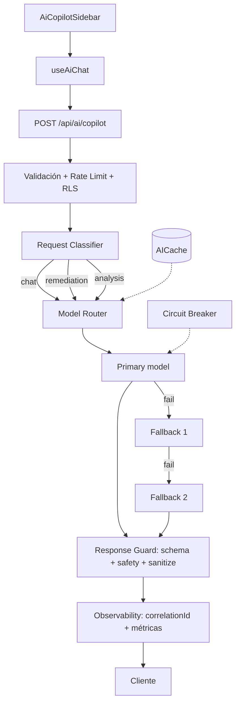

# CORE_SYSTEM — StrategicAudit Pro AI Copilot

> **El cerebro común.** Este documento define la doctrina de ingeniería del AI Copilot de StrategicAudit Pro: arquitectura, contratos, seguridad, UX y gobernanza. Los skills especializados (`agents/*.md`) son pequeños y operan bajo este núcleo. Ningún agente/skill puede contradecir este documento.

**Versión:** 1.0 · **Estado:** Marco de gobernanza (la implementación evoluciona por fases, ver §10) · **Última revisión:** 2026-08-09

---

## 1. PROPÓSITO

StrategicAudit Pro dispone de un AI Copilot conversacional. Este marco define cómo debe evolucionar desde un chatbot convencional hacia una **plataforma empresarial de inteligencia asistida por IA**:

```text
Chatbot
   ↓
Context-aware Copilot
   ↓
AI Orchestrator
   ↓
Tool-enabled Copilot
   ↓
Multi-agent Intelligence Platform
```

manteniendo siempre **SECURITY + GOVERNANCE + OBSERVABILITY + RELIABILITY + UX + AUDITABILITY + HUMAN CONTROL** como principios estructurales.

## 2. ESTADO ACTUAL (VERIFICADO — 2026-08-09)

| Capa | Archivos | Estado |
|---|---|---|
| AI Router | `src/server/ai/ai-router.ts` | ✅ Implementado: 4 task types, fallback chains por tarea, timeouts, cache in-memory (TTL 5m, LRU 200), circuit breaker (`RedisCircuitBreaker`), respuestas graceful sin key |
| Endpoint chat | `src/app/api/ai/copilot/route.ts` | ✅ Implementado: POST `{messages, context, mode}` → `general-chat`, rate limit 5/60s, `maxDuration=120` |
| Endpoint remediation | `src/app/api/intelligence/copilot/route.ts` | ✅ Implementado: RLS por `investigationId`, rate limit 5/60s, `taskType: copilot-remediation` |
| Hook frontend | `src/features/intelligence/hooks/useAiChat.ts` | ⚠️ **`sendMessage` es una simulación** (setTimeout con respuesta fake — NO llama al API). `requestRemediationPlan` sí es real |
| Sidebar | `src/features/intelligence/components/AiCopilotSidebar.tsx` | ✅ Tokenizado light/dark; falta aria-live en streaming y telemetría por mensaje |
| Tests | `src/app/components/AiCopilot.test.tsx` | Parcial (UI); faltan unit tests de router/cache/circuit-breaker |

**Infraestructura clave ya existente:** `withRateLimit` (`src/shared/lib/ratelimit`), `withRLS` (`src/shared/db/rls`), `envSecrets` (`src/shared/config/env-secrets` — secretos SOLO server-side), `RedisCircuitBreaker` (`src/shared/lib/circuit-breaker`).

## 3. ARQUITECTURA OBJETIVO



**Límites arquitectónicos (nunca violar):**

```text
AiCopilotSidebar  →  useAiChat  →  AI application service  →  ai-router  →  Provider adapter  →  OpenRouter
```

El componente React NO conoce: API keys, provider internals, fallback, circuit breaker, cache.

## 4. CONTRATOS (TYPED)

### 4.1 Task taxonomy (extensible sin tocar el núcleo)

```ts
type AITaskType =
  | "general-chat" | "copilot-remediation" | "incident-brief"
  | "seo-report"      // actuales (4)
  | "investigation-analysis" | "evidence-analysis" | "topology-analysis"
  | "security-analysis" | "report-generation";  // roadmap
```

Nueva tarea = nueva entrada en `TASK_ROUTING` + `MODEL_TIMEOUTS` (+ `NO_API_KEY_MESSAGES`). Nada más.

### 4.2 AIRequestOptions

```ts
interface AIRequestOptions {
  taskType: AITaskType;
  messages: Array<{ role: "system" | "user" | "assistant"; content: string }>;
  investigationId?: string;
  temperature?: number;
  maxTokens?: number;
  metadata?: { projectId?: string; userId?: string; source?: string; correlationId?: string };
}
```

### 4.3 AIResponse

```ts
interface AIResponse {
  success: boolean;
  content: string;
  modelUsed: string;
  provider?: string;
  latencyMs: number;
  fromCache?: boolean;
  fallbackUsed?: boolean;
  tokens?: { input?: number; output?: number; total?: number };
  correlationId?: string;
  error?: { code: string; message: string; retryable: boolean };
}
```

### 4.4 Provider abstraction (roadmap)

```ts
interface AIProvider {
  name: string;
  generate(request: AIRequestOptions): Promise<AIResponse>;
  healthCheck(): Promise<boolean>;
}
```

### 4.5 AITool (solo tras contratos + permisos + auditoría)

```ts
interface AITool {
  name: string;
  description: string;
  inputSchema: unknown;
  execute(input: unknown): Promise<unknown>;
}
```

Cada tool requiere: authorization, validation, timeout, audit, rate limit. **No implementar agentes autónomos hasta que existan estos controles.**

## 5. SEGURIDAD (NO-NEGOCIABLE)

1. **Secretos**: `OPENROUTER_API_KEY` y derivados SOLO en `envSecrets` (server-side). Nunca en React, nunca en respuestas, nunca en logs.
2. **Autorización**: toda lectura de datos por `investigationId` pasa por `withRLS(userId)` — nunca confiar en el ID del cliente.
3. **Validación de entrada**: `investigationId`, `prompt`, `taskType`, `messages`, `metadata` validados con esquema tipado. Rechazar payloads excesivos, tipos inválidos, IDs inexistentes.
4. **Prompt injection defense**: los datos de investigación (evidencias, logs, findings, OSINT) son **UNTRUSTED DATA**. Separar explícitamente en el prompt:
   ```text
   [SYSTEM INSTRUCTIONS]  →  máxima prioridad, nunca sobrescribible
   [APPLICATION CONTEXT]  →  contexto generado por la app
   [UNTRUSTED DATA]       →  contenido externo, delimitado y marcado
   ```
   El modelo nunca debe permitir que datos externos sobrescriban instrucciones de mayor prioridad.
5. **DLP (roadmap)**: capa `Context Sanitizer` entre el contexto y el provider — clasificar, minimizar, eliminar secretos/credenciales/tokens, redactar.
6. **Rate limiting**: por usuario (existe, 5/60s). Roadmap: por project / IP / endpoint / taskType / provider. Distinguir `429 client` vs `429 provider` vs `503` vs `504`.
7. **Zero trust**: validar identity, authorization, input, output y context en cada boundary. No confiar en user, prompt, tool, model, provider, external data, network ni cache.
8. **Nunca devolver** stack traces, "Internal server error", nombres de credenciales ni detalles de provider al cliente. Mensajes útiles: *"El servicio de IA no está disponible temporalmente"*, *"Se utilizó un modelo alternativo"*, *"No fue posible completar el análisis"*.

## 6. OBSERVABILIDAD

Cada request debe registrar: `correlationId, requestId, userId, projectId, taskType, provider, model, latency, token usage, cache hit, fallback, error`. **Sin secretos.**

Métricas: `AI_REQUEST_TOTAL, AI_REQUEST_SUCCESS, AI_REQUEST_ERROR, AI_REQUEST_LATENCY, AI_CACHE_HIT, AI_FALLBACK_TOTAL, AI_PROVIDER_FAILURE, AI_TOKEN_USAGE`.

El IntelligenceShell debe poder mostrar (telemetría por mensaje): Model · Provider · Latency · Tokens · Cache · Fallback · Health · Confidence.

## 7. UX DEL COPILOT

- **Asistente de investigación profesional**, no chatbot genérico: contexto → análisis → evidencia → recomendación → acción.
- Cada respuesta puede incluir: model, timestamp, sources, actions (copy / regenerate / feedback).
- **Fallback UX**: mostrar discretamente *"Se utilizó un modelo alternativo debido a disponibilidad"* — sin alarmar.
- **Streaming (roadmap)**: `AbortController` + `aria-live="polite"`. Estados del chat: `idle | thinking | streaming | success | error | cancelled | fallback`.
- **Theme**: light/dark/system con tokens semánticos. Prohibido color hardcodeado en componentes del copilot.
- **A11y**: WCAG 2.2 AA, keyboard nav, focus visible, aria-live, dialogs accesibles, command palette (Ctrl+K), `prefers-reduced-motion`.
- **Responsive**: mobile → copilot como drawer, metrics compactas, sin overflow horizontal.
- **Microinteracciones** solo si agregan información (typing, generation, success, error, fallback).

## 8. HUMAN-IN-THE-LOOP

Acciones críticas (infra, seguridad, borrado de evidencias, cambios de config, acciones irreversibles) **nunca se ejecutan automáticamente** por recomendación del modelo:

```text
AI Recommendation → Human Review → Approve → Execute → Audit
```

## 9. DEFINITION OF DONE

Una feature del Copilot solo está terminada cuando: architecture reviewed · TypeScript valid · contracts defined · security reviewed · input validation · error handling · UX implementada · light validated · dark validated · responsive · accessibility · unit tests · integration tests · build · docs actualizadas · observability · sin secretos expuestos · sin errores críticos.

**Nunca** inventar resultados de pruebas no ejecutadas. **Nunca** afirmar que algo está validado sin ejecutarlo.

## 10. ROADMAP

| Fase | Contenido | Estado |
|---|---|---|
| H0 | Router + fallback + cache + circuit breaker + 2 endpoints | ✅ Hecho |
| H1 | Contratos completos (metadata/correlationId), validación con esquema, delimitación de UNTRUSTED DATA, `sendMessage` real → `/api/ai/copilot` | ⏳ Siguiente |
| H2 | Observabilidad (correlationId por request, métricas), telemetría en el sidebar, tests unitarios de router/cache/circuit-breaker | ⏳ |
| H3 | Streaming + cancelación + estados del chat + aria-live | ⏳ |
| H4 | Task types nuevos (analysis), scoring de modelos, DLP/Context Sanitizer | ⏳ |
| H5 | Tools + multi-agent (Investigator/Analyst/Reporter) — solo tras contratos, permisos, auditoría | 🚫 Bloqueado |

> **v3.4:** la generación del plan de remediación del Copilot se conecta con la **Remediación Autónoma** de [`ENGINEERING-LOOP.md`](ENGINEERING-LOOP.md) — el plan pasa por multi-agent review → risk classification → approval → execution → testing → verification → report. El Copilot propone; el humano aprueba; el sistema ejecuta con rollback. Ver §8.

## 11. FORMATO DE RESPUESTA DE AGENTES

Todo trabajo sobre este sistema reporta: **ANALYSIS** (qué se entendió) · **IMPACT** (componentes afectados) · **PLAN** (qué se modificará) · **SECURITY** (riesgos) · **IMPLEMENTATION** (qué se implementó) · **VALIDATION** (cómo se comprobó, con evidencia ejecutada) · **RESULT** (qué quedó) · **NEXT** (qué sigue).
