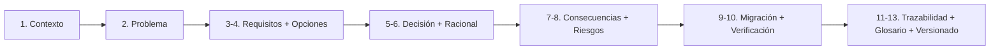

# ADR-000 — Plantilla de Architecture Decision Record

{: .no_toc }

<details open markdown="block">
  <summary>Tabla de contenidos</summary>
  {: .text-delta }
1. TOC
{:toc}
</details>

---

## 1. Contexto

**Propósito:** este documento define el **template obligatorio** para registrar decisiones de arquitectura (ADR) en SCAUDIT Pro, según el §38 del Engineering Master Plan (tarea T01-04). Un ADR responde a la pregunta *"¿por qué decidimos esto?"* para que el razonamiento no se pierda y los cambios futuros tengan un ancla.

**Alcance:** aplica a todo ADR de `docs/architecture/ADR/`. Cada ADR debe completar las 8 secciones obligatorias (Contexto → Problema → Opciones → Decisión → Racional → Consecuencias → Riesgos → Migración) con evidencia `[VERIFIED]` de commits y archivos.



---

## 2. Problema

Sin ADRs, las decisiones arquitectónicas solo existían de forma narrativa en `ENTERPRISE-ARCHITECTURE.md` y en los TDDs. El "por qué" de cada decisión se perdía, y cualquier cambio futuro carecía de punto de referencia verificable.

---

## 3. Requisitos que motivan la decisión

| REQ | Requisito | Criterio de aceptación |
|-----|-----------|------------------------|
| REQ-1 | Todo ADR usa esta plantilla | Las 8 secciones presentes |
| REQ-2 | Todo ADR cita evidencia real | Marcador `[VERIFIED]` con commit/archivo |
| REQ-3 | Todo ADR pasa el quality gate | `node scripts/quality-gate.mjs <adr> --min 80` |

---

## 4. Opciones consideradas

| Opción | Descripción | Veredicto |
|--------|-------------|-----------|
| (opcional) Sin ADR / documentación narrativa | Mantener el estado actual | Descartada |
| (opcional) Plantilla externa (Nygard, adr.github.io) | Formato estándar de la comunidad | Evaluada |
| **Plantilla interna 8 secciones** | Este documento | **Adoptada** |

---

## 5. Decisión

**Decisión:** (enunciado imperativo de la decisión, 1–3 frases).

| Campo | Valor |
|-------|-------|
| Estado | Accepted |
| Fecha | YYYY-MM-DD |
| Autor | StrategicConnex Engineering |
| Commits | `hash` (título) |
| Archivos | `ruta/archivo.ts` |
| Relacionado | CMP-XXX · REQ-XXX · [ENTERPRISE-ARCHITECTURE.md](../ENTERPRISE-ARCHITECTURE.md) |

---

## 6. Racional

- Argumento 1 con evidencia `[VERIFIED]`.
- Argumento 2 con evidencia `[VERIFIED]`.
- [ASSUMPTION] Supuesto razonable si aplica.

---

## 7. Consecuencias — arquitectura, datos, operaciones y seguridad

**Arquitectura:** (qué cambia en el grafo de dependencias — ver DEPENDENCY-GRAPH.md).

**Datos:** (tablas/esquemas afectados, si aplica).

**Operaciones y monitoring:** (impacto en jobs, métricas, logs).

**Seguridad y controles:** (impacto en trust boundaries; ver SYSTEM-MAP.md §7).

---

## 8. Riesgos y mitigaciones

| Riesgo | Severidad | Mitigación |
|--------|-----------|------------|
| (descripción) | LOW / MEDIUM / HIGH | (control real o plan de reversión) |

- [UNKNOWN] Cualquier limitación de verificación.

---

## 9. Migración — pasos y flujo de trabajo

```text
PASO 1 → … → PASO n (si la decisión implica migración; si no, "N/A — decisión ya aplicada")
```

---

## 10. Verificación — quality gate, API y tests

- `node scripts/quality-gate.mjs <adr> --min 80` → resultado en §13.
- Impacto en API: (lista de endpoints GET/POST afectados, o "ninguno").
- Impacto en tests: (tests unitarios/CI/CD afectados, o "ninguno").
- **Cross-check** con los TDDs y el ENTERPRISE-ARCHITECTURE: (resultado).

---

## 11. Trazabilidad

**MAT-120 — Trazabilidad del ADR**

| ID | Tipo | Qué cubre | Fuente verificada |
|----|------|-----------|-------------------|
| MAT-120 | Tabla | Este ADR | (commits/archivos citados en §5) |

---

## 12. Glosario

| Término | Definición |
|---------|------------|
| ADR | Architecture Decision Record: registro de una decisión arquitectónica |
| C05 | Principio de arquitectura (ver ENTERPRISE-ARCHITECTURE.md §7) |
| Fail-open | Degradación graciosa ante fallo de un servicio auxiliar |

---

## 13. Versionado y verificación

| Versión | Fecha | Cambios | Estado |
|---------|-------|---------|--------|
| 1.0 | 2026-08-02 | Creación de la plantilla (T01-04) | Aprobado |

**Resultado quality gate:** 100/100 (PASS, `--min 80`, 2026-08-02).

---

**Uso:** copiar este archivo a `ADR-XXX-<slug>.md` y sustituir las secciones 4–10 por el contenido del ADR concreto.
