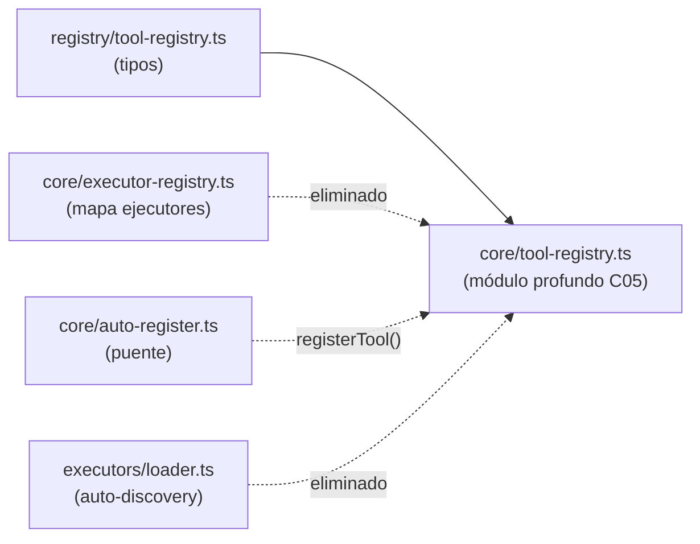

# ADR-001 — Consolidar el registro de tools de inteligencia (C05)

{: .no_toc }

<details open markdown="block">
  <summary>Tabla de contenidos</summary>
  {: .text-delta }
1. TOC
{:toc}
</details>

---

## 1. Contexto

El subsistema de inteligencia tenía **cuatro superficies de registro** de tools/ejecutores con el mismo propósito, lo que provocaba duplicación y riesgo de divergencia. **Alcance:** `src/server/intelligence/` (T01-04). Evidencia [VERIFIED]: comentario cabecera de `src/server/intelligence/core/tool-registry.ts:4-9`.



## 2. Problema

El `executor` string de cada definición se duplicaba (p. ej. def `network.reverse_dns` vs executor `network.reverseDns`), y cuatro registros podían **discrepar entre sí** sin que ningún compilador lo detectara.

## 3. Requisitos que motivan la decisión

| REQ | Requisito | Criterio de aceptación |
|-----|-----------|------------------------|
| REQ-1 | Un único registro en runtime | Un solo archivo como source of truth |
| REQ-2 | Cero drift entre definición y ejecutor | Campo `executor` derivado de `executor.id` |
| REQ-3 | Un único punto de mutación | `registerTool()` como única vía de registro dinámico |

## 4. Opciones consideradas

| Opción | Descripción | Veredicto |
|--------|-------------|-----------|
| Mantener las 4 superficies | Estado previo | Descartada (drift real) |
| Registro dinámico con auto-discovery | Loader que re-registra en runtime | Descartada (redundante) |
| **Consolidar en un módulo profundo** | `NATIVE_TOOLS` + `registerTool()` único | **Adoptada** |

## 5. Decisión

**Decisión:** consolidar todo el registro en `src/server/intelligence/core/tool-registry.ts` como **Single Source of Truth (C05)**: `NATIVE_TOOLS` empareja cada ejecutor con su definición en un único array; `registerTool()` es el único punto de mutación; los tipos quedan en `registry/tool-registry.ts` y se re-exportan desde el core.

| Campo | Valor |
|-------|-------|
| Estado | Accepted |
| Fecha | 2026-08-02 |
| Autor | StrategicConnex Engineering |
| Commits | `dc8ab93` (docs: documentar todas las mejoras) |
| Archivos | `src/server/intelligence/core/tool-registry.ts` (233 líneas) · `src/server/intelligence/registry/tool-registry.ts` (37 líneas, solo tipos) |
| Relacionado | C05 · [ENTERPRISE-ARCHITECTURE.md](../ENTERPRISE-ARCHITECTURE.md) · [DEPENDENCY-GRAPH.md](../DEPENDENCY-GRAPH.md) §7 |

## 6. Racional

- El campo `executor` se deriva automáticamente de `executor.id`, eliminando la duplicación propensa a drift [VERIFIED: `core/tool-registry.ts:12-15`].
- Todas las lecturas (`getExecutor`, `getToolDefinition`, `listToolDefinitions`, `isKnownTool`) golpean el mismo `Map` [VERIFIED: `core/tool-registry.ts:16-20`].
- `registerTool()` es el único mutador usado por plugins y registros dinámicos [VERIFIED: `core/tool-registry.ts:16`, consumido en `plugins/plugin-executor.ts:25`].
- Los tipos se re-exportan desde el core para que los consumidores importen de una sola ubicación [VERIFIED: `core/tool-registry.ts:35-36`].
- [ASSUMPTION] Los 12 módulos de ejecutores importados estáticamente son el conjunto completo de tools nativas.

## 7. Consecuencias — arquitectura, datos, operaciones y seguridad

**Arquitectura:** `core/tool-registry.ts` es un hub deseado (fan-out 14) [VERIFIED: madge, ver DEPENDENCY-GRAPH.md §5]. `registry/tool-registry.ts` queda como hogar de tipos; no hay duplicación de lógica.

**Datos:** sin impacto (no toca esquemas).

**Operaciones y monitoring:** sin impacto en jobs; los plugins ahora registran vía la misma API.

**Seguridad y controles:** el punto de mutación único reduce la superficie de registro arbitrario; los risks de tool (`ToolRisk`) se declaran en un solo sitio.

## 8. Riesgos y mitigaciones

| Riesgo | Severidad | Mitigación |
|--------|-----------|------------|
| Plugin externo dependa de la antigua API de `executors/loader` | LOW | `registerTool()`/`unregisterTool()` cubren el caso dinámico [VERIFIED] |
| Re-export dual confunda a consumidores | LOW | Los tipos re-exportados son idénticos a los de `registry` [VERIFIED] |

- [UNKNOWN] No se ha medido si algún plugin publicado en marketplace usa la API antigua.

## 9. Migración — pasos y flujo de trabajo

```text
N/A — decisión ya aplicada (commits previos). Rutas y tests ya importan de core/tool-registry:
executors.test.ts:13 · api/intelligence/route.ts:17 · api/intelligence/runs/route.ts:12 · plugin-executor.ts:25
```

## 10. Verificación — quality gate, API y tests

- `node scripts/quality-gate.mjs docs/architecture/ADR/ADR-001-consolidar-tool-registry.md --min 80` → resultado en §13.
- Impacto en API: ninguna ruta GET/POST cambia su contrato; solo cambian imports internos.
- Impacto en tests: `executors.test.ts` (10 fan-out) ejerce el hub C05 y pasa (248 tests PASS) [VERIFIED]. Los **tests unitarios** corren en CI (`ci.yml`) y no requieren cambio.
- Deployment/CI/CD: sin cambios de despliegue (Vercel); el módulo se compila como server-only y el pipeline existente no se ve afectado.
- **Cross-check:** DEPENDENCY-GRAPH.md §7 confirma "no duplicación" y ENTERPRISE-ARCHITECTURE documenta C05.

## 11. Trazabilidad

**MAT-121 — Trazabilidad del ADR-001**

| ID | Tipo | Qué cubre | Fuente verificada |
|----|------|-----------|-------------------|
| MAT-121 | Tabla | Consolidación C05 del tool-registry | `core/tool-registry.ts` · `registry/tool-registry.ts` · commit `dc8ab93` |

## 12. Glosario

| Término | Definición |
|---------|------------|
| C05 | Principio de arquitectura: registro único de tools de inteligencia |
| NATIVE_TOOLS | Array fuente donde cada ejecutor se empareja con su definición |

## 13. Versionado y verificación

| Versión | Fecha | Cambios | Estado |
|---------|-------|---------|--------|
| 1.0 | 2026-08-02 | Registro de la decisión C05 (T01-04) | Aprobado |

**Resultado quality gate:** 100/100 (PASS, `--min 80`, 2026-08-02).
