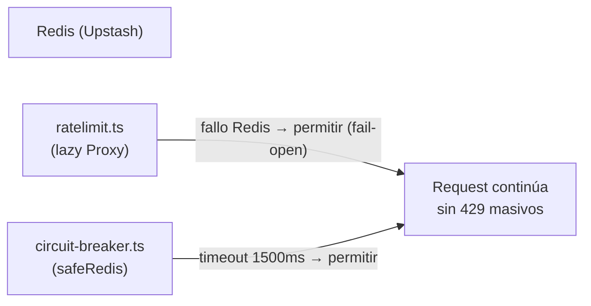

# ADR-002 — Fail-open en rate limit y circuit breaker (Redis)

{: .no_toc }

<details open markdown="block">
  <summary>Tabla de contenidos</summary>
  {: .text-delta }
1. TOC
{:toc}
</details>

---

## 1. Contexto

El rate limiting y el circuit breaker dependen de **Upstash Redis**. Si Redis cae, un fail-closed convertiría una caída parcial en una **caída total del producto** o, peor, en **429 masivos** para todos los usuarios. **Alcance:** `src/shared/lib/ratelimit.ts` y `src/shared/lib/circuit-breaker.ts` (T01-04).



## 2. Problema

Un fallo de Redis debía **degradar con gracia** (permitir la operación) en lugar de bloquear falsamente a usuarios legítimos o descartar resultados de ejecutores.

## 3. Requisitos que motivan la decisión

| REQ | Requisito | Criterio de aceptación |
|-----|-----------|------------------------|
| REQ-1 | Nunca 429 masivos por caída de Redis | Rate limit hace fail-open |
| REQ-2 | No descartar resultados exitosos por timeout | Circuit breaker hace fail-open |
| REQ-3 | No instanciar Redis en build | Cliente lazy vía `Proxy` |

## 4. Opciones consideradas

| Opción | Descripción | Veredicto |
|--------|-------------|-----------|
| Fail-closed | Ante fallo de Redis, denegar | Descartada (caída total) |
| Fail-open siempre | Permitir siempre | **Adoptada** (degradación graciosa) |
| Cache local como respaldo | TTL local en caso de fallo | Evaluada, no necesaria |

## 5. Decisión

**Decisión:** implementar **fail-open** tanto en el rate limit como en el circuit breaker. El rate limit usa un cliente Redis lazy (`Proxy`) que no se instancia en build; ante fallo permite la operación. El circuit breaker envuelve cada op de Redis con timeout de 1500 ms y, ante error, devuelve el fallback permitiendo la operación.

| Campo | Valor |
|-------|-------|
| Estado | Accepted |
| Fecha | 2026-08-02 |
| Autor | StrategicConnex Engineering |
| Commits | `eda77c4` (ratelimit fail-open) · `d1b8723` (allowlist + 40 req/min) · `d59543a` (circuit-breaker fail-open) |
| Archivos | `src/shared/lib/ratelimit.ts` · `src/shared/lib/circuit-breaker.ts` |
| Relacionado | [SYSTEM-MAP.md](../SYSTEM-MAP.md) §3 · [ENTERPRISE-ARCHITECTURE.md](../ENTERPRISE-ARCHITECTURE.md) |

## 6. Racional

- Cliente Redis lazy: `new Proxy({} as Redis, ...)` evita eager instantiation en build [VERIFIED: `ratelimit.ts:22`].
- Fail-open explícito con comentario: "un outage de Redis jamás debe bloquear ni falsear" [VERIFIED: `circuit-breaker.ts:35-37`].
- `safeRedis` rechaza con `Redis op timeout` a los 1500 ms y retorna el fallback [VERIFIED: `circuit-breaker.ts:23,31`].
- `CircuitState` (CLOSED/OPEN/HALF_OPEN) [VERIFIED: `circuit-breaker.ts:3-6`].
- [ASSUMPTION] En un ataque coordinado, fail-open degrada la protección; se compensa con allowlist y límites en capas de proxy.

## 7. Consecuencias — arquitectura, datos, operaciones y seguridad

**Arquitectura:** `ratelimit.ts` (fan-in 17) y `circuit-breaker.ts` son dependencias compartidas de los route handlers (ver DEPENDENCY-GRAPH.md §5).

**Datos:** sin impacto.

**Operaciones y monitoring:** una caída de Redis genera warnings en consola (`[CircuitBreaker] Redis op failed (fail-open)`) y se observa en los logs; los headers de rate limit siguen emitiéndose cuando Redis responde.

**Seguridad y controles:** los 429 auténticos se mantienen cuando Redis responde; la cabecera de respuesta usa el formato IETF `RateLimit-Limit/Remaining/Reset` + legacy `X-RateLimit-*` [VERIFIED: `ratelimit.ts:127-132`]. La `EMAIL_ALLOWLIST` (incluye `palacios_juan@hotmail.com`) exime a cuentas críticas [VERIFIED: `ratelimit.ts:37`].

## 8. Riesgos y mitigaciones

| Riesgo | Severidad | Mitigación |
|--------|-----------|------------|
| Abuso de tasa durante outage de Redis | MEDIUM | Fail-open acotado al periodo de caída; logs de warning; límite global en capas edge |
| Falsear 429 masivos en login | HIGH | `isEmailAllowlisted()` + 40 req/min (commit `d1b8723`) [VERIFIED] |

- [UNKNOWN] Duración máxima tolerada de un outage de Redis sin degradación de seguridad no está documentada.

## 9. Migración — pasos y flujo de trabajo

```text
N/A — decisión ya aplicada. Los consumidores importan safeRedis/rateLimit sin cambios de firma.
```

## 10. Verificación — quality gate, API y tests

- `node scripts/quality-gate.mjs docs/architecture/ADR/ADR-002-fail-open-rate-limit.md --min 80` → resultado en §13.
- Impacto en API: los endpoints GET/POST afectados (login, `/api/intelligence`) no cambian contrato; solo comportamiento ante fallo de Redis.
- Impacto en tests: suite Vitest pasa (248 tests) y los circuit breakers se ejercitan en tests de ejecutores [VERIFIED]. Los **tests unitarios** de `ratelimit`/`circuit-breaker` corren en CI.
- Deployment/CI/CD: sin cambios de despliegue (Vercel); el cliente lazy evita romper el build, y el pipeline (`ci.yml`) permanece intacto.
- **Cross-check:** SYSTEM-MAP.md §3 (FLOW-101) y DEPENDENCY-GRAPH.md §9 documentan el mismo comportamiento.

## 11. Trazabilidad

**MAT-122 — Trazabilidad del ADR-002**

| ID | Tipo | Qué cubre | Fuente verificada |
|----|------|-----------|-------------------|
| MAT-122 | Tabla | Fail-open rate limit + circuit breaker | `ratelimit.ts` · `circuit-breaker.ts` · commits `eda77c4`/`d1b8723`/`d59543a` |

## 12. Glosario

| Término | Definición |
|---------|------------|
| Fail-open | Permitir la operación cuando un servicio auxiliar falla |
| Lazy Redis | Cliente Redis instanciado bajo demanda vía `Proxy` para no romper el build |

## 13. Versionado y verificación

| Versión | Fecha | Cambios | Estado |
|---------|-------|---------|--------|
| 1.0 | 2026-08-02 | Registro de la decisión fail-open (T01-04) | Aprobado |

**Resultado quality gate:** 100/100 (PASS, `--min 80`, 2026-08-02).
