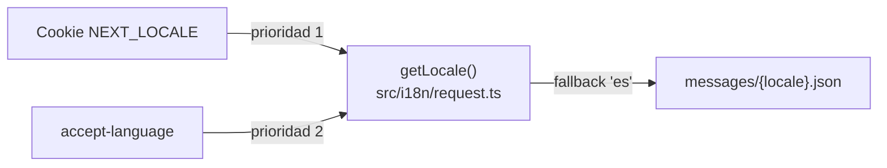

# ADR-003 — i18n cookie-based sin prefijo de URL (next-intl)

{: .no_toc }

<details open markdown="block">
  <summary>Tabla de contenidos</summary>
  {: .text-delta }
1. TOC
{:toc}
</details>

---

## 1. Contexto

La aplicación es bilingüe (es/en) con detección de idioma y selector manual. La pregunta era **dónde persistir el locale** en un App Router desplegado en Vercel sin bloquear el SEO de rutas. **Alcance:** `src/i18n/` + `messages/` (T01-04). Evidencia [VERIFIED]: `src/i18n/routing.ts:3-7`.



## 2. Problema

Definir el locale con `localePrefix` en la URL (`/es/...`) duplicaría rutas y complicaría el proxy CSP y el enrutado existente; sin persistencia, el idioma se perdía en cada navegación.

## 3. Requisitos que motivan la decisión

| REQ | Requisito | Criterio de aceptación |
|-----|-----------|------------------------|
| REQ-1 | Persistir idioma entre navegaciones | Cookie por sesión |
| REQ-2 | Sin prefijo de URL | `localePrefix: "never"` |
| REQ-3 | Fallback determinista | Default `es` |

## 4. Opciones consideradas

| Opción | Descripción | Veredicto |
|--------|-------------|-----------|
| Prefijo de URL (`/es`, `/en`) | Locale en path | Descartada (duplica rutas) |
| Solo `accept-language` | Detección sin persistencia | Descartada (no hay selector persistente) |
| **Cookie `NEXT_LOCALE`** | Persistencia + detección | **Adoptada** |

## 5. Decisión

**Decisión:** usar **next-intl 4.13.4** con `localePrefix: "never"` (sin prefijo en URL, cookie only). `getLocale()` prioriza la cookie `NEXT_LOCALE`; si no existe, usa `accept-language`; siempre con fallback `es`. Los mensajes se cargan de `messages/{locale}.json`.

| Campo | Valor |
|-------|-------|
| Estado | Accepted |
| Fecha | 2026-08-02 |
| Autor | StrategicConnex Engineering |
| Commits | `330d73f` (P3 PWA Mobile, i18n multi-language, Benchmarking, Tech Profiling) · `b95ed1a` (AI prompts bilingües) |
| Archivos | `src/i18n/routing.ts` · `src/i18n/request.ts` · `messages/es.json` (~22 KB) · `messages/en.json` (~21 KB) |
| Relacionado | [SYSTEM-MAP.md](../SYSTEM-MAP.md) §3 |

## 6. Racional

- `routing.ts` define `locales: ["es","en"]`, `defaultLocale: "es"`, `localeDetection: true`, `localePrefix: "never"` [VERIFIED].
- `getLocale()` lee `NEXT_LOCALE` y, en su ausencia, deriva el preferido de `accept-language` [VERIFIED: `request.ts:17-29`].
- `getMessages()` importa el JSON del locale con fallback a `es` [VERIFIED: `request.ts:37-42`].
- [ASSUMPTION] El SEO multilingüe no es un requisito actual del producto.

## 7. Consecuencias — arquitectura, datos, operaciones y seguridad

**Arquitectura:** las rutas no se multiplican; el proxy (`src/proxy.ts`) no necesita reescribir paths por locale.

**Datos:** sin impacto.

**Operaciones y monitoring:** la cookie `NEXT_LOCALE` se emite en todas las respuestas; `LanguageSwitcher` la actualiza.

**Seguridad y controles:** cookie no marcada como secreta (solo preferencia de idioma); el locale se valida contra `routing.locales` antes de usarse, evitando inyección de paths de mensajes [VERIFIED: `request.ts:21`].

## 8. Riesgos y mitigaciones

| Riesgo | Severidad | Mitigación |
|--------|-----------|------------|
| SEO multilingüe sin prefijo de URL | MEDIUM | Aceptado; si se requiere SEO, migrar a `localePrefix: "as-needed"` |
| Cookie adulterada | LOW | Validación contra lista cerrada de locales [VERIFIED] |

- [UNKNOWN] No hay medición de impacto SEO actual.

## 9. Migración — pasos y flujo de trabajo

```text
N/A — decisión ya aplicada. Nuevos mensajes: añadir keys a messages/{locale}.json y usar useTranslations().
```

## 10. Verificación — quality gate, API y tests

- `node scripts/quality-gate.mjs docs/architecture/ADR/ADR-003-i18n-cookie-based.md --min 80` → resultado en §13.
- Impacto en API: ninguna ruta GET/POST cambia; next-intl inyecta su config en layouts vía provider.
- Impacto en tests: no hay tests unitarios específicos de i18n; verificación manual del selector en UI.
- **Cross-check:** SYSTEM-MAP.md §3 cita `app/layout.tsx` como integrador de i18n.

## 11. Trazabilidad

**MAT-123 — Trazabilidad del ADR-003**

| ID | Tipo | Qué cubre | Fuente verificada |
|----|------|-----------|-------------------|
| MAT-123 | Tabla | i18n cookie-based | `src/i18n/routing.ts` · `request.ts` · commits `330d73f`/`b95ed1a` |

## 12. Glosario

| Término | Definición |
|---------|------------|
| localePrefix | Opción de next-intl que controla si el locale aparece en la URL |
| NEXT_LOCALE | Cookie de sesión que persiste el idioma elegido |

## 13. Versionado y verificación

| Versión | Fecha | Cambios | Estado |
|---------|-------|---------|--------|
| 1.0 | 2026-08-02 | Registro de la decisión i18n (T01-04) | Aprobado |

**Resultado quality gate:** 100/100 (PASS, `--min 80`, 2026-08-02).
