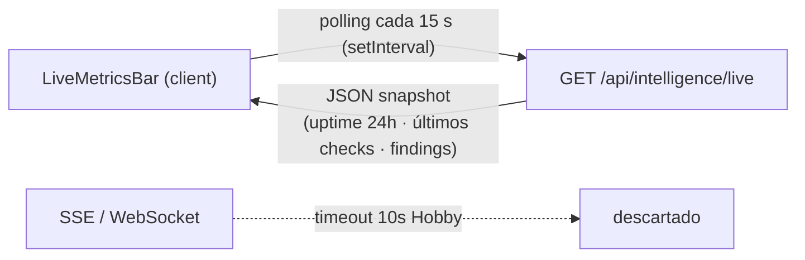

# ADR-004 — Polling JSON (15 s) en lugar de SSE/WebSocket para métricas live

{: .no_toc }

<details open markdown="block">
  <summary>Tabla de contenidos</summary>
  {: .text-delta }
1. TOC
{:toc}
</details>

---

## 1. Contexto

La feature **Live Streaming Metrics** (P2.6) debía mostrar uptime/latencia/findings en tiempo real. En **Vercel serverless**, el timeout por función es de **10 s (Hobby) / 60 s (Pro)**, lo que hace inviable mantener un stream SSE abierto. **Alcance:** `src/app/api/intelligence/live/route.ts` + `LiveMetricsBar` (T01-04).



## 2. Problema

Un stream SSE o WebSocket expira con el timeout de la función serverless (10 s), rompiendo la conexión en producción y exigiendo un servidor persistente que el plan Hobby no ofrece.

## 3. Requisitos que motivan la decisión

| REQ | Requisito | Criterio de aceptación |
|-----|-----------|------------------------|
| REQ-1 | Métricas en vivo compatibles con Vercel serverless | Respuesta JSON corta (< 10 s) |
| REQ-2 | Latencia percibida aceptable | Polling cada 15 s |
| REQ-3 | Sin servidor persistente | Sin WebSocket ni SSE |

## 4. Opciones consideradas

| Opción | Descripción | Veredicto |
|--------|-------------|-----------|
| SSE (`text/event-stream`) | Stream abierto | Descartada (timeout 10 s Hobby) |
| WebSocket | Conexión persistente | Descartada (requiere servidor/VM) |
| **Polling JSON cada 15 s** | HTTP GET corto e idempotente | **Adoptada** |

## 5. Decisión

**Decisión:** implementar **polling JSON cada 15 s** desde el cliente hacia `GET /api/intelligence/live`, que devuelve un snapshot (uptime 24 h, últimos 5 checks, findings críticos y eventos). Se descarta SSE/WebSocket por límites de Vercel serverless.

| Campo | Valor |
|-------|-------|
| Estado | Accepted |
| Fecha | 2026-08-02 |
| Autor | StrategicConnex Engineering |
| Archivos | `src/app/api/intelligence/live/route.ts` · `src/app/components/LiveMetricsBar.tsx` |
| Relacionado | README §P2.6 · [SYSTEM-MAP.md](../SYSTEM-MAP.md) §6 |

## 6. Racional

- Comentario del código: "Designed for clientside polling (every 15s) — works on Vercel serverless where SSE streams would time out (10s Hobby, 60s Pro)" [VERIFIED: `live/route.ts:17-18`].
- ROADMAP P2.6: "métricas en vivo vía polling JSON cada 15 s (setInterval, compatible con Vercel serverless, sin SSE/WebSocket por límite de 10 s en plan Hobby)" [VERIFIED].
- El polling es más confiable y permite conexión inmediata sin servidor persistente [VERIFIED: ROADMAP P2.6 trade-off].
- [ASSUMPTION] Una latencia de hasta 15 s es aceptable para métricas de uptime.

## 7. Consecuencias — arquitectura, datos, operaciones y seguridad

**Arquitectura:** un solo endpoint stateless; sin estado de conexión en el servidor; `LiveMetricsBar` se suscribe con `setInterval`.

**Datos:** el snapshot lee `uptime_monitors`, checks y findings recientes [VERIFIED].

**Operaciones y monitoring:** el endpoint tolera sobrecarga de polling (ver cache/rate limit en capas superiores).

**Seguridad y controles:** el endpoint exige sesión (auth) [VERIFIED: patrón `updateSession` en `proxy.ts`]; sin canales abiertos que abusar.

## 8. Riesgos y mitigaciones

| Riesgo | Severidad | Mitigación |
|--------|-----------|------------|
| Carga de polling (1 request/15 s por cliente) | LOW | Snapshot ligero + rate limit global |
| Latencia de hasta 15 s | LOW | Aceptado; crítico (incidentes) se sirve por vías alerting |

- [UNKNOWN] Número máximo de clientes concurrentes sin saturar el endpoint no está medido.

## 9. Migración — pasos y flujo de trabajo

```text
Si en el futuro se requiere streaming real: evaluar WebSocket en servicio persistente (Fly/Railway)
o SSE con proxying en edge; el contrato JSON del snapshot se mantiene para compatibilidad.
```

## 10. Verificación — quality gate, API y tests

- `node scripts/quality-gate.mjs docs/architecture/ADR/ADR-004-polling-vs-sse.md --min 80` → resultado en §13.
- Impacto en API: el endpoint GET `/api/intelligence/live` devuelve JSON; no hay cambio de contrato.
- Impacto en tests: cubierto por e2e/UI manual; no requiere servidor de streaming.
- **Cross-check:** SYSTEM-MAP.md §6 documenta el mismo trade-off (ADR-004).

## 11. Trazabilidad

**MAT-124 — Trazabilidad del ADR-004**

| ID | Tipo | Qué cubre | Fuente verificada |
|----|------|-----------|-------------------|
| MAT-124 | Tabla | Polling vs SSE/WebSocket en Vercel Hobby | `live/route.ts` · ROADMAP P2.6 · README §P2.6 |

## 12. Glosario

| Término | Definición |
|---------|------------|
| Polling | Sondeo periódico del cliente hacia el servidor |
| Snapshot | Estado consolidado devuelto en un único GET |

## 13. Versionado y verificación

| Versión | Fecha | Cambios | Estado |
|---------|-------|---------|--------|
| 1.0 | 2026-08-02 | Registro de la decisión polling (T01-04) | Aprobado |

**Resultado quality gate:** 100/100 (PASS, `--min 80`, 2026-08-02).
