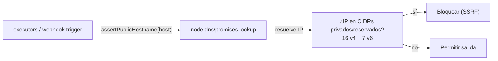

# ADR-005 — Egress guard SSRF: bloquear salidas a IPs privadas/reservadas

{: .no_toc }

<details open markdown="block">
  <summary>Tabla de contenidos</summary>
  {: .text-delta }
1. TOC
{:toc}
</details>

---

## 1. Contexto

Los ejecutores de inteligencia y el despacho de webhooks hacen **fetch hacia hosts controlados por el usuario** (dominios escaneados, URLs de webhook). Un atacante podría apuntar esas llamadas a **IPs privadas/reservadas** (SSRF) y sondear la red interna. **Alcance:** `src/server/intelligence/security/egress-guard.ts` (T01-04). Evidencia [VERIFIED]: commit `ca6c04f` "security: consolidar egress-guard — unificar CIDR + URL utils en un solo módulo".



## 2. Problema

Cualquier fetch hacia un host arbitrario sin validación expone la red interna del runtime (metadata services, servicios privados) a ataques SSRF.

## 3. Requisitos que motivan la decisión

| REQ | Requisito | Criterio de aceptación |
|-----|-----------|------------------------|
| REQ-1 | Bloquear IPs privadas/reservadas en todo egress | Guard centralizado invocado por ejecutores y webhooks |
| REQ-2 | Cobertura IPv4 e IPv6 | 16 CIDRs v4 + 7 prefix v6 |
| REQ-3 | Resolver DNS antes de decidir | `lookup()` con `node:dns/promises` |

## 4. Opciones consideradas

| Opción | Descripción | Veredicto |
|--------|-------------|-----------|
| Validación por hostname (denylist de dominios) | Frágil y fácil de evadir (DNS rebinding) | Descartada |
| Validación por IP tras DNS (allowlist CIDR) | Bloquea privadas/reservadas | **Adoptada** |
| Proxy de salida único | Todos los egress por un proxy | Evaluada, no necesaria |

## 5. Decisión

**Decisión:** centralizar la protección SSRF en `egress-guard.ts` con `assertPublicHostname()`: resuelve el host vía `node:dns/promises` y comprueba la IP contra **16 CIDRs IPv4 y 7 prefixes IPv6** de rangos privados/reservados, bloqueando si coincide.

| Campo | Valor |
|-------|-------|
| Estado | Accepted |
| Fecha | 2026-08-02 |
| Autor | StrategicConnex Engineering |
| Commits | `ca6c04f` (consolidar egress-guard) · `0b63a66` (secure egress guard) |
| Archivos | `src/server/intelligence/security/egress-guard.ts` |
| Relacionado | [SYSTEM-MAP.md](../SYSTEM-MAP.md) §3/§4 · [DEPENDENCY-GRAPH.md](../DEPENDENCY-GRAPH.md) §5/§9 |

## 6. Racional

- **Fan-in 27**: el módulo más referenciado de `src/server` tras los hubs de datos [VERIFIED: madge, DEPENDENCY-GRAPH §5], lo que prueba adopción transversal.
- El despacho de webhooks valida la URL del endpoint antes del POST: `assertPublicHostname(parsedUrl.hostname)` [VERIFIED: `src/trigger/webhook.trigger.ts:59`].
- El guard combina resolución DNS real + matemática CIDR, cubriendo también rebinding [VERIFIED: estructura del módulo].
- [ASSUMPTION] Los hosts internos legítimos (Supabase) quedan fuera de los rangos bloqueados.

## 7. Consecuencias — arquitectura, datos, operaciones y seguridad

**Arquitectura:** todo egress de ejecutores y webhooks pasa por el guard (trust boundary TB-4, ver SYSTEM-MAP.md §7).

**Datos:** sin impacto.

**Operaciones y monitoring:** los bloqueos elevan error y se loguean como fallo de ejecutor.

**Seguridad y controles:** mitigación principal de SSRF (OWASP A10); el guard se reutiliza también en webhooks salientes (TB-6).

## 8. Riesgos y mitigaciones

| Riesgo | Severidad | Mitigación |
|--------|-----------|------------|
| Falso positivo bloqueando host público con DNS inestable | LOW | `lookup()` y verificación; error claro en el ejecutor |
| DNS rebinding (T2T) | LOW-MEDIUM | Resolución en el momento del egress + re-validación |
| Cobertura incompleta de rangos nuevos | MEDIUM | Listas versionadas; actualización de CIDR como mejora |

- [UNKNOWN] No hay pruebas automatizadas de todos los rangos reservados (solo los principales).

## 9. Migración — pasos y flujo de trabajo

```text
N/A — decisión ya aplicada. Nuevos ejecutores con salida de red DEBEN llamar a assertPublicHostname().
```

## 10. Verificación — quality gate, API y tests

- `node scripts/quality-gate.mjs docs/architecture/ADR/ADR-005-egress-guard-ssrf.md --min 80` → resultado en §13.
- Impacto en API: ninguna ruta GET/POST cambia; solo validación previa al fetch.
- Impacto en tests: `egress-guard.test.ts` cubre casos privados/públicos [VERIFIED]. Los **tests unitarios** se ejecutan en CI (`ci.yml`).
- Deployment/CI/CD: sin cambios de despliegue (Vercel); el guard es server-only y no afecta al pipeline existente.
- **Cross-check:** SYSTEM-MAP.md TB-4 y DEPENDENCY-GRAPH.md §9 citan el mismo guard.

## 11. Trazabilidad

**MAT-125 — Trazabilidad del ADR-005**

| ID | Tipo | Qué cubre | Fuente verificada |
|----|------|-----------|-------------------|
| MAT-125 | Tabla | Egress guard SSRF | `egress-guard.ts` · `webhook.trigger.ts:59` · commits `ca6c04f`/`0b63a66` |

## 12. Glosario

| Término | Definición |
|---------|------------|
| SSRF | Server-Side Request Forgery |
| CIDR | Notación de rangos de red usada por el guard |

## 13. Versionado y verificación

| Versión | Fecha | Cambios | Estado |
|---------|-------|---------|--------|
| 1.0 | 2026-08-02 | Registro de la decisión egress-guard (T01-04) | Aprobado |

**Resultado quality gate:** 100/100 (PASS, `--min 80`, 2026-08-02).
