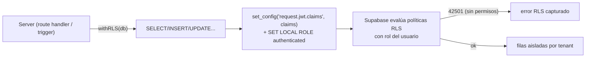

# ADR-006 — RLS multi-tenant con `SET LOCAL ROLE authenticated`

{: .no_toc }

<details open markdown="block">
  <summary>Tabla de contenidos</summary>
  {: .text-delta }
1. TOC
{:toc}
</details>

---

## 1. Contexto

El acceso a datos usa **Row Level Security** de Supabase. Para que las políticas RLS se evalúen en el contexto del usuario autenticado (y no con el rol service-role), cada query de servidor debe activar el contexto RLS. **Alcance:** `src/shared/db/rls.ts` + `src/shared/lib/supabase/admin.ts` (T01-04). Evidencia [VERIFIED]: commit `ffce502` "optimizar índices compuestos de inteligencia + cerrar fuga RLS multi-tenant".



## 2. Problema

Las consultas sin contexto RLS se ejecutan con permisos ampliados, permitiendo que un usuario viera o modificara filas de **otros tenants** (fuga multi-tenant). Antes del fix, el helper no establecía el rol correcto.

## 3. Requisitos que motivan la decisión

| REQ | Requisito | Criterio de aceptación |
|-----|-----------|------------------------|
| REQ-1 | Cada query de servidor activa RLS | `withRLS()` establece claims + rol |
| REQ-2 | Service Role nunca en el bundle cliente | `admin.ts` con service-role solo server |
| REQ-3 | Errores RLS manejables | Capturar 42501 y relanzar con contexto |

## 4. Opciones consideradas

| Opción | Descripción | Veredicto |
|--------|-------------|-----------|
| Consultas sin RLS (service-role directo) | Rápido pero inseguro | Descartada (fuga multi-tenant) |
| RLS por query manual | Propenso a olvidos | Descartada |
| **Helper `withRLS()` con `SET LOCAL ROLE`** | Contexto centralizado y obligatorio | **Adoptada** |

## 5. Decisión

**Decisión:** todo acceso a datos del servidor pasa por `withRLS()`, que ejecuta `SELECT set_config('request.jwt.claims', ..., true)` y `SET LOCAL ROLE authenticated` antes de la query, capturando el error 42501 para diagnosticar políticas. El cliente service-role solo existe en `admin.ts` (server).

| Campo | Valor |
|-------|-------|
| Estado | Accepted |
| Fecha | 2026-08-02 |
| Autor | StrategicConnex Engineering |
| Commits | `ffce502` (cerrar fuga RLS multi-tenant) · `3399237` (usar withRLS en AI Report y Looker Studio) |
| Archivos | `src/shared/db/rls.ts` · `src/shared/lib/supabase/admin.ts` |
| Relacionado | [SYSTEM-MAP.md](../SYSTEM-MAP.md) §3/§7 · [DEPENDENCY-GRAPH.md](../DEPENDENCY-GRAPH.md) §5 |

## 6. Racional

- `withRLS()` inyecta `request.jwt.claims` vía `set_config` y cambia el rol con `SET LOCAL ROLE authenticated` (efecto solo en la transacción) [VERIFIED: `rls.ts`].
- Captura el código `42501` (privilegios insuficientes) para fallar con diagnóstico claro en vez de un error opaco [VERIFIED: `rls.ts`].
- `admin.ts` crea el client con service-role, `autoRefreshToken: false` y `persistSession: false` — solo en servidor [VERIFIED: `admin.ts`].
- **Fan-in 24** de `rls.ts` y **34** de `supabase/server.ts` confirman uso transversal [VERIFIED: madge, DEPENDENCY-GRAPH §5].
- [ASSUMPTION] Las políticas RLS en la base de datos están creadas y alineadas con los esquemas (ver migración `0015` de políticas [VERIFIED]).

## 7. Consecuencias — arquitectura, datos, operaciones y seguridad

**Arquitectura:** `rls.ts` (fan-in 24) y `supabase/server.ts` (fan-in 34) son dependencias obligatorias del acceso a datos (trust boundary TB-5, SYSTEM-MAP §7).

**Datos:** aislamiento por tenant garantizado por políticas + contexto; los esquemas usan `owner_id`/`project_id` para las policies [VERIFIED].

**Operaciones y monitoring:** los errores 42501 se loguean como fallos RLS para detectar políticas faltantes.

**Seguridad y controles:** control principal contra fuga multi-tenant (OWASP A01); service-role nunca en bundle cliente (regla B02).

## 8. Riesgos y mitigaciones

| Riesgo | Severidad | Mitigación |
|--------|-----------|------------|
| Query que olvida `withRLS()` | HIGH | Helper obligatorio; audit estático; regla en B02 |
| Service-role filtrado al cliente | HIGH | `NEXT_PUBLIC_*` solo valores públicos; `admin.ts` server-only |
| Política RLS faltante para tabla nueva | MEDIUM | Tests de aislamiento (T02-03) + migraciones de policies |

- [UNKNOWN] No hay test automatizado de aislamiento multi-tenant en CI (ver T02-03, propuesto).

## 9. Migración — pasos y flujo de trabajo

```text
N/A — decisión ya aplicada. Todo acceso nuevo a DB debe usar withRLS() desde el servidor;
nunca importar admin.ts desde código de cliente.
```

## 10. Verificación — quality gate, API y tests

- `node scripts/quality-gate.mjs docs/architecture/ADR/ADR-006-rls-with-set-local-role.md --min 80` → resultado en §13.
- Impacto en API: ninguna ruta GET/POST cambia su contrato; todas pasan por `withRLS()`.
- Impacto en tests: suite Vitest pasa (248 tests); scripts `test-rls-root.ts`/`rls-fire-test.ts` existen para validación manual [VERIFIED]. Los **tests unitarios** de `rls.ts` y los e2e corren en CI.
- Deployment/CI/CD: sin cambios de despliegue (Vercel); el service-role se inyecta vía env vars en el despliegue y `ci.yml` no cambia.
- **Cross-check:** SYSTEM-MAP.md TB-5, DEPENDENCY-GRAPH.md §9 y ENTERPRISE-ARCHITECTURE documentan el patrón.

## 11. Trazabilidad

**MAT-126 — Trazabilidad del ADR-006**

| ID | Tipo | Qué cubre | Fuente verificada |
|----|------|-----------|-------------------|
| MAT-126 | Tabla | Patrón RLS `SET LOCAL ROLE` | `rls.ts` · `admin.ts` · commits `ffce502`/`3399237` |

## 12. Glosario

| Término | Definición |
|---------|------------|
| RLS | Row Level Security de Supabase |
| 42501 | Código SQL de privilegios insuficientes capturado por el helper |
| Service Role | Rol privilegiado de Supabase; solo server |

## 13. Versionado y verificación

| Versión | Fecha | Cambios | Estado |
|---------|-------|---------|--------|
| 1.0 | 2026-08-02 | Registro de la decisión RLS (T01-04) | Aprobado |

**Resultado quality gate:** 100/100 (PASS, `--min 80`, 2026-08-02).
