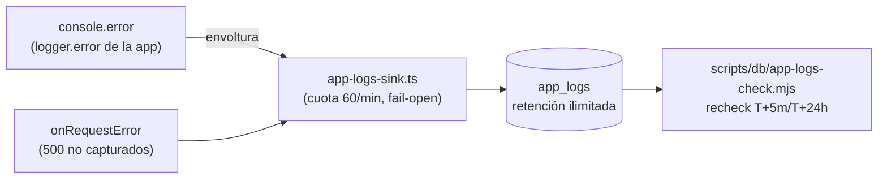

# ADR-007 — Sink de observabilidad de errores en `app_logs` (Postgres)

{: .no_toc }

<details open markdown="block">
  <summary>Tabla de contenidos</summary>
  {: .text-delta }
1. TOC
{:toc}
</details>

---

## 1. Contexto

Los rechecks post-push (T+5m, T+24h) de los cambios de producción verificaban
"0 entradas 5xx/42501/error" consultando `vercel logs` desde CLI. Esa fuente
sólo devuelve una **ventana de minutos** e **ignora `--since`**, así que la
evidencia se captura en el momento exacto del recheck y no es auditable después
(incidente CHANGE-006 §18: la ventana T+24h se cerró con la evidencia del
minuto, sin historial recuperable). No hay sink de plataforma (sin Sentry, sin
Axiom): el único historial duradero de errores era `audit_logs`/`security_audit_logs`,
que sólo registran eventos que algún código decide persistir.

**Alcance:** `src/instrumentation.ts`, `src/server/observability/app-logs-sink.ts`,
tabla `app_logs`, `scripts/db/app-logs-check.mjs`.



---

## 2. Problema

- `vercel logs` no sirve como fuente de verdad para rechecks: ventana corta,
  `--since` ignorado, sin exportación. Cada recheck depende de ejecutarse en el
  minuto exacto y su evidencia no se puede re-auditar después.
- Sin sink, "0 errores en 24h" es una afirmación frágil (imposible de verificar
  a posteriori), y un42501 aislado entre rechecks pasa inadvertido.

---

## 3. Requisitos que motivan la decisión

| ID | Requisito |
|----|-----------|
| REQ-405 | Ventana de observación post-push T+5m/T+24h con evidencia recuperable |
| — | Retención ilimitada de errores de la app (meses, no minutos) |
| — | Sólo infraestructura **free y desplegable en Vercel o Supabase** (decisión del owner) |
| — | Cero proveedores nuevos; sin acciones manuales en dashboards externos |
| — | Fail-open: el sink nunca puede romper un request ni el arranque (ADR-002) |
| — | Paridad con los rechecks históricos: lo que antes iba a `vercel logs` sigue apareciendo allí |

---

## 4. Opciones consideradas

| # | Opción | Pros | Contras |
|---|--------|------|---------|
| A | **Axiom** vía Vercel Marketplace | Drena todos los logs de plataforma (runtime, edge, cron) sin tocar código; free tier holgado | Requiere activar la integración en el dashboard de Vercel (no automatizable por CLI); proveedor externo nuevo |
| B | **`app_logs` en Supabase (Postgres propio)** | Cero proveedores; todo el código y las queries son auditables; misma BD y mismos scripts que los rechecks de `uptime_logs`/RLS; retención ilimitada | Sólo captura lo que la app emite (`console.error` + `onRequestError`); no drena logs de plataforma (edge/build) |
| C | *Status quo* (`vercel logs` en el minuto) | Sin trabajo | Rechecks frágiles; evidencia no recuperable (ya documentado como ⚠️ en MAT-505-CHANGE-006) |
| D | Axiom **+** `app_logs` | Máxima cobertura | Dos fuentes que mantener y reconciliar |

---

## 5. Decisión

**Opción B — `app_logs` en Supabase**, aprobada por el owner el 2026-10-02
(junto con la aprobación de Realtime CHANGE-003 TB-1).

- Tabla `public.app_logs` (uuid PK, `created_at`, `level`, `message`, `code`,
  `source`, `path`, `context jsonb`) con **RLS habilitada sin policies**: sólo
  el backend (`directDb`, rol dueño) escribe y lee; `anon`/`authenticated`
  quedan denegados por defecto.
- Captura en dos puntos (`src/server/observability/app-logs-sink.ts`):
  1. `installErrorSink()` envuelve `console.error` preservando la salida
     original (paridad con `vercel logs`) y replica cada `error` hacia la tabla;
  2. el hook `onRequestError` de `instrumentation.ts` persiste los 500 no
     capturados con ruta, método, `digest` y código (p. ej. `42501`).
- Instalación sólo en `NODE_ENV=production` + runtime `nodejs` + fuera de fase
  de build (mismas guardas que `register()`).
- Cuota de **60 inserciones/min por instancia**; el resto se descarta (un storm
  de errores no inunda la BD).
- Recheck: `node scripts/db/app-logs-check.mjs [--hours N] [--fail-on-error] [--json]`.

---

## 6. Racional

1. **Evidencia antes que afirmaciones**: el objetivo de los rechecks es poder
   responder a posteriori "¿hubo errores en esa ventana?"; eso exige una tabla,
   no una consola con retención de minutos.
2. **Cero dependencias nuevas**: reutiliza el `DIRECT_URL` existente y los
   scripts `scripts/db/*` ya usados para `uptime_logs` y RLS (el patrón de
   migración manual + journal es el mismo que `rate_limit_windows`).
3. **Paridad**: la envoltura de `console.error` conserva la salida original,
   así `vercel logs` sigue mostrando lo de siempre (no se pierde ningún
   canal de observación, sólo se añade uno durable).
4. **Fail-open**: cualquier fallo interno del sink (inserción, import, parseo)
   se descarta sin afectar al request — mismo invariante que ADR-002.
5. Axiom (opción A) queda anotado como **mejora futura** si algún día se
   necesita drenar logs de plataforma (edge, builds, crons) — decisión que
   exigiría activación manual en el dashboard del owner.

---

## 7. Consecuencias — arquitectura, datos, operaciones y seguridad

| Área | Consecuencia |
|------|--------------|
| Arquitectura | `instrumentation.ts` gana `onRequestError` + instalación del sink; el sink se importa de forma dinámica y sólo en node/producción (nunca llega al bundle edge ni al cliente) |
| Datos | Tabla nueva `app_logs` (+ índice `idx_app_logs_created_at`); migración manual `drizzle/2026-10-02_app_logs.sql` + journal idx 46 |
| Operaciones | Rechecks T+5m/T+24h pasan de `vercel logs` (minutos) a `app-logs-check.mjs` (histórico); `vercel logs` se conserva para inspección en vivo |
| Seguridad | RLS sin policies (sólo rol dueño); `message` truncado a 2000 chars y `context` a 4000 (no almacena cuerpos de request ni credenciales: sólo lo que la app ya loguea) |
| API | `GET /api/public/v1/health` expone `services.errorSink` (`app_logs` \| `disabled`) + `public/openapi.json` sincronizado |

---

## 8. Riesgos y mitigaciones

| Riesgo | Mitigación |
|--------|------------|
| Bucle de errores (el sink falla → `console.error` → sink) | El sink no loguea nada por su cuenta: los fallos se descartan en silencio (`catch` vacío) |
| Storm de errores inundando la BD | Cuota 60/min por instancia, resto descartado |
| Escrituras durante `next build` o en dev/test | Guardas `NODE_ENV=production` + `NEXT_PHASE≠phase-production-build`; verificadas por tests |
| El bundle edge/cliente arrastre `pg`/`server-only` | Sólo import dinámico desde `register()`/`onRequestError` ya guardados por `NEXT_RUNTIME` |
| Duplicados (Next loguea el error por consola **y** dispara `onRequestError`) | Aceptado: `source` distingue ambos orígenes y los rechecks cuentan filas, no errores únicos |
| Errores que ni `console.error` ni `onRequestError` ven (p. ej. caída del proceso) | Cubierto por `uptime_logs`/UptimeRobot (canal independiente) |

---

## 9. Migración — pasos y flujo de trabajo

1. Crear `drizzle/2026-10-02_app_logs.sql` (idempotente: `create table if not
   exists` + índice + `enable row level security`) y registrarlo en
   `drizzle/meta/_journal.json` (idx 46). `drizzle-kit generate/migrate` sigue
   inutilizable en este repo (snapshot congelado en 0024; BD sin
   `__drizzle_migrations`) — patrón idéntico a `rate_limit_windows` (ADR-002 §15).
2. Aplicar el SQL en producción vía conexión directa (mismo flujo que la
   migración de CHANGE-006: aplicación manual + verificación por query).
3. Desplegar código (sink se activa solo en el arranque de producción).
4. Verificar: `node scripts/db/app-logs-check.mjs` (0 filas al inicio) +
   `health` con `services.errorSink=app_logs`.

---

## 10. Verificación — quality gate, API y tests

| Check | Resultado |
|-------|-----------|
| `tsc --noEmit` | 0 errores |
| `vitest run` (sink + instrumentation + health + proxy) | 52/52 PASS |
| Suite completa | **211 archivos / 1.957 tests PASS** |
| `lint` / `build` | 0 errores · `next build` ✓ (Next 16.3.3) |
| `guard:secrets` / `guard:cdn` / `guard:i18n` / `contrast-guard` | ✓ / ✓ / 642/642 (0,00%) / ✓ |
| `drizzle-kit check` + `db:drift-check` | ✓ · 72/72 tablas, sin drift duro (20 avisos adhesivos de línea base) |
| Quality gate `--min 80` sobre este documento | ✅ PASS (SCORE ≥ 80 — ver §13) |
| Verificación en producción (2026-10-02) | Tabla creada · `rls=true` · `idx_app_logs_created_at` ✓ · 0 policies (sólo rol dueño) · canary insert+delete ✓ · `app-logs-check.mjs --json` → `total: 0` |

**Runbook de recheck (post-push):** `--fail-on-error` sólo falla con
**errores reales** (`real_errors`): excluye los warnings de proceso de Node
(`(node:<pid>) …Warning:`), que se reportan como `runtime_noise` sin romper
el gate. `request_error_5xx` y `permission_denied_42501` se reportan siempre.

```bash
node scripts/db/app-logs-check.mjs --hours 24 --fail-on-error   # T+24h
vercel logs --follow --level error                              # en vivo (ventana de minutos)
```

---

## 11. Trazabilidad

| ID | Tipo | Qué cubre |
|----|------|-----------|
| REQ-405 | Requisito | Ventana de observación post-push (evidencia recuperable) |
| TRACEABILITY: componente **Error sink (app_logs)** | Componente | `src/server/observability/app-logs-sink.ts` → test `app-logs-sink.test.ts` |
| ADR-002 §15 | Decisión heredada | Patrón de migración manual + journal y filosofía fail-open |
| MAT-505-CHANGE-006 §Limitaciones | Origen | Fila "Retención de logs ⚠️" — mitigada para errores de la app por este ADR |
| CHANGE-003 TB-1 | Relacionado | Realtime aprobado en la misma ronda (2026-10-02) |

---

## 12. Glosario

| Término | Definición |
|---------|------------|
| Sink | Destino durable donde un sistema vuelca eventos (aquí, errores hacia `app_logs`) |
| Recheck | Verificación programada post-push (T+5m, T+24h) de un cambio en producción |
| Fail-open | Invariante ADR-002: un fallo del mecanismo auxiliar nunca bloquea el request |
| `onRequestError` | Hook de `instrumentation.ts` de Next.js que recibe los errores de servidor no capturados |
| Cuota | Límite de 60 inserciones/min por instancia; el exceso se descarta sin error |

---

## 13. Versionado y verificación

| Versión | Fecha | Cambios | Estado |
|---------|-------|---------|--------|
| 1.0 | 2026-10-02 | Creación: decisión `app_logs` (opción B aprobada por el owner), captura doble, cuota y runbook de recheck | Aprobado |

**Verificación:** `node scripts/quality-gate.mjs docs/architecture/ADR/ADR-007-app-logs-observability-sink.md --min 80` → resultado en §10.
