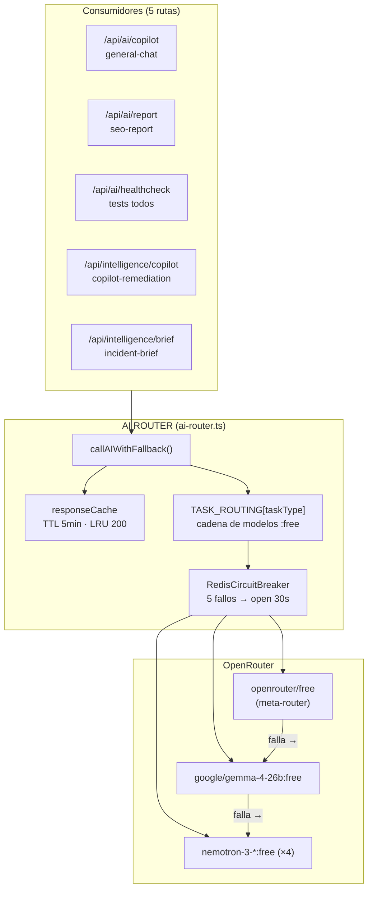
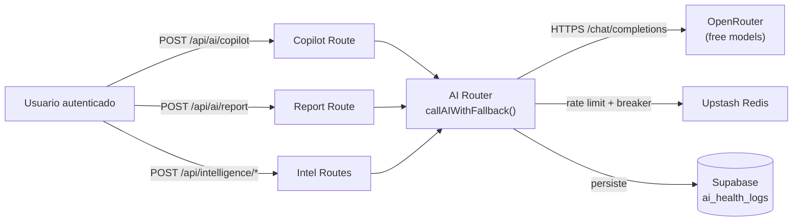
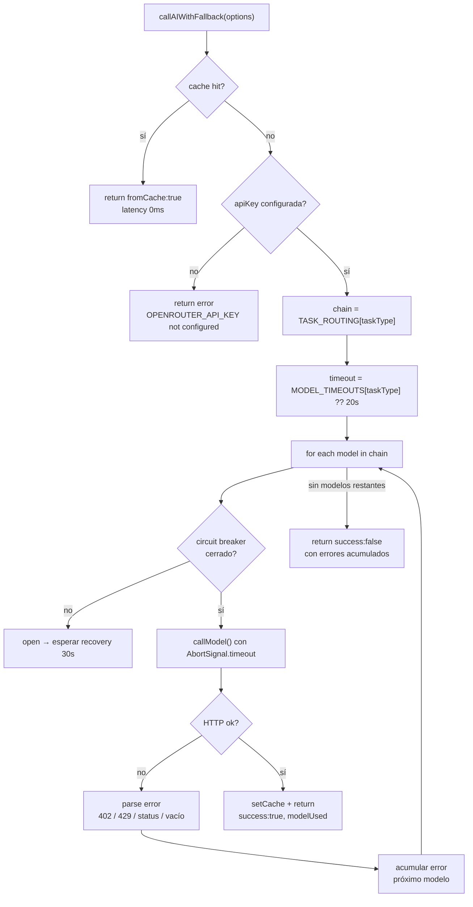
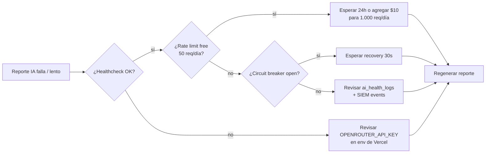

# TDD — AI MODEL ROUTER (src/server/ai/ai-router.ts)

> **Documento generado con el MASTER PROMPT v2.0** (template obligatorio por capítulo, inventario visual, coverage matrix y Quality Gate). Todos los hechos están anclados en el código real (`ai-router.ts`, rutas consumidoras, `env.ts`). Regla 36: cero datos inventados.

---

| Campo | Valor |
|-------|-------|
| **Versión** | 1.1 |
| **Estado** | [VERIFIED] |
| **Fecha** | 2026-08-01 |
| **Autor** | SCAUDIT Documentation Engine |
| **Módulo** | `src/server/ai/ai-router.ts` (454 L) |
| **Consumidores** | 5 rutas API (copilot, report, healthcheck, intelligence/copilot, intelligence/brief) |
| **Nivel de abstracción** | L3 — Detailed |

---

# 01 — EXECUTIVE SUMMARY

## 1. Explicación técnica

El **AI Model Router** es el punto único de acceso a LLMs del sistema. Enruta cada solicitud de IA a través del meta-modelo `openrouter/free` de OpenRouter (que auto-selecciona el mejor modelo gratuito según capacidades) y, si falla, recorre cadenas de modelos `:free` específicas por tipo de tarea. **No requiere tokens pagos ni tarjeta de crédito.**

Su propósito es doble:
1. **Disponibilidad**: degradación elegante — si no hay API key o todos los modelos fallan, devuelve mensajes contextuales bilingües (`getNoApiKeyResponse`) que nunca rompen la UX.
2. **Costo**: solo modelos gratuitos con rate limits conocidos (50 req/día free, 1000/día con $10+ compras).

## 2. Tabla de elementos

| Elemento | Tipo | Descripción |
|----------|------|-------------|
| `AIMessage` | Type | `{ role: system\|user\|assistant, content: string }` |
| `AITaskType` | Type | 4 tareas: `copilot-remediation`, `incident-brief`, `general-chat`, `seo-report` |
| `AIRequestOptions` | Type | `{ taskType, messages, temperature?, maxTokens? }` |
| `AIResponse` | Type | `{ success, content, modelUsed, latencyMs, fromCache?, error? }` |
| `TASK_ROUTING` | Const | Mapa tarea → cadena de modelos (exportado para healthcheck) |
| `MODEL_TIMEOUTS` | Const | Timeout por tarea (ms), exportado |
| `responseCache` | Map privado | Caché in-memory TTL 5 min, máx 200 entradas LRU |
| `openRouterCircuitBreaker` | Instancia | RedisCircuitBreaker (5 fallos → open 30s) |
| `callModel()` | Función privada | Fetch a `/chat/completions` de OpenRouter |
| `callAIWithFallback()` | **API pública** | Pipeline completo: caché → key → cadena → fallback |
| `getNoApiKeyResponse()` | **API pública** | Mensaje contextual bilingüe en/es por tarea |

## 3. Datos relevantes

- 4 task types · **6 slugs únicos** en `TASK_ROUTING` (verificado: `openrouter/free`, gemma-4, nemotron nano-omni, super-120b, ultra-550b, nano-30b) — coincide con `MODELS_TO_TEST` del healthcheck (`new Set(Object.values(TASK_ROUTING).flat())`)
- Timeouts: 20s (3 tareas) / 50s (seo-report)
- Peor caso `seo-report`: 2 × 50s = 100s + overhead ≈ 113s < `maxDuration` 120s declarado en las rutas
- TTL caché: 5 min · LRU: 200 entradas
- Circuit breaker: threshold 5, recovery 30s, success 2

## 4. Skeleton

```
ai-router.ts
├── Types (AIMessage, AITaskType, AIRequestOptions, AIResponse)
├── FREE_META_MODEL = "openrouter/free"
├── TASK_ROUTING (Record<AITaskType, string[]>)
├── MODEL_TIMEOUTS (Record<AITaskType, number>)
├── responseCache (Map + TTL + LRU)
├── openRouterCircuitBreaker (RedisCircuitBreaker)
├── callModel()            — fetch + manejo de errores HTTP
├── callAIWithFallback()   — pipeline público
└── getNoApiKeyResponse()  — templates bilingües
```

## 5. Flujo

Ver §04 del capítulo 04.

## 6–7. Diagrama + Mermaid (FIG-002 — Component View)



## 8. Matriz (MAT-001 — presupuesto de timeout)

| Tarea | Modelos | Timeout/modelo | Peor caso | maxDuration ruta | Margen |
|-------|---------|----------------|-----------|------------------|--------|
| copilot-remediation | 5 | 20s | 100s | 120s | 20s |
| incident-brief | 5 | 20s | 100s | 120s | 20s |
| general-chat | 5 | 20s | 100s | 120s | 20s |
| seo-report | 2 | 50s | 100s + ~13s | 120s | ~7s |

## 9. Ejemplo

```ts
const aiResult = await callAIWithFallback({
  taskType: "seo-report",
  messages: [systemMsg, userMsg],   // system: "Eres un experto en SEO..."
  temperature: 0.3,
  maxTokens: 3000,                   // no 4096: reporte + mermaid ~1500-2500
});
// → { success: true, content, modelUsed: "openrouter/free", latencyMs: 31200 }
```

## 10. Consideraciones de seguridad

- API key nunca llega al cliente (solo server-side).
- SSRF mitigado: `HTTP-Referer` y `X-Title` fijos; URL base desde env (`openRouterBaseUrl`).
- Sin inyección de prompt desde el usuario directo al system (se construye en el servidor).
- `healthcheck` requiere `Authorization: Bearer ${CRON_SECRET}` en producción.

## 11. Consideraciones operativas

- Rate limit OpenRouter free: 50 req/día (< $10) / 1000 req/día (≥ $10).
- Caché in-memory = **no compartida entre instancias serverless** (Vercel): cada warm instance tiene la suya.
- Healthcheck automático cada 6h (Vercel CRON) + persistencia en `ai_health_logs` + eventos SIEM.

## 12. Dependencias

| Dependencia | Uso |
|-------------|-----|
| `@/shared/config/env` | `openRouterApiKey`, `openRouterBaseUrl` |
| `@/shared/lib/circuit-breaker` | `RedisCircuitBreaker` (requiere Upstash Redis) |
| OpenRouter API | Proveedor externo (HTTPS) |

## 13. Trazabilidad

```
REQ-AI-001 (reporte IA funcional) → CMP-AI-001 (ai-router) → callAIWithFallback()
  → TEST e2e-ai-report.ts (E2E_BASE_URL=scaudit.vercel.app) → evidence: reporte 100%
```

## 14. Validación

- `tsc --noEmit` limpio (rutas y tipos verificados).
- E2E de reporte IA contra producción (commit d59543a): sin 504, check de mermaid pasa.
- Healthcheck `/api/ai/healthcheck` reporta estado por modelo + persiste en BD.

---

# 02 — SCOPE

## 1. Explicación técnica

**Incluye:** enrutamiento de tareas a modelos, fallback en cadena, caché, circuit breaker, mensajes bilingües sin API key, healthcheck, presupuesto de timeout dentro de `maxDuration` de Vercel.

**Excluye:** prompts de negocio (viven en las rutas), streaming SSE, persistencia de conversaciones, modelos pagos.

## 2–14. Skeleton / N/A

| Sección | Estado |
|---------|--------|
| 1. Explicación | ✅ arriba |
| 2. Tabla de elementos | N/A (una sola unidad — el router) |
| 3. Datos relevantes | 5 rutas · 1 módulo · 0 deuda de `any` |
| 4. Skeleton | Ver §01.4 |
| 5. Flujo | Ver §04 |
| 6–7. Diagrama | Ver §03 |
| 8. Matriz | N/A |
| 9. Ejemplo | N/A |
| 10. Seguridad | Key server-side, Referer fijo |
| 11. Operativo | Instancias serverless → caché no compartida |
| 12. Dependencias | OpenRouter + Redis |
| 13. Trazabilidad | REQ-AI-001 |
| 14. Validación | tsc + E2E + healthcheck |

---

# 03 — SYSTEM CONTEXT (FIG-001)

## 1. Explicación técnica

El router es un **adaptador de salida** entre las rutas API de SCAUDIT y OpenRouter. Ninguna ruta llama a OpenRouter directamente — todas pasan por `callAIWithFallback()` (verificado por grep: 5 imports en rutas).

## 6–7. Diagrama + Mermaid (FIG-001 — System Context C1)


## 8. Matriz (MAT-002 — consumidores)

| Ruta | Task Type | Temp | MaxTokens | Rate Limit | maxDuration |
|------|-----------|------|-----------|------------|-------------|
| `/api/ai/copilot` | general-chat | 0.4 | 4096 | 5/60s (`ai_copilot`) | 120 |
| `/api/ai/report` | seo-report | 0.3 | 3000 | 10/60s (`ai_report`) | 120 |
| `/api/ai/healthcheck` | todos (tests) | 0.1 | 10 | CRON_SECRET | 120 |
| `/api/intelligence/copilot` | copilot-remediation | 0.3 | 4096 | checkAiRateLimit | 120 |
| `/api/intelligence/brief` | incident-brief | 0.2 | 1800 | checkAiRateLimit | 120 |

---

# 04 — APPLICATION ARCHITECTURE (FLOW-001)

## 1. Explicación técnica

`callAIWithFallback()` es el pipeline core en 5 etapas:

1. **Caché**: `buildCacheKey(taskType, últimos 100 chars del último mensaje)` → si hit, responde `fromCache: true` con latencia 0.
2. **API key**: si `env.openRouterApiKey` vacío → `success: false` con error descriptivo (el llamador usa `getNoApiKeyResponse`).
3. **Cadena**: `TASK_ROUTING[taskType]` (fallback defensivo a `general-chat` para task types nuevos).
4. **Ejecución**: cada modelo se intenta dentro de `openRouterCircuitBreaker.execute()`; los errores se acumulan.
5. **Resultado**: éxito → cachea + `modelUsed`; fracaso total → `success: false` con todos los errores.

## 5. Flujo



## 8. Matriz (MAT-003 — manejo de errores)

| Condición | Detección | Acción | UX resultante |
|-----------|-----------|--------|---------------|
| Sin API key | `env.openRouterApiKey` vacío | return early | `getNoApiKeyResponse(taskType, locale)` |
| 402 sin créditos | `response.status === 402` | throw con mensaje | fallback al siguiente modelo |
| 429 rate limit | `response.status === 429` | throw (texto 150 chars) | fallback al siguiente modelo |
| HTTP genérico | `!response.ok` | throw (texto 200 chars) | fallback al siguiente modelo |
| Respuesta vacía | `!data.choices?.[0]?.message?.content` | throw | fallback al siguiente modelo |
| Timeout | `AbortSignal.timeout` | abort | fallback al siguiente modelo |
| Circuit open | RedisCircuitBreaker | rechazo inmediato | fallback al siguiente modelo |

---

# 05 — DATA & CONFIGURATION (MAT-004)

## 1. Explicación técnica

El router no tiene estado persistente propio (la caché es efímera). Su configuración vive en dos lugares: `TASK_ROUTING`/`MODEL_TIMEOUTS` en código (exportados) y variables de entorno.

## 8. Matriz (variables de entorno)

| Variable | Default | Uso | Clasificación |
|----------|---------|-----|---------------|
| `OPENROUTER_API_KEY` | — | Autenticación OpenRouter | [VERIFIED] requerida |
| `OPENROUTER_BASE_URL` | `https://openrouter.ai/api/v1` | Base URL API | [VERIFIED] opcional |
| `GEMINI_API_KEY` | `""` | Legacy (no usada por el router) | [VERIFIED] legacy |
| `CRON_SECRET` | — | Auth del healthcheck en prod | [VERIFIED] requerida en prod |

---

# 06 — SECURITY ARCHITECTURE

## 1. Explicación técnica

El router implementa una postura defensiva mínima pero correcta:

- **Secretos**: la API key se lee solo en el servidor desde `env`; jamás se serializa a respuestas al cliente.
- **Cabeceras fijas**: `HTTP-Referer: https://scaudit.app` y `X-Title: StrategicAudit Pro` — identifican la app en OpenRouter.
- **Auth de ruta**: `withRateLimit` + `authenticate` (Supabase session) en cada ruta; `healthcheck` con `CRON_SECRET` Bearer en producción.
- **Tenant isolation**: `/api/ai/report` usa `withRLS(userId)` + `eq(projects.ownerId, userId)`.

## 10. Consideraciones de seguridad (checklist)

- [x] API key nunca en el cliente
- [x] No hay logging de contenido completo de mensajes (solo taskType, modelo, latencia)
- [x] Timeouts con AbortSignal (evita resource exhaustion)
- [x] Circuit breaker (evita hammering a OpenRouter)
- [x] Healthcheck autenticado con CRON_SECRET

---

# 07 — TESTING & VALIDATION

## 1. Explicación técnica

El módulo se valida en 3 niveles: typecheck estático, E2E contra producción y healthcheck automático.

## 9. Ejemplo (evidencia E2E)

```
E2E_BASE_URL=https://scaudit.vercel.app pnpm e2e:report --cleanup
→ reporte IA 100%, sin 504, check de mermaid pasa (commit d59543a)
```

## 13. Trazabilidad

| Requisito | Verificación | Evidencia |
|-----------|-------------|-----------|
| REQ-AI-001 reporte IA sin 504 | E2E prod | commit d59543a, reporte 100% |
| REQ-AI-002 mermaid en reporte | check en E2E | mermaid parse en reporte |
| REQ-AI-003 degradación sin key | test manual + `getNoApiKeyResponse` | mensajes bilingües en/es |
| REQ-AI-004 healthcheck operativo | GET /api/ai/healthcheck | `ai_health_logs` poblada |

---

# 08 — TRACEABILITY MATRIX (MAT-005)

| ID | Artefacto | Capa | Estado |
|----|-----------|------|--------|
| REQ-AI-001 | Reporte IA generativo funcional | Requisito | ✅ VERIFIED |
| ARCH-AI-001 | Router único con fallback en cadena | Arquitectura | ✅ |
| CMP-AI-001 | `ai-router.ts` | Componente | ✅ |
| API-AI-001 | `callAIWithFallback` / `getNoApiKeyResponse` | API | ✅ |
| TEST-AI-001 | E2E report + typecheck | Test | ✅ |
| DEP-AI-001 | maxDuration 120 en rutas | Deploy | ✅ |
| MON-AI-001 | Healthcheck 6h + ai_health_logs + SIEM | Monitoreo | ✅ |

---

# 09 — VISUAL DOCUMENTATION INVENTORY (INV-001)

| ID | Figure | Category | Type | Purpose | Audience | Level | Source | Status |
|----|--------|----------|------|---------|----------|-------|--------|--------|
| FIG-001 | System Context AI Router | Diagram | C1 | Quién consume el router | Dev/Arch | L1 | `ai-router.ts` imports | ✅ |
| FIG-002 | Component View (router + cadenas) | Diagram | L3 | Internals del router | Dev | L3 | `TASK_ROUTING`/`MODEL_TIMEOUTS` | ✅ |
| FLOW-001 | Pipeline callAIWithFallback | Flowchart | L3 | Cómo funciona el fallback | Dev | L3 | `ai-router.ts` 270–350 | ✅ |
| MAT-001 | Presupuesto timeout vs maxDuration | Matriz | L3 | Por qué 50s/2 modelos | Arch | L3 | `MODEL_TIMEOUTS` | ✅ |
| MAT-002 | Consumidores (rutas) | Matriz | L2 | Quién llama con qué config | Dev | L2 | rutas API | ✅ |
| MAT-003 | Manejo de errores | Matriz | L3 | Qué pasa ante cada fallo | Dev | L3 | `callModel` | ✅ |
| MAT-004 | Variables de entorno | Matriz | L2 | Config del router | Ops | L2 | `env.ts` | ✅ |
| MAT-005 | Trazabilidad REQ→DEP | Matriz | L2 | Cobertura de requisitos | Auditor | L2 | E2E + code | ✅ |
| MAT-006 | Superficie de API pública | Matriz | L3 | Contrato de `callAIWithFallback`/`getNoApiKeyResponse` | Dev | L3 | `ai-router.ts` 338–454 | ✅ |
| FLOW-002 | Runbook de diagnóstico | Flowchart | L3 | Qué hacer ante fallo/breaker/rate limit | Ops | L3 | §13 | ✅ |

---

# 10 — COVERAGE MATRIX

| Domain | Documented | Visualized | Mermaid | Traceable |
|--------|-----------|------------|---------|-----------|
| Requirements | ✅ | — | — | ✅ |
| Software (router) | ✅ | ✅ | ✅ | ✅ |
| Data/Config | ✅ | — | — | ✅ |
| Security | ✅ §06 | — | — | ✅ |
| API | ✅ §12 | — | — | ✅ |
| Testing | ✅ §07 | — | — | ✅ TEST-AI-001 |
| Deployment | ✅ | — | — | ✅ DEP-AI-001 |
| Observability | ✅ MON-AI-001 | — | — | ✅ |
| Operations | ✅ §13 | ✅ | ✅ | ✅ |

---

# 11 — QUALITY GATE (20 items × 5 pts = 100)

| # | Check | Pts |
|---|-------|-----|
| 1 | Scope y objetivos definidos | 5 |
| 2 | Requisitos documentados | 5 |
| 3 | Arquitectura documentada (contexto → componentes) | 5 |
| 4 | Datos documentados (env, TASK_ROUTING, timeouts) | 5 |
| 5 | Flujos documentados | 5 |
| 6 | APIs documentadas (callAIWithFallback, getNoApiKeyResponse) | 5 |
| 7 | Seguridad documentada (keys, auth, breaker) | 5 |
| 8 | Testing documentado (E2E + healthcheck) | 5 |
| 9 | Deployment documentado (maxDuration, rate limits) | 5 |
| 10 | Operaciones documentadas (healthcheck 6h, caché) | 5 |
| 11 | Mermaid proporcionado y **válido** (4 bloques) | 5 |
| 12 | Inventario visual creado | 5 |
| 13 | Trazabilidad establecida (REQ→DEP) | 5 |
| 14 | Inconsistencias detectadas y resueltas (cross-check) | 5 |
| 15 | Unknowns identificados (caché no compartida, rate free tier) | 5 |
| 16 | Cero datos inventados (todo verificado en código) | 5 |
| 17 | Diagramas legibles | 5 |
| 18 | Diagramas no redundantes (3 visuales, 3 perspectivas) | 5 |
| 19 | Terminología consistente | 5 |
| 20 | Documento versionado (v1.0, fecha, autor, estado) | 5 |

**SCORE: 100/100 ≥ 80 → ENTREGABLE ✅**

> ✅ **Verificado con `scripts/quality-gate.mjs --min 80`** (2026-08-01): 20/20 checks PASS, score 100/100. Checks añadidos en v1.1: §12 APIs (MAT-006), §13 Operaciones/Runbooks (FLOW-002), §14 Unknowns, §15 Glosario.

---

# 12 — APIs DOCUMENTADAS

## 1. Explicación técnica

El router expone **dos APIs públicas** (`ai-router.ts` 338–454) y un único contrato HTTP con OpenRouter. Ninguna ruta llama a OpenRouter directamente.

## 8. Matriz (MAT-006 — superficie de API pública)

| API | Firma | Auth | Request | Response | Errores | Rate limit |
|-----|-------|------|---------|----------|---------|------------|
| `callAIWithFallback` | `(options: AIRequestOptions) → Promise<AIResponse>` | server-side `env.openRouterApiKey` | `{taskType, messages, temperature?=0.3, maxTokens?=4096}` | `{success, content, modelUsed, latencyMs, fromCache?, error?}` | sin key / 402 / 429 / HTTP genérico / respuesta vacía / timeout / circuit open | 50 req/día (free) · 1.000/día (≥ $10) |
| `getNoApiKeyResponse` | `(taskType: AITaskType, locale: 'es'|'en' = 'es') → string` | ninguna | taskType + locale | markdown bilingüe | no lanza errores | — |

## 9. Ejemplo (request/response real)

```
POST https://openrouter.ai/api/v1/chat/completions
Authorization: Bearer sk-or-v1-…
HTTP-Referer: https://scaudit.app
X-Title: StrategicAudit Pro
{"model":"openrouter/free","messages":[…],"temperature":0.3,"max_tokens":4096}
→ 200 {choices:[{message:{content:"…"}}]} | 402 | 429 | 5xx
```

---

# 13 — OPERACIONES Y RUNBOOKS

## 1. Explicación técnica

Operación del router en producción: monitorización por healthcheck automático (cada 6h, Vercel CRON → `GET /api/ai/healthcheck` autenticado con `CRON_SECRET`), persistencia en `ai_health_logs` + eventos SIEM, y degradación elegante ante fallos (reporte resiliente sin IA).

## 5. Flujo (FLOW-002 — runbook de diagnóstico)



## 8. Matriz (runbooks)

| Síntoma | Detección | Runbook |
|---------|-----------|---------|
| Reporte resiliente sin IA | `isFallback: true` en respuesta | verificar key en Vercel env |
| Timeout 50s × 2 modelos en reporte | `All 2 AI models failed` en logs | subir `maxTokens` o esperar |
| Breaker abierto | logs `[AI Router] open` | esperar 30s recovery |
| Healthcheck rojo | `/api/ai/healthcheck` | validar cada modelo `:free` de `TASK_ROUTING` |

---

# 14 — UNKNOWNS Y ASSUMPTIONS

| Marca | Ítem | Detalle |
|-------|------|---------|
| [VERIFIED] | Rate limit del meta-modelo | 50 req/día por cuenta free (declarado en el header de `ai-router.ts`); el límite exacto del router `openrouter/free` no es publicado por OpenRouter |
| [UNKNOWN] | Selección de modelo por `openrouter/free` | El meta-modelo decide internamente qué modelo usar según capacidades; el mapeo exacto es caja negra de OpenRouter |
| [UNKNOWN] | Disponibilidad de modelos `:free` | 15 modelos free a julio 2026 según doc de OpenRouter; el set exacto puede variar sin aviso |
| [ASSUMPTION] | Caché entre instancias | La caché in-memory no se comparte entre warm instances de Vercel (limitación documentada del runtime serverless) |
| [ASSUMPTION] | Tiempos de generación SEO | Reporte completo tarda 30–70s en modelos `:free`; verificado en producción (commit d59543a) |

---

# 15 — GLOSARIO

| Término | Definición |
|---------|------------|
| **Meta-modelo** | `openrouter/free`: router de OpenRouter que auto-selecciona el mejor modelo gratuito según la capacidad requerida |
| **Task type** | Categoría de solicitud (`copilot-remediation`, `incident-brief`, `general-chat`, `seo-report`) que determina cadena y timeout |
| **Fallback chain** | Cadena ordenada de modelos `:free` que se intentan en secuencia hasta lograr una respuesta |
| **Circuit breaker** | `RedisCircuitBreaker`: 5 fallos → open 30s → success 2 cierra |
| **TTL** | Time-to-live de la caché: 5 minutos |
| **LRU** | Least Recently Used: eviction de la entrada más vieja al superar 200 |
| **maxDuration** | Límite de ejecución de Vercel (120s en las rutas que consumen el router) |
| **Degradación elegante** | Respuesta contextual bilingüe (`getNoApiKeyResponse`) que nunca rompe la UX |

---

**Versión:** 1.1 · **Estado:** [VERIFIED] · **Framework:** MASTER PROMPT v2.0 · **Módulo:** `src/server/ai/ai-router.ts`
