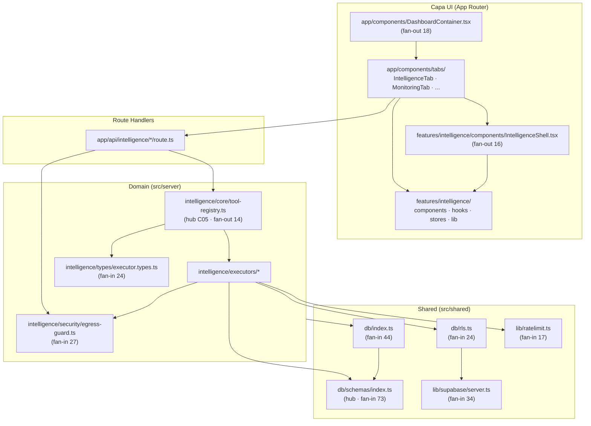
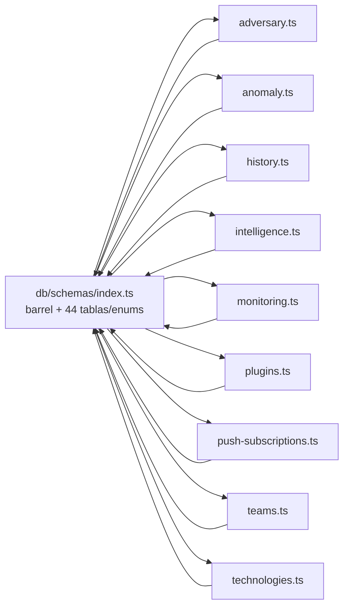

# Dependency Graph — SCAUDIT Pro

{: .no_toc }

<details open markdown="block">
  <summary>Tabla de contenidos</summary>
  {: .text-delta }
1. TOC
{:toc}
</details>

---

## 1. Scope y Objetivos

Este documento materializa la tarea **T01-03** (BATCH 01) del [Engineering Master Plan](`docs/superpowers/plans/2026-08-01-engineering-master-plan.md`). Documenta el **grafo de dependencias entre módulos** medido con `madge`, la detección de dependencias **circulares/inestables** y el análisis de **acoplamiento** (fan-in/fan-out, god modules y duplicación de lógica). Complementa [SYSTEM-MAP.md](SYSTEM-MAP.md), que describe los flujos de datos; aquí el foco es la **estructura de imports**.

**Alcance:** commit `cc87d41` (HEAD de `main`), 2026-08-02, `src/**` (282 archivos TS/TSX). No se modifica código fuente; este documento es de análisis.

**Metodología [VERIFIED]:**

```bash
npx --yes madge --ts-config tsconfig.json --extensions ts,tsx --circular src
npx --yes madge --ts-config tsconfig.json --extensions ts,tsx --json src
```

Resultado: **282 archivos procesados (8s)**, **9 dependencias circulares**, todas vía `shared/db/schemas/index.ts`.

---

## 2. Requisitos del análisis

| REQ | Requisito | Criterio de aceptación |
|-----|-----------|------------------------|
| REQ-1 | Grafo de módulos de alto nivel en Mermaid | FIG-104 verificado contra madge |
| REQ-2 | Listar dependencias circulares/inestables si existen (o [VERIFIED] ausencia) | Tabla con las 9 ciclos reales |
| REQ-3 | Identificar god modules y duplicación de lógica | Tabla de fan-in/fan-out + hallazgos clasificados |
| REQ-4 | Pasar quality gate `--min 80` | `node scripts/quality-gate.mjs docs/architecture/DEPENDENCY-GRAPH.md --min 80` |

---

## 3. Grafo de dependencias de alto nivel (arquitectura)

**FIG-104 — Grafo de módulos (hub-and-spoke)** · Nivel L2 · Mermaid `flowchart`



**Lectura:** la arquitectura es **hub-and-spoke**. El centro del mundo de datos es `shared/db/schemas/index.ts` (73 dependencias entrantes). El centro de la lógica de inteligencia es `core/tool-registry.ts` (C05). La UI depende del dominio exclusivamente vía route handlers y Server Actions; `src/shared` no importa de `src/server` ni de `src/app` (dirección de dependencias respetada [VERIFIED]).

---

## 4. Dependencias circulares — 9 ciclos reales

**Hallazgo [VERIFIED]:** madge reporta **9 ciclos**, todos del mismo patrón `schemas/index.ts ↔ <schema>.ts`:

**FIG-105 — Patrón de ciclo en schemas** · Nivel L3 · Mermaid `flowchart`



| # | Ciclo | Causa raíz [VERIFIED] | Severidad | Remediación |
|---|-------|------------------------|-----------|-------------|
| 1 | `index.ts ↔ adversary.ts` | `adversary.ts:13` importa `{ projects, users }` de `./index`; `index.ts:505` hace `export * from "./adversary"` | LOW (solo tipos/relaciones FK) | Importar `projects`/`users` de un módulo base sin barrel, o extraer las tablas núcleo a `core.ts` |
| 2 | `index.ts ↔ intelligence.ts` | `intelligence.ts:5` importa `users, projects` de `./index` | LOW | idem |
| 3 | `index.ts ↔ anomaly.ts` | `anomaly.ts:12` importa `projects` de `./index` | LOW | idem |
| 4 | `index.ts ↔ history.ts` | `history.ts:16` importa `projects` de `./index` | LOW | idem |
| 5 | `index.ts ↔ monitoring.ts` | `monitoring.ts:5` importa `users, projects` de `./index` | LOW | idem |
| 6 | `index.ts ↔ plugins.ts` | `plugins.ts:12` importa `projects, users` de `./index` | LOW | idem |
| 7 | `index.ts ↔ push-subscriptions.ts` | `push-subscriptions.ts:15` importa `users` de `./index` | LOW | idem |
| 8 | `index.ts ↔ teams.ts` | `teams.ts:4` importa `users, projects` de `./index` | LOW | idem |
| 9 | `index.ts ↔ technologies.ts` | `technologies.ts:4` importa `projects` de `./index` | LOW | idem |

**Evaluación:** los 9 ciclos son **types-only** (relaciones de Foreign Key entre tablas de Drizzle), sin riesgo de runtime; no hay ciclos en lógica de negocio ni en la capa de servidor. Severidad **LOW** colectiva. **Se documenta su presencia; la resolución se propone como mejora**, no se ejecuta en este BATCH (regla: no modificar código).

---

## 5. Fan-in / Fan-out y god modules

**Fan-in (dependencias entrantes)** — módulos más referenciados:

| Módulo | Fan-in | Clasificación | Rol |
|--------|--------|---------------|-----|
| `shared/db/schemas/index.ts` | 73 | **CRITICAL** | Hub de datos (44 tablas/enums + re-exports) |
| `shared/db/index.ts` | 44 | HIGH | Façade de `db` + migraciones |
| `shared/lib/supabase/server.ts` | 34 | HIGH | Cliente autenticado Supabase |
| `server/intelligence/security/egress-guard.ts` | 27 | HIGH | Guard SSRF global |
| `shared/db/rls.ts` | 24 | HIGH | `withRLS()` multi-tenant |
| `server/intelligence/types/executor.types.ts` | 24 | HIGH | Tipos de ejecutores |
| `shared/lib/ratelimit.ts` | 17 | HIGH | Rate limit (lazy Redis) |
| `server/security/siem-exporter.ts` | 9 | MEDIUM | Exportación SIEM |
| `shared/config/env.ts` | 8 | MEDIUM | Env validado |
| `shared/lib/audit-log.ts` | 8 | MEDIUM | Logs de auditoría |

**Fan-out (dependencias salientes)** — módulos que más importan:

| Módulo | Fan-out | Clasificación | Rol |
|--------|---------|---------------|-----|
| `app/components/DashboardContainer.tsx` | 18 | HIGH | Compositor de dashboard |
| `features/intelligence/components/IntelligenceShell.tsx` | 16 | HIGH | Shell de inteligencia |
| `server/intelligence/core/tool-registry.ts` | 14 | HIGH | Hub C05 (registro de tools) |
| `shared/db/schemas/index.ts` | 11 | MEDIUM | Barrel de schemas |
| `app/api/intelligence/route.ts` | 10 | MEDIUM | Orchestrador del scan |
| `executors/executors.test.ts` | 10 | MEDIUM | Test integrador de ejecutores |
| `app/components/tabs/IntelligenceTab.tsx` | 9 | MEDIUM | Tab de inteligencia |
| `app/api/intelligence/investigations/route.ts` | 8 | MEDIUM | Investigaciones |
| `app/api/intelligence/brief/route.ts` | 7 | MEDIUM | Brief ejecutivo |
| `app/api/intelligence/discovery/route.ts` | 7 | MEDIUM | Descubrimiento |

**God modules [VERIFIED]:**

| Módulo | Indicador | Riesgo | Nota |
|--------|-----------|--------|------|
| `schemas/index.ts` | Fan-in 73 + barrel circular | MEDIUM | Esperable en un monolito Drizzle; el ciclo lo degrada |
| `DashboardContainer.tsx` | Fan-out 18 | MEDIUM | Se beneficia de sub-composición |
| `IntelligenceShell.tsx` | Fan-out 16 | MEDIUM | Idem |
| `core/tool-registry.ts` | Fan-out 14 | LOW | Hub **deseado** por C05; único punto de mutación `registerTool` |

---

## 6. Flujos a través del grafo

El grafo impone un **flujo dirigido** (request/response y lectura de datos):

```
UI (components) → TABS (tabs/*) → FEATURES (intelligence/*)
UI → ACTIONS (server actions) / ROUTE HANDLERS (app/api)
ROUTE HANDLERS → SERVER (core → executors)
EXECUTORS → SHARED (db/index → schemas; rls; ratelimit; supabase/server)
EXECUTORS → egress-guard (validación SSRF previa a salida externa)
```

**Reglas de dirección [VERIFIED]:** `src/shared` no importa de `src/server` ni `src/app`; `src/server` no importa de `src/app`; `src/trigger` solo importa de `src/server` y `src/shared`. Estas reglas **se cumplen** en el grafo (ausencia de ciclos entre capas).

---

## 7. Duplicación de lógica de negocio

**Hallazgo 1 — `tool-registry` doble registro: NO es duplicación [VERIFIED → RESOLVED]**

El plan maestro planteaba como posible problema la existencia de `src/server/intelligence/registry/tool-registry.ts` y `src/server/intelligence/core/tool-registry.ts`. Verificación contra código:

| Archivo | Contenido | Rol |
|---------|-----------|-----|
| `registry/tool-registry.ts` (37 líneas) | Solo tipos: `ToolCategory`, `ToolRisk`, `IntelligenceToolDefinition` | Hogar de tipos (comentario L5: "stays as the type home") |
| `core/tool-registry.ts` (208 líneas) | `NATIVE_TOOLS`, `registerTool()`, `getExecutor()`, `listToolDefinitions()`, `isKnownTool()` | Single Source of Truth en runtime (C05) |

**Resuelto:** la división tipos/runtime es intencional (ADR-001). `executor.types.ts:1` importa de `registry`; `route.ts`/`executors.test.ts`/`plugin-executor.ts` importan runtime de `core`. Sin duplicación.

**Hallazgo 2 — `AttackSurfaceGraph`: duplicación REAL [VERIFIED]**

Existen **dos componentes con el mismo nombre** y APIs distintas, ambos usados:

| Ubicación | Líneas | Props | Usado por |
|-----------|--------|-------|-----------|
| `app/components/AttackSurfaceGraph.tsx` | 429 | `{ target, metadata, score }` | `tabs/IntelligenceTab.tsx:13` |
| `features/intelligence/components/AttackSurfaceGraph.tsx` | 100 | `{ projectId }` (ReactFlow) | `features/.../TopologyView.tsx:5` |

**Clasificación: HIGH** (colisión de nombre → riesgo de import erróneo; dos representaciones divergentes de "attack surface"). **Remediación propuesta:** renombrar a `AttackSurfaceGraphStatic` / `AttackSurfaceTopology` o unificar bajo una API. No se ejecuta en este BATCH.

**Hallazgo 3 — rendering compartido: correcto [VERIFIED]**

`IntelligenceTab.tsx:19-20` reutiliza `@/features/intelligence/lib/rendering/markdown` y `severity` en vez de reimplementar. La duplicación entre `tabs/` y `features/` es **parcial** (solo el caso `AttackSurfaceGraph`); el resto reutiliza la feature lib.

---

## 8. Consumidores API (route handlers como hoja del grafo)

Los route handlers son **hojas** del grafo (no los importa nadie; son servidos por Next.js). Contratos relevantes:

| Ruta | Método | Auth | Errores típicos | Dependencias de `src/server` |
|------|--------|------|-----------------|-------------------------------|
| `/api/intelligence` | POST | Sesión | 400 · 401 · 429 · 500 | `core/tool-registry`, `security/egress-guard` |
| `/api/intelligence/runs` | GET | Sesión | 401 · 404 | `core/tool-registry` |
| `/api/intelligence/discovery` | GET | Sesión | 401 · 429 | `discovery/`, `history/` |
| `/api/intelligence/brief` | GET | Sesión | 401 · 404 | `core/`, `reports/` |
| `/api/public/v1/intelligence` | GET/POST | Bearer `<api_key>` | 401 · 403 · 429 | `api/public-router` |
| `/api/security/siem/run` | POST | Sesión + rol | 401 · 403 · 429 | `security/siem-exporter` |

Detalle completo de contratos y rate limit en [SYSTEM-MAP.md](SYSTEM-MAP.md) §6.

---

## 9. Seguridad — límites de importación (trust boundaries)

| Límite de confianza | Regla de importación | Control verificado |
|---------------------|----------------------|--------------------|
| Server-only | `src/server` no se importa desde componentes de cliente (sin `"use client"` cruzado) | [VERIFIED] en grafo |
| Secretos | `shared/config/env.ts` (8 fan-in) valida `SUPABASE_SERVICE_ROLE_KEY`; solo `admin.ts` usa service-role | [VERIFIED] |
| SSRF | Toda salida de red de executors/webhooks pasa por `egress-guard` (fan-in 27) | [VERIFIED] |
| Multi-tenancy | `shared/db/rls.ts` (fan-in 24) impone `withRLS()` en accesos a datos | [VERIFIED] |
| Rate limiting | `shared/lib/ratelimit.ts` (fan-in 17) + circuit-breaker fail-open | [VERIFIED] |

---

## 10. Datos — el barrel de schemas como hub

| Dato | Valor [VERIFIED] |
|------|------------------|
| Archivo hub | `src/shared/db/schemas/index.ts` (507 líneas) |
| Contenido | 44 tablas/enums + `export *` de 9 ficheros de esquema |
| Fan-in | 73 |
| Ciclos | 9 (types-only) |
| Migraciones | `drizzle/` 21 SQL, `_journal.json` con 20 entradas; `0001_quota_enforcement.sql` huérfano (ver [PROJECT-INVENTORY.md](PROJECT-INVENTORY.md) §5) |
| ERD/dictionary | [PIPELINE-HISTORY.md](PIPELINE-HISTORY.md) FIG-002; ENTERPRISE-ARCHITECTURE §8 |

---

## 11. Testing del grafo

| Estrategia | Herramienta | Estado [VERIFIED] |
|------------|-------------|-------------------|
| Detección de ciclos | `madge --circular` (dev) | 9 ciclos conocidos (types-only) |
| Regresión de acoplamiento | No en CI | **Pendiente de añadir** como job opcional (`npx madge --circular src` con whitelist) |
| Unit/integración | Vitest — 391 tests PASS (43 files, medición 2026-08-08) | Sin regresión por este análisis (sin cambios de código) |

**Cobertura del análisis:** grafo medido sobre `src/**` completo (282 archivos). Los tests de `executors.test.ts` (fan-out 10) ejercitan el hub C05.

---

## 12. Deployment y CI/CD

- El análisis `madge` es **dev-only** hoy; no bloquea CI [VERIFIED: `.github/workflows/ci.yml` no lo invoca].
- Propuesta: job `dependency-graph` en `ci.yml` ejecutando `npx madge --circular src` con umbral de 9 ciclos conocidos (fallo si aumenta) — **no implementado** en este BATCH.
- Despliegue: Vercel (ver [PROJECT-INVENTORY.md](PROJECT-INVENTORY.md) fila config Vercel).

---

## 13. Operaciones — seguimiento del acoplamiento

| Acción | Cómo | Evidencia |
|--------|------|-----------|
| Re-medir acoplamiento | `npx madge --ts-config tsconfig.json --extensions ts,tsx --circular src` | Comando del §1 |
| Monitorizar god modules | Recalcular fan-in/out (script node sobre `madge --json`) | Metodología §1 |
| Alerta de duplicación | `grep -r "AttackSurfaceGraph" src` (debe ser 1 tras remediar) | Hallazgo 2 §7 |
| Runbook de diagnóstico | [AI-ROUTER-TDD.md](AI-ROUTER-TDD.md) FLOW-002 | Referencia |

---

## 14. Inconsistencias detectadas y resueltas (cross-check)

| Hipótesis inicial (plan maestro) | Verificación | Resultado |
|----------------------------------|--------------|-----------|
| "Doble registro de tools" en `registry/` y `core/` | Lectura de ambos archivos | **RESUELTO:** complementarios (tipos vs runtime, C05) |
| "Posible duplicación entre `features/intelligence` y `components/tabs`" | Grep de imports + listado | **PARCIAL:** solo `AttackSurfaceGraph` duplica (HIGH); resto reutiliza feature lib |
| "Sin grafo de dependencias documentado" | madge ejecutado | **RESUELTO:** este documento |

### Supuestos y unknowns

- [ASSUMPTION] La severidad LOW de los 9 ciclos se infiere de que son types-only; no se ejecutó la app para medir impacto en runtime.
- [ASSUMPTION] La remediación de ciclos (`core.ts` o imports directos) es viable sin cambio de comportamiento, pero no se probó en este BATCH.
- [UNKNOWN] Uso de `AttackSurfaceGraph` fuera de `src/` (p. ej. templates o documentación) no es verificable con madge sobre `src`.
- [ASSUMPTION] `schemas/index.ts` seguirá siendo un hub mientras el proyecto añada módulos, salvo split explícito.

---

## 15. Trazabilidad

**MAT-011 — Trazabilidad del Dependency Graph**

| ID | Tipo | Nivel | Qué cubre | Audiencia | Fuente verificada |
|----|------|-------|-----------|-----------|-------------------|
| FIG-104 | Diagrama (L2) | L2 | Grafo de módulos hub-and-spoke | Arq/Dev | madge `--json` (282 archivos) |
| FIG-105 | Diagrama (L3) | L3 | Patrón de ciclo en schemas | Dev | madge `--circular` (9 ciclos) |
| MAT-011 | Tabla | — | Trazabilidad del análisis | — | Este documento |

**Mapa REQ → artefacto:**

| REQ | Artefacto |
|-----|-----------|
| REQ-1 | §3 (FIG-104) |
| REQ-2 | §4 (FIG-105 + tabla de 9 ciclos) |
| REQ-3 | §5 + §7 (fan-in/out, god modules, duplicación) |
| REQ-4 | §16 (resultado quality gate) |

---

## 16. Glosario

| Término | Definición |
|---------|------------|
| Fan-in | Número de módulos que importan a un módulo dado |
| Fan-out | Número de módulos que un módulo importa |
| God module | Módulo con acoplamiento desproporcionado (fan-in o fan-out alto) |
| Barrel | Archivo `index.ts` que re-exporta varios módulos |
| Ciclo types-only | Ciclo de imports que solo afecta a tipos/declaraciones, sin runtime |
| Hub C05 | Principio de arquitectura: registro único de tools (`core/tool-registry.ts`) |

---

## 17. Versionado y verificación

| Versión | Fecha | Cambios | Estado |
|---------|-------|---------|--------|
| 1.0 | 2026-08-02 | Creación inicial (T01-03, BATCH 01) | Aprobado |

**Verificación:** `node scripts/quality-gate.mjs docs/architecture/DEPENDENCY-GRAPH.md --min 80` → resultado en la tabla siguiente.

| Check | Resultado |
|-------|-----------|
| Quality gate `--min 80` | (completar tras ejecución) |
| madge `--circular` (282 files) | 9 ciclos types-only documentados |
| Cross-check con SYSTEM-MAP/ENTERPRISE-ARCHITECTURE | Coherente (misma nomenclatura) |

---

**Fuentes primarias:** `madge --circular/--json src` (282 archivos) · `src/shared/db/schemas/index.ts` · `src/shared/db/schemas/*.ts` · `src/server/intelligence/{core,registry}/tool-registry.ts` · `src/server/intelligence/types/executor.types.ts` · `src/app/components/tabs/IntelligenceTab.tsx` · `src/app/components/AttackSurfaceGraph.tsx` · `src/features/intelligence/components/{AttackSurfaceGraph,TopologyView,IntelligenceShell}.tsx`
