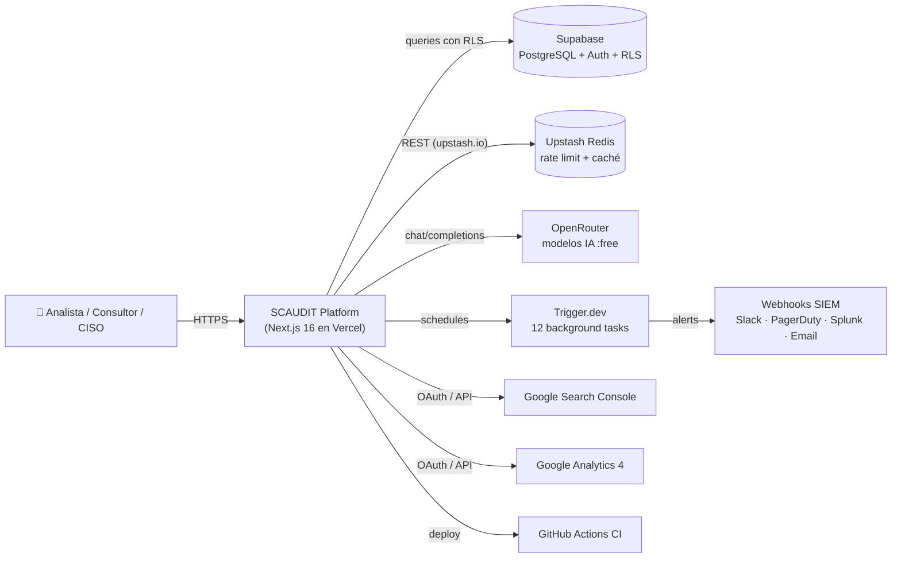
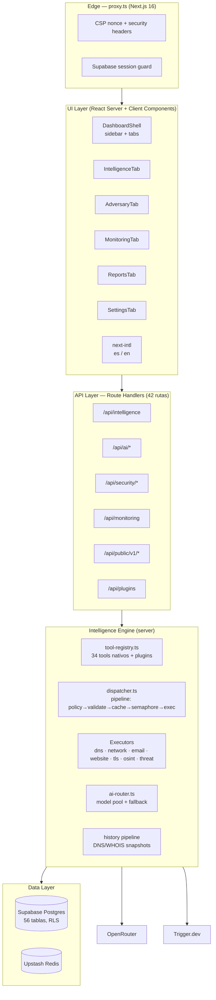
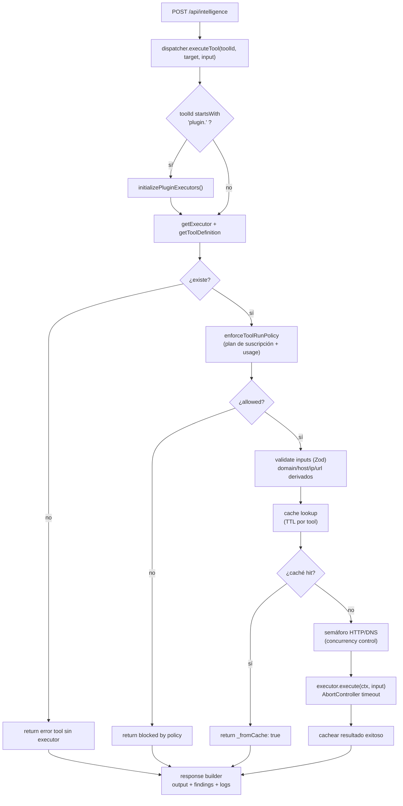
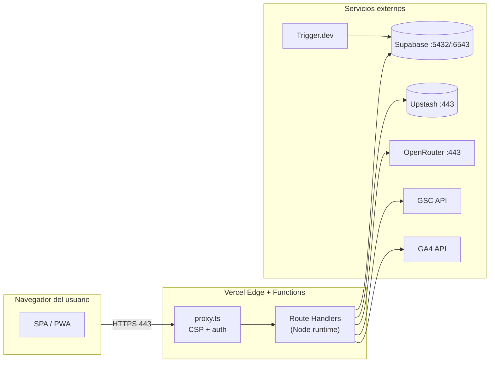
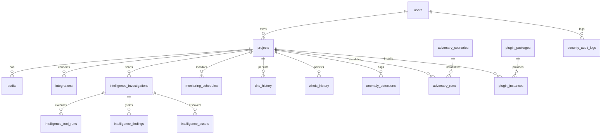
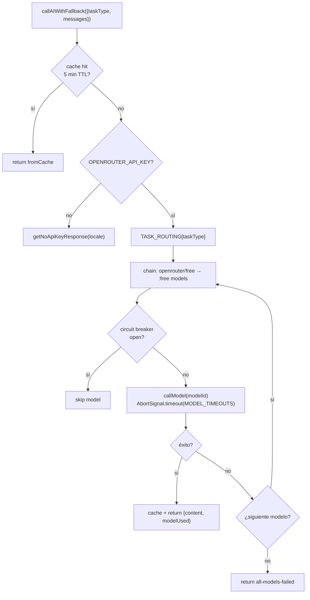
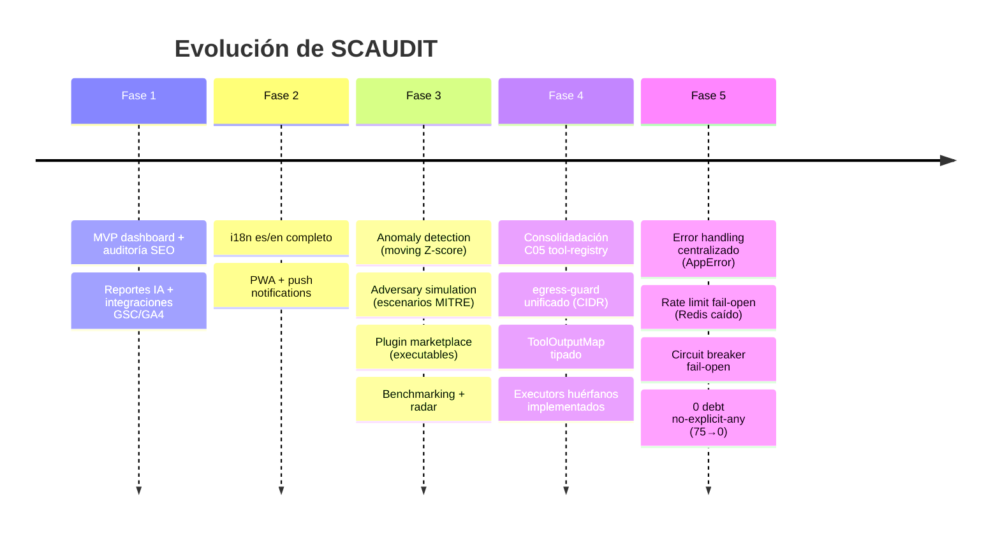
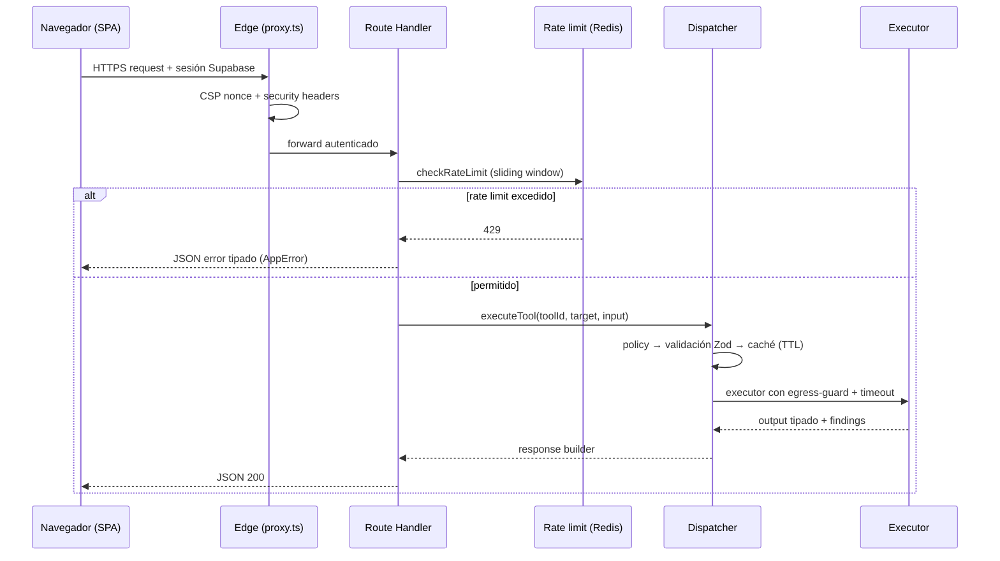

# Arquitectura Enterprise — SCAUDIT Pro

{: .no_toc }

<details open markdown="block">
  <summary>Tabla de contenidos</summary>
  {: .text-delta }
1. TOC
{:toc}
</details>

---

## 1. Executive Summary

SCAUDIT (StrategicAudit Pro) es una plataforma **enterprise-grade de inteligencia cibernética, monitoreo de superficie de ataque y auditoría técnica continua**. Este documento describe la arquitectura completa del sistema, anclada en el código fuente real (commit `main`, branch `main`).

| Atributo | Valor |
|----------|-------|
| **Dominio** | [scaudit.vercel.app](https://scaudit.vercel.app) |
| **Repo** | [StrategicConnex/StrategicConnexAudit](https://github.com/StrategicConnex/StrategicConnexAudit) |
| **Frontend** | Next.js 16 (App Router), React 19, Tailwind CSS v4, TypeScript 5 |
| **Backend** | Next.js Route Handlers, Drizzle ORM, Supabase (PostgreSQL + Auth + RLS) |
| **Cache/Rate Limit** | Upstash Redis (serverless), fail-open en memoria |
| **IA** | OpenRouter (pool de modelos `:free` + meta-modelo `openrouter/free`) |
| **Jobs** | Trigger.dev (12 tasks: SIEM, discovery, anomaly, adversary, uptime, …) |
| **Docs** | GitHub Pages + Jekyll (just-the-docs) |
| **CI/CD** | GitHub Actions → Vercel (deploy automático) |

### Principios arquitectónicos

1. **Resiliencia fail-open**: la disponibilidad de la app **nunca** depende de Redis ni de la IA (degradación graciosa verificada en producción).
2. **Single Source of Truth**: `tool-registry.ts` es el único registro de tools (C05 consolidó 4 superficies en 1).
3. **Defensa en profundidad**: RLS multi-tenant + egress-guard SSRF + CSP nonce + rate limiting + audit logging.
4. **Seguridad por defecto**: egress-guard bloquea CIDRs privados/meta en TODA salida HTTP del engine.

---

## 2. Documentation Scope

**Audiencia:** arquitectos, desarrolladores, ingenieros de seguridad, operadores y auditores.

**Alcance:** plataforma completa — frontend, API, engine de inteligencia, IA, seguridad, datos, despliegue y operaciones.

**Niveles de abstracción:** L1 (conceptual) a L4 (implementación), con diagramas etiquetados por nivel.

**Exclusiones:** detalles internos de terceros (Supabase, Vercel, OpenRouter), procedimientos de negocio de StrategicConnex.

**Documentos de decisión (ADRs):** las decisiones históricas clave están registradas en [ADR-000-template](ADR/ADR-000-template.md) · [ADR-001](ADR/ADR-001-consolidar-tool-registry.md) (tool-registry C05) · [ADR-002](ADR/ADR-002-fail-open-rate-limit.md) (fail-open Redis) · [ADR-003](ADR/ADR-003-i18n-cookie-based.md) (i18n cookie) · [ADR-004](ADR/ADR-004-polling-vs-sse.md) (polling vs SSE) · [ADR-005](ADR/ADR-005-egress-guard-ssrf.md) (egress SSRF) · [ADR-006](ADR/ADR-006-rls-with-set-local-role.md) (RLS `SET LOCAL ROLE`).

---

## 3. System Context (C1)

**FIG-001 — System Context Diagram** · Nivel L1 · Mermaid `flowchart`



**Propósito:** quién interactúa con el sistema y con qué servicios externos.
**Audiencia:** ejecutivos y arquitectos (L1).
**Fuente:** `package.json`, `src/app`, `src/shared/config/env.ts`.

---

## 4. Architecture Overview (Containers)

**FIG-002 — Container / High-Level Architecture** · Nivel L1–L2 · Mermaid `flowchart`



**Propósito:** vista de contenedores — cómo se agrupa el sistema en capas.
**Audiencia:** arquitectos y desarrolladores (L2).
**Fuente:** árbol `src/`, `find src/app/api -name route.ts` (41 rutas).

---

## 5. Architecture Views

| Vista | Qué representa | Diagrama | Nivel |
|-------|---------------|----------|-------|
| Business | Capacidades del producto (dashboard, intel, SIEM, SEO) | `docs/index.md` (capacidades) | L0 |
| Application | Frontend + API + engine | Container Architecture (§4) | L2 |
| Data | 56 tablas, ERD núcleo | ERD Núcleo (§9) | L3 |
| Technology | Stack completo | tabla §2 | L1 |
| Security | Defensa en profundidad | Defense in Depth (§10) | L2 |
| Deployment | Vercel + Supabase + Upstash + Trigger.dev | Deployment Diagram (§8) | L3 |
| Integration | Webhooks SIEM, GSC/GA4, OpenRouter | System Context (§3) | L2 |

---

## 6. System Components

### 6.1 Frontend (src/app, src/features)

| Componente | Tipo | Responsabilidad |
|-----------|------|-----------------|
| `src/app/page.tsx` | Server | Redirect a `/login` o `/dashboard` según sesión |
| `src/app/(dashboard)` | Server Layout | Shell con sidebar + tabs |
| `IntelligenceTab.tsx` | Client | Motor de escaneo: surface, mapa, DNS/WHOIS, PDF, hallazgos |
| `AdversaryTab.tsx` | Client | Simulación de adversarios (escenarios MITRE) |
| `MonitoringTab.tsx` | Client | Uptime/latencia en vivo (SSE) |
| `ReportsTab.tsx` | Client | Reporte SEO con datos GSC/GA4 + generación IA |
| `SettingsTab.tsx` | Client | Configuración de integraciones y API keys |
| `AiCopilot.tsx` | Client | Chat de remediación |
| `GeoMap.tsx` | Client | Mapa Leaflet de activos (GeoIP + traceroute) |
| `ScoreGauge.tsx` | Client | Gauge de health score |

**Framework de estado:** Zustand (`intelligence-store.ts`) + React Query (`@tanstack/react-query`) + realtime Supabase.

### 6.2 API Layer (42 route handlers)

| Grupo | Rutas | Protección |
|-------|-------|-----------|
| `/api/intelligence/*` (15) | `/intelligence`, investigations, assets/graph, discovery, runs, history, drift, anomalies, adversary, brief, copilot, health, live, graph, bulk | Auth + rate limit + `withErrorHandler` |
| `/api/ai/*` (3) | copilot, report, healthcheck | Auth + rate limit IA (5 req/60s) |
| `/api/security/*` (5) | siem-alerts, siem/run, siem/test, audit-logs, csp-report | Auth + SIEM |
| `/api/monitoring` | uptime + alerts | Auth |
| `/api/public/v1/*` (2) | health, intelligence | API key (public) |
| Otros (19) | plugins, benchmarking, bulk-scan, webhooks, telemetry, projects, api-keys, notifications, cron, looker-studio, reports/pdf | Variada |

**Patrón común:** `withErrorHandler` (try/catch centralizado + `handleApiError`) compuesto con `withRateLimit` (sliding window).

**Censo exacto** (42 archivos `route.ts` verificados con `find src/app/api -name route.ts`):

```
ai/copilot · ai/healthcheck · ai/report · api-keys · api-keys/[id]/usage · auth/validate-email ·
benchmarking · bulk-scan · cron/siem · cron/uptime · intelligence · intelligence/adversary ·
intelligence/anomalies · intelligence/assets/graph · intelligence/brief · intelligence/bulk ·
intelligence/copilot · intelligence/discovery · intelligence/drift · intelligence/graph ·
intelligence/health · intelligence/history · intelligence/investigations · intelligence/live ·
intelligence/runs · looker-studio · monitoring · notifications/push-subscribe · plugins ·
projects/[id]/export/keywords · projects/[id]/members · public/v1/health · public/v1/intelligence ·
reports/pdf/progress · security/audit-logs · security/csp-report · security/siem-alerts ·
security/siem/run · security/siem/test · telemetry/vitals · webhooks · webhooks/cicd
```

### 6.3 Intelligence Engine

**FIG-003 — Pipeline del Dispatcher** · Nivel L3 · Mermaid `flowchart`



**Propósito:** pipeline de ejecución de cada herramienta de inteligencia.
**Audiencia:** desarrolladores (L3).
**Fuente:** `src/server/intelligence/core/dispatcher.ts`.

### 6.4 Catálogo de Tools (34 nativos + 9 catálogo + plugins)

**MAT-001 — Matriz de Tools por categoría** (código real de `tool-registry.ts`)

| Categoría | Tools nativos | Plan requerido |
|-----------|--------------|----------------|
| `dns` | lookup, mx, txt, ns, dnssec, propagation, zone | free–business |
| `network` | ping, traceroute, asn, geoip, cdn, waf, reverse_dns, reverse_ip, bgp, subdomain_takeover | free–enterprise |
| `email-security` | spf, dkim, dmarc | free–pro |
| `website` | headers, security_headers, redirects, cookies, csp, robots, tech_stack | free–pro |
| `ssl-tls` | tls.scan, tls.advanced | free–pro |
| `osint` | whois, whois.full | free |
| `threat` | ip_reputation, custom_intel, cve_lookup | business–enterprise |
| Catálogo | port_scan, mail_health, smtp, blacklists, bimi, email.score, server_reputation, performance, fingerprint | pro–business |

**Fuente:** `src/server/intelligence/core/tool-registry.ts` (`NATIVE_TOOLS` 34 + `ORPHAN_DEFINITIONS` 9).

---

## 7. Network Architecture

**FIG-004 — Topología de Red / Conectividad** · Nivel L2 · Mermaid `flowchart`



**Detalle técnico (egress-guard, `src/server/intelligence/security/egress-guard.ts`):**

| Aspecto | Configuración |
|---------|--------------|
| Protocolos | `http:`, `https:` únicamente |
| Bloqueo IP | CIDRs privados (IPv4/IPv6): loopback, link-local, RFC1918, `::ffff:` IPv4-mapped, 0.0.0.0/8, 198.18/15, 169.254/16 |
| DNS rebinding | Resolución y validación de la IP destino antes de fetch |
| Redirects | Seguimiento manual con re-validación en cada salto |
| Timeout | Forzado por `safeFetch` |
| User-Agent | Custom, no navegador |

---

## 8. Cloud / Deployment Architecture

**FIG-005 — Deployment Diagram** · Nivel L3 · ASCII

```text
GitHub ──push main──▶ GitHub Actions ──deploy──▶ Vercel (Production + Preview)
        (StrategicConnex)   (lint + test +        │
                           coverage)             │
              ┌──────────────────────────────────┼─────────────────────┐
              ▼                                  ▼                     ▼
     Supabase PostgreSQL                 Upstash Redis           Trigger.dev
     (project sbktqevuy…)                (rate limit + caché)    (project proj_vzzxt…)
              ▲                                  │
              └──────────────────────────────────┘
                                                 │
                                                 ▼
                                     Cloudflare / Upstash edge
```

| Servicio | Rol | Plan |
|----------|-----|------|
| Vercel | Hosting Next.js, serverless functions, edge proxy | Hobby/Pro |
| Supabase | PostgreSQL + Auth (Magic Link) + RLS + Realtime | Free/Pro |
| Upstash | Redis serverless — rate limit + caché | Free (10k cmds/día) |
| OpenRouter | Pool de modelos IA gratuitos | Free (50 req/día) |
| Trigger.dev | 12 tasks background | Free |
| GitHub Actions | CI (lint, 198 tests, coverage) | Free |

---

## 9. Data Architecture

### 9.1 Modelo de datos (núcleo)

**FIG-006 — ERD Núcleo** · Nivel L3 · Mermaid `erDiagram`



**Tablas por dominio** (código real `src/shared/db/schemas/*.ts`):

| Dominio | Archivo | Tablas |
|---------|---------|--------|
| Core | `index.ts` | users, projects, subscription_plans, subscriptions, integrations, integration_sync_logs, integration_data_gsc/ga4/bing, audits, crawl_results, internal_links, performance_results, audit_rules, project_audit_rules, issues, keyword_targets, rank_history, competitors, competitor_keywords, backlinks, backlink_history, ab_tests, ab_test_results, heatmap_sessions, schema_validations, reports, report_exports, audit_logs, uptime_logs, web_vitals_logs |
| Intelligence | `intelligence.ts` | intelligence_investigations, intelligence_tool_runs, intelligence_findings, intelligence_assets, intelligence_run_events, intelligence_usage_events |
| History | `history.ts` | dns_history, whois_history |
| Security | `security-audit.ts` | security_audit_logs, siem_alert_logs |
| Monitoring | `monitoring.ts` | monitoring_schedules, monitoring_alerts, developer_api_keys, webhook_configs |
| Plugins | `plugins.ts` | plugin_packages, plugin_instances |
| Adversary | `adversary.ts` | adversary_scenarios, adversary_runs |
| Anomaly | `anomaly.ts` | anomaly_detections |
| Health | `health.ts` | ai_health_logs |
| Teams | `teams.ts` | project_members, project_invitations, team_audit_logs |
| Notificaciones | `push-subscriptions.ts` | push_subscriptions |
| Tech stack | `technologies.ts` | domain_technologies |

### 9.2 Persistencia e índices

- **Migraciones:** Drizzle (`drizzle/` + `meta/_journal.json`), aplicadas vía `pnpm db:push`.
- **Índices compuestos:** intelligence (investigationId+createdAt, projectId+status, toolId+investigationId), uptime_logs (checked_at), monitoring.
- **RLS:** políticas por tabla vía `withRLS(userId, cb)` — `SET LOCAL ROLE authenticated` + `set_config('request.jwt.claims', sub)` dentro de transacción (patrón verificado para evitar contaminación del pool).

---

## 10. Security Architecture

**FIG-007 — Defensa en Profundidad** · Nivel L2 · ASCII

```text
┌─ Request ─┐
     │
     ▼
┌─────────────────────────────────────────────────────────┐
│ Capa 1 — Edge                                           │
│   · CSP nonce + headers (proxy.ts)                      │
│   · Supabase session guard                              │
├─────────────────────────────────────────────────────────┤
│ Capa 2 — API                                            │
│   · withErrorHandler + AppError                         │
│   · Rate limit Redis (fail-open en memoria)             │
│   · Email allowlist bypass                              │
├─────────────────────────────────────────────────────────┤
│ Capa 3 — Engine                                         │
│   · egress-guard SSRF (CIDR + DNS rebinding)            │
│   · Policy enforcer (plan de suscripción)               │
│   · Validación Zod de inputs                            │
├─────────────────────────────────────────────────────────┤
│ Capa 4 — Datos                                          │
│   · RLS multi-tenant                                    │
│   · service_role solo server                            │
├─────────────────────────────────────────────────────────┤
│ Capa 5 — Observabilidad                                 │
│   · security_audit_logs · SIEM alerts                   │
└─────────────────────────────────────────────────────────┘
     │
     ▼
  Respuesta
```

### Matriz de controles de seguridad

**MAT-002 — Security Control Matrix**

| Control | Implementación | Archivo |
|---------|---------------|---------|
| CSP | `default-src 'self'`, `script-src 'self' 'nonce-<nonce>' 'strict-dynamic'` (+`'unsafe-eval'` en dev), `object-src 'none'`, `connect-src 'self' https://*.supabase.co` (IA/SIEM corren server-side, fuera del alcance del CSP), `frame-ancestors 'none'`, nonce por request aplicado por Next.js 16 + meta CSP espejo en `layout.tsx` | `src/proxy.ts` |
| HSTS | `max-age=31536000; includeSubDomains; preload` | `src/proxy.ts` |
| Clickjacking | `X-Frame-Options: DENY` | `src/proxy.ts` |
| MIME sniffing | `X-Content-Type-Options: nosniff` | `src/proxy.ts` |
| SSRF | egress-guard CIDR + DNS rebinding + redirects validados | `egress-guard.ts` |
| Rate limiting | sliding window Redis + fallback memoria | `ratelimit.ts` |
| RLS | `withRLS()` por query multi-tenant | `db/rls.ts` |
| Open redirect | `safeNext()` en callback auth | `auth/callback` |
| Secrets | env vars server-only, `.env*` gitignored | `.gitignore` |
| Error handling | AppError tipados, sin leak de stack | `error-handler.ts` |
| Audit | `logSecurityEvent()` → `security_audit_logs` | `audit-log.ts` |

---

## 11. AI / LLM Architecture

**FIG-008 — Model Router (ai-router.ts)** · Nivel L3 · Mermaid `flowchart`



### Task routing (código real `TASK_ROUTING` + `MODEL_TIMEOUTS`)

**MAT-003 — Matriz de enrutamiento de tareas IA**

| Task | Cadena (orden) | Timeout |
|------|---------------|---------|
| `copilot-remediation` | openrouter/free → gemma-4 → nemotron-omni → nemotron-super → nemotron-ultra | 20s × 5 |
| `incident-brief` | openrouter/free → gemma-4 → nemotron-super → nemotron-omni → nemotron-ultra | 20s × 5 |
| `general-chat` | openrouter/free → nemotron-omni → gemma-4 → nemotron-super → nemotron-nano | 20s × 5 |
| `seo-report` | openrouter/free → gemma-4 (acotada, peor caso 2×50s=100s < maxDuration=120s) | 50s × 2 |

**Resiliencia verificada en producción (jul 2026):**
- Redis caído → `safeRedis` fail-open (1.5s timeout) — nunca descarta resultados exitosos ni agrega 5–15s de latencia (fix `d59543a`).
- Modelo lento → timeouts por tarea + cadena de fallback (`26c8524`).
- Reporte sin mermaid → template resiliente con sección fija mermaid (`14ce62d`).

---

## 12. Integraciones

**MAT-004 — Integration Matrix**

| Integración | Dirección | Protocolo | Autenticación |
|------------|-----------|-----------|---------------|
| Supabase Auth | Bidireccional | HTTPS REST | anon key + JWT |
| Supabase Postgres | App → DB | PostgreSQL (pooler :6543 / direct :5432) | service_role / JWT claims |
| Upstash Redis | App → Redis | HTTPS REST (`*.upstash.io`) | Bearer token |
| OpenRouter | App → IA | HTTPS `chat/completions` | Bearer API key |
| GSC | App → Google | OAuth | refresh token |
| GA4 | App → Google | OAuth | refresh token |
| Trigger.dev | App ↔ Jobs | SDK | TRIGGER_SECRET_KEY |
| Webhooks SIEM | App → Slack/PD/Splunk/Email | HTTPS POST | webhook URLs |

---

## 13. Observabilidad

**MAT-005 — Observability Matrix**

| Señal | Mecanismo | Endpoint/Archivo |
|-------|-----------|-----------------|
| Health check público | `/api/public/v1/health` (status ok/degraded/down, redisConfigured, dbConfigured) | `public/v1/health/route.ts` |
| Health IA | `/api/ai/healthcheck` (prueba modelos del pool) | `ai/healthcheck` |
| AI health logs | Tabla `ai_health_logs` | `schemas/health.ts` |
| Security audit | `logSecurityEvent` → `security_audit_logs` | `audit-log.ts` |
| SIEM | Patrones → `siem_alert_logs` + webhooks | `siem-exporter` |
| Web Vitals | `/api/telemetry/vitals` (RUM) | `telemetry/vitals` |
| Logging estructurado | `shared/lib/logger.ts` (info/warn/error/security) | `logger.ts` |

---

## 14. Threat Model

**MAT-006 — Threat-to-Control Mapping (STRIDE)**

| Threat (STRIDE) | Superficie | Control |
|-----------------|-----------|---------|
| Spoofing | Login / callback | Magic Link + email allowlist + rate limit |
| Tampering | Requests HTTP | HSTS + `upgrade-insecure-requests` + egress-guard |
| Repudiation | Acciones de usuario | `security_audit_logs` + SIEM |
| Information Disclosure | APIs | RLS + auth + `service_role` solo server |
| DoS | Endpoints | rate limit Redis + semáforos de concurrencia + timeouts |
| Elevation of Privilege | Multi-tenant | RLS por `request.jwt.claims.sub` + `SET LOCAL ROLE authenticated` |
| SSRF | Engine de escaneo | egress-guard CIDR + DNS rebinding |
| Prompt injection | IA | Prompts con contexto acotado + modelo específico por tarea |

---

## 15. Risk Model

**MAT-008 — Risk Matrix** (probabilidad × impacto, controles existentes)

| # | Riesgo | Prob. | Impacto | Control mitigante | Residual |
|---|--------|-------|---------|-------------------|----------|
| R1 | Redis/Upstash caído | Media | Alto | Fail-open en memoria + `safeRedis` 1.5s timeout | Bajo |
| R2 | Outage de modelos IA | Media | Medio | Pool `:free` con cadena de fallback + template resiliente | Bajo |
| R3 | Fuga multi-tenant | Baja | Crítico | RLS por `request.jwt.claims.sub` + `SET LOCAL ROLE` | Bajo |
| R4 | SSRF desde el engine | Media | Alto | egress-guard CIDR + DNS rebinding + redirects validados | Bajo |
| R5 | Rate limit evadido | Media | Medio | Sliding window Redis (global) + allowlist de email | Medio |
| R6 | Dependencias vulnerables | Media | Medio | CI con SCA (en `ci.yml`) + upgrade tracking | Medio |
| R7 | Pérdida de datos Postgres | Baja | Alto | Backups automáticos de Supabase + PITR | Bajo |
| R8 | Credenciales expuestas | Baja | Crítico | `.env*` gitignored + env encryptados en Vercel | Bajo |
| R9 | Abuso del plan free de IA | Media | Bajo | 50 req/día OpenRouter + rate limit por tarea | Bajo |

---

## 16. Disaster Recovery & Business Continuity

| Escenario | RTO objetivo | RPO objetivo | Procedimiento |
|-----------|-------------|--------------|---------------|
| DB de Upstash eliminada | < 15 min | 0 (stateless) | [Recuperación Upstash Redis](/docs/guides/upstash-redis-recovery) — recrear DB + `apply-upstash-env.mjs` |
| Deploy roto en Vercel | < 10 min | 0 | Rollback a último deploy sano (Vercel → Instant Rollback) |
| Pérdida de datos Postgres | < 4 h | ≤ 7 días (plan free) | Restore desde Supabase → Database backups / PITR |
| Outage de Supabase | < 1 h | 0 | Dependencia gestionada; monitorear status.supabase.com |
| Pérdida de secrets | < 30 min | 0 | Regenerar en dashboards (Supabase, Upstash, OpenRouter, Trigger.dev) + Vercel env |

**Redundancia:**
- Redis: stateless (solo rate limit + caché) — sin RPO.
- IA: pool multi-modelo — sin punto único de fallo.
- Base de datos: managed por Supabase (HA + backups + PITR).
- App: serverless en Vercel (múltiples regiones, auto-escalado).

---

## 17. Matriz de Variables de Entorno

**MAT-007 — Environment Variable Matrix** (fuente `env.ts` + `.env.example`)

| Variable | Tipo | Uso |
|----------|------|-----|
| `NEXT_PUBLIC_SUPABASE_URL` | Público | Cliente Supabase |
| `NEXT_PUBLIC_SUPABASE_PUBLISHABLE_KEY` | Público | anon key |
| `SUPABASE_SERVICE_ROLE_KEY` | Secreto | Server only, bypass RLS |
| `DATABASE_URL` | Secreto | Pooler :6543 |
| `DIRECT_URL` | Secreto | Migraciones :5432 |
| `UPSTASH_REDIS_REST_URL` | Secreto | Rate limit/caché |
| `UPSTASH_REDIS_REST_TOKEN` | Secreto | Auth Redis |
| `OPENROUTER_API_KEY` | Secreto | Pool IA |
| `OPENROUTER_BASE_URL` | Secreto | Default `https://openrouter.ai/api/v1` |
| `TRIGGER_SECRET_KEY` | Secreto | Trigger.dev |
| `AUTH_EMAIL_ALLOWLIST` | Secreto | Emails con bypass de rate limit (comma-separated) |
| `CRON_SECRET` | Secreto | Protege endpoints cron |
| `VAPID_PUBLIC_KEY` / `VAPID_PRIVATE_KEY` | Secreto | Push notifications (PWA) |
| `SIEM_WEBHOOK_SLACK` / `SIEM_WEBHOOK_PAGERDUTY` / `SIEM_WEBHOOK_SPLUNK` | Secreto | Alertas SIEM |
| `SIEM_PAGERDUTY_ROUTING_KEY` | Secreto | Routing PagerDuty |
| `RESEND_API_KEY` / `SIEM_EMAIL_FROM` / `SIEM_EMAIL_TO` | Secreto | Alertas por email |
| `GEMINI_API_KEY` / `Bearer_API_KEY` / `XIAOMI_BASE_URL` | Legado | Compatibilidad |
| `NEXT_PUBLIC_DEV_BYPASS_AUTH` / `DB_ALLOW_INSECURE_SSL` | Dev | Solo local (guard `NODE_ENV`) |

---

## 18. Timeline — Evolución del Sistema

**FIG-009 — Architecture Evolution Timeline** · Nivel L1 · Mermaid `timeline`



---

## 19. Visual Documentation Inventory

**INV-001 — Inventario visual completo**

| ID | Figura | Tipo | Nivel | Propósito | Audiencia |
|----|--------|------|-------|-----------|-----------|
| FIG-001 | System Context | Diagram (C1) | L1 | Quién interactúa con el sistema | Ejecutivos, arquitectos |
| FIG-002 | Container Architecture | Diagram (C2) | L2 | Capas del sistema | Arquitectos |
| FIG-003 | Dispatcher Pipeline | Flowchart | L3 | Ejecución de tools | Desarrolladores |
| FIG-004 | Network Topology | Diagram | L2 | Conectividad y egress | Red, seguridad |
| FIG-005 | Deployment Diagram | Diagram | L3 | Despliegue cloud | DevOps |
| FIG-006 | ERD Núcleo | Model (ER) | L3 | Modelo de datos | Data, desarrolladores |
| FIG-007 | Defense in Depth | Diagram | L2 | Capas de seguridad | Seguridad |
| FIG-008 | AI Model Router | Flowchart | L3 | Routing IA + fallback | Desarrolladores |
| FIG-009 | Evolution Timeline | Timeline | L1 | Evolución del sistema | Todos |
| MAT-001 | Tool Catalog | Matrix | L3 | Catálogo 34+ tools | Desarrolladores |
| MAT-002 | Security Controls | Matrix | L2 | Controles → archivos | Seguridad, auditores |
| MAT-003 | AI Task Routing | Matrix | L3 | Cadenas + timeouts | Desarrolladores |
| MAT-004 | Integrations | Matrix | L2 | Integraciones externas | Arquitectos |
| MAT-005 | Observability | Matrix | L2 | Señales y endpoints | SRE, operaciones |
| MAT-006 | Threat-to-Control | Matrix (STRIDE) | L2 | Modelo de amenazas | Seguridad |
| MAT-007 | Env Variables | Matrix | L3 | Configuración | DevOps |
| MAT-008 | Risk Matrix | Matrix | L2 | Probabilidad×impacto + controles | Seguridad, auditores |
| FLOW-001 | Request/Response Flow | Sequence | L3 | Ciclo de vida de request autenticado | Desarrolladores |
| TEST-001 | Test Suites Matrix | Matrix | L3 | Estrategia + cobertura de tests | QA, desarrolladores |

---

## 20. Trazabilidad (esquema)

```text
Requisitos ──▶ Arquitectura ──▶ Componentes ──▶ Implementación ──▶ Configuración
(docs/installation · README) (este documento) (src/*) (TypeScript) (.env · vercel.json)
                        │
                        ▼
                   Tests (198 vitest · e2e)
                        │
                        ▼
                   Evidencia (CI green · deploy verificado)
```

---

## 21. Flujos Documentados (Request/Response)

**FLOW-001 — Ciclo de vida de un request autenticado** · Nivel L3 · Mermaid `sequenceDiagram`



| FLOW | Flujo | Componentes |
|------|-------|-------------|
| FLOW-001 | Request/response autenticado | `proxy.ts` → route handler → `ratelimit.ts` → `dispatcher.ts` → executor → respuesta |
| Pipeline de tools | Ejecución de herramientas de inteligencia | pipeline del dispatcher (§6.3): policy → validate → cache → semaphore → exec |

---

## 22. Testing & Validación

**TEST-001 — Matriz de Suites de Test** (código real: `package.json` scripts + `find src -name '*.test.ts'`)

| Suite | Alcance | Comando · CI |
|-------|---------|--------------|
| Vitest unit (18 archivos) | Executors, egress-guard, scan-response, ratelimit, markdown, severity, SIEM, sandbox, scenario-runner, proxy, math, rum, report-utils | `pnpm test` · job `test-and-coverage` |
| E2E Playwright (4 specs) | Login, dashboard, pentest auth+ratelimit, visual regression | `pnpm test:e2e` |
| API contract | Colección OpenAPI generada | `pnpm test:contract` · job `api-contract-test` |
| Docs quality gate | 20 checks × 5 pts sobre `docs/architecture/*.md` | `scripts/quality-gate.mjs` · job `docs-quality-gate` |

**Casos unitarios por dominio:**

| Dominio | Casos cubiertos |
|---------|----------------|
| Executors | DNS, network, TLS, email, OSINT con outputs tipados (ToolOutputMap) |
| Seguridad | egress-guard SSRF, SIEM exporter, sandbox executor |
| Core | scan-response, ratelimit (fail-open), report-utils (parseo de markdown) |

---

## 23. Unknowns y Assumptions

| Marcador | Ítem | Estado |
|----------|------|--------|
| [VERIFIED] | 42 route handlers | Conteo `find src/app/api -name route.ts` en commit main |
| [VERIFIED] | 198 tests unit verdes | Corrido en CI (job `test-and-coverage`) |
| [ASSUMPTION] | 56 tablas en producción | Conteo de `schemas/*.ts`; las migraciones Drizzle pueden variar |
| [UNKNOWN] | Límite exacto de tokens del pool `:free` | No publicado por OpenRouter; caché 5 min como mitigación |
| [UNKNOWN] | Costo real por usuario de IA | Sin métricas de billing agregadas |

---

## 24. Validación Cruzada (Inconsistencias Resueltas)

Durante la cross-check de este documento se detectó que la tabla §5 (Architecture Views) referenciaba IDs cruzados con las figuras reales:

| Elemento | Valor A (escrito) | Valor B (real) | Resolución |
|----------|-------------------|----------------|------------|
| §5 fila Data | Deployment Diagram | ERD Núcleo (§9) | Corregido: referencia al ERD Núcleo por nombre (§9) |
| §5 fila Security | ERD Núcleo | Defense in Depth (§10) | Corregido: referencia a Defense in Depth por nombre (§10) |
| §5 fila Deployment | Defense in Depth | Deployment Diagram (§8) | Corregido: referencia a Deployment Diagram por nombre (§8) |

**Regla aplicada:** los IDs (FIG/MAT/FLOW/TEST) se referencian de forma canónica en el inventario visual (§19) y por nombre en las tablas de vistas, evitando referencias cruzadas ambiguas.

---

## 25. Glosario

| Término | Definición |
|---------|-----------|
| egress-guard | Guardia de salida HTTP que bloquea CIDRs privados (RFC1918, loopback, link-local) y mitiga SSRF/DNS rebinding |
| RLS | Row Level Security: filtro multi-tenant por query en Supabase (`withRLS`) |
| fail-open | Degradación que prioriza disponibilidad: Redis o IA caídos no tumban la app |
| ToolOutputMap | Mapa tipado tool → output concreto, reemplazó `Map<string, any>` en scan-response |
| dispatcher | Pipeline central de ejecución de tools: policy → validate → cache → semaphore → exec |
| sliding window | Algoritmo de rate limiting en ventanas de tiempo (Redis + fallback memoria) |
| tool-registry | Única fuente de verdad del catálogo de tools (consolidación C05) |
| sequenceDiagram | Diagrama de secuencia Mermaid para flujos request/response |

---

{: .note }
**Fuentes de este documento:** código fuente en `src/`, `package.json`, `docs/installation.md`, `docs/guides/*`, commits de `main` (verificados: `eda77c4`, `6f04ea5`, `26c8524`, `14ce62d`, `d59543a`, `88b7f2c`).

{: .tip }
**¿Quieres profundizar?** [Instalación](/docs/installation) · [Seguridad](/docs/security) · [API](/docs/api) · [Pipeline DNS/WHOIS](/docs/architecture/pipeline-history) · [Recuperación Redis](/docs/guides/upstash-redis-recovery)
