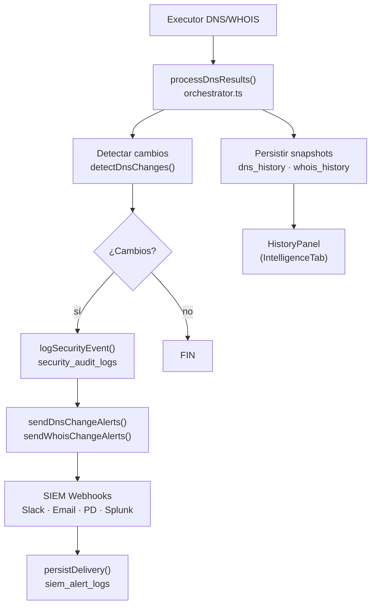
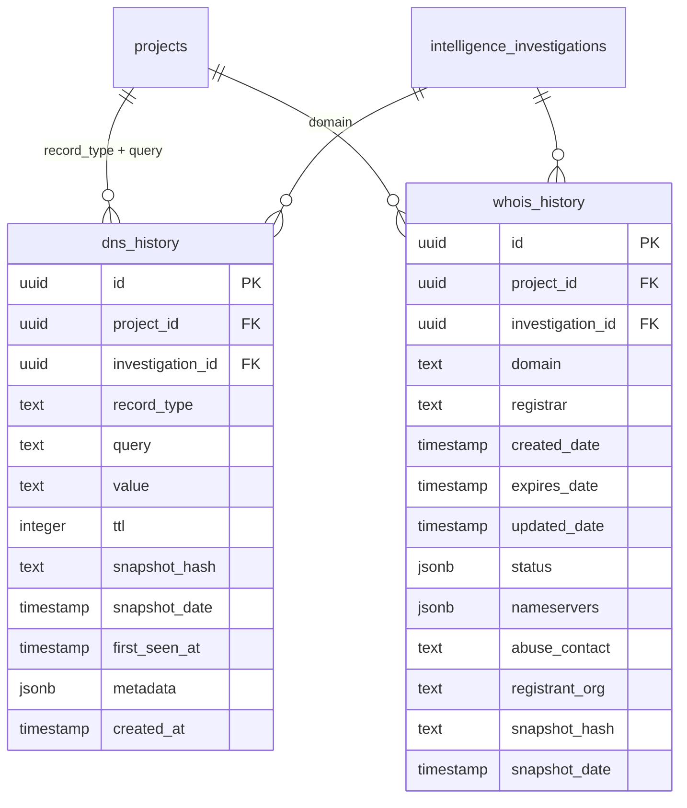
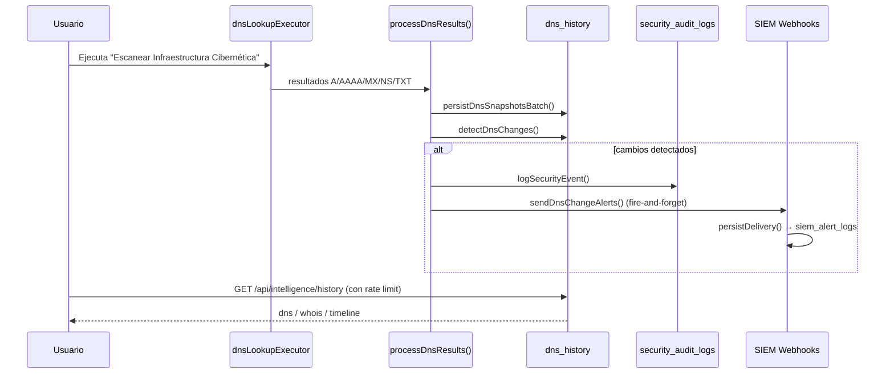

# Pipeline de Historial DNS/WHOIS — Arquitectura

{: .no_toc }

<details open markdown="block">
  <summary>Table of Contents</summary>
  {: .text-delta }
1. TOC
{:toc}
</details>

---

## Visión general

El pipeline P0.2 (Historical DNS/WHOIS Tracking) proporciona **persistencia histórica** y **detección de cambios** para registros DNS y WHOIS de todos los dominios auditados. Cada vez que un executor ejecuta un escaneo, los resultados se persisten automáticamente como snapshots. Cuando un dominio se escanea múltiples veces, el sistema compara los snapshots consecutivos y detecta cambios (añadido, modificado, eliminado). Si hay cambios, se disparan alertas SIEM automáticas a todos los canales configurados.

**FIG-001 — Pipeline general P0.2** · Nivel L2 · Mermaid `flowchart`



---

## Alcance y Objetivos

**Objetivo:** el pipeline P0.2 (Historical DNS/WHOIS Tracking) proporciona **persistencia histórica** y **detección de cambios** para registros DNS y WHOIS de todos los dominios auditados, con alertas SIEM automáticas ante cambios relevantes.

**Alcance:**

| Componente | Ubicación |
|-----------|-----------|
| Persistencia + detección + orquestación | `src/server/intelligence/history/` |
| Alertas SIEM de cambios | `src/server/security/dns-change-alert.ts` · `whois-change-alert.ts` |
| Endpoint de consulta | `GET /api/intelligence/history` |
| Panel UI | `src/app/components/HistoryPanel.tsx` |
| Esquemas + migración | `src/shared/db/schemas/history.ts` · `drizzle/0010_dns_whois_history.sql` |

**Fuera de alcance:** resolución DNS/WHOIS en vivo (executors), otras alertas SIEM (`api-key-expiry-alert.ts`), detalle de los webhooks SIEM.

---

## Requisitos

| ID | Requisito | Verificación |
|----|-----------|--------------|
| REQ-001 | Persistir snapshots DNS con deduplicación por hash SHA-256 | `persistDnsSnapshot()` |
| REQ-002 | Persistir snapshots WHOIS completos con detección de cambios por campo | `persistWhoisSnapshot()` |
| REQ-003 | Detectar cambios DNS entre snapshots consecutivos | `detectDnsChanges()` |
| REQ-004 | Orquestar persistencia + detección + alertas | `processDnsResults()` |
| REQ-005 | Emitir alertas SIEM (DNS y WHOIS) con severidad tipada | `dns-change-alert.ts` · `whois-change-alert.ts` |
| REQ-006 | Exponer consulta histórica por proyecto con filtros y rate limit | `GET /api/intelligence/history` |
| REQ-007 | Visualizar historial en 3 pestañas (DNS/WHOIS/Timeline) | `HistoryPanel.tsx` |

---

## Motivación

### ¿Por qué persistencia histórica?

Las consultas DNS y WHOIS tradicionales son **puntuales** — te dicen el estado actual pero no cómo cambió con el tiempo. La persistencia histórica permite:

1. **Detectar cambios** — ¿Cambió el registrador del dominio? ¿Expiró el certificado SSL?
2. **Auditar proveedores** — ¿El hosting movió tu IP a otro rango? ¿Cambiaron los nameservers?
3. **Responder incidentes** — ¿Cuándo apareció este subdominio? ¿Quién registró este dominio antes?
4. **Cumplimiento** — Mantener un historial de cambios WHOIS para compliance

### ¿Por qué detección de cambios?

No todos los cambios DNS/WHOIS son benignos:

**MAT-001 — Matriz de riesgos por tipo de cambio**

| Cambio | Riesgo |
|--------|--------|
| MX record cambiado | Posible hijacking de correo |
| NS record eliminado | Pérdida de servicio DNS |
| WHOIS registrador cambiado | Posible transferencia no autorizada |
| Fecha de expiración reducida | Dominio podría perderse |
| Nuevo subdominio con SSL | Shadow IT no autorizado |

---

## Modelo de Datos

**FIG-002 — ERD Histórico (dns_history · whois_history)** · Nivel L3 · Mermaid `erDiagram` · Fuente: `src/shared/db/schemas/history.ts`



### Diccionario de datos — `dns_history`

| Columna | Tipo | Descripción |
|---------|------|-------------|
| `id` | uuid PK | Identificador del snapshot |
| `project_id` | uuid FK | Proyecto al que pertenece (cascade delete) |
| `investigation_id` | uuid FK | Investigación que originó el snapshot |
| `record_type` | text | `"A"` · `"AAAA"` · `"MX"` · `"NS"` · `"TXT"` · `"SOA"` |
| `query` | text | Dominio consultado |
| `value` | text | Valor del registro |
| `ttl` | integer | Time to live (nullable) |
| `snapshot_hash` | text | SHA-256 truncado (deduplicación) |
| `snapshot_date` | timestamp | Fecha del snapshot |
| `first_seen_at` | timestamp | Primera vez observado |
| `metadata` | jsonb | Datos adicionales (ej. `priority`/`exchange` en MX) |

**Índices:** `idx_dns_history_project_record_type` (project_id, record_type) · `idx_dns_history_query_created` (query, created_at) · `idx_dns_history_snapshot_date` (snapshot_date).

### Diccionario de datos — `whois_history`

| Columna | Tipo | Descripción |
|---------|------|-------------|
| `id` | uuid PK | Identificador del snapshot |
| `project_id` | uuid FK | Proyecto (cascade delete) |
| `investigation_id` | uuid FK | Investigación origen |
| `domain` | text | Dominio del snapshot WHOIS |
| `registrar` | text | Registrador actual |
| `created_date` / `expires_date` / `updated_date` | timestamp | Fechas del WHOIS |
| `status` | jsonb | Lista de estados del dominio |
| `nameservers` | jsonb | Lista de nameservers |
| `abuse_contact` / `registrant_org` | text | Contacto de abuso / organización |
| `snapshot_hash` | text | SHA-256 del snapshot completo |
| `snapshot_date` | timestamp | Fecha del snapshot |

---

## Arquitectura

### 1. Tipos compartidos

`src/server/intelligence/history/types.ts` define los tipos base:

```typescript
// Snapshot DNS: representa el valor de un registro en un momento dado
interface DnsSnapshot {
  recordType: string;   // "A" | "AAAA" | "MX" | "NS" | "TXT" | ...
  query: string;        // El dominio consultado
  value: string;        // El valor del registro
  ttl: number | null;   // Time to live
  metadata?: Record<string, unknown>;  // Datos adicionales
}

// Snapshot WHOIS: representa el estado WHOIS completo de un dominio
interface WhoisSnapshot {
  domain: string;
  registrar: string | null;
  createdDate: Date | null;
  expiresDate: Date | null;
  updatedDate: Date | null;
  status: string[];
  nameservers: string[];
  abuseContact: string | null;
  registrantOrg: string | null;
  originalData: Record<string, unknown>;
}

// Cambio detectado entre snapshots
interface DnsChange {
  type: 'added' | 'removed' | 'changed';
  recordType: string;
  query: string;
  previousValue: string | null;
  currentValue: string | null;
  detectedAt: Date;
}

interface WhoisChange {
  field: string;           // "registrar" | "expiresDate" | "nameservers"
  label: string;           // "Registrador" | "Fecha de Expiración"
  previousValue: string | null;
  currentValue: string | null;
  severity: 'info' | 'warning' | 'critical';
  detectedAt: Date;
}
```

### 2. Persistencia DNS

`src/server/intelligence/history/dns-history.ts`

El flujo de persistencia usa **deduplicación por hash SHA-256** para evitar snapshots duplicados:

```
persistDnsSnapshot(projectId, investigationId, recordType, query, value, ttl, metadata)
  │
  ├─ snapshotStr = `${recordType}:${query}:${value}:${ttl}`
  ├─ snapshotHash = sha256(snapshotStr).slice(0, 16)
  │
  ├─ ¿Existe un snapshot con mismo hash en los últimos 60s?
  │   ├─ Sí → return (dedup, no insert)
  │   └─ No → INSERT en dns_history
  │
  └─ catch → console.error (fail-safe)
```

**Batch insert:** `persistDnsSnapshotsBatch()` itera sobre un array de snapshots y llama `persistDnsSnapshot()` por cada uno.

### 3. Persistencia WHOIS

`src/server/intelligence/history/whois-history.ts`

La persistencia WHOIS es más compleja porque compara el snapshot completo contra el último guardado:

```
persistWhoisSnapshot(projectId, investigationId, snapshot)
  │
  ├─ snapshotStr = JSON.stringify(snapshot)
  ├─ snapshotHash = sha256(snapshotStr)
  │
  ├─ ¿Último snapshot tiene mismo hash?
  │   ├─ Sí → return { isNew: false, changes: [] }
  │   └─ No → CONTINUE
  │
  ├─ Determinar cambios comparando campos:
  │   ├─ registrar:        anterior vs nuevo  → WhoisChange { severity: 'warning' }
  │   ├─ expiresDate:      anterior vs nuevo  → WhoisChange { severity: 'critical' }
  │   ├─ nameservers:      anterior vs nuevo  → WhoisChange { severity: 'warning' }
  │   └─ registrantOrg:    anterior vs nuevo  → WhoisChange { severity: 'warning' }
  │
  ├─ INSERT nuevo snapshot
  └─ return { isNew: true, changes: [WhoisChange, ...] }
```

### 4. Detección de cambios DNS

`detectDnsChanges(projectId, query)`

```
detectDnsChanges(projectId, domain)
  │
  ├─ SELECT DISTINCT recordType FROM dns_history WHERE projectId AND query
  │
  └─ Para cada recordType:
       │
       ├─ SELECT últimos 2 snapshots ORDER BY snapshotDate DESC LIMIT 2
       │
       ├─ ¿Hay 2 snapshots con valores diferentes?
       │   ├─ Sí → DnsChange { type: 'changed', previousValue, currentValue }
       │   └─ No → CONTINUE
       │
       └─ ¿Hay 1 solo snapshot? → DnsChange { type: 'added', currentValue }
```

### 5. Orchestrador

`src/server/intelligence/history/orchestrator.ts`

Coordina persistencia + detección + alertas:

```typescript
export async function processDnsResults(params: {
  projectId: string;
  investigationId?: string;
  domain: string;
  results: {
    a?: string[];
    aaaa?: string[];
    mx?: Array<{ exchange: string; priority: number }>;
    ns?: string[];
    txt?: string[];
    soa?: Record<string, unknown> | null;
  };
}): Promise<{ snapshotsPersisted: number; changes: DnsChange[] }> {
  // 1. Construir array de snapshots desde los resultados
  // 2. persistDnsSnapshotsBatch() → guardar en BD
  // 3. detectDnsChanges() → comparar snapshots
  // 4. Si hay cambios → sendDnsChangeAlerts() (fire-and-forget)
  // 5. Return resultado
}
```

### 6. Alertas SIEM

Cuando se detectan cambios, se disparan alertas automáticas:

#### DNS Change Alerts

`src/server/security/dns-change-alert.ts`

**MAT-002 — Severidades de alertas DNS**

| Condición | Severidad | Mensaje |
|-----------|-----------|---------|
| MX/NS eliminado | 🔴 critical | `"10 mail.example.com" → null` |
| Cualquier cambio | 🟡 warning | `"1.2.3.4" → "5.6.7.8"` |
| Registro añadido | 🔵 info | `null → "v=spf1 ..."` |

#### WHOIS Change Alerts

`src/server/security/whois-change-alert.ts`

**MAT-003 — Severidades de alertas WHOIS**

| Condición | Severidad | Mensaje |
|-----------|-----------|---------|
| Expiración cambiada | 🔴 critical | `"2026-07-31" → "2026-09-15"` |
| Registrador cambiado | 🟡 warning | `"GoDaddy" → "Namecheap"` |
| Nameservers cambiados | 🟡 warning | `"ns1.old" → "ns1.new"` |

Ambos tipos de alerta:
1. Loguean cada cambio en `security_audit_logs`
2. Envían a todos los canales SIEM configurados (Slack, Email, PagerDuty, Splunk)
3. Persisten el delivery en `siem_alert_logs`

### 7. API Endpoint

`GET /api/intelligence/history`

```typescript
// Query params:
//   projectId  (required) - UUID del proyecto
//   type       (optional) - "dns" | "whois" | "all" | "timeline" (default "all")
//   query      (optional) - dominio o IP a filtrar
//   recordType (optional) - para DNS: "A" | "AAAA" | "MX" | etc.
//   from       (optional) - fecha inicio ISO
//   to         (optional) - fecha fin ISO
//   limit      (optional) - max registros (default 50)
//   offset     (optional) - paginación

// Rate limit: 30 req / 60s con prefijo "intel_history" (withRateLimit)

Response: {
  success: true,
  type: "dns" | "whois" | "all" | "timeline",
  projectId: string,
  dns: DnsSnapshot[] | null,        // si type es "dns" | "all"
  whois: WhoisSnapshot[] | null,    // si type es "whois" | "all"
  timeline: { dnsChanges: DnsChange[]; whoisChanges: WhoisChange[] } | null
}
```

> **Nota:** la forma real de la respuesta fue verificada contra `route.ts` — ver [Validación Cruzada](#validaci%C3%B3n-cruzada-inconsistencias-resueltas).

### 8. UI: HistoryPanel

`src/app/components/HistoryPanel.tsx`

Panel con 3 tabs integrado en IntelligenceTab:

```
┌─────────────────────────────────────────────────────┐
│  IntelligenceTab                                     │
│                                                      │
│  [Superficie] [Mapa] [DNS] [WHOIS] [PDF]            │
│                                                      │
│  ┌──────────────────────────────────────────────┐   │
│  │  HistoryPanel                                 │   │
│  │                                               │   │
│  │  ┌──────────┬──────────┬──────────────┐      │   │
│  │  │ 📡 DNS   │ 📖 WHOIS │ 📊 Timeline  │      │   │
│  │  ├──────────┴──────────┴──────────────┤      │   │
│  │  │ Search: [________________] [🔍]     │      │   │
│  │  │                                      │      │   │
│  │  │ [A] 181.114.200.146                 │      │   │
│  │  │ [MX] 10 mail.example.com            │      │   │
│  │  │ [NS] ns1.host.com                   │      │   │
│  │  │ ...                                 │      │   │
│  │  └──────────────────────────────────────┘      │   │
│  └──────────────────────────────────────────────┘   │
└─────────────────────────────────────────────────────┘
```

---

## Flujo completo (end-to-end)

**FLOW-001 — Escaneo DNS → Alerta SIEM** · Nivel L3 · Mermaid `sequenceDiagram`



### Escaneo DNS → Alerta SIEM

```
1. Usuario ejecuta "Escanear Infraestructura Cibernética"
2. dnsLookupExecutor se ejecuta con el dominio
3. processDnsResults() es llamado:
   ├─ 3a. persistDnsSnapshotsBatch() guarda A/AAAA/MX/NS/TXT
   ├─ 3b. detectDnsChanges() compara con último snapshot
   └─ 3c. Si hay cambios → sendDnsChangeAlerts() (fire-and-forget)
         ├─ logSecurityEvent() escribe en security_audit_logs
         ├─ buildDnsAlertPattern() construye SiemPattern
         └─ sendDnsAlerts() envía a Slack/Email/PagerDuty/Splunk
              └─ persistDelivery() guarda en siem_alert_logs
4. UI: HistoryPanel puede consultar GET /api/intelligence/history
5. UI: /security/audit → DNS Alerts tab muestra los eventos
```

### Escaneo WHOIS → Alerta SIEM

```
1. whoisFullExecutor se ejecuta (RDAP → WhoisSnapshot)
2. persistWhoisSnapshot() es llamado:
   ├─ 2a. SHA-256 dedup: snapshot nuevo vs último
   ├─ 2b. Si hay diff → detecta cambios campo por campo
   └─ 2c. Si hay cambios → sendWhoisChangeAlerts()
         ├─ logSecurityEvent()
         ├─ buildWhoisAlertPattern()
         └─ sendWhoisAlerts() → webhooks
              └─ persistDelivery() → siem_alert_logs
```

---

## Dashboard de Seguridad

`/security/audit` tiene 4 pestañas:

**MAT-004 — Matriz de pestañas del dashboard**

| Pestaña | Fuente | Muestra |
|---------|--------|---------|
| 🛡️ Security Events | `security_audit_logs` | Todos los eventos: rate limits, CSP violations, auth |
| 📡 SIEM Alerts | `siem_alert_logs` | Alertas enviadas: patrones detectados, heartbeat |
| 🔍 WHOIS Alerts | `siem_alert_logs` WHERE `whois_change_detected` | Changes WHOIS con diff visual (🏢📅🌐) |
| 🌐 DNS Alerts | `siem_alert_logs` WHERE `dns_change_detected` | Changes DNS con badges de record type (🌐📧🏷️📝) |

---

## Testing y Verificación

**TEST-001 — Matriz de pruebas del pipeline**

| Caso | Tipo | Comando | Valida |
|------|------|---------|--------|
| Pipeline de integración | Integración (Supabase real) | `npx tsx src/server/intelligence/history/pipeline-test.ts` | Snapshots en `dns_history`, cambios detectados, eventos en `security_audit_logs` |
| Deduplicación DNS | Unit | `persistDnsSnapshot()` doble llamada en ventana 60s | No inserta snapshots duplicados |
| Detección WHOIS | Unit | Snapshot con cambios de registrar/expiración | `WhoisChange[]` con severidad correcta |
| Rate limit API | Contract | 30 req/60s con prefijo `intel_history` | 429 tras exceder el límite |

El test de integración (`src/server/intelligence/history/pipeline-test.ts`) ejecuta el pipeline completo contra Supabase real:

```bash
npx tsx src/server/intelligence/history/pipeline-test.ts
```

1. Crea proyecto de prueba
2. Persiste 5 snapshots DNS
3. Detecta cambios en segunda ejecución
4. Verifica persistencia en `dns_history`
5. Verifica eventos en `security_audit_logs`

---

## Deployment

| Aspecto | Detalle |
|---------|---------|
| Migración | `drizzle/0010_dns_whois_history.sql` (crea `dns_history` y `whois_history`) |
| Aplicación | `pnpm db:push` (Drizzle) antes del deploy |
| Plataforma | Vercel (serverless) + Supabase Postgres |
| Variables de entorno | Ninguna nueva — reutiliza `DATABASE_URL`, `SIEM_WEBHOOK_*`, `SIEM_PAGERDUTY_ROUTING_KEY` |
| CI | Jobs existentes (`lint-and-build`, `test-and-coverage`, `api-contract-test`, `docs-quality-gate`) |
| Rollback | Migración forward-only vía Drizzle; para revertir se requiere SQL manual (no hay down-migration) — [ASSUMPTION] comportamiento estándar de drizzle-kit |

---

## Operaciones y Runbooks

| Señal | Mecanismo | Archivo |
|-------|-----------|---------|
| Alertas SIEM de cambios | `sendDnsChangeAlerts()` / `sendWhoisChangeAlerts()` | `src/server/security/*-change-alert.ts` |
| Audit trail | `logSecurityEvent()` → `security_audit_logs` | `audit-log.ts` |
| Delivery de alertas | `persistDelivery()` → `siem_alert_logs` | SIEM exporter |
| Dashboard | 4 pestañas en `/security/audit` | Security audit UI |

**Runbook: diagnóstico de historial vacío**

```text
1. ¿El executor corrió?          → revisar runs de la investigación
2. ¿Se persisten snapshots?      → SELECT count(*) FROM dns_history WHERE project_id = ?
3. ¿Se detectan cambios?         → SELECT * FROM dns_history WHERE query = ?
                                    ORDER BY snapshot_date DESC LIMIT 2
4. ¿Llegan alertas?              → SELECT * FROM siem_alert_logs
                                    WHERE dns_change_detected = true
5. ¿Falló el webhook?            → revisar delivery status en siem_alert_logs
```

**Monitoring:** los cambios sensibles (MX/NS, expiración WHOIS, registrador) generan eventos con severidad `critical` que quedan en `security_audit_logs` y se envían a todos los canales SIEM configurados.

---

## Archivos del módulo

```
src/server/intelligence/history/
├── types.ts              # Tipos compartidos
├── dns-history.ts        # Persistencia + detección DNS
├── whois-history.ts      # Persistencia + detección WHOIS
├── orchestrator.ts       # Coordinador principal
└── pipeline-test.ts      # Test de integración

src/server/security/
├── dns-change-alert.ts   # Alertas SIEM para cambios DNS
├── whois-change-alert.ts # Alertas SIEM para cambios WHOIS
└── api-key-expiry-alert.ts # Alertas para expiración de API keys

src/app/components/
├── HistoryPanel.tsx       # UI del histórico (DNS/WHOIS/Timeline)
└── tabs/IntelligenceTab.tsx # Integración del panel

src/app/api/intelligence/history/
└── route.ts               # API endpoint

src/shared/db/schemas/
└── history.ts             # Esquemas Drizzle

drizzle/
└── 0010_dns_whois_history.sql  # Migración
```

---

## Inventario Visual

**INV-001 — Inventario de artefactos visuales**

| ID | Figura | Tipo | Nivel | Propósito |
|----|--------|------|-------|-----------|
| FIG-001 | Pipeline general P0.2 | Flowchart | L2 | Persistencia + detección + alertas |
| FIG-002 | ERD Histórico (dns/whois) | Model (ER) | L3 | Modelo de datos |
| FLOW-001 | Escaneo DNS → Alerta SIEM | Sequence | L3 | Flujo end-to-end |
| MAT-001 | Riesgos por tipo de cambio | Matrix | L2 | Por qué detectar cambios |
| MAT-002 | Severidades de alertas DNS | Matrix | L3 | Condición → severidad |
| MAT-003 | Severidades de alertas WHOIS | Matrix | L3 | Condición → severidad |
| MAT-004 | Pestañas del dashboard | Matrix | L2 | Origen y contenido de cada tab |

---

## Trazabilidad

| Requisito | Componente | Test | Deployment |
|-----------|-----------|------|-----------|
| REQ-001 · REQ-002 | `dns-history.ts` · `whois-history.ts` | TEST-001 (`pipeline-test.ts`) | Migración `0010` |
| REQ-003 · REQ-004 | `orchestrator.ts` · `dns-history.ts` | TEST-001 | — |
| REQ-005 | `dns-change-alert.ts` · `whois-change-alert.ts` | SIEM exporter tests | Webhooks config |
| REQ-006 | `route.ts` | Rate limit contract (30 req/60s) | Vercel |
| REQ-007 | `HistoryPanel.tsx` | E2E UI | — |

---

## Validación Cruzada (Inconsistencias Resueltas)

Durante la cross-check de este documento contra el código real (`src/app/api/intelligence/history/route.ts`) se detectaron y corrigieron:

| Elemento | Valor A (escrito) | Valor B (real) | Resolución |
|----------|-------------------|----------------|------------|
| §7 API — response | `data: { dnsChanges, whoisChanges, totalChanges }` | `{ success, type, projectId, dns, whois, timeline }` | Corregido: documentado el response real de `route.ts` |
| §7 API — `type` | `"dns" · "whois" · "timeline"` | `"dns" · "whois" · "all" · "timeline"` (default `"all"`) | Corregido: agregado `"all"` y default |
| §7 API — rate limit | No documentado | `withRateLimit(30 req/60s, prefijo "intel_history")` | Corregido: documentado |
| GET wrapper | — | Envuelto en `withRateLimit` | Documentado |

**Regla aplicada:** los IDs (FIG/MAT/FLOW/TEST) se referencian de forma canónica en el inventario visual y por nombre en el cuerpo, evitando referencias cruzadas ambiguas.

---

## Unknowns y Assumptions

| Marcador | Ítem | Estado |
|----------|------|--------|
| [VERIFIED] | Esquema `dns_history` / `whois_history` | `src/shared/db/schemas/history.ts` (commit main) |
| [VERIFIED] | Test de integración del pipeline | `src/server/intelligence/history/pipeline-test.ts` |
| [VERIFIED] | Response real de la API | `route.ts` (leído y documentado) |
| [ASSUMPTION] | Ventana de deduplicación DNS de 60s | Comportamiento descrito en el flujo de `dns-history.ts` |
| [ASSUMPTION] | `timeline` requiere `query` | Condición en `route.ts` (`type === "timeline" && query`) |
| [UNKNOWN] | Volumen real de snapshots por dominio en producción | Depende del uso; sin métricas agregadas |
| [UNKNOWN] | Latencia de `detectDnsChanges` con historial grande | No medido aún |

---

## Glosario

| Término | Definición |
|---------|-----------|
| Snapshot | Estado de un registro DNS o de un WHOIS completo en un momento dado |
| Deduplicación | Evitar insertar snapshots idénticos usando hash SHA-256 |
| DnsChange / WhoisChange | Cambio detectado entre snapshots consecutivos |
| Fire-and-forget | Envío de alertas sin bloquear el flujo principal (`processDnsResults`) |
| SIEM | Security Information and Event Management — alertas a Slack/Email/PD/Splunk |
| Timeline | Serie temporal de cambios de un dominio (DNS + WHOIS) |
| RDAP | Registration Data Access Protocol — fuente del snapshot WHOIS completo |
