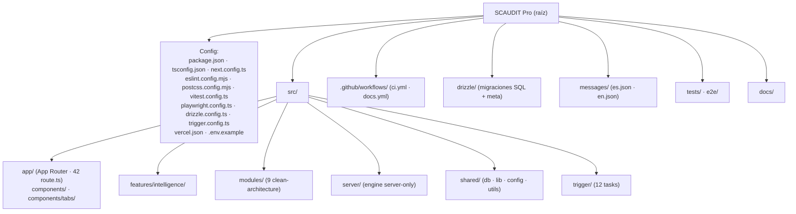

# Inventario de Proyecto — SCAUDIT Pro

{: .no_toc }

  
Tabla de contenidos

  {: .text-delta }
1. TOC
{:toc}

---

## 1. Scope y Objetivos

Este documento materializa la tabla §6 del [Engineering Master Plan](`docs/superpowers/plans/2026-08-01-engineering-master-plan.md`) (tarea **T01-01**, BATCH 01). Inventaría **cada elemento estructural del repositorio** — config, CI, tests, i18n, código por capa — con su **estado**, **evidencia** (ruta o comando real), **riesgo** y **observación**.

**Objetivo:** que cualquier lector pueda verificar contra el código cada afirmación, sin depender de la memoria de un autor. Toda afirmación lleva marcador de evidencia: `[VERIFIED]` (leído del archivo/comando), `[ASSUMPTION]` (inferencia razonable, no probada) o `[UNKNOWN]` (no verificable en este repositorio).

**Alcance:** commit `0395707` (HEAD de `main`), 2026-08-02. No se modifica código fuente; este documento es de análisis.

---

## 2. Requisitos de este inventario

Los requisitos del artefacto (definidos por el plan maestro, tarea T01-01) son:

| REQ | Requisito | Criterio de aceptación |
|-----|-----------|------------------------|
| REQ-1 | Cubrir ≥25 elementos reales del proyecto | Inventario con ≥25 filas y evidencia de ruta por fila |
| REQ-2 | Tabla con columnas Elemento / Estado / Evidencia / Riesgo / Observación | Formato tabla Markdown |
| REQ-3 | Clasificar riesgo por elemento | LOW / MEDIUM / HIGH / CRITICAL por fila |
| REQ-4 | Marcar con `[VERIFIED]` / `[ASSUMPTION]` / `[UNKNOWN]` | Marcador presente en cada fila |
| REQ-5 | Pasar quality gate `--min 80` | `node scripts/quality-gate.mjs docs/architecture/PROJECT-INVENTORY.md --min 80` |

---

## 3. Arquitectura del repositorio (mapa de alto nivel)

**FIG-010 — Árbol de directorios relevante** · Nivel L1 · Mermaid `flowchart`

---

## 4. Inventario por elemento

**MAT-009 — Inventario de proyecto** (evidencia leída del commit `0395707`; conteos reales con `git`, `Get-ChildItem` y lectura de archivos)

| # | Elemento | Estado | Evidencia | Riesgo | Observación |
|---|----------|--------|-----------|--------|-------------|
| 1 | `package.json` | OK [VERIFIED] | `package.json` (101 líneas) | LOW | Next 16.2.4 · React 19.2.4 · TS 5 · Drizzle 0.45.2 · Trigger.dev 4.4.6 · Vitest 4.1.5 · Playwright 1.59.1 · next-intl 4.13.4. Scripts: `dev/build/lint/test/test:coverage/test:e2e/test:contract/db:generate/db:push`. |
| 2 | `pnpm-lock.yaml` | OK [VERIFIED] | `pnpm-lock.yaml` | LOW | Lockfile presente; CI instala con `--frozen-lockfile` (`.github/workflows/ci.yml`). |
| 3 | `pnpm-workspace.yaml` | OK [VERIFIED] | `pnpm-workspace.yaml` | LOW | Workspace de paquete único; añadido para fix de cache en CI (`f6cad3c`). |
| 4 | `tsconfig.json` | OK [VERIFIED] | `tsconfig.json` (42 líneas) | LOW | `strict: true`; path alias `@/* → ./src/*`; `moduleResolution: bundler`. |
| 5 | `next.config.ts` | OK [VERIFIED] | `next.config.ts` (43 líneas) | LOW | `images.remotePatterns **`; `experimental.optimizePackageImports: lucide-react`; `viewTransition: true`; header `X-Robots-Tag`. Comentario explícito: `output: standalone` removido por conflicto con lambda builder de Vercel (`c8c4871`). |
| 6 | `eslint.config.mjs` | OK con deuda [VERIFIED] | `eslint.config.mjs` (66 líneas) | MEDIUM | Flat config (`eslint-config-next` core-web-vitals + typescript). `@typescript-eslint/no-explicit-any` OFF para rutas intelligence/plugins y tabs (deuda de tipado acotada a `src/server/intelligence/**`, `src/app/api/intelligence/**`, etc.). Ignora `.trigger/`, `drizzle/`, scripts scratch raíz. |
| 7 | `postcss.config.mjs` | OK [VERIFIED] | `postcss.config.mjs` (6 líneas) | LOW | Único plugin `@tailwindcss/postcss` (Tailwind v4, CSS-first). |
| 8 | `vitest.config.ts` | OK con hallazgo [VERIFIED] | `vitest.config.ts` (34 líneas) | MEDIUM | jsdom; umbrales de cobertura 25/20/20/25. Cobertura actual: Statements 13.72% (TEST-COVERAGE-MATRIX, 2026-08-08) — **no cumple** umbral 25% (preexistente, gap documentado). |
| 9 | `playwright.config.ts` | OK [VERIFIED] | `playwright.config.ts` (24 líneas) | LOW | `testDir: ./e2e`; proyecto chromium desktop; `webServer: pnpm dev :3000`; retries 2 en CI. |
| 10 | `drizzle.config.ts` | OK [VERIFIED] | `drizzle.config.ts` (19 líneas) | LOW | Requiere `DIRECT_URL` (falla si falta); schema glob `./src/shared/db/schemas/*.ts`; `ssl.rejectUnauthorized: false`. |
| 11 | `trigger.config.ts` | OK [VERIFIED] | `trigger.config.ts` (17 líneas) | LOW | Project `proj_vzzxt…`; `runtime: node`; `dirs: [./src/trigger]`; retries default `maxAttempts: 3` (factor 2, randomize); `maxDuration: 3600`. |
| 12 | `src/proxy.ts` | OK [VERIFIED] | `src/proxy.ts` (110 líneas) | LOW | Proxy Next.js 16 (reemplaza `middleware.ts`): CSP nonce por request + HSTS + `X-Frame-Options: DENY` + `nosniff` + Referrer-Policy + Permissions-Policy + `updateSession()`. `matcher` excluye estáticos. |
| 13 | `vercel.json` | OK [VERIFIED] | `vercel.json` (22 líneas) | LOW | `framework: nextjs`; `buildCommand: pnpm build`; **cron único** `/api/cron/uptime` (schedule `0 0 * * *`); `regions: [iad1]`. |
| 14 | `.github/workflows/ci.yml` | OK [VERIFIED] | `.github/workflows/ci.yml` (170 líneas) | LOW | 4 jobs: `lint-and-build` (lint + build), `docs-quality-gate` (min 80 sobre `docs/architecture/*.md`), `test-and-coverage` (exit 1 por umbral pero `continue-on-error`), `api-contract-test` (OpenAPI + Newman opcional con secret). |
| 15 | `.github/workflows/docs.yml` | OK [VERIFIED] | `.github/workflows/docs.yml` (53 líneas) | LOW | Build + deploy Jekyll a GitHub Pages en push a `main` (paths `docs/**`). |
| 16 | `.env.example` + `src/shared/config/env.ts` | OK [VERIFIED] | `.env.example` (36 líneas), `src/shared/config/env.ts` (17 líneas) | LOW | Corresponde a MAT-007 (ENTERPRISE-ARCHITECTURE §17). `env.ts` expone getters server/client: Supabase URL + anon key (públicos), service role, DATABASE_URL/DIRECT_URL, TRIGGER_SECRET, OpenRouter, y legado `GEMINI_API_KEY`/`Bearer_API_KEY`/`XIAOMI_BASE_URL` (compatibilidad). |
| 17 | `.gitignore` | OK [VERIFIED] | `.gitignore` | LOW | `.env*` ignorado salvo `!.env.example`; también `next-env.d.ts`. |
| 18 | `messages/` | OK [VERIFIED] | `messages/es.json` (~22 KB), `messages/en.json` (~21 KB) | LOW | next-intl; ~650+ keys [ASSUMPTION], 11/11 tabs migrados (README). i18n cookie-based (`localePrefix: never`). Ver ADR-003. |
| 19 | `src/app` | OK [VERIFIED] | `src/app/` + `(Get-ChildItem src/app/api -Filter route.ts).Count = 42` | LOW | App Router; **42 route handlers** [VERIFIED]; grupos `(dashboard)`, `ai`, `auth`, `intelligence`, `projects`, `security`, `settings`, `swagger`, `docs`. |
| 20 | `src/app/components` | OK con hallazgo [VERIFIED] | `src/app/components/` (34 archivos) + `components/tabs/` (10: IntelligenceTab, AdversaryTab, MonitoringTab, ReportsTab, SettingsTab, OverviewTab, KeywordsTab, MarketplaceTab, PerformanceTab, ProjectsTab) | MEDIUM | Duplicación de UI de inteligencia con `src/features/intelligence/components/IntelligenceShell.tsx` — ver DEPENDENCY-GRAPH §6 (hallazgo DUP-1). |
| 21 | `src/features` | OK [VERIFIED] | `src/features/intelligence/` (components 12, hooks 5, stores, validators, lib/rendering) | MEDIUM | Feature-first para inteligencia; `lib/rendering/{markdown,severity}` compartidos con tabs y con tests (`markdown.test.ts`, `severity.test.ts`). |
| 22 | `src/modules` | OK con gap [VERIFIED] | `src/modules/{audit,backlinks,competitors,cro,integrations,keywords,performance,reporting,schema}` (9 módulos) | HIGH | Clean architecture (domain/application/infrastructure/presentation) pero **0 archivos `*.test.ts`** [VERIFIED conteo] — gap prioritario para B04/B06. |
| 23 | `src/server` | OK [VERIFIED] | `src/server/` (intelligence, ai, security, reports, notifications, auth, db, api, lib) | MEDIUM | Engine **server-only**; `src/server/intelligence/{core,executors,registry,plugins,discovery,adversary,history,security,types,mitre,anomaly,enterprise}`; `supabase/admin.ts` (service role) sin uso en cliente. |
| 24 | `src/shared` | OK [VERIFIED] | `src/shared/` (db, lib, config, utils, hooks, data) | MEDIUM | `db/` (schemas 12+index, `rls.ts` conRLS, index, seed, run-migration); `lib/` (ratelimit, circuit-breaker, audit-log, logger, api-keys, auth, cookie-utils, actions, supabase/*). Fan-in alto (madge): `schemas/index` 73, `db/index` 44, `supabase/server` 34. |
| 25 | `src/trigger` | OK [VERIFIED] | `src/trigger/*.trigger.ts` (12 archivos) | MEDIUM | 12 tasks Trigger.dev: siem, uptime, cleanup, anomaly, discovery, adversary, scheduled-scan, monitoring, api-key-expiry, audit, webhook, hello. Ver SYSTEM-MAP flujo B. |
| 26 | `tests/` | OK [VERIFIED] | `tests/api-contract/contract.test.ts` + `generate-collection.mjs` | LOW | Contract test OpenAPI (Vitest); colección Postman generada; Newman live en CI opcional. |
| 27 | `e2e/` | OK [VERIFIED] | `e2e/{app,home,pentest-auth-ratelimit,visual-regression}.spec.ts` (4 specs) | LOW | Playwright; 4 specs reales (nótese: `home.spec.ts`, no `login.spec.ts`). |
| 28 | `docs/` | OK [VERIFIED] | `docs/` (17 `.md` + `docs/html/` manuales) | LOW | 17 docs a 100/100 (QUALITY_GATE_REPORT); ENTERPRISE-ARCHITECTURE v2.1 aprobado; ROADMAP 36/36. |
| 29 | `drizzle/` | OK con hallazgo [VERIFIED] | `drizzle/` (22 archivos `.sql`), `drizzle/meta/_journal.json` (22 entradas, idx 0–21, última `0021_push_active_boolean`) | MEDIUM | Journal consistente `0000…0021`. **Hallazgo:** `0001_quota_enforcement.sql` es **huérfano** (no referenciado por `_journal.json`, que usa `0001_silky_ikaris`); hay dos `0001_*` y dos `0002_*` de nombre similar. Ver §11 INCONSISTENCIA-3. |
| 30 | `src/shared/db/schemas` | OK [VERIFIED] | `schemas/*.ts` (12 archivos + `index.ts` 507 líneas) | MEDIUM | **58 tablas** [VERIFIED: conteo `pgTable(` 2026-08-08]. Barrel `index.ts` con fan-in 73 (madge) y **9 ciclos** tipo `index > schema-file` (madge `--circular`). Ver DEPENDENCY-GRAPH §5. |
| 31 | Scripts de operación (raíz) | OK [VERIFIED] | `db-security-scan.ts`, `rls-fire-test.ts`, `test-rls-root.ts`, `test-db.ts`, `backup-manager.ts`, `configure-upstash-alerts.ts`, `hello.ts` | MEDIUM | Scripts de seguridad/ops en raíz; **excluidos de ESLint** (`eslint.config.mjs` globalIgnores) y **no integrados en CI** — gap para B02. |
| 32 | `.githooks/` | OK [VERIFIED] | `package.json` script `prepare: git config core.hooksPath .githooks` | LOW | Pre-commit hook ejecuta quality gate (commit `5eb33ff` documenta la suite). |

---

## 5. Flujos de verificación

Cada fila de MAT-009 se verificó con una de estas operaciones (reproducibles):

| Operación | Comando / fuente | Uso |
|-----------|------------------|-----|
| Conteo route handlers | `(Get-ChildItem src/app/api -Filter route.ts).Count` → 42 | Fila 19 |
| Conteo triggers | `Get-ChildItem src/trigger -Filter *.ts` → 12 | Fila 25 |
| Conteo test files | `find src -name "*.test.ts"` → 39 archivos; `pnpm test` → 391 tests (2026-08-08) | Filas 22/26/27 + TEST-001 |
| Conteo migraciones | `Get-ChildItem drizzle -Filter *.sql` → 21; `_journal.json` → 20 | Fila 29 |
| Versión de stack | `package.json` dependencies | Fila 1 |
| Seguridad headers | `src/proxy.ts` buildCsp() | Fila 12 |
| Ignores de secretos | `.gitignore` (`.env*` salvo `.env.example`) | Fila 17 |

---

## 6. APIs y endpoints

**FLOW-002 — Censo de route handlers** [VERIFIED: 42 archivos]

| Grupo | Conteo | Protección |
|-------|--------|-----------|
| `/api/intelligence/*` | 15 | Auth + rate limit + `withErrorHandler` |
| `/api/ai/*` | 3 | Auth + rate limit IA |
| `/api/security/*` | 5 | Auth + SIEM (incl. `csp-report` POST) |
| `/api/monitoring` | 1 | Auth |
| `/api/public/v1/*` | 2 | API key |
| Otros (cron, webhooks, plugins, benchmarking, bulk-scan, telemetry, projects, api-keys, notifications, looker-studio, reports/pdf, auth) | 16 | Variada |

Métodos usados: `GET` (lectura/snapshots), `POST` (ejecución de scans, webhooks, csp-report), `PATCH`/`PUT` (config), `DELETE` (recursos). Errores tipados vía `AppError` + `handleApiError`; rate limit con headers IETF `RateLimit-*` (ver ADR-002).

---

## 7. Seguridad (elementos inventariados)

| Control | Evidencia | Estado |
|---------|-----------|--------|
| CSP nonce + headers | `src/proxy.ts` | [VERIFIED] |
| Egress-guard SSRF | `src/server/intelligence/security/egress-guard.ts` | [VERIFIED] |
| Rate limit fail-open | `src/shared/lib/ratelimit.ts` | [VERIFIED] |
| Circuit breaker fail-open | `src/shared/lib/circuit-breaker.ts` | [VERIFIED] |
| RLS multi-tenant (`SET LOCAL ROLE`) | `src/shared/db/rls.ts` | [VERIFIED] |
| Service role solo server | `src/shared/lib/supabase/admin.ts` (comentario "never exposed to the client") | [VERIFIED] |
| Audit logging | `src/shared/lib/audit-log.ts` → `security_audit_logs` | [VERIFIED] |
| Secretos | `.gitignore` + MAT-007 | [VERIFIED] |

Detalle y controles completos: MAT-002 (ENTERPRISE-ARCHITECTURE §10) y `docs/security/SECURITY-AUDIT-REPORT.md`.

---

## 8. Testing y validación

| Suite | Comando | Alcance real | Estado |
|-------|---------|-------------|--------|
| Unit (Vitest) | `pnpm test` | 39 archivos `*.test.ts`, **391 tests PASS** (2026-08-08; +26 tests de controles de seguridad en la sesión) | [VERIFIED] |
| Coverage | `pnpm test:coverage` | Statements 13.72% — **no cumple** umbral global 25% (preexistente, gap en TEST-COVERAGE-MATRIX) | [VERIFIED] |
| E2E | `pnpm test:e2e` | 4 specs Playwright | [VERIFIED] |
| Contract | `pnpm test:contract` | `tests/api-contract/contract.test.ts` | [VERIFIED] |
| Docs gate | `node scripts/quality-gate.mjs --min 80` | 20 checks × 5 pts | [VERIFIED] |

Casos cubiertos: executors DNS/network/TLS/email/OSINT, egress-guard, ratelimit, SIEM exporter, sandbox/adversary, proxy, markdown/severity, report-utils, math, rum (TEST-001 en ENTERPRISE-ARCHITECTURE §22). **Gap:** `src/modules/*` 0 tests; rutas sin `route.test.ts` (solo cron/siem, cron/uptime, adversary, webhooks tienen).

---

## 9. Deployment

- **CI/CD:** GitHub Actions (`ci.yml` + `docs.yml`) → Vercel (deploy automático en push a `main`).
- **Hosting:** Vercel, `regions: [iad1]`, cron Vercel `/api/cron/uptime` (ver `vercel.json`).
- **Jobs:** Trigger.dev (proyecto `proj_vzzxt…`) con retries default 3 y `maxDuration` 1 h.
- **Docs:** GitHub Pages + Jekyll (just-the-docs) vía `docs.yml`.
- **Vercel env:** vars en dashboard (MAT-007); `pnpm install --frozen-lockfile`; build `pnpm build`.

---

## 10. Operaciones y observabilidad

- Health público: `GET /api/public/v1/health` (status ok/degraded/down, `redisConfigured`, `dbConfigured`).
- Health IA: `GET /api/ai/healthcheck` → `ai_health_logs`.
- Logging estructurado: `src/shared/lib/logger.ts` (`info/warn/error/security`).
- Audit: `logSecurityEvent()` → `security_audit_logs`; SIEM exporter (5 min vía Trigger.dev).
- RUM: `/api/telemetry/vitals` → `web_vitals_logs`.
- Runbooks: `docs/guides/upstash-redis-recovery.md`, `docs/guides/troubleshooting.md`, `docs/guides/deployment.md`.

---

## 11. Inconsistencias detectadas y resueltas (cross-check)

| ID | Valor A (escrito) | Valor B (real) | Resolución |
|----|-------------------|----------------|------------|
| INCONSISTENCIA-1 | README "50+ endpoints" | 42 archivos `route.ts` [VERIFIED] | **RESUELTA (2026-08-08):** README actualizado con diagrama C4 que cita 42 route handlers. |
| INCONSISTENCIA-2 | Plan maestro lista `src/components` y e2e "login" | `src/app/components` y `e2e/home.spec.ts` | La ruta real es `src/app/components`; el spec de login es `home.spec.ts`. |
| INCONSISTENCIA-3 | README "35+ tablas"; ENTERPRISE-ARCHITECTURE "56 tablas" | `schemas/*.ts` (12 archivos + index) | **RESUELTA (2026-08-08):** conteo exacto `pgTable(` = **58 tablas**; README y ENTERPRISE-ARCHITECTURE sincronizados a 58. |
| INCONSISTENCIA-4 | 20 migraciones (plan B00) | 22 archivos `.sql` en `drizzle/` (journal 22, última `0021_push_active_boolean`) | `0001_quota_enforcement.sql` huérfano no referenciado por `_journal.json` [VERIFIED]. |
| INCONSISTENCIA-5 | ENTERPRISE-ARCHITECTURE §11 "fuga RLS corregida" | `ffce502` corrigió `withRLS` en benchmarking, intelligence/live, intelligence/anomalies | Patrón `withRLS` como defensa estándar; ver ADR-006. |

---

## 12. Trazabilidad

| Artefacto | Referencias |
|-----------|-------------|
| Este inventario | Tarea T01-01 del plan maestro (`docs/superpowers/plans/2026-08-01-engineering-master-plan.md`) |
| MAT-009 (inventario) | Enteriza las matrices MAT-001, MAT-002, MAT-005, MAT-007 de ENTERPRISE-ARCHITECTURE |
| TEST-001 | Matriz de suites de test (ENTERPRISE-ARCHITECTURE §22) |
| ADRs | ADR-001..006 en `docs/architecture/ADR/` |

---

## 13. Unknowns y Assumptions

| Marcador | Ítem | Estado |
|----------|------|--------|
| [VERIFIED] | 58 tablas en producción | Conteo `pgTable(` en `schemas/*.ts` (2026-08-08); 22 migraciones en `drizzle/`. |
| [ASSUMPTION] | ~650+ keys i18n | README lo afirma; conteo exacto de keys en B09. |
| [UNKNOWN] | Necesidad de `0001_quota_enforcement.sql` | Huérfano del journal; no se puede afirmar si fue reemplazado o es desechable. |
| [UNKNOWN] | Configuración real de schedules en dashboard Trigger.dev | Solo el `trigger.config.ts` local está verificado; los crons se leen de los archivos `*.trigger.ts`. |
| [UNKNOWN] | Límite exacto de tokens del pool `:free` de OpenRouter | No publicado (mitigado por caché 5 min). |

---

## 14. Glosario

| Término | Definición |
|---------|-----------|
| route handler | Archivo `route.ts` de App Router (endpoint) |
| barrel | Módulo `index.ts` que re-exporta símbolos de su directorio |
| fan-in / fan-out | Nº de módulos que importan / son importados por un módulo (madge) |
| fail-open | Degradación que prioriza disponibilidad sobre bloqueo |
| withRLS | Helper `src/shared/db/rls.ts` que ejecuta un callback en transacción con contexto RLS |
| gateway SSRF | Guardia de egress que bloquea CIDRs privados y rebinding DNS |

---

{: .note }
**Fuente de este documento:** commit `2ccda08` (main, 2026-08-08); comandos `git status`, `git log`, `find`, `npx madge --circular src`; lectura de `package.json`, `*.config.*`, `.env.example`, `src/shared/config/env.ts`, `src/proxy.ts`, `.github/workflows/*.yml`. Datos sincronizados: 39 test files / 391 tests, 58 tablas, 22 migraciones, 14 ejecutores, 3 server actions.
