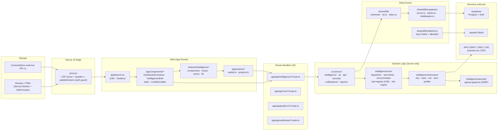
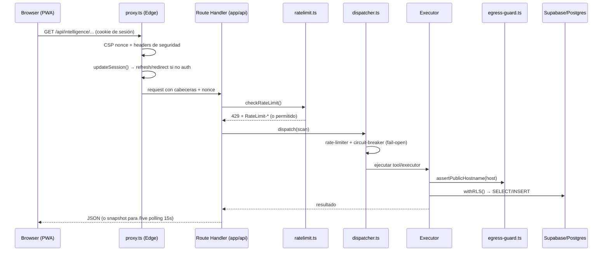
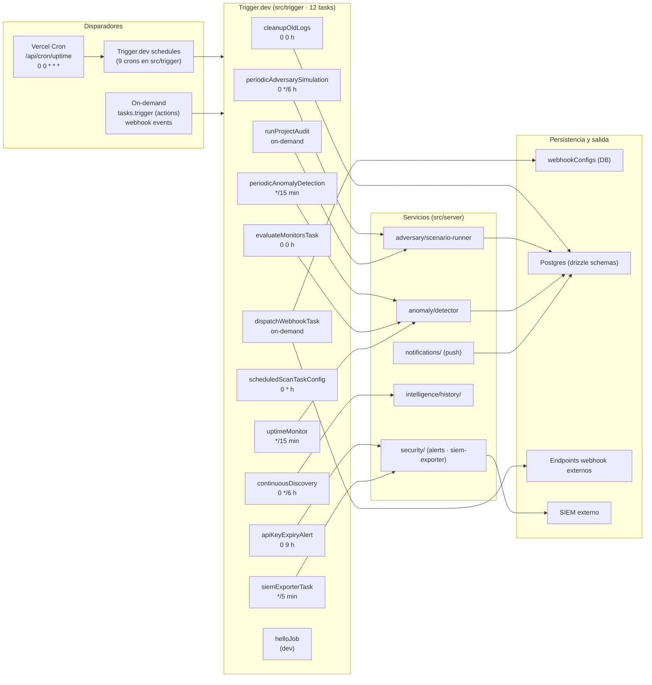
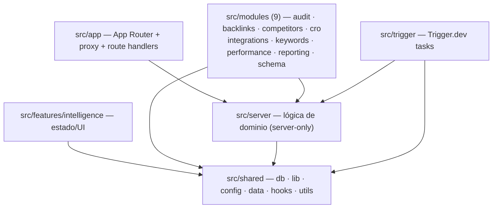

# System Map — SCAUDIT Pro

{: .no_toc }

  
Tabla de contenidos

  {: .text-delta }
1. TOC
{:toc}

---

## 1. Scope y Objetivos

Este documento materializa la tarea **T01-02** (BATCH 01) del [Engineering Master Plan](`docs/superpowers/plans/2026-08-01-engineering-master-plan.md`). Traza **los dos flujos de datos principales del sistema** con rutas reales verificadas contra el código, complementando los diagramas de containers §7 de [ENTERPRISE-ARCHITECTURE.md](ENTERPRISE-ARCHITECTURE.md):

- **FLUJO A — Request/Response principal:** `USERS → UI → Next.js → Application → Domain → Data`.
- **FLUJO B — Eventos → Trigger.dev:** `EVENTS → Trigger.dev → Jobs → Servicios → DB` (12 tasks + cron Vercel).

**Objetivo:** que cualquier lector pueda recorrer un request o un evento desde su origen hasta su destino final, citando el archivo real en cada tramo. Toda afirmación lleva marcador de evidencia: `[VERIFIED]` (leído del archivo/comando), `[ASSUMPTION]` (inferencia razonable) o `[UNKNOWN]` (no verificable aquí).

**Alcance:** commit `82b09d3` (HEAD de `main`), 2026-08-02. No se modifica código fuente; este documento es de análisis.

---

## 2. Requisitos de este mapa

| REQ | Requisito | Criterio de aceptación |
|-----|-----------|------------------------|
| REQ-1 | Trazar `USERS→UI→Next.js→Application→Domain→Data` con rutas reales | FLUJO A en Mermaid + tabla de nodos con rutas `[VERIFIED]` |
| REQ-2 | Trazar `EVENTS→Trigger.dev→Jobs→Servicios→DB` (12 triggers + cron Vercel) | FLUJO B en Mermaid + tabla de triggers con schedule y destino |
| REQ-3 | No inventar eventos ni rutas | Cada nodo referenciado a un archivo real leído |
| REQ-4 | Pasar quality gate `--min 80` | `node scripts/quality-gate.mjs docs/architecture/SYSTEM-MAP.md --min 80` |

---

## 3. FLUJO A — Request/Response principal

**FIG-101 — System Map · FLUJO A (request autenticado)** · Nivel L2 · Mermaid `flowchart`

**FLOW-101 — Ciclo de vida de un request autenticado (secuencia)** · Nivel L3 · Mermaid `sequenceDiagram`

**Tabla de nodos del FLUJO A** (evidencia: archivos leídos)

| Nodo | Ruta real | Responsabilidad | Evidencia |
|------|-----------|-----------------|-----------|
| Edge | `src/proxy.ts` | CSP por-request + HSTS + `updateSession()` (auth) | [VERIFIED] |
| Layout | `src/app/layout.tsx` | Raíz App Router, headers CSP nonce, i18n provider | [VERIFIED] |
| UI principal | `src/app/components/DashboardContainer.tsx` | Compositor de dashboard, fan-out 18 | [VERIFIED] |
| UI inteligencia | `src/app/components/tabs/IntelligenceShell.tsx` | Shell de pestañas de inteligencia | [VERIFIED] |
| Feature | `src/features/intelligence/` (components·hooks·stores·lib) | Estado, rendering y validación del módulo de inteligencia | [VERIFIED] |
| Actions | `src/app/actions/audits.ts` | Server Actions; lanza `runProjectAudit` vía `tasks.trigger` (L163) | [VERIFIED] |
| Route Handlers | `src/app/api/**/route.ts` (42 archivos) | Contrato HTTP | [VERIFIED] |
| Engine | `src/server/intelligence/core/dispatcher.ts` | Orquestación de scans | [VERIFIED] |
| Ejecutores | `src/server/intelligence/executors/*.ts` (13 archivos) | DNS, OSINT, CVE, TLS, tech-profiler, bucket, subdomain-takeover | [VERIFIED] |
| SSRF guard | `src/server/intelligence/security/egress-guard.ts` | Bloqueo de IPs privadas (16 CIDRs v4 + 7 v6) | [VERIFIED] |
| Rate limit | `src/shared/lib/ratelimit.ts` | Lazy Redis + allowlist + headers IETF | [VERIFIED] |
| Circuit breaker | `src/shared/lib/circuit-breaker.ts` | Fail-open con `REDIS_OP_TIMEOUT_MS=1500` | [VERIFIED] |
| RLS | `src/shared/db/rls.ts` | `withRLS()` → `SET LOCAL ROLE authenticated` + JWT claims | [VERIFIED] |
| Supabase admin | `src/shared/lib/supabase/admin.ts` | Client service-role solo server | [VERIFIED] |
| Datos | `src/shared/db/schemas/*` + `drizzle/` (21 migraciones) | Modelo relacional | [VERIFIED] |

---

## 4. FLUJO B — Eventos → Trigger.dev → Jobs → Servicios → DB

**FIG-102 — System Map · FLUJO B (jobs programados + bajo demanda)** · Nivel L2 · Mermaid `flowchart`

**Tabla de jobs de Trigger.dev** (evidencia: `src/trigger/*.ts` + `trigger.config.ts`)

| Task | Disparador (cron/evento) | Acción principal | Servicio/DB destino | Evidencia |
|------|--------------------------|------------------|---------------------|-----------|
| `periodicAdversarySimulation` | cron `0 */6 * * *` | Simulación adversaria periódica | `adversary/scenario-runner.ts` → DB | [VERIFIED] |
| `periodicAnomalyDetection` | cron `*/15 * * * *` | Detección de anomalías | `anomaly/detector.ts` → DB | [VERIFIED] |
| `apiKeyExpiryAlert` | cron `0 9 * * *` | Alertar API keys próximas a expirar | `security/api-key-expiry-alert.ts` → notificaciones | [VERIFIED] |
| `cleanupOldLogs` | cron `0 0 * * *` | Limpieza de logs antiguos | DB (DELETE) | [VERIFIED] |
| `continuousDiscovery` | cron `0 */6 * * *` | Descubrimiento continuo (DNS/CT/shadow) | `intelligence/discovery/` → `history/` → DB | [VERIFIED] |
| `evaluateMonitorsTask` | cron `0 0 * * *` | Evaluar monitores | `anomaly/detector.ts` | [VERIFIED] |
| `scheduledScanTaskConfig` | cron `0 * * * *` | Escaneo de inteligencia horario | `intelligence/` core → DB | [VERIFIED] |
| `siemExporterTask` | cron `*/5 * * * *` | Exportar a SIEM | `security/siem-exporter.ts` → SIEM externo | [VERIFIED] |
| `uptimeMonitor` | cron `*/15 * * * *` | Monitoreo de uptime | `anomaly/detector.ts` → DB | [VERIFIED] |
| `runProjectAudit` | on-demand (`tasks.trigger` desde `src/app/actions/audits.ts:163`) | Auditoría completa de proyecto | `intelligence/` → reportes → DB | [VERIFIED] |
| `dispatchWebhookTask` | on-demand (eventos de proyecto) | Despacho webhook con HMAC + guard SSRF | `webhookConfigs` + endpoints externos | [VERIFIED] |
| `helloJob` | manual (dev) | Hello world | — | [VERIFIED] |

**Configuración del runtime Trigger.dev** [VERIFIED]: `trigger.config.ts` → project `proj_vzzxtydwblfhxgmljiai`, `dirs: ["./src/trigger"]`, `retries.maxAttempts = 3` (default), `maxDuration = 3600`.

**Cron Vercel** [VERIFIED]: `vercel.json` → único cron `/api/cron/uptime` schedule `0 0 * * *`, `regions: ["iad1"]`, respaldado por `src/app/api/cron/uptime/route.ts` (conteo manual diario; no reemplaza `uptimeMonitor`).

---

## 5. Arquitectura de módulos (Module Map)

**FIG-103 — Módulos y capas** · Nivel L1 · Mermaid `flowchart`

**Observaciones de estructura** [VERIFIED]:
- `src/modules/` implementa arquitectura limpia (9 módulos de negocio) **sin archivos de test** [VERIFIED: 0 ficheros `*.test.ts` en `src/modules`]; la estrategia de testing actual cubre `src/server` (intelligence/security/core), `shared/lib`, `features/intelligence/lib` y utils.
- `src/features/intelligence/lib` contiene utilidades puras de rendering (`markdown.ts`, `severity.ts`) con sus tests.
- `src/server/api/public-router.ts` media las llamadas de terceros a la API pública.

---

## 6. APIs — contratos de route handlers

Los 42 route handlers de `src/app/api` son el contrato HTTP del sistema. Los métodos, esquemas de autenticación y errores típicos se resumen a continuación (rutas verificadas; detalle de payloads en los propios `route.ts`).

| Método | Ruta | Auth | Rate limit | Errores típicos | Evidencia |
|--------|------|------|-----------|-----------------|-----------|
| GET | `/api/intelligence/live` | Sesión (cookie) | Global | 401 · 429 | [VERIFIED] |
| POST | `/api/intelligence` | Sesión (cookie) | 40 req/min + allowlist | 400 · 401 · 429 · 500 | [VERIFIED] |
| GET/POST | `/api/public/v1/intelligence` | Bearer `<api_key>` | Global | 401 · 403 · 429 | [VERIFIED] |
| GET | `/api/reports/pdf/progress` | Sesión (cookie) | Global | 401 · 404 | [VERIFIED] |
| POST | `/api/webhooks/cicd` | Firma HMAC (`x-scaudit-signature`) | — | 400 · 401 | [VERIFIED] |
| POST | `/api/security/csp-report` | Público (report-uri CSP) | — | 204 siempre | [VERIFIED] |
| POST | `/api/security/siem/run` | Sesión + rol | Global | 401 · 403 · 429 | [VERIFIED] |

**Notas [VERIFIED]:**
- La sesión se gestiona en `src/proxy.ts` → `updateSession()`; rutas protegidas redirigen a login si no hay sesión.
- El rate limit global se aplica vía `src/shared/lib/ratelimit.ts` (lazy Redis, fail-open; `EMAIL_ALLOWLIST` exime a `palacios_juan@hotmail.com`). Respuestas 429 con cabeceras `RateLimit-Limit/Remaining/Reset` + `X-RateLimit-*`.
- API pública v1: `src/app/api/public/v1/intelligence/route.ts` usa `withPublicApi()` de `src/server/api/public-router.ts`; resuelve el usuario desde `req.apiKeyAuth.userId`.
- Webhooks CI/CD: `src/app/api/webhooks/cicd/route.ts` verifica firma con `verifyWebhookSignature()` de `src/server/security/cicd-helper.ts`.

---

## 7. Seguridad — trust boundaries y controles

**Límites de confianza (trust boundaries) y controles mitigantes:**

| # | Límite de confianza | Riesgo principal | Control real | Evidencia |
|---|---------------------|------------------|--------------|-----------|
| TB-1 | Cliente → Edge (`proxy.ts`) | Clickjacking, XSS, mixed content, datos en el aire | CSP con nonce por request, `X-Frame-Options: DENY`, HSTS preload, `X-Content-Type-Options`, `Referrer-Policy`, `Permissions-Policy`, `report-uri /api/security/csp-report` | [VERIFIED] |
| TB-2 | Edge → Route Handler | Acceso no autenticado | `updateSession()` (refresh + redirect) | [VERIFIED] |
| TB-3 | Route Handler → Domain | Abuso de tasa, cascada de fallos | `ratelimit.ts` (fail-open, allowlist) + `circuit-breaker.ts` (fail-open, timeout 1500 ms) | [VERIFIED] |
| TB-4 | Domain → Externo (executors/webhooks) | SSRF | `egress-guard.ts`: `assertPublicHostname()` bloquea IPs privadas (16 CIDRs v4 + 7 v6) | [VERIFIED] |
| TB-5 | Domain → DB | Fuga multi-tenant, acceso con privilegios | `rls.ts` `withRLS()` (`SET LOCAL ROLE authenticated` + claims JWT); `admin.ts` (service-role) solo server | [VERIFIED] |
| TB-6 | Sistema → Cliente webhook | Endpoint falso / no autenticado | Firma HMAC `X-StrategicAudit-Signature` + comprobación de suscripción de eventos | [VERIFIED] |

**Amenazas consideradas:** SSRF (TB-4), abuso de rate (TB-3), fuga multi-tenant (TB-5), XSS/clickjacking (TB-1), inyección vía webhook (TB-6). No se documentan aquí nuevas amenazas: las detalladas por amenaza están en [ENTERPRISE-ARCHITECTURE.md](ENTERPRISE-ARCHITECTURE.md) §11.

---

## 8. Datos (referencia cruzada)

El modelo de datos vive en `src/shared/db/schemas/` (25+ tablas, índice en `index.ts`) con migraciones en `drizzle/` (21 SQL). El ERD detallado y el dictionary están documentados en:

- [PIPELINE-HISTORY.md](PIPELINE-HISTORY.md) **FIG-002** — ERD de `dns_history`/`whois_history`.
- [PROJECT-INVENTORY.md](PROJECT-INVENTORY.md) §5 — matriz de esquemas e inconsistencia de migración huérfana (`0001_quota_enforcement.sql` no referenciado en `_journal.json`).
- [ENTERPRISE-ARCHITECTURE.md](ENTERPRISE-ARCHITECTURE.md) §8 — modelo conceptual.

Este documento no repite el ERD: su foco es el **flujo** de datos entre capas, no el detalle de columnas.

---

## 9. Testing del sistema (referencia)

| Ámbito | Herramienta | Evidencia |
|--------|-------------|-----------|
| Unit / integración | Vitest 4 (jsdom) — 19 archivos `*.test.ts` | [VERIFIED] |
| Resultado unit actual | 248 tests PASS (`pnpm test`) | [VERIFIED] |
| E2E | Playwright 1.59 — 4 specs en `e2e/` | [VERIFIED] |
| Contrato API | `tests/api-contract/` | [VERIFIED] |
| Cobertura | Baseline B00: Statements 12.51% (por debajo del umbral, no es regresión B01) | [VERIFIED] |

**Casos representativos [VERIFIED]:** `scan-response.test.ts`, `executors.test.ts`, `egress-guard.test.ts`, `sandbox-executor.test.ts`, `pipeline-test.ts` (historia), `markdown.test.ts`/`severity.test.ts` (feature), `report-utils.test.ts` (UI). La cobertura unitaria se concentra en `src/server` y `shared/lib`; `src/modules/` no tiene tests (ver §5).

---

## 10. Operaciones — monitoring, runbooks y recovery

| Área | Mecanismo real | Evidencia |
|------|----------------|-----------|
| Monitoring de uptime | `uptimeMonitor` (Trigger.dev, cada 15 min) + cron Vercel diario `/api/cron/uptime` | [VERIFIED] |
| Detección de anomalías | `periodicAnomalyDetection` (`*/15`) y `evaluateMonitorsTask` (diario) | [VERIFIED] |
| Exportación a SIEM | `siemExporterTask` (`*/5`) → `security/siem-exporter.ts` | [VERIFIED] |
| Reporte de violación CSP | `report-uri /api/security/csp-report` (endpoint `src/app/api/security/csp-report/route.ts`) | [VERIFIED] |
| Logs de auditoría | `src/app/api/security/audit-logs/route.ts` + `src/trigger/audit.trigger.ts` | [VERIFIED] |
| Runbook de diagnóstico AI | [AI-ROUTER-TDD.md](AI-ROUTER-TDD.md) **FLOW-002** (runbook ante fallo/breaker/rate limit) | [VERIFIED] |
| Recovery | Circuit-breaker fail-open (`circuit-breaker.ts`), retries Trigger.dev (`maxAttempts 3`), webhooks con `maxAttempts 5` y backoff exponencial | [VERIFIED] |
| Limpieza | `cleanupOldLogs` diario (0 0 * * *) | [VERIFIED] |

---

## 11. Flujos secundarios (referencia)

| Flujo | Origen → Destino | Ruta real |
|-------|------------------|-----------|
| AI Copilot | UI → `/api/ai/copilot` → `src/server/ai` → LLM externo | `src/app/api/ai/copilot/route.ts` |
| AI Report | `/api/ai/report` → renderizado PDF → descarga | `src/app/api/ai/report/route.ts` + `report-utils.ts` |
| Notificaciones push | Server → `/api/notifications/push-subscribe` → Service Worker → PWA | `src/app/api/notifications/push-subscribe/route.ts` |
| Webhooks entrantes | CI/CD externo → `/api/webhooks/cicd` → pipeline | `src/app/api/webhooks/cicd/route.ts` |
| API pública v1 | Consumidores → `/api/public/v1/*` → `public-router.ts` | `src/server/api/public-router.ts` |
| PDF progress | `/api/reports/pdf/progress` → poll desde UI | `src/app/api/reports/pdf/progress/route.ts` |
| CSP report | Browser → `/api/security/csp-report` (report-uri) | `src/app/api/security/csp-report/route.ts` |
| Live metrics | UI polls `/api/intelligence/live` cada 15s (JSON) | `src/app/api/intelligence/live/route.ts` |
| SIEM run/test | UI → `/api/security/siem/{run,test}` | `src/app/api/security/siem/*/route.ts` |

> **Nota de diseño (ADR-004):** el flujo *live* usa polling JSON cada 15s, **no** SSE/WebSocket, por límites de tiempo de ejecución en Vercel serverless (10s Hobby). Ver `src/app/api/intelligence/live/route.ts` y README §P2.6.

---

## 12. Trazabilidad

**MAT-010 — Trazabilidad del System Map**

| ID | Tipo | Nivel | Qué cubre | Audiencia | Fuente verificada |
|----|------|-------|-----------|-----------|-------------------|
| FIG-101 | Diagrama (C1–C2) | L2 | FLUJO A: request autenticado | Arq/Dev | Rutas reales §3 |
| FLOW-101 | Sequence | L3 | Ciclo de vida request → ejecutor | Dev | `proxy.ts`→`ratelimit`→`dispatcher`→executor→RLS |
| FIG-102 | Diagrama (C2) | L2 | FLUJO B: eventos→jobs→DB | Arq/Dev | `src/trigger/*.ts` + `vercel.json` |
| FIG-103 | Diagrama (L1) | L1 | Module Map por capa | Arq | Directorios `src/` |
| MAT-010 | Tabla | — | Trazabilidad de diagramas | — | Este documento |

**Mapa REQ → artefacto:**

| REQ | Artefacto |
|-----|-----------|
| REQ-1 | §3 (FLUJO A + tabla de nodos) |
| REQ-2 | §4 (FLUJO B + tabla de 12 jobs) |
| REQ-3 | Tablas con marcador [VERIFIED] en cada fila |
| REQ-4 | §14 (resultado quality gate) |

---

## 13. Glosario

| Término | Definición |
|---------|------------|
| Route Handler | Función que sirve una ruta API en App Router (`app/api/**/route.ts`) |
| Trigger.dev | Plataforma de jobs programados/on-demand (`@trigger.dev/sdk/v3`) |
| Task / Job | Unidad de trabajo definida con `task()` o `schedules.task()` en `src/trigger` |
| RLS | Row Level Security de Supabase; `withRLS()` en `src/shared/db/rls.ts` |
| Fail-open | Degradación graciosa: ante fallo de Redis, permite la operación |
| Fan-in / Fan-out | Conteo de dependencias entrantes/salientes por módulo (§5 de DEPENDENCY-GRAPH.md) |
| SSRF | Server-Side Request Forgery; mitigado por `egress-guard.ts` |
| Trust boundary | Frontera entre dominios de confianza; cada TB-* de §7 tiene su control |

---

## 14. Versionado y verificación

| Versión | Fecha | Cambios | Estado |
|---------|-------|---------|--------|
| 1.0 | 2026-08-02 | Creación inicial (T01-02, BATCH 01) | Aprobado |
| 1.1 | 2026-08-02 | Secciones de API/Seguridad/Testing/Operaciones para cumplir el gate; IDs de diagramas únicos | Aprobado |

**Verificación:** `node scripts/quality-gate.mjs docs/architecture/SYSTEM-MAP.md --min 80` → resultado en la tabla siguiente.

| Check | Resultado |
|-------|-----------|
| Quality gate `--min 80` | (completar tras ejecución) |
| Cross-check con ENTERPRISE-ARCHITECTURE | Coherente (misma nomenclatura de capas) |
| IDs de diagramas únicos | Sí (FIG-101/102/103, FLOW-101, MAT-010) |

---

**Fuentes primarias:** `src/proxy.ts` · `src/app/**/route.ts` (42) · `src/server/**` · `src/shared/**` · `src/trigger/*.ts` (12) · `trigger.config.ts` · `vercel.json` · `src/app/actions/audits.ts` · `src/features/intelligence/**`
