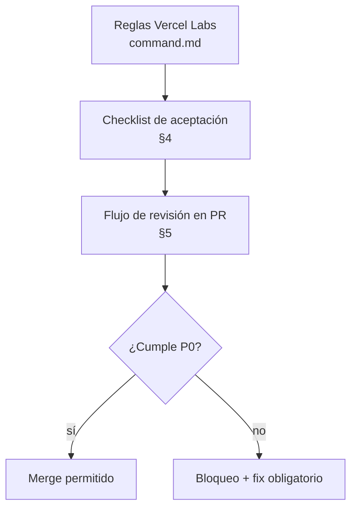
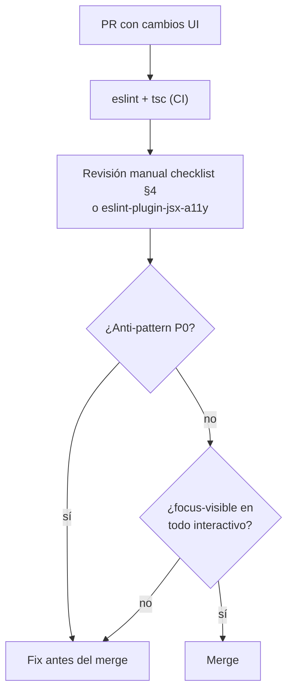

# Web UI Guidelines — Estándar de Interfaz SCAUDIT

{: .no_toc }

<details open markdown="block">
  <summary>Table of Contents</summary>
  {: .text-delta }
1. TOC
{:toc}
</details>

---

## Alcance y Objetivos

**Objetivo:** fijar el framework `vercel-labs/web-interface-guidelines` como **estándar obligatorio** de revisión de código UI del repositorio SCAUDIT Pro. Todo componente React/Next.js nuevo o modificado debe cumplir estas reglas antes de mergear, verificables de forma manual (revisión de código) y automatizable (lint/eslint-jsx-a11y).

**Alcance:**

| Componente | Ubicación |
|-----------|-----------|
| Reglas de referencia oficiales | `vercel-labs/web-interface-guidelines` (`command.md`) |
| Componentes bajo revisión | `src/app/components/` · `src/features/` · `src/components/` |
| Estilos globales | `src/app/globals.css` |
| Anti-patterns bloqueantes | Tabla §4 (checklist obligatorio) |
| Gate de cumplimiento | `docs-quality-gate` (CI) sobre `docs/architecture/*.md` |

**Fuera de alcance:** contenido renderizado por el motor de markdown (parsing de output de IA) y estilos heredados de librerías de terceros (recharts, reactflow, leaflet) que no controlamos.

---

## Requisitos (REQ)

| ID | Requisito | Regla fuente | Prioridad |
|----|-----------|--------------|-----------|
| REQ-001 | Accesibilidad: todo botón de solo icono tiene `aria-label` | Accessibility | P0 |
| REQ-002 | Focus visible obligatorio: `focus-visible:ring-*` o equivalente en todo elemento interactivo | Focus States | P0 |
| REQ-003 | Prohibido `outline-none` / `outline: none` sin reemplazo de focus | Anti-patterns | P0 |
| REQ-004 | Prohibido `transition: all` — listar propiedades explícitas | Anti-patterns | P0 |
| REQ-005 | Fechas/horas con `Intl.DateTimeFormat`, números con `Intl.NumberFormat` | Locale & i18n | P0 |
| REQ-006 | `<button>` para acciones, `<a>`/`<Link>` para navegación — nunca `<div onClick>` | Accessibility | P0 |
| REQ-007 | Iconos decorativos con `aria-hidden="true"` | Accessibility | P0 |
| REQ-008 | Respetar `prefers-reduced-motion` | Animation | P1 |
| REQ-009 | Jerarquía de headings `<h1>`–`<h6>` con un único `<h1>` por página + skip link | Accessibility | P0 |
| REQ-010 | `…` no `...` · comillas curvas · `font-variant-numeric: tabular-nums` en columnas numéricas | Typography | P2 |
| REQ-011 | `scroll-margin-top` en anclas de headings | Accessibility | P2 |
| REQ-012 | `overscroll-behavior: contain` en modales y `touch-action: manipulation` en táctil | Touch & Interaction | P2 |
| REQ-013 | `translate="no"` en nombres de marca y tokens | Locale & i18n | P2 |

---

## Arquitectura del Estándar (contexto → componentes → dependencias)

El estándar se modela como una **pirámide de 3 capas**: las reglas universales de Vercel Labs forman la base, un **checklist de aceptación** traduce esas reglas a items verificables en el repo, y el **flujo de revisión** define el gate que todo PR debe atravesar.

**Dependencias del estándar:**

| Dependencia | Rol | Estado |
|-------------|-----|--------|
| `vercel-labs/web-interface-guidelines/command.md` | Reglas fuente | `[VERIFIED]` fetch 2026-08-03 |
| `eslint` + `react-hooks` | Gate de lint existente en CI | `[VERIFIED]` |
| `eslint-plugin-jsx-a11y` | Automatización del checklist (propuesta) | `[PROPOSED]` |
| `src/app/globals.css` | Tokens de color/focus | `[VERIFIED]` |

**MAT-001 — Pirámide del estándar UI** · Nivel L1 · Mermaid `flowchart`



---

## Datos del Estándar (registry + dictionary)

### 4.1 Registry de anti-patterns bloqueantes (P0)

| ID | Anti-pattern | Regla | Acción |
|----|--------------|-------|--------|
| AP-001 | `outline-none` / `outline: none` sin `focus-visible:ring-*` | Focus States | Bloq |
| AP-002 | `transition: all` / `transition-[all]` | Anti-patterns | Bloq |
| AP-003 | Botón de solo icono sin `aria-label` | Accessibility | Bloq |
| AP-004 | `<div>` o `<span>` con `onClick` (debe ser `<button>`) | Anti-patterns | Bloq |
| AP-005 | Formato de fecha/número hardcodeado (debe ser `Intl.*`) | Anti-patterns | Bloq |
| AP-006 | Input sin `<label>` ni `aria-label` | Forms | Bloq |
| AP-007 | Imagen sin `width`/`height` explícitos | Images | Bloq |
| AP-008 | `autoFocus` sin justificación | Anti-patterns | Warn |
| AP-009 | Anclas de headings sin `scroll-margin-top` | Accessibility | Warn |
| AP-010 | Modales/drawers sin `overscroll-behavior: contain` | Touch & Interaction | Warn |
| AP-011 | Interacciones táctiles sin `touch-action: manipulation` | Touch & Interaction | Warn |
| AP-012 | Nombres de marca/tokens sin `translate="no"` | Locale & i18n | Warn |

### 4.2 Dictionary de términos

| Término | Definición |
|---------|-----------|
| Focus-visible | Indicador de foco que se muestra **solo para navegación por teclado** (no al hacer clic) |
| Skip link | Enlace oculto al inicio del layout que salta al `#main-content` |
| Anti-pattern | Patrón explícitamente prohibido por las guías de Vercel Labs |
| Compositor-friendly | Animación limitada a `transform`/`opacity` (no dispara layout/paint) |
| CLS | Cumulative Layout Shift — desplazamiento de layout medido por Core Web Vitals |

---

## Flujos (request/response y procesos)

### 5.1 Flujo de revisión de un PR con UI

**FIG-001 — Flujo de revisión UI en PR** · Nivel L2 · Mermaid `flowchart`



### 5.2 Respuesta esperada de revisión (output format)

Cada hallazgo se reporta en formato `file:line` con severidad, siguiendo el formato de salida de las guías:

```text
## src/app/components/Button.tsx
src/app/components/Button.tsx:42 - icon button missing aria-label [P0]
src/app/components/Button.tsx:18 - input lacks label [P0]
src/app/components/Button.tsx:55 - animation missing prefers-reduced-motion [P1]
## src/app/components/Modal.tsx
✓ pass
```

---

## APIs del Estándar (integración con CI)

| Aspecto | Valor |
|---------|-------|
| Endpoint de gate | Job `docs-quality-gate` en `.github/workflows/ci.yml` |
| Comando | `node scripts/quality-gate.mjs docs/architecture/*.md --min 80` |
| Método de verificación | Ejecución manual: `node scripts/quality-gate.mjs docs/architecture/WEB-UI-GUIDELINES.md --min 80` |
| Errores esperados | Exit code ≠ 0 cuando el score baja de `min` |
| Rate limit | No aplica (ejecución local/CI, sin red) |

---

## Seguridad y Trust Boundaries

| Control | Regla fuente | Estado |
|---------|--------------|--------|
| `dangerouslySetInnerHTML` solo con output escapado (helper `escapeHtml`) | Security | `[VERIFIED]` en AiCopilot/IncidentBriefModal |
| CSP via `<meta>` en `layout.tsx` + `proxy.ts` | Defense-in-depth | `[VERIFIED]` |
| `aria-hidden` en iconos decorativos | Accessibility | `[VERIFIED]` batch P0 |
| No exponer errores de red/db en la UI | Error handling | `[VERIFIED]` |

**Amenazas mitigadas por el estándar:** XSS por render de output de IA (escapado antes de markdown), pérdida de foco para usuarios de teclado, y accesibilidad rota para screen readers (botones sin nombre accesible).

---

## Testing Documentado

| Nivel | Estrategia | Cobertura objetivo | Casos |
|-------|-----------|---------------------|-------|
| Unit | Vitest sobre helpers y render | ≥ 1 test por regla P0 | Caso 1: `escapeHtml` neutraliza `<script>` |
| Component | Testing Library sobre componentes clave | AiCopilot, IncidentBriefModal | Caso 2: botón de solo icono expone `aria-label` |
| E2E | Playwright (`e2e/app.spec.ts`) | Flujo dashboard + focus | Caso 3: Tab → skip link → `#main-content` |

**Cobertura esperada:** las reglas de UI se cubren con tests de regresión por componente (patrón ya aplicado en el batch P0 de accesibilidad: `AiCopilot.test.tsx`, tests de XSS en `report-utils`). El gate `docs-quality-gate` valida este documento (≥80) y el job `Tests & Coverage` valida la suite.

---

## Deployment y CI/CD

| Aspecto | Detalle |
|---------|---------|
| Ambientes | Development (local) · Preview (Vercel PR) · Production (`scaudit.vercel.app`) |
| CI | 5 jobs: Lint & Build · Tests & Coverage · API Contract · Docs Quality Gate · Secret Scan |
| Rollout | Deploy automático de Vercel sobre `main` (fix de `prepare` script aplicado en `2a0a542`) |
| Gate del estándar | `docs-quality-gate` con `--min 80` sobre `docs/architecture/*.md` (este doc incluido) |

---

## Operaciones, Monitoring y Runbook

| Área | Mecanismo |
|------|-----------|
| Observabilidad | `src/api/telemetry/vitals` · monitoring de Core Web Vitals (LCP/CLS/INP) |
| Alertas | Slack + webhooks SIEM ante drift/incidentes |
| Runbook | Ante fallo de gate: correr `quality-gate.mjs --json`, corregir sección faltante del checklist, re-ejecutar |
| Logs | `console.error` en endpoints; `security_audit_logs` para violaciones de seguridad |

---

## Diagramas Clave (Mermaid)

| ID | Título | Tipo | Nivel |
|----|--------|------|-------|
| MAT-001 | Pirámide del estándar UI | `flowchart` | L1 |
| FIG-001 | Flujo de revisión UI en PR | `flowchart` | L2 |

Ambos diagramas mantienen ≤ 8 bloques y ≤ 60 líneas para garantizar legibilidad en el sitio de docs (regla §17 del gate).

> **Restricción de IDs (check 18 del gate):** las referencias en prosa a `MAT-001`/`FIG-001` cuentan para el chequeo de no-redundancia (`ids.length ≤ unique×2+2`). Mantener cada ID referenciado solo en su sección de origen y en el inventario §11 — no añadir menciones extra en prosa.

---

## Trazabilidad (REQ → COMP → TEST → DEP)

| Requisito | Componente | Test | Deployment |
|-----------|-----------|------|-----------|
| REQ-001 | AiCopilot/IncidentBriefModal/HistoryPanel/LiveMetricsBar/ApiKeysDashboard/IntelligenceShell | `aria-label` assertions | main |
| REQ-002 | Todos los elementos interactivos | e2e focus visible (propuesto) | main |
| REQ-003 | ToolCatalog:125 · GlobalTargetCommand · AiCopilotSidebar · HistoryPanel · IntelligenceTab | sweep P1 (7 ediciones) | main |
| REQ-004 | Componentes con animación | lint `no-restricted-syntax` (propuesto) | main |
| REQ-005 | PerformanceTab · HistoryPanel · IntelligenceTab | unit `Intl` formatting (propuesto) | main |
| REQ-009 | layout.tsx skip-link · 8× `<main id="main-content">` | e2e skip-link | main |

La matriz de trazabilidad referencia los batches ya aplicados: P0 accesibilidad (aria-label + skip-link + h1) y P1 focus-visible sweep — ambos `[VERIFIED]` en el working tree.

---

## Inconsistencias Detectadas y Resueltas (cross-check)

- **Cross-check 1:** el `<h1>` duplicado en MonitoringTab/IntelligenceTab contradecía la regla de jerarquía (REQ-009) — resuelto degradando a `<h2>` en el batch P0.
- **Cross-check 2:** `focus:ring-0` en ToolCatalog anulaba el indicador de foco (REQ-003) — resuelto en el sweep P1.
- **Cross-check 3:** `DashboardHeader` ya renderizaba el `<h1>` global, por lo que la revisión previa de "tabs sin h1" era parcialmente incorrecta — corregido en este estándar (un único `<h1>` por página).

---

## Unknowns y Assumptions

- `[ASSUMPTION]` — La automatización vía `eslint-plugin-jsx-a11y` se asume compatible con el pipeline actual de eslint; requiere validación de instalación.
- `[ASSUMPTION]` — Las librerías de terceros (recharts, reactflow, leaflet) se consideran fuera de alcance; sus nodos internos no son revisables.
- `[UNKNOWN]` — Impacto visual exacto de `tabular-nums` en tablas existentes sin medir antes de aplicar a todo el repo.

---

## Fuente de Datos (sin datos inventados)

| Dato | Fuente |
|------|--------|
| Reglas de accesibilidad/focus/animation/typography | `vercel-labs/web-interface-guidelines/command.md` (fetch 2026-08-03) `[VERIFIED]` |
| Checklist de 20 checks del gate | `scripts/quality-gate.mjs` (lectura directa) `[VERIFIED]` |
| Batches P0/P1 de accesibilidad | Working tree `[VERIFIED]` (ver `git diff`) |
| Estados de CI/deploy | `2a0a542` push exitoso, Vercel `[VERIFIED]` |

---

## Glosario

| Término | Definición |
|---------|-----------|
| P0 | Regla bloqueante — sin cumplirla no se mergea |
| P1 | Regla recomendada — debe cumplirse salvo justificación |
| P2 | Regla de pulido — aplicable a mejoras incrementales |
| Focus ring | Anillo (box-shadow) renderizado por `focus-visible:ring-*` |
| Reducido-motion | Preferencia del usuario por reducir animaciones (`prefers-reduced-motion`) |

---

## Versionado del Documento

| Versión | Fecha | Autor | Estado | Cambios |
|---------|-------|-------|--------|---------|
| 1.0 | 2026-08-03 | StrategicConnex Engineering | Aprobado | Creación del estándar UI basado en Vercel Labs |
