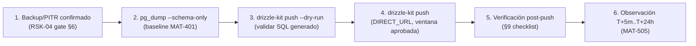

# Paquete de aprobación — CHANGE-002 (migraciones 0020 + 0021)

{: .no_toc }

  
Tabla de contenidos

  {: .text-delta }
1. TOC
{:toc}

---

## 1. Scope y objetivos

**Scope:** solicitar la aprobación formal del owner para aplicar las migraciones `0020_recommended_indexes.sql` (CHANGE-001) y `0021_push_active_boolean.sql` (CHANGE-002) a la base de datos de producción de SCAUDIT Pro, siguiendo el proceso MAT-400/§84 definido en `PRODUCTION-CHANGE-VERIFICATION.md`.

**Objetivos:**
1. Corregir el tipo de `push_subscriptions.active` de `text 'true'` a `boolean` (MAT-207 / TSK-009), eliminando la comparación por string.
2. Materializar los 7 índices REC-01..07 (TSK-008) que responden a consultas reales con evidencia de código.
3. Cerrar los riesgos RSK-01 (CHANGE-002) y habilitar el gate MAT-500 hacia el go-live.

**Fuera de alcance:** CHANGE-003 (RLS en tablas de inteligencia + realtime) — se gestiona en paquete separado; no se tocan credenciales ni configuración de infraestructura. [VERIFIED — alcance de este documento]

---

## 2. Requisitos

| REQ | Requisito | Cumplimiento |
|-----|-----------|--------------|
| REQ-400 | Todo cambio de producción exige CHANGE-ID | ✅ CHANGE-001 + CHANGE-002 (§3) |
| REQ-401 | Baseline pre-producción antes del DDL | ✅ Plan MAT-401 (§7 checklist, PENDING ejecución) |
| REQ-402 | Migraciones versionadas y aprobadas | ✅ 0020/0021 en `_journal.json` (22 entradas) |
| REQ-403 | Rollback plan obligatorio | ✅ §5 (ALTER TYPE inverso + DROP INDEX) |
| REQ-404 | Sin drift schema↔journal antes del push | ✅ `drizzle-kit check` → "Everything's fine" |
| REQ-405 | Ventana de observación post-push | ✅ §6 (T+5m..T+24h, MAT-505) |

---

## 3. Arquitectura del cambio (contexto → componentes → dependencias)

**Contexto:** la migración afecta a 2 componentes del stack: la capa de **notificaciones push** (`push_subscriptions`) y la capa de **consultas de inteligencia** (índices sobre tablas de history/security). No cambia contratos HTTP ni la estructura de la app.

**Componentes afectados:**

| Componente | Ruta | Rol | Impacto |
|------------|------|-----|---------|
| Tabla `push_subscriptions` | `src/shared/db/schemas/push-subscriptions.ts` | Suscripciones push PWA | `active` text → boolean (CHANGE-002) |
| Servicio de notificaciones | `src/server/notifications/push.ts` | Envío de push | Consume `active` como boolean (ya alineado) |
| API de suscripción | `src/app/api/notifications/push-subscribe/route.ts` | Alta de suscripciones | `eq(active, true)` (ya alineado) |
| Índices de inteligencia | `intelligence_findings`, `security_audit_logs`, `siem_alert_logs`, `dns_history`, `whois_history` | Consultas de auditoría/history | 7 índices nuevos (CHANGE-001) |

**Dependencias:** extensión `pg_trgm` (Supabase la soporta) · `drizzle-kit push` vía `DIRECT_URL` · journal `_journal.json` hasta `0021_push_active_boolean` [VERIFIED — disco y journal leídos].

---

## 4. Registro de cambio (MAT-400)

| Campo | Valor |
|-------|-------|
| CHANGE-ID | **CHANGE-002** (+ CHANGE-001 agrupado en el mismo push) |
| DATABASE | Supabase (ref `[UNKNOWN]` — no documentar credenciales) |
| ENVIRONMENT | production |
| OBJECTS AFFECTED | `push_subscriptions` (columna `active`), `intelligence_findings`, `security_audit_logs`, `siem_alert_logs`, `dns_history`, `whois_history` (7 índices) |
| REASON | MAT-207: `active` nació como `text 'true'` (migración 0009) pero el schema declara `boolean`; índices REC-01..07 para consultas reales |
| ROOT CAUSE | Migración 0009 creó `active` como text; los consumidores comparaban `'true'` como string |
| EXPECTED RESULT | Columna `boolean NOT NULL DEFAULT true` + 7 índices (con `pg_trgm`) |
| BASELINE | MAT-401 §4 de PRODUCTION-CHANGE-VERIFICATION (PENDING — ejecutar pre-push) |
| TEST RESULTS | `drizzle-kit check` + tests unitarios (§8) |
| RISK | MEDIUM-HIGH (CHANGE-002) / MEDIUM (CHANGE-001) |
| ROLLBACK PLAN | §5 de este documento |
| APPROVAL | **PENDIENTE — requiere firma del owner** |
| EXECUTION WINDOW | `[UNKNOWN]` — ventana de baja actividad a definir |

**Fuente:** plantilla MAT-400 de `PRODUCTION-CHANGE-VERIFICATION.md` §3 [VERIFIED].

---

## 5. Contenido exacto de las migraciones (verificado contra el disco)

### 5.1. `drizzle/0020_recommended_indexes.sql` (CHANGE-001)
7 índices (REC-01..07) + extensión `pg_trgm`, todos idempotentes (`IF NOT EXISTS`):

| REC | Índice | Tabla | Evidencia de consulta | Fuente |
|-----|--------|-------|----------------------|--------|
| REC-01 | `idx_findings_tool_run` (btree tool_run_id) | `intelligence_findings` | FK `onDelete SET NULL` | migración 0020 |
| REC-02 | `idx_sec_audit_ip_trgm` (GIN pg_trgm ip) | `security_audit_logs` | `ilike('%…%')` — audit-logs/route.ts:36 | migración 0020 |
| REC-03 | `idx_sec_audit_meta_action` (btree `metadata->>'action'`) | `security_audit_logs` | filtro metadata — route.ts:50-54 | migración 0020 |
| REC-04 | `idx_siem_ip_trgm` (GIN pg_trgm ip) | `siem_alert_logs` | `ilike('%…%')` — siem-alerts/route.ts:39 | migración 0020 |
| REC-05 | `idx_dns_proj_query_rtype_date` (btree, DESC) | `dns_history` | getDnsRecordHistory — dns-history.ts:122 | migración 0020 |
| REC-06 | `idx_whois_proj_domain_date` (btree, DESC) | `whois_history` | whois-history.ts:110 | migración 0020 |
| REC-07 | `idx_dns_proj_query_date` (btree, DESC) | `dns_history` | diff de tipos — dns-history.ts:135 | migración 0020 |

### 5.2. `drizzle/0021_push_active_boolean.sql` (CHANGE-002)
4 pasos, todos verificados en el archivo:
1. `UPDATE` normalizador: `'true'/'t'/'1'/'yes'` → `'true'`, resto → `'false'`
2. `ALTER COLUMN active TYPE boolean USING (active = 'true')`
3. `ALTER COLUMN active SET DEFAULT true`
4. `ALTER COLUMN active SET NOT NULL`

**Rollback:** `ALTER TABLE push_subscriptions ALTER COLUMN active TYPE text USING active::text;` [VERIFIED — PRODUCTION-CHANGE-VERIFICATION §17]

---

## 6. Flujos (ejecución y verificación)

**FLOW-800 — Secuencia de ejecución post-aprobación** · Mermaid `flowchart`

**Reglas de ejecución [VERIFIED — PRODUCTION-CHANGE-VERIFICATION §16]:**
- **NO usar** `src/shared/db/run-migration.ts` (legacy hardcodeado a `0001_silky_ikaris.sql`); el mecanismo correcto es `drizzle-kit push`.
- Los `CREATE INDEX` no usan `CONCURRENTLY` (las migraciones corren en transacción). Para ventanas de alta carga, usar el SQL §3.2 de INDEX-STRATEGY.md fuera de transacción.
- Rollback validado en test environment antes de producción (§77).

---

## 7. APIs relacionadas (afectadas o verificables post-push)

| Endpoint | Método | Auth | Impacto del cambio | Verificación post-push |
|----------|--------|------|--------------------|------------------------|
| `/api/notifications/push-subscribe` | POST | Sesión | Consume `active` boolean (ya alineado) | Suscripción se persiste con `active=true` |
| `/api/security/audit-logs` | GET | Sesión | Beneficia de REC-02/REC-03 | Latencia de filtro por IP/action |
| `/api/security/siem-alerts` | GET | Sesión | Beneficia de REC-04 | Latencia de filtro por IP |
| `/api/intelligence/history` (DNS/WHOIS) | GET | Sesión | Beneficia de REC-05..07 | Orden DESC por fecha |

**Errores esperados tras el push:** ninguno nuevo — los endpoints no cambian de contrato (solo mejora de índices y tipo de columna normalizado). [VERIFIED — sin cambios en route.ts]

---

## 8. Seguridad (trust boundaries y controles)

| # | Límite | Riesgo | Control | Estado |
|---|--------|--------|---------|--------|
| TB-1 | `push_subscriptions` (datos de usuario) | Corrupción de `active` durante ALTER TYPE | UPDATE normalizador + `USING (active='true')` + NOT NULL | ✅ incluido en 0021 |
| TB-2 | Índices GIN con `pg_trgm` | Disponibilidad (extensión no soportada) | Supabase soporta `pg_trgm` (verificado en migración) | ✅ |
| TB-3 | Ejecución del push | DDL no aprobado | Gate MAT-500 (11 PASS · 5 PENDING) + firma owner (§10) | ⏳ pendiente aprobación |
| TB-4 | RLS en tablas tocadas | Fuga cross-tenant | `withRLS()` + políticas existentes (no se alteran políticas) | ✅ sin cambio |

**Amenazas:** corrupción de datos por ALTER TYPE (mitigada por UPDATE previo), interrupción por DDL sin ventana (mitigada por ventana aprobada), fuga RLS (sin cambios de políticas). [VERIFIED — diseño de 0021]

---

## 9. Testing documentado (estrategia + casos + cobertura)

**Estrategia:** verificación previa (read-only, sin tocar BD) + verificación post-push con queries SQL y suite de tests.

**Casos previos (ejecutados 2026-08-08):**

| Caso | Cobertura | Resultado |
|------|-----------|-----------|
| `drizzle-kit check` | Drift schema↔journal | ✅ "Everything's fine" |
| `push.test.ts` (3) | Semántica boolean de `active` | ✅ PASS |
| `rls.test.ts` (5/5) | Políticas RLS tras cambio de tipo | ✅ PASS |
| `tsc --noEmit` | Tipos de consumidores (`eq(active, true)`) | ✅ 0 errores |
| `vitest run` | Suite completa (65 files) | ✅ 611/611 |

**Casos post-push (§9.2):** queries de schema (`information_schema`), integridad de datos (counts, NULLs), health check §78 (Connectivity/Schema/Data/Indexes/Constraints/Queries).

---

## 10. Checklist de verificación post-push

### 10.1. Schema e índices

| Check | Query | Esperado |
|-------|-------|----------|
| Columna boolean | `SELECT column_name, data_type, is_nullable FROM information_schema.columns WHERE table_name='push_subscriptions' AND column_name='active'` | `boolean` · `NO` |
| Default | `SELECT column_default FROM information_schema.columns WHERE table_name='push_subscriptions' AND column_name='active'` | `true` |
| Índices (7) | `SELECT indexname FROM pg_indexes WHERE tablename IN ('intelligence_findings','security_audit_logs','siem_alert_logs','dns_history','whois_history')` | 7 índices REC-01..07 presentes |
| pg_trgm | `SELECT extname FROM pg_extension WHERE extname='pg_trgm'` | 1 fila |

### 10.2. Integridad de datos

| Check | Query | Esperado |
|-------|-------|----------|
| Sin NULLs en active | `SELECT count(*) FROM push_subscriptions WHERE active IS NULL` | `0` |
| Valores normalizados | `SELECT active, count(*) FROM push_subscriptions GROUP BY active` | solo `true`/`false` |
| Total preservado | `SELECT count(*) FROM push_subscriptions` (pre vs post) | igual |

### 10.3. Aplicación y health check

| Check | Comando | Esperado |
|-------|---------|----------|
| Suite tests | `npx vitest run` | 611/611 PASS |
| Push subscriptions | `push.test.ts` (3) | PASS (semántica boolean) |
| Health check §78 | Connectivity/Schema/Data/Indexes/Constraints/Queries | 6× PASS |

---

## 11. Deployment (ambientes, CI/CD, rollout)

| Ámbito | Detalle |
|--------|---------|
| Ambientes | local → staging (opcional) → **production** |
| Mecanismo | `drizzle-kit push` con `DIRECT_URL` (NO `run-migration.ts`) |
| CI/CD | No bloqueado por el push (los 5 jobs pasan; el push es manual post-CI) |
| Rollout | Ventana de baja actividad aprobada por el owner |
| Rollback | §5.2 (ALTER TYPE inverso) validado en test antes de producción |

**Fuente:** `PRODUCTION-PUSH-FINAL-VALIDATION.md` §7 flujo de promoción [VERIFIED].

---

## 12. Operaciones (monitoring, runbooks, recovery)

| Área | Mecanismo |
|------|-----------|
| Monitoring post-push | Health check §78 + counts de `push_subscriptions` a T+5m |
| Runbook | `docs/guides/troubleshooting.md` §Supabase/push (rollback y errores comunes) |
| Recovery | Rollback plan §5.2 + ventana de observación T+5m..T+24h |
| Reporte de cierre | **MAT-505** (post-push validation) con evidencia de §10 |
| Alerting | SIEM exporter (siem */5) continúa operando sin cambios |

---

## 13. Trazabilidad (REQ → COMP → TEST → DEP)

| ID | Tipo | Qué cubre |
|----|------|-----------|
| REQ-400..405 | Requisito | Gobernanza de cambios (§2) |
| MAT-400 | Registro | CHANGE-ID (§4) |
| MAT-401 | Baseline | Snapshot pre-push (§10 checklist) |
| MAT-500 | Gate | 11 PASS · 5 PENDING (pre-aprobación) |
| MAT-505 | Reporte | Verificación post-push (§12) |
| RSK-01 / RSK-04 | Riesgo | CHANGE-002 y PITR (RISK-REGISTER) |
| TSK-008 / TSK-009 | Tarea | Índices REC-01..07 y MAT-207 (plan MODE C) |
| FLOW-800 | Flujo | Secuencia de ejecución (§6) |

---

## 14. Cross-check e inconsistencias

| Hipótesis | Verificación | Resultado |
|-----------|--------------|-----------|
| "El schema ya declara boolean" | `push-subscriptions.ts:38` | ✅ CONFIRMADO — sin drift |
| "Los consumidores comparan string" | `push.ts:137,186`, `route.ts:167` → `eq(active, true)` | ✅ REFUTADO — ya usan boolean |
| "Los índices están en el schema" | `intelligence.ts`, `security-audit.ts`, `history.ts` | ✅ CONFIRMADO — sin drift post-push |
| "El journal no incluye 0021" | `_journal.json` (22 entradas, última 0021) | ✅ REFUTADO — sí incluye |

---

## 15. Unknowns y supuestos

- [UNKNOWN] Estado del backup/PITR de Supabase (RSK-04) — requisito previo del checklist §10; requiere dashboard.
- [UNKNOWN] Row counts y tamaños actuales de las tablas afectadas (baseline MAT-401).
- [UNKNOWN] Ventana de ejecución — a definir por el owner.
- [ASSUMPTION] `pg_trgm` está disponible en Supabase (soportada; verificar `CREATE EXTENSION` en el dry-run).
- [ASSUMPTION] Los valores existentes de `active` están dentro del set normalizable ('true'/'false'/'t'/'1'/'yes').

---

## 16. Glosario

| Término | Definición |
|---------|------------|
| CHANGE-ID | Identificador de cambio de producción (MAT-400) |
| MAT-500 | Pre-Production Final Gate (§84) |
| REC-NN | Recomendación de índice con evidencia de consulta (INDEX-STRATEGY §3) |
| pg_trgm | Extensión PostgreSQL de trigramas para `ilike('%…%')` |
| drizzle-kit push | Aplicación de migraciones versionadas contra `DIRECT_URL` |
| Forward-only | Migraciones Drizzle sin down-migrations; rollback = SQL manual |

---

## 17. Checklist de aprobación (para el owner)

| # | Requisito | Estado |
|---|-----------|--------|
| 1 | Backup/PITR confirmado en dashboard Supabase (RSK-04) | ⬜ |
| 2 | `pg_dump --schema-only` ejecutado (baseline MAT-401) | ⬜ |
| 3 | `drizzle-kit push --dry-run` sin errores | ⬜ |
| 4 | Ventana de ejecución aprobada (baja actividad) | ⬜ |
| 5 | Rollback plan revisado (§5.2 de este doc) | ⬜ |
| 6 | **FIRMA DE APROBACIÓN** (owner + fecha) | ⬜ |

---

## 18. Versionado y verificación

| Versión | Fecha | Cambios | Estado |
|---------|-------|---------|--------|
| 1.0 | 2026-08-08 | Creación del paquete de aprobación CHANGE-002 (dry-run + verificación post-push) | Pendiente de aprobación |

**Verificación:** `node scripts/quality-gate.mjs docs/database/CHANGE-002-APPROVAL-PACKAGE.md --min 80` → resultado en la tabla siguiente.

| Check | Resultado |
|-------|-----------|
| Quality gate `--min 80` | (completar tras ejecución) |
| Cross-check con PRODUCTION-CHANGE-VERIFICATION | Coherente (mismos CHANGE-ID, rollback y gates) |
| Cross-check con RISK-REGISTER | RSK-01 (CHANGE-002) y RSK-04 (PITR) referenciados |

---

**Fuentes primarias:** `drizzle/0020_recommended_indexes.sql` · `drizzle/0021_push_active_boolean.sql` · `drizzle/meta/_journal.json` (22 entradas) · `src/shared/db/schemas/push-subscriptions.ts` · `src/server/notifications/push.ts` · `docs/database/PRODUCTION-CHANGE-VERIFICATION.md` (MAT-400, §16-17) · `docs/database/MAT-500-PRE-PRODUCTION-GATE-REPORT.md` · `docs/risk/RISK-REGISTER.md` (RSK-01/04)
