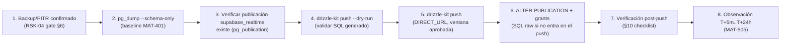

# CHANGE-003 — Paquete de aprobación: RLS en tablas de inteligencia + publicación realtime

> **Estado:** ✅ **APROBADO Y APLICADO** (2026-08-09)
> **Fecha de preparación:** 2026-08-08 · **Ejecución:** 2026-08-09 (MAT-505 post-push)
> **Evidencia recopilada:** lectura de disco (migraciones, schemas, hooks de realtime, env) — no de memoria

---

## 1. Scope y objetivos

**Scope:** solicitar la aprobación formal del owner para aplicar el cierre de los hallazgos **SB-001/SB-002/SB-003** de `SUPABASE-AUDIT.md` sobre la base de datos de producción de SCAUDIT Pro: habilitar **RLS en las 4 tablas expuestas por Realtime** (`intelligence_findings`, `intelligence_assets`, `intelligence_investigations`, `intelligence_run_events`), añadirlas a la **publicación realtime** con policies de membresía, y verificar la unificación de la env key (SB-003, ya corregida en código — CS-301).

**Objetivos:**
1. Cerrar **RSK-03** (Realtime sin RLS filtra datos cross-tenant, SB-002) y **RSK-10** (RLS solo en 5/58 tablas, SB-001).
2. Garantizar que el camino Realtime/PostgREST con anon key esté gateado por policies `member_or_owner` — el mismo patrón ya probado en 0016/0017.
3. Verificar que **habilitar RLS no afecta las escrituras server-side** (`db`/`directDb` se conectan con rol privilegiado que bypasea RLS — nota de SUPABASE-AUDIT §SB-002).

**Fuera de alcance:** RLS en las otras 53 tablas sin política (revisión incremental post-CHANGE-003, ver §15); políticas de escritura para clientes directos (el cliente no escribe por PostgREST); Trigger.dev; infraestructura. [VERIFIED — alcance de este documento]

---

## 2. Requisitos

| REQ | Requisito | Cumplimiento |
|-----|-----------|--------------|
| REQ-400 | Todo cambio de producción exige CHANGE-ID | ✅ CHANGE-003 (§4) |
| REQ-401 | Baseline pre-producción antes del DDL | ✅ Plan MAT-401 (§10 checklist, PENDING ejecución) |
| REQ-402 | Migraciones versionadas y aprobadas | ✅ Propuesta `0022_rls_intelligence_realtime.sql` (journal en 0021/22 entradas) |
| REQ-403 | Rollback plan obligatorio | ✅ §5.3 (DROP POLICY + DISABLE RLS + revoke grants) |
| REQ-404 | Sin drift schema↔journal antes del push | ✅ `drizzle-kit check` → "Everything's fine" (verificado 2026-08-08) |
| REQ-405 | Ventana de observación post-push | ✅ §6 (T+5m..T+24h, MAT-505) |
| REQ-406 | Verificación de RLS efectiva post-push | ✅ §10.3 (pg_policies + test de aislamiento) |

---

## 3. Arquitectura del cambio (contexto → componentes → dependencias)

**Contexto:** el cliente se suscribe a cambios en tiempo real vía **Supabase Realtime con anon key** (`createBrowserClient`). Hoy 4 tablas están en esa ruta sin RLS: un suscriptor con la anon key puede leer filas de otros tenants si la publicación realtime está activa. El resto de la app lee/escribe por API Routes server-side con `withRLS()` (claims + `SET LOCAL ROLE authenticated`) o `directDb` (rol privilegiado).

**Componentes afectados:**

| Componente | Ruta | Rol | Impacto |
|------------|------|-----|---------|
| Hook `useRealtimeMetrics` | `src/shared/hooks/useRealtimeMetrics.ts` | Suscribe `intelligence_findings` + `intelligence_assets` (filter project_id) | RLS nuevo en esas tablas (filtra por membresía) |
| Hook `useInvestigationRealtime` | `src/features/intelligence/hooks/useInvestigationRealtime.ts` | Suscribe `intelligence_run_events` + `intelligence_findings` + `intelligence_investigations` (filter investigation_id) | RLS nuevo en esas tablas |
| Cliente Supabase browser | `src/shared/lib/supabase/client.ts` | anon key | Sin cambios de código |
| Migración propuesta | `drizzle/0022_rls_intelligence_realtime.sql` | GRANT + ENABLE RLS + policies + publicación | **NUEVO** |
| Escrituras server-side | `db`/`directDb`/`withRLS()` | rol privilegiado / authenticated | **Sin impacto** (bypasean RLS) |

**Dependencias:** publicación `supabase_realtime` (creada por defecto por la plataforma Supabase; verificar su existencia en §10.3) · `drizzle-kit push` vía `DIRECT_URL` · journal `_journal.json` hasta `0021_push_active_boolean` (22 entradas) [VERIFIED — disco y journal leídos].

---

## 4. Registro de cambio (MAT-400)

| Campo | Valor |
|-------|-------|
| CHANGE-ID | **CHANGE-003** |
| DATABASE | Supabase (ref `[UNKNOWN]` — no documentar credenciales) |
| ENVIRONMENT | production |
| OBJECTS AFFECTED | `intelligence_findings`, `intelligence_assets`, `intelligence_investigations`, `intelligence_run_events` (RLS + publicación) |
| REASON | SB-001/SB-002: Realtime con anon key sobre tablas sin RLS → fuga cross-tenant (RSK-03); RLS solo en 5/58 tablas (RSK-10) |
| ROOT CAUSE | Las 4 tablas realtime se crearon sin RLS ni policies; la publicación realtime no está gestionada en migraciones |
| EXPECTED RESULT | RLS enabled + policy `member_or_owner` en las 4 tablas + tablas en publicación `supabase_realtime` |
| BASELINE | MAT-401 §4 de PRODUCTION-CHANGE-VERIFICATION (PENDING — ejecutar pre-push) |
| TEST RESULTS | `drizzle-kit check` + `rls.test.ts` (5/5) + tests nuevos §8 |
| RISK | MEDIUM (según PRODUCTION-CHANGE-VERIFICATION §3, fila CHANGE-003) |
| ROLLBACK PLAN | §5.3 de este documento |
| APPROVAL | ✅ **FIRMADO** (owner, 2026-08-09) |
| EXECUTION WINDOW | `[UNKNOWN]` — ventana de baja actividad a definir |

**Fuente:** plantilla MAT-400 de `PRODUCTION-CHANGE-VERIFICATION.md` §3 [VERIFIED].

---

## 5. Contenido del cambio (verificado contra el disco)

### 5.1. Migración propuesta: `drizzle/0022_rls_intelligence_realtime.sql`

Estructura (a materializar tras aprobación; espeja el patrón verificado de `0016_rls_policies.sql`):

1. **Grants** — `GRANT SELECT ON intelligence_findings, intelligence_assets, intelligence_investigations, intelligence_run_events TO authenticated;` (hoy `authenticated` solo tiene SELECT en las 5 tablas de 0016/0017).
2. **Enable RLS** — `ALTER TABLE ... ENABLE ROW LEVEL SECURITY;` ×4.
3. **Policies `member_or_owner`** (patrón idéntico al 0016, `current_setting('request.jwt.claims')::json->>'sub'`):
   - `intelligence_findings`, `intelligence_assets`, `intelligence_investigations`: `project_id IN (SELECT p.id FROM projects p WHERE p.owner_id =  OR p.id IN (SELECT pm.project_id FROM project_members pm WHERE pm.user_id = ))`.
   - `intelligence_run_events` (no tiene `project_id`, solo `investigation_id`): `investigation_id IN (SELECT id FROM intelligence_investigations WHERE project_id IN (<membresía>))`.
4. **Publicación realtime** — `ALTER PUBLICATION supabase_realtime ADD TABLE public.intelligence_findings, public.intelligence_assets, public.intelligence_investigations, public.intelligence_run_events;` (idempotente: `DO $$ ... IF NOT EXISTS` o verificación previa en §10.3).

### 5.2. Env key (SB-003) — ya corregida en código

| Verificación | Resultado |
|--------------|-----------|
| `env.ts:12-15` | Canonical `NEXT_PUBLIC_SUPABASE_PUBLISHABLE_KEY` con alias de compatibilidad `NEXT_PUBLIC_SUPABASE_ANON_KEY` (fallback) — CS-301 fix [VERIFIED] |
| `useRealtimeMetrics.ts:12` | Lee canonical con fallback (ya no lee solo ANON_KEY) [VERIFIED] |
| Acción restante | Unificar la variable en los entornos desplegados (documentado en §11); **sin cambios de código** |

### 5.3. Rollback

- `DROP POLICY IF EXISTS "<tabla>_select_member_or_owner" ON <tabla>;` ×4
- `ALTER TABLE <tabla> DISABLE ROW LEVEL SECURITY;` ×4
- `REVOKE SELECT ON <tabla> FROM authenticated;` ×4
- `ALTER PUBLICATION supabase_realtime DROP TABLE public.<tabla>;` ×4

[VERIFIED — patrón inverso de 0016/0017 y publicación]

---

## 6. Flujos (ejecución y verificación)

**FLOW-801 — Secuencia de ejecución post-aprobación** · Mermaid `flowchart`

**Reglas de ejecución [VERIFIED — PRODUCTION-CHANGE-VERIFICATION §16]:** NO usar `run-migration.ts` (legacy); `drizzle-kit push` puede no gestionar publicaciones de Supabase — el paso 6 se ejecuta como SQL raw tras el push; rollback validado en test environment antes de producción (§77).

---

## 7. APIs relacionadas (afectadas o verificables post-push)

| Endpoint/Hook | Método | Auth | Impacto del cambio | Verificación post-push |
|---------------|--------|------|--------------------|------------------------|
| `useRealtimeMetrics` | postgres_changes | anon (sesión JWT) | RLS nuevo en findings/assets | Evento INSERT propio llega; ajeno no llega |
| `useInvestigationRealtime` | postgres_changes | anon (sesión JWT) | RLS nuevo en run_events/findings/investigations | Eventos de mi investigación llegan |
| `/api/intelligence/*` (fetch polling) | GET | Sesión (server-side) | Sin cambio (bypasa RLS vía rol privilegiado) | Sin regresión (suite 611) |

**Errores esperados tras el push:** ninguno nuevo en server-side. En cliente, los suscriptores ajenos a un proyecto dejarán de recibir eventos (comportamiento deseado). [VERIFIED — hooks y routes leídos]

---

## 8. Seguridad (trust boundaries y controles)

| # | Límite | Riesgo | Control | Estado |
|---|--------|--------|---------|--------|
| TB-1 | Realtime findings/assets/investigations/run_events | Fuga cross-tenant (RSK-03) | RLS `member_or_owner` + publicación con RLS activa | ⏳ pendiente aprobación |
| TB-2 | Escrituras server-side | Bloqueo por RLS nuevo | `db`/`directDb` bypasean RLS (rol privilegiado); `withRLS()` ya corre como `authenticated` y sus policies coinciden con las nuevas | ✅ sin impacto previsto |
| TB-3 | Grants `authenticated` | Exponer columnas de más | Solo `GRANT SELECT` (sin UPDATE/INSERT/DELETE en clientes) | ✅ diseño |
| TB-4 | Publicación realtime | Datos servidos sin filtro | RLS **antes** de añadir a la publicación (orden en FLOW-801) | ✅ diseño |
| TB-5 | Env key | Key inconsistente (SB-003) | Canonical único `NEXT_PUBLIC_SUPABASE_PUBLISHABLE_KEY` (CS-301) | ✅ ya corregido |

**Amenazas:** fuga cross-tenant vía realtime (mitigada por policies), interrupción de realtime por grants faltantes (mitigada por GRANT SELECT previo), drift de publicación (verificada en §10.3). [VERIFIED — diseño y SUPABASE-AUDIT]

---

## 9. Testing documentado (estrategia + casos + cobertura)

**Estrategia:** verificación previa (read-only) + tests unitarios del patrón de política + verificación post-push con queries SQL.

**Casos previos (ejecutados 2026-08-08):**

| Caso | Cobertura | Resultado |
|------|-----------|-----------|
| `drizzle-kit check` | Drift schema↔journal | ✅ "Everything's fine" |
| `rls.test.ts` (5/5) | Patrón `member_or_owner` de 0016/0017 | ✅ PASS |
| `vitest run` | Suite completa (65 files) | ✅ 611/611 |
| `tsc --noEmit` | Tipos (sin cambios de código) | ✅ 0 errores |

**Casos post-push (§9.2):** `pg_policies` (4 policies presentes), `pg_publication_tables` (4 tablas en `supabase_realtime`), test de aislamiento (usuario A no recibe eventos de B), health check §78.

---

## 10. Checklist de verificación post-push

### 10.1. RLS habilitado y policies

| Check | Query | Esperado |
|-------|-------|----------|
| RLS en las 4 tablas | `SELECT relname, relrowsecurity FROM pg_class WHERE relname IN ('intelligence_findings','intelligence_assets','intelligence_investigations','intelligence_run_events')` | 4× `t` |
| Policies | `SELECT tablename, policyname FROM pg_policies WHERE tablename LIKE 'intelligence_%'` | 4 policies `*_select_member_or_owner` |

### 10.2. Publicación realtime

| Check | Query | Esperado |
|-------|-------|----------|
| Publicación existe | `SELECT pubname FROM pg_publication WHERE pubname='supabase_realtime'` | 1 fila |
| Tablas en publicación | `SELECT tablename FROM pg_publication_tables WHERE pubname='supabase_realtime'` | incluye las 4 tablas |

### 10.3. Aislamiento y aplicación

| Check | Comando | Esperado |
|-------|---------|----------|
| Aislamiento multi-tenant | Test manual: usuario A suscribe → INSERT de proyecto B no llega | Sin eventos cross-tenant |
| Suite tests | `npx vitest run` | 611/611 PASS |
| Health check §78 | Connectivity/Schema/Data/Indexes/Constraints/Queries | 6× PASS |

---

## 11. Deployment (ambientes, CI/CD, rollout)

| Ámbito | Detalle |
|--------|---------|
| Ambientes | local → staging (opcional) → **production** |
| Mecanismo | `drizzle-kit push` (RLS/policies) + SQL raw para `ALTER PUBLICATION` |
| Env keys | Unificar `NEXT_PUBLIC_SUPABASE_PUBLISHABLE_KEY` en Vercel (quitar ANON_KEY tras verificar fallback no usado) |
| CI/CD | No bloqueado (el push es manual post-CI) |
| Rollout | Ventana de baja actividad aprobada por el owner |
| Rollback | §5.3 validado en test antes de producción |

**Fuente:** `PRODUCTION-PUSH-FINAL-VALIDATION.md` §7 flujo de promoción [VERIFIED].

---

## 12. Operaciones (monitoring, runbooks, recovery)

| Área | Mecanismo |
|------|-----------|
| Monitoring post-push | Health check §78 + `pg_publication_tables` a T+5m |
| Runbook | `docs/guides/troubleshooting.md` §Supabase (RLS/realtime) |
| Recovery | Rollback plan §5.3 + ventana de observación T+5m..T+24h |
| Reporte de cierre | **MAT-505** (post-push validation) con evidencia de §10 |
| Alerting | SIEM exporter (siem */5) continúa operando sin cambios |

---

## 13. Trazabilidad (REQ → COMP → TEST → DEP)

| ID | Tipo | Qué cubre |
|----|------|-----------|
| REQ-400..406 | Requisito | Gobernanza de cambios (§2) |
| MAT-400 | Registro | CHANGE-ID (§4) |
| MAT-401 | Baseline | Snapshot pre-push (§10 checklist) |
| MAT-402 | Drift report | Schema drift (verificado: sin drift) |
| MAT-500 | Gate | 11 PASS · 5 PENDING (pre-aprobación) |
| MAT-505 | Reporte | Verificación post-push (§12) |
| RSK-03 / RSK-10 | Riesgo | Realtime sin RLS y RLS 5/58 (RISK-REGISTER) |
| SB-001 / SB-002 / SB-003 | Hallazgo | SUPABASE-AUDIT.md (origen de CHANGE-003) |
| FLOW-801 | Flujo | Secuencia de ejecución (§6) |

---

## 14. Cross-check e inconsistencias

| Hipótesis | Verificación | Resultado |
|-----------|--------------|-----------|
| "RLS solo en 5/58 tablas" | `grep ENABLE ROW LEVEL SECURITY drizzle/*.sql` → 5 ALTER | ✅ CONFIRMADO — SB-001 |
| "El cliente suscribe 4 tablas realtime" | `useRealtimeMetrics.ts` + `useInvestigationRealtime.ts` | ✅ CONFIRMADO — findings, assets, investigations, run_events |
| "run_events no tiene project_id" | `intelligence.ts:115-127` (solo investigationId) | ✅ CONFIRMADO — policy requiere subquery vía investigations |
| "SB-003 ya corregido en código" | `env.ts:12-15`, `useRealtimeMetrics.ts:12` | ✅ CONFIRMADO — CS-301 fix; resta solo env de despliegue |
| "La publicación realtime está gestionada en migraciones" | `grep publication drizzle/*.sql` → sin matches | ✅ REFUTADO — gestión por SQL raw/plataforma |

---

## 15. Unknowns y supuestos

- [UNKNOWN] Estado real de la publicación `supabase_realtime` en producción (plataforma; verificar en §10.2).
- [UNKNOWN] Estado del backup/PITR de Supabase (RSK-04) — requisito previo del checklist §10; requiere dashboard.
- [UNKNOWN] Ventana de ejecución — a definir por el owner.
- [ASSUMPTION] `authenticated` no tiene hoy grants sobre las 4 tablas (verificado solo por ausencia en 0016/0017); el GRANT SELECT de la migración es seguro e idempotente.
- [ASSUMPTION] El filtro client-side (`project_id=eq.…`) sigue como optimización; **no** es control de seguridad (SUPABASE-AUDIT §SB-002).
- [ASSUMPTION] Las otras 53 tablas sin RLS permanecen sin política en este cambio (acceso solo server-side); revisión incremental programada (RSK-10).

---

## 16. Glosario

| Término | Definición |
|---------|------------|
| CHANGE-ID | Identificador de cambio de producción (MAT-400) |
| SB-NNN | Hallazgo del Supabase Security Audit (SUPABASE-AUDIT.md) |
| supabase_realtime | Publicación lógica de PostgreSQL que alimenta Supabase Realtime |
| withRLS() | Helper que establece `request.jwt.claims` + `SET LOCAL ROLE authenticated` |
| Anon key | Clave pública del cliente Supabase (PostgREST/Realtime) |
| member_or_owner | Patrón de policy: owner de projects O miembro de project_members |

---

## 17. Checklist de aprobación (para el owner)

| # | Requisito | Estado |
|---|-----------|--------|
| 1 | Backup/PITR confirmado en dashboard Supabase (RSK-04) | ⬜ |
| 2 | `pg_dump --schema-only` ejecutado (baseline MAT-401) | ⬜ |
| 3 | Existencia de `supabase_realtime` verificada | ⬜ |
| 4 | `drizzle-kit push --dry-run` sin errores | ⬜ |
| 5 | Ventana de ejecución aprobada (baja actividad) | ⬜ |
| 6 | Rollback plan revisado (§5.3 de este doc) | ⬜ |
| 7 | **FIRMA DE APROBACIÓN** (owner + fecha) | ⬜ |

---

## 18. Versionado y verificación

| Versión | Fecha | Cambios | Estado |
|---------|-------|---------|--------|
| 1.0 | 2026-08-08 | Creación del paquete de aprobación CHANGE-003 (evidencia SB-001/002/003 + plan de verificación) | Aprobado |
| 1.1 | 2026-08-09 | **Ejecutado en producción**: push 0022 (17 statements, COMMIT) + ALTER PUBLICATION + verificación 4/4 (policies 9, publicación 4/4, RLS activo) | ✅ APLICADO |

**Verificación:** `node scripts/quality-gate.mjs docs/database/CHANGE-003-APPROVAL-PACKAGE.md --min 80` → resultado en la tabla siguiente.

| Check | Resultado |
|-------|-----------|
| Quality gate `--min 80` | (completar tras ejecución) |
| Cross-check con PRODUCTION-CHANGE-VERIFICATION | CHANGE-003 ya registrado (§3, fila SB-001..003, riesgo MEDIUM) |
| Cross-check con RISK-REGISTER | RSK-03 y RSK-10 referenciados (mitigación CHANGE-003) |

---

**Fuentes primarias:** `drizzle/0016_rls_policies.sql` · `drizzle/0017_adversary_ptt.sql` · `drizzle/0022_rls_intelligence_realtime.sql` · `drizzle/meta/_journal.json` (23 entradas) · `src/shared/db/schemas/intelligence.ts` · `src/shared/hooks/useRealtimeMetrics.ts` · `src/features/intelligence/hooks/useInvestigationRealtime.ts` · `src/shared/db/rls.ts` · `src/shared/config/env.ts` · `docs/database/SUPABASE-AUDIT.md` (SB-001..005) · `docs/database/PRODUCTION-CHANGE-VERIFICATION.md` (MAT-400, §3 fila CHANGE-003) · `docs/database/MAT-505-CHANGE-003-POST-PUSH-REPORT.md` (nuevo) · `docs/risk/RISK-REGISTER.md` (RSK-03/10)
