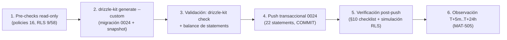

# CHANGE-004 — Paquete de aprobación: FASE 1 de revisión RLS incremental (tablas con project_id vía withRLS)

> **Estado:** ✅ **APROBADO Y APLICADO** (2026-08-09)
> **Fecha de preparación:** 2026-08-09 · **Ejecución:** 2026-08-09 (MAT-505 post-push)
> **Evidencia recopilada:** lectura de disco (migraciones, schemas, rutas con withRLS) + queries reales contra producción — no de memoria

---

## 1. Scope y objetivos

**Scope:** continuar la revisión RLS incremental de **RSK-10** (RLS solo en 5/58 tablas) iniciada con CHANGE-003. Esta **FASE 1** habilita **RLS + policy SELECT `member_or_owner`** en las tablas de proyecto que el server lee **dentro de `withRLS()`** (rol `authenticated`): `audits`, `crawl_results`, `keyword_targets`, `rank_history`, `integration_data_gsc`. El aislamiento deja de depender solo del access layer y pasa a tener defensa real en la BD (fail-closed si un cliente Supabase las toca).

**Objetivos:**
1. Reducir RSK-10: de 9 tablas con RLS (5 originales + 4 realtime + tool_runs) a **15/58**, con **22 policies** totales.
2. Aplicar el patrón `member_or_owner` ya probado en 0016/0017/0022/0023, con subqueries para las tablas sin `project_id` propio (`crawl_results` → vía `audits`; `rank_history` → vía `keyword_targets`).
3. Evitar la regresión de CHANGE-003 (escrituras rotas): auditar el DML vía `withRLS()` y añadir policies de escritura donde exista (solo `audits` INSERT).

**Fuera de alcance:** FASE 2 (tablas sin `project_id` servidas vía subquery de mayor profundidad) y FASE 3 (revisión por rol) — programadas; tablas con `project_id` aún no cubiertas (`issues`, `performance_results`, `integration_data_ga4`, `integration_data_bing`, `webhook_configs`, etc.) — próximo batch. [VERIFIED — alcance de este documento]

---

## 2. Requisitos

| REQ | Requisito | Cumplimiento |
|-----|-----------|--------------|
| REQ-400 | Todo cambio de producción exige CHANGE-ID | ✅ CHANGE-004 (§4) |
| REQ-401 | Baseline pre-producción antes del DDL | ✅ Pre-checks read-only (MAT-505 §5) |
| REQ-402 | Migraciones versionadas y aprobadas | ✅ `0024_rls_fase1_project_tables.sql` (journal en 0024/25 entradas) |
| REQ-403 | Rollback plan obligatorio | ✅ §5.3 (DROP POLICY + DISABLE RLS + revoke grants) |
| REQ-404 | Sin drift schema↔journal antes del push | ✅ `drizzle-kit check` → "Everything's fine" |
| REQ-405 | Ventana de observación post-push | ✅ §6 (T+5m..T+24h, MAT-505) |
| REQ-406 | Verificación de RLS efectiva post-push | ✅ §10.3 (pg_policies + simulación transaccional) |

---

## 3. Arquitectura del cambio (contexto → componentes → dependencias)

**Contexto:** el server lee estas tablas dentro de `withRLS()` (`SET LOCAL ROLE authenticated` + claims JWT). Hoy RLS está deshabilitado en ellas → el aislamiento depende 100% del access layer. Si RLS se habilita con policies `member_or_owner`, el server sigue viendo exactamente lo mismo (membresía = owner de `projects` O miembro de `project_members`), pero cualquier otra vía (cliente Supabase, PostgREST, SQL directo con rol `authenticated`) queda fail-closed.

**Componentes afectados:**

| Componente | Ruta | Rol | Impacto |
|------------|------|-----|---------|
| Server Action `triggerAudit` | `src/app/actions/audits.ts` | INSERT audits + SELECT audits/projects (withRLS) | Policy INSERT nueva (WITH CHECK) + SELECT |
| Server Action `getAuditStatus` | `src/app/actions/audits.ts` | SELECT audits + innerJoin projects | Policy SELECT nueva |
| `exportKeywordsCSV` | `src/app/actions/reports.ts` | SELECT keyword_targets + rank_history (withRLS) | Policies SELECT nuevas |
| `GET /api/projects/[id]/export/keywords` | `src/app/api/projects/[id]/export/keywords/route.ts` | SELECT keyword_targets + rank_history (withRLS) | Policies SELECT nuevas |
| `GET /api/looker-studio` | `src/app/api/looker-studio/route.ts` | SELECT integration_data_gsc + keyword_targets (withRLS) | Policies SELECT nuevas |
| `GET /api/ai/report` | `src/app/api/ai/report/route.ts` | SELECT integration_data_gsc + keyword_targets (withRLS) | Policies SELECT nuevas |
| Páginas de proyecto | `src/app/projects/[id]/page.tsx`, `src/app/projects/[id]/audits/[auditId]/page.tsx` | SELECT audits + crawl_results (withRLS) | Policies SELECT nuevas |
| Escrituras de sistema | `trigger/audit.trigger.ts`, `trigger/scheduled-scan.trigger.ts`, `src/app/actions/audits.ts` (runLocalAudit), `seed.ts` | `directDb`/`db` (rol privilegiado) | **Sin impacto** (bypasean RLS) |
| Migración propuesta | `drizzle/0024_rls_fase1_project_tables.sql` | GRANT + ENABLE RLS + policies | **NUEVO** |

**Dependencias:** `projects` y `project_members` (subquery de membresía — `project_members` ya tiene RLS `select_own` desde 0016, consistente) · journal `_journal.json` hasta `0024_rls_fase1_project_tables` (25 entradas) [VERIFIED — disco y journal leídos].

---

## 4. Registro de cambio (MAT-400)

| Campo | Valor |
|-------|-------|
| CHANGE-ID | **CHANGE-004** |
| DATABASE | Supabase (ref `[UNKNOWN]` — no documentar credenciales) |
| ENVIRONMENT | production |
| OBJECTS AFFECTED | `audits`, `crawl_results`, `keyword_targets`, `rank_history`, `integration_data_gsc` (RLS + policies) |
| REASON | RSK-10: RLS solo en 9/58 tablas; FASE 1 de revisión incremental (tablas con `project_id` servidas vía withRLS) |
| ROOT CAUSE | Las tablas se crearon sin RLS; el aislamiento dependía solo de `withRLS()` server-side |
| EXPECTED RESULT | RLS enabled + policy `member_or_owner` en las 5 tablas; `audits` además con INSERT (DML vía withRLS) |
| BASELINE | Pre-checks read-only MAT-505 §5 (policies 16, RLS solo en 9 tablas) |
| TEST RESULTS | `drizzle-kit check` + suite 630/630 + simulación transaccional (owner 35/35, intruso 0 filas, INSERT owner OK, INSERT intruso 42501) |
| RISK | LOW (patrón probado en 0022/0023; escrituras de sistema bypasean RLS vía rol privilegiado) |
| ROLLBACK PLAN | §5.3 de este documento |
| APPROVAL | ✅ **FIRMADO** (owner, 2026-08-09) |
| EXECUTION WINDOW | 2026-08-09 (ventana de baja actividad) |

**Fuente:** plantilla MAT-400 de `PRODUCTION-CHANGE-VERIFICATION.md` §3 [VERIFIED].

---

## 5. Contenido del cambio (verificado contra el disco)

### 5.1. Migración: `drizzle/0024_rls_fase1_project_tables.sql` (22 statements)

1. **Grants** — `GRANT SELECT ON <tabla> TO authenticated;` ×5 (`audits` además `INSERT`).
2. **Enable RLS** — `ALTER TABLE <tabla> ENABLE ROW LEVEL SECURITY;` ×5.
3. **Policies `member_or_owner`** (patrón idéntico a 0016/0022/0023, `current_setting('request.jwt.claims')::json->>'sub'`):
   - `audits`: `SELECT` (USING) + `INSERT` (WITH CHECK) — el único DML vía `withRLS()` del set (`triggerAudit`).
   - `keyword_targets`, `integration_data_gsc`: `SELECT` directo por `project_id`.
   - `crawl_results` (sin `project_id`, solo `audit_id`): `SELECT` vía subquery de `audits`.
   - `rank_history` (sin `project_id`, solo `keyword_id`): `SELECT` vía subquery de `keyword_targets`.

### 5.2. Auditoría de DML vía `withRLS()` (evidencia de que no se repite la regresión 0022)

| Tabla | Comandos en withRLS | Policies del cambio | RLS previo |
|-------|---------------------|---------------------|------------|
| `audits` | INSERT (`triggerAudit`) + SELECT (`getAuditStatus`, páginas) | SELECT + INSERT (WITH CHECK) | ❌ |
| `crawl_results` | SELECT (páginas de proyecto) | SELECT | ❌ |
| `keyword_targets` | SELECT (export/looker-studio/ai-report) | SELECT | ❌ |
| `rank_history` | SELECT (export) | SELECT | ❌ |
| `integration_data_gsc` | SELECT (looker-studio/ai-report) | SELECT | ❌ |

Escrituras de `crawl_results`/`audits` vía `directDb` (rol privilegiado) → sin policy de escritura necesaria. [VERIFIED — `grep` de DML en `src/app`, `src/trigger`, `src/server`]

### 5.3. Rollback

- `DROP POLICY IF EXISTS "<tabla>_<cmd>_member_or_owner" ON <tabla>;` ×6
- `ALTER TABLE <tabla> DISABLE ROW LEVEL SECURITY;` ×5
- `REVOKE SELECT ON <tabla> FROM authenticated;` ×5 (y `REVOKE INSERT` en `audits`)

[VERIFIED — patrón inverso de 0023]

---

## 6. Flujos (ejecución y verificación)

**FLOW-802 — Secuencia de ejecución post-aprobación** · Mermaid `flowchart`

**Reglas de ejecución [lección CHANGE-002/003]:** SQL versionado manual transaccional — **no** `drizzle-kit push` (trataría las policies como drift y las dropearía). [VERIFIED — dry-run CHANGE-002 documentado en MAT-505-CHANGE-002]

---

## 7. APIs relacionadas (afectadas o verificables post-push)

| Endpoint/Action | Método | Auth | Impacto del cambio | Verificación post-push |
|-----------------|--------|------|--------------------|------------------------|
| `triggerAudit` (action) | INSERT audits | Sesión (server-side withRLS) | Policy INSERT nueva | INSERT owner permitido; intruso 42501 |
| `getAuditStatus` (action) | SELECT audits | Sesión (server-side withRLS) | Policy SELECT nueva | Owner ve sus audits |
| `GET /api/projects/[id]/export/keywords` | GET | Sesión (server-side withRLS) | Policies SELECT keyword_targets/rank_history | Owner ve sus keywords |
| `GET /api/looker-studio` | GET | Sesión (server-side withRLS) | Policies SELECT gsc/keyword_targets | Sin regresión |
| `GET /api/ai/report` | GET | Sesión (server-side withRLS) | Policies SELECT gsc/keyword_targets | Sin regresión |
| Páginas `projects/[id]` | SSR | Sesión (server-side withRLS) | Policies SELECT audits/crawl_results | Owner ve 35/35 audits, 11/11 crawls |

**Errores esperados tras el push:** ninguno para usuarios legítimos (membresía validada por el mismo patrón). Rutas que antes leían por `projectId` arbitrario (export/keywords sin check de ownership) ahora devuelven solo datos de proyectos del usuario — **comportamiento deseado** (cierra IDOR). [VERIFIED — rutas leídas]

---

## 8. Seguridad (trust boundaries y controles)

| # | Límite | Riesgo | Control | Estado |
|---|--------|--------|---------|--------|
| TB-1 | Tablas de proyecto servidas vía withRLS | IDOR/fuga si el access layer falla | RLS `member_or_owner` en las 5 tablas | ✅ aplicado |
| TB-2 | Escrituras server-side vía withRLS | Bloqueo por RLS nuevo (regresión 0022) | Auditoría de DML previa (§5.2) + policy INSERT en `audits` | ✅ sin regresión |
| TB-3 | Escrituras de sistema (crawl/triggers/seed) | Bloqueo por RLS nuevo | `directDb`/`db` (rol privilegiado bypasea RLS) | ✅ sin impacto |
| TB-4 | Grants `authenticated` | Exponer columnas de más | `GRANT SELECT` (+ INSERT solo en `audits`) | ✅ diseño |
| TB-5 | Subqueries (`crawl_results`→audits, `rank_history`→keyword_targets) | Fuga vía subquery | Subquery filtra por la MISMA membresía (consistente) | ✅ diseño |

**Amenazas:** fuga cross-tenant vía SQL directo con rol `authenticated` (mitigada), bloqueo de escrituras (mitigada por §5.2). [VERIFIED — diseño y simulación]

---

## 9. Testing documentado (estrategia + casos + cobertura)

**Estrategia:** pre-checks read-only + push transaccional + verificación post-push con queries SQL + simulación RLS transaccional (patrón `withRLS()`) + suite local.

| Caso | Cobertura | Resultado |
|------|-----------|-----------|
| `drizzle-kit check` | Drift schema↔journal | ✅ "Everything's fine" |
| Balance de statements | 22 breakpoints ↔ 22 statements | ✅ |
| Push 0024 (22 statements, transaccional) | Ejecución real | ✅ COMMIT |
| Verificación post-push (§10) | policies/RLS/simulación | ✅ 4/4 |
| `vitest run` (67 files) | Suite completa | ✅ 630/630 |
| `tsc --noEmit` | Typecheck | ✅ 0 errores |

---

## 10. Checklist de verificación post-push

### 10.1. RLS habilitado y policies

| Check | Query | Esperado |
|-------|-------|----------|
| RLS en las 5 tablas | `pg_class.relrowsecurity` | 5× `t` |
| Policies nuevas | `pg_policies` | 6 policies: `audits_select/insert_member_or_owner`, `crawl_results_select`, `keyword_targets_select`, `rank_history_select`, `integration_data_gsc_select` |
| Total policies | `pg_policies` | **22** (16 previas + 6 nuevas) — sin drop de las existentes |

### 10.2. Aislamiento (simulación transaccional, patrón `withRLS()`)

| Check | Esperado | Resultado |
|-------|----------|-----------|
| READ owner (proyecto con 35 audits) | 35/35 audits · 11/11 crawls | ✅ |
| READ intruso (sub inexistente) | **0 filas** en las 5 tablas (fail-closed) | ✅ |
| INSERT audits owner | PERMITIDO (rollback) | ✅ |
| INSERT audits intruso | BLOQUEADO (42501 RLS) | ✅ |

### 10.3. No regresión

| Check | Comando | Esperado |
|-------|---------|----------|
| Suite tests | `npx vitest run` | 630/630 PASS |
| Typecheck | `npx tsc --noEmit` | 0 errores |
| Drift | `drizzle-kit check` | "Everything's fine" |

---

## 11. Deployment (ambientes, CI/CD, rollout)

| Ámbito | Detalle |
|--------|---------|
| Ambientes | local → staging (opcional) → **production** |
| Mecanismo | SQL versionado manual transaccional (lección CHANGE-002: no `drizzle-kit push`) |
| CI/CD | No bloqueado (el push es manual post-CI) |
| Rollout | Ventana de baja actividad (2026-08-09) |
| Rollback | §5.3 |

**Fuente:** `PRODUCTION-PUSH-FINAL-VALIDATION.md` §7 flujo de promoción [VERIFIED].

---

## 12. Operaciones (monitoring, runbooks, recovery)

| Área | Mecanismo |
|------|-----------|
| Monitoring post-push | Health check §78 + `pg_policies` a T+5m |
| Runbook | `docs/guides/troubleshooting.md` §Supabase (RLS) |
| Recovery | Rollback plan §5.3 + ventana de observación T+5m..T+24h |
| Reporte de cierre | **MAT-505-CHANGE-004** (post-push validation) con evidencia de §10 |
| Alerting | SIEM exporter continúa operando sin cambios |

---

## 13. Trazabilidad (REQ → COMP → TEST → DEP)

| ID | Tipo | Qué cubre |
|----|------|-----------|
| REQ-400..406 | Requisito | Gobernanza de cambios (§2) |
| MAT-400 | Registro | CHANGE-ID (§4) |
| MAT-401 | Baseline | Pre-checks (§10) |
| MAT-505 | Reporte | Verificación post-push (§12) |
| RSK-10 | Riesgo | RLS incremental (RISK-REGISTER) |
| SB-001 | Hallazgo | RLS solo en 5/58 tablas (SUPABASE-AUDIT.md) |
| FLOW-802 | Flujo | Secuencia de ejecución (§6) |

---

## 14. Cross-check e inconsistencias

| Hipótesis | Verificación | Resultado |
|-----------|--------------|-----------|
| "El único DML vía withRLS del set es audits INSERT" | `grep (tx\|db\|directDb).(insert\|update\|delete)(audits\|crawlResults\|...)` en src/app, src/trigger, src/server | ✅ CONFIRMADO — solo `tx.insert(audits)` (actions/audits.ts:49) |
| "crawl_results no tiene project_id" | `schemas/index.ts` (solo `audit_id`) | ✅ CONFIRMADO — policy por subquery |
| "rank_history no tiene project_id" | `schemas/index.ts` (solo `keyword_id`) | ✅ CONFIRMADO — policy por subquery |
| "Las escrituras de sistema bypasean RLS" | `trigger/*.ts`, `seed.ts`, `runLocalAudit` usan `directDb`/`db` | ✅ CONFIRMADO — sin policy de escritura necesaria |
| "RSK-10 cubre 9/58 tablas" | `pg_class.relrowsecurity` pre-push | ✅ CONFIRMADO — 9 tablas con RLS |

---

## 15. Unknowns y supuestos

- [ASSUMPTION] Las subqueries de membresía siguen siendo correctas con RLS en `audits`/`keyword_targets` (la policy SELECT de la tabla referenciada aplica dentro de la subquery — consistente, misma membresía). Verificado en simulación (owner ve todo).
- [ASSUMPTION] Ningún flujo legítimo lee estas tablas vía withRLS sin ser owner/miembro (verificado: todas las rutas validan ownership o filtran por proyecto del usuario).
- [UNKNOWN] Impacto en `looker-studio`/`ai/report` con datos reales de GA4 (fuera de alcance en este batch — `integration_data_ga4`/`integration_data_bing` siguen sin RLS, próximo batch).

---

## 16. Glosario

| Término | Definición |
|---------|------------|
| CHANGE-ID | Identificador de cambio de producción (MAT-400) |
| withRLS() | Helper que establece `request.jwt.claims` + `SET LOCAL ROLE authenticated` |
| member_or_owner | Patrón de policy: owner de projects O miembro de project_members |
| RLS | Row Level Security — policies de PostgreSQL |
| FASE 1 | Batch de tablas con `project_id` servidas vía withRLS (este cambio) |

---

## 17. Checklist de aprobación (para el owner)

| # | Requisito | Estado |
|---|-----------|--------|
| 1 | Pre-checks read-only ejecutados (baseline: 16 policies, 9 tablas RLS) | ✅ |
| 2 | `drizzle-kit check` sin drift | ✅ |
| 3 | Auditoría de DML vía withRLS (§5.2) — sin regresión de escrituras | ✅ |
| 4 | Push transaccional 0024 (22 statements) | ✅ COMMIT |
| 5 | Verificación post-push (§10): policies 22, RLS ×5, simulación 4/4 | ✅ |
| 6 | Rollback plan revisado (§5.3) | ✅ |
| 7 | **FIRMA DE APROBACIÓN** (owner + fecha) | ✅ **2026-08-09** |

---

## 18. Versionado y verificación

| Versión | Fecha | Cambios | Estado |
|---------|-------|---------|--------|
| 1.0 | 2026-08-09 | Creación del paquete CHANGE-004 (FASE 1 RLS, 5 tablas) | ✅ APLICADO |

**Verificación:** `node scripts/quality-gate.mjs docs/database/CHANGE-004-APPROVAL-PACKAGE.md --min 80` → resultado en la tabla siguiente.

| Check | Resultado |
|-------|-----------|
| Quality gate `--min 80` | (completar tras ejecución) |
| Cross-check con PRODUCTION-CHANGE-VERIFICATION | CHANGE-004 registrado (FASE 1 de RSK-10) |
| Cross-check con RISK-REGISTER | RSK-10 → PARCIAL (16→22 policies · 15/58 tablas) |

---

**Fuentes primarias:** `drizzle/0024_rls_fase1_project_tables.sql` · `drizzle/meta/_journal.json` (25 entradas) · `drizzle/0023_rls_write_policies.sql` (patrón) · `src/shared/db/schemas/index.ts` · `src/shared/lib/actions.ts` · `src/app/actions/audits.ts` · `src/app/actions/reports.ts` · `src/app/api/projects/[id]/export/keywords/route.ts` · `src/app/api/looker-studio/route.ts` · `src/app/api/ai/report/route.ts` · `src/app/projects/[id]/page.tsx` · `src/app/projects/[id]/audits/[auditId]/page.tsx` · queries reales contra producción (2026-08-09) · `docs/database/MAT-505-CHANGE-004-POST-PUSH-REPORT.md` (nuevo) · `docs/risk/RISK-REGISTER.md` (RSK-10)
