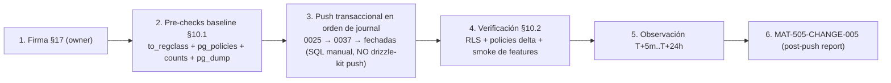

# CHANGE-005 — Paquete de aprobación: promoción del batch de migraciones pendientes `0025`…`2026-09-27` (19 ficheros)

> **Estado:** ⏳ **PENDIENTE DE APROBACIÓN** [PROPOSED — NO desplegado]
> **Fecha de preparación:** 2026-10-01 · **Ejecución:** NO PROGRAMADA (requiere firma §17 + pre-checks §10.1)
> **Evidencia recopilada:** lectura de disco (19 ficheros + `drizzle/meta/_journal.json`, 44 entradas) + `drizzle-kit check` (2026-10-01) — no de memoria

---

## 1. Scope y objetivos

**Scope:** promover las **19 migraciones** escritas tras CHANGE-004 (2026-08-09 … 2026-09-27) que están en el repo y en el journal de Drizzle **sin CHANGE-ID ni push documentado**. Este paquete las gobierna bajo un único registro MAT-400 (CHANGE-005), agrupadas por naturaleza y riesgo.

**Objetivos:**
1. Cerrar el hueco de gobernanza detectado en MAT-500 §11.1: todo DDL/DML de producción con CHANGE-ID, baseline, rollback y verificación.
2. Clasificar las 19 migraciones en 3 grupos con riesgo y rollback propios (§5).
3. Dejar preparados los pre-checks (baseline real en producción) para que la firma §17 sea informada.

**Grupos (por naturaleza y riesgo):**

| Grupo | Ficheros | Contenido | Riesgo |
|-------|----------|-----------|--------|
| **A — RLS / seguridad** | `0025`, `0027` | defense-in-depth RLS en tablas core + bootstrap de tablas drift + RLS fase 2 (48 tablas ENABLE, ~55 policies) | **MEDIUM-HIGH** |
| **B — DDL aditivo** | `0026`, `0028–0032`, `0034–0037`, `2026-09-24`, `2026-09-27` (11) | tablas/columnas/índices nuevos + policies `member_*` + seed idempotente de catálogo | **LOW** |
| **C — Datos / backfills / fechadas** | `0030`, `0033`, `2026-08-25 ×3`, `2026-08-26` (6) | backfills UPDATE/INSERT, CHECKs, DROP NOT NULL, política admin y migraciones fechadas ya aplicadas a mano en prod | **MEDIUM** |

**Fuera de alcance:** la ejecución en sí (pendiente de firma §17), la verificación post-push (se documentará en `MAT-505-CHANGE-005-POST-PUSH-REPORT.md`, a crear) y cualquier migración futura (`0038+`).

---

## 2. Requisitos

| REQ | Requisito | Cumplimiento |
|-----|-----------|--------------|
| REQ-400 | Todo cambio de producción exige CHANGE-ID | ✅ CHANGE-005 (§4) |
| REQ-401 | Baseline pre-producción antes del DDL | ⏳ §10.1 (pre-checks, pendientes de ejecución con la firma) |
| REQ-402 | Migraciones versionadas y aprobadas | ✅ journal con **44 entradas** (idx 0–43; las 19 pendientes son idx 25–43) [VERIFIED — disco] |
| REQ-403 | Rollback plan obligatorio | ✅ §5.4 (por grupo) |
| REQ-404 | Sin drift schema↔journal antes del push | ✅ `drizzle-kit check` → "Everything's fine" (2026-10-01) |
| REQ-405 | Ventana de observación post-push | ✅ §6 (T+5m..T+24h) |
| REQ-406 | Verificación de RLS efectiva post-push | ⏳ §10 (queries + recuento pg_policies) |

---

## 3. Arquitectura del cambio (contexto → componentes → dependencias)

**Contexto:** tras la auditoría de 2026-08 (drift, RSK-10) se escribieron 19 migraciones para cerrar RLS fase 2, bootstraps de tablas que existían out-of-band y las features de los sprints posteriores. Se aplicaron parcialmente a mano (las 4 fechadas 2026-08-25/26, según cabecera de `0033`) o quedaron sin promover (resto [UNKNOWN]); ninguna atravesó el pipeline de cambio.

**Dependencias internas (orden del journal obligatorio):**
- `0025` crea las funciones `current_auth_uid()`, `user_has_project_access()`, `current_user_is_platform_admin()` (SECURITY DEFINER) y las tablas drift → **requisito previo de** `0027` y `0033`.
- `0026` crea `ai_usage` → la habilita RLS `0027` (idx 26 < 27 ✔) y la enriquece `0034`.
- `0033` (parity) referencia las 4 migraciones fechadas; éstas ya corrieron en prod (idx 38–41 en journal).
- **Orden de replay desde cero:** la cabecera de `0025` advierte «aplicar ANTES de la serie completa» (0016/0019 referencian las tablas drift). Además `0027` (idx 27) habilita RLS en `mitre_evaluations`/`adversary_assessments`, que solo se crean en las fechadas (idx 39/40) → en vivo existen; en replay desde cero hay que respetar el orden real de aplicación (§14.1).

---

## 4. Registro de cambio (MAT-400)

| Campo | Valor |
|-------|-------|
| CHANGE-ID | **CHANGE-005** (batch de 19 migraciones, grupos A/B/C) |
| DATABASE | Supabase (ref `[UNKNOWN]` — no documentar credenciales) |
| ENVIRONMENT | production |
| OBJECTS AFFECTED | A: 48 tablas ENABLE RLS + 3 functions + 4 tablas drift · B: 8 tablas nuevas + 4 columnas + ~10 índices · C: seed `subscription_plans` + backfills `projects`/`user_logs` + CHECKs + `intelligence_findings.investigation_id` |
| REASON | Migraciones escritas 2026-08-09…09-27 sin CHANGE-ID ni push documentado (hallazgo MAT-500 §11.1) |
| ROOT CAUSE | Desarrollo post-CHANGE-004 sin pasar por el pipeline de promoción (regla MODE C) |
| EXPECTED RESULT | RLS defense-in-depth completo (RSK-10 → 69/69 tablas protegidas en código), features de sprints disponibles en prod, paridad de instalación nueva |
| BASELINE | ⏳ pre-checks §10.1 (`to_regclass`, `pg_policies`, `pg_class.relrowsecurity`, counts) + `pg_dump --schema-only` |
| TEST RESULTS | `drizzle-kit check` ✅ (2026-10-01) · suite local sin cambios de código (docs/paquete únicamente) |
| RISK | **MEDIUM-HIGH** (grupo A: precedente de regresión 0022; grupos B/C LOW/MEDIUM) |
| ROLLBACK PLAN | §5.4 (por grupo) |
| APPROVAL | ⏳ **PENDIENTE — firma del owner en §17** |
| EXECUTION WINDOW | NO PROGRAMADA (ventana de baja actividad tras la firma) |

**Fuente:** plantilla MAT-400 de `PRODUCTION-CHANGE-VERIFICATION.md` §3 [VERIFIED].

---

## 5. Contenido del cambio (verificado contra el disco)

### 5.1. Grupo A — RLS / seguridad (MEDIUM-HIGH)

#### `drizzle/0025_rls_core_defense_in_depth.sql` (306 líneas)

1. **Enum `project_role`** + tablas drift idempotentes (`CREATE TABLE IF NOT EXISTS`): `project_members`, `project_invitations`, `team_audit_logs`, `domain_technologies` con sus UNIQUE/FK/índices (ya existen en prod → no-op).
2. **3 funciones SECURITY DEFINER:** `current_auth_uid()`, `user_has_project_access()` (rompe la recursión policies↔projects detectada en E2E post-RLS), `current_user_is_platform_admin()`.
3. **RLS en 4 tablas core** (sin GRANT nuevo → fail-closed hasta que exista grant): `projects` (SELECT member + INSERT/UPDATE/DELETE owner), `users` (SELECT self), `developer_api_keys` (SELECT/UPDATE/INSERT own), `audit_logs` (SELECT self-or-admin) → **9 policies**.

#### `drizzle/0027_rls_fase2.sql` (214 líneas)

1. **Grants amplios** a `authenticated` (35 tablas) + `push_subscriptions` (DML) y `web_vitals_logs` (INSERT) a `anon` preservando el alta anónima; catálogos solo SELECT.
2. **`ENABLE ROW LEVEL SECURITY` en 44 tablas** (integraciones, issues, competitors, backlinks, A/B, heatmaps, reports, monitoring, webhooks, dns/whois, plugins, adversary/mitre, intelligence_usage_events, web_vitals, internal_links, performance_results, subscriptions, catálogos y logs admin).
3. **~46 policies:** 31 en bucle `DO` con `member_or_owner` vía `user_has_project_access(project_id)` (guard `EXCEPTION` → las tablas sin `project_id` se omiten con `RAISE NOTICE`, p.ej. `integration_sync_logs`), 4 hijas por subquery (`internal_links`, `performance_results`, `mitre_technique_results`, `adversary_vulnerabilities`), 3 propias/anónimas (`push_subscriptions` owner + anon INSERT, `web_vitals_logs` anon INSERT), 4 catálogos read y 4 admin-only (`security_audit_logs`, `siem_alert_logs`, `ai_health_logs`, `ai_usage`).

### 5.2. Grupo B — DDL aditivo (LOW, 11 ficheros)

| Fichero | Statements (recuento de disco) |
|---------|--------------------------------|
| `0026_ai_usage` | CREATE TABLE `ai_usage` + índice (presupuesto IA por usuario) |
| `0028_beacon_secret` | ALTER `projects` ADD `beacon_secret` (anti DB-bloat RUM) |
| `0029_ai_report_jobs` | CREATE TABLE + índice + GRANT + policy `ai_report_jobs_member_access` |
| `0031_forecasts` | CREATE TABLE + índices + GRANT + policy `forecasts_member_access` |
| `0032_remediation_actions` | CREATE TABLE + índice + GRANT + policy `remediation_actions_member_access` |
| `0034_ai_cost_and_prompt_version` | ALTER `ai_usage` (coste + versión de prompt) + índice |
| `0035_finding_ai_triage` | ALTER `intelligence_findings` (triage IA) + índice |
| `0036_exec_briefs` | CREATE TABLE `exec_briefs` + índices únicos |
| `0037_ai_eval_results` | CREATE TABLE `ai_eval_results` + índice |
| `2026-09-24_recommended_indexes` | `create index if not exists idx_audit_logs_created_at` — **SIN CONCURRENTLY** (seguro en transacción; la convención está documentada en su cabecera) |
| `2026-09-27_pdf_progress` | CREATE TABLE `pdf_progress` + índice + RLS + GRANT + policy `pdf_progress_owner` + `DELETE` de huérfanas > 1 día (higiene, sustituye claves Redis VULN-007) |

Todo con `IF NOT EXISTS` → idempotente y seguro sobre prod.

### 5.3. Grupo C — Datos / backfills / migraciones fechadas (MEDIUM, 6 ficheros)

| Fichero | DML / mutaciones (recuento de disco) |
|---------|--------------------------------------|
| `0030_billing_plans` | **INSERT seed** 4 planes (free/pro/business/enterprise) con `WHERE NOT EXISTS` + policy `subscription_plans_public_read` (anon, /pricing) |
| `0033_dated_parity` | UNIQUE `user_logs(user_id)` + RLS `user_logs` + policy admin (email+role) + 3 columnas `projects` + **UPDATE backfill** `is_deleted` + **INSERT backfill** `user_logs` desde `users` (`ON CONFLICT DO NOTHING`) + 4 CHECKs + `intelligence_findings.investigation_id` **DROP NOT NULL** |
| `2026-08-25_admin_telemetry` | CREATE TABLE `user_logs` + 2 índices + RLS/policy + columnas `projects` + UPDATE/INSERT backfill (idempotentes) |
| `2026-08-25_adversary_real` | Columna `projects.active_testing_authorized` + CREATE TABLE `adversary_assessments`/`adversary_vulnerabilities` + 3 índices + DROP NOT NULL |
| `2026-08-25_mitre_real` | CREATE TABLE `mitre_evaluations` + índice |
| `2026-08-26_assessment_progress` | 3× ALTER ADD COLUMN `current_step`/`checks_done`/`checks_total` (adversary_assessments, mitre_evaluations) |

**Estado documentado:** la cabecera de `0033` declara que **las 4 migraciones fechadas «se aplicaron a mano en producción»** y que `0033` es no-op allí (solo aporta paridad a instalaciones nuevas). Verificación con query pre-push (§10.1).

### 5.4. Rollback (por grupo)

- **Grupo A:** `DROP POLICY IF EXISTS` de las 9 (0025) y de las 46 (0027) por su nombre; `ALTER TABLE … DISABLE ROW LEVEL SECURITY` en las 48 tablas; no dropear las tablas drift ni las funciones (las usa el código). Inverso patrón de `0023`/`0024` [VERIFIED].
- **Grupo B:** `DROP TABLE IF EXISTS` de las tablas nuevas, `DROP COLUMN` (`beacon_secret`, etc.), `DROP INDEX IF EXISTS`, `DROP POLICY` de las 4 member/owner. El `DELETE` de `pdf_progress` solo afecta huérfanas > 1 día (no reversible, sin impacto).
- **Grupo C:** `DELETE FROM subscription_plans WHERE name IN ('free','pro','business','enterprise')` solo si el seed fue el origen de las filas; revert del backfill `is_deleted` requiere revisión manual de filas afectadas [ASSUMPTION]; `DROP CONSTRAINT` de los CHECKs; `ALTER COLUMN investigation_id SET NOT NULL` puede fallar si existen hallazgos sin investigación [UNKNOWN]; **no revertir** las columnas de `projects`/tablas fechadas (las usa la app).

---

## 6. Flujos (ejecución y verificación)

**FLOW-803 — Secuencia de ejecución post-aprobación** · Mermaid `flowchart`

**Reglas de ejecución [lección CHANGE-002/004]:** SQL versionado manual transaccional — **no** `drizzle-kit push` (trataría policies como drift). Las 46 policies del bucle de `0027` requieren **recuento obligatorio post-push** (el guard `EXCEPTION` omite fallos con `RAISE NOTICE`).

---

## 7. APIs relacionadas (afectadas o verificables post-push)

| Superficie | Migración | Impacto esperado |
|------------|-----------|------------------|
| Todas las rutas con `withRLS()` + PostgREST | 0025/0027 (Grupo A) | Aislamiento explícito; regresión potencial si falta una policy (precedente 0022) |
| `/pricing` + modal upgrade | 0030 | Lee los 4 planes seed |
| SSE de progreso de PDF | 2026-09-27 | Sustituye Redis (VULN-007) — smoke tras push |
| Presupuesto IA / copilot | 0026/0034 | `ai_usage` con coste y versión de prompt |
| Informes SEO diferidos | 0029 | `ai_report_jobs` |
| Forecasts / remediación / briefs / eval | 0031/0032/0036/0037 | tablas nuevas de sprints IA |
| `compliance/soc2-pack` (rangos `created_at`) | 2026-09-24 | índice `idx_audit_logs_created_at` |
| Admin panel (user_logs) | 0033/fechadas | policy admin + upsert de telemetría |

---

## 8. Seguridad (trust boundaries y controles)

| # | Límite | Riesgo | Control | Estado |
|---|--------|--------|---------|--------|
| TB-1 | Habilitar RLS en 48 tablas (A) | Regresión de escrituras (precedente CHANGE-002/0022) | Grants amplios primero, policies después; verificación post-push de DML | ⏳ §10 |
| TB-2 | Bucle `DO` con guard de `0027` | Policies omitidas silenciosamente (`RAISE NOTICE`) | Recuento `pg_policies` contra el esperado (~46 declaradas) | ⏳ §10.2 |
| TB-3 | Grants a `authenticated`/`anon` | Exposición cross-tenant si policy falla | Patrón member_or_owner ya probado (0016–0024); anon solo en push/web_vitals/pricing | ✅ diseño |
| TB-4 | Policy admin con email hardcodeado (`user_logs`) | Depende de `role='admin'` + email del owner | Mantenido de las fechadas (ya en prod); revisión futura | ✅ documentado (0033) |
| TB-5 | `SECURITY DEFINER` en funciones 0025 | Privilegio elevado si se explota | `SET search_path = public` + sin parámetros de entrada arbitrarios | ✅ diseño |

---

## 9. Testing documentado (estrategia + casos + cobertura)

| Caso | Cobertura | Resultado |
|------|-----------|-----------|
| `drizzle-kit check` | Drift schema↔journal (44 entradas) | ✅ "Everything's fine" (2026-10-01) |
| Recuento de statements por fichero | Inventario §5 desde disco | ✅ 19/19 ficheros analizados |
| `vitest run` | Suite completa (no se toca código en este cambio) | ✅ 1.923/1.923 en HEAD (última ejecución 2026-10-01) |
| `tsc --noEmit` / eslint / i18n | Sin cambios en src | ✅ 0 / 0 / 642-642 (HEAD) |
| Pre-checks y verificación post-push | §10 | ⏳ pendientes de la firma |

---

## 10. Checklist de verificación

### 10.1. Pre-checks baseline (ANTES del push, con la firma)

| Check | Query / comando | Esperado |
|-------|-----------------|----------|
| Presencia real en prod | `SELECT to_regclass('public.<tabla>')` para las 19 objs de §5 | registro del estado [UNKNOWN] → resolved |
| Fechadas aplicadas | `to_regclass` de `user_logs`, `adversary_assessments`, `mitre_evaluations` | existentes (cabecera `0033`) |
| Baseline policies | `SELECT count(*) FROM pg_policies` | número previo al delta |
| Baseline RLS | `SELECT count(*) FROM pg_class WHERE relrowsecurity` | ~22–50 tablas (registrar) |
| Seeds | `SELECT count(*) FROM subscription_plans` | registrar (¿4 ya?) |
| Snapshot | `pg_dump --schema-only` | fichero guardado |

### 10.2. Verificación post-push

| Check | Esperado |
|-------|----------|
| `pg_class.relrowsecurity` | +48 tablas (A) + `user_logs` + `pdf_progress` |
| `pg_policies` delta | ≈ +55 declaradas (9 + 46) + 6 de tablas nuevas/seed, **menos** las omitidas por el guard (registrar real) |
| Tablas nuevas | `to_regclass` de `ai_usage`, `ai_report_jobs`, `forecasts`, `remediation_actions`, `exec_briefs`, `ai_eval_results`, `pdf_progress` |
| Seed | 4 planes en `subscription_plans` |
| Smoke features | /pricing, SSE PDF, presupuesto IA, admin user_logs |
| No regresión DML | smoke de `triggerAudit`/exports (patrón CHANGE-002/004) |
| `drizzle-kit check` | sigue "Everything's fine" |

---

## 11. Deployment (ambientes, CI/CD, rollout)

| Ámbito | Detalle |
|--------|---------|
| Mecanismo | SQL manual transaccional **en orden de journal** (lección CHANGE-002: no `drizzle-kit push`) |
| Ambientes | local → producción (staging opcional) |
| CI/CD | No bloqueado (push manual post-firma) |
| Rollout | Ventana de baja actividad tras firma §17 |
| Rollback | §5.4 por grupo |

**Fuente:** `PRODUCTION-PUSH-FINAL-VALIDATION.md` §7 [VERIFIED].

---

## 12. Operaciones (monitoring, runbooks, recovery)

| Área | Mecanismo |
|------|-----------|
| Monitoring post-push | §84.7 schema verification + locks/errores/42501 (T+5m..T+24h) |
| Runbook | `docs/guides/troubleshooting.md` §Supabase (RLS) |
| Recovery | Rollback §5.4 + ventana de observación |
| Reporte de cierre | **MAT-505-CHANGE-005** (a crear) con evidencia de §10 |
| Alerting | SIEM/uptime exporter sin cambios |

---

## 13. Trazabilidad (REQ → COMP → TEST → DEP)

| ID | Tipo | Qué cubre |
|----|------|-----------|
| REQ-400..406 | Requisito | Gobernanza de cambios (§2) |
| MAT-400 | Registro | CHANGE-ID (§4) |
| MAT-501/502 | Baseline | Pre-checks / schema verification (§10.1/§10.2) |
| MAT-505 | Reporte | Verificación post-push (§12) |
| MAT-500 | Gate | Hallazgo 16.2 que abre este cambio (§11.1) |
| RSK-10 | Riesgo | RLS incremental (RISK-REGISTER) |
| FLOW-803 | Flujo | Secuencia de ejecución (§6) |

---

## 14. Cross-check e inconsistencias

| Hipótesis | Verificación | Resultado |
|-----------|--------------|-----------|
| «El journal registra las 4 fechadas» | `_journal.json` idx 38–41 | ✅ CONFIRMADO (se añadieron tras su aplicación manual) |
| «Las fechadas ya están aplicadas en prod» | Cabecera de `0033` («se aplicaron a mano en producción») | ⚠️ [DECLARADO EN DISCO] — confirmar con `to_regclass` en §10.1 |
| «`0027` es replay-safe desde cero» | `0027` idx 27 habilita RLS en tablas creadas en idx 39/40 | ⚠️ NO desde cero; sí en vivo (tablas existen) — documentado en §3 |
| «El índice de 2026-09-24 usa CONCURRENTLY» | Cabecera + statement | ✅ NO — sin CONCURRENTLY (seguro en transacción) |
| «El seed de 0030 es idempotente» | `WHERE NOT EXISTS` ×4 | ✅ CONFIRMADO |
| «0025 no añade grants» | Lectura íntegra (solo comentarios mencionan grants) | ✅ CONFIRMADO — fail-closed hasta grant posterior |

---

## 15. Unknowns y supuestos

- [UNKNOWN] Estado real en producción de `0025`…`2026-09-27` (¿aplicados parcialmente?) → se resuelve en §10.1 antes de cualquier push.
- [ASSUMPTION] Las 4 fechadas son no-op al re-ejecutarlas (idempotentes: `IF NOT EXISTS`, `ON CONFLICT DO NOTHING`, `UPDATE` condicionado).
- [UNKNOWN] Cuántas policies del bucle de `0027` se omitirán realmente (guard `EXCEPTION`) → recuento post-push.
- [ASSUMPTION] Reversión del backfill `is_deleted` manual si hiciera falta (no automático).
- Backup/PITR: ✅ confirmado por el owner (2026-10-01) — cerrado en MAT-500 check 13.

---

## 16. Glosario

| Término | Definición |
|---------|------------|
| CHANGE-ID | Identificador de cambio de producción (MAT-400) |
| Grupo A/B/C | Clasificación de este batch: RLS / DDL aditivo / datos-fechadas |
| member_or_owner | Patrón de policy: owner de projects O miembro de project_members |
| Drift | Diferencia schema↔journal o BD↔migraciones |
| Fechadas | Migraciones con prefijo de fecha (`2026-…`) aplicadas originalmente a mano |

---

## 17. Checklist de aprobación (para el owner)

| # | Requisito | Estado |
|---|-----------|--------|
| 1 | Inventario de 19 migraciones verificado contra disco (§5) | ✅ |
| 2 | `drizzle-kit check` sin drift (44 entradas) | ✅ |
| 3 | Grupos y riesgos definidos con rollback por grupo (§5.4) | ✅ |
| 4 | Pre-checks baseline ejecutados (§10.1) | ⏳ pendiente |
| 5 | Ventana de rollout y plan de rollback revisados (§6/§11) | ⏳ pendiente |
| 6 | Backup/PITR confirmado | ✅ 2026-10-01 |
| 7 | **FIRMA DE APROBACIÓN** (owner + fecha) | ⏳ **PENDIENTE** |

---

## 18. Versionado y verificación

| Versión | Fecha | Cambios | Estado |
|---------|-------|---------|--------|
| 1.0 | 2026-10-01 | Creación del paquete CHANGE-005 (batch 19 migraciones 0025…2026-09-27) | ⏳ PENDIENTE APROBACIÓN |

| Check | Resultado |
|-------|-----------|
| Quality gate `--min 80` | ✅ **95/100 PASS** (2026-10-01) |
| Cross-check con PRODUCTION-CHANGE-VERIFICATION | CHANGE-005 registrado (§1, fila ⏳ PENDIENTE DE APROBACIÓN) |
| Cross-check con MAT-500 | §11.1/§17 actualizados: gate 16/16 + pendiente CHANGE-005 |
| Cross-check con RISK-REGISTER | RSK-10 → cubierto por Grupo A al ejecutarse |

---

**Fuentes primarias:** `drizzle/0025_rls_core_defense_in_depth.sql` · `drizzle/0027_rls_fase2.sql` · `drizzle/0030_billing_plans.sql` · `drizzle/0033_dated_parity.sql` · `drizzle/2026-08-25_admin_telemetry.sql` · `drizzle/2026-08-25_adversary_real.sql` · `drizzle/2026-08-26_assessment_progress.sql` · `drizzle/2026-09-24_recommended_indexes.sql` · `drizzle/2026-09-27_pdf_progress.sql` · digest de los 19 ficheros (conteo de statements por Node) · `drizzle/meta/_journal.json` (44 entradas) · `drizzle-kit check` (2026-10-01, "Everything's fine") · `docs/database/PRODUCTION-CHANGE-VERIFICATION.md` · `docs/database/MAT-500-PRE-PRODUCTION-GATE-REPORT.md` · `docs/database/CHANGE-004-APPROVAL-PACKAGE.md` (plantilla) · `docs/risk/RISK-REGISTER.md`
