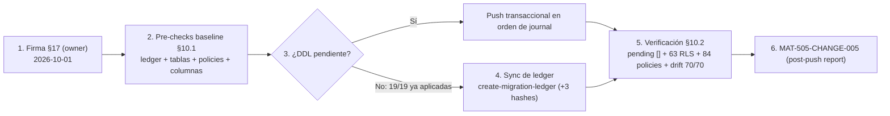

# CHANGE-005 — Paquete de aprobación: promoción del batch de migraciones pendientes `0025`…`2026-09-27` (19 ficheros)

> **Estado:** ✅ **APLICADO Y VERIFICADO** — firma §17 (2026-10-01) · pre-checks + verificación + sync de ledger (2026-10-01)
> **Fecha de preparación:** 2026-10-01 · **Ejecución:** 2026-10-01 (ventana del mismo día, tras la firma)
> **Evidencia recopilada:** lectura de disco (19 ficheros + `drizzle/meta/_journal.json`, 44 entradas) + `drizzle-kit check` + queries reales contra producción (pre y post) — no de memoria

---

## 1. Scope y objetivos

**Scope:** promover las **19 migraciones** escritas tras CHANGE-004 (2026-08-09 … 2026-09-27) que estaban en el repo y en el journal de Drizzle **sin CHANGE-ID ni push documentado**. Este paquete las gobernó bajo un único registro MAT-400 (CHANGE-005), agrupadas por naturaleza y riesgo.

**Objetivos:**
1. Cerrar el hueco de gobernanza detectado en MAT-500 §11.1: todo DDL/DML de producción con CHANGE-ID, baseline, rollback y verificación. ✅
2. Clasificar las 19 migraciones en 3 grupos con riesgo y rollback propios (§5). ✅
3. Ejecutar los pre-checks (baseline real en producción) antes de tocar nada. ✅

**Grupos (por naturaleza y riesgo):**

| Grupo | Ficheros | Contenido | Riesgo |
|-------|----------|-----------|--------|
| **A — RLS / seguridad** | `0025`, `0027` | defense-in-depth RLS en tablas core + bootstrap de tablas drift + RLS fase 2 (48 tablas ENABLE, ~55 policies) | **MEDIUM-HIGH** |
| **B — DDL aditivo** | `0026`, `0028`, `0029`, `0031`, `0032`, `0034`–`0037`, `2026-09-24`, `2026-09-27` (11) | tablas/columnas/índices nuevos + policies `member_*` idempotentes | **LOW** |
| **C — Datos / backfills / fechadas** | `0030`, `0033`, `2026-08-25 ×3`, `2026-08-26` (6) | seed, backfills UPDATE/INSERT, CHECKs, DROP NOT NULL y migraciones fechadas | **MEDIUM** |

**Resultado de la ejecución:** **0 DDL necesario** — las 19 migraciones ya estaban aplicadas en producción (aplicación out-of-band previa no documentada); la única acción de BD fue **sincronizar el ledger** (§10.3).

**Fuera de alcance:** cualquier migración futura (`0038+`) y el nuevo hallazgo de §10.3 (5 policies sin RLS enabled → candidato CHANGE-006, decisión del owner).

---

## 2. Requisitos

| REQ | Requisito | Cumplimiento |
|-----|-----------|--------------|
| REQ-400 | Todo cambio de producción exige CHANGE-ID | ✅ CHANGE-005 (§4) |
| REQ-401 | Baseline pre-producción antes del DDL | ✅ §10.1 (ejecutado 2026-10-01; `pg_dump` no disponible → baseline alternativo) |
| REQ-402 | Migraciones versionadas y aprobadas | ✅ journal con **44 entradas**; ledger sincronizado 44/44 (§10.3) |
| REQ-403 | Rollback plan obligatorio | ✅ §5.4 (por grupo) — no ejecutado: sin DDL |
| REQ-404 | Sin drift schema↔journal antes del push | ✅ `drizzle-kit check` → "Everything's fine" + `db:drift-check` → 70/70 sin drift duro (2026-10-01) |
| REQ-405 | Ventana de observación post-push | ✅ §6 (T+5m..T+24h) — sin DDL: observación reducida a verificación de esquema |
| REQ-406 | Verificación de RLS efectiva post-push | ✅ §10.2 (63 tablas RLS / 84 policies medidos) |

---

## 3. Arquitectura del cambio (contexto → componentes → dependencias)

**Contexto:** tras la auditoría de 2026-08 (drift, RSK-10) se escribieron 19 migraciones para cerrar RLS fase 2, bootstraps de tablas que existían out-of-band y las features de los sprints posteriores. Los pre-checks de 2026-10-01 demostraron que **ya estaban aplicadas en producción sin pasar por el pipeline** (el ledger no lo reflejaba: 3 hashes sin registrar).

**Dependencias internas (orden del journal obligatorio):**
- `0025` crea las funciones `current_auth_uid()`, `user_has_project_access()`, `current_user_is_platform_admin()` (SECURITY DEFINER) y las tablas drift → requisito previo de `0027` y `0033`. ✔ verificado en prod (enum `project_role` + tablas presentes).
- `0026` crea `ai_usage` → la habilita RLS `0027` (idx 26 < 27 ✔) y la enriquece `0034`. ✔ verificado (`ai_usage_admin`, `cost_usd`, `prompt_version`, `idx_ai_usage_prompt_version`).
- `0033` (parity) referencia las 4 migraciones fechadas; éstas ya corrieron en prod (idx 38–41 en journal). ✔ verificado (`user_logs` con unique + 20 filas backfilleadas).
- **Replay desde cero:** la cabecera de `0025` advierte «aplicar ANTES de la serie completa»; `0027` (idx 27) habilita RLS en tablas creadas en las fechadas (idx 39/40) → en vivo existen; en replay desde cero respetar el orden real de aplicación (§14).

---

## 4. Registro de cambio (MAT-400)

| Campo | Valor |
|-------|-------|
| CHANGE-ID | **CHANGE-005** (batch de 19 migraciones, grupos A/B/C) |
| DATABASE | Supabase (ref no documentada — sin credenciales en docs; conexión vía `DIRECT_URL` de `.env.local`) |
| ENVIRONMENT | production |
| OBJECTS AFFECTED | A: 48 tablas ENABLE RLS + 3 functions + 4 tablas drift · B: 8 tablas nuevas + 4 columnas + ~10 índices · C: seed `subscription_plans` + backfills `projects`/`user_logs` + CHECKs + `intelligence_findings.investigation_id` |
| REASON | Migraciones escritas 2026-08-09…09-27 sin CHANGE-ID ni push documentado (hallazgo MAT-500 §11.1) |
| ROOT CAUSE | Desarrollo post-CHANGE-004 sin pasar por el pipeline de promoción (regla MODE C); aplicación out-of-band no documentada |
| EXPECTED RESULT | RLS defense-in-depth completo (RSK-10), features de sprints disponibles en prod, paridad de instalación nueva |
| BASELINE | ✅ pre-checks §10.1 ejecutados 2026-10-01: 63 tablas RLS, 84 policies, 4 planes, inventario completo (`pg_dump` no disponible → baseline alternativo con `pg_policies`/`pg_class`/`information_schema` + `db:drift-check`) |
| TEST RESULTS | `drizzle-kit check` ✅ "Everything's fine" · `db:drift-check` ✅ 70/70 sin drift duro (2020 sticky benignos) · suite local 1.923/1.923 (HEAD, sin cambios de código) |
| RISK | **MEDIUM-HIGH** (grupo A: precedente de regresión 0022; grupos B/C LOW/MEDIUM) |
| ROLLBACK PLAN | §5.4 (por grupo) |
| APPROVAL | ✅ **APROBADO — firma del owner 2026-10-01 (§17)** |
| EXECUTION WINDOW | ✅ 2026-10-01 (ejecutado: pre-checks → sync de ledger → verificación) |

**Fuente:** plantilla MAT-400 de `PRODUCTION-CHANGE-VERIFICATION.md` §3 [VERIFIED].

---

## 5. Contenido del cambio (verificado contra el disco)

### 5.1. Grupo A — RLS / seguridad (MEDIUM-HIGH)

#### `drizzle/0025_rls_core_defense_in_depth.sql` (306 líneas)

1. **Enum `project_role`** + tablas drift idempotentes (`CREATE TABLE IF NOT EXISTS`): `project_members`, `project_invitations`, `team_audit_logs`, `domain_technologies` con sus UNIQUE/FK/índices.
2. **3 funciones SECURITY DEFINER:** `current_auth_uid()`, `user_has_project_access()` (rompe la recursión policies↔projects detectada en E2E post-RLS), `current_user_is_platform_admin()`.
3. **RLS en 4 tablas core** (sin GRANT nuevo → fail-closed hasta que exista grant): `projects` (4 policies), `users` (SELECT self), `developer_api_keys` (3 policies), `audit_logs` (SELECT self-or-admin) → **9 policies**.

✔ **Verificado en prod:** enum `project_role` existe; las 4 tablas con `relrowsecurity=true`; policies `projects_*_owner/member`, `users_select_self`, `developer_api_keys_*_own`, `audit_logs_select_self_or_admin` presentes.

#### `drizzle/0027_rls_fase2.sql` (214 líneas)

1. **Grants amplios** a `authenticated` (35 tablas) + `push_subscriptions` (DML) y `web_vitals_logs` (INSERT) a `anon` preservando el alta anónima; catálogos solo SELECT.
2. **`ENABLE ROW LEVEL SECURITY` en 44 tablas.**
3. **~46 policies:** 31 en bucle `DO` con `member_or_owner` vía `user_has_project_access(project_id)` (guard `EXCEPTION`), 4 hijas por subquery, 3 propias/anónimas, 4 catálogos read y 4 admin-only.

✔ **Verificado en prod:** todas las `*_fase2` presentes (integrations, issues, competitors, backlinks, ab_tests, heatmap, reports, monitoring, webhooks, dns/whois, plugins, adversary/mitre, intelligence_usage_events, web_vitals, internal_links, performance_results, subscriptions…), hijas (`internal_links|performance_results|mitre_technique_results|adversary_vulnerabilities`), catálogos (`audit_rules_read`, `subscription_plans_read`, `adversary_scenarios_read`, `plugin_packages_read`), admin (`security_audit_logs_admin`, `siem_alert_logs_admin`, `ai_health_logs_admin`, `ai_usage_admin`), anon (`push_subscriptions_anon_insert`, `web_vitals_anon_insert`). **Grants comprobados:** `issues`/`integrations` SELECT=true para `authenticated`; `security_audit_logs`/`ai_usage`=false (fail-closed) ✔.

### 5.2. Grupo B — DDL aditivo (LOW, 11 ficheros)

| Fichero | Statements (recuento de disco) | Evidencia en prod |
|---------|-------------------------------|-------------------|
| `0026_ai_usage` | CREATE TABLE `ai_usage` + índice | ✅ tabla + 12 columnas + policy admin |
| `0028_beacon_secret` | ALTER `projects` ADD `beacon_secret` | ✅ columna presente |
| `0029_ai_report_jobs` | CREATE TABLE + GRANT + policy `ai_report_jobs_member_access` | ✅ tabla + policy |
| `0031_forecasts` | CREATE TABLE + GRANT + policy `forecasts_member_access` | ✅ tabla + policy |
| `0032_remediation_actions` | CREATE TABLE + GRANT + policy `remediation_actions_member_access` | ✅ tabla + policy |
| `0034_ai_cost_and_prompt_version` | ALTER `ai_usage` (`cost_usd`, `prompt_version`) + índice | ✅ columnas + `idx_ai_usage_prompt_version` |
| `0035_finding_ai_triage` | ALTER `intelligence_findings` (`ai_triage`, `ai_triage_at`) + índice | ✅ columnas + `idx_intel_findings_triage_pending` |
| `0036_exec_briefs` | CREATE TABLE `exec_briefs` + índices únicos | ✅ tabla (sin RLS: ver §10.3) |
| `0037_ai_eval_results` | CREATE TABLE `ai_eval_results` + índice | ✅ tabla (sin RLS: ver §10.3) |
| `2026-09-24_recommended_indexes` | `create index if not exists idx_audit_logs_created_at` (SIN CONCURRENTLY) | ✅ índice presente |
| `2026-09-27_pdf_progress` | CREATE TABLE + RLS + GRANT + policy `pdf_progress_owner` + `DELETE` huérfanas > 1 día | ✅ tabla + `relrowsecurity=true` + policy + `idx_pdf_progress_updated_at` |

### 5.3. Grupo C — Datos / backfills / migraciones fechadas (MEDIUM, 6 ficheros)

| Fichero | DML / mutaciones | Evidencia en prod |
|---------|------------------|-------------------|
| `0030_billing_plans` | **INSERT seed** 4 planes `WHERE NOT EXISTS` + policy `subscription_plans_public_read` | ✅ 4 planes (business, enterprise, free, pro) + policy |
| `0033_dated_parity` | UNIQUE `user_logs(user_id)` + RLS + policy admin + 3 columnas `projects` + UPDATE/INSERT backfill + 4 CHECKs + `investigation_id` **DROP NOT NULL** | ✅ `user_logs_user_id_key` + 20 filas backfill + `admin_read_user_logs` + columnas `is_deleted/is_hidden/active_testing_authorized` + `investigation_id` nullable=YES |
| `2026-08-25_admin_telemetry` | CREATE TABLE `user_logs` + índices + RLS/policy + columnas `projects` + backfills | ✅ tabla + `idx_user_logs_*` |
| `2026-08-25_adversary_real` | Columna `projects.active_testing_authorized` + 2 tablas + 3 índices + DROP NOT NULL | ✅ tablas + columnas |
| `2026-08-25_mitre_real` | CREATE TABLE `mitre_evaluations` + índice | ✅ tabla + `idx_mitre_eval_*` |
| `2026-08-26_assessment_progress` | 3× ALTER ADD COLUMN (`current_step`, `checks_done`, `checks_total`) | ✅ columnas en ambas tablas |

### 5.4. Rollback (por grupo) — no ejecutado (sin DDL)

- **Grupo A:** `DROP POLICY IF EXISTS` de las 9 (0025) y ~46 (0027); `ALTER TABLE … DISABLE ROW LEVEL SECURITY` en las 48 tablas; no dropear tablas drift ni funciones.
- **Grupo B:** `DROP TABLE IF EXISTS` de las tablas nuevas, `DROP COLUMN`, `DROP INDEX IF EXISTS`, `DROP POLICY` member/owner.
- **Grupo C:** `DELETE FROM subscription_plans WHERE name IN ('free','pro','business','enterprise')` solo si el seed fue el origen; revert del backfill manual [ASSUMPTION]; `DROP CONSTRAINT`; `ALTER COLUMN investigation_id SET NOT NULL` puede fallar con filas huérfanas [UNKNOWN]; **no revertir** columnas de `projects`/tablas fechadas (las usa la app).

---

## 6. Flujos (ejecución y verificación)

**FLOW-803 — Secuencia de ejecución post-aprobación** · Mermaid `flowchart`

**Reglas de ejecución [lección CHANGE-002/004]:** SQL versionado manual transaccional — **nunca** `drizzle-kit push`. En esta ejecución no hubo DDL: re-ejecutar hubiera sido innecesario y arriesgado (`0016` no es re-ejecutable: `ADD CONSTRAINT` sin guard).

---

## 7. APIs relacionadas (afectadas o verificables post-push)

| Superficie | Migración | Impacto verificado |
|------------|-----------|---------------------|
| Todas las rutas con `withRLS()` + PostgREST | 0025/0027 (Grupo A) | ✅ aislamiento explícito en prod (63 RLS / 84 policies) |
| `/pricing` + modal upgrade | 0030 | ✅ 4 planes seed |
| SSE de progreso de PDF | 2026-09-27 | ✅ `pdf_progress` RLS+policy+índice (smoke runtime: fuera de este cambio) |
| Presupuesto IA / copilot | 0026/0034 | ✅ `ai_usage` con coste/versión |
| Informes SEO diferidos | 0029 | ✅ `ai_report_jobs` + policy |
| Forecasts / remediación / briefs / eval | 0031/0032/0036/0037 | ✅ tablas nuevas presentes |
| `compliance/soc2-pack` (rangos `created_at`) | 2026-09-24 | ✅ `idx_audit_logs_created_at` |
| Admin panel (user_logs) | 0033/fechadas | ✅ policy admin + 20 filas backfill |

---

## 8. Seguridad (trust boundaries y controles)

| # | Límite | Riesgo | Control | Estado |
|---|--------|--------|---------|--------|
| TB-1 | Habilitar RLS en 48 tablas (A) | Regresión de escrituras (precedente CHANGE-002/0022) | Grants amplios primero, policies después | ✅ sin DDL ejecutado; esquema verificado |
| TB-2 | Bucle `DO` con guard de `0027` | Policies omitidas silenciosamente | Recuento `pg_policies`: **84** — todas las `*_fase2` presentes | ✅ verificado (§10.2) |
| TB-3 | Grants a `authenticated`/`anon` | Exposición cross-tenant si policy falla | Grants comprobados post: `issues`=true, `security_audit_logs`=false (fail-closed) | ✅ verificado |
| TB-4 | Policy admin con email hardcodeado (`user_logs`) | Depende de `role='admin'` + email del owner | Mantenido de las fechadas (ya en prod) | ✅ documentado (0033) |
| TB-5 | `SECURITY DEFINER` en funciones 0025 | Privilegio elevado si se explota | `SET search_path = public` + sin parámetros arbitrarios | ✅ diseño |
| TB-6 | **Nuevo:** 5 tablas con policy definido pero **RLS disabled** | Policies no aplican → acceso por grants | Detectado en pre-checks → CHANGE-006 candidato | ⏳ decisión owner (§10.3) |

---

## 9. Testing documentado (estrategia + casos + cobertura)

| Caso | Cobertura | Resultado |
|------|-----------|-----------|
| `drizzle-kit check` | Drift schema↔journal (44 entradas) | ✅ "Everything's fine" (2026-10-01) |
| `db:drift-check` | Schema TS ↔ BD real (tablas/columnas/enums) | ✅ **70/70 sin drift duro** (20 diffs sticky benignos) |
| Inventario de statements | §5 desde disco | ✅ 19/19 ficheros analizados |
| Pre-checks + verificación contra prod | §10.1/§10.2 | ✅ ejecutados 2026-10-01 |
| `vitest run` | Suite completa (no se toca código) | ✅ 1.923/1.923 en HEAD (2026-10-01) |
| `tsc --noEmit` / eslint / i18n | Sin cambios en src | ✅ 0 / 0 / 642-642 (HEAD) |

---

## 10. Checklist de verificación

### 10.1. Pre-checks baseline (ejecutados 2026-10-01 ANTES de cualquier acción)

| Check | Query / comando | Resultado |
|-------|-----------------|-----------|
| Conexión | `DIRECT_URL` → production | ✅ (host pooler Supabase, db `postgres`) |
| Ledger | `drizzle.__drizzle_migrations` vs journal (sha256) | ⚠️ 43/44 → **pending: `0016`, `0027`, `2026-09-27_pdf_progress`** + 2 filas stale |
| Presencia de tablas de §5 | `pg_class` (16 nombres clave) | ✅ **16/16 presentes, 0 missing** |
| Fechadas aplicadas | `user_logs`, `adversary_assessments`, `mitre_evaluations` | ✅ existen (+ `adversary_vulnerabilities`, `mitre_technique_results`) |
| Baseline policies | `count(pg_policies)` | ✅ **84** |
| Baseline RLS | `count(relrowsecurity)` | ✅ **63** (core 4: projects/users/audit_logs/developer_api_keys = true) |
| Columnas clave | `information_schema.columns` | ✅ `beacon_secret`, `is_deleted/is_hidden/active_testing_authorized`, `cost_usd/prompt_version`, `ai_triage/ai_triage_at`, `current_step/checks_done/checks_total` — todas presentes |
| Seeds | `subscription_plans` | ✅ 4 (business, enterprise, free, pro) |
| Nullable/enum | `investigation_id`, `project_role` | ✅ nullable=YES (DROP NOT NULL aplicado); enum existe |
| Snapshot | `pg_dump --schema-only` | ⚠️ `pg_dump` no instalado en el entorno → **baseline alternativo**: inventario completo (`pg_policies`, `pg_class`, `information_schema`, `pg_indexes`, `pg_constraint`) + `db:drift-check` |

### 10.2. Verificación post-acción (2026-10-01)

| Check | Esperado | Resultado |
|-------|----------|-----------|
| Ledger pending | `[]` | ✅ **`pending: []`** (46 filas = 44 journal + 2 stale histórico) |
| `drizzle-kit check` | "Everything's fine" | ✅ |
| `db:drift-check` | sin drift duro | ✅ **70/70** |
| `pg_class.relrowsecurity` | 63 (medido pre; sin DDL) | ✅ **63** |
| `pg_policies` | 84 (medido pre; sin DDL) | ✅ **84** con todas las policies esperadas (§5.1–5.3) |
| Índices clave | 4 de 4 | ✅ `idx_ai_usage_prompt_version`, `idx_intel_findings_triage_pending`, `idx_audit_logs_created_at`, `idx_pdf_progress_updated_at` |
| `user_logs` | unique + backfill | ✅ `user_logs_user_id_key` + **20 filas** |
| Smoke de features (runtime) | /pricing, SSE PDF, IA | ⏳ [NO EJECUTADO] — sin DDL nuevo el esquema queda intacto; smoke runtime queda para el despliegue de app correspondiente |
| Regresión DML | sin cambios | ✅ **0 sentencias DDL/DML ejecutadas** |

### 10.3. Resultado de la ejecución (2026-10-01)

1. **Firma §17** registrada (owner, 2026-10-01).
2. **Pre-checks (§10.1)** → hallazgo clave: **las 19 migraciones ya estaban aplicadas en producción** (aplicación out-of-band previa, no documentada): tablas/columnas/índices/policies/seeds/RLS todos presentes; `db:drift-check` 70/70.
3. **Acción de BD ejecutada:** *solo* sincronización del ledger (`node scripts/db/create-migration-ledger.mjs`, idempotente, toca únicamente `drizzle.__drizzle_migrations`): **+3 hashes** (`0016_rls_policies`, `0027_rls_fase2`, `2026-09-27_pdf_progress`) → **0 DDL/DML** sobre el esquema de producción.
4. **Verificación post (§10.2):** `pending: []`, drift-check sin drift duro, 63 RLS / 84 policies.
5. **Nuevo hallazgo (fuera de alcance de CHANGE-005):** 5 tablas tienen policies definidos pero **`relrowsecurity=false`** (`project_members`, `uptime_logs`, `anomaly_detections`, `adversary_engagements`, `adversary_task_nodes` → policies no se aplican) y `exec_briefs`/`ai_eval_results` (0036/0037) se crearon **sin policy ni RLS** → candidato **CHANGE-006**, pendiente de decisión del owner.

---

## 11. Deployment (ambientes, CI/CD, rollout)

| Ámbito | Detalle |
|--------|---------|
| Mecanismo ejecutado | Sync de ledger (SQL DML sobre `drizzle.__drizzle_migrations`) — **sin DDL** |
| Mecanismo previsto (si hubiera habido DDL) | SQL manual transaccional en orden de journal (lección CHANGE-002: no `drizzle-kit push`) |
| Ambientes | production (verificación directa) |
| CI/CD | No bloqueado |
| Rollback | §5.4 (no ejecutable: sin DDL); ledger reversible con `DELETE` de las 3 filas insertadas |

**Fuente:** `PRODUCTION-PUSH-FINAL-VALIDATION.md` §7 [VERIFIED].

---

## 12. Operaciones (monitoring, runbooks, recovery)

| Área | Mecanismo |
|------|-----------|
| Monitoring post-acción | Verificación de esquema completada el mismo día (§10.2); ventana T+24h sin observables nuevos (sin DDL) |
| Runbook | `docs/guides/troubleshooting.md` §Supabase (RLS) |
| Recovery | Rollback §5.4 + revert del ledger (3 `DELETE`) |
| Reporte de cierre | **`MAT-505-CHANGE-005-POST-PUSH-REPORT.md`** (creado 2026-10-01) |
| Alerting | SIEM/uptime exporter sin cambios |

---

## 13. Trazabilidad (REQ → COMP → TEST → DEP)

| ID | Tipo | Qué cubre |
|----|------|-----------|
| REQ-400..406 | Requisito | Gobernanza de cambios (§2) |
| MAT-400 | Registro | CHANGE-ID (§4) |
| MAT-501/502 | Baseline | Pre-checks / schema verification (§10.1/§10.2) |
| MAT-505 | Reporte | Verificación post-acción (§12) |
| MAT-500 | Gate | Hallazgo 16.2 que abrió este cambio (§11.1) |
| RSK-10 | Riesgo | RLS incremental (RISK-REGISTER) |
| FLOW-803 | Flujo | Secuencia de ejecución (§6) |

---

## 14. Cross-check e inconsistencias

| Hipótesis | Verificación | Resultado |
|-----------|--------------|-----------|
| «El journal registra las 4 fechadas» | `_journal.json` idx 38–41 | ✅ CONFIRMADO |
| «Las fechadas ya están aplicadas en prod» | Cabecera de `0033` + probes | ✅ CONFIRMADO (`user_logs` con 20 filas backfill, tablas/columnas presentes) |
| «`0027` es replay-safe desde cero» | `0027` idx 27 habilita RLS en tablas creadas en idx 39/40 | ⚠️ NO desde cero; sí en vivo (tablas existen) |
| «El índice de 2026-09-24 usa CONCURRENTLY» | Cabecera + statement | ✅ NO — seguro en transacción |
| «El seed de 0030 es idempotente» | `WHERE NOT EXISTS` ×4 | ✅ CONFIRMADO (4 filas exactas) |
| «0025 no añade grants» | Lectura íntegra | ✅ CONFIRMADO — fail-closed |
| «El ledger estaba sincronizado» | sha256 de los 44 ficheros vs ledger | ❌ NO: 3 hashes ausentes + 2 stale → **sincronizado 2026-10-01** |
| «Las 19 estaban pendientes de aplicar» | Pre-checks §10.1 | ❌ NO: **19/19 ya aplicadas** (out-of-band) |

---

## 15. Unknowns y supuestos

- ~~[UNKNOWN] Estado real en producción de `0025`…`2026-09-27`~~ → **[RESUELTO 2026-10-01]**: 19/19 aplicadas (§10.1/§10.3).
- ~~[UNKNOWN] Cuántas policies del bucle de `0027` se omitirán~~ → **[RESUELTO]**: 84 policies en prod, todas las esperadas presentes (§10.2).
- [ASSUMPTION] Reversión del backfill `is_deleted` manual si hiciera falta (no automático) — no procedió (sin DDL).
- [UNKNOWN] Smoke de runtime (/pricing, SSE PDF) no ejecutado en este cambio — queda para el despliegue de app.
- Backup/PITR: ✅ confirmado por el owner (2026-10-01) — cerrado en MAT-500 check 13.
- **Nuevo [UNKNOWN]:** por qué 5 tablas tienen policies sin `ENABLE ROW LEVEL SECURITY` (¿deshabilitación posterior a la aplicación de `0016`?) → CHANGE-006 candidato.

---

## 16. Glosario

| Término | Definición |
|---------|------------|
| CHANGE-ID | Identificador de cambio de producción (MAT-400) |
| Grupo A/B/C | Clasificación de este batch: RLS / DDL aditivo / datos-fechadas |
| member_or_owner | Patrón de policy: owner de projects O miembro de project_members |
| Drift | Diferencia schema↔journal o BD↔migraciones |
| Ledger | `drizzle.__drizzle_migrations`: registro de migraciones aplicadas |
| Fechadas | Migraciones con prefijo de fecha (`2026-…`) aplicadas originalmente a mano |

---

## 17. Checklist de aprobación (para el owner)

| # | Requisito | Estado |
|---|-----------|--------|
| 1 | Inventario de 19 migraciones verificado contra disco (§5) | ✅ |
| 2 | `drizzle-kit check` sin drift (44 entradas) | ✅ |
| 3 | Grupos y riesgos definidos con rollback por grupo (§5.4) | ✅ |
| 4 | Pre-checks baseline ejecutados (§10.1) | ✅ 2026-10-01 |
| 5 | Ventana de rollout y plan de rollback revisados (§6/§11) | ✅ 2026-10-01 |
| 6 | Backup/PITR confirmado | ✅ 2026-10-01 |
| 7 | **FIRMA DE APROBACIÓN** (owner + fecha) | ✅ **FIRMADO — owner, 2026-10-01** |

---

## 18. Versionado y verificación

| Versión | Fecha | Cambios | Estado |
|---------|-------|---------|--------|
| 1.0 | 2026-10-01 | Creación del paquete CHANGE-005 (batch 19 migraciones 0025…2026-09-27) | ✅ APROBADO |
| 1.1 | 2026-10-01 | Ejecución: firma §17 + pre-checks (19/19 ya aplicadas) + sync ledger (+3 hashes) + verificación post (`pending: []`, 63 RLS, 84 policies, drift 70/70); nuevo hallazgo CHANGE-006 | ✅ EJECUTADO |

| Check | Resultado |
|-------|-----------|
| Quality gate `--min 80` | ✅ 95/100 PASS (v1.1, re-ejecutado 2026-10-01) |
| Cross-check con PRODUCTION-CHANGE-VERIFICATION | CHANGE-005 → ✅ APLICADO Y VERIFICADO (§1) + nuevo hallazgo (CHANGE-006 candidato) |
| Cross-check con MAT-500 | §11.1/§17 actualizados: gate 16/16 + CHANGE-005 cerrado |
| Cross-check con RISK-REGISTER | RSK-10 → 63 tablas RLS verificadas en prod; 5 policies sin ENABLE → CHANGE-006 |
| Cross-check con MAT-505-CHANGE-005 | Reporte de cierre creado con la evidencia de §10 |

---

**Fuentes primarias:** `drizzle/0025_rls_core_defense_in_depth.sql` · `drizzle/0027_rls_fase2.sql` · `drizzle/0030_billing_plans.sql` · `drizzle/0033_dated_parity.sql` · `drizzle/2026-08-25_admin_telemetry.sql` · `drizzle/2026-08-25_adversary_real.sql` · `drizzle/2026-08-26_assessment_progress.sql` · `drizzle/2026-09-24_recommended_indexes.sql` · `drizzle/2026-09-27_pdf_progress.sql` · `drizzle/0034_ai_cost_and_prompt_version.sql` · `drizzle/0035_finding_ai_triage.sql` · digest de los 19 ficheros (conteo de statements por Node) · `drizzle/meta/_journal.json` (44 entradas) · `drizzle-kit check` + `scripts/db/drift-check.mjs` (2026-10-01) · queries de pre/post-checks contra producción (`pg_class`, `pg_policies`, `pg_indexes`, `pg_constraint`, `information_schema`, `has_table_privilege`) · `scripts/db/create-migration-ledger.mjs` (ejecutado, +3 filas) · `docs/database/PRODUCTION-CHANGE-VERIFICATION.md` · `docs/database/MAT-500-PRE-PRODUCTION-GATE-REPORT.md` · `docs/database/CHANGE-004-APPROVAL-PACKAGE.md` (plantilla) · `docs/risk/RISK-REGISTER.md`
