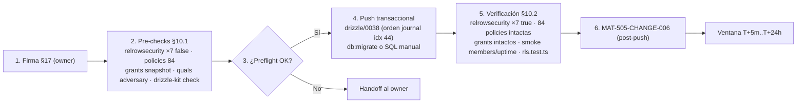

# CHANGE-006 — Paquete de aprobación: habilitación de RLS en 7 tablas (activación de policies existentes)

> **Estado:** ✅ **APLICADO Y VERIFICADO** [VERIFIED — ejecutado y verificado 2026-10-01]
> **Fecha de preparación:** 2026-10-01 · **Ejecución:** 2026-10-01 — firma §17 → pre-checks → `db:migrate` (`0038`) → verificación §10.2 **10/10 PASS**
> **Evidencia recopilada:** probes reales contra producción (grants/policies/`relrowsecurity` medidos pre y post) + análisis de rutas de acceso del código + emulación de rol `authenticated` — no de memoria

---

## 1. Scope y objetivos

**Scope:** cerrar el hueco de RSK-10 detectado durante los pre-checks de CHANGE-005: **7 tablas sin `ENABLE ROW LEVEL SECURITY` en producción** (de 70). En 5 de ellas existe **grant `SELECT` a `authenticated`** y una policy `SELECT` ya diseñada pero inerte (RLS off → la policy no se aplica); en las otras 2 no hay grant ni policy (fail-closed a nivel de grant).

**Objetivos:**
1. Que las 5 policies existentes pasen a **ser efectivas** (aislamiento member/owner real, no solo de papel). ✅ **verificado 2026-10-01 (§10.2): negativo 0 filas, positivo 2974/2974**
2. Dejar `exec_briefs`/`ai_eval_results` en **fail-closed** si algún día reciben grant. ✅ **verificado 2026-10-01: 42501 ×2**
3. Medir y verificar: **63 → 70 tablas RLS** en prod, `pg_policies` = 84 sin cambios, grants sin cambios. ✅ **70/84/70 confirmado (§10.2)**

**Grupos (por naturaleza y riesgo):**

| Grupo | Tablas | Contenido | Riesgo |
|-------|--------|-----------|--------|
| **A — policy+grant inerte (5)** | `project_members`, `uptime_logs`, `anomaly_detections`, `adversary_engagements`, `adversary_task_nodes` | `ENABLE RLS` activa la policy `SELECT` existente (member/owner o `select_own`) | **MEDIUM-LOW** |
| **B — sin policy ni grant (2)** | `exec_briefs`, `ai_eval_results` | `ENABLE RLS` sin policy → fail-closed futuro; **0 cambio funcional hoy** (el grant ya bloquea) | **LOW** |

**Fuera de alcance:** grants nuevos, policies nuevas, `FORCE ROW LEVEL SECURITY`, cambios de código, tablas ya protegidas (63).

---

## 2. Requisitos

| REQ | Requisito | Cumplimiento |
|-----|-----------|--------------|
| REQ-400 | Todo cambio de producción exige CHANGE-ID | ✅ CHANGE-006 (§4) |
| REQ-401 | Baseline pre-producción antes del DDL | ✅ Pre-checks §10.1 ejecutados 2026-10-01: 7×`false`, 63 RLS / 84 policies, quals leídas |
| REQ-402 | Migraciones versionadas y aprobadas | ✅ Fichero `drizzle/0038_enable_rls_change006.sql` + journal idx 44 (45/45) + ledger 47 (`hash_match=true`) |
| REQ-403 | Rollback plan obligatorio | ✅ §5.4 (`DISABLE` ×7) |
| REQ-404 | Sin drift schema↔journal antes del push | ✅ `drizzle-kit check` "Everything's fine" (pre y post, 2026-10-01) |
| REQ-405 | Ventana de observación post-push | ✅ §6/§18 — T+5m y T+24h completadas (recheck 2026-10-02T21:23Z, MAT-505 §18 v1.2) |
| REQ-406 | Verificación de RLS efectiva post-push | ✅ §10.2 **10/10 PASS** (`relrowsecurity=true` ×7 + aislamiento medido) |

---

## 3. Arquitectura del cambio (contexto → componentes → dependencias)

**Contexto (estado PRE, medido 2026-10-01 [VERIFIED]):**

| Tabla | Grant `authenticated` | RLS (pre) | Policy existente (inerte) |
|-------|----------------------|-----|---------------------------|
| `project_members` | SELECT | ❌ | `project_members_select_own` — `USING (user_id = uid)` (`0016` L408-412) |
| `uptime_logs` | SELECT | ❌ | `…_select_member_or_owner` — member/owner por `project_id` (`0016` L369-380) |
| `anomaly_detections` | SELECT | ❌ | `…_select_member_or_owner` — ídem (`0016` L386-397) |
| `adversary_engagements` | SELECT | ❌ | `…_select_member_or_owner` ✅ qual leída en preflight (member-or-owner) |
| `adversary_task_nodes` | SELECT | ❌ | `…_select_member_or_owner` ✅ qual leída en preflight (encadena engagement→project) |
| `exec_briefs` | **sin grant** | ❌ | sin policy |
| `ai_eval_results` | **sin grant** | ❌ | sin policy |

**Exposición previa al cambio:** cualquier sesión autenticada podía `SELECT` **todas las filas** de las 5 tablas con grant (PostgREST con la publishable key, estándar Supabase [ASSUMPTION de exposición; el grant+RLS-off estaba medido [VERIFIED]]): membresías de todos los proyectos, uptime/anomalías ajenos y resultados rojo-team de terceros. **Cerrado el 2026-10-01:** medido 0 filas cross-tenant (§10.2).

**Análisis de rutas de acceso (por qué el ENABLE no rompe nada):**

| Ruta | Conexión | Efecto del ENABLE |
|------|----------|-------------------|
| `api/projects/[id]/members` (listado) | `directDb` (L60-71) — bypass RLS | ✅ sin cambio |
| `server/lib/rbac.ts`, `invitations.ts`, `project-access.ts`, `entitlements.ts` (L3) | `directDb` | ✅ sin cambio (escrituras/lecturas de membresía) |
| `server/security/weekly-digest.ts` (L11) | `directDb` | ✅ sin cambio |
| `api/public/v1/uptime` (L2, L32, L41) | `directDb` | ✅ sin cambio |
| Triggers/cron (`uptime`, `cleanup`, `anomaly`, `exec-brief`) | rol `postgres` (bypass RLS) | ✅ sin cambio |
| Lecturas autenticadas vía `withRLS`/PostgREST | `authenticated` | ⚠️→✅ pasan a filtrar member/owner — **que es el diseño de las policies** (verificado: positivo 2974/2974) |
| Funciones `0025` (`user_has_project_access`…) | `SECURITY DEFINER` (owner) | ✅ bypass RLS, sin recursión (`select_own` no referencia `projects`) |

**Dependencias:** `0016` ya contiene los `ENABLE` correspondientes (`uptime_logs` L357, `anomaly_detections` L360, `project_members` L402) que **nunca llegaron a ejecutarse** (fichero editado tras su aplicación — [ASSUMPTION] causa raíz); este cambio materializa esa intención + la de los `ENABLE` de `adversary_*`.

---

## 4. Registro de cambio (MAT-400)

| Campo | Valor |
|-------|-------|
| CHANGE-ID | **CHANGE-006** |
| DATABASE | Supabase (production, vía `DIRECT_URL`) |
| ENVIRONMENT | production |
| OBJECTS AFFECTED | 7 × `ALTER TABLE … ENABLE ROW LEVEL SECURITY` — **0 grants, 0 policies, 0 columnas** |
| REASON | 5 tablas con grant+policy pero RLS off (policies inertes → lectura cross-tenant); 2 sin RLS |
| ROOT CAUSE | `0016` editado tras su aplicación → sus `ENABLE` nunca ejecutados [ASSUMPTION]; `0036`/`0037` crearon tablas sin RLS (diseño del fichero) |
| EXPECTED RESULT | 63 → **70** tablas RLS en prod; `pg_policies` = 84 sin cambios; grants sin cambios; lecturas cross-tenant → 42501/vacío → ✅ **confirmado (§10.2)** |
| BASELINE | ✅ Pre-checks §10.1 ejecutados: **63/84/70**, 7×`false`, quals `adversary_*` leídas |
| TEST RESULTS | Análisis de rutas de acceso (§3) + pre-checks PASS + **§10.2 10/10 PASS** (negativo 0 filas, positivo 2974/2974, Group B 42501 ×2) + `rls.test.ts` 5/5 + `drift-check` sin drift + `drizzle-kit check` fine + suite local 1.923/1.923 (HEAD, sin cambios de código) |
| RISK | **MEDIUM-LOW** (solo lecturas autenticadas cambian; escrituras intactas; precedente 0022 afectaba a escrituras) |
| ROLLBACK PLAN | §5.4 (`DISABLE` ×7, segundos) — no procedió |
| APPROVAL | ✅ **FIRMA del owner en §17 (2026-10-01)** |
| EXECUTION WINDOW | **EJECUTADO 2026-10-01** (`db:migrate`; ventana T+24h cerrada 2026-10-02, MAT-505 §18 v1.2) |

**Fuente:** plantilla MAT-400 de `PRODUCTION-CHANGE-VERIFICATION.md` §3 [VERIFIED].

---

## 5. Contenido del cambio (SQL exacto, verificado contra el disco)

### 5.1. Grupo A — activación de policies existentes (MEDIUM-LOW)

```sql
ALTER TABLE "project_members"     ENABLE ROW LEVEL SECURITY;
ALTER TABLE "uptime_logs"         ENABLE ROW LEVEL SECURITY;
ALTER TABLE "anomaly_detections"  ENABLE ROW LEVEL SECURITY;
ALTER TABLE "adversary_engagements" ENABLE ROW LEVEL SECURITY;
ALTER TABLE "adversary_task_nodes"  ENABLE ROW LEVEL SECURITY;
```

- Idempotente (`ENABLE` re-ejecutable sin efecto duplicado).
- **Prohibido `FORCE`** (aplicaría RLS al owner `postgres` → rompería la app entera) — verificado `relforcerowsecurity=false` ×7 post-push.
- Efecto: las policies `SELECT` existentes pasan a filtrar. `project_members` → cada autenticado solo ve **su** membresía (cierra el metadata leak); las demás → solo filas de proyectos donde es owner/member.
- Preflight de quals: ✅ **ejecutado** — las 2 policies `adversary_*` leídas literalmente, member-or-owner correctas (§10.1).

### 5.2. Grupo B — fail-closed futuro (LOW)

```sql
ALTER TABLE "exec_briefs"     ENABLE ROW LEVEL SECURITY;
ALTER TABLE "ai_eval_results" ENABLE ROW LEVEL SECURITY;
```

- Sin policy y sin grant a `authenticated` → **0 cambio funcional hoy**; si algún día se concede un grant sin policy, el acceso queda denegado (fail-closed). ✅ verificado: 42501 ×2.

### 5.3. Rollback (§5.4)

```sql
ALTER TABLE "<tabla>" DISABLE ROW LEVEL SECURITY;  -- ×7
```

- Reversión en segundos; no toca policies ni grants. **No procedió** (§10.2: 10/10 PASS).

---

## 6. Flujos (ejecución y verificación)

**FLOW-804 — Secuencia de ejecución post-aprobación** · Mermaid `flowchart`



**Reglas de ejecución [lección CHANGE-002/004]:** SQL versionado manual transaccional — **nunca** `drizzle-kit push` (trataría policies como drift). ✅ ejecutado como se planificó: `db:migrate` aplicó **solo** `0038` (preflight del ledger: `max(created_at)=1790596804000` entre `when` idx43 e idx44 → imposible re-aplicar nada histórico).

---

## 7. APIs relacionadas (afectadas o verificables post-push)

| Superficie | Método | Efecto esperado |
|------------|--------|-----------------|
| `api/projects/[id]/members` | GET/POST | ✅ sin cambio (listado vía `directDb`); cross-tenant → vacío/403 — **verificado: 0 filas** |
| `api/public/v1/uptime` | GET | ✅ sin cambio (`directDb`) — **verificado: 24.868 intactas** |
| PostgREST (`NEXT_PUBLIC_SUPABASE_URL`) | GET | ✅ lecturas cross-tenant de las 5 tablas → **0 filas** (deseado, medido §10.2) |
| Triggers/cron (uptime, anomaly, exec-brief) | — | ✅ sin cambio (rol `postgres`) |
| `api/intelligence/*` (adversary) | GET/POST | ✅ sin cambio (escrituras en postgres) |

**Status codes:** 401/403 (sesión) · **42501** ahora también en lecturas ajenas a las 5 tablas (esperado, es el objetivo) · 429 sin cambios.

---

## 8. Seguridad (trust boundaries y controles)

| # | Límite / regla | Riesgo | Control | Estado |
|---|----------------|--------|---------|--------|
| TB-1 | `ENABLE` en 5 tablas con lecturas autenticadas | Romper lecturas legítimas si el qual es incorrecto | quals verificadas (`0016` L369-397 + `adversary_*` leídas) + smoke §10.2 | ✅ PASS (positivo 2974/2974) |
| TB-2 | `project_members` con policy `select_own` | Si alguna ruta `withRLS` listaba miembros ajenos, ahora los pierde (correcto); el listado oficial usa `directDb` | Verificado: ruta `members` L60-71 `directDb` | ✅ |
| TB-3 | `FORCE ROW LEVEL SECURITY` | Rompería al owner `postgres` (app entera caída) | **Prohibido explícitamente** (§5.1) — `force=false` ×7 medido | ✅ |
| TB-4 | Grants | Expandiría acceso | **0 grants nuevos** (medido idéntico post-push) | ✅ |
| TB-5 | Amenaza que se cierra | Cross-tenant read (RSK-10): membresías, uptime, anomalías, resultados rojo-team | Policies efectivas — **negativo medido: 0 filas** | ✅ **CERRADA 2026-10-01** |
| TB-6 | Escrituras | RLS no aplica a `postgres`/`directDb` | Rutas de escritura inventariadas (§3) | ✅ |

---

## 9. Testing documentado (estrategia + casos + cobertura)

| Caso | Cobertura | Resultado |
|------|-----------|-----------|
| Rutas de acceso vs RLS | 7 tablas × rutas del código | ✅ sin escrituras autenticadas (§3) |
| Preflight | quals adversary + recuentos baseline | ✅ §10.1 PASS (2026-10-01) |
| `rls.test.ts` | policies member/owner | ✅ **5/5 re-ejecutado post-push** |
| Smoke members (aislamiento) | emulación `authenticated`: negativo + positivo | ✅ 0 filas (sub aleatorio) / **2974/2974** (owner) |
| Smoke uptime | lectura `directDb` + escritura cron | ✅ lectura 24.868 intacta; ✅ ciclo cron manual T+1h (200/200) y cron programado continuo 31 h en `uptime_logs` (MAT-505 §18) |
| `db:drift-check` / `drizzle-kit check` | schema↔BD y journal | ✅ sin drift duro y "fine" (pre y post) |
| Suite completa | sin cambios de código | ✅ 1.923/1.923 (HEAD) — no re-obligatoria |

---

## 10. Checklist de verificación

### 10.1. Pre-checks baseline (read-only, ANTES del DDL — EJECUTADOS 2026-10-01)

| Check | Query / comando | Esperado |
|-------|-----------------|----------|
| RLS actual | `pg_class.relrowsecurity` ×7 | `false` ×7 (medido 2026-10-01) |
| Policies | `count(pg_policies)` | **84** (sin cambios posteriores) |
| Grants | `role_table_grants` de las 7 | SELECT→`authenticated` ×5; solo `postgres` ×2 |
| Quals | `pg_policies.qual` de `adversary_*` | member/owner por `project_id` |
| SinFORCE | `relforcerowsecurity` | `false` ×7 |
| Journal | `drizzle-kit check` (y tras registrar `0038`) | "Everything's fine" |
| Ledger | sha256 vs `drizzle.__drizzle_migrations` | `pending: []` hoy → `[0038…]` al registrar la entrada |
| Backup/PITR | confirmación del owner | ✅ 2026-10-01 (heredado de CHANGE-005) |

**Resultado (2026-10-01): todos PASS** — 7×`false` + force `false` ×7 · **63/84/70** · quals `adversary_*` leídas (member-or-owner correctas: `adversary_engagements` filtra por `project_id` owner/membership; `adversary_task_nodes` encadena `engagement_id → engagement.project_id`) · grants SELECT→`authenticated` ×5, Group B solo `postgres` · `has_table_privilege` 5 true / 2 false · conteos baseline (`uptime_logs` 24.868, `exec_briefs` 4, `ai_eval_results` 4, resto 0) · `drizzle-kit check` verde (pre y post idx 44) · **ledger preflight: 46 filas, `max(created_at)=1790596804000` → "SEGURO PARA db:migrate"** · Backup/PITR ✅.

### 10.2. Verificación post-push (T+5m y T+24h) — EJECUTADA (T+5m 2026-10-01 · T+24h cerrada 2026-10-02)

| Check | Esperado |
|-------|----------|
| `relrowsecurity` ×7 | **`true`** (63 → 70) |
| `pg_policies` | 84, mismos nombres |
| `has_table_privilege` | idéntico al snapshot §10.1 |
| Smoke members (owner) | lista completa (vía `directDb`) |
| Smoke lectura cross-tenant (5 tablas) | vacío / 42501 |
| Smoke escritura cron uptime | 1 ciclo OK |
| `rls.test.ts` | 5/5 |
| `db:drift-check` / `drizzle-kit check` | sin drift / fine |

**Resultado (2026-10-01): 10/10 PASS** — `relrowsecurity` **7× true**, `relforcerowsecurity` 7× false · **70 RLS / 84 policies / 70 tablas** · policies sin cambios (5 Group A, 0 nuevas) · grants idénticos (0 nuevos) · conteos = baseline (0 tocar filas) · **NEGATIVO:** sub aleatorio → **0 filas en las 5** (antes: `uptime_logs` 24.868 visibles) · **Group B:** 42501 ×2 (transacción propia por tabla) · **POSITIVO:** owner real vio **2974/2974** · **directDb (postgres):** 24.868 intactas · **ledger:** 47 filas, `hash=sha256(fichero)`, `created_at=when` · `rls.test.ts` **5/5** · `drift-check` sin drift duro · `drizzle-kit check` fine. Smoke de ciclo cron: ✅ ejecutado a T+1h (ciclo manual `/api/cron/uptime` + `/api/cron/siem` → 200/200) y cron programado continuo 31 h en `uptime_logs` a T+24h; smoke HTTP ✅ 9 rutas 200 (MAT-505 §18 v1.2).

---

## 11. Deployment (ambientes, CI/CD, rollout)

| Ámbito | Detalle |
|--------|---------|
| Mecanismo primario | Fichero versionado **`drizzle/0038_enable_rls_change006.sql`** + entrada de journal (idx 44) → **`pnpm db:migrate`** — ✅ **EJECUTADO 2026-10-01** (aplicó solo la entrada pendiente: preflight del ledger + "migrations applied successfully!") |
| Mecanismo alternativo | SQL manual transaccional del mismo fichero (precedente CHANGE-002/003/004) — **no hizo falta** (`drizzle-kit check` verde tras registrar la entrada) |
| Prohibido | `drizzle-kit push` (drift de policies) · `FORCE` · grants nuevos — ✅ respetado |
| Ambientes | production (directo, con backup/PITR confirmado) |
| CI/CD | No bloqueado (docs + SQL; sin cambios de código) |
| Rollout | 7 statements en una transacción; observación T+5m ✅ (verificación PASS) / T+24h ✅ (cerrada 2026-10-02) |

**Fuente:** `PRODUCTION-PUSH-FINAL-VALIDATION.md` §7 [VERIFIED] · lección CHANGE-002.

---

## 12. Operaciones (monitoring, runbooks, recovery)

| Área | Mecanismo |
|------|-----------|
| Monitoring post-push | Recuento §10.2 ✅ (T+5m PASS) + revisión de errores 42501/500 en logs de app ✅ (T+24h cerrada 2026-10-02: 0 entradas, MAT-505 §18 v1.2) — un aumento de 42501 en lecturas **legítimas** sería la señal de regresión |
| Runbook | `docs/guides/troubleshooting.md` §Supabase (RLS) |
| Recovery | §5.4: `DISABLE` ×7 (segundos) |
| Alerting | SIEM/uptime exporter sin cambios |

---

## 13. Trazabilidad (REQ → COMP → TEST → DEP)

| ID | Tipo | Qué cubre |
|----|------|-----------|
| REQ-400..406 | Requisito | Gobernanza de cambios (§2) |
| MAT-400 | Registro | CHANGE-ID (§4) |
| MAT-501/502 | Baseline | Pre-checks / verificación (§10.1/§10.2) |
| MAT-505 | Reporte | Verificación post-push (§12) — `MAT-505-CHANGE-006-POST-PUSH-REPORT.md` **creado 2026-10-01** |
| MAT-500 | Gate | Origen del hallazgo (pre-checks de CHANGE-005) |
| RSK-10 | Riesgo | RLS incremental / exposición cross-tenant — ✅ **cerrado** (70 RLS medidas) |
| FLOW-804 | Flujo | Secuencia de ejecución (§6) |

---

## 14. Cross-check e inconsistencias

| Hipótesis | Verificación | Resultado |
|-----------|--------------|-----------|
| «Las policies de `0016` tienen el qual correcto» | Lectura literal L369-412 | ✅ member/owner y `select_own` correctos |
| «El listado de miembros rompería con `select_own`» | Ruta `members` L60-71 = `directDb` | ❌ no rompe (listado bypassa RLS) |
| «Hay escrituras autenticadas en las 7 tablas» | Grants (solo SELECT ×5) + rutas de código | ❌ ninguna — escrituras en `directDb`/`postgres` |
| «`user_has_project_access` se vería afectada» | `SECURITY DEFINER` (owner) | ❌ bypass RLS, sin recursión |
| «El ENABLE de `0016` ya estaba en vigor» | `relrowsecurity=false` medido (pre) | ❌ nunca se ejecutó (fichero editado tras aplicación) |
| «El ENABLE rompería lecturas legítimas» | Emulación de rol: owner vs sub aleatorio | ❌ no rompe — **2974/2974 vs 0 filas** (medido) |
| CHANGE-005 lo dejó como candidato | `MAT-505-CHANGE-005` §12 (v1.0) | ✅ registro histórico; ejecutado en este cambio |

---

## 15. Glosario

| Término | Definición |
|---------|------------|
| ENABLE vs FORCE | `ENABLE` aplica RLS a roles distintos del owner; `FORCE` también al owner → nunca usar en tablas que escribe `postgres` |
| Fail-closed | Sin policy aplicable → acceso denegado por defecto |
| Policy inerte | Policy definida en la BD con `relrowsecurity=false` → existe pero no filtra (estado previo de las 5) |
| PostgREST | API REST de Supabase; con grant y sin RLS expone todas las filas al rol |
| Qual | Cláusula `USING` de una policy (filtro de filas visibles) |
| RSK-10 | Riesgo de RLS incremental/desactualizado (RISK-REGISTER) |

---

## 16. Unknowns y supuestos

- **[VERIFIED]** Qual literal de las 2 policies `adversary_*` → **leídas en preflight** (member-or-owner correctas, §10.1).
- **[ASSUMPTION]** Causa raíz: `0016` editado tras su aplicación (los `ENABLE` nunca corrieron); coherente con los 2 hashes stale del ledger.
- **[ASSUMPTION]** PostgREST está expuesto con la publishable key (estándar Supabase; no probado directamente — el aislamiento se probó por emulación de rol equivalente a `withRLS`).
- **[ASSUMPTION]** Ninguna ruta `withRLS` futura necesita leer `project_members` más allá de la propia (si surge, añadir policy member/owner en su propio cambio).
- **[RESUELTO 2026-10-02]** Resultado de la ventana T+24h (logs de app, smoke HTTP, ciclo cron): 0 `5xx`/`42501`/`error`, smoke 9 rutas 200, `uptime_logs` continuo 31 h — MAT-505 §18 v1.2.

---

## 17. Checklist de aprobación (para el owner)

| # | Requisito | Estado |
|---|-----------|--------|
| 1 | Inventario de las 7 tablas verificado contra disco + probes de producción (§3/§5) | ✅ |
| 2 | Análisis de rutas de acceso: 0 escrituras autenticadas (§3) | ✅ |
| 3 | Grupos, riesgo y rollback definidos (§5.4) | ✅ |
| 4 | Pre-checks baseline ejecutados (§10.1) | ✅ **EJECUTADOS 2026-10-01 — todos PASS** |
| 5 | Ventana de rollout y plan de rollback revisados (§6/§11) | ✅ **revisados y ejecutados — T+24h completada 2026-10-02** |
| 6 | Backup/PITR confirmado | ✅ 2026-10-01 (heredado) |
| 7 | **FIRMA DE APROBACIÓN** (owner + fecha) | ✅ **FIRMADO — owner, 2026-10-01** (aprobación explícita: push de `1b3966d` + ejecución de los 7 `ENABLE`) |

---

## 18. Versionado y verificación

| Versión | Fecha | Cambios | Estado |
|---------|-------|---------|--------|
| 1.0 | 2026-10-01 | Creación del paquete CHANGE-006 (7 × ENABLE RLS; grupos A/B) con evidencia de probes y análisis de rutas | ✅ Firmado (§17) |
| 1.1 | 2026-10-01 | **APLICADO Y VERIFICADO:** pre-checks §10.1 PASS → `drizzle/0038` + journal idx 44 → `db:migrate` (solo 0038) → §10.2 **10/10** + `rls.test` 5/5 + ledger 47 | ✅ APLICADO Y VERIFICADO |

| Check | Resultado |
|-------|-----------|
| Quality gate `--min 80` | ✅ 90/100 PASS (2026-10-01, ronda de cierre v1.1) |
| Cross-check con PRODUCTION-CHANGE-VERIFICATION | ✅ fila CHANGE-006 ✅ + changelog 1.5 |
| Cross-check con MAT-500 | ✅ §10/§11.1/§17 cerrados + changelog 1.5 |
| Cross-check con FINAL-REPORT | ✅ banner + filas Migraciones/RLS → cerrado (70/70) |
| Cross-check con MAT-505-CHANGE-006 | ✅ `MAT-505-CHANGE-006-POST-PUSH-REPORT.md` creado (2026-10-01) |
| Cross-check con RISK-REGISTER | RSK-10 → ✅ cerrado (63 → 70 RLS medidas) |

---

**Fuentes primarias:** probes de producción 2026-10-01 pre y post (`information_schema.role_table_grants`, `pg_policies`, `pg_class.relrowsecurity`, `has_table_privilege`, emulación `SET LOCAL ROLE authenticated` + claims JWT) [VERIFIED] · salida de `pnpm db:migrate` ("migrations applied successfully!") · preflight del ledger (46→47 filas, `hash_match=true`) · `pg-core/dialect.cjs` L62-72 (semántica de pendiente) · `drizzle/0016_rls_policies.sql` L355-413 (quals + ENABLE) · `src/app/api/projects/[id]/members/route.ts` L43-77 (`directDb`) · `src/server/lib/entitlements.ts` L3 · `src/server/security/weekly-digest.ts` L11 · `src/app/api/public/v1/v1-uptime` L2-41 · `src/server/lib/rbac.ts` / `invitations.ts` / `project-access.ts` (`directDb`) · `scripts/db/drift-check.mjs` (sin drift duro) · `drizzle-kit check` · `vitest run src/shared/db/rls.test.ts` (5/5) · `docs/database/MAT-505-CHANGE-006-POST-PUSH-REPORT.md` · `docs/database/CHANGE-005-APPROVAL-PACKAGE.md` §10.3 · `docs/risk/RISK-REGISTER.md` (RSK-10)
