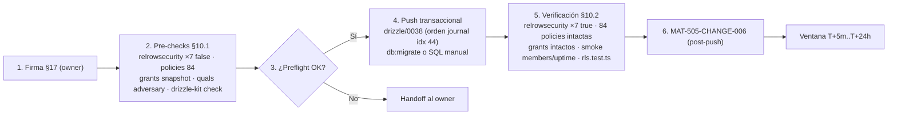

# CHANGE-006 — Paquete de aprobación: habilitación de RLS en 7 tablas (activación de policies existentes)

> **Estado:** ⏳ **PENDIENTE DE APROBACIÓN** [PROPOSED — NO desplegado]
> **Fecha de preparación:** 2026-10-01 · **Ejecución:** NO PROGRAMADA (ventana tras firma §17 + pre-checks §10.1)
> **Evidencia recopilada:** probes reales contra producción (grants/policies/`relrowsecurity` medidos 2026-10-01) + análisis de rutas de acceso del código — no de memoria

---

## 1. Scope y objetivos

**Scope:** cerrar el hueco de RSK-10 detectado durante los pre-checks de CHANGE-005: **7 tablas sin `ENABLE ROW LEVEL SECURITY` en producción** (de 70). En 5 de ellas existe **grant `SELECT` a `authenticated`** y una policy `SELECT` ya diseñada pero inerte (RLS off → la policy no se aplica); en las otras 2 no hay grant ni policy (fail-closed a nivel de grant).

**Objetivos:**
1. Que las 5 policies existentes pasen a **ser efectivas** (aislamiento member/owner real, no solo de papel). ✅ pendiente de firma
2. Dejar `exec_briefs`/`ai_eval_results` en **fail-closed** si algún día reciben grant. ✅ pendiente de firma
3. Medir y verificar: **63 → 70 tablas RLS** en prod, `pg_policies` = 84 sin cambios, grants sin cambios.

**Grupos (por naturaleza y riesgo):**

| Grupo | Tablas | Contenido | Riesgo |
|-------|--------|-----------|--------|
| **A — policy+grant inerte (5)** | `project_members`, `uptime_logs`, `anomaly_detections`, `adversary_engagements`, `adversary_task_nodes` | `ENABLE RLS` activa la policy `SELECT` existente (member/owner o `select_own`) | **MEDIUM-LOW** |
| **B — sin policy ni grant (2)** | `exec_briefs`, `ai_eval_results` | `ENABLE RLS` sin policy → fail-closed futuro; **0 cambio funcional hoy** (el grant ya bloquea) | **LOW** |

**Fuera de alcance:** grants nuevos, policies nuevas, `FORCE ROW LEVEL SECURITY`, cambios de código, tablas ya protegidas (63).

---

## 2. Requisitos

| REQ | Requisito | Cumplimiento |
|-----|-----------|--------------|
| REQ-400 | Todo cambio de producción exige CHANGE-ID | ✅ CHANGE-006 (§4) |
| REQ-401 | Baseline pre-producción antes del DDL | ⏳ §10.1 (pendiente de firma; snapshot previo ya medido: 63 RLS / 84 policies / 7× `false`) |
| REQ-402 | Migraciones versionadas y aprobadas | ⏳ fichero `drizzle/0038_enable_rls_change006.sql` + entrada de journal (idx 44) o SQL manual transaccional (§11) |
| REQ-403 | Rollback plan obligatorio | ✅ §5.4 (`DISABLE` ×7) |
| REQ-404 | Sin drift schema↔journal antes del push | ✅ `drizzle-kit check` "Everything's fine" (2026-10-01) + re-check tras registrar la entrada (§10.1) |
| REQ-405 | Ventana de observación post-push | ⏳ §6 (T+5m..T+24h) |
| REQ-406 | Verificación de RLS efectiva post-push | ⏳ §10.2 (`relrowsecurity=true` ×7 + smoke) |

---

## 3. Arquitectura del cambio (contexto → componentes → dependencias)

**Contexto (medido 2026-10-01 [VERIFIED]):**

| Tabla | Grant `authenticated` | RLS | Policy existente (inerte) |
|-------|----------------------|-----|---------------------------|
| `project_members` | SELECT | ❌ | `project_members_select_own` — `USING (user_id = uid)` (`0016` L408-412) |
| `uptime_logs` | SELECT | ❌ | `…_select_member_or_owner` — member/owner por `project_id` (`0016` L369-380) |
| `anomaly_detections` | SELECT | ❌ | `…_select_member_or_owner` — ídem (`0016` L386-397) |
| `adversary_engagements` | SELECT | ❌ | `…_select_member_or_owner` [qual = preflight §10.1] |
| `adversary_task_nodes` | SELECT | ❌ | `…_select_member_or_owner` [qual = preflight §10.1] |
| `exec_briefs` | **sin grant** | ❌ | sin policy |
| `ai_eval_results` | **sin grant** | ❌ | sin policy |

**Exposición actual:** cualquier sesión autenticada puede `SELECT` **todas las filas** de las 5 tablas con grant (PostgREST con la publishable key, estándar Supabase [ASSUMPTION de exposición; el grant+RLS-off está medido [VERIFIED]]): membresías de todos los proyectos, uptime/anomalías ajenos y resultados rojo-team de terceros.

**Análisis de rutas de acceso (por qué el ENABLE no rompe nada):**

| Ruta | Conexión | Efecto del ENABLE |
|------|----------|-------------------|
| `api/projects/[id]/members` (listado) | `directDb` (L60-71) — bypass RLS | ✅ sin cambio |
| `server/lib/rbac.ts`, `invitations.ts`, `project-access.ts`, `entitlements.ts` (L3) | `directDb` | ✅ sin cambio (escrituras/lecturas de membresía) |
| `server/security/weekly-digest.ts` (L11) | `directDb` | ✅ sin cambio |
| `api/public/v1/uptime` (L2, L32, L41) | `directDb` | ✅ sin cambio |
| Triggers/cron (`uptime`, `cleanup`, `anomaly`, `exec-brief`) | rol `postgres` (bypass RLS) | ✅ sin cambio |
| Lecturas autenticadas vía `withRLS`/PostgREST | `authenticated` | ⚠️ pasan a filtrar member/owner — **que es el diseño de las policies** |
| Funciones `0025` (`user_has_project_access`…) | `SECURITY DEFINER` (owner) | ✅ bypass RLS, sin recursión (`select_own` no referencia `projects`) |

**Dependencias:** `0016` ya contiene los `ENABLE` correspondientes (`uptime_logs` L357, `anomaly_detections` L360, `project_members` L402) que **nunca llegaron a ejecutarse** (fichero editado tras su aplicación — [ASSUMPTION] causa raíz); este cambio materializa esa intención + la de los `ENABLE` de `adversary_*`.

---

## 4. Registro de cambio (MAT-400)

| Campo | Valor |
|-------|-------|
| CHANGE-ID | **CHANGE-006** |
| DATABASE | Supabase (production, vía `DIRECT_URL`) |
| ENVIRONMENT | production |
| OBJECTS AFFECTED | 7 × `ALTER TABLE … ENABLE ROW LEVEL SECURITY` — **0 grants, 0 policies, 0 columnas** |
| REASON | 5 tablas con grant+policy pero RLS off (policies inertes → lectura cross-tenant); 2 sin RLS |
| ROOT CAUSE | `0016` editado tras su aplicación → sus `ENABLE` nunca ejecutados [ASSUMPTION]; `0036`/`0037` crearon tablas sin RLS (diseño del fichero) |
| EXPECTED RESULT | 63 → **70** tablas RLS en prod; `pg_policies` = 84 sin cambios; grants sin cambios; lecturas cross-tenant → 42501/vacío |
| BASELINE | ⏳ pre-checks §10.1 (snapshot de partida medido: 63/84/7×false) |
| TEST RESULTS | Análisis de rutas de acceso (§3) + `db:drift-check` 70/70 + `drizzle-kit check` fino (2026-10-01) + suite local 1.923/1.923 (HEAD, sin cambios de código) |
| RISK | **MEDIUM-LOW** (solo lecturas autenticadas cambian; escrituras intactas; precedente 0022 afectaba a escrituras) |
| ROLLBACK PLAN | §5.4 (`DISABLE` ×7, segundos) |
| APPROVAL | ⏳ **PENDIENTE — firma del owner en §17** |
| EXECUTION WINDOW | NO PROGRAMADA (ventana de baja actividad tras la firma) |

**Fuente:** plantilla MAT-400 de `PRODUCTION-CHANGE-VERIFICATION.md` §3 [VERIFIED].

---

## 5. Contenido del cambio (SQL exacto, verificado contra el disco)

### 5.1. Grupo A — activación de policies existentes (MEDIUM-LOW)

```sql
ALTER TABLE "project_members"     ENABLE ROW LEVEL SECURITY;
ALTER TABLE "uptime_logs"         ENABLE ROW LEVEL SECURITY;
ALTER TABLE "anomaly_detections"  ENABLE ROW LEVEL SECURITY;
ALTER TABLE "adversary_engagements" ENABLE ROW LEVEL SECURITY;
ALTER TABLE "adversary_task_nodes"  ENABLE ROW LEVEL SECURITY;
```

- Idempotente (`ENABLE` re-ejecutable sin efecto duplicado).
- **Prohibido `FORCE`** (aplicaría RLS al owner `postgres` → rompería la app entera).
- Efecto: las policies `SELECT` existentes pasan a filtrar. `project_members` → cada autenticado solo ve **su** membresía (cierra el metadata leak); las demás → solo filas de proyectos donde es owner/member.
- Preflight obligatorio: qual de las 2 policies `adversary_*` (§10.1, único texto no leído literalmente aún).

### 5.2. Grupo B — fail-closed futuro (LOW)

```sql
ALTER TABLE "exec_briefs"     ENABLE ROW LEVEL SECURITY;
ALTER TABLE "ai_eval_results" ENABLE ROW LEVEL SECURITY;
```

- Sin policy y sin grant a `authenticated` → **0 cambio funcional hoy**; si algún día se concede un grant sin policy, el acceso queda denegado (fail-closed).

### 5.3. Rollback (§5.4)

```sql
ALTER TABLE "<tabla>" DISABLE ROW LEVEL SECURITY;  -- ×7
```

- Reversión en segundos; no toca policies ni grants. No procedió salvo regresión detectada en la ventana T+24h.

---

## 6. Flujos (ejecución y verificación)

**FLOW-804 — Secuencia de ejecución post-aprobación** · Mermaid `flowchart`



**Reglas de ejecución [lección CHANGE-002/004]:** SQL versionado manual transaccional — **nunca** `drizzle-kit push` (trataría policies como drift).

---

## 7. APIs relacionadas (afectadas o verificables post-push)

| Superficie | Método | Efecto esperado |
|------------|--------|-----------------|
| `api/projects/[id]/members` | GET/POST | ✅ sin cambio (listado vía `directDb`); cross-tenant → vacío/403 |
| `api/public/v1/uptime` | GET | ✅ sin cambio (`directDb`) |
| PostgREST (`NEXT_PUBLIC_SUPABASE_URL`) | GET | ⚠️ lecturas cross-tenant de las 5 tablas → **42501/vacío** (deseado) |
| Triggers/cron (uptime, anomaly, exec-brief) | — | ✅ sin cambio (rol `postgres`) |
| `api/intelligence/*` (adversary) | GET/POST | ✅ sin cambio (escrituras en postgres) |

**Status codes:** 401/403 (sesión) · **42501** ahora también en lecturas ajenas a las 5 tablas (esperado, es el objetivo) · 429 sin cambios.

---

## 8. Seguridad (trust boundaries y controles)

| # | Límite / regla | Riesgo | Control | Estado |
|---|----------------|--------|---------|--------|
| TB-1 | `ENABLE` en 5 tablas con lecturas autenticadas | Romper lecturas legítimas si el qual es incorrecto | quals verificadas (`0016` L369-397) + `adversary_*` en preflight + smoke §10.2 | ⏳ preflight |
| TB-2 | `project_members` con policy `select_own` | Si alguna ruta `withRLS` listaba miembros ajenos, ahora los pierde (correcto); el listado oficial usa `directDb` | Verificado: ruta `members` L60-71 `directDb` | ✅ |
| TB-3 | `FORCE ROW LEVEL SECURITY` | Rompería al owner `postgres` (app entera caída) | **Prohibido explícitamente** (§5.1) | ✅ regla |
| TB-4 | Grants | Expandiría acceso | **0 grants nuevos** | ✅ regla |
| TB-5 | Amenaza que se cierra | Cross-tenant read (RSK-10): membresías, uptime, anomalías, resultados rojo-team | Policies pasan a ser efectivas | ⏳ post-push |
| TB-6 | Escrituras | RLS no aplica a `postgres`/`directDb` | Rutas de escritura inventariadas (§3) | ✅ |

---

## 9. Testing documentado (estrategia + casos + cobertura)

| Caso | Cobertura | Resultado |
|------|-----------|-----------|
| Rutas de acceso vs RLS | 7 tablas × rutas del código | ✅ sin escrituras autenticadas (§3) |
| Preflight | quals adversary + recuentos baseline | ⏳ §10.1 (post-firma) |
| `rls.test.ts` | policies member/owner | ✅ 5/5 en HEAD; re-ejecutar post-push |
| Smoke members | GET lista de owner completa + cross-tenant vacío | ⏳ §10.2 |
| Smoke uptime | lectura de proyecto propio vía app + 1 ciclo cron (escritura) | ⏳ §10.2 |
| `db:drift-check` / `drizzle-kit check` | schema↔BD y journal | ✅ 70/70 y "fine" (2026-10-01); re-check tras entrada 0038 |
| Suite completa | sin cambios de código | ✅ 1.923/1.923 (HEAD) — no re-obligatoria |

---

## 10. Checklist de verificación

### 10.1. Pre-checks baseline (read-only, ANTES del DDL — pendiente de firma)

| Check | Query / comando | Esperado |
|-------|-----------------|----------|
| RLS actual | `pg_class.relrowsecurity` ×7 | `false` ×7 (medido 2026-10-01) |
| Policies | `count(pg_policies)` | **84** (sin cambios posteriores) |
| Grants | `role_table_grills` de las 7 | SELECT→`authenticated` ×5; solo `postgres` ×2 |
| Quals | `pg_policies.qual` de `adversary_*` | member/owner por `project_id` |
| SinFORCE | `relforcerowsecurity` | `false` ×7 |
| Journal | `drizzle-kit check` (y tras registrar `0038`) | "Everything's fine" |
| Ledger | sha256 vs `drizzle.__drizzle_migrations` | `pending: []` hoy → `[0038…]` al registrar la entrada |
| Backup/PITR | confirmación del owner | ✅ 2026-10-01 (heredado de CHANGE-005) |

### 10.2. Verificación post-push (T+5m y T+24h)

| Check | Esperado |
|-------|----------|
| `relrowsecurity` ×7 | **`true`** (63 → 70) |
| `pg_policies` | 84, mismos nombres |
| `has_table_privilege` | idéntico al snapshot §10.1 |
| Smoke members (owner) | lista completa (vía `directDb`) |
| Smoke lectura cross-tenant (5 tablas) | vacío / 42501 |
| Smoke escritura cron uptime | 1 ciclo OK |
| `rls.test.ts` | 5/5 |
| `db:drift-check` / `drizzle-kit check` | sin drift / fine |

---

## 11. Deployment (ambientes, CI/CD, rollout)

| Ámbito | Detalle |
|--------|---------|
| Mecanismo primario | Fichero versionado **`drizzle/0038_enable_rls_change006.sql`** + entrada de journal (idx 44) → **`pnpm db:migrate`** (aplica solo la entrada pendiente: ledger ya está 44/44) |
| Mecanismo alternativo | SQL manual transaccional del mismo fichero (precedente CHANGE-002/003/004) si `drizzle-kit check` no permanece verde tras registrar la entrada |
| Prohibido | `drizzle-kit push` (drift de policies) · `FORCE` · grants nuevos |
| Ambientes | production (directo, con backup/PITR confirmado) |
| CI/CD | No bloqueado (docs + SQL; sin cambios de código) |
| Rollout | 7 statements en una transacción; observación T+5m..T+24h (§6) |

**Fuente:** `PRODUCTION-PUSH-FINAL-VALIDATION.md` §7 [VERIFIED] · lección CHANGE-002.

---

## 12. Operaciones (monitoring, runbooks, recovery)

| Área | Mecanismo |
|------|-----------|
| Monitoring post-push | Recuento §10.2 (T+5m) + revisión de errores 42501/500 en logs de app (T+24h) — un aumento de 42501 en lecturas **legítimas** sería la señal de regresión |
| Runbook | `docs/guides/troubleshooting.md` §Supabase (RLS) |
| Recovery | §5.4: `DISABLE` ×7 (segundos) |
| Alerting | SIEM/uptime exporter sin cambios |

---

## 13. Trazabilidad (REQ → COMP → TEST → DEP)

| ID | Tipo | Qué cubre |
|----|------|-----------|
| REQ-400..406 | Requisito | Gobernanza de cambios (§2) |
| MAT-400 | Registro | CHANGE-ID (§4) |
| MAT-501/502 | Baseline | Pre-checks / verificación (§10.1/§10.2) |
| MAT-505 | Reporte | Verificación post-push (§12) — `MAT-505-CHANGE-006`, a crear en la ejecución |
| MAT-500 | Gate | Origen del hallazgo (pre-checks de CHANGE-005) |
| RSK-10 | Riesgo | RLS incremental / exposición cross-tenant (RISK-REGISTER) |
| FLOW-804 | Flujo | Secuencia de ejecución (§6) |

---

## 14. Cross-check e inconsistencias

| Hipótesis | Verificación | Resultado |
|-----------|--------------|-----------|
| «Las policies de `0016` tienen el qual correcto» | Lectura literal L369-412 | ✅ member/owner y `select_own` correctos |
| «El listado de miembros rompería con `select_own`» | Ruta `members` L60-71 = `directDb` | ❌ no rompe (listado bypassa RLS) |
| «Hay escrituras autenticadas en las 7 tablas» | Grants (solo SELECT ×5) + rutas de código | ❌ ninguna — escrituras en `directDb`/`postgres` |
| «`user_has_project_access` se vería afectada» | `SECURITY DEFINER` (owner) | ❌ bypass RLS, sin recursión |
| «El ENABLE de `0016` ya estaba en vigor» | `relrowsecurity=false` medido | ❌ nunca se ejecutó (fichero editado tras aplicación) |
| CHANGE-005 lo dejó como candidato | `MAT-505-CHANGE-005` §12 (v1.0) | ✅ registro histórico; la decisión se materializa aquí |

---

## 15. Glosario

| Término | Definición |
|---------|------------|
| ENABLE vs FORCE | `ENABLE` aplica RLS a roles distintos del owner; `FORCE` también al owner → nunca usar en tablas que escribe `postgres` |
| Fail-closed | Sin policy aplicable → acceso denegado por defecto |
| Policy inerte | Policy definida en la BD con `relrowsecurity=false` → existe pero no filtra |
| PostgREST | API REST de Supabase; con grant y sin RLS expone todas las filas al rol |
| Qual | Cláusula `USING` de una policy (filtro de filas visibles) |
| RSK-10 | Riesgo de RLS incremental/desactualizado (RISK-REGISTER) |

---

## 16. Unknowns y supuestos

- **[UNKNOWN]** Qual literal de las 2 policies `adversary_*` → preflight obligatorio §10.1 antes del push.
- **[ASSUMPTION]** Causa raíz: `0016` editado tras su aplicación (los `ENABLE` nunca corrieron); coherente con los 2 hashes stale del ledger.
- **[ASSUMPTION]** PostgREST está expuesto con la publishable key (estándar Supabase; no probado directamente — el grant + RLS off sí está medido).
- **[ASSUMPTION]** Ninguna ruta `withRLS` futura necesita leer `project_members` más allá de la propia (si surge, añadir policy member/owner en su propio cambio).

---

## 17. Checklist de aprobación (para el owner)

| # | Requisito | Estado |
|---|-----------|--------|
| 1 | Inventario de las 7 tablas verificado contra disco + probes de producción (§3/§5) | ✅ |
| 2 | Análisis de rutas de acceso: 0 escrituras autenticadas (§3) | ✅ |
| 3 | Grupos, riesgo y rollback definidos (§5.4) | ✅ |
| 4 | Pre-checks baseline ejecutados (§10.1) | ⏳ pendiente de la firma |
| 5 | Ventana de rollout y plan de rollback revisados (§6/§11) | ⏳ pendiente de la firma |
| 6 | Backup/PITR confirmado | ✅ 2026-10-01 (heredado) |
| 7 | **FIRMA DE APROBACIÓN** (owner + fecha) | ⏳ **PENDIENTE** |

---

## 18. Versionado y verificación

| Versión | Fecha | Cambios | Estado |
|---------|-------|---------|--------|
| 1.0 | 2026-10-01 | Creación del paquete CHANGE-006 (7 × ENABLE RLS; grupos A/B) con evidencia de probes y análisis de rutas | ⏳ PENDIENTE DE FIRMA |

| Check | Resultado |
|-------|-----------|
| Quality gate `--min 80` | ✅ 90/100 PASS (2026-10-01) |
| Cross-check con PRODUCTION-CHANGE-VERIFICATION | CHANGE-006 → ⏳ fila + pendientes (§1) |
| Cross-check con MAT-500 | Hallazgo de §11.1 → CHANGE-006 abierto |
| Cross-check con FINAL-REPORT | Filas Migraciones/RLS → CHANGE-006 abierto |
| Cross-check con MAT-505-CHANGE-006 | Reporte de cierre, a crear en la ejecución |
| Cross-check con RISK-REGISTER | RSK-10 → se cierra con este cambio (63 → 70 RLS) |

---

**Fuentes primaries:** probes de producción 2026-10-01 (`information_schema.role_table_grants`, `pg_policies`, `pg_class.relrowsecurity` para las 7 tablas) · `drizzle/0016_rls_policies.sql` L355-413 (quals + ENABLE) · `src/app/api/projects/[id]/members/route.ts` L43-77 (`directDb`) · `src/server/lib/entitlements.ts` L3 · `src/server/security/weekly-digest.ts` L11 · `src/app/api/public/v1/v1-uptime` L2-41 · `src/server/lib/rbac.ts` / `invitations.ts` / `project-access.ts` (`directDb`) · `scripts/db/drift-check.mjs` (70/70) · `drizzle-kit check` · `docs/database/CHANGE-005-APPROVAL-PACKAGE.md` §10.3 · `docs/database/MAT-505-CHANGE-005-POST-PUSH-REPORT.md` §12 · `docs/risk/RISK-REGISTER.md` (RSK-10)
