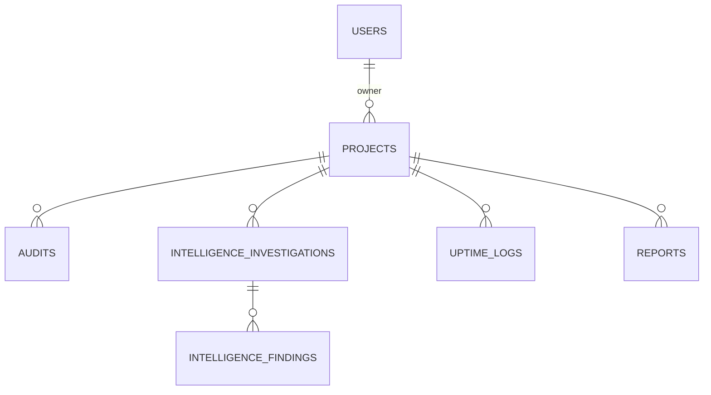

# DATA DICTIONARY — SCAUDIT Pro

> **Artefacto:** T03-01 del [Engineering Master Plan](../superpowers/plans/2026-08-01-engineering-master-plan.md)
> **Versión:** 1.0 · **Fecha:** 2026-08-02 · **Autor:** BATCH 03 (B03) · **Estado:** completado
> **Fuente real:** `src/shared/db/schemas/*.ts` (13 archivos) + migraciones `drizzle/*.sql` [VERIFIED]

---

## 1. Scope y objetivos

Este diccionario documenta **todas las tablas definidas en los schemas Drizzle** de SCAUDIT Pro,
generado a partir del código real (fuente única de verdad). No se inventa ninguna tabla, columna,
constraint ni índice: todo lo que figura aquí fue leído de los archivos `src/shared/db/schemas/*.ts`
(13 archivos, de los cuales 12 declaran tablas + `index.ts` que las re-exporta) y contrastado contra
las migraciones SQL en `drizzle/`.

**Objetivos:**
1. Inventario exhaustivo de tablas → 1.1 Resumen ejecutivo (MAT-020).
2. Por tabla: columnas, tipos, constraints, PK/FK, índices y comentarios de schema.
3. Tabla de contenido por dominio (intelligence, auth/core, monitoring, security, health, etc.).
4. Marcar `[UNKNOWN]` todo lo no verificable desde el código.

**NO alcance:** este artefacto **no modifica** esquemas ni migraciones (MODE A → B, análisis no
destructivo). Ver `docs/architecture/ENTERPRISE-ARCHITECTURE.md` §19 (inventario visual, FIG-006 ERD
núcleo) y §20 (trazabilidad).

---

## 2. Requisitos del diccionario

| ID | Requisito | Cumplido |
|----|-----------|----------|
| REQ-031 | Todas las tablas de `schemas/*.ts` documentadas | [VERIFIED] |
| REQ-032 | Columnas con tipo y constraints reales | [VERIFIED] |
| REQ-033 | PK/FK e índices desde código o migraciones | [VERIFIED] |
| REQ-034 | `[UNKNOWN]` para lo no verificable | [VERIFIED] |
| REQ-035 | Resumen: total de tablas, tabla→archivo, TOC por dominio | [VERIFIED] |

---

## 3. Resumen ejecutivo

- **Total de tablas documentadas:** **58** (el plan asumía 56 — ver §9 Hallazgos).
- **Archivos de schema:** 13 (`index.ts` + 12 archivos de dominio).
- **Enums Postgres declarados:** 25 (`role`, `sub_status`, `integration_type`, `integration_status`,
  `sync_status`, `audit_type`, `audit_status`, `device`, `rule_category`, `severity`, `ab_test_status`,
  `export_format`, `export_status`, `target_type`, `investigation_status`, `tool_run_status`,
  `finding_severity`, `project_role`, `engagement_status`, `task_node_status`, `task_node_result`).
- **FK totales (declaradas en schemas):** 70 [VERIFIED].
- **Índices declarados en schemas + migraciones:** 71 (detalle en `INDEX-STRATEGY.md`).

### 3.1 Tabla → archivo de schema (MAT-020)

| # | Tabla | Archivo de schema |
|---|-------|-------------------|
| 1 | `users` | `index.ts` |
| 2 | `projects` | `index.ts` |
| 3 | `subscription_plans` | `index.ts` |
| 4 | `subscriptions` | `index.ts` |
| 5 | `integrations` | `index.ts` |
| 6 | `integration_sync_logs` | `index.ts` |
| 7 | `integration_data_gsc` | `index.ts` |
| 8 | `integration_data_ga4` | `index.ts` |
| 9 | `integration_data_bing` | `index.ts` |
| 10 | `audits` | `index.ts` |
| 11 | `crawl_results` | `index.ts` |
| 12 | `internal_links` | `index.ts` |
| 13 | `performance_results` | `index.ts` |
| 14 | `audit_rules` | `index.ts` |
| 15 | `project_audit_rules` | `index.ts` |
| 16 | `issues` | `index.ts` |
| 17 | `keyword_targets` | `index.ts` |
| 18 | `rank_history` | `index.ts` |
| 19 | `competitors` | `index.ts` |
| 20 | `competitor_keywords` | `index.ts` |
| 21 | `backlinks` | `index.ts` |
| 22 | `backlink_history` | `index.ts` |
| 23 | `ab_tests` | `index.ts` |
| 24 | `ab_test_results` | `index.ts` |
| 25 | `heatmap_sessions` | `index.ts` |
| 26 | `schema_validations` | `index.ts` |
| 27 | `reports` | `index.ts` |
| 28 | `report_exports` | `index.ts` |
| 29 | `audit_logs` | `index.ts` |
| 30 | `uptime_logs` | `index.ts` |
| 31 | `web_vitals_logs` | `index.ts` |
| 32 | `intelligence_investigations` | `intelligence.ts` |
| 33 | `intelligence_tool_runs` | `intelligence.ts` |
| 34 | `intelligence_findings` | `intelligence.ts` |
| 35 | `intelligence_assets` | `intelligence.ts` |
| 36 | `intelligence_run_events` | `intelligence.ts` |
| 37 | `intelligence_usage_events` | `intelligence.ts` |
| 38 | `monitoring_schedules` | `monitoring.ts` |
| 39 | `monitoring_alerts` | `monitoring.ts` |
| 40 | `developer_api_keys` | `monitoring.ts` |
| 41 | `webhook_configs` | `monitoring.ts` |
| 42 | `security_audit_logs` | `security-audit.ts` |
| 43 | `siem_alert_logs` | `security-audit.ts` |
| 44 | `ai_health_logs` | `health.ts` |
| 45 | `push_subscriptions` | `push-subscriptions.ts` |
| 46 | `dns_history` | `history.ts` |
| 47 | `whois_history` | `history.ts` |
| 48 | `project_members` | `teams.ts` |
| 49 | `project_invitations` | `teams.ts` |
| 50 | `team_audit_logs` | `teams.ts` |
| 51 | `domain_technologies` | `technologies.ts` |
| 52 | `anomaly_detections` | `anomaly.ts` |
| 53 | `adversary_scenarios` | `adversary.ts` |
| 54 | `adversary_runs` | `adversary.ts` |
| 55 | `adversary_engagements` | `adversary.ts` |
| 56 | `adversary_task_nodes` | `adversary.ts` |
| 57 | `plugin_packages` | `plugins.ts` |
| 58 | `plugin_instances` | `plugins.ts` |

### 3.2 Tabla de contenido por dominio

| Dominio | Tablas (# del inventario) | Archivo(s) |
|---------|---------------------------|-----------|
| **Core / Billing** | users, projects, subscription_plans, subscriptions, integrations, integration_sync_logs, integration_data_gsc/ga4/bing | `index.ts` |
| **SEO / Auditoría** | audits, crawl_results, internal_links, performance_results, audit_rules, project_audit_rules, issues, keyword_targets, rank_history, competitors, competitor_keywords, backlinks, backlink_history, ab_tests, ab_test_results, heatmap_sessions, schema_validations, reports, report_exports | `index.ts` |
| **Auditoría de app** | audit_logs | `index.ts` |
| **Monitoring / RUM** | uptime_logs, web_vitals_logs | `index.ts` |
| **Intelligence** | intelligence_investigations, intelligence_tool_runs, intelligence_findings, intelligence_assets, intelligence_run_events, intelligence_usage_events | `intelligence.ts` |
| **History (DNS/WHOIS)** | dns_history, whois_history | `history.ts` |
| **Monitoring (schedules/alerts/API)** | monitoring_schedules, monitoring_alerts, developer_api_keys, webhook_configs | `monitoring.ts` |
| **Seguridad** | security_audit_logs, siem_alert_logs | `security-audit.ts` |
| **Push** | push_subscriptions | `push-subscriptions.ts` |
| **Health de IA** | ai_health_logs | `health.ts` |
| **Teams / RBAC** | project_members, project_invitations, team_audit_logs | `teams.ts` |
| **Technologies** | domain_technologies | `technologies.ts` |
| **Anomaly** | anomaly_detections | `anomaly.ts` |
| **Adversary / PTT** | adversary_scenarios, adversary_runs, adversary_engagements, adversary_task_nodes | `adversary.ts` |
| **Plugins** | plugin_packages, plugin_instances | `plugins.ts` |

---

## 4. Arquitectura de la capa de datos

Acceso a datos (interfaces reales [VERIFIED]): `src/shared/db/index.ts` (`db`, `directDb`),
`src/shared/db/rls.ts` (`withRLS`, establece `request.jwt.claims` + `SET ROLE authenticated`),
`src/shared/db/schemas/index.ts` (export de todas las tablas). La API pública usa `directDb`
(`src/app/api/public/v1/*`); el core usa `db` (Postgres directo) y `withRLS` (aislamiento multi-tenant).

---

## 5. Diccionario por tabla

> Convención de tipos: `uuid` · `text` · `integer` · `bigint` · `numeric(p,s)` · `date` ·
> `timestamp(tz)` · `jsonb` · `boolean` · `text[]` (array) · `<enum>` (pgEnum). Los índices listados
> son los declarados en schema + migraciones `drizzle/*.sql` [VERIFIED]. `FK` indica `references(...)`.

### 5.1 Core / Billing

**1. `users`** (`index.ts:22`) — comentario de schema: "References auth.users" (identidad externa Supabase).
| Columna | Tipo | Constraints | Notas |
|---------|------|-------------|-------|
| id | uuid | **PK** | identity externa auth.users |
| email | text | NOT NULL, **UNIQUE** | |
| full_name | text | | |
| avatar_url | text | | |
| role | role enum | NOT NULL, default `client` | `admin`/`manager`/`client` |
| plan_id | uuid | FK → subscription_plans.id | sin onDelete (NO ACTION) |
| preferences | jsonb | default `{}` | |
| created_at / updated_at | timestamp(tz) | default now() | |
| last_sign_in_at / confirmed_at / deleted_at | timestamp(tz) | | soft-delete |
| Índices | | PK en id; unique en email | |

**2. `projects`** (`index.ts:38`)
| Columna | Tipo | Constraints |
|---------|------|-------------|
| id | uuid | **PK** default gen_random_uuid() |
| owner_id | uuid | FK → users.id **ON DELETE CASCADE**, NOT NULL |
| name / domain | text | NOT NULL |
| timezone | text | default `UTC` |
| crawl_depth | integer | default 3 |
| user_agent | text | default `StrategicAuditBot/1.0` |
| respects_robots_txt | boolean | default true |
| data_retention_days | integer | default 365 |
| auto_delete_audits | boolean | default false |
| settings | jsonb | default `{}` |
| created_at / updated_at | timestamp(tz) | default now() |
| deleted_at | timestamp(tz) | soft-delete |
| Índices | | `idx_projects_owner` (migración 0015) |

**3. `subscription_plans`** (`index.ts:56`) — sin FK salientes.
| Columna | Tipo | Constraints |
|---------|------|-------------|
| id | uuid | **PK** |
| name | text | NOT NULL |
| max_projects / max_keywords / max_backlink_checks / crawl_limit_monthly | integer | NOT NULL |
| features | jsonb | NOT NULL |
| price_monthly / price_yearly | numeric(10,2) | nullable |

**4. `subscriptions`** (`index.ts:70`)
| Columna | Tipo | Constraints |
|---------|------|-------------|
| id | uuid | **PK** |
| project_id | uuid | FK → projects.id **CASCADE**, NOT NULL |
| plan_id | uuid | FK → subscription_plans.id, NOT NULL |
| status | sub_status enum | NOT NULL |
| current_period_start / current_period_end | timestamp(tz) | NOT NULL |
| ended_at / cancel_at | timestamp(tz) | |
| created_at / updated_at | timestamp(tz) | default now() |
| Índices | | `idx_subscriptions_project`, `idx_subscriptions_plan` (0015) |

**5. `integrations`** (`index.ts:84`)
| Columna | Tipo | Constraints |
|---------|------|-------------|
| id | uuid | **PK** |
| project_id | uuid | FK → projects.id **CASCADE**, NOT NULL |
| type | integration_type enum | NOT NULL |
| credentials_encrypted | text | credenciales cifradas |
| status | integration_status enum | NOT NULL, default `active` |
| last_sync_at / created_at / updated_at | timestamp(tz) | |
| Constraints | | **UNIQUE(project_id, type)** |

**6. `integration_sync_logs`** (`index.ts:98`)
| Columna | Tipo | Constraints |
|---------|------|-------------|
| id | uuid | **PK** |
| integration_id | uuid | FK → integrations.id **CASCADE**, NOT NULL |
| status | sync_status enum | nullable |
| records_synced | integer | |
| error_message | text | |
| started_at / completed_at / created_at | timestamp(tz) | |
| Índices | | `idx_integration_sync_logs_integration` (0019) |

**7. `integration_data_gsc`** (`index.ts:112`) — **UNIQUE(project_id, date, url)**.
| Columna | Tipo | Constraints |
|---------|------|-------------|
| id | uuid | **PK** |
| project_id | uuid | FK → projects.id **CASCADE**, NOT NULL |
| date | date | NOT NULL |
| url | text | NOT NULL |
| clicks / impressions | integer | default 0 |
| ctr | numeric(8,4) | default `0` |
| position | numeric(6,2) | default `0` |

**8. `integration_data_ga4`** (`index.ts:127`) — **UNIQUE(project_id, date, page_path)**.
| Columna | Tipo | Constraints |
|---------|------|-------------|
| id | uuid | **PK** |
| project_id | uuid | FK → projects.id **CASCADE**, NOT NULL |
| date | date | NOT NULL |
| page_path | text | NOT NULL |
| active_users / conversions | integer | default 0 |
| engagement_rate | numeric(6,4) | default `0` |
| custom_dimensions | jsonb | default `{}` |

**9. `integration_data_bing`** (`index.ts:142`) — **UNIQUE(project_id, date, url)**. Misma estructura que `integration_data_gsc`.

### 5.2 SEO / Auditoría

**10. `audits`** (`index.ts:157`)
| Columna | Tipo | Constraints |
|---------|------|-------------|
| id | uuid | **PK** |
| project_id | uuid | FK → projects.id **CASCADE**, NOT NULL |
| type | audit_type enum | NOT NULL |
| status | audit_status enum | NOT NULL, default `pending` |
| config | jsonb | default `{}` |
| started_at / completed_at | timestamp(tz) | |
| error_message | text | |
| created_by | uuid | FK → users.id **SET NULL** |
| Índices | | `idx_audits_project`, `idx_audits_created_by` (0015) |

**11. `crawl_results`** (`index.ts:171`) — FK audit CASCADE; `h1_tags`/`h2_tags`/`external_links` son `text[]`; `og_tags`/`images` jsonb; `is_orphan` default false; `robots_txt_allowed` default true. Índice `idx_crawl_results_audit` (0015).

**12. `internal_links`** (`index.ts:195`) — FK `crawl_id` → crawl_results.id CASCADE; source/target url NOT NULL; `is_follow` default true. Índice `idx_internal_links_crawl` (0015).

**13. `performance_results`** (`index.ts:207`) — FK audit CASCADE; `device` device enum NOT NULL; métricas CWV `lcp/inp/cls/ttfb/fcp` numeric; `lighthouse_score` integer; `crux_data`/`raw_report` jsonb. Índice `idx_performance_results_audit` (0015).

**14. `audit_rules`** (`index.ts:225`) — `code` text **UNIQUE** NOT NULL; `category` rule_category NOT NULL; `severity` severity NOT NULL; `recommendation` text; `default_config` jsonb. Sin FK.

**15. `project_audit_rules`** (`index.ts:238`) — FK project CASCADE + FK rule CASCADE, ambos NOT NULL; **UNIQUE(project_id, rule_id)**.

**16. `issues`** (`index.ts:251`)
| Columna | Tipo | Constraints |
|---------|------|-------------|
| id | uuid | **PK** |
| project_id | uuid | FK → projects.id **CASCADE**, NOT NULL |
| audit_id | uuid | FK → audits.id **SET NULL** |
| rule_id | uuid | FK → audit_rules.id **SET NULL** |
| url | text | |
| severity | severity enum | NOT NULL |
| category | rule_category enum | NOT NULL |
| title / description | text | NOT NULL |
| recommendation | text | |
| fixed | boolean | default false |
| created_at / updated_at | timestamp(tz) | default now() |
| Índices | | `idx_issues_project`, `idx_issues_audit`, `idx_issues_rule` (0015) |

**17. `keyword_targets`** (`index.ts:268`) — FK project CASCADE NOT NULL; `keyword` NOT NULL; `device` default `desktop`; **UNIQUE(project_id, keyword, location, device)**.

**18. `rank_history`** (`index.ts:283`) — FK keyword_targets CASCADE NOT NULL; **UNIQUE(keyword_id, checked_at)**; `cpc` numeric(10,6); `competition` numeric(4,2); `checked_at` date NOT NULL.

**19. `competitors`** (`index.ts:298`) — FK project CASCADE NOT NULL; **UNIQUE(project_id, domain)**; `backlinks_count` bigint (mode number).

**20. `competitor_keywords`** (`index.ts:311`) — FK competitor CASCADE NOT NULL; `checked_at` date NOT NULL. Índice `idx_competitor_keywords_competitor` (0015).

**21. `backlinks`** (`index.ts:323`) — FK project CASCADE NOT NULL; **UNIQUE(project_id, source_url, target_url)**; flags `is_nofollow/is_ugc/is_sponsored`; `toxicity_score` numeric(5,2); `first_detected_at`/`last_seen_at`/`lost_at` date.

**22. `backlink_history`** (`index.ts:344`) — FK backlink CASCADE NOT NULL; `checked_at` date NOT NULL. Índice `idx_backlink_history_backlink` (0015).

**23. `ab_tests`** (`index.ts:355`) — FK project CASCADE NOT NULL; `variants` jsonb NOT NULL; `status` default `draft`; `uplift` numeric(8,4); `confidence` numeric(5,4). Índice `idx_ab_tests_project` (0019).

**24. `ab_test_results`** (`index.ts:374`) — FK test CASCADE NOT NULL; `conversion_rate` numeric(8,4); `date` NOT NULL. Índice `idx_ab_test_results_test` (0015).

**25. `heatmap_sessions`** (`index.ts:386`) — FK project CASCADE NOT NULL; `session_data` jsonb NOT NULL; `anonymized_ip` text. Índice `idx_heatmap_sessions_project` (0015).

**26. `schema_validations`** (`index.ts:396`) — FK project CASCADE NOT NULL; `json_ld` jsonb; `is_valid` boolean; `errors` jsonb; `validated_at` timestamp. Índice `idx_schema_validations_project` (0015).

**27. `reports`** (`index.ts:407`)
| Columna | Tipo | Constraints |
|---------|------|-------------|
| id | uuid | **PK** |
| project_id | uuid | FK → projects.id **CASCADE**, NOT NULL |
| name | text | NOT NULL |
| description | text | |
| configuration | jsonb | NOT NULL |
| schedule_cron | text | |
| last_generated_at | timestamp(tz) | |
| created_by | uuid | FK → users.id **SET NULL** |
| Índices | | `idx_reports_project`, `idx_reports_created_by` (0019) |

**28. `report_exports`** (`index.ts:424`) — FK report CASCADE NOT NULL; `format` export_format NOT NULL; `status` default `pending`; `file_url` text. Índice `idx_report_exports_report` (0015).

### 5.3 Auditoría de app y Monitoring / RUM

**29. `audit_logs`** (`index.ts:435`) — FK user **SET NULL**, FK project **SET NULL**; `action` NOT NULL; `entity_type`/`entity_id`; `old_data`/`new_data` jsonb; `ip_address`/`user_agent`. Índices `idx_audit_logs_project_created`, `idx_audit_logs_user` (0015). Escritura real: `src/shared/lib/logger.ts:55`.

**30. `uptime_logs`** (`index.ts:450`)
| Columna | Tipo | Constraints |
|---------|------|-------------|
| id | uuid | **PK** |
| project_id | uuid | FK → projects.id **CASCADE**, NOT NULL |
| is_up | boolean | NOT NULL |
| status_code | integer | |
| response_time_ms | integer | |
| error_message | text | |
| checked_at | timestamp(tz) | NOT NULL, default now() |
| Índices | | `idx_uptime_logs_project_checked`, `idx_uptime_logs_checked` (0015) |
| RLS | | **RLS ENABLED** policy `uptime_logs_select_member_or_owner` (migración 0016) |

**31. `web_vitals_logs`** (`index.ts:461`) — FK project CASCADE NOT NULL; `device_type` default `desktop`; métricas `lcp/inp/cls/ttfb/fcp/fid` numeric; `page_views` default 1; jsonb `errors/interactions/resources/connection/memory/timing/raw_payload`; `recorded_at` NOT NULL default now(). Índice `idx_web_vitals_project_recorded` (0019).

### 5.4 Intelligence

**32. `intelligence_investigations`** (`intelligence.ts:28`)
| Columna | Tipo | Constraints |
|---------|------|-------------|
| id | uuid | **PK** |
| project_id | uuid | FK → projects.id **CASCADE**, NOT NULL |
| owner_id | uuid | FK → users.id **SET NULL** |
| title | text | NOT NULL |
| target | text | NOT NULL |
| normalized_target | text | NOT NULL |
| target_type | target_type enum | NOT NULL |
| status | investigation_status enum | NOT NULL, default `draft` |
| score | integer | |
| summary | text | |
| metadata | jsonb | default `{}` |
| created_at / updated_at / completed_at | timestamp(tz) | |
| Índices | | `idx_intel_investigations_project_created`, `idx_intel_investigations_project_status` (0003), `idx_intel_investigations_target` (0003) |

**33. `intelligence_tool_runs`** (`intelligence.ts:50`)
| Columna | Tipo | Constraints |
|---------|------|-------------|
| id | uuid | **PK** |
| investigation_id | uuid | FK → intelligence_investigations.id **CASCADE** (nullable, 0005 drop NOT NULL) |
| project_id | uuid | FK → projects.id **CASCADE**, NOT NULL |
| tool_id / category | text | NOT NULL |
| status | tool_run_status enum | NOT NULL, default `queued` |
| input | jsonb | NOT NULL |
| output / error / cache_key | text/jsonb | |
| duration_ms / cost_units | integer | cost_units NOT NULL default 1 |
| started_at / completed_at / created_at | timestamp(tz) | |
| Índices | | `idx_intel_tool_runs_investigation` (0003), `idx_intel_tool_runs_tool_created` (0003), `idx_intel_tool_runs_tool_investigation`, `idx_intel_tool_runs_investigation_created`, `idx_intel_tool_runs_project_created` (0014) |

**34. `intelligence_findings`** (`intelligence.ts:75`)
| Columna | Tipo | Constraints |
|---------|------|-------------|
| id | uuid | **PK** |
| investigation_id | uuid | FK → intelligence_investigations.id **CASCADE**, NOT NULL |
| tool_run_id | uuid | FK → intelligence_tool_runs.id **SET NULL** |
| project_id | uuid | FK → projects.id **CASCADE**, NOT NULL |
| severity | finding_severity enum | NOT NULL |
| confidence | numeric(4,3) | NOT NULL, default `0.700` |
| title / description | text | NOT NULL |
| recommendation | text | |
| evidence | jsonb | default `{}` |
| affected_asset | text | |
| created_at | timestamp(tz) | default now() |
| Índices | | `idx_intel_findings_project_severity` (0003), `idx_intel_findings_investigation_severity`, `idx_intel_findings_investigation_created` (0014) |

**35. `intelligence_assets`** (`intelligence.ts:95`)
| Columna | Tipo | Constraints |
|---------|------|-------------|
| id | uuid | **PK** |
| project_id | uuid | FK → projects.id **CASCADE**, NOT NULL |
| investigation_id | uuid | FK → intelligence_investigations.id **CASCADE** |
| asset_type / value | text | NOT NULL |
| ip | text | comentario: "Stored as text for high reliability" |
| first_seen_at / last_seen_at | timestamp(tz) | default now() |
| metadata | jsonb | default `{}` |
| Constraints | | **UNIQUE(project_id, asset_type, value)** `uniq_intel_asset_project_type_value` (0003) |
| Índices | | `idx_intel_assets_investigation`, `idx_intel_assets_project_last_seen` (0014) |

**36. `intelligence_run_events`** (`intelligence.ts:112`) — FK investigation CASCADE NOT NULL + FK tool_run CASCADE (nullable); `event_type`/`message` NOT NULL; `payload` jsonb. Índice `idx_intel_run_events_investigation_created` (0014).

**37. `intelligence_usage_events`** (`intelligence.ts:125`) — FK project CASCADE NOT NULL + FK user **SET NULL**; `tool_id`/`target_hash` NOT NULL; `units` default 1; `allowed` NOT NULL; `reason` text. Índices `idx_intel_usage_project_created`, `idx_intel_usage_user` (0019).

### 5.5 History (DNS/WHOIS)

**38. `dns_history`** (`history.ts:23`) — FK project CASCADE NOT NULL + FK investigation CASCADE (nullable); `record_type`/`query`/`value`/`snapshot_hash` NOT NULL; `ttl` integer; `snapshot_date`/`first_seen_at` NOT NULL default now(); `metadata` jsonb. Índices `idx_dns_history_project_record_type`, `idx_dns_history_query_created`, `idx_dns_history_snapshot_date` (0010).

**39. `whois_history`** (`history.ts:46`) — FK project CASCADE NOT NULL + FK investigation CASCADE (nullable); `domain` NOT NULL; `registrar`/`abuse_contact`/`registrant_org` text; `created_date`/`expires_date`/`updated_date` timestamp; `status`/`nameservers` jsonb (arrays); `snapshot_hash` NOT NULL; `diff_summary` text; `original_snapshot` jsonb; `snapshot_date`/`first_seen_at` NOT NULL. Índices `idx_whois_history_project_domain`, `idx_whois_history_domain_snapshot`, `idx_whois_history_expires_date` (0010).

### 5.6 Monitoring (schedules/alerts/API)

**40. `monitoring_schedules`** (`monitoring.ts:8`) — FK project CASCADE NOT NULL; `enabled` NOT NULL default true; `interval` varchar(50) NOT NULL default `weekly` (comentario: daily/weekly/monthly); `last_run_at`/`next_run_at` timestamp. Índices `idx_monitoring_schedules_project` (0004), `idx_monitoring_schedules_next_run` (0019).

**41. `monitoring_alerts`** (`monitoring.ts:23`) — FK project CASCADE NOT NULL + FK schedule CASCADE (nullable); `title`/`message` NOT NULL; `severity` varchar(50) `$type<"critical"|"warning"|"info">` NOT NULL default `warning`; `resolved` NOT NULL default false; `resolved_at` timestamp. Índices `idx_monitoring_alerts_project_resolved` (0004), `idx_monitoring_alerts_project_created` (0019).

**42. `developer_api_keys`** (`monitoring.ts:39`) — FK user CASCADE NOT NULL; `name` NOT NULL; `key_prefix` varchar(16) NOT NULL (`sa_live_`); `hashed_key` NOT NULL (SHA-256); `scope` jsonb (`string[]`) default `[]`; `expires_at`/`last_used_at`. Índices `idx_developer_api_keys_user` (0004), `idx_developer_api_keys_hashed` **UNIQUE** (0019).

**43. `webhook_configs`** (`monitoring.ts:55`) — FK project CASCADE NOT NULL; `name`/`url` NOT NULL; **`secret_token` text NOT NULL** (⚠ secreto; ver hallazgo); `events` jsonb (`string[]`); `active` NOT NULL default true. Índice `idx_webhook_configs_project` (0004).

### 5.7 Seguridad, Push, Health

**44. `security_audit_logs`** (`security-audit.ts:11`) — **sin FKs**; `event_type` NOT NULL; `ip` NOT NULL default `unknown`; `user_id` uuid (sin FK); `path`/`method` NOT NULL con defaults; `metadata` jsonb; `created_at` NOT NULL. Índices `idx_sec_audit_event_type_created`, `idx_sec_audit_ip_created` (0006).

**45. `siem_alert_logs`** (`security-audit.ts:33`) — **sin FKs**; `rule_event_type`/`ip`/`label` NOT NULL; `severity` text NOT NULL default `warning`; `count`/`window_minutes` integer NOT NULL; `target`/`status` NOT NULL; `response_code` integer; `error_message` text; `metadata` jsonb; `detected_at`/`created_at` NOT NULL. Índices `idx_siem_logs_created`, `idx_siem_logs_severity_created`, `idx_siem_logs_rule_type_created` (0007).

**46. `push_subscriptions`** (`push-subscriptions.ts:21`) — FK user CASCADE (nullable); **`endpoint` UNIQUE NOT NULL**; `subscription` jsonb NOT NULL; `user_agent` text; **`active` text NOT NULL default `'true'` (⚠ text, no boolean)**; created/updated_at. Índices `idx_push_subs_user`, `idx_push_subs_active` (0009).

**47. `ai_health_logs`** (`health.ts:24`) — **sin FKs**; `checked_at` NOT NULL default now(); `overall_status` NOT NULL default `healthy`; `task_type` NOT NULL default `all`; `models_healthy/failed/total` integer NOT NULL default 0; `avg_latency_ms` integer; `model_results` jsonb (array tipado); `trigger_source` NOT NULL default `cron`; `metadata` jsonb. Índices `idx_ai_health_checked_at`, `idx_ai_health_overall_status`, `idx_ai_health_task_type_checked` (0008).

### 5.8 Teams / RBAC

**48. `project_members`** (`teams.ts:16`) — FK project CASCADE NOT NULL + FK user CASCADE NOT NULL; `role` project_role enum NOT NULL default `viewer`; **UNIQUE(project_id, user_id)**; índice `idx_project_members_user` (0019). **RLS ENABLED** policy `project_members_select_own` (0016).

**49. `project_invitations`** (`teams.ts:29`) — FK project CASCADE NOT NULL + FK invited_by user **SET NULL**; `email` NOT NULL; `role` default `viewer`; `token` NOT NULL **UNIQUE**; `expires_at` NOT NULL; **UNIQUE(project_id, email)**; índice `idx_project_invitations_invited_by` (0019).

**50. `team_audit_logs`** (`teams.ts:44`) — FK project CASCADE NOT NULL + FK actor user **SET NULL**; `action` NOT NULL; `target_email` text; `role` project_role enum. Índice `idx_team_audit_logs_project` (0019).

### 5.9 Technologies, Anomaly, Adversary, Plugins

**51. `domain_technologies`** (`technologies.ts:6`) — FK project CASCADE NOT NULL; `domain`/`tech_name`/`category` NOT NULL; `confidence` numeric(4,3) NOT NULL default `0.900`; `detected_at`. Índice `idx_domain_technologies_project` (0019).

**52. `anomaly_detections`** (`anomaly.ts:26`) — FK project CASCADE NOT NULL + FK investigation **SET NULL**; `metric_type`/`severity` text `$type` (enums TS); `actual_value`/`expected_value` numeric(12,4) NOT NULL; `z_score` numeric(8,3) NOT NULL; `window_size_hours` default 24; `label` NOT NULL; `detail`; `detected_at`/`resolved_at`; `metadata`. Índices `idx_anomaly_project_metric`, `idx_anomaly_severity_detected`, `idx_anomaly_detected_at`, `idx_anomaly_unresolved` (0011). **RLS ENABLED** policy `anomaly_detections_select_member_or_owner` (0016).

**53. `adversary_scenarios`** (`adversary.ts:18`) — catálogo MITRE (template); `mitre_id`/`mitre_tactic`/`mitre_technique`/`name`/`description` NOT NULL; `executor_type` default `manual`; `executor_command`; `severity` default `medium`; `prerequisites`/`tags` text[]; **UNIQUE `uniq_adversary_mitre_id`** (0018). Índice `idx_adversary_mitre_tactic` (0012). ⚠ En DB existe además `idx_adversary_mitre_id` NO único (0012) que el schema actual NO declara (ver §9).

**54. `adversary_runs`** (`adversary.ts:42`) — FK scenario CASCADE (nullable), FK project CASCADE NOT NULL, FK investigation **SET NULL**, FK engagement **SET NULL** (migración 0017); `status` default `pending`; `result` (`detected|missed|error`); `output`/`error`/`detected_by`; `score_impact`; `started_at`/`completed_at`. Índices `idx_adversary_runs_project_status`, `idx_adversary_runs_scenario` (0012), `idx_adversary_runs_engagement` (0017).

**55. `adversary_engagements`** (`adversary.ts:87`) — raíz del árbol PTT (Pentesting Task Tree); FK project CASCADE NOT NULL + FK owner user **SET NULL**; `title`/`target` NOT NULL; `target_type` default `domain`; `status` engagement_status default `draft`; `strategy`/`metadata` jsonb; `score`/`summary`; `started_at`/`completed_at`. Índices `idx_adv_engagements_project_status`, `idx_adv_engagements_project_created` (0017).

**56. `adversary_task_nodes`** (`adversary.ts:114`) — FK engagement CASCADE NOT NULL; FK `parent_id` **auto-referencial** (→ adversary_task_nodes.id, **SET NULL**); FK scenario **SET NULL**; `mitre_id`; `title` NOT NULL; `status` task_node_status default `pending`; `result` task_node_result default `pending`; `depth`/`sort_order` default 0; `input`/`output`/`metadata` jsonb. Índices `idx_adv_task_nodes_engagement`, `idx_adv_task_nodes_engagement_parent`, `idx_adv_task_nodes_engagement_status`, `idx_adv_task_nodes_scenario`, `idx_adv_task_nodes_mitre` (0017).

**57. `plugin_packages`** (`plugins.ts:16`) — `name` NOT NULL **UNIQUE**; `version`/`author`/`description`/`category` NOT NULL; `tags`/`permissions` text[]; `dependencies`/`input_schema`/`output_schema` jsonb; `risk_level` default `passive`; `downloads_count` default 0; `rating` numeric(3,2); `is_official`/`is_enabled` NOT NULL default false/true. Índices `idx_plugin_packages_category`, `idx_plugin_packages_name` (0013).

**58. `plugin_instances`** (`plugins.ts:47`) — FK package CASCADE NOT NULL; FK project CASCADE (**nullable**); FK user CASCADE NOT NULL; `enabled` NOT NULL default true; `config` jsonb; `last_used_at`. Índices `idx_plugin_instances_user`, `idx_plugin_instances_package_project` (0013).

---

## 6. Flujos de acceso a datos (API)

Interfaces de acceso documentadas (todas [VERIFIED]):

| Capa | Módulo | Auth | Métodos |
|------|--------|------|---------|
| DB core | `src/shared/db/index.ts` | servicio | `db` / `directDb` (Postgres) |
| RLS helper | `src/shared/db/rls.ts` | `withRLS()` — claims JWT + `SET ROLE` | aislamiento multi-tenant |
| API pública v1 | `src/app/api/public/v1/*` | API keys (`developer_api_keys`) | GET/POST con `directDb` |
| API interna | `src/app/api/intelligence/*`, `src/app/api/security/*`, etc. | sesión Supabase | GET/POST/PUT/DELETE |
| Cron / Trigger.dev | `src/app/api/cron/*`, `src/trigger/*` | CRON_SECRET / Trigger.dev | jobs programados |

Errores: las rutas devuelven `AppError`/`NextResponse.json({error})` con 401/404/429/500 [VERIFIED].

---

## 7. Seguridad del modelo de datos

- RLS habilitado únicamente en: `uptime_logs`, `anomaly_detections`, `project_members` (migración 0016) [VERIFIED].
- El resto de tablas no tiene RLS ni policies declaradas en migraciones → acceso solo vía servicio
  (Postgres directo) o pendiente de habilitar [UNKNOWN si hay policy fuera de `drizzle/`].
- `webhook_configs.secret_token` se almacena en claro en la tabla (migración 0004 no lo cifra) → ver
  VULN-002 en THREAT-REGISTER (B02).
- `developer_api_keys.hashed_key` almacena SHA-256 (nunca el secreto en claro) [VERIFIED].

---

## 8. Verificación, testing y operaciones

**Testing del diccionario:** conteo real con `pgTable(` por archivo → 58 tablas únicas [VERIFIED].
Verificación cruzada contra `drizzle/*.sql` (`CREATE TABLE`, `CREATE INDEX`) para constraints e índices
[VERIFIED]. Quality gate: `node scripts/quality-gate.mjs docs/database/DATA-DICTIONARY.md --min 80`.

**Deployment/CI:** los schemas son la fuente para `drizzle-kit generate`/`push` (`drizzle.config.ts`).
Este batch NO ejecutó `db:generate` (escribe migraciones → MODE C prohibido); ver `INDEX-STRATEGY.md`
§Estado de migraciones.

**Operaciones:** la higiene de `drizzle/meta/` se documenta en `INDEX-STRATEGY.md` (MAT-022). Cualquier
cambio de schema debe regenerar snapshot y migración en el mismo commit.

---

## 9. Hallazgos y validación cruzada (cross-check)

| # | Hallazgo | Evidencia | Severidad |
|---|----------|-----------|-----------|
| 1 | **58 tablas reales vs 56 asumidas** en el plan (B03 T03-01) | conteo `pgTable(` por archivo [VERIFIED] | info |
| 2 | `push_subscriptions.active` es `text` (default `'true'`), no `boolean` | `push-subscriptions.ts:37` | LOW |
| 3 | `plugin_instances.project_id` es nullable (FK opcional) | `plugins.ts:50` | info |
| 4 | `idx_adversary_mitre_id` NO único existe en DB (migración 0012) pero NO está declarado en el schema (que solo declara `uniq_adversary_mitre_id` 0018) | `drizzle/0012_adversary_scenarios.sql:20` vs `adversary.ts:37` | MEDIUM (drift schema↔DB) |
| 5 | `adversary_runs.engagement_id` FK declarada en schema pero su tabla fue creada después (0017); orden de migraciones invertido (0012 crea runs sin engagement, 0017 altera) | `0012_adversary_scenarios.sql` vs `0017_adversary_ptt.sql` | MEDIUM |
| 6 | Triggers/funciones de quota (`check_project_quota`, `check_audit_quota`, `tr_check_*`) existen en SQL (0001/0002) pero NO están representados en los schemas Drizzle → `drizzle-kit push` no los gestiona | `drizzle/0002_quota_enforcement.sql` | MEDIUM |
| 7 | `security_audit_logs`, `siem_alert_logs`, `ai_health_logs` sin FK → no escalan a proyecto/usuario (consultas de tenant vía proyecto requieren joins indirectos) | schemas `security-audit.ts`, `health.ts` | info |
| 8 | `0001_quota_enforcement.sql` huérfana (no en `_journal.json`) e idéntica a `0002_quota_enforcement.sql` (SHA-256 igual) | comparación `Get-FileHash` [VERIFIED] | MEDIUM (ver T03-03) |

**Cross-check no resuelto:** el estado aplicado real de la DB de producción (qué migraciones corrieron,
si los triggers de quota están activos) **no es verificable desde el repo** → [UNKNOWN].

---

## 10. Unknowns y asunciones

- Estado aplicado real de la DB (producción/preview) → [UNKNOWN].
- `auth.users` (identidad Supabase) está fuera del repo → [UNKNOWN].
- Existencia en DB de `idx_adversary_mitre_id` depende de que 0012 se haya aplicado → [UNKNOWN hasta aplicar/verificar].
- Policies RLS no incluidas en `drizzle/` (si existen vía Supabase console) → [UNKNOWN].
- `users.plan_id` sin `onDelete` → comportamiento de borrado de plan → [UNKNOWN] (NO ACTION en Postgres).
- Datos semilla (`src/shared/db/seed.ts`) no documentados por tabla → [UNKNOWN] fuera de alcance.

---

## 11. Glosario

| Término | Definición |
|---------|-----------|
| **PK** | Primary Key (clave primaria) |
| **FK** | Foreign Key (`references()`) con su `onDelete` |
| **RLS** | Row Level Security (Postgres) |
| **PTT** | Pentesting Task Tree (árbol de tareas de adversary) |
| **RUM** | Real User Monitoring (web_vitals_logs) |
| **ttz** | `timestamp with time zone` |
| **jsonb** | JSON binario (Postgres) |

---

## 12. Trazabilidad

| ID | Tipo | Artefacto |
|----|------|-----------|
| REQ-031..035 | Requisitos | §2 de este documento |
| MAT-020 | Matriz | §3.1 tabla→archivo |
| FIG-006 | ERD núcleo | `docs/architecture/ENTERPRISE-ARCHITECTURE.md` (referencia) |
| FIG-010 | ERD completo por dominio | `docs/database/ERD.md` (T03-02) |
| MAT-021 | Índices por tabla | `docs/database/INDEX-STRATEGY.md` (T03-03) |
| MAT-022 | Estado de migraciones | `docs/database/INDEX-STRATEGY.md` (T03-03) |
| FLOW-010..015 | Data lineage | `docs/database/ERD.md` §4 (T03-02) |
