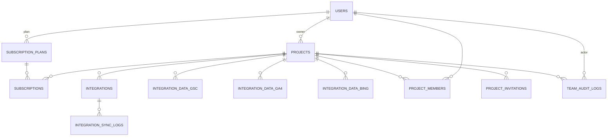
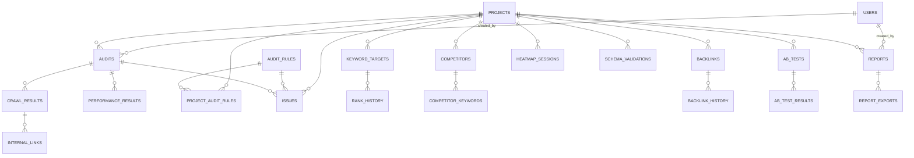
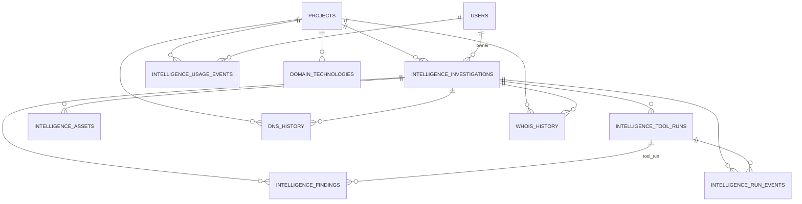
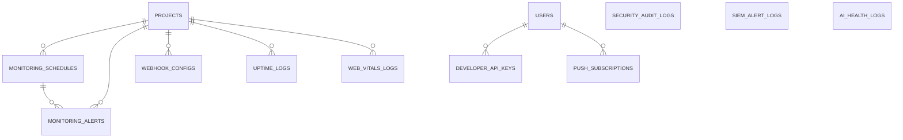
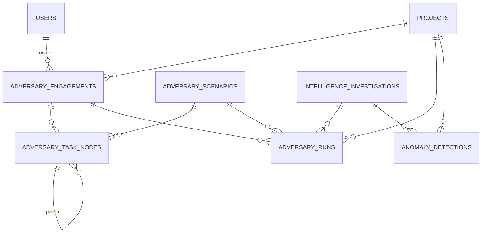
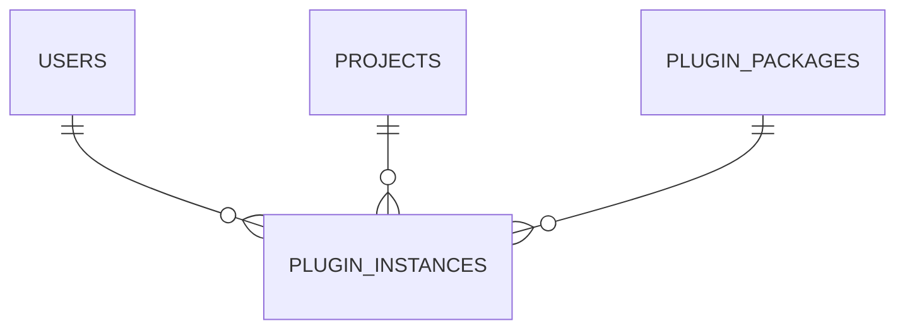

# ERD — Modelo de Entidad-Relación y Data Lineage — SCAUDIT Pro

> **Artefacto:** T03-02 del [Engineering Master Plan](../superpowers/plans/2026-08-01-engineering-master-plan.md)
> **Versión:** 1.0 · **Fecha:** 2026-08-02 · **Autor:** BATCH 03 (B03) · **Estado:** completado
> **Fuente real:** FK declaradas en `src/shared/db/schemas/*.ts` (fuente de verdad) [VERIFIED]

---

## 1. Scope y objetivos

Documentar el **ERD completo** de las 58 tablas reales del sistema (ver `DATA-DICTIONARY.md`) y el
**data lineage** de los 6 flujos críticos: `findings`, `uptime_logs`, `ai_health_logs`, `dns/whois
history`, `adversary_runs`, `siem_alert_logs`. Las relaciones se toman **exclusivamente** de las FK
declaradas en los schemas Drizzle; una relación no verificable se marca `[UNKNOWN]`, nunca se inventa.

**Objetivos:**
1. ERD `erDiagram` mermaid por dominio con entidades y relaciones reales.
2. Verificación de relaciones en el código (FK declaradas).
3. Data lineage SOURCE → INGEST → VALIDATE → TRANSFORM → DB → SERVICE → API → UI → REPORT
   (FLOW-010..015) con archivos reales como evidencia.

**NO alcance:** no modifica esquemas ni migraciones (MODE A → B).

---

## 2. Requisitos

| ID | Requisito | Cumplido |
|----|-----------|----------|
| REQ-036 | ERD completo con todas las entidades reales (nombres snake_case y relaciones por FK) | [VERIFIED] |
| REQ-037 | Relaciones verificadas en los schemas (fuente de verdad) | [VERIFIED] |
| REQ-038 | Lineage para los 6 flujos críticos con archivos como evidencia | [VERIFIED] |
| REQ-039 | Relaciones no verificables marcadas `[UNKNOWN]` | [VERIFIED] |

---

## 3. ERD completo por dominio (FIG-010)

> Notación mermaid `erDiagram`. Cada dominio es un diagrama independiente (≤60 líneas para legibilidad).
> Cardinalidades reales según FK + `onDelete` de los schemas [VERIFIED].

### 3.1 Dominio Core / Billing

### 3.2 Dominio SEO / Auditoría

### 3.3 Dominio Intelligence + History + Technologies

### 3.4 Dominio Monitoring / Seguridad / Health

> `security_audit_logs`, `siem_alert_logs` y `ai_health_logs` **no tienen FK** en sus schemas
> [VERIFIED]; se muestran como entidades standalone. `project_members` también tiene RLS (0016).

### 3.5 Dominio Adversary / Anomaly

### 3.6 Dominio Plugins

---

## 4. Data Lineage de flujos críticos (FLOW-010..015)

Convención de evidencia: cada eslabón cita archivo real [VERIFIED]. `DB` = tabla (migración que la crea).
Cuando un eslabón no aplica se marca `N/A`; cuando no es verificable, `[UNKNOWN]`.

### FLOW-010 — Findings (`intelligence_findings`)

| Paso | Componente | Evidencia |
|------|-----------|-----------|
| SOURCE | Herramientas externas de inteligencia (reconocimiento, escáneres, LLM) | `src/server/intelligence/executors/*` |
| INGEST | Insert de findings tras ejecutar tools | `src/app/api/intelligence/route.ts:332`, `investigations/route.ts:309`, `runs/route.ts:164`, `scenario-runner.ts:176` |
| VALIDATE | Normalización de target + egress-guard | `src/server/intelligence/security/egress-guard.ts` |
| TRANSFORM | Mapeo de hallazgos → severidad/confianza/evidencia | `src/app/api/intelligence/route.ts` (parse/mapping) |
| DB | `intelligence_findings` | migración `0003_outstanding_agent_brand.sql` |
| SERVICE | Lectura por investigación/proyecto | `src/app/api/intelligence/copilot/route.ts:42`, `brief/route.ts:29`, `assets/graph/route.ts:33` |
| API | GET endpoints internos + públicos | `/api/intelligence`, `/api/intelligence/investigations`, `/api/public/v1/intelligence` |
| UI | Tarjetas de hallazgos y contadores | `src/app/components/tabs/IntelligenceTab.tsx:2176`, `LiveMetricsBar.tsx:42` |
| REPORT | Reporte PDF white-label | `src/app/api/reports/pdf/route.tsx:127` |

### FLOW-011 — `uptime_logs`

| Paso | Componente | Evidencia |
|------|-----------|-----------|
| SOURCE | Probe HTTP HEAD sobre `projects.domain` | `src/trigger/uptime.trigger.ts:32`, `src/app/api/cron/uptime/route.ts:51` |
| INGEST | Cron Vercel (`CRON_SECRET`) + Trigger.dev `*/15 * * * *` | `src/app/api/cron/uptime/route.ts:72`, `src/trigger/uptime.trigger.ts:53` |
| VALIDATE | `normalizeUrl` + `validateSafeUrl` (egress-guard) | `src/trigger/uptime.trigger.ts:29` |
| TRANSFORM | statusCode → `is_up`, `response_time_ms` | `uptime.trigger.ts:40-51` |
| DB | `uptime_logs` | migraciones `0001_silky_ikaris.sql` (tabla), `0015_core_fk_indexes.sql` (índices), `0016_rls_policies.sql` (RLS) |
| SERVICE | Detector de anomalías y benchmark | `src/server/intelligence/anomaly/detector.ts:117`, `src/app/api/benchmarking/route.ts:69` |
| API | Live metrics por proyecto/tiempo | `src/app/api/intelligence/live/route.ts:24-32` |
| UI | Barra de métricas en vivo | `src/app/components/LiveMetricsBar.tsx` |
| REPORT | Dashboard (N/A reporte exportable); retención 30 días | `src/trigger/cleanup.trigger.ts:17` |

### FLOW-012 — `ai_health_logs`

| Paso | Componente | Evidencia |
|------|-----------|-----------|
| SOURCE | Modelos IA configurados (OpenRouter/ai-router) | `src/shared/ai/ai-router.ts` [REF] |
| INGEST | Ejecución del health check por cron/manual/CI | `src/app/api/ai/healthcheck/route.ts` |
| VALIDATE | Timeout → `degraded`, error → `failed` | `healthcheck/route.ts:156-171` |
| TRANSFORM | Agregación `overallStatus`, `modelResults[]`, `avgLatencyMs` | `healthcheck/route.ts:177-192` (persistResult) |
| DB | `ai_health_logs` | migración `0008_ai_health_logs.sql` |
| SERVICE | Acciones del dashboard de salud | `src/app/ai/health/actions.ts:53` |
| API | Server actions (no REST expuesto) | `src/app/ai/health/actions.ts` |
| UI | Dashboard de salud de IA (tiempo real) | `src/app/ai/health/page.tsx`, `health-dashboard.client.tsx` |
| REPORT | Agregados diarios healthy/degraded/unhealthy | `src/app/ai/health/actions.ts:81-92` |

### FLOW-013 — DNS / WHOIS history

| Paso | Componente | Evidencia |
|------|-----------|-----------|
| SOURCE | Resolvers DNS + RDAP (`rdap.org/domain/...`) | `src/server/intelligence/executors/dns-executors.ts`, `whois-executors.ts:64` |
| INGEST | `persistDnsSnapshot` / `persistWhoisSnapshot` (fire-and-forget) | `whois-executors.ts:91`, `history/dns-history.ts:43`, `history/whois-history.ts:60` |
| VALIDATE | Circuit breaker + `safeFetch` (egress-guard) | `whois-executors.ts:63`, `src/server/intelligence/security/egress-guard.ts` |
| TRANSFORM | `parseRdapToSnapshot` + `snapshot_hash` + diff | `whois-executors.ts:88`, `history/whois-history.ts` (diff) |
| DB | `dns_history`, `whois_history` | migración `0010_dns_whois_history.sql` |
| SERVICE | Consultas timeline/first_seen/last_snapshot | `src/server/intelligence/history/dns-history.ts:86-145`, `whois-history.ts:86-121` |
| API | Timeline y comparación de snapshots | `src/app/api/intelligence/history/route.ts` |
| UI | Vistas de timeline en tab de Intelligence | `src/app/components/tabs/IntelligenceTab.tsx` |
| REPORT | Pipeline de verificación (comparativo) | `src/server/intelligence/history/pipeline-test.ts` |

### FLOW-014 — `adversary_runs`

| Paso | Componente | Evidencia |
|------|-----------|-----------|
| SOURCE | Catálogo MITRE ATT&CK (escenarios sandbox) | `src/server/intelligence/adversary/catalog.ts` |
| INGEST | `runScenario` → insert + update de runs | `scenario-runner.ts:131,236`; trigger cron `0 */6 * * *` `src/trigger/adversary.trigger.ts:26` |
| VALIDATE | Allowlist de executors + egress-guard (sandbox) | `adversary.trigger.ts:61`, `scenario-runner.ts` |
| TRANSFORM | Ejecución → `result` (detected/missed/error) + `scoreImpact` | `scenario-runner.ts:176-245` |
| DB | `adversary_runs` | migraciones `0012_adversary_scenarios.sql`, `0017_adversary_ptt.sql` |
| SERVICE | Orquestador de escenarios por proyecto | `src/server/intelligence/adversary/scenario-runner.ts` |
| API | Iniciar/actualizar runs | `src/app/api/intelligence/adversary/route.ts:148` |
| UI | Tab Adversary (lanzar escenarios) | `src/app/components/tabs/AdversaryTab.tsx:63,88,119` |
| REPORT | Mapa de cobertura MITRE | `src/app/mitre-coverage/page.tsx` |

### FLOW-015 — `siem_alert_logs`

| Paso | Componente | Evidencia |
|------|-----------|-----------|
| SOURCE | `security_audit_logs` (auth failures, CSP violations, rate limit, open redirect) | `src/server/security/siem-exporter.ts` |
| INGEST | `runSiemExport()` cada 5 min (Trigger.dev) | `src/trigger/siem.trigger.ts:21-29`, `siem-exporter.ts:319` |
| VALIDATE | Reglas de correlación (6 reglas × destinos) | `siem-exporter.ts` (reglas), `src/app/api/security/siem/test/route.ts` |
| TRANSFORM | Agregación count/window + severidad + target | `siem-exporter.ts:319` |
| DB | `siem_alert_logs` | migración `0007_siem_alert_logs.sql` |
| SERVICE | Exporter SIEM + heartbeat | `siem-exporter.ts:382-384` |
| API | Listar/filtrar alertas; run/test manual | `src/app/api/security/siem-alerts/route.ts`, `siem/run/route.ts`, `siem/test/route.ts` |
| UI | Vista de auditoría de seguridad (tabla SIEM) | `src/app/security/audit/page.tsx:1193` |
| REPORT | Export a Slack/PagerDuty/Splunk (reporte externo) | `siem-exporter.ts` (destinos webhook) |

---

## 5. Verificación de relaciones (cross-check)

- Las 70 FK del diccionario corresponden 1:1 a `references()` en los schemas [VERIFIED].
- `adversary_runs.engagement_id` → `adversary_engagements.id` declarada en `adversary.ts:47`; la tabla
  engagement fue creada en la migración 0017, después de `adversary_runs` (0012) → orden histórico
  invertido (no hay `ALTER` de FK en 0017) [OBSERVED].
- `adversary_task_nodes.parent_id` es auto-referencial (`AnyPgColumn`) → self-FK [VERIFIED].
- Relaciones no declaradas como FK (p.ej. `security_audit_logs.user_id`, `siem_alert_logs.ip` →
  tenant) se consideran **no verificables** → [UNKNOWN].

---

## 6. Seguridad

- Diagramas y lineage incluyen tablas con **RLS habilitada** (`uptime_logs`, `anomaly_detections`,
  `project_members`, migración 0016) [VERIFIED].
- `withRLS()` es el control de aislamiento multi-tenant para endpoints internos
  (`src/shared/db/rls.ts`); el resto de tablas no expone policies → acceso vía servicio [VERIFIED].
- Validación de egress (SSRF) presente en ingest de flujos SOURCE externos
  (`src/server/intelligence/security/egress-guard.ts`) [VERIFIED].

---

## 7. Testing y operaciones

- Validación del ERD: verificación manual de cada `references()` contra los 13 schemas [VERIFIED].
- No se generó diagrama desde la DB (no hay acceso); el ERD refleja **schemas**, no el estado aplicado
  → posibles diferencias vs DB real marcadas en `INDEX-STRATEGY.md` §Estado de migraciones.
- Quality gate: `node scripts/quality-gate.mjs docs/database/ERD.md --min 80`.
- Mantenimiento: cada cambio de schema debe actualizar este documento en el mismo batch.

---

## 8. Unknowns y asunciones

- Cardinalidad real de filas (1..N) y volúmenes → [UNKNOWN] (sin datos de DB).
- Relaciones conceptuales sin FK (p.ej. `siem_alert_logs` ↔ proyecto) → [UNKNOWN].
- Detalle de endpoints de egress (lista CIDR) → referirse a egress-guard [UNKNOWN detalle].
- Estado aplicado de migraciones en DB → [UNKNOWN] (ver T03-03).

---

## 9. Glosario

| Término | Definición |
|---------|-----------|
| **ERD** | Entity-Relationship Diagram |
| **Lineage** | Trazabilidad de origen→destino de un dato |
| **RDAP** | Registration Data Access Protocol (WHOIS moderno) |
| **SIEM** | Security Information and Event Management |
| **CWV** | Core Web Vitals |

---

## 10. Trazabilidad

| ID | Tipo | Artefacto |
|----|------|-----------|
| REQ-036..039 | Requisitos | §2 de este documento |
| FIG-010 | ERD completo por dominio | §3 (6 diagramas) |
| FLOW-010..015 | Data lineage crítico | §4 |
| MAT-024 | Matriz de lineage | §4 (tablas por flujo) |
| CMP-040..045 | Componentes de flujo | §4 (evidencia por archivo) |
