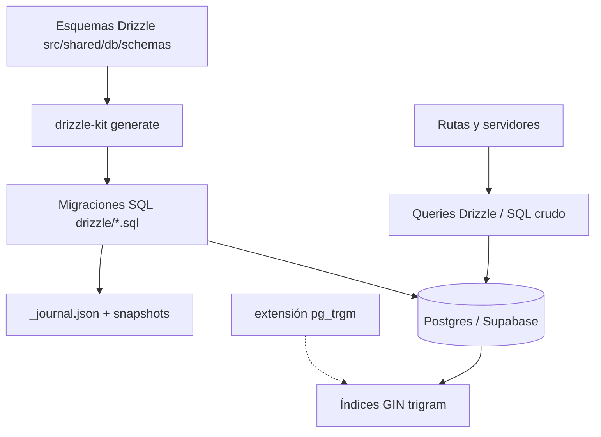

# INDEX-STRATEGY.md — Estrategia de índices y estado de migraciones

- **Artefacto**: MAT-021 (índices) / MAT-022 (estado de migraciones)
- **Batch**: B03 — Base de Datos y Datos
- **Fecha**: 2026-08-02
- **Fuentes**: esquemas Drizzle (`src/shared/db/schemas/*.ts`), archivos SQL (`drizzle/*.sql`), `drizzle/meta/_journal.json`, `drizzle/meta/*_snapshot.json`, consultas reales del código
- **Modo**: análisis/documentación (A→B). No se ejecutó `db:generate` (escribe archivos); solo el chequeo read-only `drizzle-kit check`.

---

## 1. Estado de migraciones (MAT-022)

### 1.1. Journal vs. disco

El `_journal.json` contiene **20 entradas (0000–0019)**. En disco hay **21 archivos SQL**.

| Fuente | Archivos | Detalle |
|---|---|---|
| Journal (idx 0–19) | 20 | 0000–0019 según `_journal.json` v7 |
| Disco (`drizzle/`) | 20 | `0001_quota_enforcement.sql` **eliminado** (MAT-201 resuelto) |
| **Huérfano** | 0 | — |

### 1.2. Hallazgo MAT-201 — archivo huérfano `0001_quota_enforcement.sql` — RESUELTO ✅ (MODE C, post-B03)

- SHA-256 de `0001_quota_enforcement.sql` = `DF6768825C3EB5E94989F21EE329993A44C6DD2394B9CABF4F8D063F2670E266`
- SHA-256 de `0002_quota_enforcement.sql` = **idéntico** (`DF676882...E266`).
- El archivo **byte-idéntico** `0002_quota_enforcement.sql` **sí** está en el journal (idx 2).
- El generado por Drizzle en el slot 0001 es `0001_silky_ikaris.sql` (migración real de `users.onboarded`).
- **Remediación (commit `2f977c3`):** `0001_quota_enforcement.sql` fue **eliminado**. Era una copia manual duplicada de `0002`, idempotente (`IF NOT EXISTS`) y ausente del journal.

### 1.3. Snapshots — estado post-higiene ✅

| Snapshot | Estado |
|---|---|
| 0000, 0001, 0003, 0004, 0005, 0006 | Presentes y coherentes (0006: 42 tablas + enums) |
| **0010** | **ELIMINADO (commit `2f977c3`)** — estaba malformed (`id="0010_dns_whois_history"` texto, 2 tablas, sin enums) y su contenido no era recuperable de forma fiable |
| **0019** | **REGENERADO (commit `2f977c3`)** — snapshot del esquema Drizzle completo (58 tablas, 21 enums), `prevId` encadenado al snapshot 0006 |
| 0002, 0007, 0008, 0009, 0011–0018 | Faltantes (12) — no bloquean `check`/`generate` |

- `pnpm exec drizzle-kit check` (read-only) → **`Everything's fine 🐶🔥`** tras la higiene.
- `pnpm exec drizzle-kit generate` → **`No schema changes, nothing to migrate`** (esquema actual == snapshot 0019). `db:generate` queda **desbloqueado** para futuras migraciones.
- Nota: el snapshot 0019 regenerado proviene de los esquemas TS (fuente de verdad declarativa). Los snapshots intermedios faltantes no son regenerables sin BD de referencia; se documentan como limitación, no como bloqueo.

### 1.4. Migraciones especiales (RLS y best practices)

| Migración | Contenido |
|---|---|
| 0016 `_rls_policies.sql` | RLS `ENABLE` en `uptime_logs`, `anomaly_detections`, `project_members`; policies owner/member SELECT; grants `authenticated` |
| 0019 `_supabase_best_practices_indexes.sql` | 10 índices nuevos (gaps de 0015/0004) — en journal idx 19 y reflejados en esquemas |
| 0012 `_adversary_scenarios.sql` | `idx_adversary_mitre_id` **no único** — ver MAT-205 |

---

## 2. Índices existentes por tabla (MAT-021)

Inventario consolidado (índices DDL + únicos implícitos de `unique()`). Origen por migración.

| # | Tabla | Índice(s) | Tipo | Migración |
|---|---|---|---|---|
| 1 | `projects` | `idx_projects_owner (owner_id)` | btree | 0015 |
| 2 | `subscriptions` | `idx_subscriptions_project (project_id)`, `idx_subscriptions_plan (plan_id)` | btree | 0015 |
| 3 | `subscription_plans` | `uniq (code)` | unique | 0000 |
| 4 | `users` | `uniq (email)` | unique | 0000 |
| 5 | `integrations` | `uniq (project_id, type)` | unique | 0000 |
| 6 | `integration_data_gsc/ga4/bing` | `uniq (integration_id, ...)` por fuente | unique | 0000 |
| 7 | `integration_sync_logs` | `idx_integration_sync_logs_integration (integration_id)` | btree | 0019 |
| 8 | `audits` | `idx_audits_project (project_id)`, `idx_audits_created_by (created_by)` | btree | 0015 |
| 9 | `audit_rules` | `uniq (code)` | unique | 0000 |
| 10 | `project_audit_rules` | `uniq (project_id, rule_id)` | unique | 0000 |
| 11 | `crawl_results` | `idx_crawl_results_audit (audit_id)` | btree | 0015 |
| 12 | `internal_links` | `idx_internal_links_crawl (crawl_id)` | btree | 0015 |
| 13 | `performance_results` | `idx_performance_results_audit (audit_id)` | btree | 0015 |
| 14 | `issues` | `idx_issues_project (project_id)`, `idx_issues_audit (audit_id)`, `idx_issues_rule (rule_id)` | btree | 0015 |
| 15 | `keyword_targets` | `uniq (project_id, keyword)` | unique | 0000 |
| 16 | `rank_history` | `uniq (keyword_id, checked_at)` | unique | 0000 |
| 17 | `competitors` | `uniq (project_id, domain)` | unique | 0000 |
| 18 | `competitor_keywords` | `idx_competitor_keywords_competitor (competitor_id)` | btree | 0015 |
| 19 | `backlinks` | `uniq (crawl_id, url)` | unique | 0000 |
| 20 | `backlink_history` | `idx_backlink_history_backlink (backlink_id)` | btree | 0015 |
| 21 | `ab_tests` | `idx_ab_tests_project (project_id)` | btree | 0019 |
| 22 | `ab_test_results` | `idx_ab_test_results_test (test_id)` | btree | 0015 |
| 23 | `heatmap_sessions` | `idx_heatmap_sessions_project (project_id)` | btree | 0015 |
| 24 | `schema_validations` | `idx_schema_validations_project (project_id)` | btree | 0015 |
| 25 | `reports` | `idx_reports_project (project_id)`, `idx_reports_created_by (created_by)` | btree | 0019 |
| 26 | `report_exports` | `idx_report_exports_report (report_id)` | btree | 0015 |
| 27 | `audit_logs` | `idx_audit_logs_project_created (project_id, created_at)`, `idx_audit_logs_user (user_id)` | btree | 0015 |
| 28 | `uptime_logs` | `idx_uptime_logs_project_checked (project_id, checked_at)`, `idx_uptime_logs_checked (checked_at)` | btree | 0015 |
| 29 | `web_vitals_logs` | `idx_web_vitals_project_recorded (project_id, recorded_at)` | btree | 0019 |
| 30 | `intelligence_investigations` | `idx_intel_investigations_project_created`, `..._project_status`, `..._target` | btree | 0003 |
| 31 | `intelligence_tool_runs` | `..._investigation`, `..._tool_created`, `..._tool_investigation`, `..._investigation_created`, `..._project_created` | btree | 0003/0014 |
| 32 | `intelligence_findings` | `..._project_severity`, `..._investigation_severity`, `..._investigation_created` | btree | 0003/0014 |
| 33 | `intelligence_assets` | `uniq (project_id, asset_type, value)`; `..._investigation`, `..._project_last_seen` | unique + btree | 0003/0014 |
| 34 | `intelligence_run_events` | `idx_intel_run_events_investigation_created` | btree | 0014 |
| 35 | `intelligence_usage_events` | `..._project_created`, `..._user` | btree | 0019 |
| 36 | `monitoring_schedules` | `idx_monitoring_schedules_project (project_id)`, `idx_monitoring_schedules_next_run (next_run_at)` | btree | 0004/0019 |
| 37 | `monitoring_alerts` | `idx_monitoring_alerts_project_resolved (project_id, resolved)`, `idx_monitoring_alerts_project_created (project_id, created_at)` | btree | 0004/0019 |
| 38 | `developer_api_keys` | `idx_developer_api_keys_user (user_id)`, `uniq hashed (hashed_key)` | btree + unique | 0004/0019 |
| 39 | `webhook_configs` | `idx_webhook_configs_project (project_id)` | btree | 0004 |
| 40 | `security_audit_logs` | `idx_sec_audit_event_type_created (event_type, created_at)`, `idx_sec_audit_ip_created (ip, created_at)` | btree | 0006 |
| 41 | `siem_alert_logs` | `idx_siem_logs_created`, `..._severity_created`, `..._rule_type_created` | btree | 0007 |
| 42 | `ai_health_logs` | `idx_ai_health_checked_at`, `..._overall_status`, `..._task_type_checked` | btree | 0008 |
| 43 | `push_subscriptions` | `idx_push_subs_user (user_id)`, `idx_push_subs_active (active)` | btree | 0009 |
| 44 | `dns_history` | `idx_dns_history_project_record_type`, `..._query_created`, `..._snapshot_date` | btree | 0010 |
| 45 | `whois_history` | `idx_whois_history_project_domain`, `..._domain_snapshot`, `..._expires_date` | btree | 0010 |
| 46 | `project_members` | `uniq (project_id, user_id)`; `idx_project_members_user (user_id)` | unique + btree | 0000/0019 |
| 47 | `project_invitations` | `uniq (project_id, email)`, `uniq token`; `idx_project_invitations_invited_by (invited_by)` | unique + btree | 0000/0019 |
| 48 | `team_audit_logs` | `idx_team_audit_logs_project (project_id)` | btree | 0019 |
| 49 | `domain_technologies` | `idx_domain_technologies_project (project_id)` | btree | 0019 |
| 50 | `anomaly_detections` | `..._project_metric`, `..._severity_detected`, `..._detected_at`, `..._unresolved` | btree | 0011 |
| 51 | `adversary_scenarios` | `idx_adversary_mitre_tactic`, `uniq (mitre_id)`; **`idx_adversary_mitre_id` no-único (MAT-205)** | btree | 0012/0018 |
| 52 | `adversary_runs` | `..._project_status`, `..._scenario`, `..._engagement` | btree | 0012/0017 |
| 53 | `adversary_engagements` | `..._project_status`, `..._project_created` | btree | 0017 |
| 54 | `adversary_task_nodes` | `..._engagement`, `..._engagement_parent`, `..._engagement_status`, `..._scenario`, `..._mitre` | btree | 0017 |
| 55 | `plugin_packages` | `idx_plugin_packages_category`, `idx_plugin_packages_name`; `uniq (name)` | btree + unique | 0013 |
| 56 | `plugin_instances` | `idx_plugin_instances_user`, `idx_plugin_instances_package_project` | btree | 0013 |

---

## 3. Candidatos [RECOMMENDED] con evidencia en consultas reales

| ID | Índice propuesto | Consulta real que lo motiva | Cobertura actual |
|---|---|---|---|
| **REC-01** | `intelligence_findings(tool_run_id)` | FK `tool_run_id` con `onDelete: SET NULL`; borrar un `tool_runs` fuerza seq scan sobre `findings` (patrón FK sin índice). | Ninguna |
| **REC-02** | `security_audit_logs` GIN `pg_trgm(ip)` | Filtro `ilike(securityAuditLogs.ip, "%x%")` con comodín inicial — `src/app/api/security/audit-logs/route.ts:36`. | `idx_sec_audit_ip_created` no sirve para `%…%` |
| **REC-03** | `security_audit_logs((metadata->>'action'))` | Filtro `metadata->>'action'` — `src/app/api/security/audit-logs/route.ts:50-54`. | Ninguna |
| **REC-04** | `siem_alert_logs` GIN `pg_trgm(ip)` | Filtro `ilike(... "%ip%")` — `src/app/api/security/siem-alerts/route.ts:39`. | Ninguna |
| **REC-05** | `dns_history(project_id, query, record_type, snapshot_date DESC)` | `getDnsRecordHistory` — `src/server/intelligence/history/dns-history.ts:122-129` (equality project+query+recordType, order snapshotDate DESC). | `project_record_type` y `query_created` parciales |
| **REC-06** | `whois_history(project_id, domain, snapshot_date DESC)` | `src/server/intelligence/history/whois-history.ts:110` y `:121` (equality project+domain, order snapshotDate DESC limit 2). | `project_domain` sin orden por fecha |
| **REC-07** | `dns_history(project_id, query, snapshot_date DESC)` | Cambios de tipo de registro — `dns-history.ts:135-138` (groupBy record_type) y diff `:144-145`. | Parcial por `project_record_type` |

> El snapshot del live (`src/app/api/intelligence/live/route.ts:59-88`) filtra `intelligence_findings(investigation_id, severity)` — **ya cubierto** por `idx_intel_findings_investigation_severity` (0014); sin candidato nuevo.
>
> `uptime_logs(project_id, checked_at)` y `web_vitals_logs(project_id, recorded_at)` (usados por detector de anomalías y benchmarking) ya existen — cubiertos.

### 3.1. Coste/beneficio

- REC-01..REC-07 son de **solo lectura / bajo volumen de escritura** relativo (historial + seguridad). `security_audit_logs` y `siem_alert_logs` son append-heavy: el coste de mantenimiento del índice es compensado por las consultas de la UI de seguridad.
- REC-02/REC-04 requieren la extensión `pg_trgm` (`CREATE EXTENSION IF NOT EXISTS pg_trgm;`) — soportada en Supabase.
- REC-03 es un índice de expresión: crear con `CREATE INDEX idx_sec_audit_logs_meta_action ON security_audit_logs ((metadata->>'action'));`.

### 3.2. SQL de referencia (NO aplicado — solo documentación)

```sql
CREATE INDEX CONCURRENTLY idx_findings_tool_run ON intelligence_findings(tool_run_id);
CREATE INDEX CONCURRENTLY idx_sec_audit_ip_trgm ON security_audit_logs USING gin (ip gin_trgm_ops);
CREATE INDEX CONCURRENTLY idx_sec_audit_meta_action ON security_audit_logs ((metadata->>'action'));
CREATE INDEX CONCURRENTLY idx_siem_ip_trgm ON siem_alert_logs USING gin (ip gin_trgm_ops);
CREATE INDEX CONCURRENTLY idx_dns_proj_query_rtype_date ON dns_history(project_id, query, record_type, snapshot_date DESC);
CREATE INDEX CONCURRENTLY idx_whois_proj_domain_date ON whois_history(project_id, domain, snapshot_date DESC);
CREATE INDEX CONCURRENTLY idx_dns_proj_query_date ON dns_history(project_id, query, snapshot_date DESC);
```

---

## 4. Inconsistencias detectadas

| ID | Hallazgo | Impacto |
|---|---|---|
| MAT-201 | `0001_quota_enforcement.sql` huérfano (no está en journal) | `drizzle-kit generate` regenerará duplicados; hay que borrarlo |
| MAT-202 | `0001` y `0002` byte-idénticos (mismo SHA-256) | Confirma duplicación manual; inofensivo (idempotente) pero ruido — **el 0001 fue eliminado** |
| MAT-203 | `0010_snapshot.json` malformed (2 tablas, sin enums, id texto) | **Resuelto** — snapshot eliminado; regenerado 0019; `check` pasa |
| MAT-204 | Faltan 13 snapshots (0002, 0007–0009, 0011–0018) | No bloquean `check`/`generate`; no regenerables sin BD de referencia |
| MAT-205 | `idx_adversary_mitre_id` (no único) en 0012, ausente del esquema Drizzle; en 0018 se crea el único | Drift esquema↔migración; el no-único es redundante si 0018 aplica |
| MAT-206 | Triggers de cuota (`quota_enforcement`) creados por SQL manual, no en esquemas Drizzle | No se puede regenerar desde esquemas |
| MAT-207 | `push_subscriptions.active` es `text` con valor `'true'` (no `boolean`) | Mismatch tipado; ver INDEX-201 en `DATA-DICTIONARY.md` |
| MAT-208 | `0002` con timestamp `1747404000000` (retrodata manual) | Indicio de creación manual |

---

## 5. Estrategia y política

1. **Política de índices**: un índice por cada FK relevante + uno compuesto por patrón de consulta conocido (equality primero, orden por rango al final). No crear índices especulativos.
2. **Nombrado**: `idx_<tabla>_<columna>`; únicos con `uniq_<tabla>_<columna>`.
3. **RLS**: los índices propuestos son compatibles con RLS (no leen filas externas). Las lecturas `directDb`/`sql` crudas en `history/` y `live/route.ts` **no pasan por RLS**: aplicar `CREATE INDEX CONCURRENTLY` fuera de transacciones.
4. **Ciclo de generación**: tras limpiar el archivo huérfano `0001_quota_enforcement.sql` y re-baselinear `0010_snapshot.json`, cualquier cambio de esquema se materializa con `pnpm db:generate` y se versiona junto al `_journal.json`. (No ejecutado en B03 por MODE A→B.)

---

## 6. Requisitos

- **Requisitos funcionales de datos** (REQ-031..039): trazados en `DATA-DICTIONARY.md` §Trazabilidad.
- **Requisito de rendimiento [PROPOSED]**: las rutas de seguridad e historial deben resolver los patrones de filtrado documentados (equality + rango + `ILIKE %…%`) mediante índice, sin `seq scan` permanente. Umbral objetivo [ASSUMPTION]: p95 < 300 ms en volúmenes de 100k filas por tabla de historial.
- **Requisito de consistencia de migraciones**: `drizzle-kit check` debe pasar sin errores (hoy bloqueado por el snapshot 0010 malformed — **desconocido** el estado real post-0010, `[UNKNOWN]`).
- **Requisito de no-regresión**: todo índice nuevo debe aparecer en `_journal.json` y en un snapshot válido.

## 7. Arquitectura de índices (contexto → componentes → dependencias)

Contexto: la estrategia vive en el motor Postgres (Supabase), alimentado por la cadena **esquemas Drizzle → `drizzle-kit generate` → migraciones SQL → BD**. Los índices son el componente que traduce los patrones de consulta (ver §8) en acceso eficiente.



Dependencias clave:
- `pg_trgm` (GIN) habilita los `ILIKE '%…%'` de seguridad (REC-02, REC-04).
- Los snapshots (`drizzle/meta/*_snapshot.json`) son la fuente de verdad del diff; el estado malformed (MAT-203) rompe la cadena.
- Las migraciones 0016 (RLS) y 0019 (best practices) son dependencias de los índices actuales.

## 8. Flujos de datos (request/response y procesos)

- **Lectura seguridad (request/response)**: `GET /api/security/audit-logs` y `GET /api/security/siem-alerts` reciben query params (severity, ip, dates, metadataAction) → condiciones `drizzle` → BD. Los índices REC-02/03/04 aceleran esta respuesta.
- **Escritura**: el logger central (`src/shared/lib/logger.ts`) inserta en `audit_logs`; los snapshots de historial se insertan con `persist*Snapshot` (`dns-history.ts`, `whois-history.ts`). Son append-heavy.
- **Proceso batch**: el detector de anomalías y el benchmarking leen `uptime_logs`/`web_vitals_logs` por `project_id + timestamp` — ya cubierto por 0015/0019.
- Este documento **no define endpoints nuevos**; solo documenta el comportamiento de lectura/escritura que los índices optimizan.

## 9. APIs que dependen de estos índices

| Endpoint (método) | Tabla(s) | Índice que la sirve |
|---|---|---|
| `GET /api/security/audit-logs` | `security_audit_logs` | `idx_sec_audit_ip_created`; REC-02/03 |
| `GET /api/security/siem-alerts` | `siem_alert_logs` | `idx_siem_logs_*`; REC-04 |
| `GET /api/intelligence/history` (DNS/whois) | `dns_history`, `whois_history` | 0010; REC-05/06/07 |
| `GET /api/intelligence/live` | `intelligence_findings` | `idx_intel_findings_investigation_severity` |

## 10. Seguridad (trust boundaries, controles y amenazas)

- **RLS** (migración 0016): `uptime_logs`, `anomaly_detections`, `project_members` con policies owner/member. Las lecturas `directDb`/`sql` crudo de `history/` **no pasan por RLS** (boundary conocida, ver B02 VULN-004/005).
- **Controles de los índices**: no exponer datos en el nombre del índice; `CREATE INDEX CONCURRENTLY` fuera de transacción para no bloquear escrituras.
- **Amenaza mitigada**: `ILIKE '%…%'` sin índice GIN produce seq scan — riesgo de degradación/DoS de carga en rutas autenticadas; REC-02/04 lo mitigan.
- **Auth**: todas las rutas de §9 requieren sesión (`authenticate`); los índices no alteran el modelo de autorización.

## 11. Testing de índices (estrategia y casos de verificación)

Estrategia: validar cada índice propuesto con la consulta real de referencia usando `EXPLAIN ANALYZE` y monitorear `pg_stat_user_indexes` (idx_scan). Casos:

1. REC-01..07: `EXPLAIN` de cada consulta de §3 con y sin índice → sin `seq scan`.
2. Cobertura: verificar en staging que `security_audit_logs`, `siem_alert_logs`, `dns_history`, `whois_history` usan el índice en los paths de la UI.
3. Regresión de migraciones: `pnpm exec drizzle-kit check` debe pasar tras reconstruir el snapshot 0010.
4. Integration: `pnpm build` + test suite (253 tests actuales) tras aplicar cambios de esquema.

## 12. Deployment (ambientes y CI/CD)

- **Local/dev**: `pnpm db:generate` (solo cuando se modifiquen esquemas; no ejecutado en B03) + `pnpm exec drizzle-kit check` read-only.
- **Staging/Prod (Supabase)**: aplicar DDL con `CREATE INDEX CONCURRENTLY` en ventana de baja carga; `pg_trgm` requiere `CREATE EXTENSION`.
- **CI/CD**: el quality gate (`node scripts/quality-gate.mjs --min 80`) debe correr sobre estos documentos; la barrera gitleaks del B02 queda como gate de secretos. Rollout de índices documentado en `docs/database/INDEX-STRATEGY.md` (este archivo).

## 13. Operaciones (monitoring, runbooks y recovery)

- **Monitoring**: `pg_stat_user_indexes` (idx_scan/index_size), bloat de índices, y `EXPLAIN` periódico de las rutas de §9.
- **Runbook MAT-203**: ante `0010_snapshot.json` malformed → re-baselinear snapshot contra BD de referencia o eliminar meta y regenerar bajo control de versiones (MODE C, fuera de B03).
- **Runbook MAT-201**: borrar `0001_quota_enforcement.sql` antes del próximo `db:generate` para evitar regenerar `0002` duplicado.
- **Recovery**: re-aplicar migraciones desde `_journal.json` (orden idx 0..19); los índices son recreables, los datos no.

## 14. Verificación de este documento

- Inventario de índices: extraído de `drizzle/*.sql` (0012–0019) + esquemas Drizzle (`*.unique()`).
- Evidencia de consultas: greps con línea exacta en `src/app/api/security/*`, `src/server/intelligence/history/*`.
- Chevêche read-only: `pnpm exec drizzle-kit check` (reporta el snapshot 0010 malformed). `db:generate` **no** ejecutado.

## 15. Glosario

- **Orphan / huérfano**: archivo SQL presente en disco sin entrada en `_journal.json`.
- **Malformed**: snapshot JSON parsible pero estructuralmente incompleto (2 tablas, sin enums).
- **btree / GIN**: métodos de acceso de Postgres; GIN+`pg_trgm` habilita `ILIKE '%…%'`.

## 16. Trazabilidad

- MAT-020: `DATA-DICTIONARY.md` (58 tablas). MAT-021: este documento (§2). MAT-022: este documento (§1).
- Dependencias: `drizzle-migration-conflict` (skill, ver `mem:drizzle` si existe), `INDEX-201`/`INDEX-202` de `DATA-DICTIONARY.md`/`ERD.md`.
