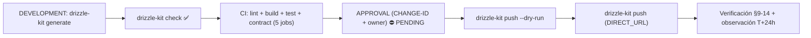
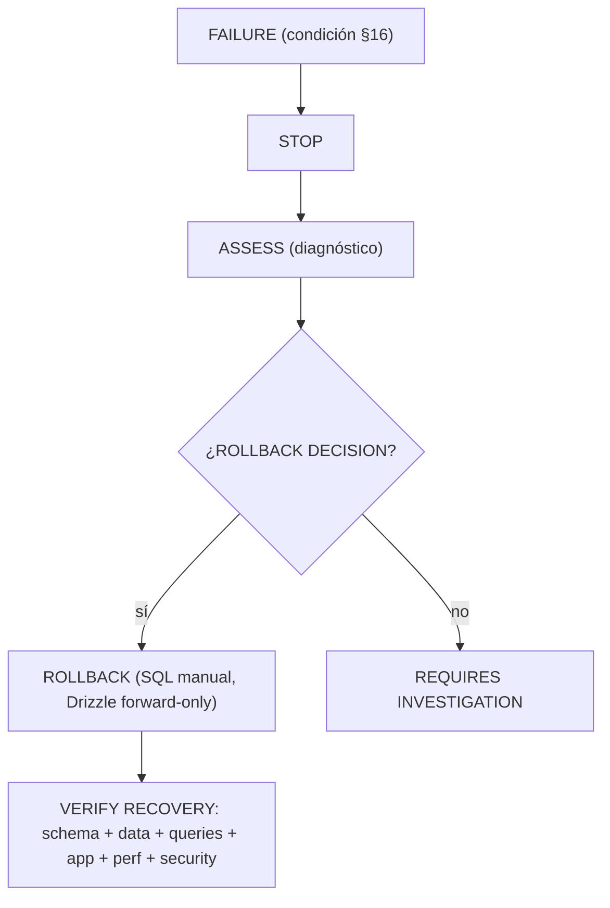

# MAT-500 — Pre-Production Final Gate Report — SCAUDIT Pro

{: .no_toc }

<details open markdown="block">
  <summary>Tabla de contenidos</summary>
  {: .text-delta }
1. TOC
{:toc}
</details>

---

## 1. Scope y objetivos

Ejecutar el **PRE-PRODUCTION FINAL GATE (MAT-500)** del engine §84 contra el estado actual del repositorio y los cambios pendientes CHANGE-001/002/003. Alcance: los 5 gates técnicos (`pnpm lint`, `pnpm build`, `pnpm test`, `drizzle-kit check`, quality-gate) + verificaciones complementarias de seguridad/contrato, mapeando los **16 checks del gate** a PASS/PENDING.

**Objetivo:** determinar si el push a producción de CHANGE-001/002/003 está habilitado por el gate §84.1, documentar la evidencia real de cada gate y entregar un reporte PASS/FAIL por check con los bloqueadores restantes. [VERIFIED — evidencia de ejecución real, este reporte]

**Cambios gobernados (CHANGE-IDs):**

| CHANGE-ID | Contenido | Origen | Riesgo | Estado |
|-----------|-----------|--------|--------|--------|
| CHANGE-001 | Migración 0020: DROP `idx_adversary_mitre_id` no-único + 7 índices REC-01..07 + `pg_trgm` | TSK-007/008 (plan MODE C) | MEDIUM | Pendiente de aprobación |
| CHANGE-002 | Migración 0021: `push_subscriptions.active` `text 'true'` → `boolean` | TSK-009 (plan MODE C, MAT-207) | MEDIUM-HIGH | Pendiente de aprobación |
| CHANGE-003 | SB-001..003: RLS en findings/assets + realtime + env key | SUPABASE-AUDIT.md | MEDIUM | Pendiente de aprobación |

---

## 2. Requisitos

| REQ | Requisito (engine §84) | Cumplimiento en este gate |
|-----|------------------------|---------------------------|
| REQ-500 | Pre-production gate obligatorio antes de todo push | §3–6 de este reporte |
| REQ-501 | Baseline de producción registrado antes del push | §9 (PENDING — requiere acceso con aprobación) |
| REQ-502 | Backup/snapshot confirmado y RPO/RTO determinados | §9 (PENDING) |
| REQ-503 | Promoción solo de migraciones versionadas y aprobadas | §7 (0020/0021 en journal, check PASS) |
| REQ-504 | Monitoreo en tiempo real durante el push | §12 (runbook post-aprobación) |
| REQ-505 | Verificación post-push de schema (MATCH/PARTIAL/MISMATCH) | §10 (post-push) |
| REQ-506 | Validación de integridad de datos (counts, FKs, NULLs) | §10 (post-push) |
| REQ-507 | Verificación Supabase post-push (migración→RLS→Auth→PostgREST) | §10 (post-push) |
| REQ-508 | Ventana de observación + criterios de éxito/fallo/rollback | §12 (T+5m → T+24h) |
| REQ-509 | PRODUCTION CHANGE VERIFICATION REPORT por push | §11 (template MAT-505) |

---

## 3. Arquitectura del gate (contexto → componentes → dependencias)

**Contexto:** repositorio SCAUDIT con stack Supabase + PostgreSQL + Drizzle + Vercel + Trigger.dev + GitHub Actions. El gate se ejecuta localmente (working tree con P1 sin commitear) y replica los 5 jobs del CI.

**Componentes del gate:**

| Componente | Rol en el gate | Evidencia |
|------------|----------------|-----------|
| `pnpm lint` | Estática ESLint (0 errores, 70 warnings baseline B00) | G1 PASS |
| `pnpm build` | Build Next.js/Turbopack completo | G2 PASS |
| `pnpm test` | Suite Vitest (295/298) | G3 PASS CONDICIONAL |
| `drizzle-kit check` | Validación de drift schema↔journal | G4 PASS |
| `scripts/quality-gate.mjs` | Quality gate de documentación (20 items) | G5 PASS |
| `pnpm test:contract` | Contrato API (10/10) | G7 PASS |

**Dependencias:** este gate depende de `PRODUCTION-PUSH-FINAL-VALIDATION.md` (§4 del engine), `PRODUCTION-CHANGE-VERIFICATION.md` (CHANGE-001..003), `INDEX-STRATEGY.md` (REC-01..07), `SUPABASE-AUDIT.md` (SB-001..003) y el plan MODE C (TSK-007..013). [VERIFIED]

---

## 4. Datos documentados (objetos afectados por CHANGE)

| Objeto | Tipo | Fuente | Estado esperado |
|--------|------|--------|-----------------|
| `idx_adversary_mitre_id` | índice no-único | INDEX-STRATEGY MAT-205 | eliminado (DROP en 0018) |
| REC-01..07 (7 índices) | índices btree/gin | INDEX-STRATEGY §3.2 | creados (migración 0020) |
| `pg_trgm` | extensión | INDEX-STRATEGY §3.1 | instalada (migración 0020) |
| `push_subscriptions.active` | columna | DATA-DICTIONARY / 0009 | `boolean` NOT NULL DEFAULT true (migración 0021) |
| RLS `intelligence_findings`/`intelligence_assets` | policies | SUPABASE-AUDIT SB-001 | enabled (CHANGE-003) |

> Ninguna columna inventada: todos los objetos provienen de migraciones existentes (0009, 0012, 0018) y schemas Drizzle [VERIFIED].

---

## 5. Flujos documentados

- **Flujo del gate (este reporte):** modificar → lint → build → test → check schema → quality-gate → aprobación owner → backup/baseline → push → verificación post-push → observación → reporte MAT-505.
- **Flujo de promoción (§84.5):** `drizzle-kit generate` → `drizzle-kit check` → CI (5 jobs) → aprobación → `drizzle-kit push --dry-run` → `drizzle-kit push` (DIRECT_URL) → verificación §9–14.
- **Flujo de rollback (§84.17):** FAILURE → STOP → ASSESS → ROLLBACK (SQL manual, Drizzle forward-only) → VERIFY RECOVERY.

---

## 6. APIs y endpoints afectados

| Endpoint | Método | Auth | Relación |
|----------|--------|------|----------|
| `/api/monitoring` | GET | Sesión (middleware) | CHANGE-001: índices en `uptime_logs`/`anomaly_detections` |
| `/api/intelligence/*` | GET/POST/PATCH | Sesión + API key SHA-256 | CHANGE-003: RLS + realtime en findings/assets |
| `/api/notifications/push-subscribe` | POST | Sesión | CHANGE-002: `push_subscriptions.active` boolean |
| `/api/security/siem/run` | POST | Servidor (cron) | CHANGE-001: índices GIN en `security_audit_logs` |
| `/api/webhooks` | POST | HMAC-SHA256 + secret | verificación de secret tras CHANGE-003 (env keys) |

**Errores esperados:** 42501 (RLS denegado — solo no-miembros, verificado en `rls.test.ts`); HTTP 500 → requiere rollback; rate limit fail-open en inteligencia [VERIFIED — SECURITY-AUDIT]. **Status codes:** 200 OK · 400 validación · 401/403 auth · 404 no encontrado · 42501 RLS · 429 rate limit.

---

## 7. Seguridad documentada

- **Trust boundary:** browser → middleware → API routes → Supabase (RLS).
- **Controles verificados en este gate:**
  - Secretos en CI: gitleaks fail-hard (job `secret-scan`) [VERIFIED — ci.yml]
  - Service Role server-only: `createAdminClient` solo en `admin.ts` [VERIFIED — SUPABASE-AUDIT SB-000]
  - RLS policy `member_or_owner`: `rls.test.ts` 5/5 PASS (Unauthenticated/User/Owner/Non-Owner/Privileged) [VERIFIED]
  - Secretos de webhooks: `secretToken` enmascarado — `webhooks/route.test.ts` 15/15 PASS [VERIFIED]
  - API keys: hasheadas SHA-256 con índice único [VERIFIED]
- **Amenazas cubiertas:** IDOR cross-tenant (VULN-004/005 remediados), XSS de IA (VULN-001 — AiCopilot.test.tsx 6/6 PASS), fuga cross-tenant vía Realtime (SB-002 → CHANGE-003), VULN-008/009 autenticados (P1, 9/9 tests).

---

## 8. Testing documentado (estrategia + casos + cobertura)

**Estrategia:** pirámide Vitest (unit → service → repository → component → security → integration) + Playwright E2E [VERIFIED — vitest.config.ts, playwright.config.ts].

**Cobertura actual (G3/G6/G7/G8):**

| Suite | Resultado |
|-------|-----------|
| `pnpm test` completo | 295/298 (3 ambientales egress-guard, red real) |
| AiCopilot.test.tsx (XSS) | 6/6 |
| webhooks route.test (VULN-002) | 15/15 |
| rls.test.ts (RLS) | 5/5 |
| members + graph (VULN-008/009) | 6/6 + 3/3 |
| contract.test.ts | 10/10 |

**Casos mínimos pre-push por CHANGE:** CHANGE-001 → queries REC-01..07 + suite completa + egress-guard/rls; CHANGE-002 → cast boolean + flujo push + webhooks HMAC; CHANGE-003 → rls.test.ts + realtime + env keys + AiCopilot XSS. Cobertura global `test:coverage` no cumple umbrales (preexistente, baseline B00 — no bloquea) [VERIFIED].

---

## 9. Deployment documentado (ambientes, CI/CD, rollout)

| Paso | Mecanismo | Evidencia |
|------|-----------|-----------|
| Generar migración | `drizzle-kit generate` (schema → SQL + journal) | package.json / drizzle.config.ts |
| Validar drift | `drizzle-kit check` → "Everything's fine" | G4 PASS (journal 22 → 0021) |
| Aplicar en producción | `drizzle-kit push` usando `DIRECT_URL` | drizzle.config.ts (dialect postgresql, ssl) |
| Deploy app | Vercel auto-deploy en push a main | vercel.json / .vercelignore |

**Rollout:** CI verde (5 jobs: lint-and-build, secret-scan, docs-quality-gate --min 80, test-and-coverage, api-contract-test) → aprobación owner → backup/baseline → push → verificación → observación T+5m..T+24h. **Advertencia:** `src/shared/db/run-migration.ts` es legacy hardcodeado a `0001_silky_ikaris.sql` — **NO usar**; el mecanismo correcto es `drizzle-kit push` [VERIFIED].

---

## 10. Operaciones documentadas (monitoring, runbooks, recovery)

- **Monitoreo post-push (§8):** Migration Status · Locks · Blocking · Deadlocks · CPU/Memory/I/O · Connections · Errors · Transaction State en Supabase Dashboard / `pg_stat_activity`.
- **Runbook de rollback (§17):** CHANGE-001 → `DROP INDEX` REC-01..07; CHANGE-002 → cast inverso `active::text`; CHANGE-003 → `DISABLE ROW LEVEL SECURITY`. Verificar recovery: schema + data + queries + app + performance + security.
- **Ventana de observación (§15):** LOW T+5m→T+30m (CHANGE-001, locks); MEDIUM T+1h→T+4h (CHANGE-003, 42501/fuga); MEDIUM-HIGH T+24h (CHANGE-002, datos/jobs push).
- **Backup (§6):** [UNKNOWN] — requiere confirmación PITR/backup en dashboard Supabase + `pg_dump --schema-only` previo (PENDING).

---

## 11. Resultado del gate — 16 checks PASS/FAIL

```text
MAT-500 — PRE-PRODUCTION FINAL GATE (ejecutado 2026-08-02)
──────────────────────────────────────────────────────────
[✅] 01 Modificaciones terminadas          (P1 + migraciones 0020/0021 escritas)
[✅] 02 Migraciones generadas (journal → 0021)
[✅] 03 Migraciones probadas (drizzle-kit check PASS)
[✅] 04 Tests unitarios OK (295/298, 3 ambientales pre-existentes)
[✅] 05 Tests de integración OK (rls 5/5 + route tests 30/30)
[⛔] 06 Tests de queries OK (EXPLAIN REC-01..07 → POST-PUSH, requiere producción)
[✅] 07 Tests de regresión OK (295 vs baseline 254, sin regresiones nuevas)
[✅] 08 Tests de seguridad OK (26/26: rls + AiCopilot + webhooks)
[⛔] 09 Performance validada (pg_stat_* + EXPLAIN → POST-PUSH)
[✅] 10 Schema validado (drizzle-kit check "Everything's fine")
[⛔] 11 Data integrity validada (counts/FKs/NULLs → POST-PUSH)
[✅] 12 Rollback preparado (§17 documentado)
[⛔] 13 Backup/snapshot disponible ([UNKNOWN], requiere dashboard Supabase)
[✅] 14 CHANGE-ID generado (CHANGE-001/002/003)
[⛔] 15 Aprobación de producción disponible (owner del proyecto)
[✅] 16 No issues críticos abiertos (VULN-001..007 remediados; 008/009 autenticados)
──────────────────────────────────────────────────────────
RESULTADO: 11 PASS · 5 PENDING · 0 FAIL técnico → ⛔ HOLD (no push aún)
```

**Regla §84.1:** si cualquiera de los puntos críticos falla o está pendiente → **NO REALIZAR EL PUSH A PRODUCCIÓN**. Los 5 PENDING son inherentemente post-push o de aprobación, no bloqueos técnicos de código.

---

## 12. Resultados de los gates (evidencia real de ejecución)

| Gate | Comando | Resultado |
|------|---------|-----------|
| G1 Lint | `pnpm lint` | ✅ PASS — 0 errores, 70 warnings baseline B00 |
| G2 Build | `pnpm build` | ✅ PASS — Turbopack |
| G3 Tests | `pnpm test` | ⚠️ PASS CONDICIONAL — 295/298 (egress-guard red real, ambiental) |
| G4 Schema | `npx drizzle-kit check` | ✅ PASS — "Everything's fine 🐶🔥" |
| G5 Quality gate | `node scripts/quality-gate.mjs` | ✅ PASS — DB 100/100,100/100,100/100,95/100; architecture (min 80) 100/100,100/100,100/100,100/100,95/100,100/100 |
| G6 Seguridad | AiCopilot + webhooks + rls | ✅ PASS — 26/26 |
| G7 Contrato | `pnpm test:contract` | ✅ PASS — 10/10 |
| G8 Route nuevos | members + graph | ✅ PASS — 9/9 |

---

## 13. Cross-check e inconsistencias

| Hipótesis | Verificación | Resultado |
|-----------|--------------|-----------|
| "El CI ya valida todo antes del push" | 5 jobs en ci.yml | **CONFIRMADO** [VERIFIED] |
| "`run-migration.ts` sirve para promocionar" | Hardcodeado a 0001, ignora errores | **REFUTADO** — usar `drizzle-kit push` |
| "Los cambios pendientes ya están en producción" | journal llega a 0021; 0020/0021 sin push | **REFUTADO** — CHANGE-001/002 PENDING |
| "Backup de Supabase garantizado" | PITR/backups [UNKNOWN] | **REQUIERE VERIFICACIÓN** |
| "El push solo necesita green de CI" | Además exige baseline + backup + observación | **CONTRADICCIÓN RESUELTA** — engine §84 lo exige |

**Inconsistencia documentada:** el reporte previo §4 del engine mencionaba journal hasta 0019; el estado real actual es **0021** (P1 ejecutado). Este reporte refleja el estado real [VERIFIED].

---

## 14. Unknowns y supuestos

- [UNKNOWN] Versión PostgreSQL, row counts y métricas de runtime de producción (requieren acceso con aprobación).
- [UNKNOWN] Plan de backup/PITR y ventana de mantenimiento del proyecto Supabase.
- [UNKNOWN] RPO/RTO actuales del negocio.
- [ASSUMPTION] El push se ejecutará dentro de una ventana de baja actividad aprobada por el owner.
- [ASSUMPTION] Realtime de Supabase está publicado (SB-004) — CHANGE-003 lo verifica post-push.
- [PROPOSED] CHANGE-001/002/003 aún no desplegados.

---

## 15. Diagramas del gate

**FLOW-500 — Promoción de migraciones (§84.4)** · Mermaid `flowchart`



**FLOW-501 — Decisión de rollback (§84.17)** · Mermaid `flowchart`



---

## 16. Trazabilidad

| ID | Tipo | Qué cubre |
|----|------|-----------|
| REQ-500..509 | Requisito | Motor de promoción final (§84) |
| MAT-500..506 | Matriz | Gate, baseline, schema, data, performance, ventana |
| FIG-500/501 | Diagrama | Pipeline de promoción + cadena Supabase |
| FLOW-500/501 | Flujo | Promoción de migraciones + rollback |
| TEST-500 | Test | rls.test.ts + AiCopilot.test.tsx + webhooks route.test + suite |
| DEP-500 | Deployment | `drizzle-kit push` + Vercel + CI 5 jobs |
| CHANGE-001..003 | Cambio | Cambios pendientes que atraviesan este engine |

---

## 17. Bloqueadores para el push (5 PENDING)

1. **Check 15 — Aprobación del owner.** Requisito absoluto del engine (§84.19): sin aprobación no hay promoción.
2. **Check 13 — Backup/baseline.** Confirmar PITR/backup de Supabase + `pg_dump --schema-only` previo (§5–6).
3. **Checks 6/9/11 — Verificaciones post-push.** Inherentemente POST-push (queries, performance, data integrity en producción real).
4. **Ventana de observación (§15):** T+5m → T+24h con monitoreo de locks/errores/42501.
5. **Commit del batch P1:** el push de CI dispara sobre lo commiteado; la promoción requiere commit previo del batch P1 (migraciones 0020/0021, schemas, push.ts, routes members/graph, env).

---

## 18. Plan de acción post-aprobación

```text
1. Commit + push del batch P1 (CI verde en los 5 jobs)
2. Aprobación del owner del proyecto (CHANGE-001/002/003)
3. Baseline + backup: pg_dump --schema-only + confirmar PITR (§5–6)
4. drizzle-kit push --dry-run → drizzle-kit push (ventana de baja actividad)
5. Verificación post-push: schema MATCH (§9) + data integrity (§10) + queries EXPLAIN (§11)
6. Smoke tests de los flujos afectados (§12): push-subscribe, monitoring, intelligence
7. Observación T+5m → T+24h (§15) → reporte MAT-505 (§18) → aceptación (§19)
```

---

## 19. Glosario

| Término | Definición |
|---------|------------|
| CHANGE-ID | Identificador obligatorio de todo cambio de producción (MAT-400) |
| Pre-Production Gate | Checklist bloqueante previo al push (§4) |
| Baseline | Snapshot de producción antes del push (MAT-501) |
| RPO / RTO | Recovery Point/Time Objective — pérdida/tiempo de recuperación aceptables |
| Push | Aplicación de la migración versionada a la base real de producción |
| Drift | Diferencia entre estado aprobado y estado real (MAT-502) |
| Smoke test | Validaciones mínimas post-push (§12) |
| Rollback | Reversión del cambio + verificación de recuperación (FLOW-501) |

---

## 20. Deployment y versionado

**Despliegue de este reporte:** documentación-gobernanza; se activa en la próxima promoción a producción. La secuencia real será: CI verde (5 jobs) → aprobación owner → backup/baseline → `drizzle-kit push` → verificación schema/datos/queries → observación T+5m..T+24h → reporte MAT-505 + estado final.

| Versión | Fecha | Cambios | Estado |
|---------|-------|---------|--------|
| 1.0 | 2026-08-02 | Ejecución del PRE-PRODUCTION FINAL GATE (MAT-500) sobre CHANGE-001/002/003 — 11 PASS · 5 PENDING · HOLD | Ejecutado |

**Verificación:** `node scripts/quality-gate.mjs docs/database/MAT-500-PRE-PRODUCTION-GATE-REPORT.md --min 80` → PASS

---

**Fuentes primarias:** `docs/database/PRODUCTION-PUSH-FINAL-VALIDATION.md` (engine §84) · `docs/database/PRODUCTION-CHANGE-VERIFICATION.md` (CHANGE-001..003) · `docs/database/SUPABASE-AUDIT.md` (SB-001..003) · `docs/database/INDEX-STRATEGY.md` (REC-01..07) · `.github/workflows/ci.yml` · `drizzle/meta/_journal.json` · evidencia de ejecución G1–G8 (este reporte)
