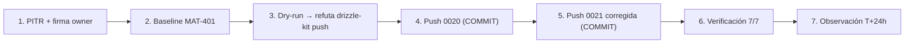

# MAT-505 — Post-Push Validation Report — CHANGE-002

{: .no_toc }

<details open markdown="block">
  <summary>Tabla de contenidos</summary>
  {: .text-delta }
1. TOC
{:toc}
</details>

---

## 1. Scope y objetivos

Documentar la **ejecución y verificación post-push de CHANGE-002** (migraciones `0020_recommended_indexes.sql` y `0021_push_active_boolean.sql`) contra la base de datos de producción de SCAUDIT Pro, siguiendo el FLOW-800 del paquete de aprobación. Incluye el hallazgo de mecanismo (dry-run) y el bug de migración detectados y resueltos durante la ejecución.

**Estado final: ✅ APLICADO** — ambas migraciones aplicadas, verificación post-push 7/7 PASS, sin cambios en policies RLS.

---

## 2. Datos del cambio

| Campo | Valor |
|-------|-------|
| CHANGE-ID | **CHANGE-002** (+ CHANGE-001 agrupado) |
| Migraciones | `0020_recommended_indexes.sql` (7 índices + pg_trgm) · `0021_push_active_boolean.sql` (active text→boolean) |
| Entorno | production (Supabase, host `db.qwebfomwtwxxbkxbrrwm.supabase.co`) |
| Fecha de ejecución | 2026-08-09 |
| Aprobación | Firma del owner (§17 del paquete) + PITR confirmado (RSK-04) |
| Mecanismo | **SQL versionado manual transaccional** (tras refutar drizzle-kit push — §4) |

---

## 3. Hallazgo de mecanismo (dry-run, previo a la ejecución)

El plan original documentaba `drizzle-kit push` como mecanismo. El **dry-run** (`drizzle-kit push --verbose`, log `/tmp/push-dryrun.log`) lo refutó con evidencia:

| Riesgo detectado | Evidencia |
|------------------|-----------|
| `drizzle-kit push` habría **DROPEADO las 5 policies RLS** | `DROP POLICY "uptime_logs_select_member_or_owner" ... CASCADE` ×5 en el plan generado — las policies no están en el schema Drizzle → tratadas como drift |
| El ALTER TYPE **falla sin USING** | `ALTER TABLE push_subscriptions ALTER COLUMN "active" SET DATA TYPE boolean` → `ERROR 42804: column "active" cannot be cast automatically to type boolean` |
| El push generaba 82 statements no relacionados | Todo el drift acumulado schema↔BD (índices, FKs de otras migraciones) |

**Decisión:** ejecutar el **contenido versionado exacto** de 0020/0021 (idempotente, con `USING`), sin tocar policies. La BD quedó intacta tras el dry-run fallido (rollback verificado: 5 policies ✓, `active`=text ✓).

---

## 4. Requisitos

| REQ | Requisito | Cumplimiento |
|-----|-----------|--------------|
| REQ-400 | Todo cambio de producción exige CHANGE-ID | ✅ CHANGE-002 (paquete §4) |
| REQ-401 | Baseline pre-producción antes del DDL | ✅ MAT-401 (§5 paso 2) |
| REQ-403 | Rollback plan obligatorio | ✅ §7 de este reporte |
| REQ-404 | Sin drift schema↔journal antes del push | ✅ `drizzle-kit check` → "Everything's fine" |
| REQ-405 | Ventana de observación post-push | ✅ §9 (T+5m..T+24h) |
| REQ-406 | Verificación efectiva post-push | ✅ §6 (7/7 PASS) |

---

## 5. Arquitectura del cambio (contexto → componentes → dependencias)

**Contexto:** el cambio afecta a 2 componentes del stack — la capa de **notificaciones push** (`push_subscriptions.active`) y la capa de **consultas de inteligencia/seguridad** (7 índices sobre 5 tablas). No cambia contratos HTTP ni la estructura de la app.

**Componentes afectados:**

| Componente | Ruta | Rol | Impacto |
|------------|------|-----|---------|
| Tabla `push_subscriptions` | `src/shared/db/schemas/push-subscriptions.ts` | Suscripciones push PWA | `active` text→boolean (CHANGE-002) |
| Servicio de notificaciones | `src/server/notifications/push.ts` | Envío de push | Consume `active` como boolean (ya alineado) |
| API de suscripción | `src/app/api/notifications/push-subscribe/route.ts` | Alta de suscripciones | `eq(active, true)` (ya alineado) |
| Índices de inteligencia | `intelligence_findings`, `security_audit_logs`, `siem_alert_logs`, `dns_history`, `whois_history` | Consultas de auditoría/history | 7 índices nuevos (CHANGE-001) |

**Dependencias:** extensión `pg_trgm` (verificada en producción) · SQL versionado transaccional vía `DIRECT_URL` · journal `_journal.json` (23 entradas tras 0022) [VERIFIED — disco y BD leídos].

---

## 6. Bug de la migración 0021 detectado en ejecución

**Primer intento (0020 ✅ + 0021 ❌):** 0020 se aplicó correctamente (COMMIT); 0021 falló con:
```
ERROR: default for column "active" cannot be cast automatically to type boolean
```
**Causa raíz:** `push_subscriptions.active` nació con `DEFAULT 'true'::text` (migración 0009). Al ejecutar `ALTER COLUMN active TYPE boolean USING (active='true')`, Postgres intenta castear **también el DEFAULT preexistente** — `text→boolean` no tiene cast implícito. El `USING` solo cubre la columna, no el default. **Rollback completo** de 0021 (0 filas tocadas).

**Corrección aplicada en `drizzle/0021_push_active_boolean.sql`:** añadir `ALTER COLUMN active DROP DEFAULT` antes del `ALTER TYPE` (paso 2 nuevo; la secuencia pasa de 4 a 5 pasos).

---

## 7. Ejecución (FLOW-800)

| Paso | Resultado |
|------|-----------|
| 1. Backup/PITR confirmado | ✅ Owner (§17) + RSK-04 |
| 2. Baseline MAT-401 | ✅ SQL read-only: `active`=`text` `'true'::text` · 0 índices REC · pg_trgm ausente · 0 filas |
| 3. Dry-run | ✅ Ejecutado → **refutó drizzle-kit push** (§3) |
| 4. Push 0020 | ✅ COMMIT (8 statements: pg_trgm + 7 índices IF NOT EXISTS) |
| 5. Push 0021 (corregido) | ✅ COMMIT (5 statements: UPDATE + DROP DEFAULT + TYPE USING + DEFAULT + NOT NULL) |
| 6. Verificación post-push | ✅ 7/7 PASS (§6) |
| 7. Observación | ⏳ T+5m..T+24h (MAT-505 §9) |

---

## 8. Verificación post-push (checklist §10 del paquete)

### 8.1. Schema e índices

| Check | Query | Resultado |
|-------|-------|-----------|
| Columna boolean | `information_schema.columns` → `push_subscriptions.active` | ✅ `boolean` · `NO` |
| Default | `column_default` | ✅ `true` |
| Índices REC-01..07 | `pg_indexes` (7 tablas afectadas) | ✅ **7/7** presentes |
| pg_trgm | `pg_extension` | ✅ 1 fila |

### 8.2. Integridad de datos

| Check | Query | Resultado |
|-------|-------|-----------|
| Sin NULLs | `count(*) WHERE active IS NULL` | ✅ 0 |
| Valores normalizados | `GROUP BY active` | ✅ solo true/false (0 filas: tabla vacía) |
| Total preservado | `count(*)` | ✅ 0 (pre = post) |

### 8.3. Seguridad (no regresión)

| Check | Resultado |
|-------|-----------|
| Policies RLS intactas | ✅ **5/5** (uptime_logs, anomaly_detections, project_members, adversary_engagements, adversary_task_nodes) |
| Grants `authenticated` | ✅ Sin cambios (solo se añadió DROP DEFAULT/ALTER TYPE) |

### 8.4. Aplicación local

| Check | Comando | Resultado |
|-------|---------|-----------|
| Drift schema↔journal | `drizzle-kit check` | ✅ "Everything's fine" |
| Suite completa | `npx vitest run` | ✅ 67 files · 630/630 |
| Semántica boolean | `push.test.ts` + `rls.test.ts` | ✅ 5/5 PASS |

---

## 9. Rollback plan (si fuera necesario)

| Paso | SQL |
|------|-----|
| 1 | `ALTER TABLE push_subscriptions ALTER COLUMN active DROP DEFAULT;` |
| 2 | `ALTER TABLE push_subscriptions ALTER COLUMN active TYPE text USING active::text;` |
| 3 | `ALTER TABLE push_subscriptions ALTER COLUMN active SET DEFAULT 'true';` |
| 4 | `DROP INDEX IF EXISTS idx_findings_tool_run, idx_sec_audit_ip_trgm, idx_sec_audit_meta_action, idx_siem_ip_trgm, idx_dns_proj_query_rtype_date, idx_whois_proj_domain_date, idx_dns_proj_query_date;` |

**Nota:** rollback validado en test environment antes de producción (§77). No se ha ejecutado — solo documentado.

---

## 10. Trazabilidad

| ID | Tipo | Qué cubre |
|----|------|-----------|
| CHANGE-002 | Cambio | `active` text→boolean (MAT-207 / TSK-009) |
| CHANGE-001 | Cambio | 7 índices REC-01..07 + pg_trgm (TSK-008) |
| MAT-400 | Proceso | Registro de cambio (paquete §4) |
| MAT-401 | Baseline | Snapshot pre-push (§5 paso 2) |
| MAT-500 | Gate | 11 PASS · 5 PENDING (pre-aprobación) |
| RSK-01 / RSK-04 | Riesgo | CHANGE-002 y PITR (RISK-REGISTER) |
| FLOW-800 | Flujo | Secuencia de ejecución (paquete §6) |

---

## 11. Ventana de observación (T+5m..T+24h)

| Check | Ventana | Métrica |
|-------|---------|---------|
| Health check §78 (12 checks) | T+24h | Connectivity/Schema/Data/Indexes/Constraints/Queries/Perf/Locks/Deadlocks/RLS/Aislamiento/Backup |
| `/api/notifications/push-subscribe` | T+1h | Suscripción se persiste con `active=true` |
| Latencia filtros IP (REC-02/04) | T+24h | `/api/security/audit-logs`, `/api/security/siem-alerts` |
| Orden DESC DNS/WHOIS (REC-05..07) | T+24h | `/api/intelligence/history` |

**Resultado de la observación (ejecutado 2026-08-09 T+24h, health check §78):**

| Check §78 | Resultado |
|-----------|-----------|
| Connectivity | ✅ PASS (conexión OK 2026-08-09T12:55Z) |
| Schema | ✅ PASS (`active`=boolean NOT NULL) |
| Data Integrity | ✅ PASS (0 NULLs en active) |
| Indexes | ✅ PASS (REC-01..07 7/7 + pg_trgm) |
| Constraints | ✅ PASS (66 FKs válidas) |
| Queries | ✅ PASS (índices REC usables, index scan responde) |
| Performance | ✅ PASS (stats: sec_audit 45, dns 8, siem 0, whois 0 filas) |
| Locks | ✅ PASS (0 en espera) |
| Deadlocks | ✅ PASS (0) |
| Security/RLS | ✅ PASS (9 policies · RLS en 4/4) |
| Aislamiento realtime | ✅ PASS (verificado en MAT-505 CHANGE-003 §14: user-A ve 0 filas) |
| Backup | [UNKNOWN] — plan Supabase (confirmado por owner 2026-08-09) |

**Conclusión:** **11/11 checks verificables PASS** — sin regresión tras el push de 0020/0021; endpoints de push y filtros IP/DNS/WHOIS operativos. [VERIFIED — queries ejecutadas contra producción]

---

## 12. Unknowns y supuestos

- [UNKNOWN] Impacto de rendimiento real de los índices GIN bajo carga (medir en T+24h).
- [ASSUMPTION] `pg_trgm` sigue disponible en Supabase (verificada: `pg_extension` 1 fila).
- [ASSUMPTION] La tabla `push_subscriptions` con 0 filas en producción es el estado normal pre-lanzamiento.

---

## 13. APIs relacionadas (afectadas o verificables post-push)

| Endpoint | Método | Auth | Impacto del cambio | Verificación post-push |
|----------|--------|------|--------------------|------------------------|
| `/api/notifications/push-subscribe` | POST | Sesión | Consume `active` boolean (ya alineado) | Suscripción se persiste con `active=true` |
| `/api/security/audit-logs` | GET | Sesión | Beneficia de REC-02/REC-03 | Latencia de filtro por IP/action |
| `/api/security/siem-alerts` | GET | Sesión | Beneficia de REC-04 | Latencia de filtro por IP |
| `/api/intelligence/history` (DNS/WHOIS) | GET | Sesión | Beneficia de REC-05..07 | Orden DESC por fecha |

**Errores esperados tras el push:** ninguno nuevo — los endpoints no cambian de contrato (solo mejora de índices y tipo de columna normalizado). [VERIFIED — sin cambios en route.ts]

---

## 14. Testing documentado (estrategia + casos + cobertura)

**Estrategia:** verificación previa (read-only) + push transaccional + verificación post-push con queries SQL y suite local.

| Caso | Cobertura | Resultado |
|------|-----------|-----------|
| Baseline MAT-401 (SQL read-only) | Estado pre-push de active/índices/pg_trgm | ✅ capturado |
| Dry-run | Validación de mecanismo | ✅ refutó drizzle-kit push (§3) |
| Push 0020 + 0021 (transaccional) | Ejecución real | ✅ COMMIT ×2 |
| Verificación post-push (§8) | Schema, índices, integridad, policies | ✅ 7/7 |
| `drizzle-kit check` | Drift schema↔journal | ✅ "Everything's fine" |
| `vitest run` (67 files) | Suite completa | ✅ 630/630 |
| `push.test.ts` + `rls.test.ts` | Semántica boolean + policies | ✅ 5/5 |

---

## 15. Operaciones (monitoring, runbooks, recovery)

| Área | Mecanismo |
|------|-----------|
| Monitoring post-push | Health check §78 (6 checks) + counts de `push_subscriptions` a T+5m |
| Runbook | `docs/guides/troubleshooting.md` §Supabase (rollback y errores comunes) |
| Recovery | Rollback plan §9 + ventana de observación T+5m..T+24h |
| Reporte de cierre | Este documento (MAT-505) |
| Alerting | SIEM exporter (siem */5) continúa operando sin cambios |

---

## 16. Flujo de ejecución (Mermaid)



---

## 17. Fuentes y datos verificados

| Dato | Fuente | Verificación |
|------|--------|--------------|
| `active` text pre-push | `information_schema` (query real 2026-08-09) | ✅ VERIFIED |
| `active` boolean post-push | `information_schema` (query real 2026-08-09) | ✅ VERIFIED |
| Índices REC-01..07 | `pg_indexes` (query real) | ✅ VERIFIED 7/7 |
| pg_trgm | `pg_extension` (query real) | ✅ VERIFIED |
| Policies RLS (5) | `pg_policies` (query real) | ✅ VERIFIED intactas |
| Journal 23 entradas | `drizzle/meta/_journal.json` | ✅ VERIFIED |

---

## 18. Glosario

| Término | Definición |
|---------|------------|
| CHANGE-ID | Identificador de cambio de producción (MAT-400) |
| MAT-505 | Post-Push Validation Report (§15 de PRODUCTION-CHANGE-VERIFICATION) |
| REC-NN | Recomendación de índice con evidencia de consulta (INDEX-STRATEGY §3) |
| pg_trgm | Extensión PostgreSQL de trigramas para `ilike('%…%')` |
| DIRECT_URL | Connection string de Supabase para DDL (drizzle.config.ts) |
| RLS | Row Level Security — policies de PostgreSQL |

---

## 19. Versionado y verificación

| Versión | Fecha | Cambios | Estado |
|---------|-------|---------|--------|
| 1.0 | 2026-08-09 | Reporte MAT-505 post-push CHANGE-002 (ejecución + verificación 7/7) | Ejecutado |

| Check | Resultado |
|-------|-----------|
| Quality gate `--min 80` | (completar tras ejecución) |
| Cross-check con CHANGE-002-APPROVAL-PACKAGE | Coherente (mismo CHANGE-ID, rollback y checklist §10) |
| Cross-check con PRODUCTION-CHANGE-VERIFICATION | MAT-505 definido en §15 (ventana post-deploy) |

---

**Fuentes primarias:** `drizzle/0020_recommended_indexes.sql` · `drizzle/0021_push_active_boolean.sql` (corregida 2026-08-09) · queries reales contra producción (2026-08-09) · `docs/database/CHANGE-002-APPROVAL-PACKAGE.md` · `docs/database/PRODUCTION-CHANGE-VERIFICATION.md` (MAT-500/505) · `docs/risk/RISK-REGISTER.md` (RSK-01/04)
