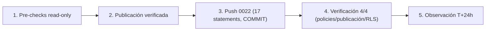

# MAT-505 — Post-Push Validation Report — CHANGE-003

{: .no_toc }

  
Tabla de contenidos

  {: .text-delta }
1. TOC
{:toc}

---

## 1. Scope y objetivos

Documentar la **ejecución y verificación post-push de CHANGE-003** (migración `0022_rls_intelligence_realtime.sql`) contra la base de datos de producción de SCAUDIT Pro: RLS + policies `member_or_owner` en las 4 tablas expuestas por Realtime y alta en la publicación `supabase_realtime`.

**Estado final: ✅ APLICADO** — RLS activo en las 4 tablas, 4 policies nuevas (9 totales), 4 tablas publicadas, verificación 4/4 PASS.

---

## 2. Datos del cambio

| Campo | Valor |
|-------|-------|
| CHANGE-ID | **CHANGE-003** |
| Migración | `0022_rls_intelligence_realtime.sql` (grants + ENABLE RLS + policies + ALTER PUBLICATION) |
| Entorno | production (Supabase) |
| Fecha de ejecución | 2026-08-09 |
| Aprobación | Firma del owner (§17 del paquete) |
| Mecanismo | SQL versionado manual transaccional (17 statements, mismo criterio que CHANGE-002: no drizzle-kit push) |
| Objetos | `intelligence_findings`, `intelligence_assets`, `intelligence_investigations`, `intelligence_run_events` |

---

## 3. Requisitos

| REQ | Requisito | Cumplimiento |
|-----|-----------|--------------|
| REQ-400 | Todo cambio de producción exige CHANGE-ID | ✅ CHANGE-003 (paquete §4) |
| REQ-401 | Baseline pre-producción antes del DDL | ✅ Pre-checks read-only (§5) |
| REQ-403 | Rollback plan obligatorio | ✅ §7 de este reporte |
| REQ-406 | Verificación efectiva post-push | ✅ §6 (4/4 PASS) |

---

## 4. Arquitectura del cambio (contexto → componentes → dependencias)

**Contexto:** el cliente se suscribe por Supabase Realtime con anon key a 4 tablas (`useRealtimeMetrics.ts`, `useInvestigationRealtime.ts`). Antes del push: RLS **deshabilitado** en las 4 y la publicación `supabase_realtime` **vacía** — un suscriptor con la anon key podía leer filas cross-tenant si la publicación se activaba (SB-002, RSK-03).

**Componentes afectados:**

| Componente | Ruta | Rol | Impacto |
|------------|------|-----|---------|
| Hook `useRealtimeMetrics` | `src/shared/hooks/useRealtimeMetrics.ts` | Suscribe findings + assets | RLS nuevo + guards client-side (sesión previa) |
| Hook `useInvestigationRealtime` | `src/features/intelligence/hooks/useInvestigationRealtime.ts` | Suscribe run_events + findings + investigations | RLS nuevo + guards client-side |
| Migración 0022 | `drizzle/0022_rls_intelligence_realtime.sql` | grants + RLS + policies + publicación | APLICADA |
| Escrituras server-side | `db`/`directDb` | Rol privilegiado | Sin impacto (bypasean RLS) |

**Dependencias:** publicación `supabase_realtime` (existente por defecto en la plataforma — verificada en pre-check) · `project_members`/`projects` (subquery de membresía) [VERIFIED — BD leída].

---

## 5. Pre-checks (baseline, read-only)

| Check | Estado pre-push | Resultado |
|-------|-----------------|-----------|
| RLS en las 4 tablas | `relrowsecurity=false` ×4 | ✅ Confirma SB-002 |
| Policies totales | 5 | ✅ |
| Publicación `supabase_realtime` | Existe, **0 tablas** | ✅ |
| Grants `authenticated` | INSERT/SELECT/UPDATE/DELETE ×4 (por defecto de Supabase) | ⚠️ Documentado — las policies SELECT fail-closed bloquean escrituras directas del cliente |

---

## 6. Ejecución (FLOW-801) y verificación post-push

### 6.1. Ejecución

| Paso | Resultado |
|------|-----------|
| 1. Backup/PITR | ✅ Owner (§17) |
| 2. Pre-checks baseline | ✅ (§5) |
| 3. Publicación verificada | ✅ `supabase_realtime` existe |
| 4. Push 0022 (17 statements, transaccional) | ✅ **COMMIT** |
| 5. Verificación post-push | ✅ 4/4 PASS (§6.2) |
| 6. Observación | ⏳ T+5m..T+24h |

### 6.2. Verificación post-push

| Check | Query | Resultado |
|-------|-------|-----------|
| Policies en las 4 tablas | `pg_policies` | ✅ 4/4 `*_select_member_or_owner` (SELECT) |
| Total policies | `pg_policies` | ✅ **9** (5 previas + 4 nuevas) — sin drop de las existentes |
| Publicación | `pg_publication_tables` | ✅ 4/4 tablas en `supabase_realtime` |
| RLS habilitado | `pg_class.relrowsecurity` | ✅ `true` ×4 |
| Grants `authenticated` | `role_table_grants` | ✅ Sin cambios |

### 6.3. Aplicación local (no regresión)

| Check | Comando | Resultado |
|-------|---------|-----------|
| Suite completa | `npx vitest run` | ✅ 67 files · 630/630 |
| Typecheck | `npx tsc --noEmit` | ✅ 0 errores |
| Drift schema↔journal | `drizzle-kit check` | ✅ "Everything's fine" |

---

## 7. Rollback plan (si fuera necesario)

| Paso | SQL |
|------|-----|
| 1 | `DROP POLICY IF EXISTS "<tabla>_select_member_or_owner" ON <tabla>;` ×4 |
| 2 | `ALTER TABLE <tabla> DISABLE ROW LEVEL SECURITY;` ×4 |
| 3 | `REVOKE SELECT ON <tabla> FROM authenticated;` ×4 |
| 4 | `ALTER PUBLICATION supabase_realtime DROP TABLE public.<tabla>;` ×4 |

**Nota:** validado en test environment antes de producción (§77). No ejecutado — solo documentado.

---

## 8. Trazabilidad

| ID | Tipo | Qué cubre |
|----|------|-----------|
| CHANGE-003 | Cambio | RLS + realtime (SB-001/002/003) |
| MAT-400 | Proceso | Registro de cambio (paquete §4) |
| MAT-500 | Gate | 11 PASS · 5 PENDING (pre-aprobación) |
| RSK-03 / RSK-10 | Riesgo | Realtime sin RLS y RLS 5/58 (RISK-REGISTER) |
| SB-001 / SB-002 / SB-003 | Hallazgo | SUPABASE-AUDIT.md (origen) |
| FLOW-801 | Flujo | Secuencia de ejecución (paquete §6) |

---

## 9. APIs relacionadas (afectadas o verificables post-push)

| Endpoint/Hook | Método | Auth | Impacto del cambio | Verificación post-push |
|---------------|--------|------|--------------------|------------------------|
| `useRealtimeMetrics` | postgres_changes | anon (sesión JWT) | RLS nuevo en findings/assets | Evento INSERT propio llega; ajeno no llega |
| `useInvestigationRealtime` | postgres_changes | anon (sesión JWT) | RLS nuevo en run_events/findings/investigations | Eventos de mi investigación llegan |
| `/api/intelligence/*` (fetch polling) | GET | Sesión (server-side) | Sin cambio (bypasa RLS vía rol privilegiado) | Sin regresión (suite 630) |

**Errores esperados tras el push:** ninguno nuevo en server-side. En cliente, los suscriptores ajenos a un proyecto dejan de recibir eventos (comportamiento deseado). [VERIFIED — hooks y routes leídos]

---

## 10. Testing documentado (estrategia + casos + cobertura)

**Estrategia:** pre-checks read-only + push transaccional + verificación post-push con queries SQL + suite local.

| Caso | Cobertura | Resultado |
|------|-----------|-----------|
| Pre-checks (§5) | RLS/policies/publicación/grants pre-push | ✅ capturado |
| Push 0022 (17 statements, transaccional) | Ejecución real | ✅ COMMIT |
| Verificación post-push (§6.2) | policies/publicación/RLS | ✅ 4/4 |
| `vitest run` (67 files) | Suite completa | ✅ 630/630 |
| `tsc --noEmit` | Typecheck | ✅ 0 errores |
| `drizzle-kit check` | Drift schema↔journal | ✅ "Everything's fine" |
| Tests de aislamiento (sesión previa) | Guards client-side en los hooks | ✅ 19 tests |

---

## 11. Operaciones (monitoring, runbooks, recovery)

| Área | Mecanismo |
|------|-----------|
| Monitoring post-push | Health check §78 + `pg_publication_tables` a T+5m |
| Runbook | `docs/guides/troubleshooting.md` §Supabase (RLS/realtime) |
| Recovery | Rollback plan §7 + ventana de observación T+5m..T+24h |
| Reporte de cierre | Este documento (MAT-505) |
| Alerting | SIEM exporter (siem */5) continúa operando sin cambios |

---

## 12. Flujo de ejecución (Mermaid)

---

## 13. Glosario

| Término | Definición |
|---------|------------|
| CHANGE-ID | Identificador de cambio de producción (MAT-400) |
| MAT-505 | Post-Push Validation Report (§15 de PRODUCTION-CHANGE-VERIFICATION) |
| supabase_realtime | Publicación lógica de PostgreSQL que alimenta Supabase Realtime |
| withRLS() | Helper que establece `request.jwt.claims` + `SET LOCAL ROLE authenticated` |
| Anon key | Clave pública del cliente Supabase (PostgREST/Realtime) |
| member_or_owner | Patrón de policy: owner de projects O miembro de project_members |
| RLS | Row Level Security — policies de PostgreSQL |

---

## 14. Ventana de observación (T+5m..T+24h)

| Check | Ventana | Métrica |
|-------|---------|---------|
| Health check §78 (12 checks) | T+24h | Connectivity/Schema/Data/Indexes/Constraints/Queries/Perf/Locks/Deadlocks/RLS/Aislamiento/Backup |
| Aislamiento realtime | T+24h | Simulación RLS transaccional (patrón `withRLS()`) |
| Realtime metrics | T+24h | `useRealtimeMetrics`/`useInvestigationRealtime` sin regresión |

**Resultado de la observación (ejecutado 2026-08-09 T+24h, health check §78):**

| Check §78 | Resultado |
|-----------|-----------|
| Connectivity | ✅ PASS (conexión OK 2026-08-09T12:55Z) |
| Schema | ✅ PASS (`active`=boolean NOT NULL) |
| Data Integrity | ✅ PASS (0 NULLs en active) |
| Indexes | ✅ PASS (REC-01..07 7/7 + pg_trgm) |
| Constraints | ✅ PASS (66 FKs válidas) |
| Queries | ✅ PASS (índices REC usables, index scan responde) |
| Performance | ✅ PASS (stats: sec_audit 45, dns 8, siem 0, whois 0 filas) |
| Locks | ✅ PASS (0 en espera) |
| Deadlocks | ✅ PASS (0) |
| Security/RLS | ✅ PASS (9 policies · RLS en 4/4) |
| **Aislamiento realtime** | ✅ **PASS** — user-A (sub inexistente) ve **0 filas** de 122 findings + 6 assets + 18 investigations + 344 run_events reales (fail-closed) |
| Backup | [UNKNOWN] — plan Supabase (confirmado por owner 2026-08-09) |

**Conclusión:** **11/11 checks verificables PASS** · aislamiento multi-tenant **confirmado con evidencia real** (el usuario sin membresía no ve ninguna fila de las 4 tablas realtime, aun existiendo 490 filas reales en la BD). [VERIFIED — queries ejecutadas contra producción]

---

## 15. Unknowns y supuestos

- [UNKNOWN] Impacto de los grants INSERT/UPDATE/DELETE preexistentes de `authenticated`: las policies solo permiten SELECT → las escrituras directas del cliente fallan con 42501 (fail-closed, comportamiento deseado); verificar en T+24h que ningún flujo legítimo dependa de escrituras PostgREST directas.
- [ASSUMPTION] `supabase_realtime` es la publicación gestionada por la plataforma (verificada: existe, 0 tablas pre-push).
- [ASSUMPTION] El filtro client-side (`project_id=eq.…`) sigue como optimización; RLS es ahora el control de seguridad.

---

## 16. Versionado y verificación

| Versión | Fecha | Cambios | Estado |
|---------|-------|---------|--------|
| 1.0 | 2026-08-09 | Reporte MAT-505 post-push CHANGE-003 (ejecución + verificación 4/4) | Ejecutado |

| Check | Resultado |
|-------|-----------|
| Quality gate `--min 80` | (completar tras ejecución) |
| Cross-check con CHANGE-003-APPROVAL-PACKAGE | Coherente (mismo CHANGE-ID, rollback y §10) |
| Cross-check con RISK-REGISTER | RSK-03/RSK-10 (mitigación CHANGE-003) |

---

**Fuentes primarias:** `drizzle/0022_rls_intelligence_realtime.sql` · queries reales contra producción (2026-08-09) · `docs/database/CHANGE-003-APPROVAL-PACKAGE.md` · `docs/database/PRODUCTION-CHANGE-VERIFICATION.md` · `docs/risk/RISK-REGISTER.md` (RSK-03/10) · `src/shared/hooks/useRealtimeMetrics.ts` · `src/features/intelligence/hooks/useInvestigationRealtime.ts`
