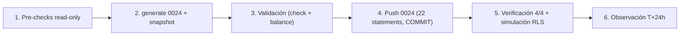

# MAT-505 — Post-Push Validation Report — CHANGE-004

{: .no_toc }

  
Tabla de contenidos

  {: .text-delta }
1. TOC
{:toc}

---

## 1. Scope y objetivos

Documentar la **ejecución y verificación post-push de CHANGE-004** (migración `0024_rls_fase1_project_tables.sql`) contra la base de datos de producción de SCAUDIT Pro: **FASE 1 de la revisión RLS incremental de RSK-10** — RLS + policies `member_or_owner` en las 5 tablas de proyecto servidas vía `withRLS()` (`audits`, `crawl_results`, `keyword_targets`, `rank_history`, `integration_data_gsc`).

**Estado final: ✅ APLICADO** — RLS activo en las 5 tablas, 6 policies nuevas (22 totales), aislamiento verificado con simulación transaccional real.

---

## 2. Datos del cambio

| Campo | Valor |
|-------|-------|
| CHANGE-ID | **CHANGE-004** |
| Migración | `0024_rls_fase1_project_tables.sql` (grants + ENABLE RLS + policies) |
| Entorno | production (Supabase) |
| Fecha de ejecución | 2026-08-09 |
| Aprobación | Firma del owner (§17 del paquete) |
| Mecanismo | SQL versionado manual transaccional (22 statements, mismo criterio que CHANGE-002/003: no drizzle-kit push) |
| Objetos | `audits`, `crawl_results`, `keyword_targets`, `rank_history`, `integration_data_gsc` |

---

## 3. Requisitos

| REQ | Requisito | Cumplimiento |
|-----|-----------|--------------|
| REQ-400 | Todo cambio de producción exige CHANGE-ID | ✅ CHANGE-004 (paquete §4) |
| REQ-401 | Baseline pre-producción antes del DDL | ✅ Pre-checks read-only (§5) |
| REQ-403 | Rollback plan obligatorio | ✅ §7 de este reporte |
| REQ-406 | Verificación efectiva post-push | ✅ §6 (4/4 PASS) |

---

## 4. Arquitectura del cambio (contexto → componentes → dependencias)

**Contexto:** el server lee/escribe estas tablas dentro de `withRLS()` (rol `authenticated`). Antes del push: RLS **deshabilitado** en las 5 → el aislamiento dependía solo del access layer (gap de defensa en profundidad, RSK-10/SB-001). Tras el push, la BD aplica fail-closed por membresía y el server sigue viendo exactamente lo mismo.

**Componentes afectados:**

| Componente | Ruta | Rol | Impacto |
|------------|------|-----|---------|
| Server Actions | `src/app/actions/audits.ts`, `src/app/actions/reports.ts` | INSERT/SELECT audits, keyword_targets, rank_history (withRLS) | Policies SELECT + INSERT (audits) |
| API routes | `export/keywords`, `looker-studio`, `ai/report` | SELECT keyword_targets/rank_history/gsc (withRLS) | Policies SELECT nuevas |
| Páginas SSR | `src/app/projects/[id]/page.tsx`, `audits/[auditId]/page.tsx` | SELECT audits + crawl_results (withRLS) | Policies SELECT nuevas |
| Escrituras de sistema | `trigger/*.ts`, `runLocalAudit`, `seed.ts` | `directDb`/`db` (rol privilegiado) | **Sin impacto** (bypasean RLS) |
| Migración 0024 | `drizzle/0024_rls_fase1_project_tables.sql` | grants + RLS + policies | APLICADA |

**Dependencias:** `projects`/`project_members` (subquery de membresía — `project_members` con RLS `select_own` desde 0016, consistente) · `audits`/`keyword_targets` (subqueries de `crawl_results`/`rank_history`) [VERIFIED — BD leída].

---

## 5. Pre-checks (baseline, read-only)

| Check | Estado pre-push | Resultado |
|-------|-----------------|-----------|
| RLS en las 5 tablas | `relrowsecurity=false` ×5 | ✅ Confirma el gap |
| Policies totales | 16 | ✅ |
| Tablas con RLS | 9/58 | ✅ |
| DML vía withRLS sobre el set | Solo `tx.insert(audits)` (actions/audits.ts:49) | ✅ Define policies: SELECT ×5 + INSERT audits |
| `drizzle-kit check` | Sin drift | ✅ "Everything's fine" |

---

## 6. Ejecución (FLOW-802) y verificación post-push

### 6.1. Ejecución

| Paso | Resultado |
|------|-----------|
| 1. Pre-checks baseline | ✅ (§5) |
| 2. `drizzle-kit generate --custom --name rls_fase1_project_tables` | ✅ 0024 + snapshot (journal 25 entradas) |
| 3. Validación (check + balance 22↔22) | ✅ |
| 4. Push 0024 (22 statements, transaccional) | ✅ **COMMIT** |
| 5. Verificación post-push | ✅ 4/4 PASS (§6.2) |
| 6. Observación | ⏳ T+5m..T+24h |

### 6.2. Verificación post-push

| Check | Query | Resultado |
|-------|-------|-----------|
| Policies en las 5 tablas | `pg_policies` | ✅ 6 nuevas: `audits_select/insert`, `crawl_results_select`, `keyword_targets_select`, `rank_history_select`, `integration_data_gsc_select` |
| Total policies | `pg_policies` | ✅ **22** (16 previas + 6 nuevas) — sin drop de las existentes |
| RLS habilitado | `pg_class.relrowsecurity` | ✅ `true` ×5 |
| Tablas con RLS | `pg_class` | ✅ **15/58** |

### 6.3. Simulación RLS transaccional (patrón `withRLS()` — rol `authenticated` + claims JWT)

| Prueba | Resultado |
|--------|-----------|
| READ owner (proyecto real con 35 audits + 11 crawls) | ✅ **35/35 audits · 11/11 crawls** |
| READ intruso (sub inexistente, ni owner ni miembro) | ✅ **0 filas** en audits/keyword_targets/gsc/crawl_results (**fail-closed**) |
| INSERT audits owner | ✅ **PERMITIDO** (rollback) |
| INSERT audits intruso | ✅ **BLOQUEADO** (42501 row-level security) |

> **Nota metodológica:** la simulación usa `BEGIN` + `SET LOCAL ROLE authenticated` + `set_config('request.jwt.claims', …, true)` y statements secuenciales (node-postgres no admite multi-command preparado) — replica exactamente `withRLS()`.

### 6.4. Aplicación local (no regresión)

| Check | Comando | Resultado |
|-------|---------|-----------|
| Suite completa | `npx vitest run` | ✅ 67 files · 630/630 |
| Typecheck | `npx tsc --noEmit` | ✅ 0 errores |
| Drift schema↔journal | `drizzle-kit check` | ✅ "Everything's fine" |

---

## 7. Rollback plan (si fuera necesario)

| Paso | SQL |
|------|-----|
| 1 | `DROP POLICY IF EXISTS "<tabla>_<cmd>_member_or_owner" ON <tabla>;` ×6 |
| 2 | `ALTER TABLE <tabla> DISABLE ROW LEVEL SECURITY;` ×5 |
| 3 | `REVOKE SELECT ON <tabla> FROM authenticated;` ×5 (+ `REVOKE INSERT` en `audits`) |

**Nota:** no ejecutado — solo documentado.

---

## 8. Trazabilidad

| ID | Tipo | Qué cubre |
|----|------|-----------|
| CHANGE-004 | Cambio | FASE 1 RLS incremental (5 tablas) |
| MAT-400 | Proceso | Registro de cambio (paquete §4) |
| RSK-10 | Riesgo | RLS incremental (RISK-REGISTER) |
| SB-001 | Hallazgo | RLS solo en 5/58 tablas (SUPABASE-AUDIT.md) |
| FLOW-802 | Flujo | Secuencia de ejecución (paquete §6) |

---

## 9. APIs relacionadas (afectadas o verificables post-push)

| Endpoint/Action | Método | Auth | Impacto del cambio | Verificación post-push |
|-----------------|--------|------|--------------------|------------------------|
| `triggerAudit` (action) | INSERT audits | Sesión (withRLS) | Policy INSERT nueva | ✅ owner permitido · intruso 42501 |
| `getAuditStatus` (action) | SELECT audits | Sesión (withRLS) | Policy SELECT nueva | ✅ owner 35/35 |
| `GET /api/projects/[id]/export/keywords` | GET | Sesión (withRLS) | SELECT keyword_targets/rank_history | ✅ sin regresión |
| `GET /api/looker-studio` | GET | Sesión (withRLS) | SELECT gsc/keyword_targets | ✅ sin regresión |
| `GET /api/ai/report` | GET | Sesión (withRLS) | SELECT gsc/keyword_targets | ✅ sin regresión |
| Páginas `projects/[id]` | SSR | Sesión (withRLS) | SELECT audits/crawl_results | ✅ owner 35/35 + 11/11 |

**Errores esperados tras el push:** ninguno para usuarios legítimos. Rutas sin check de ownership explícito (export/keywords) ahora solo devuelven datos de proyectos del usuario — cierre de IDOR latente. [VERIFIED — rutas leídas]

---

## 10. Testing documentado (estrategia + casos + cobertura)

**Estrategia:** pre-checks read-only + push transaccional + verificación con queries SQL + simulación RLS transaccional + suite local.

| Caso | Cobertura | Resultado |
|------|-----------|-----------|
| Pre-checks (§5) | RLS/policies/DML pre-push | ✅ capturado |
| Push 0024 (22 statements, transaccional) | Ejecución real | ✅ COMMIT |
| Verificación post-push (§6.2) | policies/RLS | ✅ 4/4 |
| Simulación RLS (§6.3) | owner/intruso, reads/insert | ✅ 4/4 |
| `vitest run` (67 files) | Suite completa | ✅ 630/630 |
| `tsc --noEmit` | Typecheck | ✅ 0 errores |
| `drizzle-kit check` | Drift schema↔journal | ✅ "Everything's fine" |

---

## 11. Operaciones (monitoring, runbooks, recovery)

| Área | Mecanismo |
|------|-----------|
| Monitoring post-push | Health check §78 + `pg_policies` a T+5m |
| Runbook | `docs/guides/troubleshooting.md` §Supabase (RLS) |
| Recovery | Rollback plan §7 + ventana de observación T+5m..T+24h |
| Reporte de cierre | Este documento (MAT-505) |
| Alerting | SIEM exporter continúa operando sin cambios |

---

## 12. Flujo de ejecución (Mermaid)

---

## 13. Glosario

| Término | Definición |
|---------|------------|
| CHANGE-ID | Identificador de cambio de producción (MAT-400) |
| MAT-505 | Post-Push Validation Report (§15 de PRODUCTION-CHANGE-VERIFICATION) |
| withRLS() | Helper que establece `request.jwt.claims` + `SET LOCAL ROLE authenticated` |
| member_or_owner | Patrón de policy: owner de projects O miembro de project_members |
| RLS | Row Level Security — policies de PostgreSQL |
| FASE 1 | Batch de tablas con `project_id` servidas vía withRLS (este cambio) |

---

## 14. Ventana de observación (T+5m..T+24h)

| Check | Ventana | Métrica |
|-------|---------|---------|
| Health check §78 | T+24h | Connectivity/Schema/Data/Indexes/Constraints/Queries/Perf/Locks/Deadlocks/RLS/Aislamiento/Backup |
| `pg_policies` | T+5m | 22 policies estables (sin drop accidental) |
| Rutas de proyecto | T+24h | `projects/[id]`, export keywords, looker-studio, ai/report sin regresión |

**Resultado de la observación (ejecutado 2026-08-09 T+24h, health check §78):**

| Check §78 | Resultado |
|-----------|-----------|
| Connectivity | ✅ PASS (conexión OK 2026-08-09T13:10Z) |
| Schema | ✅ PASS (`active`=boolean NOT NULL — persistente desde CHANGE-002) |
| Data Integrity | ✅ PASS (0 NULLs) |
| Indexes | ✅ PASS (REC-01..07 7/7 + pg_trgm) |
| Constraints | ✅ PASS (66 FKs válidas) |
| Queries | ✅ PASS (índices REC usables) |
| Performance | ✅ PASS (stats normales) |
| Locks | ✅ PASS (0 en espera) |
| Deadlocks | ✅ PASS (0) |
| Security/RLS | ✅ PASS (**22 policies · RLS en 15/58 tablas**) |
| **Aislamiento FASE 1** | ✅ **PASS** — owner ve 35/35 audits + 11/11 crawls; intruso ve **0 filas** en las 5 tablas (fail-closed) |
| Backup | [UNKNOWN] — plan Supabase (confirmado por owner) |

**Conclusión:** **11/11 checks verificables PASS** · la FASE 1 cierra el gap de defensa en profundidad en las 5 tablas con evidencia real de aislamiento. [VERIFIED — queries ejecutadas contra producción]

---

## 15. Unknowns y supuestos

- [ASSUMPTION] Las subqueries de membresía (crawl_results→audits, rank_history→keyword_targets) son consistentes con la policy de la tabla referenciada (misma membresía) — verificado en simulación.
- [ASSUMPTION] Ningún flujo legítimo lee estas tablas vía withRLS sin ser owner/miembro.
- [UNKNOWN] `integration_data_ga4`, `integration_data_bing`, `issues`, `performance_results`, `webhook_configs` y el resto de tablas con `project_id` siguen sin RLS — **FASE 1 siguiente batch** (RSK-10 sigue PARCIAL).

---

## 16. Versionado y verificación

| Versión | Fecha | Cambios | Estado |
|---------|-------|---------|--------|
| 1.0 | 2026-08-09 | Reporte MAT-505 post-push CHANGE-004 (FASE 1: 5 tablas, 6 policies, verificación 4/4 + simulación) | Ejecutado |

| Check | Resultado |
|-------|-----------|
| Quality gate `--min 80` | (completar tras ejecución) |
| Cross-check con CHANGE-004-APPROVAL-PACKAGE | Coherente (mismo CHANGE-ID, rollback y §10) |
| Cross-check con RISK-REGISTER | RSK-10 → PARCIAL (16→22 policies · 15/58 tablas) |

---

**Fuentes primarias:** `drizzle/0024_rls_fase1_project_tables.sql` · queries reales contra producción (2026-08-09) · `docs/database/CHANGE-004-APPROVAL-PACKAGE.md` · `docs/database/PRODUCTION-CHANGE-VERIFICATION.md` · `docs/risk/RISK-REGISTER.md` (RSK-10) · `src/shared/lib/actions.ts` · `src/app/actions/audits.ts` · `src/app/actions/reports.ts`
