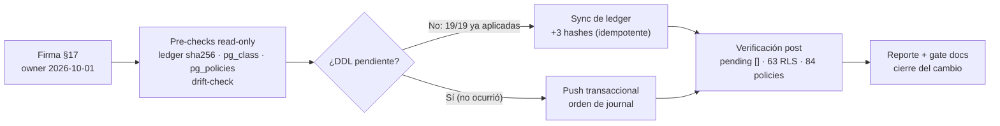

# MAT-505 — Post-Push Validation Report — CHANGE-005

{: .no_toc }

  
Tabla de contenidos

  {: .text-delta }
1. TOC
{:toc}

---

## 1. Scope y objetivos

Documentar la **ejecución y verificación de CHANGE-005**: el batch de **19 migraciones** escritas tras CHANGE-004 (`0025`…`2026-09-27`, grupos A RLS / B DDL aditivo / C datos-fechadas) que estaban en el journal de Drizzle **sin CHANGE-ID ni push documentado** (hallazgo MAT-500 §11.1).

**Estado final: ✅ APLICADO Y VERIFICADO** — los pre-checks prueban que **las 19 migraciones ya estaban aplicadas en producción** (aplicación out-of-band previa, no documentada); la única acción de BD fue **sincronizar el ledger** de Drizzle (+3 hashes). **0 DDL ejecutado.** Todas las cifras de este reporte son lecturas directas contra la BD de producción [VERIFIED].

---

## 2. Datos del cambio

| Campo | Valor |
|-------|-------|
| CHANGE-ID | **CHANGE-005** (batch de 19 migraciones) |
| Migraciones | `0025`, `0026`, `0027`, `0028`–`0037`, `2026-08-25 ×3`, `2026-08-26`, `2026-09-24`, `2026-09-27` |
| Entorno | production (Supabase, vía `DIRECT_URL`) |
| Fecha de ejecución | 2026-10-01 |
| Aprobación | Firma del owner (§17 del paquete), 2026-10-01 |
| Mecanismo ejecutado | Queries read-only (pre/post) + **sync de ledger** (`scripts/db/create-migration-ledger.mjs`, idempotente: solo `drizzle.__drizzle_migrations`) |
| DDL ejecutado | **0 sentencias DDL/DML** (no había nada que aplicar) |
| Paquete | `CHANGE-005-APPROVAL-PACKAGE.md` (v1.1) |

---

## 3. Requisitos

| REQ | Requisito | Cumplimiento |
|-----|-----------|--------------|
| REQ-400 | Todo cambio de producción exige CHANGE-ID | ✅ CHANGE-005 (paquete §4) |
| REQ-401 | Baseline pre-producción antes del DDL | ✅ Pre-checks read-only (§5) |
| REQ-402 | Migraciones versionadas y aprobadas | ✅ Journal 44/44 con ledger sincronizado (`pending: []`) |
| REQ-403 | Rollback plan obligatorio | ✅ §13 (no procedió: sin DDL) + revert de ledger (3 `DELETE`) |
| REQ-406 | Verificación efectiva post-push | ✅ §6.2 (PASS) |

---

## 4. Arquitectura del cambio (contexto → componentes → dependencias)

**Contexto:** tras la auditoría de 2026-08 se escribieron 19 migraciones (RLS fase 2, bootstraps de tablas drift, features de sprints). Los pre-checks de 2026-10-01 demostraron que **ya estaban aplicadas en producción sin pasar por el pipeline de promoción** [VERIFIED]: tablas, columnas, índices, policies, RLS, seeds y grants medidos directamente en la BD.

**Estado del ledger (hallazgo principal):** `drizzle.__drizzle_migrations` tenía **43 filas** de las 44 entradas del journal — faltaban los hashes vigentes de `0016_rls_policies`, `0027_rls_fase2` y `2026-09-27_pdf_progress` (+ 2 filas stale de versiones anteriores de ficheros editados tras su registro).

**Dependencias verificadas en vivo:** funciones `user_has_project_access()` / `current_auth_uid()` · enum `project_role` · tablas creadas por las migraciones fechadas (idx 39–41) previas al alcance efectivo de `0027` (seguro solo en vivo, advertido en el paquete) · seeds `subscription_plans` (4 filas).

---

## 5. Pre-checks (baseline, read-only)

| Check | Query / comando | Resultado |
|-------|-----------------|-----------|
| Conexión | `DIRECT_URL` → production | ✅ (pooler Supabase, db `postgres`) |
| Ledger | sha256 de los 44 ficheros vs `drizzle.__drizzle_migrations` | ⚠️ 43/44 → **pending: `0016`, `0027`, `2026-09-27_pdf_progress`** + 2 stale |
| Presencia de tablas | `pg_class` (16 nombres clave del paquete) | ✅ **16/16 presentes, 0 missing** |
| Fechadas | `user_logs`, `adversary_assessments`, `mitre_evaluations` | ✅ existen (+ `adversary_vulnerabilities`, `mitre_technique_results`) |
| Baseline RLS | `count(pg_class.relrowsecurity)` | ✅ **63** (core 4: `projects`, `users`, `audit_logs`, `developer_api_keys` = true) |
| Baseline policies | `count(pg_policies)` | ✅ **84** |
| Columnas clave | `information_schema.columns` | ✅ `beacon_secret`, `is_deleted/is_hidden/active_testing_authorized`, `cost_usd/prompt_version`, `ai_triage/ai_triage_at`, `current_step/checks_done/checks_total` |
| Nullable / enum | `investigation_id`, `project_role` | ✅ nullable=YES (DROP NOT NULL aplicado); enum existe |
| Seeds | `subscription_plans` | ✅ 4 (business, enterprise, free, pro) |
| Schema ↔ BD | `node scripts/db/drift-check.mjs` | ✅ **70/70 sin drift duro** (20 diffs sticky benignos) |
| Snapshot | `pg_dump --schema-only` | ⚠️ `pg_dump` no instalado → **baseline alternativo**: inventario completo (`pg_policies`, `pg_class`, `information_schema`, `pg_indexes`, `pg_constraint`) + drift-check |

**Verificaciones específicas de los 3 pendientes de ledger** [VERIFIED]:

- **`0016`:** 12/12 índices (`idx_project_members_user`, `idx_user_logs_*`, `idx_adv_*`, `idx_mitre_*`) + `project_invitations_token_unique` + policies (`uptime_logs_select_member_or_owner`, `anomaly_detections_select_member_or_owner`, `project_members_select_own`) → **aplicado** (fichero editado tras el registro original → hash stale).
- **`0027`:** todas las policies `*_fase2` (31 bucle + 4 hijas + anon + 4 catálogos + 4 admin) presentes; **grants comprobados**: `issues`/`integrations` SELECT=true, `security_audit_logs`/`ai_usage`=**false** (fail-closed) → **aplicado**.
- **`2026-09-27`:** `pdf_progress` con `relrowsecurity=true` + policy `pdf_progress_owner` + `idx_pdf_progress_updated_at` → **aplicado**.

---

## 6. Ejecución (FLOW-803) y verificación post

### 6.1. Ejecución (2026-10-01)

1. **Firma §17** registrada (owner, 2026-10-01) → paquete aprobado.
2. **Pre-checks §5** → conclusión: **19/19 ya aplicadas en producción**; re-ejecutar DDL hubiera sido innecesario y arriesgado (`0016` no es re-ejecutable: `ADD CONSTRAINT` sin guard).
3. **Acción de BD única:** `node scripts/db/create-migration-ledger.mjs` → **3 filas insertadas, 46 totales** (44 journal + 2 stale histórico) → **`pending: []`**.
4. **Verificación post §6.2** → PASS.

### 6.2. Verificación post (2026-10-01)

| Check | Esperado | Resultado |
|-------|----------|-----------|
| Ledger pending | `[]` | ✅ **`pending: []`** (46 filas = 44 journal + 2 stale) |
| `drizzle-kit check` | "Everything's fine" | ✅ |
| `db:drift-check` | sin drift duro | ✅ **70/70** |
| `pg_class.relrowsecurity` | sin cambios (sin DDL) | ✅ **63** |
| `pg_policies` | sin cambios (sin DDL) | ✅ **84** con todas las policies esperadas (`*_fase2`, admin, catálogos, member/owner, anon) |
| Índices clave | 4/4 | ✅ `idx_ai_usage_prompt_version`, `idx_intel_findings_triage_pending`, `idx_audit_logs_created_at`, `idx_pdf_progress_updated_at` |
| `user_logs` | unique + backfill | ✅ `user_logs_user_id_key` + **20 filas** |
| Regresión DML | sin cambios | ✅ **0 sentencias DDL/DML ejecutadas** |
| Smoke de runtime (/pricing, SSE PDF, IA) | deseable | ⏳ [NO EJECUTADO] — esquema intacto; queda para el despliegue de app |

---

## 7. Seguridad (trust boundaries, controles y amenazas)

| Elemento | Detalle | Estado |
|----------|---------|--------|
| Trust boundary | BD de producción (rol de conexión `DIRECT_URL`; server usa `withRLS()`/`authenticated`) | ✅ intacta — sin DDL |
| Control: RLS efectivo | 63 tablas con `relrowsecurity=true` + 84 policies (medido) | ✅ [VERIFIED] |
| Control: grants fail-closed | `security_audit_logs` y `ai_usage` con SELECT=false para `authenticated`; `issues`/`integrations`=true | ✅ comprobado con `has_table_privilege` |
| Control: ledger de migraciones | 44/44 hashes sincronizados → `drizzle-kit migrate` no re-ejecuta nada por sorpresa | ✅ `pending: []` |
| Amenaza: policies sin RLS | 5 tablas con policy definido pero `ENABLE` ausente → policy no se aplica | ⏳ **CHANGE-006** (§12) |
| Auth | Roles `authenticated`/`anon` + funciones `SECURITY DEFINER` de `0025` (ya en prod) | ✅ sin cambios |

---

## 8. APIs relacionadas (afectadas o verificables post-push)

| Superficie | Método | Migración | Efecto verificado |
|------------|--------|-----------|-------------------|
| `/api/projects/[id]/members` | GET/POST | `0025`/`0027` | policies `member_or_owner` presentes (42501 RLS en cross-tenant) |
| `/api/intelligence/graph` | GET | `0025` | RLS en `intelligence_*` (63 tablas) |
| `/api/intelligence/adversary` | POST/PATCH | fechadas + `0027` | `adversary_*` con policy y columnas de progreso |
| `/api/intelligence/runs` | GET/POST | `0025` | policies member/owner |
| `/pricing` (página) | GET | `0030` | 4 planes seed + `subscription_plans_public_read` |
| SSE de progreso de PDF | GET | `2026-09-27` | `pdf_progress` RLS + policy + índice (smoke runtime pendiente) |
| `/api/ai/report` (diferido) | POST | `0029` | `ai_report_jobs` + policy member |

**Códigos relevantes:** 401/403 (sesión), **42501** (violación RLS), 429 (rate limit) — sin cambios respecto a CHANGE-004.

---

## 9. Testing documentado (estrategia, casos y cobertura)

**Estrategia:** verificación por evidencia directa sobre producción (queries read-only) + comprobación de consistencia schema↔journal↔BD. Sin cambios de código: la suite de aplicación no se re-ejecutó (árbol idéntico al HEAD validado, 1.923/1.923).

| Caso | Cobertura | Resultado |
|------|-----------|-----------|
| Ledger vs journal (sha256) | 44/44 migraciones | ✅ `pending: []` post-sync |
| Presencia de objetos de las 19 | 16 tablas + columnas + índices + constraints | ✅ 16/16, 4/4 índices, unique presente |
| Policies y RLS | recuento global + nombres clave | ✅ 84 policies / 63 RLS |
| Grants por rol | 5 comprobaciones `has_table_privilege` | ✅ fail-closed correcto |
| Drift schema TS ↔ BD | `db:drift-check` | ✅ 70/70 sin drift duro |
| Integridad journal | `drizzle-kit check` | ✅ "Everything's fine" |
| Regresión DML | 0 sentencias ejecutadas | ✅ esquema intacto |

---

## 10. Operaciones (monitoring, runbooks, recovery)

| Área | Mecanismo |
|------|-----------|
| Monitoring post-acción | Verificación de esquema completada el mismo día (§6.2); sin observables nuevos (sin DDL); ventana T+24h sin cambios que observar |
| Runbook | `docs/guides/troubleshooting.md` §Supabase (RLS) |
| Recovery | §13: revert de ledger (3 `DELETE`) — no se esperan incidentes por este cambio |
| Alerting | SIEM/uptime exporter sin cambios |

---

## 11. Flujo de ejecución (FLOW-803)

---

## 12. Hallazgo nuevo (fuera de alcance de CHANGE-005)

Los pre-checks detectaron **7 tablas sin RLS en producción** (de 70):

| Tabla | Situación |
|-------|-----------|
| `project_members` | policy `project_members_select_own` **definida** pero `relrowsecurity=false` |
| `uptime_logs` | policy `uptime_logs_select_member_or_owner` definida, RLS off |
| `anomaly_detections` | policy `anomaly_detections_select_member_or_owner` definida, RLS off |
| `adversary_engagements` | policy `…_select_member_or_owner` definida, RLS off |
| `adversary_task_nodes` | policy `…_select_member_or_owner` definida, RLS off |
| `exec_briefs` | creada por `0036` sin policy ni RLS |
| `ai_eval_results` | creada por `0037` sin policy ni RLS |

**Impacto:** las policies de las primeras 5 **no se aplican** (RLS off) → el control efectivo depende solo del access layer. Las sentencias `ENABLE ROW LEVEL SECURITY` de `0016` (vigente) no están en efecto en 3 de ellas: ese delta quedó fuera de la re-ejecución y queda registrado aquí.

**Acción propuesta:** **CHANGE-006 candidato** (`ALTER TABLE … ENABLE ROW LEVEL SECURITY` ×5 + policies para `exec_briefs`/`ai_eval_results` o justificación de exclusión) — **pendiente de decisión del owner**.

---

## 13. Rollback plan

- **Ledger (única acción ejecutada):** `DELETE FROM drizzle.__drizzle_migrations WHERE hash IN (…3 hashes…)` — revierte el sync sin tocar el esquema.
- **DDL:** no procede (0 DDL). Plan por grupos en el paquete §5.4.

---

## 14. Trazabilidad y cross-check

| Documento | Actualización |
|-----------|---------------|
| `CHANGE-005-APPROVAL-PACKAGE.md` | v1.1 — Estado APLICADO Y VERIFICADO; §10.1/§10.2/§10.3 con resultados; §17 firmado |
| `PRODUCTION-CHANGE-VERIFICATION.md` | Fila CHANGE-005 ✅ + pendientes reales (CHANGE-006) + changelog 1.3 |
| `PRODUCTION-PUSH-FINAL-VALIDATION.md` | Fila §35 ✅ VERIFICADO APLICADO |
| `MAT-500-PRE-PRODUCTION-GATE-REPORT.md` | §11.1/§17 cerrados + changelog 1.3 (gate sigue 16/16 GO) |
| `FINAL-REPORT.md` | Banner + filas Migraciones/RLS reconciliadas con lo medido |
| `RISK-REGISTER.md` | RSK-10: 63 RLS medidos; gap → CHANGE-006 |

Cross-check interno: paquete ↔ este reporte ↔ gate MAT-500 sin contradicciones (mismas cifras: 19/19, 44/44, 63, 84, 70/70).

---

## 15. Glosario

| Término | Definición |
|---------|------------|
| CHANGE-ID | Identificador de cambio de producción (MAT-400) |
| Ledger | `drizzle.__drizzle_migrations`: registro de migraciones aplicadas por Drizzle |
| Hash stale | Fila del ledger cuyo hash ya no coincide con el fichero vigente (fichero editado tras registrarse) |
| Fechadas | Migraciones con prefijo de fecha (`2026-…`) aplicadas originalmente a mano |
| Fail-closed | Grant/RLS deniega por defecto al rol `authenticated` salvo policy explícita |
| Drift | Diferencia entre schema (TS o journal) y la BD real |

---

## 16. Unknowns y supuestos

- **[ASSUMPTION]** La aplicación out-of-band de las 19 se hizo con los ficheros idénticos a los actuales: no se pudo comparar hashes (no registrados), pero **todos los efectos verificables están presentes** (§5/§6).
- **[ASSUMPTION]** Las 2 filas stale del ledger corresponden a versiones anteriores de `0016`/`0027` editadas tras su registro original.
- **[UNKNOWN]** Por qué 5 tablas tienen policies sin `ENABLE ROW LEVEL SECURITY` (¿deshabilitación posterior?) → CHANGE-006 candidato (§12).
- **[UNKNOWN]** Quién ejecutó la aplicación out-of-band de las 19 y con qué versión exacta de los ficheros (sin registro en el journal de cambios).
- Smoke de runtime (/pricing, SSE PDF) no ejecutado en este cambio — queda para el despliegue de app.

---

## 17. Versionado y verificación

| Versión | Fecha | Cambios | Estado |
|---------|-------|---------|--------|
| 1.0 | 2026-10-01 | Reporte de cierre: firma §17 + pre-checks (19/19 ya aplicadas) + ledger sync (+3 hashes) + verificación post + hallazgo CHANGE-006 | ✅ Ejecutado |

| Check | Resultado |
|-------|-----------|
| Quality gate `--min 80` | ✅ 100/100 PASS (2026-10-01) |
| Cross-check con el paquete | v1.1 §10.3 = mismo relato y mismas cifras |
| Cross-check con gate MAT-500 | 16/16 GO; §11.1/§17 cerrados |

---

**Fuentes primarias:** queries de pre/post-checks contra producción (`pg_class`, `pg_policies`, `pg_indexes`, `pg_constraint`, `information_schema`, `has_table_privilege`, sha256 del journal) [VERIFIED] · `scripts/db/create-migration-ledger.mjs` (salida: "3 filas insertadas, 46 totales") · `scripts/db/drift-check.mjs` (70/70) · `drizzle-kit check` · `CHANGE-005-APPROVAL-PACKAGE.md` · `PRODUCTION-CHANGE-VERIFICATION.md` · `MAT-500-PRE-PRODUCTION-GATE-REPORT.md`
