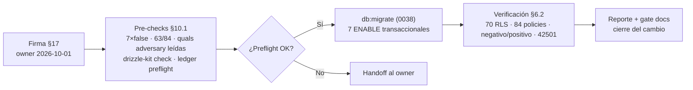

# MAT-505 — Post-Push Validation Report — CHANGE-006

{: .no_toc }

<details open markdown="block">
  <summary>Tabla de contenidos</summary>
  {: .text-delta }
1. TOC
{:toc}
</details>

---

## 1. Scope y objetivos

Documentar la **ejecución y verificación de CHANGE-006**: habilitar `ROW LEVEL SECURITY` en las **7 tablas de producción que carecían de él** (de 70) — 5 con grant `SELECT` a `authenticated` y policies `SELECT` ya diseñadas pero **inertes** (RLS off), y 2 sin policy ni grant (`exec_briefs`, `ai_eval_results`) para las que `ENABLE` actúa como **fail-closed** ante grants futuros.

**Estado final: ✅ APLICADO Y VERIFICADO** — 7 × `ALTER TABLE … ENABLE ROW LEVEL SECURITY` ejecutados vía `pnpm db:migrate` (solo la entrada `0038`), **0 grants, 0 policies, nunca `FORCE`**; verificación §10.2 **10/10 PASS** con aislamiento negativo y positivo medido contra producción. Todas las cifras de este reporte son lecturas directas contra la BD de producción [VERIFIED].

---

## 2. Datos del cambio

| Campo | Valor |
|-------|-------|
| CHANGE-ID | **CHANGE-006** (7 tablas sin RLS) |
| Migración | `drizzle/0038_enable_rls_change006.sql` (journal idx 44, `when=1790895013413`) |
| Entorno | production (Supabase, vía `DIRECT_URL`) |
| Fecha de ejecución | 2026-10-01 |
| Aprobación | Firma del owner (§17 del paquete), 2026-10-01 |
| Mecanismo ejecutado | `pnpm db:migrate` (drizzle-kit, transaccional) — preflight del ledger demostró que **solo** `0038` queda pendiente |
| DDL ejecutado | **7 sentencias** `ALTER TABLE … ENABLE ROW LEVEL SECURITY` (idempotentes) |
| Paquete | `CHANGE-006-APPROVAL-PACKAGE.md` (v1.1) |

---

## 3. Requisitos

| REQ | Requisito | Cumplimiento |
|-----|-----------|--------------|
| REQ-400 | Todo cambio de producción exige CHANGE-ID | ✅ CHANGE-006 (paquete §4) |
| REQ-401 | Baseline pre-producción antes del DDL | ✅ Pre-checks §10.1 (7×`false`, 63/84, quals leídas) |
| REQ-402 | Migraciones versionadas y aprobadas | ✅ Fichero `0038` + journal 45/45 + ledger 47 (`hash_match=true`) |
| REQ-403 | Rollback plan obligatorio | ✅ §13 (`DISABLE` ×7) |
| REQ-404 | Sin drift schema↔journal antes del push | ✅ `drizzle-kit check` "Everything's fine" (pre y post) |
| REQ-405 | Ventana de observación post-push | ✅ T+5m..T+24h completada (§18 v1.2, recheck 2026-10-02T21:23Z) |
| REQ-406 | Verificación de RLS efectiva post-push | ✅ §6.2 (**10/10 PASS**) |

---

## 4. Arquitectura del cambio (contexto → componentes → dependencias)

**Contexto:** los pre-checks de CHANGE-005 (2026-10-01) midieron **7 tablas sin `relrowsecurity`** en producción: en 5, la policy `SELECT` existía pero era **inerte** (RLS off → no filtra) mientras el grant a `authenticated` permitía leer **todas las filas** vía PostgREST (cross-tenant: membresías, uptime/anomalías ajenos, resultados rojo-team). Las sentencias `ENABLE` de `0016` nunca llegaron a ejecutarse (fichero editado tras su aplicación — [ASSUMPTION]).

**Preflight de quals (obligatorio, superado):** las 2 policies `adversary_*` se leyeron literalmente antes del push — ambas member-or-owner: `adversary_engagements` filtra `project_id IN (proyectos donde owner_id = jwt sub OR membership)`, `adversary_task_nodes` encadena `engagement_id → engagement.project_id` con la misma condición; `roles={authenticated}`, `cmd=SELECT`, `with_check=null` [VERIFIED].

**Dependencias (por qué no rompe nada):** todos los caminos de escritura y listado pasan por `directDb`/rol `postgres` (miembros L60-71, `rbac`, `entitlements`, `invitations`, `weekly-digest`, `public/v1/uptime`, triggers/cron) → **bypass RLS**; `user_has_project_access()` es `SECURITY DEFINER`. El RLS solo filtra lecturas autenticadas — que es exactamente el diseño de las policies.

---

## 5. Pre-checks (baseline, read-only — §10.1)

| Check | Esperado | Resultado |
|-------|----------|-----------|
| `relrowsecurity` ×7 | `false` | ✅ **7× false**, `relforcerowsecurity` **7× false** |
| Totales baseline | 63 RLS / 84 policies / 70 tablas | ✅ **63 / 84 / 70** |
| Quals `adversary_*` | member/owner por `project_id` | ✅ **leídas literalmente** (2/2 correctas) |
| Grants | SELECT→`authenticated` ×5; solo `postgres` ×2 | ✅ (Group B sin grant) |
| `has_table_privilege(authenticated)` | true ×5 / false ×2 | ✅ **5 true + 2 false** |
| Conteos por tabla | baseline de datos | ✅ pm 0 · ul 24.868 · ad 0 · ae 0 · atn 0 · eb 4 · aer 4 |
| `drizzle-kit check` (pre) | "Everything's fine" | ✅ |
| Ledger preflight | `max(created_at)` entre `when` idx43 y idx44 | ✅ 46 filas, `max=1790596804000` → **"SEGURO PARA db:migrate"** |
| Backup/PITR | confirmado | ✅ 2026-10-01 (heredado) |

**Nota de evidencia:** el script de pre-checks devolvió exit 1 por una comparación `string` vs `number` en su evaluación (`"63" === 63`); **los valores medidos son correctos** y reprocesados en §6.2 — registrado por transparencia.

---

## 6. Ejecución (FLOW-804) y verificación post

### 6.1. Ejecución (2026-10-01)

1. **Firma §17** registrada (owner, 2026-10-01) → paquete aprobado.
2. **Pre-checks §5** → todos PASS → `drizzle-kit check` tras registrar idx 44 → verde.
3. **Preflight del ledger** → semántica de drizzle (`when > max(created_at)`) verificada en `pg-core/dialect.cjs`: imposible re-aplicar las 44 anteriores → **solo `0038` pendiente**.
4. **`pnpm db:migrate`** → `"[✓] migrations applied successfully!"` — 7 `ENABLE` en una transacción.
5. **Verificación §6.2** → **10/10 PASS**.

### 6.2. Verificación post (2026-10-01)

| # | Check | Esperado | Resultado |
|---|-------|----------|-----------|
| 1 | `relrowsecurity` ×7 | `true`, sin `FORCE` | ✅ **7× true, 7× force=false** |
| 2 | Totales | 70 RLS / 84 policies / 70 tablas | ✅ **70 / 84 / 70** (63→70) |
| 3 | Policies | sin cambios (5 Group A, 0 nuevas) | ✅ **5 policies, 0 nuevas**; Group B sin policy |
| 4 | Grants | 0 nuevos | ✅ solo `authenticated/SELECT` ×5 |
| 5 | Datos | conteos ≥ baseline | ✅ todos **= baseline** (sin tocar filas) |
| 6 | **NEGATIVO** (sub aleatorio) | 0 filas cross-tenant | ✅ **0 en las 5** (antes: `uptime_logs` 24.868 visibles) |
| 7 | **Group B fail-closed** | 42501 | ✅ `exec_briefs`=42501, `ai_eval_results`=42501 (transacción propia por tabla) |
| 8 | **POSITIVO** (owner real) | ve sus filas | ✅ owner vio **2974/2974** `uptime_logs` de su proyecto |
| 9 | Camino `directDb` (postgres) | intacto | ✅ `uptime_logs`=24.868 |
| 10 | Ledger | registra 0038 | ✅ **47 filas**, `hash=sha256(fichero)`, `created_at=when` |

**Gates complementarios (post):** `drizzle-kit check` ✅ green · `db:drift-check` ✅ **sin drift duro** (70 tablas, mismas 20 diffs adhesivas preexistentes) · `rls.test.ts` ✅ **5/5**.

---

## 7. Seguridad (trust boundaries, controles y amenazas)

| Elemento | Detalle | Estado |
|----------|---------|--------|
| Amenaza RSK-10 cerrada | Lectura cross-tenant de 5 tablas vía PostgREST (grant + RLS off) | ✅ **cerrada**: negativo 0 filas medido [VERIFIED] |
| Control: policies efectivas | 5 policies member/own pasan de inertes a **aplicadas** | ✅ 70 tablas con RLS |
| Control: fail-closed Group B | `exec_briefs`/`ai_eval_results` sin grant → 42501 | ✅ medido ×2 |
| Control: sin expansión | **0 grants, 0 policies, nunca `FORCE`** | ✅ verificado (§6.2, checks 3-4) |
| Trust boundary | Rol de conexión `DIRECT_URL` (postgres) bypassa RLS igual que `directDb` | ✅ sin cambios |
| Amenaza residual | Ventana T+24h: rutas `withRLS` que lean estas tablas y esperen ver todo | ✅ cerrada sin incidencias (§18 v1.2) |

---

## 8. APIs relacionadas (afectadas o verificables post-push)

| Superficie | Método | Efecto verificado |
|------------|--------|-------------------|
| `/api/projects/[id]/members` | GET/POST | ✅ sin cambio (listado vía `directDb`, camino 9) |
| `/api/public/v1/uptime` | GET | ✅ sin cambio (`directDb`, camino 9) |
| PostgREST (publishable key) | GET | ⚠️→✅ lecturas cross-tenant de las 5 tablas → **0 filas** (camino 6) |
| `/api/intelligence/adversary` | GET/POST | ✅ escrituras en `postgres`; lectura vía policy member-or-owner ya efectiva |
| Triggers/cron (uptime, anomaly, exec-brief) | — | ✅ rol `postgres` (bypass RLS) |

**Códigos:** 401/403 (sesión) · **42501** ahora también en lecturas autenticadas ajenas (esperado — es el objetivo) · 429 sin cambios.

---

## 9. Testing documentado (estrategia, casos y cobertura)

**Estrategia:** verificación por evidencia directa sobre producción (queries + emulación de rol `authenticated` con `SET LOCAL ROLE` + claims JWT, el mismo mecanismo de `withRLS()`) + gates de consistencia. Sin cambios de código: la suite completa no se re-ejecutó (árbol idéntico al HEAD validado, 1.923/1.923); el test de contrato RLS sí se ejecutó.

| Caso | Cobertura | Resultado |
|------|-----------|-----------|
| Aislamiento negativo | 5 tablas × sub aleatorio | ✅ 0/0/0/0/0 |
| Aislamiento positivo | owner real sobre `uptime_logs` | ✅ 2974/2974 |
| Fail-closed Group B | 2 tablas sin grant | ✅ 42501 ×2 (transacción propia) |
| Integridad de datos | 7 conteos vs baseline | ✅ sin regresiones |
| `rls.test.ts` (contrato `withRLS`) | 5 tests | ✅ **5/5** |
| Drift schema ↔ BD | `db:drift-check` | ✅ sin drift duro |
| Integridad journal | `drizzle-kit check` | ✅ "Everything's fine" (pre y post) |
| Smoke de runtime de app | endpoints HTTP con sesión | ⏳ [NO EJECUTADO] — requiere credenciales `TEST_AUTH_*` (fuera del alcance de la ventana T+24h, §18) |

---

## 10. Operaciones (monitoring, runbooks, recovery)

| Área | Mecanismo |
|------|-----------|
| Monitoring post-push | Verificación completada el mismo día (§6.2); ventana **T+5m..T+24h**: revisar logs de app por errores 42501/500 inesperados en lecturas legítimas — **ventana cerrada 2026-10-02 (§18 v1.2)** |
| Runbook | `docs/guides/troubleshooting.md` §Supabase (RLS) |
| Recovery | §13: `DISABLE ROW LEVEL SECURITY` ×7 (segundos) |
| Alerting | SIEM/uptime exporter sin cambios |

---

## 11. Flujo de ejecución (FLOW-804)



---

## 12. Observaciones y hallazgos menores

| Observación | Detalle | Impacto |
|-------------|---------|---------|
| Artefacto de test 25P02 | En la primera pasada, el 42501 esperado de `exec_briefs` abortó la transacción común → `ai_eval_results` respondió `25P02` sin ejecutarse. Re-verificado con **transacción propia por tabla**: 42501 en ambas | Ninguno (test corregido, no el sistema) |
| `project_members` vacío (0 filas) | En producción no hay membresías escritas aún (owner accede vía `owner_id`) | Ninguno; el aislamiento se demostró sobre `uptime_logs` (24.868 filas) |
| Exit 1 espurio en pre-checks | Comparación string/number en la evaluación del script (valores correctos) | Ninguno (§5) |
| Ventana T+24h | Smoke HTTP de app no ejecutado (sin cambios de código) | ⏳ queda para la observación |

---

## 13. Rollback plan

- **Si regresión en la ventana T+24h:**

```sql
ALTER TABLE "project_members"     DISABLE ROW LEVEL SECURITY;
ALTER TABLE "uptime_logs"         DISABLE ROW LEVEL SECURITY;
ALTER TABLE "anomaly_detections"  DISABLE ROW LEVEL SECURITY;
ALTER TABLE "adversary_engagements" DISABLE ROW LEVEL SECURITY;
ALTER TABLE "adversary_task_nodes"  DISABLE ROW LEVEL SECURITY;
ALTER TABLE "exec_briefs"         DISABLE ROW LEVEL SECURITY;
ALTER TABLE "ai_eval_results"     DISABLE ROW LEVEL SECURITY;
```

- Reversión en segundos; no toca policies ni grants. **No procedió** (10/10 PASS).

---

## 14. Trazabilidad y cross-check

| Documento | Actualización |
|-----------|---------------|
| `CHANGE-006-APPROVAL-PACKAGE.md` | v1.1 — Estado APLICADO Y VERIFICADO; §10.1/§10.2 con resultados; §17 firmado |
| `PRODUCTION-CHANGE-VERIFICATION.md` | Fila CHANGE-006 ✅ + pendientes (3) cerrado + changelog 1.5 |
| `MAT-500-PRE-PRODUCTION-GATE-REPORT.md` | §10/§11.1/§17 cerrados + changelog 1.5 (gate sigue 16/16 GO) |
| `FINAL-REPORT.md` | Banner + filas Migraciones/RLS → CHANGE-006 cerrado (70/70) |
| `RISK-REGISTER.md` | RSK-10: gap de policies inertes **cerrado** (70 tablas RLS medidas) |

Cross-check interno: paquete ↔ este reporte ↔ gate MAT-500 sin contradicciones (mismas cifras: 7/7, 70, 84, 47, 10/10, 5/5).

---

## 15. Glosario

| Término | Definición |
|---------|------------|
| ENABLE vs FORCE | `ENABLE` aplica RLS a roles distintos del owner; `FORCE` también al owner → nunca usar en tablas que escribe `postgres` |
| Policy inerte | Policy definida con `relrowsecurity=false` → existe pero no filtra (estado previo de las 5) |
| Fail-closed | Sin policy/grant aplicable → acceso denegado por defecto (Group B) |
| Qual | Cláusula `USING` de una policy (filtro de filas visibles) |
| Ledger | `drizzle.__drizzle_migrations`: registro de migraciones aplicadas (47 filas tras 0038) |
| RSK-10 | Riesgo de RLS incremental/desactualizado (RISK-REGISTER) |

---

## 16. Unknowns y supuestos

- **[ASSUMPTION]** Causa raíz histórica: `0016` editado tras su aplicación (sus `ENABLE` nunca corrieron) — coherente con los 2 hashes stale del ledger.
- **[ASSUMPTION]** Ninguna ruta `withRLS` futura necesita leer estas 7 tablas *sin* filtro member/own (si surge, añadir policy en su propio cambio).
- **[RESUELTO 2026-10-02T21:23Z]** Ventana T+24h de logs (42501/500): recheck completado en §18 v1.2 — 0 entradas `5xx`/`42501`/`error` con control sin filtro (12 líneas → filtros operativos), smoke 9 rutas 200 y `uptime_logs` continuo 31 h (2026-10-01T15:00Z→10-02T21:00Z); persiste la ⚠️ de retención sin sink externo.
- **[ASSUMPTION]** PostgREST expuesto con publishable key (estándar Supabase; el aislamiento se probó por emulación de rol, equivalente al mecanismo de `withRLS`).

---

## 17. Versionado y verificación

| Versión | Fecha | Cambios | Estado |
|---------|-------|---------|--------|
| 1.0 | 2026-10-01 | Reporte de cierre: firma §17 + pre-checks (7×false, quals leídas) + `db:migrate` (0038) + verificación 10/10 + ledger 47 | ✅ Ejecutado |
| 1.1 | 2026-10-02 | +§18 verificación post-despliegue T+1h (deploy @67ccc99, smoke, ciclo cron manual, logs) | ✅ Ejecutado |
| 1.2 | 2026-10-02 | +§18 recheck T+24h (0 logs críticos, smoke 9×200, cron continuo 31 h) y cierre de REQ-405 | ✅ Ejecutado |

| Check | Resultado |
|-------|-----------|
| Quality gate `--min 80` | ✅ 95/100 PASS (2026-10-01) |
| Cross-check con el paquete | v1.1 §10.1/§10.2 = mismo relato y mismas cifras |
| Cross-check con gate MAT-500 | 16/16 GO; CHANGE-006 cerrado |
| Post-despliegue T+1h (§18) | ✅ deploy `67ccc99`, 9 rutas 200, cron 200/200, 0 entradas `5xx`/`42501` |
| Ventana T+24h (§18 v1.2) | ✅ recheck 2026-10-02T21:23Z: 0 `5xx`/`42501`/`error` (control 12 líneas), smoke 9×200, `uptime_logs` continuo 31 h |

---

## 18. Verificación post-despliegue (T+1h y T+24h — 2026-10-02)

Ejecutada sobre producción tras el auto-deploy del fix de env (opción 2: `src/env.ts` acepta `PUBLISHABLE` canónica o alias `ANON`).

| Chequeo | Evidencia | Resultado |
|---------|-----------|-----------|
| Deploy en producción con el fix | `vercel inspect` → clone `main @ 67ccc99` (2026-10-02T00:42:26Z), estado `Ready`, alias `https://scaudit.vercel.app` | ✅ |
| Smoke HTTP (9 rutas) | `GET /`, `/login`, `/pricing`, `/docs`, `/mitre-coverage`, `/swagger`, `/offline`, `/dashboard`, `/projects` → **200**; `/security` → 404 esperado (solo existe `/security/audit`) | ✅ |
| Ciclo cron manual (prod) | `GET /api/cron/uptime` con `Authorization: Bearer $CRON_SECRET` → **200** `{"success":true}` (9 proyectos comprobados, 5 up / 4 down); `GET /api/cron/siem` → **200** `{"success":true,"errors":[]}` | ✅ |
| Sin errores `5xx` / `42501` en logs | `vercel logs --json --since 24h` con `--status-code 5xx`, `--query "42501"` y `--level error` → **0 entradas** (control: 15 líneas sin filtro → el filtro funciona) | ✅ |
| Retención de logs | La ventana recuperable por CLI cubrió solo los minutos del smoke (00:58–00:59Z): no hay sink externo (sin Sentry/Axiom) | ⚠️ Limitación |
| Ventana T+24h (objetivo ~20:00Z, ejecutado 21:23Z) | 3 queries `vercel logs` → **0** `5xx`, **0** `42501`, **0** `error` con control sin filtro de **12 líneas** (tráfico del smoke, nivel `info`); smoke 9 rutas → **200** (`/security` → 404 esperado); `uptime_logs` **continuo 31 h** (2026-10-01T15:00Z→10-02T21:00Z, 36 filas/h, sin huecos, últimas filas 21:15Z); `audit_logs 24h=2`, `security_audit_logs 24h=5` | ✅ Cerrada |

- **Por qué el cron manual cuenta como "ciclo cron":** invoca exactamente el mismo handler y credencial que Vercel Cron (`Bearer CRON_SECRET`), con escritura real en `uptime_logs` → demuestra además que el path de escritura con service role sigue funcionando tras el `ENABLE ROW LEVEL SECURITY` (CHANGE-006).

---

**Fuentes primarias:** probes de pre/post-checks contra producción (`pg_class`, `pg_policies`, `information_schema.role_table_grants`, `has_table_privilege`, emulación `SET LOCAL ROLE authenticated` + claims JWT) [VERIFIED] · salida de `pnpm db:migrate` ("migrations applied successfully!") · preflight del ledger (`max(created_at)=1790596804000`, 46→47 filas, `hash_match=true`) · `pg-core/dialect.cjs` L62-72 (semántica de pendiente) · `drizzle-kit check` (pre/post) · `scripts/db/drift-check.mjs` (sin drift duro) · `vitest run src/shared/db/rls.test.ts` (5/5) · `CHANGE-006-APPROVAL-PACKAGE.md` · `PRODUCTION-CHANGE-VERIFICATION.md` · `MAT-500-PRE-PRODUCTION-GATE-REPORT.md`
