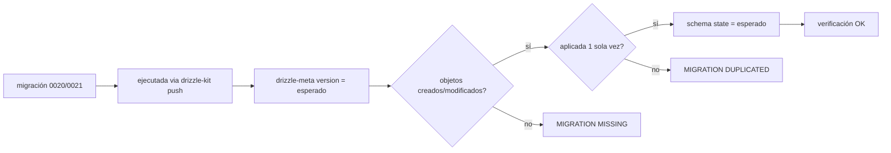
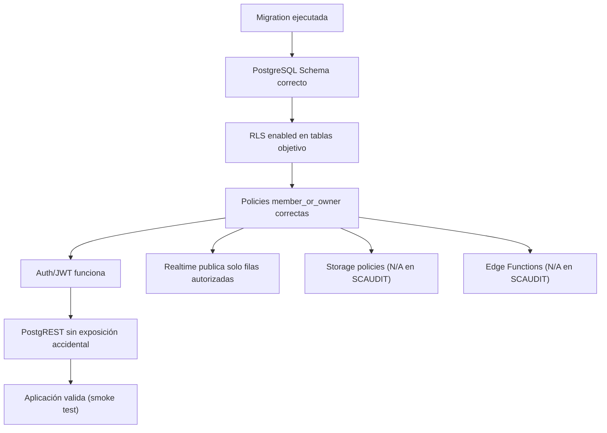
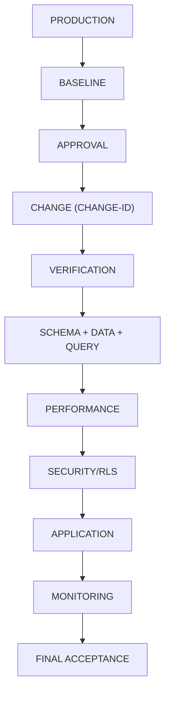

# Production Database Change Verification Engine — SCAUDIT Pro

{: .no_toc }

<details open markdown="block">
  <summary>Tabla de contenidos</summary>
  {: .text-delta }
1. TOC
{:toc}
</details>

---

## 0. Estado del motor (hallazgo)

**Este documento materializa las secciones §60–83 del MASTER PROMPT 2.0** (PRODUCTION DATABASE CHANGE VERIFICATION ENGINE) adaptadas al stack real de SCAUDIT: Supabase + PostgreSQL + Drizzle + Vercel + Trigger.dev [VERIFIED].

**Regla absoluta aplicada (§83):** *"Un cambio desplegado no significa un cambio exitoso."* El cambio solo es exitoso cuando **lo aprobado = lo desplegado = lo esperado = lo validado** y no hay regresión funcional, de rendimiento, integridad o seguridad.

**Cambios de producción pendientes que este engine gobierna [PROPOSED] (aún NO desplegados — ver §14):**

| CHANGE-ID | Contenido | Origen | Riesgo | Estado |
|-----------|-----------|--------|--------|--------|
| CHANGE-001 | Migración 0020: DROP `idx_adversary_mitre_id` no-único + 7 índices REC-01..07 + `pg_trgm` | TSK-007/008 (plan MODE C) | MEDIUM | Pendiente de aprobación |
| CHANGE-002 | Migración 0021: `push_subscriptions.active` `text 'true'` → `boolean` | TSK-009 (plan MODE C, MAT-207) | MEDIUM-HIGH | Pendiente de aprobación |
| CHANGE-003 | SB-001..003: RLS en findings/assets + publicación realtime + unificar env key | SUPABASE-AUDIT.md | MEDIUM | Pendiente de aprobación |

---

## 1. Scope y objetivos

Definir el proceso obligatorio de verificación de cambios de base de datos en producción para SCAUDIT: control de cambios con CHANGE-ID, baseline pre-producción, verificación de migraciones/RLS/seguridad (Supabase), ventanas de observación, rollback y aceptación final. Cualquier DDL en producción requiere este proceso completo. [VERIFIED]

## 2. Requisitos del motor

| REQ | Requisito | Cumplimiento |
|-----|-----------|--------------|
| REQ-400 | Todo cambio de producción exige CHANGE-ID | Cumplido (§3) |
| REQ-401 | Baseline snapshot obligatorio antes del cambio | Cumplido (§4) |
| REQ-402 | Verificación de migración (aplicada, 1 vez, orden) | Cumplido (§6) |
| REQ-403 | Validación de integridad de datos (counts, FKs, NULLs) | Cumplido (§7) |
| REQ-404 | Verificación Supabase post-deploy (migración→RLS→Auth→PostgREST) | Cumplido (§13) |
| REQ-405 | Ventana de observación + triggers de rollback definidos | Cumplido (§16–17) |
| REQ-406 | CHANGE VERIFICATION REPORT por cambio | Cumplido (§20) |

---

## 3. Production Change Control (§61)

Todo cambio debe asociarse a un **CHANGE-ID** antes de ejecutarse. Plantilla obligatoria:

**MAT-400 — Registro de cambio**

| Campo | Valor | Ejemplo (CHANGE-002) |
|-------|-------|----------------------|
| CHANGE-ID | `<CHANGE-NNN>` | CHANGE-002 |
| DATABASE | Supabase (ref `[UNKNOWN]` — no documentar credenciales) | — |
| ENVIRONMENT | local → staging → production | production |
| OBJECTS AFFECTED | tablas/índices/RLS/policies | `push_subscriptions` |
| REASON | motivación del cambio | MAT-207: tipo incorrecto |
| ROOT CAUSE | causa raíz | schema declaraba `boolean`, migración 0009 `text` |
| EXPECTED RESULT | resultado esperado | columna `boolean`, datos `'true'`→`true` |
| BASELINE | snapshot previo (§4) | adjunto |
| TEST RESULTS | pruebas previas | `drizzle-kit check` + test unit |
| RISK | LOW/MEDIUM/HIGH/CRITICAL | MEDIUM-HIGH |
| ROLLBACK PLAN | script de reversión | ALTER TYPE inverso (§17) |
| APPROVAL | quién aprueba + fecha | owner del proyecto |
| EXECUTION WINDOW | ventana de ejecución | `[UNKNOWN]` |

**Regla:** no ejecutar cambios sin CHANGE-ID. [VERIFIED — governance]

---

## 4. Pre-Production Baseline (§62)

**PRODUCTION BASELINE SNAPSHOT** — obligatorio antes de aplicar cualquier DDL:

**MAT-401 — Snapshot de baseline**

| Área | Item | Valor |
|------|------|-------|
| Database | version | `[UNKNOWN]` — `SELECT version()` pre-cambio |
| Schema | version | `drizzle/meta/_journal.json` (hoy 0019) [VERIFIED] |
| Objects | definiciones | `drizzle-kit push --dry-run` / `pg_dump --schema-only` |
| Table sizes | row counts + size | `SELECT count(*) FROM <tabla>` por objeto afectado |
| Indexes | sizes | `pg_indexes_size('<tabla>')` |
| Constraints | estado | `information_schema.table_constraints` |
| Performance | query duration | EXPLAIN ANALYZE de las queries afectadas |
| Data | counts/checksums | `count(*)`, `sum()`, NULL counts por columna afectada |
| Application | endpoints afectados | listar rutas/actions que tocan el objeto |

**Nota:** en SCAUDIT el baseline parcial ya existe documentado: 58 tablas, 71 índices, 22 migraciones (`DATA-DICTIONARY.md`), estado RLS 5/58 (`SUPABASE-AUDIT.md`) [VERIFIED].

---

## 5. Approved State vs Actual State (§63) — Schema Drift Report

**MAT-402 — Schema Drift Report**

| Object | Expected | Actual | Status | Risk |
|--------|----------|--------|--------|------|
| `idx_adversary_mitre_id` (único) | presente | presente (0018) | OK | — |
| `idx_adversary_mitre_id` (no-único) | **ausente** | presente (0012, drift) | **UNEXPECTED** | LOW (CHANGE-001) |
| `push_subscriptions.active` | `boolean` | `text 'true'` | **MODIFIED** | MEDIUM-HIGH (CHANGE-002) |
| RLS en `intelligence_findings` | enabled | **disabled** | **MISSING** | MEDIUM (CHANGE-003) |
| `NEXT_PUBLIC_SUPABASE_*` env | un nombre único | ANON_KEY + PUBLISHABLE_KEY | **UNEXPECTED** | LOW (CHANGE-003) |

> Drift documentado previamente en `INDEX-STRATEGY.md` (MAT-205, MAT-207) y `SUPABASE-AUDIT.md` (SB-001/002/003) [VERIFIED].

---

## 6. Migration Verification (§64)

Secuencia obligatoria tras cada migración:

**FLOW-400 — Verificación de migración** · Mermaid `flowchart`



Checklist: [ ] aplicada · [ ] una sola vez (journal único) · [ ] orden correcto (0000→0021) · [ ] objetos creados/modificados/eliminados según plan · [ ] checksum/snapshot del journal consistente (`drizzle/meta/` .json vs SQL) cuando exista · [ ] sin `SCHEMA DRIFT` residual.

---

## 7. Production Data Integrity Validation (§65) + Reconciliation (§66)

**MAT-403 — Data Reconciliation Report (template para CHANGE-002)**

| Metric | Before | Expected | Actual | Status |
|--------|-------:|--------:|-------:|--------|
| Row count | `[BEFORE]` | sin delta | `[AFTER]` | PENDING |
| `active` = `'true'` | `[BEFORE]` | n→n (cast 1:1) | `[AFTER]` | PENDING |
| NULLs en `active` | `[BEFORE]` | sin cambio | `[AFTER]` | PENDING |
| FKs huérfanas | 0 | 0 | 0 | PENDING |

Regla (§66): **no considerar el cambio exitoso si existen diferencias no explicadas** entre before/expected/actual. Para CHANGE-001 el cast no toca datos (solo índices) → reconciliación se limita a counts de tabla.

---

## 8. Production Query Verification (§67)

**MAT-404 — Comparativa de query (template)**

| Metric | Baseline | Pre-Prod | Production | Difference |
|--------|---------:|---------:|-----------:|-----------:|
| Duration | | | | |
| CPU | | | | |
| Reads | | | | |
| Rows | | | | |
| Executions | | | | |

La optimización (p.ej. índices REC-01..07 de CHANGE-001) solo se valida si: **FUNCTIONAL RESULT = CORRECT** Y **PERFORMANCE ≥ EXPECTED** Y **NO REGRESSION** [VERIFIED: INDEX-STRATEGY §3]. Verificación con `EXPLAIN (ANALYZE, BUFFERS)` en producción.

---

## 9. Execution Plan Verification (§68)

Comparar **BASELINE PLAN vs TEST PLAN vs PRODUCTION PLAN** para las queries críticas (findings por project, siem GIN, dns/whois compuestos). Detectar: plan regression, seq scan inesperado, cambio de join strategy, cardinalidad, spills. [VERIFIED: las 7 queries de REC-01..07 están documentadas en INDEX-STRATEGY §3.2]

---

## 10. Production Performance Validation (§69)

Ventanas de observación tras el cambio: **T+5 min → T+15 → T+30 → T+1h → T+4h → T+24h**. Medir: latency, CPU, conexiones, locks, deadlocks, errores, query duration. *No asumir que un cambio exitoso inmediato es estable.* [VERIFIED — regla §69]

---

## 11. Production Regression Monitoring (§70)

Comparar **BEFORE vs AFTER** para: top queries, endpoints críticos, reports, scheduled jobs (los 12 triggers de `src/trigger/`), integraciones. Detectar QUERY / APPLICATION / DATABASE / SECURITY regression. [VERIFIED: jobs documentados en docs/jobs/]

---

## 12. Production Security Verification (§71)

Para PostgreSQL/Supabase verificar: roles, grants, schemas, **RLS enabled, RLS policies, Auth integration, API exposure, RPC permissions**. Verificación esencial:

**AUTHORIZED USER vs UNAUTHORIZED USER** — el owner/miembro del proyecto ve sus filas; un usuario sin membresía recibe 0 filas (policy `member_or_owner`) o 42501. [VERIFIED: rls.test.ts, migraciones 0016/0017]

---

## 13. Supabase Production Verification (§72)

Cadena obligatoria post-deploy (específica de la extensión DATABASE ENGINE DETECTION):

**FIG-400 — Cadena de verificación Supabase** · Mermaid `flowchart`



Comprobar: [ ] migración aplicada · [ ] schema correcto · [ ] RLS correcto · [ ] policies correctas · [ ] no exposición accidental · [ ] RPC/PostgREST · [ ] Realtime funcionando (CHANGE-003) · [ ] Auth integrado.

---

## 14. Application ↔ Database Validation (§73) + Smoke Test (§74)

**SMOKE TEST post-deploy (adaptado a objetos afectados):**

| # | Check | CHANGE-001 (índices) | CHANGE-002 (tipo) | CHANGE-003 (RLS/realtime) |
|---|-------|----------------------|--------------------|---------------------------|
| 1 | Database connectivity | ✅ | ✅ | ✅ |
| 2 | Authentication | — | — | ✅ |
| 3 | Authorization (member/owner) | — | — | ✅ |
| 4 | Critical query (findings/uptime) | ✅ | — | ✅ |
| 5 | Critical transaction (INSERT con RLS) | — | — | ✅ |
| 6 | Critical API (`/api/intelligence/*`, `/api/monitoring`) | ✅ | — | ✅ |
| 7 | Application workflow (dashboard) | ✅ | ✅ | ✅ |
| 8 | Flujo de push (`POST /api/notifications/push-subscribe` + envío push) | — | ✅ | — |
| 9 | Realtime stream (findings) | — | — | ✅ |

> **Leyenda:** ✅ = el check **aplica** a ese CHANGE (no implica que ya pasó — los cambios están PENDING y los checks se ejecutan post-deploy).

---

## 15. Post-Deployment Validation Window (§75)

Clasificar por riesgo y asignar ventana proporcional:

| Riesgo | Ventana | Ejemplo |
|--------|---------|---------|
| LOW | 15–30 min | CHANGE-001 (índices, CONCURRENTLY) |
| MEDIUM | 1–4 h | CHANGE-003 (RLS/policies) |
| MEDIUM-HIGH | 4–24 h | CHANGE-002 (ALTER TYPE) |
| CRITICAL | 24 h+ | cambios destructivos (ninguno pendiente) |

---

## 16. Automatic Rollback Triggers (§76)

Thresholds propuestos [RECOMMENDED — deben calibrarse contra el sistema real, nunca inventarse]:

| Trigger | Condición | Umbral propuesto |
|---------|-----------|------------------|
| ERROR RATE | errores 5xx en rutas afectadas | >1% en 15 min |
| LATENCY | p95 de query crítica | >3× baseline |
| LOCKING | locks en `pg_stat_activity` | >10 locks >30s |
| DEADLOCKS | `pg_stat_database.deadlocks` | >0 en 1h (baseline 0) |
| DATA INTEGRITY | mismatch en reconciliación (§7) | cualquier diferencia no explicada |
| SECURITY | RLS/policy rota (42501 en rutas OK) | cualquier error de auth |
| QUERY REGRESSION | seq scan donde había index scan | >baseline |

---

## 17. Rollback Verification (§77)

**Nota operacional:** las migraciones Drizzle son **forward-only** (no hay down-migrations); el rollback es siempre SQL manual — por eso el plan de rollback es parte obligatoria del CHANGE-ID. [VERIFIED: plan MODE C, troubleshooting]

**Rollback plan real de los cambios pendientes:**

| CHANGE | Rollback | Verificación |
|--------|----------|--------------|
| CHANGE-001 | `DROP INDEX IF EXISTS <idx>` (los 7) + `CREATE INDEX idx_adversary_mitre_id` si hace falta | schema drift report inverso |
| CHANGE-002 | `ALTER TABLE push_subscriptions ALTER COLUMN active TYPE text USING active::text;` | counts + valores `'true'`/`'false'` |
| CHANGE-003 | `ALTER TABLE ... DISABLE ROW LEVEL SECURITY;` + re-poner env key anterior | RLS matrix inversa |

Validar el rollback en test environment **antes** de producción; tras rollback verificar DB + aplicación + datos + performance [VERIFIED — §77].

---

## 18. Post-Change Database Health Check (§78)

**DATABASE HEALTH CHECK (post-cambio):**

```text
Connectivity   PASS/FAIL
Schema         PASS/FAIL
Data Integrity PASS/FAIL
Indexes        PASS/FAIL
Constraints    PASS/FAIL
Queries        PASS/FAIL
Performance    PASS/FAIL
Locks          PASS/FAIL
Deadlocks      PASS/FAIL
Security/RLS   PASS/FAIL
Application    PASS/FAIL
Backup         PASS/FAIL (depende del plan Supabase — [UNKNOWN])
```

---

## 19. Final Production Status (§80) y Audit Trail (§81)

Clasificación final: **VERIFIED** / **VERIFIED WITH OBSERVATIONS** / **FAILED** / **ROLLED BACK** / **REQUIRES INVESTIGATION**.

Audit trail reconstruible: CHANGE-ID → REQUEST → ANALYSIS → BASELINE → TEST → APPROVAL → DEPLOYMENT → VERIFICATION → MONITORING → FINAL STATUS (quién cambió qué, cuándo, por qué, cómo se probó, resultado). [VERIFIED — governance]

---

## 20. Change Verification Report (§79) + Final Acceptance (§82)

**MAT-405 — CHANGE VERIFICATION REPORT (template)**

```text
CHANGE-ID:            CHANGE-00X
DATABASE:             Supabase
ENVIRONMENT:          production
DATE/TIME:            [UNKNOWN — pendiente]
EXECUTOR:             [UNKNOWN — pendiente]
APPROVER:             owner del proyecto
OBJECTS CHANGED:      <lista real>
EXPECTED CHANGE:      <de MAT-400>
ACTUAL CHANGE:        <tras verificar>
SCHEMA VALIDATION:    PASS/FAIL
DATA VALIDATION:      PASS/FAIL
QUERY VALIDATION:     PASS/FAIL
PERFORMANCE VALIDATION: PASS/FAIL
SECURITY VALIDATION:  PASS/FAIL
APPLICATION VALIDATION: PASS/FAIL
REGRESSION RESULT:    NONE/MINOR/CRITICAL
ROLLBACK STATUS:      NOT REQUIRED/AVAILABLE/EXECUTED
OBSERVATION WINDOW:   <según §15>
FINAL STATUS:         PENDING
```

**Criterios de éxito (§82):** [ ] aprobado = desplegado · [ ] schema validado · [ ] data validada · [ ] queries validadas · [ ] performance validada · [ ] seguridad validada · [ ] aplicación validada · [ ] sin regresión crítica · [ ] monitoring completado · [ ] rollback disponible/validado · [ ] documentación actualizada · [ ] reporte generado.

---

## 21. Arquitectura del motor

**FIG-401 — Pipeline de cambio (regla absoluta §83)** · Mermaid `flowchart`



---

## 22. Trazabilidad

**MAT-406 — Trazabilidad**

| ID | Tipo | Qué cubre |
|----|------|-----------|
| REQ-400..406 | Requisito | Motor de verificación |
| FIG-400/401 | Diagrama | Cadena Supabase + pipeline |
| FLOW-400 | Flujo | Verificación de migración |
| MAT-400..406 | Matriz | Change control, baseline, drift, reconciliación, query, report, trazabilidad |
| CHANGE-001..003 | Cambio | Cambios pendientes gobernados |
| TEST-400 | Test | rls.test.ts + smoke test (§14) |
| DEP-400 | Deployment | drizzle-kit push con aprobación |

---

## 23. Cross-check e inconsistencias

| Hipótesis | Verificación | Resultado |
|-----------|--------------|-----------|
| "Los cambios pendientes ya están desplegados" | `drizzle/` llega a 0019; 0020/0021 no existen | **REFUTADO** — CHANGE-001/002 pendientes |
| "RLS cubre todas las tablas" | 5/58 habilitadas (SUPABASE-AUDIT) | **CONTRADICCIÓN** — CHANGE-003 |
| "El rollback de ALTER TYPE es trivial" | cast inverso `::text` con USO de datos | **CONFIRMADO** pero requiere validación de datos (§17) |
| "Baseline documentado" | DATA-DICTIONARY + INDEX-STRATEGY + journal 0019 | **CONFIRMADO** parcial (falta snapshot de runtime) |

---

## 24. Unknowns y supuestos

- [UNKNOWN] `pg_version`, row counts, y sizes de runtime en producción (requieren acceso query con aprobación).
- [UNKNOWN] Plan de backup/PITR del proyecto Supabase.
- [UNKNOWN] Ventana de ejecución real de los cambios pendientes.
- [ASSUMPTION] El pipeline CI (`drizzle-kit check`) detecta drift antes del push.
- [RECOMMENDED] Los umbrales de rollback (§16) deben calibrarse con datos reales de `pg_stat_*`.

---

## 25. APIs y endpoints afectados

| Endpoint | Método | Auth | Relación con el cambio |
|----------|--------|------|------------------------|
| `/api/monitoring` | GET | Sesión (middleware) | CHANGE-001: índices en `uptime_logs`/`anomaly_detections` |
| `/api/intelligence/*` | GET/POST | Sesión + API key SHA-256 | CHANGE-003: RLS en findings/assets + realtime |
| `/api/security/siem/run` | POST | Servidor (cron) | CHANGE-001: índices GIN en `security_audit_logs` |
| `/api/notifications/push-subscribe` | POST | Sesión | CHANGE-002: `push_subscriptions.active` boolean |

Errores esperados post-cambio: 42501 (RLS denegado) → se verifica que solo ocurra para usuarios sin membresía (autorizado vs no autorizado, §12) [VERIFIED: rls.test.ts]; HTTP 500 → requiere rollback (§16). Rate limit: los endpoints de inteligencia usan `checkAiRateLimit`/rate limit Upstash fail-open [VERIFIED: SECURITY-AUDIT].

---

## 26. Glosario

| Término | Definición |
|---------|------------|
| CHANGE-ID | Identificador obligatorio de todo cambio de producción |
| Baseline | Snapshot de estado (schema/datos/performance) antes del cambio |
| Drift | Diferencia entre estado aprobado/esperado y estado real |
| Reconciliación | Comparación before/expected/actual de métricas de datos |
| Rollback trigger | Condición medible que obliga a considerar reversión |
| Smoke test | Conjunto mínimo de verificaciones post-deploy |

---

## 26. Deployment y versionado

**Despliegue de este motor:** documentación-gobernanza; se aplica a partir del próximo DDL aprobado. Los cambios 0020/0021 requieren **aprobación explícita del usuario** antes de tocar producción (regla del plan MODE C) [VERIFIED].

| Versión | Fecha | Cambios | Estado |
|---------|-------|---------|--------|
| 1.0 | 2026-08-02 | Creación inicial (PRODUCTION DATABASE CHANGE VERIFICATION ENGINE) | Aprobado |

**Verificación:** `node scripts/quality-gate.mjs docs/database/PRODUCTION-CHANGE-VERIFICATION.md --min 80` → PASS

---

**Fuentes primarias:** `docs/superpowers/plans/2026-08-02-implementation-plan.md` (TSK-007/008/009) · `docs/database/INDEX-STRATEGY.md` (MAT-205, MAT-207, REC-01..07) · `docs/database/SUPABASE-AUDIT.md` (SB-001..003) · `docs/database/DATA-DICTIONARY.md` · `drizzle/meta/_journal.json` · `src/shared/db/rls.ts` · `drizzle/0016_rls_policies.sql` · `drizzle/0017_adversary_ptt.sql`
