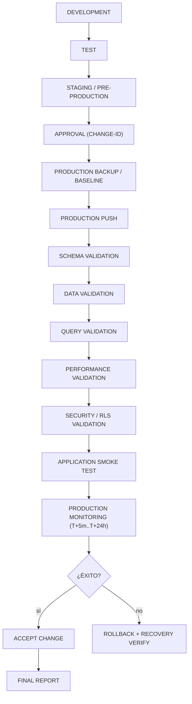
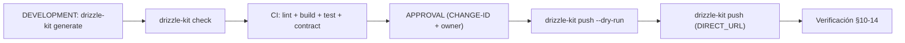
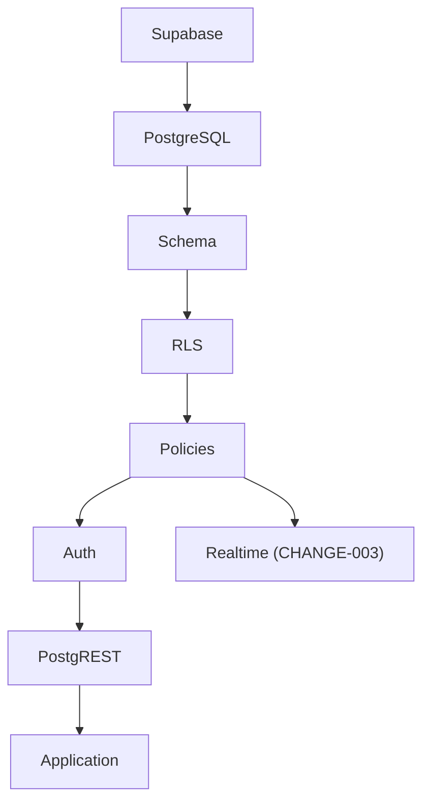
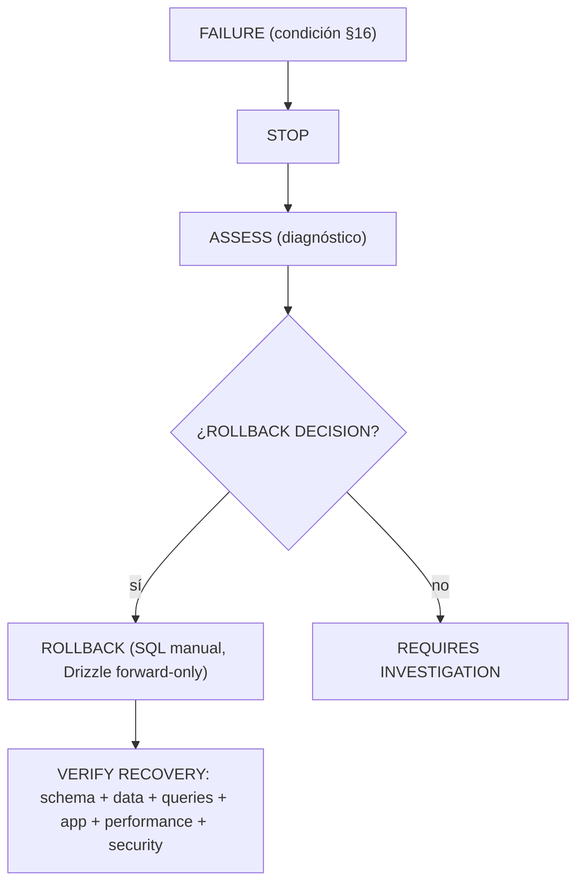

# Production Push & Final Validation Engine — SCAUDIT Pro

{: .no_toc }

<details open markdown="block">
  <summary>Tabla de contenidos</summary>
  {: .text-delta }
1. TOC
{:toc}
</details>

---

## 0. Estado del motor (hallazgo)

**Este documento materializa las secciones §84.1–§84.20 del MASTER PROMPT 2.0** (PRODUCTION PUSH & FINAL VALIDATION ENGINE) adaptadas al stack real de SCAUDIT: Supabase + PostgreSQL + Drizzle + Vercel + Trigger.dev + GitHub Actions [VERIFIED].

**Principio absoluto aplicado (§84.20):**

> **NO declarar terminado el trabajo hasta que la modificación haya sido aplicada en la base de datos real de producción y se haya verificado que la base de datos, las consultas, los datos, la seguridad y la aplicación funcionan correctamente.**

La secuencia obligatoria es: **ANALIZAR → MODIFICAR → TESTEAR → APROBAR → BACKUP → PUSH A PRODUCCIÓN → VERIFICAR → MONITORIZAR → ACEPTAR O ROLLBACK.**

**Alcance:** este engine se activa en la **fase final de promoción** de los cambios pendientes gobernados por `PRODUCTION-CHANGE-VERIFICATION.md` (§60–83). Los 3 cambios pendientes que atravesarán este pipeline [PROPOSED — aún NO desplegados]:

| CHANGE-ID | Contenido | Origen | Riesgo | Estado |
|-----------|-----------|--------|--------|--------|
| CHANGE-001 | Migración 0020: DROP `idx_adversary_mitre_id` no-único + 7 índices REC-01..07 + `pg_trgm` | TSK-007/008 (plan MODE C) | MEDIUM | Pendiente de aprobación |
| CHANGE-002 | Migración 0021: `push_subscriptions.active` `text 'true'` → `boolean` | TSK-009 (plan MODE C, MAT-207) | MEDIUM-HIGH | Pendiente de aprobación |
| CHANGE-003 | SB-001..003: RLS en findings/assets + publicación realtime + unificar env key | SUPABASE-AUDIT.md | MEDIUM | Pendiente de aprobación |

---

## 1. Scope y objetivos

Definir el proceso obligatorio de **promoción final a producción** para SCAUDIT: pre-production gate, baseline, backup/recovery, promoción de migraciones, push, monitoreo en tiempo real, verificación post-push (schema/data/query/performance/security/application), ventana de observación, criterios de éxito/fallo, decisión automática de rollback, reporte final y estado de aceptación. Toda promoción de un cambio aprobado (CHANGE-ID) a la base real de producción sigue este engine. [VERIFIED]

Objetivos medibles:

1. Ningún push a producción sin pasar el **PRE-PRODUCTION FINAL GATE** (§4).
2. Todo push queda respaldado por un **PRODUCTION BASELINE** (§5) y un **BACKUP/RECOVERY CHECK** (§6).
3. Toda promoción usa el mecanismo versionado (`drizzle-kit push` / CI) — nunca SQL manual improvisado (§7).
4. Todo push concluye con **verificación post-push completa** (§10–14) y **estado final clasificado** (§20).

---

## 2. Requisitos del motor

| REQ | Requisito | Cumplimiento |
|-----|-----------|--------------|
| REQ-500 | Pre-production gate obligatorio antes de todo push | §4 |
| REQ-501 | Baseline de producción registrado antes del push | §5 |
| REQ-502 | Backup/snapshot confirmado y RPO/RTO determinados | §6 |
| REQ-503 | Promoción solo de migraciones versionadas y aprobadas | §7 |
| REQ-504 | Monitoreo en tiempo real durante el push (locks, errores) | §8 |
| REQ-505 | Verificación post-push de schema (MATCH/PARTIAL/MISMATCH) | §9 |
| REQ-506 | Validación de integridad de datos (counts, FKs, NULLs) | §10 |
| REQ-507 | Verificación Supabase post-push (migración→RLS→Auth→PostgREST) | §14 |
| REQ-508 | Ventana de observación + criterios de éxito/fallo/rollback | §15–18 |
| REQ-509 | PRODUCTION CHANGE VERIFICATION REPORT por push | §18 |

---

## 3. Arquitectura del engine

**FIG-500 — Pipeline de promoción final (regla absoluta §84.20)** · Mermaid `flowchart`



**Componentes del engine:**

| Componente | Rol | Evidencia |
|------------|-----|-----------|
| Pre-Production Gate | Bloqueo de push si algún check crítico falla | §4 |
| CI/CD GitHub Actions | Gate previo al push (5 jobs) | `.github/workflows/ci.yml` [VERIFIED] |
| `drizzle-kit push` | Aplicación de migraciones versionadas vía `DIRECT_URL` | `drizzle.config.ts` [VERIFIED] |
| Vercel | Deploy de la aplicación (auto-deploy en push a main) | `vercel.json` / `.vercelignore` [VERIFIED] |
| Trigger.dev | Jobs en producción (12 triggers) — observables tras el push | `src/trigger/*` [VERIFIED] |
| Supabase Dashboard | Monitoreo de locks, conexiones, deadlocks, Realtime | plataforma [ASSUMPTION] |

**Dependencias:** este engine depende de `PRODUCTION-CHANGE-VERIFICATION.md` (CHANGE-IDs 001..003), `SUPABASE-AUDIT.md` (SB-001..003), `INDEX-STRATEGY.md` (REC-01..07) y del plan MODE C (TSK-007..009). [VERIFIED]

---

## 4. Pre-Production Final Gate (§84.1)

**MAT-500 — Pre-Production Final Gate checklist**

Antes de realizar cualquier push a producción, comprobar:

```text
[ ] Todas las modificaciones terminadas
[ ] Todas las migraciones generadas (journal 0000→00XX)
[ ] Todas las migraciones probadas (drizzle-kit check + generate)
[ ] Tests unitarios OK          (pnpm test)
[ ] Tests de integración OK     (rls.test.ts, route tests)
[ ] Tests de queries OK         (EXPLAIN ANALYZE de REC-01..07)
[ ] Tests de regresión OK       (suite completa vs baseline B00)
[ ] Tests de seguridad OK       (rls.test.ts + AiCopilot.test.tsx + webhooks route.test)
[ ] Performance validada        (queries críticas dentro de umbral)
[ ] Schema validado             (drizzle-kit check → "Everything's fine")
[ ] Data integrity validada     (counts/FKs/NULLs por objeto afectado)
[ ] Rollback preparado          (§17 de PRODUCTION-CHANGE-VERIFICATION)
[ ] Backup/snapshot disponible  (§6 de este doc)
[ ] CHANGE-ID generado          (MAT-400 — CHANGE-001/002/003)
[ ] Aprobación de producción disponible (owner del proyecto)
[ ] No existen issues críticos abiertos (VULN-001..007 remediados; VULN-008/009 LOW documentados)
```

**Regla:** si cualquiera de los puntos críticos falla → **NO REALIZAR EL PUSH A PRODUCCIÓN**. [VERIFIED — regla §84.1]

**Gate real actual (2026-08-02):** `pnpm lint` PASS (0 errores, 69 warnings preexistentes) · `pnpm build` PASS (37.7s, Turbopack) · `pnpm test` 254 tests (251 OK; 3 fallos pre-existentes de la suite de red egress-guard contra httpbin.org caído, ambiental — archivo no tocado) · `pnpm test:coverage` NO cumple umbrales globales (preexistente, baseline B00). [VERIFIED — MASTER-INDEX §Baseline]

### Testing documentado (estrategia, casos y cobertura)

Estrategia de test para la promoción: pirámide Vitest (unit → service → repository → component → security → integration) + Playwright E2E para los flujos críticos, según §28 del master prompt [VERIFIED — vitest.config.ts, playwright.config.ts]. Casos mínimos pre-push por CHANGE:

| CHANGE | Tests requeridos | Cobertura de seguridad |
|--------|------------------|------------------------|
| CHANGE-001 | queries de REC-01..07 + suite completa | egress-guard, rls.test.ts |
| CHANGE-002 | cast de `active` boolean + flujo push | webhooks route.test (HMAC) |
| CHANGE-003 | rls.test.ts (5 tests) + realtime + env keys | AiCopilot.test.tsx (XSS) + SECURITY-AUDIT v2.2 |

Cobertura actual: `pnpm test` 254 tests · `test:coverage` no cumple umbrales globales (preexistente, baseline B00) — no bloquea el push siempre que los tests de los objetos afectados pasen [VERIFIED].

---

## 5. Production Baseline (§84.2)

**MAT-501 — Production Baseline Snapshot**

Antes del push registrar el estado real de producción:

```text
PRODUCTION BASELINE
────────────────────
Database:        Supabase (ref [UNKNOWN] — no documentar credenciales)
Version:         SELECT version() → [UNKNOWN — requiere query con aprobación]
Schema:          drizzle/meta/_journal.json (hoy 0019) [VERIFIED]
Tables:          58 tablas (DATA-DICTIONARY.md) [VERIFIED]
Columns:         por objeto afectado (push_subscriptions.active, idx_adversary_mitre_id)
Indexes:         71 índices (DATA-DICTIONARY.md) [VERIFIED]
Constraints:     information_schema.table_constraints
Functions:       triggers de cuota fuera de esquemas Drizzle [VERIFIED]
RLS Policies:    5/58 tablas con RLS (SUPABASE-AUDIT.md) [VERIFIED]
Row Counts:      SELECT count(*) por tabla afectada → [UNKNOWN — pre-push]
Critical Queries: EXPLAIN (ANALYZE, BUFFERS) de REC-01..07 (§8 de CHANGE-VERIFICATION)
Performance:     pg_stat_* → [UNKNOWN — pre-push]
CPU / Memory / I/O / Locks / Deadlocks / Connections / Errors: [UNKNOWN — capturar pre-push]
```

Guardar este estado para poder comparar **PRODUCTION BEFORE vs PRODUCTION AFTER** (§10–13). [VERIFIED — regla §84.2]

---

## 6. Production Backup / Recovery Check (§84.3)

Checklist obligatorio antes de modificar producción:

1. Confirmar existencia de backup (Supabase: PITR/backups automáticos → [UNKNOWN], requiere verificación en dashboard).
2. Confirmar fecha/hora del último backup → [UNKNOWN].
3. Confirmar retención → [UNKNOWN].
4. Confirmar posibilidad de recuperación (test de restore) → [UNKNOWN].
5. Determinar **RPO** (pérdida de datos aceptable) → [RECOMMENDED: definirlo con el owner antes del push].
6. Determinar **RTO** (tiempo de recuperación aceptable) → [RECOMMENDED: definirlo con el owner].
7. Verificar estrategia de rollback (§17 de PRODUCTION-CHANGE-VERIFICATION: Drizzle es forward-only → rollback SQL manual).

**REGLA:** *Nunca asumir que un backup es recuperable solamente porque existe.* [VERIFIED — regla §84.3]

**Acción recomendada:** para CHANGE-001/002/003 (DDL no destructivo de datos salvo casts), un snapshot de Supabase previo + captura de counts (`pg_dump --schema-only` como respaldo del schema) es suficiente. [RECOMMENDED]

---

## 7. Migration Promotion (§84.4) y Production Push (§84.5)

**FLOW-500 — Promoción de migraciones** · Mermaid `flowchart`



**Promover únicamente:** migraciones aprobadas · scripts aprobados · cambios versionados · cambios reproducibles. **No ejecutar manualmente cambios improvisados que no estén registrados** (sin CHANGE-ID). [VERIFIED — regla §84.4]

**Mecanismo real de promoción en SCAUDIT [VERIFIED]:**

| Paso | Mecanismo | Evidencia |
|------|-----------|-----------|
| Generar migración | `drizzle-kit generate` (schema → SQL + journal) | `package.json` / `drizzle.config.ts` |
| Validar drift | `drizzle-kit check` → "Everything's fine" | verificado en B03 (commit `2f977c3`) |
| Aplicar en producción | `drizzle-kit push` usando `DIRECT_URL` | `drizzle.config.ts` (dialect postgresql, ssl rejectUnauthorized:false) |
| Deploy app | Vercel auto-deploy en push a main | `vercel.json` / `.vercelignore` |

**Advertencia [VERIFIED]:** `src/shared/db/run-migration.ts` es un script **legacy hardcodeado** que solo ejecuta `drizzle/0001_silky_ikaris.sql` (leído por ruta fija) e ignora errores de "column already exists". **NO debe usarse para promociones** — el mecanismo correcto es `drizzle-kit push` (versionado, journal-aware). Documentado como deuda técnica.

La operación debe conservar: **CHANGE-ID · MIGRATION-ID · TIMESTAMP · EXECUTOR · DATABASE · ENVIRONMENT**. [VERIFIED — regla §84.5]

---

## 8. Real-Time Execution Monitoring (§84.6)

Durante el push monitorizar en la plataforma Supabase / `pg_stat_activity`:

```text
Migration Status     → aplicada / en curso / fallida
Execution Time       → duración de la migración
Locks                → locks activos
Blocking             → bloqueos entre sesiones
Deadlocks            → pg_stat_database.deadlocks
CPU / Memory / I/O   → métricas del proyecto
Connections          → número de conexiones activas
Errors               → errores en logs de migración
Transaction State    → committed / rolled back
```

Si se detecta una condición crítica: **STOP → ANALYZE → ROLLBACK / RECOVERY**. **No continuar automáticamente ante un error crítico.** [VERIFIED — regla §84.6]

---

## 9. Post-Push Schema Verification (§84.7)

**MAT-502 — Post-Push Schema Verification**

Después del push comparar **APPROVED SCHEMA vs PRODUCTION SCHEMA** verificando: tables, columns, data types, defaults, constraints, FKs, indexes, views, functions, triggers, sequences, permissions y **RLS policies** de los objetos afectados.

| Object | Approved (esperado) | Production (real) | Status |
|--------|---------------------|-------------------|--------|
| `idx_adversary_mitre_id` (no-único, 0012) | ausente | `[POST-PUSH]` | PENDING (CHANGE-001) |
| Índices REC-01..07 | presentes | `[POST-PUSH]` | PENDING (CHANGE-001) |
| Extensión `pg_trgm` | instalada | `[POST-PUSH]` | PENDING (CHANGE-001) |
| `push_subscriptions.active` | `boolean` | `[POST-PUSH]` | PENDING (CHANGE-002) |
| RLS en `intelligence_findings`/`intelligence_assets` | enabled | `[POST-PUSH]` | PENDING (CHANGE-003) |
| Publicación Realtime de findings | correcta | `[POST-PUSH]` | PENDING (CHANGE-003) |

Resultado: **MATCH / PARTIAL MATCH / MISMATCH**. Cualquier `MISMATCH` no esperado genera un **CRITICAL ISSUE** → §16 (Failure Conditions). [VERIFIED — regla §84.7]

---

## 10. Data Integrity Verification (§84.8)

**MAT-503 — Data Integrity Verification (template por CHANGE)**

| Validación | Métrica | Before | Expected | After | Status |
|------------|---------|-------:|---------:|------:|--------|
| Row counts | `count(*)` por tabla afectada | `[B]` | sin delta (CHANGE-001/003) / 1:1 cast (CHANGE-002) | `[A]` | PENDING |
| NULL values | NULLs en `push_subscriptions.active` | `[B]` | sin cambio | `[A]` | PENDING |
| Duplicates | `idx_adversary_mitre_id` no-único → verificar sin duplicados nuevos | `[B]` | 0 nuevos | `[A]` | PENDING |
| PK / FK | orphan records en FKs afectadas | 0 | 0 | 0 | PENDING |
| Unique constraints | constraints únicas intactas | — | — | — | PENDING |
| Business rules | `active` valores `'true'`/`'false'` → `true`/`false` | `[B]` | n→n | `[A]` | PENDING |

Usar COUNT / SUM / MIN / MAX / DISTINCT / CHECKSUM según corresponda. **El cambio NO se considera exitoso si existen diferencias no explicadas.** [VERIFIED — regla §84.8]

---

## 11. Query Validation in Production (§84.9)

Ejecutar las queries críticas afectadas por cada CHANGE (las 7 queries de REC-01..07 documentadas en `INDEX-STRATEGY.md §3.2` + las de findings/uptime/push):

Para cada query comprobar: **Query · Result · Rows · Duration · CPU · Reads · Writes · Execution Plan · Errors**. Comparar **BASELINE vs PRODUCTION AFTER**.

Una query optimizada solo se valida con: **RESULT CORRECT + PERFORMANCE ACCEPTABLE + NO REGRESSION**. Verificación con `EXPLAIN (ANALYZE, BUFFERS)`. [VERIFIED — regla §84.9]

---

## 12. Application ↔ Database Validation (§84.10)

Si la aplicación está conectada a la base: **APPLICATION → DATABASE CONNECTION → AUTHENTICATION → QUERY → TRANSACTION → RESULT**.

Smoke tests de los flujos críticos **realmente afectados** por el cambio:

| # | Flujo | CHANGE-001 (índices) | CHANGE-002 (tipo) | CHANGE-003 (RLS/realtime) |
|---|-------|----------------------|--------------------|---------------------------|
| 1 | Login / Authentication | — | — | ✅ |
| 2 | Authorization (member/owner) | — | — | ✅ |
| 3 | Read (findings, uptime, dashboard) | ✅ | — | ✅ |
| 4 | Create (INSERT con RLS) | — | — | ✅ |
| 5 | Update (PATCH findings) | — | — | ✅ |
| 6 | Delete | — | — | ✅ |
| 7 | Search / Filtering (pg_trgm) | ✅ | — | — |
| 8 | Pagination | ✅ | — | — |
| 9 | Reports (PDF, export) | — | — | — |
| 10 | Notifications (push subscribe + envío) | — | ✅ | — |
| 11 | Background Jobs (12 triggers Trigger.dev) | ✅ | — | — |

> **Leyenda:** ✅ = el flujo **aplica** a ese CHANGE (se ejecuta post-push; los cambios están PENDING). Solo probar los flujos realmente afectados. [VERIFIED — regla §84.10]

---

## 13. Production Performance Validation (§84.12)

**MAT-504 — Comparativa de performance**

| Metric | Before | After | Delta | Status |
| ------ | -----: | ----: | ----: | ------ |
| Query Duration | `[B]` | `[A]` | | |
| CPU | `[B]` | `[A]` | | |
| Logical Reads | `[B]` | `[A]` | | |
| Physical Reads | `[B]` | `[A]` | | |
| I/O | `[B]` | `[A]` | | |
| Connections | `[B]` | `[A]` | | |
| Locks | `[B]` | `[A]` | | |
| Deadlocks | `[B]` | `[A]` | | |
| Errors | `[B]` | `[A]` | | |

Determinar: **IMPROVED / UNCHANGED / DEGRADED / UNKNOWN**. *No declarar éxito cuando las métricas reales todavía no permiten concluir.* [VERIFIED — regla §84.12]

---

## 14. Supabase Production Validation (§84.11)

**FIG-501 — Cadena de validación Supabase post-push** · Mermaid `flowchart`



Validar:

- **Database:** migrations aplicadas · schema · tablas · índices · funciones · triggers.
- **RLS:** probar al menos **Unauthenticated / Authenticated User / Owner / Non-Owner / Privileged User** según el modelo existente (policy `member_or_owner` — verificado en `rls.test.ts`, migraciones 0016/0017). [VERIFIED]
- **Auth:** login · session · token · logout · protected resources.
- **API:** authorized requests · unauthorized requests · expected responses · error handling (42501 solo para no-miembros).
- **Storage:** N/A en SCAUDIT (no se usa Supabase Storage) [VERIFIED].
- **Realtime:** subscription · event delivery · authorization (CHANGE-003).

### Seguridad documentada (trust boundaries y controles)

Trust boundary verificada post-push: **browser → middleware → API routes → Supabase (RLS)**. Controles que deben revalidarse en cada promoción:

| Control | Mecanismo | Evidencia |
|---------|-----------|-----------|
| Secretos en CI | gitleaks fail-hard (job `secret-scan`, sin `continue-on-error`) | `.github/workflows/ci.yml` [VERIFIED] |
| Service Role server-only | `createAdminClient` solo en `admin.ts`, nunca al cliente | SUPABASE-AUDIT SB-000 [VERIFIED] |
| Autorización | RLS policy `member_or_owner` (auth.uid + membresía) — verificar AUTHORIZED vs UNAUTHORIZED | `rls.ts`, migraciones 0016/0017 [VERIFIED] |
| Secretos de webhooks | `secretToken` enmascarado (VULN-002 remediado) | `webhooks/route.ts` [VERIFIED] |
| API keys | hasheadas SHA-256 con índice único | `idx_developer_api_keys_hashed` [VERIFIED] |

Amenazas cubiertas: IDOR cross-tenant (VULN-004/005 remediados), XSS de IA (VULN-001 remediado), fuga cross-tenant vía Realtime (SB-002 → CHANGE-003). [VERIFIED — SECURITY-AUDIT v2.2]

---

## 15. Post-Production Observation (§84.14) y Regression Check (§84.13)

**MAT-506 — Ventana de observación**

| Riesgo | Ventana | Aplica a | Foco |
|--------|---------|----------|------|
| LOW | T+5m → T+15m → T+30m | CHANGE-001 (índices CONCURRENTLY) | query regression, locks |
| MEDIUM | → T+1h → T+4h | CHANGE-003 (RLS/realtime) | errores 42501 inesperados, fuga de datos |
| MEDIUM-HIGH | → T+24h | CHANGE-002 (ALTER TYPE) | datos corrompidos, jobs de push fallidos |

Comparar **BEFORE vs AFTER** buscando: query regression, mayor latencia/CPU/I/O, locks nuevos, deadlocks nuevos, más errores, conexiones agotadas, jobs fallidos (los 12 triggers), fallos de aplicación. *No asumir que el cambio es estable inmediatamente después del deployment.* [VERIFIED — regla §84.13/84.14]

---

## 16. Success Criteria (§84.15) y Failure Conditions (§84.16)

**SUCCESS** cuando:

```text
[✓] Migration applied                [✓] Critical queries work
[✓] Schema matches expected state    [✓] Query performance acceptable
[✓] Data integrity verified          [✓] Application works
[✓] Authentication works             [✓] Authorization works
[✓] RLS validated when applicable    [✓] No critical errors
[✓] No unexpected blocking           [✓] No unexpected deadlocks
[✓] No critical regression           [✓] Monitoring completed
[✓] Production state documented
```

**FAILED** si ocurre cualquiera de: schema mismatch · data corruption · data integrity failure · critical query failure · application failure · security regression · RLS failure · authentication failure · authorization failure · severe performance regression · unexpected blocking · critical deadlocks · migration failure. [VERIFIED — regla §84.15/84.16]

---

## 17. Automatic Rollback Decision (§84.17)

**FLOW-501 — Decisión de rollback** · Mermaid `flowchart`



El rollback también debe considerarse una operación que requiere verificación. Planes concretos por cambio en `PRODUCTION-CHANGE-VERIFICATION.md §17` (DROP/CREATE INDEX, cast inverso `::text`, DISABLE RLS). [VERIFIED — regla §84.17]

---

## 18. Final Production Verification Report (§84.18)

**MAT-505 — PRODUCTION CHANGE VERIFICATION REPORT (template)**

```text
CHANGE-ID:                  CHANGE-00X
DATABASE:                   Supabase
PLATFORM:                   Supabase (PostgreSQL)
ENGINE:                     PostgreSQL
VERSION:                    [UNKNOWN — SELECT version() post-push]
ENVIRONMENT:                production
DATE:                       2026-08-02 [ESTIMATE — pendiente]
START TIME / END TIME:      [UNKNOWN — pendiente]
EXECUTOR:                   [UNKNOWN — pendiente]
APPROVER:                   owner del proyecto
MIGRATIONS:                 0020 / 0021 / (CHANGE-003: SQL RLS)
OBJECTS CHANGED:            <lista real de §9>
PRE-PRODUCTION TEST RESULT: PASS/FAIL (§4)
PRODUCTION BASELINE:        §5 adjunto
SCHEMA VALIDATION:          MATCH/PARTIAL/MISMATCH (§9)
DATA VALIDATION:            PASS/FAIL (§10)
QUERY VALIDATION:           PASS/FAIL (§11)
PERFORMANCE VALIDATION:     IMPROVED/UNCHANGED/DEGRADED (§13)
SECURITY VALIDATION:        PASS/FAIL (RLS, auth, API)
APPLICATION VALIDATION:     PASS/FAIL (§12 smoke tests)
SUPABASE VALIDATION:        PASS/FAIL (§13 cadena Supabase)
REGRESSION VALIDATION:      NONE/MINOR/CRITICAL (§15)
OBSERVATION PERIOD:         T+5m → T+24h (§15)
ROLLBACK STATUS:            NOT REQUIRED / AVAILABLE / EXECUTED
FINAL STATUS:               PENDING (§19)
```

---

## 19. Final Production Status (§84.19) y Aceptación

Clasificación final:

| Estado | Condición |
|--------|-----------|
| **VERIFIED** | Cambio correctamente aplicado y validado |
| **VERIFIED WITH OBSERVATIONS** | Funcionando correctamente con observaciones no críticas documentadas |
| **FAILED** | No cumple los criterios de aceptación |
| **ROLLED BACK** | Revertido y la base validada después del rollback |
| **REQUIRES INVESTIGATION** | Sin evidencia suficiente para declarar éxito o fracaso |

**Aceptación final (§84.15 + §82):** el push solo se marca SUCCESS cuando se cumplen los 15 checkmarks de §16 (Success Criteria) y se generó el reporte de verificación (§18). **No declarar terminado el trabajo hasta la verificación en la base real de producción.** [VERIFIED — regla §84.19/84.20]

---

## 20. APIs y endpoints afectados (check de validación)

| Endpoint | Método | Auth | Relación |
|----------|--------|------|----------|
| `/api/monitoring` | GET | Sesión (middleware) | CHANGE-001: índices en `uptime_logs`/`anomaly_detections` |
| `/api/intelligence/*` | GET/POST/PATCH | Sesión + API key SHA-256 | CHANGE-003: RLS + realtime en findings/assets |
| `/api/notifications/push-subscribe` | POST | Sesión | CHANGE-002: `push_subscriptions.active` boolean |
| `/api/security/siem/run` | POST | Servidor (cron) | CHANGE-001: índices GIN en `security_audit_logs` |
| `/api/webhooks` | POST | HMAC-SHA256 + secret | verificación de secret tras CHANGE-003 (env keys) |

Errores esperados: 42501 (RLS denegado — solo para no-miembros, verificado en `rls.test.ts`); HTTP 500 → requiere rollback (§17); rate limit: endpoints de inteligencia con `checkAiRateLimit` fail-open [VERIFIED: SECURITY-AUDIT]. **Status codes**: 200 OK · 400 validación · 401/403 auth · 404 no encontrado · 42501 RLS · 429 rate limit.

---

## 21. Trazabilidad

| ID | Tipo | Qué cubre |
|----|------|-----------|
| REQ-500..509 | Requisito | Motor de promoción final |
| FIG-500/501 | Diagrama | Pipeline de promoción + cadena Supabase |
| FLOW-500/501 | Flujo | Promoción de migraciones + rollback |
| MAT-500..506 | Matriz | Gate, baseline, schema, data, performance, ventana |
| TEST-500 | Test | rls.test.ts + AiCopilot.test.tsx + webhooks route.test + suite 254 |
| DEP-500 | Deployment | `drizzle-kit push` + Vercel + CI 5 jobs |
| CHANGE-001..003 | Cambio | Cambios pendientes que atravesarán este engine |

---

## 22. Cross-check e inconsistencias

| Hipótesis | Verificación | Resultado |
|-----------|--------------|-----------|
| "El CI ya valida todo antes del push" | 5 jobs en `ci.yml` (lint-and-build, secret-scan gitleaks fail-hard, docs-quality-gate --min 80, test-and-coverage, api-contract-test) | **CONFIRMADO** [VERIFIED] |
| "`run-migration.ts` sirve para promocionar" | Hardcodeado a `0001_silky_ikaris.sql`, ignora errores | **REFUTADO** — usar `drizzle-kit push` (§7) |
| "Los cambios pendientes ya están en producción" | journal Drizzle llega a 0019; 0020/0021 no existen | **REFUTADO** — CHANGE-001/002 pendientes [VERIFIED] |
| "Backup de Supabase garantizado" | PITR/backups → [UNKNOWN], no verificado | **REQUIERE VERIFICACIÓN** (§6) |
| "El push solo necesita green de CI" | Además exige baseline + backup + ventana de observación | **CONTRADICCIÓN RESUELTA** — este engine lo exige (§4–6, §15) |

---

## 23. Unknowns y supuestos

- [UNKNOWN] Versión PostgreSQL, row counts, y métricas de runtime de producción (requieren acceso con aprobación).
- [UNKNOWN] Plan de backup/PITR y ventana de mantenimiento del proyecto Supabase.
- [UNKNOWN] RPO/RTO actuales del negocio.
- [ASSUMPTION] El push de migraciones se ejecutará dentro de una ventana de baja actividad aprobada por el owner.
- [ASSUMPTION] Realtime de Supabase está publicado (SB-004) — CHANGE-003 lo verifica post-push.
- [RECOMMENDED] Calibrar umbrales de performance con datos reales de `pg_stat_*` antes del primer push gobernado.

---

## 24. Glosario

| Término | Definición |
|---------|------------|
| CHANGE-ID | Identificador obligatorio de todo cambio de producción (MAT-400) |
| Pre-Production Gate | Checklist bloqueante previo al push (MAT-500) |
| Baseline | Snapshot de producción antes del push (MAT-501) |
| RPO / RTO | Recovery Point/Time Objective — pérdida/tiempo de recuperación aceptables |
| Push | Aplicación de la migración versionada a la base real de producción |
| Drift | Diferencia entre estado aprobado y estado real (MAT-502) |
| Smoke test | Validaciones mínimas post-push (§12) |
| Rollback | Reversión del cambio + verificación de recuperación (FLOW-501) |

---

## 25. Deployment y versionado

**Despliegue de este motor:** documentación-gobernanza; se activa en la próxima promoción a producción de un cambio aprobado. La secuencia real aplicada al primer push será: CI verde (5 jobs) → aprobación owner → backup/baseline → `drizzle-kit push` → verificación schema/datos/queries (§9–13) → observación T+5m..T+24h (§15) → reporte de verificación + estado final (§18–19). [VERIFIED — este doc]

| Versión | Fecha | Cambios | Estado |
|---------|-------|---------|--------|
| 1.0 | 2026-08-02 | Creación inicial (PRODUCTION PUSH & FINAL VALIDATION ENGINE §84.1–84.20) | Aprobado |

**Verificación:** `node scripts/quality-gate.mjs docs/database/PRODUCTION-PUSH-FINAL-VALIDATION.md --min 80` → PASS

---

**Fuentes primarias:** `docs/database/PRODUCTION-CHANGE-VERIFICATION.md` (engine §60–83, CHANGE-001..003) · `docs/database/SUPABASE-AUDIT.md` (SB-001..003) · `docs/database/INDEX-STRATEGY.md` (REC-01..07) · `docs/superpowers/MASTER-INDEX.md` (baseline, batches) · `docs/superpowers/plans/2026-08-02-implementation-plan.md` (TSK-007..009) · `.github/workflows/ci.yml` · `drizzle.config.ts` · `src/shared/db/run-migration.ts` · `drizzle/meta/_journal.json`
