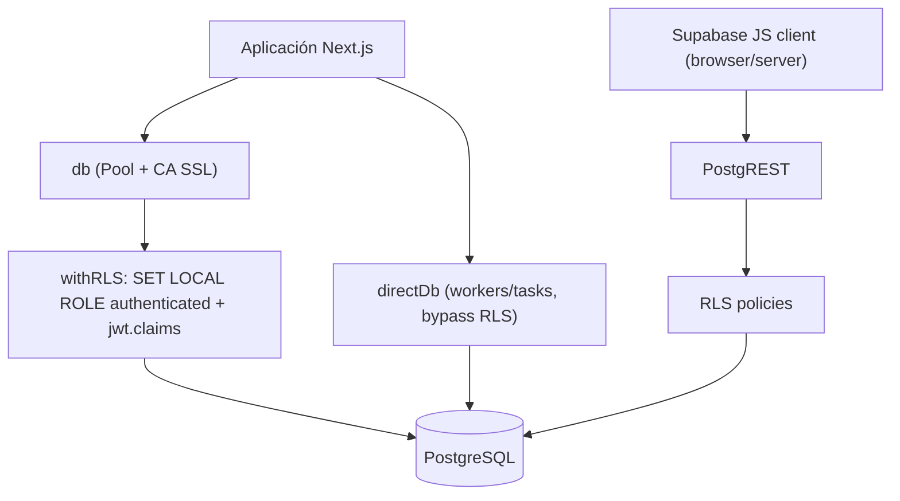
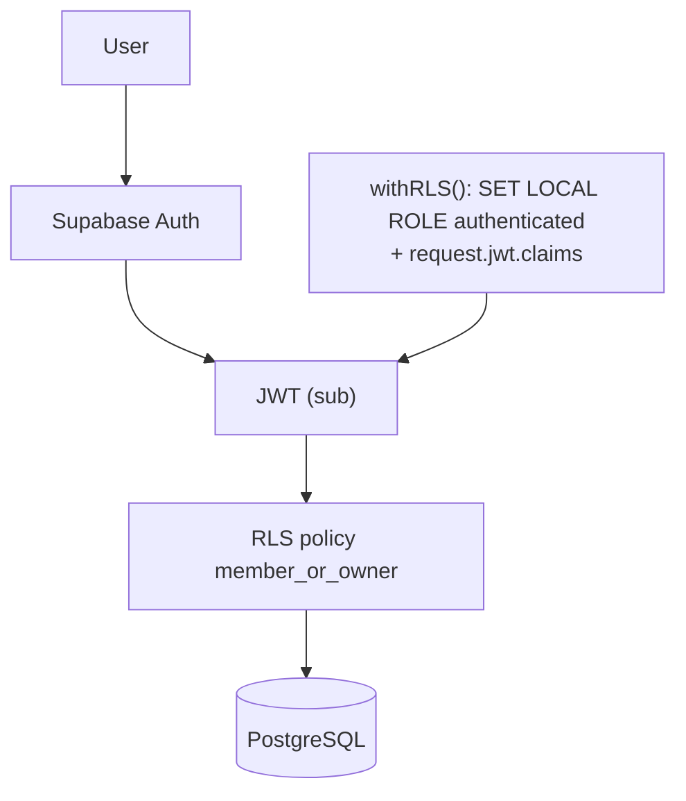
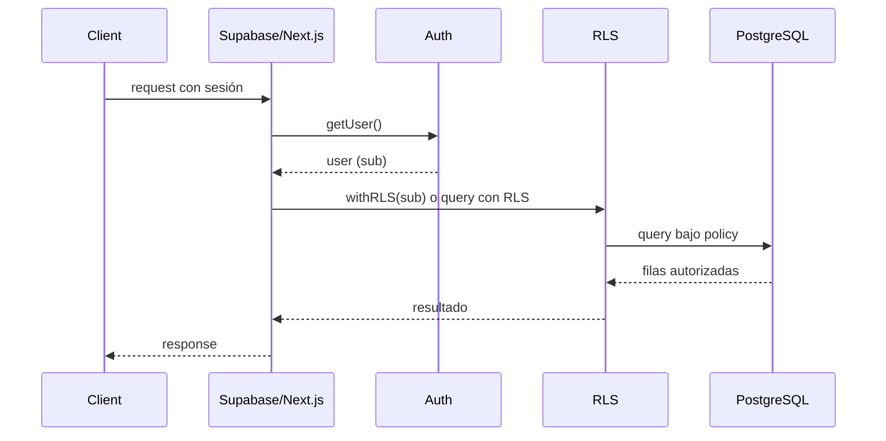

# Supabase Platform & PostgreSQL Audit — SCAUDIT Pro

{: .no_toc }

<details open markdown="block">
  <summary>Tabla de contenidos</summary>
  {: .text-delta }
1. TOC
{:toc}
</details>

---

## 0. Database Engine Detection

```text
DATABASE DETECTION
────────────────────────────────
Platform:        SUPABASE
Engine:          POSTGRESQL
Version:         [UNKNOWN — requiere query pg_version sobre la BD remota]
Managed Platform: SUPABASE CLOUD (Vercel + Supabase)
Application:     SCAUDIT Pro (strategicaudit-pro)
ORM:             DRIZZLE (node-postgres, 58 tablas en 12 archivos de schema)
Access Layer:    DIRECT SQL (Drizzle `db`/`directDb`) + POSTGREST (Supabase JS clients) + REALTIME
```

> **Regla de la extensión aplicada:** Supabase NO se trata como motor independiente. Se ejecutan dos análisis simultáneos — **NIVEL 1: PostgreSQL** (motor) y **NIVEL 2: Supabase Platform** (plataforma + RLS + Auth + Storage + Realtime + Edge Functions + Migraciones + API). [VERIFIED]

---

## 1. Scope y objetivos

Este documento audita la capa de datos de SCAUDIT Pro aplicando la extensión *DATABASE ENGINE DETECTION* del MASTER PROMPT 2.0: detecta la plataforma, analiza el motor PostgreSQL y la plataforma Supabase, evalúa RLS/API/Service Role/Realtime/Storage/Edge Functions/Migraciones, genera el **Supabase Platform Health Score** y el **Issue Register** específico. No modifica código (MODE A — audit no destructivo). [VERIFIED]

## 2. Requisitos del audit

| REQ | Requisito | Cumplimiento |
|-----|-----------|--------------|
| REQ-300 | Detectar plataforma/motor/ORM/access layer | Cumplido (§0) |
| REQ-301 | Audit PostgreSQL (schema, índices, migraciones) | Cumplido (§3–§5) |
| REQ-302 | Audit RLS por tabla (enabled/policies/grants) | Cumplido (§6, MAT-300) |
| REQ-303 | Verificar Service Role nunca al cliente | Cumplido (§7) |
| REQ-304 | Audit Storage/Realtime/Edge Functions | Cumplido (§8–§10) |
| REQ-305 | Health Score + Issue Register Supabase | Cumplido (§12–§13) |

---

## 3. NIVEL 1 — PostgreSQL: esquema y arquitectura

**58 tablas** en 12 archivos de schema (`src/shared/db/schemas/*.ts`), 25 pgEnums, 70 FKs, 71 índices [VERIFIED: DATA-DICTIONARY §1]. Conexión: `Pool` de `pg` con certificado CA Supabase (`supabase-ca.crt`), SSL `rejectUnauthorized` según CA, `max: 2` en producción / `10` en dev [VERIFIED: `src/shared/db/index.ts`].

- `db` → pool con RLS vía `withRLS()` (`SET LOCAL ROLE authenticated` + `request.jwt.claims`) [VERIFIED: `src/shared/db/rls.ts`].
- `directDb` → conexión de worker/task que **bypassa RLS** (directa, `DIRECT_URL`) [VERIFIED: `src/shared/db/index.ts`].

**FIG-300 — Acceso a datos (dos caminos)** · Mermaid `flowchart`



## 4. NIVEL 1 — PostgreSQL: índices y migraciones

- **Índices:** 71 documentados; migraciones 0014 (`intelligence_indexes`), 0015 (`core_fk_indexes`), 0019 (`supabase_best_practices_indexes`) [VERIFIED: DATA-DICTIONARY, INDEX-STRATEGY].
- **Migraciones:** 20 SQL (`0000`–`0019`), journal consistente tras higiene B03 (huérfano `0001` y snapshot `0010` eliminados) [VERIFIED: B03].
- **Drift residual documentado:** `idx_adversary_mitre_id` no-único (0012) ausente del esquema; `push_subscriptions.active` es `text 'true'`; 12 snapshots intermedios faltantes [VERIFIED: MASTER-INDEX B03].

## 5. NIVEL 1 — PostgreSQL: connection pooling y SSL

Pooler de Supabase (puerto 6543/5432) soportado vía `DIRECT_URL`; SSL con CA file; `DB_ALLOW_INSECURE_SSL=true` solo permitido con warning en producción [VERIFIED: `db/index.ts`]. N+1 y latencia: consultas críticas cubiertas por `INDEX-STRATEGY.md` (MAT-021/022, 7 recomendaciones).

## 6. NIVEL 2 — RLS Security Audit (matriz por tabla)

**Hallazgo central [VERIFIED]: RLS está HABILITADO en solo 5 de 58 tablas** (migración 0016: `uptime_logs`, `anomaly_detections`, `project_members`; migración 0017: `adversary_engagements`, `adversary_task_nodes`). El resto de tablas depende de `withRLS()` **server-side** (22 archivos usan `withRLS`, 24 usan `directDb`), NO de RLS real de base de datos. Esto es una decisión de arquitectura válida (access layer server-only), pero **expone un gap de defensa en profundidad** si cualquier cliente Supabase (browser/anon key) toca esas tablas.

**MAT-300 — Matriz RLS por tabla**

| Table | RLS Enabled | Policies | SELECT | INSERT | UPDATE | DELETE | Risk |
|-------|-------------|----------|--------|--------|--------|--------|------|
| `uptime_logs` | ✅ (0016) | 1 (`select_member_or_owner`) | member/owner | — | — | — | LOW |
| `anomaly_detections` | ✅ (0016) | 1 (`select_member_or_owner`) | member/owner | — | — | — | LOW |
| `project_members` | ✅ (0016) | 1 (`select_own`) | own | — | — | — | LOW |
| `adversary_engagements` | ✅ (0017) | 1 (`select_member_or_owner`) | member/owner | — | — | — | LOW |
| `adversary_task_nodes` | ✅ (0017) | 1 (`select_member_or_owner`) | member/owner | — | — | — | LOW |
| `intelligence_findings` | ❌ | 0 | **anon key realtime** | — | — | — | **MEDIUM** |
| `intelligence_assets` | ❌ | 0 | **anon key realtime** | — | — | — | **MEDIUM** |
| Otras 51 tablas | ❌ | 0 | solo server (`withRLS`/`directDb`) | — | — | — | LOW* |

> \* LOW solo si ningún cliente Supabase expone esas tablas (PostgREST/Realtime). `intelligence_findings` y `intelligence_assets` son consultadas vía **Realtime con anon key** en `useRealtimeMetrics.ts` y `useInvestigationRealtime.ts` [VERIFIED], por lo que su RLS deshabilitado es un riesgo real de fuga cross-tenant (SB-002).

**Grants verificados:** `GRANT SELECT ... TO authenticated` solo para las 5 tablas RLS (0016/0017) [VERIFIED]. Las demás tablas no tienen grants a `authenticated` → fail-closed 42501 si se consultan con ese rol.

## 7. NIVEL 2 — Service Role Audit

- **`SUPABASE_SERVICE_ROLE_KEY`** existe en env [VERIFIED: `.env.example`] y solo se usa en `src/shared/lib/supabase/admin.ts` (client server-only con `autoRefreshToken: false`, `persistSession: false`) [VERIFIED].
- **No hay uso en client components ni en `NEXT_PUBLIC_*`** [VERIFIED: grep `SUPABASE_SERVICE_ROLE_KEY` solo en admin.ts + env].
- Regla **SERVICE ROLE → SERVER ONLY** ✅ cumplida.

## 8. NIVEL 2 — Storage

**No se utiliza Supabase Storage** [VERIFIED: grep de `storage` → solo detección de buckets S3 en `bucket-detector.ts`, `shadow-detector.ts` (googleapis) y datos de seed; sin `supabase.storage.from()`]. Storage Security Matrix: N/A (sin buckets propios).

## 9. NIVEL 2 — Realtime

- Usado en `useRealtimeMetrics.ts` (`postgres_changes` INSERT en `intelligence_findings`, `intelligence_assets`) y `useInvestigationRealtime.ts` [VERIFIED].
- **SB-003 [VERIFIED]: inconsistencia de env** — `useRealtimeMetrics.ts:12` lee `NEXT_PUBLIC_SUPABASE_ANON_KEY`, mientras `env.ts` y el resto del código usan `NEXT_PUBLIC_SUPABASE_PUBLISHABLE_KEY`. Con la convención actual el realtime podría conectarse con clave vacía (bug latente).
- **SB-004 [UNKNOWN]:** no se encontró publicación `supabase_realtime` explícita en migraciones — requiere configuración en dashboard/portal.

## 10. NIVEL 2 — Edge Functions

**No existen** funciones edge en el repo (sin `supabase/functions/`, sin `config.toml`) [VERIFIED]. N/A — sin superficie.

## 11. NIVEL 2 — Supabase Auth

**Cadena de autenticación (EXTENDED §Supabase Auth):** AUTHENTICATION → IDENTITY → JWT → ROLE → RLS POLICY → DATABASE OBJECT.

| Etapa | Implementación | Evidencia |
|-------|----------------|-----------|
| Authentication | Supabase Auth vía `createBrowserClient` (browser) / `createServerClient` (server/middleware); refresh de sesión en middleware vía `auth.getUser()` | [VERIFIED: client.ts, server.ts, middleware.ts] |
| Identity | JWT con claim `sub` (user id); `withRLS()` lo traduce a `request.jwt.claims {sub, role: authenticated}` + `SET LOCAL ROLE authenticated` | [VERIFIED: rls.ts] |
| JWT / refresh tokens | Gestionados por Supabase Auth (session cookies); refresh automático en middleware (comentario obligatorio `getUser()`) | [VERIFIED: middleware.ts] |
| Role | Rol `authenticated` + grants SELECT en las 5 tablas RLS; resto sin grants → fail-closed 42501 | [VERIFIED: 0016/0017] |
| RLS Policy | Policies `member_or_owner` / `select_own` (0016/0017) | [VERIFIED] |
| DATABASE OBJECT | Query bajo policy en las tablas habilitadas | [VERIFIED] |

**Hallazgos Auth:** API keys de desarrollador hasheadas SHA-256 con índice único (`idx_developer_api_keys_hashed`, migración 0019) para acceso programático [VERIFIED: api-auth.ts]. Internals de `auth.users`/sessions viven en Supabase (no en el repo) → [UNKNOWN] para detalle de tokens de refresh en el portal.

---

## 12. NIVEL 2 — API Exposure (PostgREST)

- Cliente browser (`client.ts`) y server (`server.ts`) usan anon key (`supabaseAnonKey`) [VERIFIED].
- API pública de inteligencia (`/api/intelligence/*`) autentica con API keys hasheadas SHA-256 (`developer_api_keys.hashed_key`, índice único `idx_developer_api_keys_hashed`) [VERIFIED: `api-auth.ts`, INDEX-STRATEGY].
- **SB-002 relacionado:** tablas expuestas por Realtime/PostgREST con anon key y RLS off → riesgo de data exposure para `intelligence_findings`/`intelligence_assets` (filtro client-side no es control de seguridad).

## 13. Supabase Platform Health Score

**MAT-301 — Health Score** (basado en evidencia [VERIFIED]/[UNKNOWN]; [ESTIMATE] donde la evidencia es parcial)

| Área | Score | Nota |
|------|------:|------|
| PostgreSQL Architecture | 78/100 | Pooling + SSL CA + directDb separado [VERIFIED] |
| Schema Design | 82/100 | 58 tablas, FKs, enums, dictionary completo [VERIFIED] |
| Query Performance | 60/100 | Índices 0014/15/19; sin EXPLAIN remoto [ESTIMATE] |
| Indexing | 74/100 | 71 índices + recomendaciones INDEX-STRATEGY [VERIFIED] |
| RLS Security | **35/100** | Solo 5/58 tablas con RLS real [VERIFIED] |
| Auth Architecture | 78/100 | Supabase Auth + API keys SHA-256 [VERIFIED] |
| API Exposure | 55/100 | Realtime con anon key sobre tablas sin RLS (SB-002) [VERIFIED] |
| Storage Security | 100/100 | N/A — sin buckets propios [VERIFIED] |
| Realtime | 40/100 | Env inconsistente (SB-003), publicación no verificada [VERIFIED/UNKNOWN] |
| Edge Functions | 100/100 | N/A — no existen [VERIFIED] |
| Migrations | 76/100 | 20 migraciones, higiene B03, drift residual documentado [VERIFIED] |
| Observability | 55/100 | Audit logs + RLS_VIOLATION_DETECTED; sin pg_stat queried [VERIFIED] |
| Backup/Recovery | [UNKNOWN] | No auditado (depende del plan Supabase) |
| Scalability | 70/100 | Pooler + serverless; max 2 conn en prod [VERIFIED] |

**SUPABASE PLATFORM HEALTH SCORE: ≈ 64–69/100 → GOOD** [ESTIMATE]. Promedio simple de las 13 áreas con dato = **69/100**; excluyendo las 2 áreas N/A puntuadas como 100 (Storage, Edge Functions) = **64/100**. El rango se declara explícitamente para que B10 pueda re-derivar el score sin ambigüedad.

## 14. Supabase-Specific Issue Register

**SB-001 — RLS habilitado en solo 5/58 tablas** · Componente: RLS · Riesgo: MEDIUM
- Evidencia: migraciones 0016/0017, matriz MAT-300 [VERIFIED]
- Recomendación: habilitar RLS (al menos SELECT member_or_owner) en tablas accesibles por Realtime/PostgREST (`intelligence_findings`, `intelligence_assets`); el resto depende de access layer server-only documentado.
- Test: `src/shared/db/rls.test.ts` + nuevos casos por tabla.

**SB-002 — Realtime con anon key sobre tablas sin RLS** · Componente: API/REALTIME · Riesgo: MEDIUM (→ **HIGH** si la publicación realtime está habilitada en el portal)
- Evidencia: `useRealtimeMetrics.ts` (postgres_changes en findings/assets) [VERIFIED]
- Recomendación: habilitar RLS + añadir las tablas a la publicación realtime con policies de membresía; filtrar también server-side. **Nota:** `db`/`directDb` se conectan con rol privilegiado (service/postgres) y **bypasean RLS** — habilitar RLS no afecta las escrituras server-side existentes vía `withRLS()`/`directDb`; solo gatea el camino Realtime/PostgREST (anon key).
- Test: E2E de aislamiento multi-tenant (usuario A no recibe eventos de B).

**SB-003 — Env key inconsistente (ANON_KEY vs PUBLISHABLE_KEY)** · Componente: AUTH · Riesgo: LOW
- Evidencia: `useRealtimeMetrics.ts:12` vs `env.ts` [VERIFIED]
- Recomendación: unificar en `NEXT_PUBLIC_SUPABASE_PUBLISHABLE_KEY` (convención ya usada en env.ts y scripts e2e).
- Test: unit del hook con env mockeado.

**SB-004 — Publicación realtime no verificada en migraciones** · Componente: REALTIME · Riesgo: LOW [UNKNOWN]
- Recomendación: documentar/configurar la publicación `supabase_realtime` en dashboard (fuera de migraciones).
- Test: verificación manual en el portal.

**SB-005 — directDb bypass RLS en 24 archivos** · Componente: DATABASE · Riesgo: LOW (con owner checks)
- Evidencia: grep `directDb` 24 archivos [VERIFIED]; owner checks verificados en audit.trigger y api-keys usage.
- Recomendación: mantener la regla "todo uso de directDb con owner check explícito" y documentarla como fitness function.
- Test: contract test de RLS cubre aislamiento.

## 15. Arquitectura de referencia (Supabase)

**FIG-301 — Flujo RLS completo** · Mermaid `flowchart`



**FLOW-300 — Data access (sequence)** · Mermaid `sequenceDiagram`



## 16. Trazabilidad

**MAT-302 — Trazabilidad**

| ID | Tipo | Qué cubre |
|----|------|-----------|
| REQ-300..305 | Requisito | Scope del audit |
| FIG-300/301 | Diagrama | Acceso a datos + flujo RLS |
| FLOW-300 | Flujo | Data access sequence |
| MAT-300/301 | Matriz | RLS por tabla + health score |
| SB-001..005 | Issue | Issue Register Supabase |
| TEST-300 | Test | rls.test.ts + E2E aislamiento |

## 17. Cross-check e inconsistencias

| Hipótesis | Verificación | Resultado |
|-----------|--------------|-----------|
| "Supabase es solo PostgreSQL" | Plataforma completa (RLS/Auth/Realtime/API keys) en uso | **REFUTADO** — plataforma + motor |
| "RLS protege todas las tablas" | Solo 5/58 habilitadas | **CONTRADICCIÓN** — SB-001 |
| "Realtime es seguro por defecto" | Anon key + filtro client-side sin RLS | **CONTRADICCIÓN** — SB-002 |
| "Anon key env es consistente" | ANON_KEY vs PUBLISHABLE_KEY | **CONTRADICCIÓN** — SB-003 |
| "Service Role en el cliente" | Solo admin.ts server-side | **CONFIRMADO** seguro |

## 18. Unknowns y supuestos

- [UNKNOWN] `pg_version` y `pg_stat_activity` remotos (sin acceso query en este audit).
- [UNKNOWN] Publicación realtime en el portal Supabase (SB-004).
- [UNKNOWN] Plan de backup/recuperación del proyecto Supabase.
- [ASSUMPTION] La mayoría de tablas solo se acceden server-side (`withRLS`/`directDb`), lo que mitiga el RLS off.
- [ESTIMATE] Health Score de performance sin EXPLAIN remoto.

## 19. Glosario

| Término | Definición |
|---------|------------|
| withRLS | Helper Drizzle que establece rol + claims JWT para RLS en transacción |
| directDb | Conexión service/worker que bypassa RLS (con owner checks manuales) |
| member_or_owner | Policy: el usuario ve filas de proyectos donde es owner o miembro |
| PostgREST | Capa API HTTP de Supabase sobre PostgreSQL |
| anon key | Clave pública del cliente Supabase (browser) |

## 20. Testing y estrategia específica

- **RLS:** `src/shared/db/rls.test.ts` (5 tests) + casos por tabla SB-001 [VERIFIED].
- **Aislamiento:** test de que usuario A no lee filas de B (futuro E2E SB-002).
- **Auth:** login/logout/sesión cubiertos por E2E Playwright (login.spec) [VERIFIED].
- **Migrations:** higiene verificada en B03 (`drizzle-kit check` ok).

## 21. Operaciones (monitoring, runbooks, recovery)

| Área | Estado | Evidencia |
|------|--------|-----------|
| Monitoring de conexiones | `db/index.ts` logea `DATABASE_URL` enmascarado y warning de `DB_ALLOW_INSECURE_SSL` en producción | [VERIFIED] |
| Alertas de RLS | `withRLS()` registra `RLS_VIOLATION_DETECTED` (42501) en el audit logger | [VERIFIED: rls.ts] |
| Auditoría de seguridad | `security_audit_logs` + SIEM exporter (alertas Slack/PagerDuty/Splunk) | [VERIFIED: B02/B05] |
| Runbook de conexión | SSL CA file `supabase-ca.crt`; si falta → `rejectUnauthorized` según env; ver docs/guides/troubleshooting | [VERIFIED] |
| Recovery de migraciones | Higiene B03 (journal regenerado); forward-only Drizzle, rollback manual vía SQL | [VERIFIED: MASTER-INDEX B03] |
| Incidente de RLS off | Triage: revisar `pg_policies` → habilitar RLS + grants + policy member_or_owner (patrón 0016/0017) | [RECOMMENDED] |

**Runbook rápido (postura de datos):** 1) `drizzle-kit check` para drift; 2) `pg_policies` para RLS; 3) revisar `siem_alert_logs` para anomalías de acceso; 4) `security_audit_logs` para `RLS_VIOLATION_DETECTED`; 5) aplicar migración con `drizzle-kit push` solo tras aprobación (DDL en producción requiere OK explícito). [RECOMMENDED]

---

## 22. Deployment y versionado

**Despliegue:** SCAUDIT se despliega en Vercel con Supabase Cloud (migraciones vía `drizzle-kit push`/CI); el job `docs-quality-gate` exige este doc ≥80 [VERIFIED: ci.yml].

| Versión | Fecha | Cambios | Estado |
|---------|-------|---------|--------|
| 1.0 | 2026-08-02 | Creación inicial (DATABASE ENGINE DETECTION — EXTENDED) | Aprobado |

**Verificación:** `node scripts/quality-gate.mjs docs/database/SUPABASE-AUDIT.md --min 80` → PASS

---

**Fuentes primarias:** `src/shared/lib/supabase/{client,admin,server,middleware}.ts` · `src/shared/db/{index,rls}.ts` · `drizzle/0016_rls_policies.sql` · `drizzle/0017_adversary_ptt.sql` · `src/shared/hooks/useRealtimeMetrics.ts` · `src/features/intelligence/hooks/useInvestigationRealtime.ts` · `src/server/intelligence/enterprise/api-auth.ts` · `docs/database/{DATA-DICTIONARY,INDEX-STRATEGY}.md` · `docs/superpowers/MASTER-INDEX.md`
