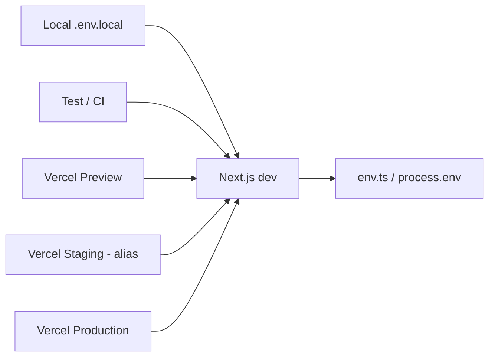

# 🔑 SCAUDIT — Environment Variable Matrix

> **Fecha:** 2026-08-02 · **Versión:** 1.0 · **Autor:** Equipo SCAUDIT · **Estado:** ✅ Aprobado
> **Propósito:** inventario de variables de entorno por ambiente (T02-04, MAT-007). **Sin valores reales** — solo nombres, fuente y requerimiento por ambiente.
> **Fuentes:** `.env.example`, `src/shared/config/env.ts`, greps de `process.env.*` en `src/`, `vercel.json`, `docs/guides/deployment.md` [VERIFIED].

---

## 1. Scope y objetivos

| Item | Valor |
|---|---|
| **Alcance** | Todas las variables de entorno consumidas por la aplicación SCAUDIT Pro |
| **Objetivo** | Matriz LOCAL/TEST/PREVIEW/STAGING/PROD sin exponer valores; servir de checklist de onboarding |
| **Fuera de alcance** | Valores concretos de secretos (NUNCA en repo) |
| **Nivel de confianza** | Names/requirements derivados de código leído + `.env.example` |

---

## 2. Requisitos de seguridad (REQ)

| ID | Requisito | Fuente |
|---|---|---|
| REQ-001 | Ninguna variable secreta debe tener prefijo `NEXT_PUBLIC_` | OWASP Secrets |
| REQ-002 | `SUPABASE_SERVICE_ROLE_KEY`, `DATABASE_URL`, `DIRECT_URL` solo en server-side | OWASP A08 |
| REQ-003 | `CRON_SECRET` obligatorio en todos los ambientes con cron activo | Vercel Cron |
| REQ-004 | Matriz sin valores reales — solo nombres | Gobernanza B02 |

---

## 3. Arquitectura (ambiente → plataforma → origen)

### 3.1 Dependencias de origen

| Ambiente | Archivo / Plataforma | Notas |
|---|---|---|
| LOCAL | `.env.local` (gitignored) | copiar de `.env.example` |
| TEST/CI | GitHub Actions secrets | solo lint/build/test; DB no requerida para unit tests |
| PREVIEW | Vercel → Settings → Environment Variables (Preview) | datos de prueba |
| STAGING | Vercel → alias staging (o Preview aislado) | ⚠️ no existe deploy dedicado; ver §14 |
| PRODUCTION | Vercel → Environment Variables (Production) | datos reales |

---

## 4. Datos documentados

| Variable | Tipo | Sensibilidad | Fuente |
|---|---|---|---|
| `NEXT_PUBLIC_*` | pública (client bundle) | 🔴 Alta (debe ser pública) | env.ts |
| `SUPABASE_SERVICE_ROLE_KEY` | servidor | 🔴 Alta (secreta) | env.ts/admin.ts |
| `DATABASE_URL` / `DIRECT_URL` | servidor | 🔴 Alta (secreta) | db/index.ts |
| `CRON_SECRET` | servidor | 🔴 Alta (secreta) | ratelimit.ts |
| `SCAUDIT_WEBHOOK_SECRET` | servidor | 🔴 Alta (secreta) | cicd-helper.ts |
| `UPSTASH_REDIS_REST_*` | servidor | 🔴 Alta (secreta) | ratelimit.ts |

---

## 5. Matriz de variables por ambiente

| Variable | Fuente | LOCAL | TEST/CI | PREVIEW | STAGING | PROD | Notas |
|---|---|---|---|---|---|---|---|
| `NEXT_PUBLIC_SUPABASE_URL` | env.ts | ✅ | ✅ | ✅ | ✅ | ✅ | pública |
| `NEXT_PUBLIC_SUPABASE_PUBLISHABLE_KEY` | env.ts | ✅ | ✅ | ✅ | ✅ | ✅ | pública |
| `SUPABASE_SERVICE_ROLE_KEY` | env.ts/admin.ts | ✅ | 🔴 no | ✅ | ✅ | ✅ | server-only |
| `DATABASE_URL` | db/index.ts | ✅ | 🔴 no | ✅ | ✅ | ✅ | server-only |
| `DIRECT_URL` | db/index.ts | ✅ | 🔴 no | ✅ | ✅ | ✅ | server-only (workers) |
| `OPENROUTER_API_KEY` | env.ts | ⬜ | ⬜ | ⬜ | ⬜ | ⬜ | opcional (pool gratuito) |
| `OPENROUTER_BASE_URL` | env.ts | ⬜ | ⬜ | ⬜ | ⬜ | ⬜ | default OpenRouter |
| `UPSTASH_REDIS_REST_URL` | ratelimit.ts | ✅ | ⬜ | ✅ | ✅ | ✅ | requerido para rate limit |
| `UPSTASH_REDIS_REST_TOKEN` | ratelimit.ts | ✅ | ⬜ | ✅ | ✅ | ✅ | requerido para rate limit |
| `CRON_SECRET` | ratelimit.ts | ✅ | ✅ | ✅ | ✅ | ✅ | requerido crons |
| `TRIGGER_SECRET_KEY` | env.ts | ⬜ | ⬜ | ⬜ | ⬜ | ⬜ | opcional (Trigger.dev) |
| `VAPID_PUBLIC_KEY` | env.ts | ⬜ | ⬜ | ⬜ | ⬜ | ⬜ | opcional (push) |
| `VAPID_PRIVATE_KEY` | env.ts | ⬜ | ⬜ | ⬜ | ⬜ | ⬜ | opcional (push) |
| `SIEM_WEBHOOK_SLACK` | siem-exporter | ⬜ | ⬜ | ⬜ | ⬜ | ⬜ | opcional |
| `SIEM_WEBHOOK_PAGERDUTY` | siem-exporter | ⬜ | ⬜ | ⬜ | ⬜ | ⬜ | opcional |
| `SIEM_WEBHOOK_SPLUNK` | siem-exporter | ⬜ | ⬜ | ⬜ | ⬜ | ⬜ | opcional |
| `SIEM_PAGERDUTY_ROUTING_KEY` | siem-exporter | ⬜ | ⬜ | ⬜ | ⬜ | ⬜ | opcional |
| `SIEM_EMAIL_FROM` / `SIEM_EMAIL_TO` | siem-exporter | ⬜ | ⬜ | ⬜ | ⬜ | ⬜ | opcional |
| `RESEND_API_KEY` | env.ts | ⬜ | ⬜ | ⬜ | ⬜ | ⬜ | opcional (email) |
| `AUTH_EMAIL_ALLOWLIST` | ratelimit.ts | ⬜ | ⬜ | ⬜ | ⬜ | ⬜ | opcional (comma-separated) |
| `LOOKER_STUDIO_API_KEY` | looker-studio | ⬜ | ⬜ | ⬜ | ⬜ | ⬜ | ⚠️ si falta, auth se salta (VULN-006) |
| `SCAUDIT_WEBHOOK_SECRET` | cicd-helper | ⬜ | ⬜ | ✅ | ✅ | ✅ | requerido en prod |
| `ALLOWED_ORIGINS` | looker-studio | ⬜ | ⬜ | ⬜ | ⬜ | ⬜ | CORS prod |
| `ALLOWED_TELEMETRY_ORIGINS` | rum.ts | ⬜ | ⬜ | ⬜ | ⬜ | ⬜ | CORS telemetry |
| `NEXT_PUBLIC_SITE_URL` | env.ts | ⬜ | ⬜ | ✅ | ✅ | ✅ | pública (canonical) |
| `NEXT_PUBLIC_DEV_BYPASS_AUTH` | env.ts | ⬜ | ⬜ | 🔴 no | 🔴 no | 🔴 no | solo dev; gate NODE_ENV |
| `DB_ALLOW_INSECURE_SSL` | db/index.ts | ⬜ | ⬜ | 🔴 no | 🔴 no | 🔴 no | ⚠️ never en prod |
| `BYPASS_EGRESS_GUARD_DEV` | egress-guard | ⬜ | ⬜ | 🔴 no | 🔴 no | 🔴 no | solo dev |
| `ADVERSARY_SANDBOX_ENABLED` | adversary | ⬜ | ⬜ | ⬜ | ⬜ | ⬜ | feature flag |
| `E2E_BASE_URL` | e2e | ⬜ | ✅ | ⬜ | ⬜ | ⬜ | Playwright |
| `Bearer_API_KEY` | env.ts (legacy) | ⬜ | ⬜ | ⬜ | ⬜ | ⬜ | 🔴 renombrar a `BEARER_API_KEY` |
| `GEMINI_API_KEY` | env.ts (legacy) | ⬜ | ⬜ | ⬜ | ⬜ | ⬜ | legacy AI |
| `XIAOMI_BASE_URL` | env.ts (legacy) | ⬜ | ⬜ | ⬜ | ⬜ | ⬜ | legacy, default apifreellm |

**Leyenda:** ✅ requerido · ⬜ opcional/según uso · 🔴 no/no debe

---

## 6. APIs, Vercel Cron / Deployment

| Ítem | Valor |
|---|---|
| Framework | Next.js (`next build`, install frozen-lockfile) |
| Región | `iad1` |
| Cron | `/api/cron/siem` cada 5 min + `/api/cron/uptime` cada 15 min (protegidos por `Bearer CRON_SECRET`) |
| CI/CD | GitHub Actions: lint-and-build, secret-scan, docs-gate, tests, api-contract |

---

## 7. Testing documentado

| Test | Ambiente | Variables requeridas |
|---|---|---|
| Unit (vitest) | TEST/CI | ninguna (mocks) |
| RLS contract | TEST/CI | ninguna (mocks de SQL) |
| E2E Playwright | LOCAL/PREVIEW | `E2E_BASE_URL` |
| Newman API | TEST/CI | `SCAUDIT_API_KEY` (opcional) |

---

## 8. Operaciones documentadas

| Item | Valor |
|---|---|
| Rotación de secretos | Cambiar en Vercel + `.env.local`; gitleaks verifica historial |
| Runbooks | `docs/guides/deployment.md`, `docs/guides/troubleshooting.md` |
| Alerta de leak | GitHub Actions `secret-scan` falla al detectar |

---

## 9. Diagramas (mermaid)

Ver §3 — 1 bloque mermaid, válido.

---

## 10. Inventario visual

| ID | Figura | Tipo | Nivel |
|---|---|---|---|
| FIG-001 | Flujo ambiente → plataforma → env.ts | Diagram | L1 |
| MAT-007 | Matriz de variables por ambiente (§5) | Table | L2 |

---

## 11. Trazabilidad (REQ → COMP → TEST → DEP)

| REQ | COMP | TEST | DEP |
|---|---|---|---|
| REQ-001 | env.ts (solo `NEXT_PUBLIC_*` públicos) | grep CI + gitleaks | Vercel |
| REQ-002 | admin.ts server-only | test bundle | Vercel |
| REQ-003 | ratelimit.ts CRON_SECRET | route.test.ts | Vercel |
| REQ-004 | este archivo | quality gate | docs |

---

## 12. Cross-check / inconsistencias

**DOCUMENTATION CONSISTENCY ISSUE** — `src/shared/hooks/useRealtimeMetrics.ts:12` lee `NEXT_PUBLIC_SUPABASE_ANON_KEY`; `.env.example` y env.ts declaran `NEXT_PUBLIC_SUPABASE_PUBLISHABLE_KEY`. **Resolver en B02/B03**: o renombrar el hook, o documentar la variante `ANON_KEY` como pública adicional. No es un leak (ambas públicas), pero rompe el realtime si solo se setea una. [VERIFIED]

**DOCUMENTATION CONSISTENCY ISSUE** — `Bearer_API_KEY` (camel-case) vs convención `SCREAMING_SNAKE`. Renombrar en B04 con alias de compatibilidad. [OBSERVED]

**DOCUMENTATION CONSISTENCY ISSUE** — `NEXT_PUBLIC_DEV_BYPASS_AUTH` y `DB_ALLOW_INSECURE_SSL` documentadas como peligrosas: ambas tienen guard `NODE_ENV === 'development'` / warning en consola; matríz las marca 🔴 no en prod. [VERIFIED]

---

## 13. Unknowns y assumptions

| Item | Clasificación |
|---|---|
| ¿Existe un deploy STAGING dedicado en Vercel? | [ASSUMPTION] — no detectado; se mapea a Preview/alias |
| ¿`LOOKER_STUDIO_API_KEY` definida en todos los entornos? | [UNKNOWN] — crítica por VULN-006 |
| ¿`SCAUDIT_WEBHOOK_SECRET` seteada en prod? | [ASSUMPTION] — requerida; fallback dev si falta |

---

## 14. Fuentes

| Dato | Fuente |
|---|---|
| Nombres de variables | [VERIFIED] grep `process.env.*` en `src/` + `.env.example` |
| Ambientes Vercel | [VERIFIED] `vercel.json` + `docs/guides/deployment.md` |
| Inconsistencia ANON_KEY | [VERIFIED] `useRealtimeMetrics.ts:12` |
| Gitleaks en CI | [VERIFIED] `.github/workflows/ci.yml` (job `secret-scan`) |

---

## 15. Glosario

| Término | Definición |
|---|---|
| NEXT_PUBLIC_ | Variable inline en el bundle cliente (solo valores públicos) |
| STAGING | Ambiente de pre-producción con datos realistas (no dedicado hoy) |
| MAT-007 | Artefacto de matriz de entorno del master prompt |
| Gitleaks | Scanner de secretos en git history |

---

## 16. Resumen ejecutivo

**37 variables inventariadas por ambiente.** `NEXT_PUBLIC_*` (5) son públicas; el resto (32) son server-side y deben permanecer fuera del bundle cliente y del repo. La matriz deja 3 inconsistencias abiertas (ANON_KEY vs PUBLISHABLE_KEY, `Bearer_API_KEY`, STAGING no dedicado) y 2 riesgos operativos (`LOOKER_STUDIO_API_KEY` ausente → VULN-006; `SCAUDIT_WEBHOOK_SECRET` ausente → fallback dev). El CI ahora corre gitleaks (`secret-scan`) para blindar REQ-001/007 en cada push.
