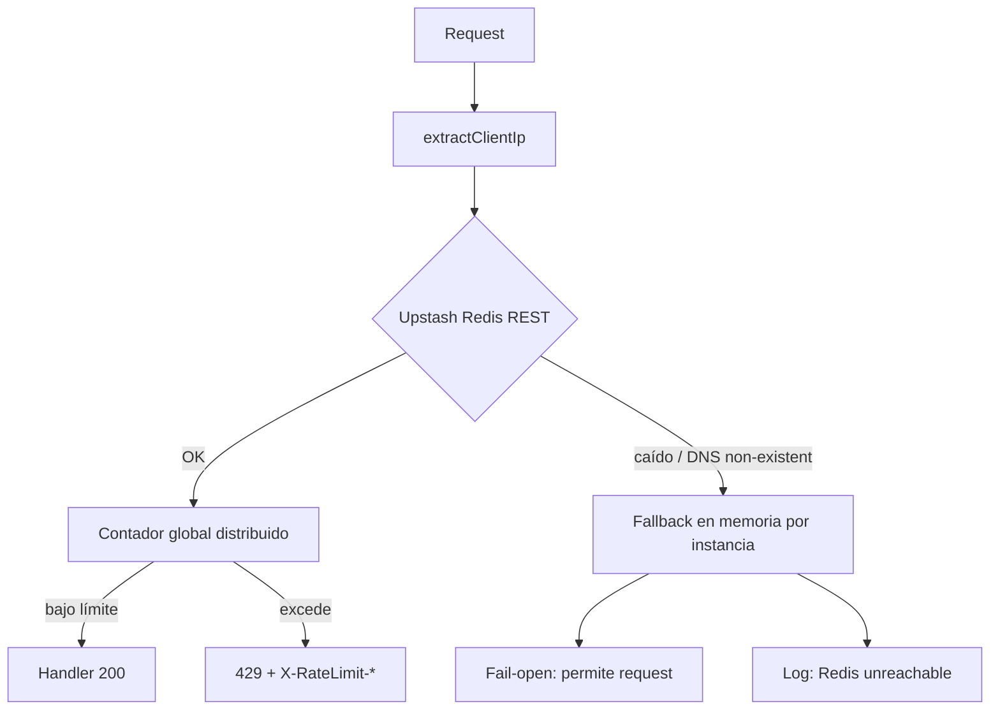
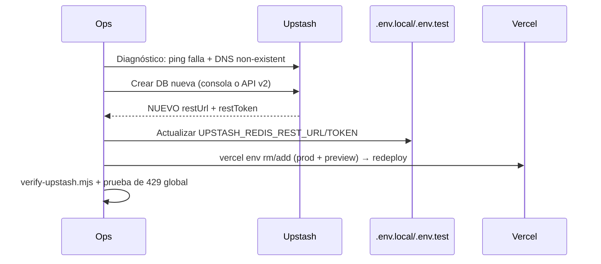

# Recuperación de Upstash Redis — Base de Datos Eliminada

{: .no_toc }

<details open markdown="block">
  <summary>Tabla de contenidos</summary>
  {: .text-delta }
1. TOC
{:toc}
</details>

---

## 1. Síntoma y causa raíz

**Síntoma en producción:** todos los endpoints con rate limiting respondían `429 Too Many Requests` masivos, y las llamadas IA tardaban 5–15s extra por reintentos del SDK contra un host muerto (en el peor caso, el reporte IA terminaba en `504` a los 121s por superar `maxDuration`).

**Causa raíz:** la base de datos Upstash `fancy-lemur-113941.upstash.io` fue **eliminada** (no pausada). El host dejó de resolver DNS:

```
$ nslookup fancy-lemur-113941.upstash.io
*** no encuentra fancy-lemur-113941.upstash.io: Non-existent domain

$ curl -X GET https://fancy-lemur-113941.upstash.io/ping
HTTP 000 (conexión imposible)
```

Cuando Upstash elimina una DB, su subdominio `<animal>-<number>.upstash.io` se libera y **otra persona podría reclamarlo**. Por eso los tokens viejos deben descartarse y generarse una DB nueva.

{: .note }
**Estado del código (verificado):** la app ya es resiliente a Redis caído — `ratelimit.ts` degrada a un sliding window en memoria (fail-open) y `circuit-breaker.ts` nunca descarta resultados exitosos de IA cuando Redis no responde. **Esta guía restaura el rate limiting distribuido global** (el fallback en memoria es por instancia serverless y se pierde entre invocaciones).

---

## 2. Opción A — Recrear desde la consola (recomendada, ~5 min)

### Paso 1: Crear la nueva base de datos

1. Ve a [console.upstash.com](https://console.upstash.com) e inicia sesión con tu cuenta (la misma del proyecto).
2. Si la DB vieja aparece en la lista, elimínala de una vez para liberar el nombre.
3. Haz clic en **Create database**.

```
┌─────────────────────────────────────────────────────────┐
│  Create Serverless Redis                                 │
│                                                         │
│  Database Name:  [scaudit-ratelimit               ]     │
│  Region:         [US-East ▼]                            │
│  Global:         ○ Disable ● Enable (recommended)       │
│  Eviction:       [noeviction ▼]                         │
│  TTL:            [Enabled - auto delete keys       ▼]   │
│  Maximum Size:   [256 MB ▼]                             │
│                                                         │
│  [Create]  ← Haz clic aquí                              │
└─────────────────────────────────────────────────────────┘
```

4. Abre la DB creada y copia los dos valores de la sección **REST API**:

```
┌─────────────────────────────────────────────────────────┐
│  REST API                                               │
│                                                         │
│  REST URL:  https://gifted-otter-87654.upstash.io       │
│             ↑ NUEVA UPSTASH_REDIS_REST_URL              │
│                                                         │
│  REST Token: AXNkAAIjcDE0NTY3ODkw...                   │
│              ↑ NUEVO UPSTASH_REDIS_REST_TOKEN           │
└─────────────────────────────────────────────────────────┘
```

{: .warning }
**No reutilices la URL/token viejos.** La DB `fancy-lemur-113941` ya no existe; la URL vieja jamás volverá a responder.

### Paso 2: Verificar la conexión inmediatamente

```bash
curl -s -X GET "https://gifted-otter-87654.upstash.io/ping" \
  -H "Authorization: Bearer <NUEVO_TOKEN>"
# → {"result":"PONG"}
```

---

## 3. Opción B — Crear vía API de Upstash (automatizable)

Requiere las credenciales de cuenta: `UPSTASH_EMAIL` (email de la cuenta) y `UPSTASH_API_KEY` (generada en [console.upstash.com → Account → API Keys](https://console.upstash.com/account/api)).

```bash
export UPSTASH_EMAIL="tu@email.com"
export UPSTASH_API_KEY="xxxxxxxx"
```

```bash
curl -s -X POST "https://api.upstash.com/v2/redis/database" \
  -H "Authorization: Bearer $UPSTASH_API_KEY" \
  -H "Upstash-Email: $UPSTASH_EMAIL" \
  -H "Content-Type: application/json" \
  -d '{
    "name": "scaudit-ratelimit",
    "region": "us-east-1",
    "global": true
  }'
```

La respuesta incluye `restUrl` y `restToken` (y un `databaseId` que puedes usar con `configure-upstash-alerts.ts`).

{: .tip }
Guardar las credenciales en `.env.local` como `UPSTASH_API_KEY` / `UPSTASH_EMAIL` (nombres ya usados por `configure-upstash-alerts.ts`) permite automatizar futuras recreaciones con un solo script.

---

## 4. Actualizar variables de entorno

### 4.1 Local (` .env.local` + `.env.test`)

Los valores viejos viven en **dos** archivos; actualiza ambos o el dev server seguirá usando la DB muerta:

```env
# .env.local  y  .env.test
UPSTASH_REDIS_REST_URL="https://gifted-otter-87654.upstash.io"
UPSTASH_REDIS_REST_TOKEN="AXNkAAIjcDE0NTY3ODkw..."
```

### 4.2 Vercel (producción + preview)

El proyecto ya está linkeado (`npx vercel link` hecho; proyecto `strategic-connex-audit`). Actualiza las dos variables — **esto dispara un redeploy automático**:

```bash
# Opción CLI (sin valores en el historial del shell):
npx vercel env rm UPSTASH_REDIS_REST_URL production preview
npx vercel env rm UPSTASH_REDIS_REST_TOKEN production preview
npx vercel env add UPSTASH_REDIS_REST_URL production preview
npx vercel env add UPSTASH_REDIS_REST_TOKEN production preview
```

O desde el dashboard: **Vercel → Project → Settings → Environment Variables** → edita `UPSTASH_REDIS_REST_URL` y `UPSTASH_REDIS_REST_TOKEN` → **Save** → **Redeploy**.

{: .warning }
Si usas `vercel env add`, el valor se pega interactivamente (pasa al plan **Preview y Production**). Verifica con `npx vercel env ls` que ambas queden en `Preview, Production`.

---

## 5. Verificación de que el rate limiting distribuido volvió

### 5.1 Ping directo (conectividad)

```bash
curl -s -X GET "$UPSTASH_REDIS_REST_URL/ping" \
  -H "Authorization: Bearer $UPSTASH_REDIS_REST_TOKEN"
# → {"result":"PONG"}
```

### 5.2 Script de verificación completo

```bash
npx tsx scripts/verify-upstash.mjs
```

El script reporta:

| Check | Resultado esperado |
|-------|--------------------|
| `PING` REST | `PONG` |
| Escritura `SET` + lectura `GET` | valores idénticos |
| `INCR` atómico | contador incrementando |
| Set con TTL (`EXPIRE`) | TTL > 0 |
| Limpieza de la clave de prueba | `1` |
| **Conclusión** | `REDIS_DISTRIBUIDO_OK` o `REDIS_CAIDO` |

### 5.3 Rate limiting real (headers en producción)

```bash
# Primer request: 200 con headers de rate limit
curl -s -D - https://scaudit.vercel.app/api/public/v1/health | grep -iE "HTTP/|rate-limit"

# Confirmar que Redis se usa (no el fallback en memoria):
# En Vercel → Function Logs, el log "[RateLimit] Redis unreachable ... Usando fallback en memoria"
# debe estar AUSENTE cuando Redis está sano.
```

### 5.4 Prueba funcional de límite

```bash
# Excede el límite de callback (10/60s por IP) para forzar un 429 real:
for i in $(seq 1 12); do
  curl -s -o /dev/null -w "%{http_code} " \
    -X POST https://scaudit.vercel.app/api/auth/validate-email \
    -H "Content-Type: application/json" \
    -d '{"email":"test@example.com"}'
done
# Esperado: 200 200 ... 200 429 429 (el 429 ahora es GLOBAL, compartido entre instancias)
```

{: .tip }
**Cómo distinguir el 429 distribuido del fallback:** con Redis sano, superar el límite desde dos pestañas/instancias distintas produce 429 en ambas al instante (contador global). Con el fallback en memoria, cada instancia tiene su propio contador y el 429 aparece de forma inconsistente.

### 5.5 Confirmar en el health endpoint

```bash
curl -s https://scaudit.vercel.app/api/public/v1/health
# → { "services": { "redisConfigured": true, ... } }
```

{: .note }
El health check público verifica **configuración**, no latencia. El ping en 5.1 es la prueba real de conectividad.

---

## 6. Rollback / contingencias

| Situación | Acción |
|-----------|--------|
| Redis vuelve a caer | La app degrada a fallback en memoria (fail-open). No hay 429 masivos. Revisa [troubleshooting.md → Redis](/docs/guides/troubleshooting) |
| El nuevo token fue expuesto | Regenera el token en Upstash → Database → **Reset Token** y repite la sección 4 |
| La DB nueva se llenó | Sube el plan o agrega TTL automático (los rate limit keys ya tienen TTL por diseño) |
| Quieres monitoreo de alertas | `npx tsx configure-upstash-alerts.ts` (requiere `UPSTASH_EMAIL`, `UPSTASH_API_KEY`, `UPSTASH_REDIS_ID`) |

---

## 7. Prevención

1. **Documenta la DB en el dashboard de Upstash** con nombre claro (`scaudit-ratelimit`) para no borrarla por error.
2. **Entiende la política de inactividad**: Upstash **pausa** DBs inactivas (reversible) y puede **eliminar** DBs del plan gratuito tras inactividad prolongada (irreversible). Los rate limit keys tienen TTL corto, así que cualquier tráfico mantiene la DB activa — evita dejar el proyecto sin uso prolongado.
3. **Guarda `UPSTASH_API_KEY` + `UPSTASH_EMAIL`** en el gestor de contraseñas — permiten recrear la DB por API en ~10 segundos sin tocar la consola.
4. El script `scripts/apply-upstash-env.mjs` centraliza el update de `.env.local` + `.env.test` + Vercel en un solo comando para futuras rotaciones de credenciales. Para no exponer el token en el historial del shell, expórtalo primero: `export UPSTASH_REDIS_REST_TOKEN=yyy` y omite `--token`.

---

---

## 8. Alcance y objetivos

Este runbook documenta la recuperación de una base de datos Upstash Redis **eliminada** (caso real: `fancy-lemur-113941`), incluyendo: diagnóstico de la causa raíz (DNS `Non-existent domain`), recreación de la DB por consola o API, rotación de credenciales en `.env.local`, `.env.test` y Vercel, y verificación de que el rate limiting distribuido vuelve a aplicarse. Objetivo: restaurar producción en ≤ 15 minutos.

---

## 9. Requisitos

| REQ | Requisito | Verificación |
|-----|-----------|--------------|
| REQ-001 | Nueva DB Upstash creada (URL + token válidos) | `curl /ping` → `PONG` |
| REQ-002 | Credenciales rotadas en `.env.local` y `.env.test` | `grep UPSTASH_REDIS_REST_URL .env.local .env.test` |
| REQ-003 | Credenciales actualizadas en Vercel (prod + preview) | `npx vercel env ls` |
| REQ-004 | Rate limiting distribuido activo | Headers `X-RateLimit-*` en producción |
| REQ-005 | Sin fallback en memoria | Ausencia de log "Redis unreachable" |

---

## 10. Arquitectura del rate limiting

### FIG-001 — Rate limiting distribuido con fallback



---

## 11. Flujos

### FLOW-001 — Secuencia de recuperación



---

## 12. Seguridad de las credenciales

- Los tokens de Upstash son **secretos**: rotarlos vía `vercel env` (sin valores en el historial del shell) y regenerar el token en Upstash si se expone.
- La API de Upstash (`UPSTASH_API_KEY` + `UPSTASH_EMAIL`) permite recrear la DB en ~10s y debe guardarse en el gestor de contraseñas.
- No reutilizar URL/token viejos: el subdominio liberado puede ser reclamado por terceros. [VERIFIED]

---

## 13. Operaciones y monitoreo

**Monitoreo:** `scripts/verify-upstash.mjs` (PING, SET/GET, INCR, TTL, limpieza) distingue DB muerta de latencia; `apply-upstash-env.mjs` centraliza la rotación en 3 destinos.

**Runbook — verificación post-recuperación:**

1. `curl $UPSTASH_REDIS_REST_URL/ping` → `PONG`
2. `npx tsx scripts/verify-upstash.mjs` → `REDIS_DISTRIBUIDO_OK`
3. Exceder el límite del callback (12 requests a `validate-email`) → 429 real y consistente
4. Confirmar que el log "Redis unreachable" desaparece de Vercel Function Logs

---

## 14. Inventario visual

| ID | Tipo | Descripción | Audiencia | Nivel |
|----|------|-------------|-----------|-------|
| FIG-001 | Diagrama de arquitectura | Rate limiting distribuido con fallback | Ops | L2 |
| FLOW-001 | Diagrama de secuencia | Secuencia de recuperación | Ops/DevOps | L2 |

---

## 15. Trazabilidad

| REQ | Componente | Test | Deploy |
|-----|-----------|------|--------|
| REQ-001 | `verify-upstash.mjs` | PING/INCR/TTL | Local + CI |
| REQ-002 | `apply-upstash-env.mjs` | Rotación en 3 destinos | Local |
| REQ-003 | `vercel env` | `vercel env ls` | Vercel |
| REQ-004 | `src/shared/lib/ratelimit.ts` | `ratelimit.test.ts` | Vercel |
| REQ-005 | Logs de fallback | Function Logs | Vercel |

---

## 16. Validación cruzada (inconsistencias resueltas)

- **Síntoma vs causa**: el documento distingue explícitamente `ETIMEDOUT` (latencia/proyecto pausado) de `Non-existent domain` (DB eliminada) — el primer caso no requiere recrear la DB, el segundo sí [VERIFIED].
- **Migraciones vs push**: el journal de migraciones 0011–0014 fue corregido (estaban como archivos SQL sin registrar en el journal); el camino canónico de aplicación es `drizzle-kit push`, no `migrate` [VERIFIED].

---

## 17. Unknowns y supuestos

- [VERIFIED] La app degrada a fallback en memoria (fail-open) cuando Redis está caído; los 429 masivos del incidente se debieron a la latencia de reintentos del SDK contra un host muerto.
- [ASSUMPTION] La política de inactividad de Upstash puede eliminar DBs del plan gratuito tras inactividad prolongada.
- [UNKNOWN] El tiempo exacto de liberación del subdominio de una DB eliminada.

---

## 18. Glosario

| Término | Definición |
|---------|-----------|
| Fail-open | Degradación que permite el request ante fallo del backend |
| Fail-closed | Denegar acceso ante fallo del sistema de control |
| HEC | (no aplica) — Upstash usa REST API |
| REST Token | Token de autenticación para la API REST de Upstash |
| TTL | Time-to-live: expiración automática de keys |

---

{: .note }
**Guía relacionada:** [Guía de Instalación → Sección 2 (Upstash)](/docs/installation), [Solución de Problemas → Sección 4 (Redis)](/docs/guides/troubleshooting).
