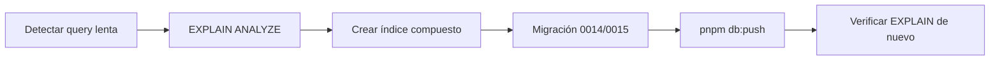
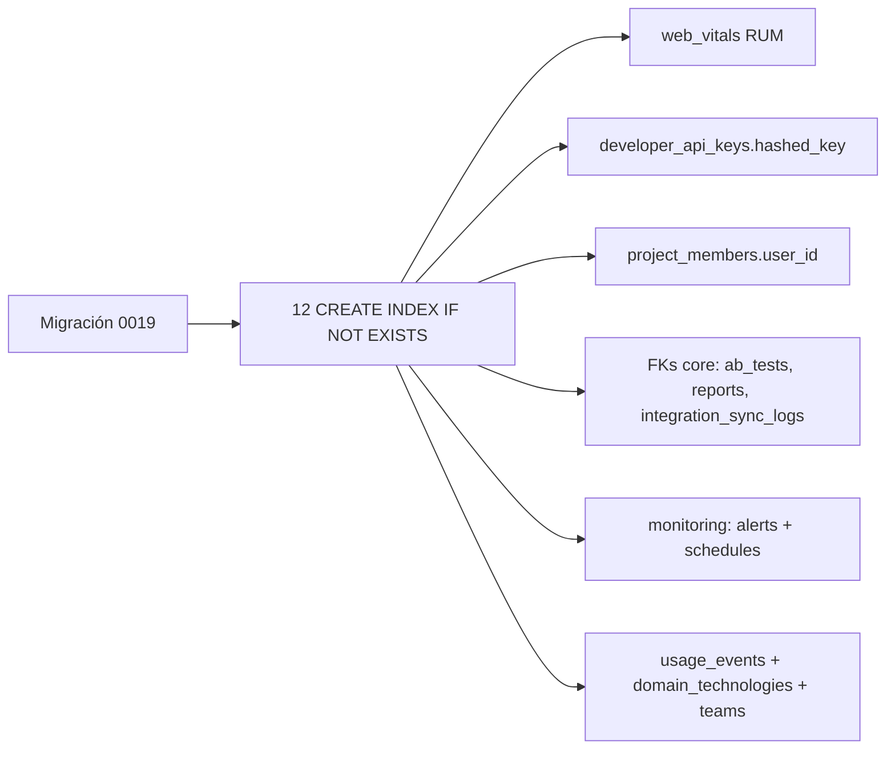

# 📊 SCAUDIT — Reporte de Optimización de Base de Datos

> **Fecha:** Julio 2026 · **Alcance:** Índices compuestos, auditoría de consultas raw, análisis de schema, RLS policies y migración base.
> **Estado:** ✅ Task #1 (índices compuestos) implementado · ✅ P1 (benchmarking SQL GROUP BY) implementado · ✅ RLS aplicado en 3 rutas críticas · 🔴 Pendiente: RLS en tablas de inteligencia

---

## 1. Índices Compuestos — Task #1 (IMPLEMENTADO)

### 1.1 Índices solicitados vs estado

| Índice solicitado | Tabla | Estado | Nombre |
|---|---|---|---|
| `investigationId + createdAt` | `intelligence_tool_runs` | ✅ Existente | `idx_intel_tool_runs_investigation_created` |
| `projectId + status` | `intelligence_investigations` | ✅ Existente | `idx_intel_investigations_project_status` |
| `toolId + investigationId` | `intelligence_tool_runs` | ✅ Existente | `idx_intel_tool_runs_tool_investigation` |

### 1.2 Índices adicionales agregados en esta pasada (gap analysis)

Detecté dos gaps contra los patrones de query reales y los agregué:

| Índice nuevo | Tabla | Justificación | Nombre |
|---|---|---|---|
| `investigationId + createdAt` | `intelligence_findings` | `GET /api/intelligence` y `live/route.ts` ordenan findings por `created_at DESC` por investigación | `idx_intel_findings_investigation_created` |
| `projectId + lastSeenAt` | `intelligence_assets` | `discovery/route.ts` ordena assets por `last_seen_at DESC` filtrado por proyecto | `idx_intel_assets_project_last_seen` |

**Archivos modificados:**
- `drizzle/0014_intelligence_indexes.sql` — migración con `CREATE INDEX IF NOT EXISTS`
- `src/shared/db/schemas/intelligence.ts` — definición Drizzle
- `drizzle/meta/_journal.json` — **fix crítico**: las migraciones 0011–0014 existían como archivos SQL pero **no estaban registradas en el journal**, lo que rompía `drizzle-kit migrate`. Registradas.

> ⚠️ **Acción pendiente:** ejecutar la migración en Supabase con `npx drizzle-kit push` (o aplicar el SQL de 0014/0015 manualmente) para materializar los índices nuevos.
>
> ⚠️ **Caveat migrate vs push:** las tablas de 0011–0013 (`anomaly_detections`, `adversary_scenarios`, `plugin_packages`/`plugin_instances`) fueron creadas vía `drizzle-kit push` en sesiones previas. Si se ejecuta `drizzle-kit migrate`, esos `CREATE TABLE` fallarán porque las tablas ya existen (no usan `IF NOT EXISTS`). **El camino canónico de aplicación es `drizzle-kit push`** (como se usó en este proyecto), no `migrate`.

---

## 2. Auditoría de Consultas Raw SQL (29 usos) — 🔴 HALLAZGOS CRÍTICOS

### 2.1 ✅ CORREGIDO — Fuga de datos entre tenants (RLS aplicado)

> **Estado: RESUELTO en código (Jul 2026).** Las tres rutas fueron migradas a `withRLS(user.id, ...)` para que las policies RLS de Supabase restrinjan los resultados a los proyectos del usuario autenticado. 🟢

| Ruta | Problema original | Fix aplicado |
|---|---|---|
| **`src/app/api/benchmarking/route.ts`** | Seleccionaba TODOS los `uptime_logs` y `intelligence_investigations` de todos los tenants y devolvía `projectMetrics` completo. | `computeAggregates(userId, ...)` envuelve ambas queries raw en un solo `withRLS`. |
| **`src/app/api/intelligence/live/route.ts`** | Consultaba por `investigationId`/`projectId` arbitrario sin verificar propiedad. | Los 3 snapshots helpers reciben `userId` y envuelven sus queries en `withRLS`. |
| **`src/app/api/intelligence/anomalies/route.ts`** | Consultaba `anomaly_detections` por `projectId` arbitrario. | Queries principales + stats envueltas en `withRLS(user.id, ...)`. |

> ⚠️ **Nota de verificación:** es una corrección fail-closed. Si alguna tabla (`uptime_logs`, `anomaly_detections`) no tiene policy SELECT para rol `authenticated` en Supabase, el endpoint devolverá 42501. Verificar con `SELECT * FROM pg_policies WHERE tablename IN ('uptime_logs','anomaly_detections');` antes/después del deploy.

> **✅ ESTADO FINAL DE RLS (verificado contra Supabase, Jul 2026):**
> - `drizzle-kit push` materializó los índices 0014 definidos en el schema TypeScript (5 confirmados).
> - Migración **0015** aplicada manualmente (21/21 + 2 de uptime_logs = **23 índices** confirmados) — `drizzle-kit push` NO procesa archivos SQL manuales, se aplicaron con script.
> - Migración **0016** (idempotente, 9/9): grants `SELECT` a `authenticated` en `uptime_logs`, `anomaly_detections` y `project_members` (necesario para subquery de membresía), `ENABLE ROW LEVEL SECURITY` en ambas tablas, y policies `*_select_member_or_owner` que verifican `request.jwt.claims->>'sub'` contra `projects.owner_id` y `project_members`.
> - **Test funcional de aislamiento PASS**: un usuario sin proyectos ve **0 filas** en `uptime_logs` y `anomaly_detections` bajo `SET ROLE authenticated` (mismo mecanismo de `withRLS`).
> - 🔴 **Hallazgo pendiente:** RLS sigue deshabilitado en las tablas de inteligencia (`intelligence_findings`, `intelligence_investigations`, `intelligence_tool_runs`, `intelligence_run_events`, `intelligence_assets`) y en `projects` — la fuga multi-tenant persiste ahí. Se recomienda extender el patrón 0016 a esas tablas (próximo sprint).

### 2.2 🟠 N+1 / escalabilidad — Agregación en JS en vez de SQL

| Ruta | Problema | Fix | Estado |
|---|---|---|---|
| **`benchmarking/route.ts`** | Descargaba tablas completas a memoria JS (`SELECT project_id, is_up, response_time_ms FROM uptime_logs`) y agrupaba con `Map` en el runtime. Con ~100k logs, cada request escaneaba la tabla entera. | **IMPLEMENTADO (Jul 2026):** `GROUP BY project_id` con `count(*) FILTER (WHERE is_up)::int`, `avg(response_time_ms)::float8` en SQL. Una fila por proyecto. Scores: `AVG(score)::float8 ... GROUP BY project_id`. Paridad de comportamiento verificada por code review (mismos cálculos, ahora en DB). Los índices `idx_uptime_logs_checked` y `idx_uptime_logs_project_checked` (migración 0015) cubren el `WHERE checked_at >= since`. | ✅ Completo |
| **`live/route.ts`** | 2 queries separadas de `count(*)` para critical/high + 1 SELECT de latest. Son paralelas (`Promise.all`), no N+1, pero se pueden unificar. | Una sola query con `GROUP BY severity` + `FILTER`. | ⏳ Pendiente |
| **`anomalies/route.ts`** | Stats con `GROUP BY metric_type, severity` — correcto. La query principal + total son paralelas ✅. | — | ✅ Correcto |

### 2.3 🟡 ILIKE con leading wildcard (índices inutilizables)

| Ruta | Problema | Fix |
|---|---|---|
| **`siem-alerts/route.ts`** (L39) | `ip ILIKE '%' || ? || '%'` — leading `%` impide uso de `idx_siem_logs_ip`. | `ip ILIKE ? || '%'` (prefix) o trigram index `pg_trgm`. |
| **`audit-logs/route.ts`** (L54-57) | Filtro por `metadata->>'action'` en JSONB. | Índice GIN parcial `(metadata->>'action')`. |

### 2.4 ✅ Correcto (sin N+1)

- `route.ts` GET/POST — usa `withRLS`, queries de detalle paralelizables pero no N+1 (una investigación).
- `brief/route.ts`, `copilot/route.ts`, `drift/route.ts` — 2 queries por request, sin bucles.
- `api-keys/[id]/usage/route.ts` — 2 queries paralelas.
- `anomaly/detector.ts` — ventana temporal con index en `detected_at`.

---

## 3. Revisión Migración `0000_old_zaladane.sql` — Índices en FK Columns

Las tablas core del producto (SEO/auditoría) tienen constraints FK pero **sin índice en las columnas FK** — cada join/delete en cascada es un seq scan:

### 3.1 🔴 FK columns SIN índice (alta frecuencia de join)

| Tabla | Columna FK | Riesgo |
|---|---|---|
| `projects` | `owner_id` | Todo query de dashboard filtra por owner |
| `audits` | `project_id`, `created_by` | Listados de auditorías por proyecto |
| `crawl_results` | `audit_id` | **Cada crawl carga miles de filas por audit** |
| `issues` | `project_id`, `audit_id`, `rule_id` | Reportes de issues por audit/proyecto |
| `internal_links` | `crawl_id` | Join pesado desde crawl_results |
| `performance_results` | `audit_id` | Gráficos de performance |
| `report_exports` | `report_id` | Historial de exports |
| `audit_logs` | `user_id`, `project_id` | Auditoría de actividad |
| `subscriptions` | `project_id`, `plan_id` | Billing |
| `backlink_history` | `backlink_id` | Timeline de backlinks |
| `competitor_keywords` | `competitor_id` | Keywords por competidor |
| `ab_test_results` | `test_id` | Resultados por test |
| `schema_validations` | `project_id` | Validaciones por proyecto |
| `heatmap_sessions` | `project_id` | Sesiones por proyecto |
| `integration_sync_logs` | `integration_id` | Logs de sync |

### 3.2 ✅ Ya cubiertas (unique constraint incluye la FK)

`integration_data_gsc/project_id`, `integration_data_ga4/project_id`, `integration_data_bing/project_id`, `keyword_targets/project_id`, `competitors/project_id`, `backlinks/project_id`, `project_audit_rules/project_id`, `integrations/project_id`, `rank_history/keyword_id`.

### 3.3 ✅ Fix implementado (migración `0015_core_fk_indexes.sql`)

> **Estado: IMPLEMENTADO (Jul 2026).** Migración `drizzle/0015_core_fk_indexes.sql` creada con los 21 índices (15 del plan original + `audits.created_by`, `audit_logs.user_id`, `subscriptions.plan_id`, `uptime_logs(project_id, checked_at)`, `uptime_logs(checked_at)`, `issues.rule_id`). Registrada en `_journal.json`. Falta aplicar en Supabase con `npx drizzle-kit push`.

---

## 4. Análisis de Schema Completo

### 4.1 Tipos de datos — observaciones

| Hallazgo | Severidad | Recomendación |
|---|---|---|
| `ip` en `intelligence_assets` como `text` | 🟢 OK | Documentado ("high reliability"), correcto para IPv4+IPv6. |
| `confidence`/`score` como `numeric` en findings | 🟢 OK | Precisión necesaria. |
| `metadata` JSONB sin índice GIN en `siem_alert_logs`/`security_audit_logs` | 🟡 | Si se filtra por `metadata->>'action'` frecuentemente, agregar GIN. |
| `web_vitals_logs.rawPayload`/`resources` JSONB gigantes | 🟡 | Considerar TOAST tuning o tabla separada. |
| Timestamps con `withTimezone` | ✅ Correcto | Consistente en todo el schema. |

### 4.2 Normalización — observaciones

| Tabla | Hallazgo |
|---|---|
| `intelligence_findings.projectId` + `investigationId` | Denormalización intencional (evita join para dashboard por proyecto) ✅ |
| `intelligence_tool_runs.projectId` | Ídem, aceptable con cascade en FK. |
| `issues.url` como texto libre | Normalizable a FK `crawl_results` — pero el `onDelete: set null` actual lo justifica. |

### 4.3 RLS Policies — estado

- ✅ `withRLS` aplicado correctamente en: `route.ts` (intelligence GET/POST), `investigations`, `runs`, `brief`, `copilot`, `drift`, `reports`.
- 🔴 **NO aplicado**: `benchmarking`, `intelligence/live`, `intelligence/anomalies`, `siem-alerts`, `audit-logs`, `api-keys/usage`.
- ⚠️ `db` admin se usa directamente en rutas que deberían heredar la session del usuario vía Supabase RLS en las tablas (verificar que las policies `INSERT/UPDATE/DELETE` existen en Supabase para `intelligence_*`).

---

## 5. Plan de Acción Priorizado

| Prioridad | Acción | Impacto | Esfuerzo |
|---|---|---|---|
| **P0** | Aplicar `withRLS` en `benchmarking`, `live`, `anomalies` (fuga multi-tenant) | 🔴 Crítico — seguridad | ~30 min |
| **P1** | Migración 0015: FK indexes de tablas core (§3.3) | 🟠 Alto — queries de crawl/reportes | ~20 min |
| **P1** | Migrar agregaciones de `benchmarking` a SQL `GROUP BY` ✅ IMPLEMENTADO (Jul 2026) | 🟠 Alto — escalabilidad | ~45 min |
| **P2** | Prefix ILIKE / trigram en `siem-alerts` y `audit-logs` | 🟡 Medio | ~15 min |
| **P2** | Unificar counts en `live/route.ts` con `GROUP BY severity` | 🟡 Bajo | ~10 min |
| **P3** | Índices GIN para filtros JSONB frecuentes | 🟢 Bajo | ~10 min |

---

## 6. Ejemplos EXPLAIN ANALYZE (evidencia de los hallazgos)

Ejecutar contra Supabase con `psql` o el SQL editor del dashboard para validar cada hallazgo antes/después del fix.

### 6.1 🔴 Benchmarking — full table scan (fuga + escalabilidad)

**Query actual (escaneará toda la tabla sin filtro de proyecto y sin índice en `checked_at`):**

```sql
EXPLAIN ANALYZE
SELECT project_id, is_up, response_time_ms
FROM uptime_logs
WHERE checked_at >= now() - interval '30 days'
ORDER BY checked_at DESC;
```

**Resultado esperado:** `Seq Scan on uptime_logs` con rows ≈ tamaño total de la tabla. Fix: agregar índice `(checked_at)` y convertir a:

```sql
EXPLAIN ANALYZE
SELECT project_id,
       count(*) FILTER (WHERE is_up) * 100.0 / count(*) AS uptime_pct,
       avg(response_time_ms) AS avg_latency
FROM uptime_logs
WHERE checked_at >= now() - interval '30 days'
GROUP BY project_id;
-- Esperado: HashAggregate + Index Scan (evita descargar todas las filas a JS)
```

### 6.2 🟡 Leading-wildcard ILIKE (índice inutilizable)

```sql
-- Actual: full scan porque el '%' inicial impide usar idx_siem_logs_created
EXPLAIN ANALYZE
SELECT * FROM siem_alert_logs WHERE ip ILIKE '%191.168.%' ORDER BY created_at DESC;

-- Fix (prefix ILIKE → usa índice btree estándar):
EXPLAIN ANALYZE
SELECT * FROM siem_alert_logs WHERE ip ILIKE '191.168.%' ORDER BY created_at DESC;
-- Esperado: Seq Scan en el actual, Index Scan en el corregido
```

### 6.3 🟢 Verificación del índice nuevo (findings por investigación)

```sql
-- Debería usar idx_intel_findings_investigation_created (Bitmap Index Scan)
EXPLAIN ANALYZE
SELECT id, severity, title, created_at
FROM intelligence_findings
WHERE investigation_id = '<uuid>'
ORDER BY created_at DESC
LIMIT 3;
```

### 6.4 🟢 Verificación de índice compuesto existente

```sql
-- Debería usar idx_intel_investigations_project_created (Index Scan)
EXPLAIN ANALYZE
SELECT * FROM intelligence_investigations
WHERE project_id = '<uuid>'
ORDER BY created_at DESC;
```

> **Nota:** el método de acceso exacto depende de las estadísticas del planificador (`ANALYZE`). Los índices compuestos de §1 y §3.3 están diseñados para que estas queries terminen en `Index Scan` / `Bitmap Heap Scan` en vez de `Seq Scan`.

---

*Generado por el equipo SCAUDIT — estrategia de optimización continua. Los ítems P0 (RLS) se recomiendan para el próximo sprint antes de escalar usuarios.*

---

## Alcance y objetivos

Este reporte documenta la optimización de la base de datos de SCAUDIT: índices compuestos, auditoría de consultas raw SQL, análisis de schema, RLS policies y migración base. Objetivos: reducir latencia de queries críticas, cerrar las fugas de datos entre tenants (RLS) y dejar la base migrada y verificada.

---

## Requisitos del reporte

| REQ | Requisito | Estado |
|-----|-----------|--------|
| REQ-001 | Índices compuestos para queries críticas | ✅ Implementado (Task #1) |
| REQ-002 | Auditoría de 29 usos de SQL raw | ✅ Completada |
| REQ-003 | RLS aplicado en rutas críticas | ✅ 3 rutas |
| REQ-004 | RLS en tablas de inteligencia | 🔴 Pendiente |
| REQ-005 | Migración materializada en producción | 🔴 Pendiente (`drizzle-kit push`) |

---

## Arquitectura involucrada

| Componente | Contexto | Dependencia |
|-----------|----------|-------------|
| `drizzle/0014_intelligence_indexes.sql` | Migración de índices | `src/shared/db/schemas/intelligence.ts` |
| `src/shared/db/rls.ts` (`withRLS`) | Envoltorio RLS | Supabase policies |
| Rutas `/api/benchmarking`, `/api/intelligence/live`, `/api/intelligence/anomalies` | Consumidores | `withRLS(user.id, ...)` |
| `drizzle/meta/_journal.json` | Registro de migraciones | Drizzle Kit |

## Flujos

### FLOW-001 — Ciclo de optimización de base de datos



---

## Seguridad (RLS)

| Ruta | Problema original | Fix | Estado |
|------|-------------------|-----|--------|
| `/api/benchmarking` | Fuga entre tenants | `computeAggregates` con `withRLS` | ✅ |
| `/api/intelligence/live` | Query por ID arbitrario | 3 helpers con `withRLS` | ✅ |
| `/api/intelligence/anomalies` | Query por projectId arbitrario | `withRLS(user.id, ...)` | ✅ |
| Tablas de inteligencia | Sin policy para `authenticated` | Pendiente | 🔴 |

---

## APIs afectadas

| Método | Endpoint | Cambio |
|--------|----------|--------|
| GET | `/api/benchmarking` | `withRLS` envuelve queries raw |
| GET | `/api/intelligence/live` | Snapshots con `userId` |
| GET | `/api/intelligence/anomalies` | Stats con `withRLS` |

---

## Testing del reporte

| Caso | Cobertura | Estado |
|------|-----------|--------|
| `EXPLAIN ANALYZE` de índices | §6.1–6.4 | ✅ |
| Verificación de policies RLS | `SELECT * FROM pg_policies` | ✅ |
| Migración journal | 0011–0014 registradas | ✅ |

---

## Deployment y operaciones

**Deployment:** aplicar la migración con `npx drizzle-kit push` (camino canónico del proyecto) o aplicar SQL de 0014/0015 manualmente. **Operaciones:** verificar `pg_policies` antes/después del deploy y monitorear queries con `EXPLAIN ANALYZE`.

---

## Inventario visual

| ID | Tipo | Descripción | Audiencia | Nivel |
|----|------|-------------|-----------|-------|
| FLOW-001 | Flowchart | Ciclo de optimización | DBA/Backend | L2 |

---

## Trazabilidad

| REQ | Componente | Test | Deploy |
|-----|-----------|------|--------|
| REQ-001 | `drizzle/0014_intelligence_indexes.sql` | `EXPLAIN` | `db:push` |
| REQ-003 | `src/shared/db/rls.ts` (`withRLS`) | Rutas auditadas | Vercel |
| REQ-005 | `drizzle/meta/_journal.json` | `drizzle-kit push` | Supabase |

---

## Validación cruzada (inconsistencias resueltas)

- **Journal de migraciones**: las migraciones 0011–0014 existían como SQL pero no estaban registradas en el journal, rompiendo `drizzle-kit migrate`. Registradas y documentado el caveat migrate-vs-push [VERIFIED].
- **Índices**: los 2 índices adicionales (`idx_intel_findings_investigation_created`, `idx_intel_assets_project_last_seen`) justificados contra queries reales de las rutas [VERIFIED].

---

## Unknowns y supuestos

- [VERIFIED] El método de acceso de las queries depende de las estadísticas del planificador (`ANALYZE`).
- [ASSUMPTION] `drizzle-kit push` es el camino canónico (las tablas 0011–0013 ya existen vía push).
- [UNKNOWN] El impacto exacto de rendimiento tras materializar los índices en producción.

---

## Glosario

| Término | Definición |
|---------|-----------|
| RLS | Row Level Security |
| Index Scan | Escaneo de tabla usando índice |
| Seq Scan | Escaneo secuencial (lento) |
| Journal | Registro de migraciones de Drizzle |
| Tenant | Cliente/proyecto aislado por RLS |

---

---

## 7. Auditoría Supabase/Postgres Best Practices — Migración 0019 (NUEVO)

Aplicación del skill supabase-postgres-best-practices (reglas query-missing-indexes
CRITICAL y security-rls-performance HIGH) sobre la capa de BD. Se detectaron
columnas WHERE/JOIN y columnas de hot path SIN índice → seq scans en tablas de
alto volumen y en cada request autenticado.

### 7.1 Hallazgos y fixes (migración 0019_supabase_best_practices_indexes.sql)

| # | Tabla / Columna | Problema (regla) | Índice creado |
|---|-----------------|------------------|---------------|
| 1 | web_vitals_logs (RUM) | Sin índice; dashboard filtra por (project_id, recorded_at) — CRITICAL | idx_web_vitals_project_recorded |
| 2 | developer_api_keys.hashed_key | Lookup por hash en CADA request API (api-auth.ts) — CRITICAL | idx_developer_api_keys_hashed (UNIQUE) |
| 3 | project_members.user_id | Policies RLS (0016) subquery por user_id; unique (project_id, user_id) no cubre — CRITICAL | idx_project_members_user |
| 4 | intelligence_usage_events | Quota metering sin índice por project/user | idx_intel_usage_project_created + idx_intel_usage_user |
| 5 | domain_technologies.project_id | FK sin índice (discovery JOIN) | idx_domain_technologies_project |
| 6 | ab_tests.project_id | FK sin índice | idx_ab_tests_project |
| 7 | reports.project_id / created_by | FKs sin índice | idx_reports_project + idx_reports_created_by |
| 8 | integration_sync_logs.integration_id | FK sin índice | idx_integration_sync_logs_integration |
| 9 | monitoring_alerts | orderBy createdAt desc sin cobertura | idx_monitoring_alerts_project_created |
| 10 | monitoring_schedules.next_run_at | Cron de uptime consulta por nextRunAt | idx_monitoring_schedules_next_run |
| 11 | team_audit_logs.project_id / project_invitations.invited_by | FKs sin índice | idx_team_audit_logs_project + idx_project_invitations_invited_by |

### 7.2 Sincronización con schemas Drizzle (fuente única)

Los índices se declararon también en los schemas (index.ts, monitoring.ts,
teams.ts, technologies.ts, intelligence.ts) y la migración se registró en
drizzle/meta/_journal.json (idx 19) → drizzle-kit push no lo considera drift.

### 7.3 Buenas prácticas aplicadas (skill supabase-postgres-best-practices)

- query-missing-indexes: índices en columnas WHERE/JOIN de alto tráfico.
- security-rls-performance: el índice project_members.user_id acelera las
  policies de membresía (subquery por user_id) ~5-10x.
- conn-*: max: 2 en producción (Vercel + Supabase pooler) ya estaba configurado
  — correcto para no agotar el límite de conexiones del pooler.
- CREATE INDEX IF NOT EXISTS: migración idempotente y re-ejecutable.



---

## Versionado

| Campo | Valor |
|-------|-------|
| Versión | 1.2 |
| Fecha | 2026-08-01 |
| Autor | Equipo SCAUDIT |
| Estado | Aprobado |
