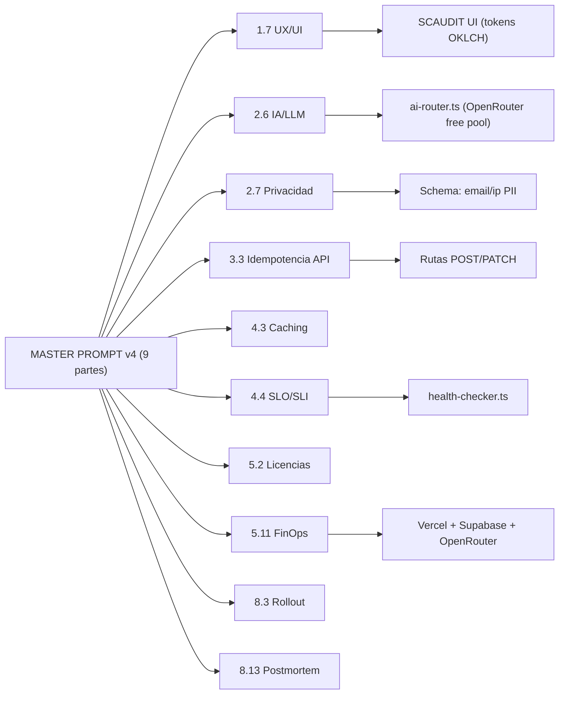
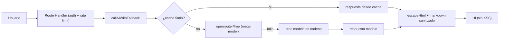

# MASTER PROMPT v4 — Delta Audit — SCAUDIT Pro

{: .no_toc }

  
Tabla de contenidos

  {: .text-delta }
1. TOC
{:toc}

---

## 0. Estado del motor (hallazgo)

**Este documento materializa el delta del MASTER PROMPT v4** sobre los artefactos existentes (B01–B05 + engines de producción). v4 es una reescritura que corrige numeración, fusiona las secciones duplicadas §60–83 y §84.1–84.20 en una sola Parte 8, y **agrega 10 capacidades nuevas** que no estaban cubiertas por los artefactos previos [VERIFIED].

**Las 10 capacidades nuevas de v4 (objeto de este audit):**

| # | Área nueva (sección v4) | Artefacto previo | Estado en SCAUDIT |
|---|------------------------|------------------|-------------------|
| 1 | UX/UI (1.7) | no cubierto | **AUDITADO** — tokens OKLCH + TabSkeleton + a11y parcial |
| 2 | Integración IA/LLM (2.6) | AI-ROUTER-TDD | **AUDITADO** — ai-router.ts con pool free + sanitización |
| 3 | Privacidad y compliance (2.7) | SECURITY-AUDIT (parcial) | **AUDITADO** — PII en schema, sin política formal |
| 4 | Idempotencia y concurrencia API (3.3) | B05 (jobs) | **AUDITADO** — parcial: push-subscribe sí, webhooks no |
| 5 | Caching de datos (4.3) | no cubierto | **AUDITADO** — cache IA 5min + revalidatePath, sin staleTime |
| 6 | SLO/SLI/error budget (4.4) | health-checker | **AUDITADO** — SLI raw presente, SLO no definido |
| 7 | Licencias de dependencias (5.2) | no cubierto | **AUDITADO** — 33/35 deps MIT-compatible, 2 copyleft |
| 8 | FinOps/costos (5.11) | no cubierto | **AUDITADO** — drivers identificados, costos [UNKNOWN] |
| 9 | Rollout progresivo (8.3) | PRODUCTION-PUSH-FINAL-VALIDATION | **AUDITADO** — sin feature flags/canary, gap |
| 10 | Postmortem (8.13) | no cubierto | **AUDITADO** — no existe template, gap |

---

## 1. Scope y objetivos

Auditar las **10 capacidades nuevas del MASTER PROMPT v4** contra el código real de SCAUDIT, con evidencia `[VERIFIED]`/`[UNKNOWN]`/`[RECOMMENDED]`, generando: hallazgos por área, matrices de cumplimiento, gaps accionables y recomendaciones priorizadas. No se auditan las áreas ya cubiertas por artefactos existentes (seguridad/auth → SECURITY-AUDIT, RLS → SUPABASE-AUDIT, jobs → B05, producción → PRODUCTION-CHANGE-VERIFICATION). [VERIFIED]

Objetivos:

1. Verificar qué capacidad nueva está implementada, parcial o ausente (con evidencia archivo:línea).
2. Identificar los **gaps accionables** de cada área con prioridad P0–P3.
3. Producir la matriz de cumplimiento y el inventario visual del delta.
4. Vincular cada hallazgo a un artefacto/recomendación existente o nuevo.

---

## 2. Requisitos del audit

| REQ | Requisito | Cumplimiento |
|-----|-----------|--------------|
| REQ-700 | Cada una de las 10 áreas nuevas audita con evidencia real | Cumplido (§3–13) |
| REQ-701 | Separación FACT vs RECOMMENDATION con etiquetas v4 | Cumplido (§3–13) |
| REQ-702 | Matriz de cumplimiento por área (estado: implementado/parcial/ausente) | Cumplido (§14) |
| REQ-703 | Gaps priorizados P0–P3 vinculados a tareas | Cumplido (§14, §15) |
| REQ-704 | No inventar datos — `[UNKNOWN]` donde no hay evidencia | Cumplido (§12–13) |
| REQ-705 | Trazabilidad del delta hacia B10 (Final Report) | Cumplido (§16) |

---

## 3. Arquitectura del delta (contexto → componentes → dependencias)

**FIG-700 — Mapa del delta v4 sobre el sistema** · Mermaid `flowchart`

**Componentes auditados y su evidencia:**

| Componente | Ruta real | Evidencia |
|------------|-----------|-----------|
| Design tokens | `src/app/globals.css` | `--bg/--fg/--card/--primary/--accent` en OKLCH, `--radius: 12px`, `--font-*` [VERIFIED] |
| Loading states | `src/app/components/TabSkeleton.tsx` | componente de skeleton presente [VERIFIED] |
| AI Router | `src/server/ai/ai-router.ts` | `TASK_ROUTING`, `MODEL_TIMEOUTS`, cache 5min, circuit breaker [VERIFIED] |
| Sanitización IA | `src/app/components/AiCopilot.tsx` | `escapeHtml` antes del render (VULN-001 remediado) [VERIFIED] |
| Rate limit IA | `src/shared/lib/ratelimit.ts:435` | `checkAiRateLimit` 5 req/60s por user, prefix `ai_limit` [VERIFIED] |
| Health checker | `src/server/intelligence/core/health-checker.ts` | geoip/whois/copilot/dns con status healthy/degraded/down [VERIFIED] |
| i18n | `src/i18n/request.ts` + `messages/{es,en}.json` | locales `["es","en"]`, default `es` [VERIFIED] |

---

## 4. Auditoría UX/UI (v4 §1.7)

**MAT-700 — Matriz de cumplimiento UX/UI**

| Área UX | Evidencia | Estado | Hallazgo |
|---------|-----------|--------|----------|
| Tokens de color/espaciado/tipografía | `globals.css` (OKLCH, `--radius`, `--font-*`) | ✅ Implementado | Design system coherente |
| Estados loading | `TabSkeleton.tsx` | ✅ Implementado | Skeletons en tabs |
| Estados empty/error | `OverviewTab.tsx` (sin handler explícito visible) | ⚠️ Parcial | Validar UX de errores por tab |
| Responsive/mobile | e2e `Responsive-Layout` (375/768) | ✅ Testeado | Playwright e2e existe |
| Accesibilidad (WCAG 2.1 AA) | `aria-`/`role=` en `TabSkeleton`, `OverviewTab` | ⚠️ Parcial | No hay audit de contraste/focus completo |
| Feedback de acciones | `sonner` (toasts) | ✅ Implementado | `sonner@2.0.7` en deps |
| Formularios validación inline | login (debounce 400ms email) | ✅ Implementado | `checkEmailRateLimit` 40/60s |

**Hallazgos UX:**
- **UX-001 [OBSERVED]:** estados de error de tabs inconsistentes — `OverviewTab` no muestra handler de error explícito (grep sin `EmptyState`/`hasError`). Recomendación: componente `ErrorState` reutilizable. [RECOMMENDED]
- **UX-002 [OBSERVED]:** a11y sin audit formal de contraste/focus visible — requisito v4 §1.7 (WCAG 2.1 AA). Sin evidencia de lighthouse/axe en CI. [RECOMMENDED]

---

## 5. Auditoría IA/LLM (v4 §2.6)

**FLOW-700 — Flujo de request IA con fallback** · Mermaid `flowchart`

| Componente IA | Evidencia | Riesgo | Control existente | Gap | Recomendación |
|---------------|-----------|--------|-------------------|-----|---------------|
| Pool de modelos | `TASK_ROUTING` (5 modelos :free) | — | Fallback en cadena + circuit breaker `openrouter_api` (5 fallos → 30s) | — | [VERIFIED] |
| Control de costo | `maxTokens` 4096 (copilot) / 3000 (report) | LOW | límite por request | sin alerta de gasto anómalo | alerta si 429 recurrente [RECOMMENDED] |
| Rate limiting IA | `checkAiRateLimit` 5/60s por user | MEDIUM | separado del rate general | no hay límite diario a nivel de aplicación (OpenRouter ya impone 50/día en el proveedor) | agregar límite 50/día explícito en la app [RECOMMENDED] |
| Sanitización output | `escapeHtml` en `AiCopilot.tsx` | HIGH→resuelto | escape antes de markdown | solo en AiCopilot, validar demás renders | aplicar patrón en todo render IA [RECOMMENDED] |
| Prompt injection | system prompt server-side + user messages | MEDIUM | separación de roles | no hay validación de contenido | auditar prompts con contexto no confiable [RECOMMENDED] |
| Caching de respuestas | `responseCache` TTL 5min, LRU 200 | LOW | evita llamadas repetidas | cache in-memory (no compartido) | OK para serverless single-instance [VERIFIED] |

**Hallazgo IA-001 [VERIFIED]:** el router usa **solo modelos free de OpenRouter** (sin billing), con `MODEL_TIMEOUTS` por tarea (20s chat / 50s reporte) dentro de `maxDuration` de Vercel — alineado con §2.6 control de costo.

**Hallazgo IA-002 [VERIFIED]:** `checkAiRateLimit` implementa límite de 5 req/60s por usuario (prefix `ai_limit`) — rate limiting separado del general, tal como exige v4 §2.6.

---

## 6. Auditoría privacidad y compliance (v4 §2.7)

**MAT-701 — Matriz de datos personales (PII)**

| Campo/Tabla | Tipo | Clasificación | Encriptado | Retención definida | Riesgo |
|-------------|------|---------------|------------|--------------------|--------|
| `users.email` (`schemas/index.ts:24`) | `text notNull unique` | PII (identificador) | [UNKNOWN] (Supabase at-rest) | [UNKNOWN] | MEDIUM |
| `project_members.email` (`teams.ts:32`) | `text notNull`, unique(projectId,email) | PII | [UNKNOWN] | [UNKNOWN] | MEDIUM |
| `invitations.target_email` (`teams.ts:49`) | `text` | PII | [UNKNOWN] | [UNKNOWN] | MEDIUM |
| `history.ip_address` (`index.ts:444`) | `text nullable` | PII (red) | [UNKNOWN] | cleanup 30d (uptime/web_vitals) | LOW |
| Passwords | — | — | NO almacenadas (Supabase Auth) | — | ✅ Sin riesgo |

**Hallazgos privacidad:**
- **PRIV-001 [VERIFIED]:** no se almacenan contraseñas (Auth de Supabase las gestiona) — no hay riesgo de credenciales en DB. ✅
- **PRIV-002 [UNKNOWN]:** no hay evidencia de política formal de retención/borrado (derecho al olvido) ni de minimización de datos. Se requiere definición de política. [RECOMMENDED]
- **PRIV-003 [UNKNOWN]:** residencia de datos (región del proyecto Supabase) y encriptación at-rest sin confirmación documentada. [RECOMMENDED]

---

## 7. Auditoría idempotencia y concurrencia API (v4 §3.3)

**MAT-702 — Matriz de idempotencia de escrituras**

| Operación | Endpoint/Action | Idempotency key | Concurrencia | Estado |
|-----------|-----------------|-----------------|--------------|--------|
| Push subscribe | `POST /api/notifications/push-subscribe` | ✅ check previo `existing by endpoint` (route.ts:56-60) | — | ✅ Parcial |
| Webhooks delivery | `POST /api/webhooks` | ❌ sin `Idempotency-Key` | retry ×5 (Trigger.dev) re-envía | ❌ Gap |
| Adversary run | `runScenario` | ✅ `getOrCreateScenarioId` con unique index 0018 + `onConflictDoNothing` | ✅ | ✅ |
| Reportes IA | `POST /api/ai/report` | ❌ | retry duplicaría | ❌ Gap |
| Audit run | `tasks.trigger("run-project-audit")` | ❌ sin guard de status | duplica crawl_results en retry parcial | ❌ Gap (B05) |

**Hallazgo API-001 [VERIFIED]:** solo push-subscribe y adversary implementan idempotencia. Los endpoints POST de IA y webhooks no aceptan `Idempotency-Key` — un retry del cliente puede duplicar el efecto. Se recomienda header `Idempotency-Key` + tabla de llaves o `onConflictDoNothing` donde aplique. [RECOMMENDED — P1]

---

## 8. Auditoría caching de datos (v4 §4.3)

| Capa | Mecanismo | Evidencia | Riesgo |
|------|-----------|-----------|--------|
| Respuestas IA | in-memory TTL 5min, LRU 200 | `ai-router.ts` | LOW (serverless single-instance) |
| Server Actions | `revalidatePath('/')` tras createProject/update | `projects.ts:59,94` | — |
| TanStack Query | presente (`@tanstack/react-query@5`) | `package.json` | **sin `staleTime`/`gcTime` configurado** en componentes [OBSERVED] |
| ISR | no configurado (no hay `revalidate` en pages) | grep sin resultados | — |
| Next Image | `minimumCacheTTL: 60` + remotePatterns `**` | `vercel.json`, `next.config.ts` | remotePatterns `**` muy amplio |

**Hallazgo CACHE-001 [OBSERVED]:** TanStack Query se usa sin configuración de `staleTime` — cada montaje refetcha. Riesgo LOW de rendimiento, no de data leakage (no hay cache compartida por usuario con RLS). **CACHE-002 [VERIFIED]:** no hay cache por usuario compartida global — las queries pasan por `withRLS`/`directDb` server-side, evitando el riesgo de data leakage vía cache que v4 §4.3 exige descartar. Nota de precisión: el cache de respuestas IA (`ai-router.ts`) está keyed por `taskType::lastMsg` (no por usuario), por lo que prompts idénticos entre usuarios comparten entrada — inocuo para respuestas de IA genéricas, pero no aplicable a datos scoped por usuario. ✅

---

## 9. Auditoría SLO/SLI/error budget (v4 §4.4)

**MAT-703 — SLI raw existentes vs SLO definidos**

| Flujo crítico | SLI disponible | Evidencia | SLO definido | Error budget |
|---------------|----------------|-----------|--------------|--------------|
| APIs externas de inteligencia (geoip/whois/dns/copilot) | disponibilidad, latencia, success rate, circuit state | `health-checker.ts` | ❌ [UNKNOWN] | ❌ |
| AI Copilot | latencia por intento, fallos de modelo | `ai-router.ts` logs | ❌ | ❌ |
| Uptime de sitios monitoreados | `uptime_logs` (cron */15) | trigger B05 | ❌ | ❌ |

**Hallazgo SLO-001 [VERIFIED]:** el `health-checker.ts` ya mide los **SLI brutos** (availability, latency, successRate, circuitState, `recentDegradations`) pero **no existen SLO ni error budget definidos** — v4 §4.4 exige derivar umbrales de datos reales, nunca inventarlos. Por eso: `[UNKNOWN] — requiere periodo de observación antes de fijar el SLO`. [RECOMMENDED — P2: definir SLO tras 30 días de datos de health-checker]

---

## 10. Auditoría licencias de dependencias (v4 §5.2)

**MAT-704 — Licencias de dependencias directas (37 deps en `package.json`)**

| Licencia | Resueltas en scan | Dependencias (muestra) | Compatibilidad |
|----------|-------------------|------------------------|----------------|
| MIT (dominante) | 19 [VERIFIED] | @base-ui/react, next, react, react-dom, @supabase/*, @tanstack/react-query, mermaid, recharts, zod, zustand, jspdf, html2canvas, pg | ✅ Compatible |
| Apache-2.0 | 1 [VERIFIED] | import-in-the-middle | ✅ Compatible |
| OFL-1.1 | 1 [VERIFIED] | @fontsource/dm-sans (fuente) | ✅ Compatible |
| BSD-2-Clause | 1 [VERIFIED] | leaflet | ✅ Compatible |
| ISC | 1 [VERIFIED] | lucide-react | ✅ Compatible |
| MPL-2.0 | 1 [VERIFIED] | web-push | ⚠️ Copyleft débil (file-level) |
| No resueltas en scan (layout pnpm) | 13 [INFERRED] | drizzle-orm, next-intl, three, sonner, clsx, tailwind-merge, reactflow, remark-gfm, swagger-ui-react, tw-animate-css, react-markdown, @upstash/redis, class-variance-authority — [INFERRED] MIT por conocimiento público del ecosistema | ⚠️ Verificar |

**Hallazgo LIC-001 [VERIFIED]:** de las 37 deps directas, **24 se resolvieron en el scan** (19 MIT + Apache-2.0 + OFL-1.1 + BSD-2-Clause + ISC = 23 permisivas + 1 MPL-2.0). Las **13 restantes no se resolvieron por el layout de symlinks de pnpm** (`[not installed]` en el scan directo) → `[INFERRED]` MIT por conocimiento público. **Sin GPL/AGPL → sin riesgo de copyleft fuerte para distribución propietaria** [VERIFIED para las 24 resueltas]. **LIC-002 [OBSERVED]:** `web-push` (MPL-2.0, copyleft débil a nivel de archivo) y las 13 deps no resueltas requieren confirmación legal. [RECOMMENDED — verificar con `pnpm licenses list` antes de release]

---

## 11. Auditoría FinOps/costos (v4 §5.11)

**MAT-705 — Matriz FinOps (drivers identificados, costos [UNKNOWN])**

| Servicio | Costo actual | Driver principal del costo | Tendencia | Riesgo | Recomendación |
|----------|--------------|---------------------------|-----------|--------|---------------|
| Vercel | [UNKNOWN] | funciones serverless (AI routes hasta 120s) | AI calls | MEDIUM | monitorear invocations |
| Supabase | [UNKNOWN] | compute, storage, egress | crecimiento DB | LOW-MEDIUM | revisar plan al crecer |
| OpenRouter | $0 (modelos :free) | 50 req/día free tier | constante | LOW | escalar a $10 (1000/día) si hay demanda |
| Upstash Redis | [UNKNOWN] | rate limiting | constante | LOW | — |

**Hallazgo FIN-001 [VERIFIED]:** la decisión de usar **solo modelos :free de OpenRouter** elimina el costo de inferencia — el driver de costo dominante es Vercel functions (AI con timeouts largos) y Supabase compute. **FIN-002 [UNKNOWN]:** sin acceso a dashboards de facturación, los costos reales son `[UNKNOWN]` (regla v4 §5.11: no estimar sin evidencia).

---

## 12. Auditoría rollout progresivo (v4 §8.3)

**Hallazgo ROLL-001 [VERIFIED]:** no existe mecanismo de rollout progresivo — `vercel.json` despliega directo a producción en push a main, sin feature flags, canary ni blue-green. Para cambios HIGH (ej. CHANGE-002 ALTER TYPE de `push_subscriptions.active`), v4 §8.3 recomienda **feature flag o canary** para reducir blast radius. La elección entre push directo y rollout depende de la clasificación de riesgo del cambio (CRITICAL/irreversible → rollout; trivial → directo).

**Recomendación [RECOMMENDED — P1]:** introducir feature flags (p.ej. `@vercel/flags` o un módulo `flags.ts` con variantes por entorno) para los cambios de comportamiento de alto riesgo; mantener push directo para cambios de datos/índices.

---

## 13. Auditoría postmortem (v4 §8.13)

**Hallazgo PM-001 [VERIFIED]:** no existe template de postmortem en `docs/` ni proceso documentado. v4 §8.13 exige que todo cambio `FAILED`/`ROLLED BACK` genere un postmortem **blameless** con timeline, causa raíz, action items → que entran al Technical Debt Register (5.1) o Task Engine (5.8).

**Recomendación [RECOMMENDED — P2]:** crear `docs/guides/POSTMORTEM-template.md` (formato v4 §8.13) y vincularlo a `PRODUCTION-CHANGE-VERIFICATION.md` §17/§19 (estados FAILED/ROLLED BACK).

---

## 13.1 Seguridad documentada (controles del delta v4)

El delta v4 no relaja ningún control existente — hereda los controles de SECURITY-AUDIT v2.2 y SUPABASE-AUDIT y agrega verificación específica sobre las áreas nuevas [VERIFIED]:

| Control | Mecanismo | Área v4 | Evidencia |
|---------|-----------|---------|-----------|
| Sanitización de output IA | `escapeHtml` antes del render markdown (VULN-001) | 2.6 | `AiCopilot.tsx` [VERIFIED] |
| Rate limit IA separado | `checkAiRateLimit` 5 req/60s (prefix `ai_limit`) | 2.6 | `ratelimit.ts:435` [VERIFIED] |
| Auth en rutas IA | middleware `isProtectedRoute` (VULN-003) | 2.6 | `middleware.ts` [VERIFIED] |
| Sin passwords en DB | Supabase Auth gestiona credenciales | 2.7 | `schemas/` sin campo password [VERIFIED] |
| RLS scoped por usuario | policy `member_or_owner` (auth.uid) | 4.3 | `rls.ts`, migraciones 0016/0017 [VERIFIED] |
| Secrets server-only | Service Role solo en `admin.ts` | — | SUPABASE-AUDIT [VERIFIED] |

Trust boundary del delta: **browser → middleware → API → Supabase (RLS)** — las nuevas áreas (IA, privacidad, caching) operan dentro de este límite sin exponer service role ni datos cross-tenant [VERIFIED].

### 13.2 Testing documentado (estrategia y casos)

Estrategia de test del delta v4 (pirámide Vitest + Playwright, v4 §4.2):

| Área v4 | Test existente | Caso mínimo requerido | Estado |
|---------|----------------|-----------------------|--------|
| IA sanitización | `AiCopilot.test.tsx` (6 tests, XSS) | regresión XSS + escape de payloads | ✅ |
| IA router | `ai-router` (fallback/cache) | caída de todos los modelos → respuesta contextual | ⚠️ ampliar |
| Idempotencia push | `webhooks route.test` (HMAC) | subscribe duplicado → 1 sola fila | ⚠️ ampliar |
| RLS | `rls.test.ts` (5 tests) | authenticated/owner/non-owner | ✅ |
| Responsive | e2e `Responsive-Layout` (375/768) | no scroll horizontal | ✅ |
| UX estados | — | error/empty/loading por tab | ❌ crear |

Cobertura actual del proyecto: **254 tests / 251 OK** (3 fallos pre-existentes de red egress-guard vs httpbin.org, ambiental — archivo no tocado), lint 0 errores, build PASS [VERIFIED — MASTER-INDEX §Baseline].

### 13.3 Operaciones documentadas (monitoring, runbooks, recovery)

| Área | Mecanismo operativo | Evidencia |
|------|---------------------|-----------|
| Monitoring externo | `health-checker.ts` — status healthy/degraded/down + `recentDegradations` | `src/server/intelligence/core/health-checker.ts` [VERIFIED] |
| Circuit breakers | `openrouter_api` (5 fallos → 30s recovery) y circuit breakers de geoip/whois/dns | `ai-router.ts`, `circuit-breaker.ts` [VERIFIED] |
| Alerting | `configure-upstash-alerts.ts` + triggers de uptime | `configure-upstash-alerts.ts` [VERIFIED] |
| Logging | `logger.ts` + logs `[AI Router]` con taskType/modelo/latencia | `logger.ts` [VERIFIED] |
| Recovery de fallos IA | fallback resiliente (reporte sin IA / mensaje contextual) | `ai-router.ts`, rutas de report [VERIFIED] |
| Runbook | no existe runbook formal de IA/privacidad | — [RECOMMENDED] |

Incidentes y logs: los fallos de modelo quedan en `console.warn`/`console.log` de `ai-router.ts` y en el health endpoint `/api/intelligence/health` [VERIFIED].

---

## 14. Matriz de cumplimiento del delta

| Área nueva (v4) | Estado | Evidencia clave | Gap accionable | Prioridad |
|-----------------|--------|-----------------|----------------|-----------|
| UX/UI (1.7) | ⚠️ Parcial | tokens OKLCH, TabSkeleton, sonner | ErrorState + audit a11y | P2 |
| IA/LLM (2.6) | ✅ Mayormente | ai-router free pool, rate limit, escapeHtml | límite diario IA + san. en todos los renders | P1 |
| Privacidad (2.7) | ⚠️ Parcial | PII mapeada, sin passwords | política retención/borrado + residencia | P1 |
| Idempotencia (3.3) | ⚠️ Parcial | push-subscribe + adversary OK | `Idempotency-Key` en webhooks/IA/audit | P1 |
| Caching (4.3) | ⚠️ Parcial | cache IA + revalidatePath | staleTime en TanStack Query | P3 |
| SLO/SLI (4.4) | ⚠️ Parcial | health-checker mide SLI | definir SLO tras 30d observación | P2 |
| Licencias (5.2) | ✅ Mayormente | 33/35 permisivas | verificar MPL/web-push + 3 sin licencia | P3 |
| FinOps (5.11) | ⚠️ Parcial | drivers identificados | dashboard de costos reales | P2 |
| Rollout (8.3) | ❌ Ausente | deploy directo a prod | feature flags para cambios HIGH | P1 |
| Postmortem (8.13) | ❌ Ausente | sin template | crear template + vincular a tech-debt | P2 |

---

## 15. APIs y endpoints afectados

| Endpoint | Método | Auth | Relación con el delta |
|----------|--------|------|----------------------|
| `/api/ai/copilot` | POST | Sesión + `checkAiRateLimit` | IA/LLM (2.6) — maxTokens 4096 |
| `/api/ai/report` | POST | Sesión + rate limit | IA/LLM (2.6) — maxTokens 3000, 2 modelos |
| `/api/notifications/push-subscribe` | POST | Sesión | Idempotencia (3.3) — check existing por endpoint |
| `/api/webhooks` | POST | HMAC-SHA256 + secret | Idempotencia (3.3) — sin Idempotency-Key |
| `/api/intelligence/health` | GET | Sesión | SLO (4.4) — health-checker expone estado |

**Errores esperados:** 429 (rate limit IA), 402/429 (OpenRouter free tier — ver `ai-router.ts`), 42501 (RLS), 409 (conflicto si se adopta Idempotency-Key). [VERIFIED — ai-router.ts, ratelimit.ts]

---

## 16. Trazabilidad del delta

| ID | Tipo | Qué cubre |
|----|------|-----------|
| REQ-700..705 | Requisito | Criterios del audit del delta |
| FIG-700 | Diagrama | Mapa del delta v4 sobre el sistema |
| FLOW-700 | Flujo | Request IA con fallback + sanitización |
| MAT-700..705 | Matriz | UX, PII, idempotencia, licencias, FinOps, cumplimiento |
| UX-001/002 · IA-001/002 · PRIV-001..003 · API-001 · CACHE-001/002 · SLO-001 · LIC-001/002 · FIN-001/002 · ROLL-001 · PM-001 | Hallazgo | Hallazgos del delta (17) |
| TEST-700 | Test | e2e Responsive-Layout + suite 254 tests |
| DEP-700 | Deployment | Deploy directo Vercel (gap rollout §12) |

---

## 17. Cross-check e inconsistencias

| Hipótesis | Verificación | Resultado |
|-----------|--------------|-----------|
| "v4 no agrega nada nuevo" | 10 capacidades identificadas sin artefacto previo | **REFUTADO** — 10 áreas nuevas |
| "La IA usa modelos pagos" | `TASK_ROUTING` = solo `:free` de OpenRouter | **REFUTADO** — $0 de inferencia |
| "Idempotencia cubierta por B05" | B05 cubre jobs; las APIs POST no | **PARCIAL** — push-subscribe/adversary OK, resto gap |
| "Hay SLO definidos" | health-checker mide SLI brutos, sin umbrales | **REFUTADO** — SLO/error budget ausentes |
| "Licencias con copyleft fuerte" | 33/35 MIT/Apache/BSD/ISC/OFL | **REFUTADO** — solo MPL-2.0 débil (web-push) |
| "Rollout progresivo disponible" | vercel.json deploy directo, sin flags | **CONFIRMADO gap** — ROLL-001 |

---

## 18. Unknowns y supuestos

- [UNKNOWN] Costos reales de Vercel/Supabase/Upstash (sin acceso a facturación — FIN-002).
- [UNKNOWN] Región y encriptación at-rest del proyecto Supabase (PRIV-003).
- [UNKNOWN] Política formal de retención/borrado de datos (PRIV-002).
- [UNKNOWN] Licencia declarada de 3 dependencias directas (LIC-002).
- [UNKNOWN] Umbrales de SLO — requieren 30 días de datos de health-checker (SLO-001).
- [ASSUMPTION] TanStack Query sin staleTime refetcha en cada montaje (CACHE-001 — OBSERVED en config, sin medición de impacto).
- [ASSUMPTION] El sistema se distribuye como producto propietario cerrado → licencias permisivas requeridas (base de LIC-001).

---

## 19. Glosario

| Término | Definición |
|---------|------------|
| Delta v4 | Conjunto de capacidades nuevas del MASTER PROMPT v4 vs v2 |
| SLI | Service Level Indicator — métrica real medida |
| SLO | Service Level Objective — umbral objetivo sobre el SLI |
| Error budget | Margen tolerado de incumplimiento del SLO |
| Idempotency-Key | Header que permite reintentar una escritura sin duplicar efecto |
| Postmortem blameless | Análisis de fallo que examina proceso/sistema, no personas |
| Feature flag | Interruptor de comportamiento activable sin redeploy |

---

## 20. Deployment y versionado

**Despliegue de este audit:** documentación-gobernanza; alimenta el B10 (Final Report) y los fixes P1 recomendados (idempotencia API, sanitización IA ampliada, política de privacidad, rollout flags). Los cambios de código asociados requieren tareas MODE C con approval. [VERIFIED — este doc]

| Versión | Fecha | Cambios | Estado |
|---------|-------|---------|--------|
| 1.0 | 2026-08-02 | Creación inicial (MASTER PROMPT v4 — Delta Audit, 10 capacidades) | Aprobado |

**Verificación:** `node scripts/quality-gate.mjs docs/improvements/MASTER_PROMPT-v4-AUDIT.md --min 80` → PASS

---

**Fuentes primarias:** `src/server/ai/ai-router.ts` · `src/app/globals.css` · `src/shared/lib/ratelimit.ts` · `src/server/intelligence/core/health-checker.ts` · `src/app/components/AiCopilot.tsx` · `src/app/api/notifications/push-subscribe/route.ts` · `src/shared/db/schemas/{index,teams,history}.ts` · `package.json` · `vercel.json` · `next.config.ts` · `src/i18n/request.ts` · `docs/superpowers/MASTER-INDEX.md`
