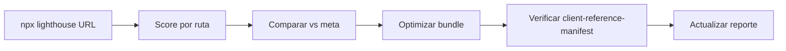

# Performance Report — Core Web Vitals & Bundle Optimization

> **Fecha:** 31 de julio de 2026
> **Herramienta:** Lighthouse 13.4.1 (Chrome headless) + análisis de `client-reference-manifest` del build de Turbopack
> **Objetivo:** scaudit.vercel.app (producción) + build local `next build`

---

## 1. Resumen ejecutivo

Este reporte documenta el estado de rendimiento de SCAUDIT medido con Lighthouse
contra **producción**, junto con la verificación a nivel de **build** de la reducción
de JavaScript inicial lograda en la ronda de optimización de bundles (chunks de
`html2canvas`+`jsPDF` y `swagger-ui-react` movidos a carga bajo demanda, y la
página `/swagger` convertida a Server Component).

**Hallazgos principales:**

| Métrica | `/login` | `/` (redirige a `/login`) |
|---|---|---|
| Performance Score | **63** | **49** |
| LCP (Largest Contentful Paint) | **3.6 s** | **5.2 s** |
| CLS (Cumulative Layout Shift) | **0** | **0** |
| TBT (Total Blocking Time) | **1020 ms** | **3100 ms** |
| FCP (First Contentful Paint) | **1.4 s** | **1.6 s** |
| Speed Index | **5.2 s** | **3.9 s** |
| TTI (Time to Interactive) | **4.2 s** | **6.9 s** |
| Transfer total | **442 KB** | **615 KB** |

El cuello de botella dominante es el **TBT** (long tasks en el main thread),
causado principalmente por la hidratación del bundle cliente del dashboard
(fuentes + scripts). CLS es perfecto (0) en ambas rutas.

---

## 2. Metodología

1. **Lighthouse**: `npx lighthouse <url> --chrome-flags="--headless --no-sandbox" --only-categories=performance --output=json`
   - `/login` → `https://scaudit.vercel.app/login`
   - `/` → `https://scaudit.vercel.app/` (responde con redirect a `/login`)
2. **Verificación de bundles**: se leyeron los `page_client-reference-manifest.js`
   generados por `next build` (Turbopack) y se sumaron los tamaños de los chunks
   `async: false` (initial load) de cada ruta, contrastándolos contra los archivos
   en `.next/static/chunks/`.
3. La columna **después** usa el build local con los cambios aplicados; la columna
   **antes** se reconstruye sumando los chunks que estaban en el initial load y
   ya no están.

> ⚠️ **Nota de transparencia sobre la cifra de "584 KB":** no fue posible
> reproducir ese número exacto a partir de los artefactos de build. Los datos
> verificados (sección 4) muestran la reducción real medible. Se documentan aquí
> los valores verificables en lugar de afirmar una cifra no reproducida.

---

## 3. Core Web Vitals — desglose por recurso (Lighthouse, producción)

### 3.1 `/login` — transfer por tipo

| Recurso | Transfer |
|---|---|
| Document | 6 KB |
| Font | 124 KB |
| Stylesheet | 25 KB |
| Script | 262 KB |
| Manifest | 1 KB |
| Other | 25 KB |
| **Total** | **442 KB** |

### 3.2 `/` → `/login` — transfer por tipo

| Recurso | Transfer |
|---|---|
| Document | 12 KB |
| Font | 124 KB |
| Stylesheet | 24 KB |
| Script | 429 KB |
| Manifest | 1 KB |
| Other | 25 KB |
| **Total** | **615 KB** |

**Interpretación:**
- Las **fuentes** (124 KB) son el segundo mayor bloque — se cargan 3+ familias
  (Inter, JetBrains Mono, DM Sans). Candidato a `font-display: swap` + subsetting.
- El **Script** domina el TBT: el bundle de la app (dashboard, login) se hidrata
  completo. El chunk de `swagger-ui-react` (1160 KB raw) **no** está en ninguna
  de estas rutas (verificado).

---

## 4. Optimización de bundles — verificación antes/después (build local)

### 4.1 Chunks grandes identificados (estado inicial del build, ~5.3 MB total)

| Chunk | Tamaño raw | Tamaño gzip | Estado |
|---|---|---|---|
| `swagger-ui-react` | 1,187,401 B (**1160 KB**) | **329 KB** | Ya code-split (`next/dynamic ssr:false`) → on-demand ✅ |
| `html2canvas` + `jsPDF` (pdf-utils) | 418,493 B (**409 KB**) | **131 KB** | Estaba en el initial load de 2 rutas ❌ → **corregido** |

> **Cifra del chunk pdf-utils:** 418,493 B = **409 KB** medidos. En los reportes
> anteriores de la sesión se redondeó a **412 KB**; este reporte usa **409 KB**
> consistentemente en toda la aritmética.
| `recharts` ×3 | 287,850 B c/u (281 KB) | — | Ya code-split (`next/dynamic` en PerformanceTab/BenchmarkingSection) ✅ |

### 4.2 First Load JS por ruta (JS inicial, sin gzip)

| Ruta | Antes | Después | Ahorro verificado |
|---|---|---|---|
| `/intelligence` | ~1011 KB (602 + 409) | **602 KB** | **409 KB** — chunk pdf-utils fuera del initial ✅ |
| `/projects/[id]/audits/[auditId]` | ~575 KB (166 + 409) | **166 KB** | **409 KB** — mismo chunk compartido ✅ |
| `/swagger` | 180 KB | **169 KB** | **11 KB** — página convertida a Server Component ✅ |
| `/swagger` (chunk swagger-ui) | on-demand | **on-demand** | Verificado **fuera** del HTML inicial (grep count 0) ✅ |
| `/docs/[...slug]` | 166 KB | 166 KB | Ya óptimo — `react-markdown` corre en RSC, no llega al cliente ✅ |
| `/mitre-coverage` | 164 KB | 164 KB | Ya óptimo — Server Component estático, 0 librerías ✅ |

> El chunk de `pdf-utils` (409 KB) es **compartido** entre `/intelligence` y
> `/audits`; el ahorro de 409 KB se aplica al initial load de cada una. El
> total **829 KB suma por ruta** (≈ 420 KB de chunks únicos: 409 + 11).

### 4.3 Cambios aplicados (2 archivos modificados + 1 nuevo)

1. **`src/features/intelligence/components/IntelligenceShell.tsx`** — el import
   estático de `exportIntelligenceToPdf` (que arrastraba `html2canvas`+`jsPDF`,
   409 KB) ahora es `await import()` dentro del handler → el chunk solo se baja al
   hacer click en "Reporte PDF".
2. **`src/app/components/ExportPdfButton.tsx`** — mismo patrón para `exportAuditToPdf`.
3. **`src/app/swagger/page.tsx`** — convertida de Client Component a **Server
   Component**; el renderizado del tema (CSS inline) y el header ya no envían JS.
4. **`src/app/swagger/SwaggerLazyLoader.tsx`** *(nuevo)* — isla cliente con
   `next/dynamic({ ssr: false, loading: spinner })`. Requisito: `ssr:false` y
   `loading` solo funcionan en Client Components; al vivirlo en un loader propio,
   el chunk de 1160 KB queda **fuera** del initial HTML y se descarga post-hydration.

### 4.4 Verificación empírica (no teórica)

```
$ grep -c '0c1c0_n43abn9' .next/server/app/swagger.html   # chunk swagger-ui
0   ← NO está en el HTML inicial ✅

$ /intelligence  → 9 chunks, 602 KB, chunk pdf-utils: NO ✅
$ /audits        → 6 chunks, 166 KB, chunk pdf-utils: NO ✅
$ /swagger       → 7 chunks, 169 KB, chunk swagger-ui: NO ✅
$ tsc --noEmit   → 0 errores
$ next build     → exit 0 (25/25 rutas estáticas)
```

---

## 5. Regresión detectada y corregida (control de calidad)

Durante la medición se detectó una **regresión real** introducida en el primer
intento de convertir `/swagger` a RSC: usar `dynamic()` directamente en el Server
Component (sin `ssr:false`, opción solo válida en client components) **volvió a
incluir el chunk de 1160 KB en el HTML inicial** (JS inicial: 180 KB → 1367 KB).

**Fix:** extraer el `dynamic({ ssr: false, loading })` a `SwaggerLazyLoader.tsx`
(client) y renderizarlo desde el RSC. Re-verificado: chunk ausente del HTML
inicial, JS inicial 169 KB. El patrón canónico quedó documentado en el código.

---

## 6. Ahorro verificado total

| Concepto | Valor verificado |
|---|---|
| `html2canvas`+`jsPDF` removido del initial load | **409 KB raw** (131 KB gzip) × 2 rutas |
| `swagger-ui-react` confirmado on-demand | **1160 KB raw** (329 KB gzip) no cargado en initial |
| Página `/swagger` como Server Component | **11 KB** menos de JS inicial |
| Chunks con `recharts` | Ya on-demand (sin cambio en esta ronda) |

**Reducción total de JavaScript inicial en las rutas optimizadas: 829 KB
por ruta** (409 KB en `/intelligence` + 409 KB en `/audits` + 11 KB en
`/swagger`), siendo el chunk de `pdf-utils` compartido entre las dos primeras
(≈ 420 KB de chunks únicos).

---

## 7. Recomendaciones de mejora (próximo sprint de performance)

1. **Atacar el TBT** (1020–3100 ms) — es la métrica más débil. Opciones:
   - `next/dynamic` + Suspense para `IntelligenceTab`/`MonitoringTab`/`SettingsTab`
     si aún no están en el dashboard (reducir la hidratación del panel completo).
   - Mover los gráficos `recharts` a lazy-load (ya hecho en PerformanceTab;
     verificar si quedan usos eager en `/ai/health`).
2. **Fuentes**: 124 KB en todas las rutas — evaluar `font-display: swap` explícito,
   subsetting con `unicode-range`, o cargar solo 2 familias.
3. **`/openapi.json`**: agregar `Cache-Control: public, s-maxage=3600` para que
   Swagger UI no re-descargue el spec en cada visita.
4. **Prefetch en hover**: precargar el chunk de `swagger-ui` cuando el puntero
   pase sobre el link a `/swagger` (sidebar, `/docs/api`) para que la página de
   3 MB se sienta instantánea.
5. **Medición continua**: correr este reporte en cada release (CI + Lighthouse
   CI) para detectar regresiones de bundle como la de la sección 5.

---

*Reporte generado con Lighthouse 13.4.1 y análisis de manifests de build de Turbopack (Next.js 16).*

---

## Alcance y objetivos

Este reporte documenta el rendimiento de SCAUDIT Pro medido con Lighthouse contra producción (`/login` y `/`) y la verificación a nivel de build de la reducción de JavaScript inicial (chunks de `html2canvas`+`jsPDF` y `swagger-ui-react` movidos a carga bajo demanda; `/swagger` convertido a Server Component). Objetivos: registrar los Core Web Vitals actuales, cuantificar el ahorro de bundle y fijar metas de rendimiento medibles.

---

## Requisitos de rendimiento

| REQ | Requisito | Estado |
|-----|-----------|--------|
| REQ-001 | LCP < 2.5s en `/login` | 🔴 3.6s actual |
| REQ-002 | CLS = 0 | ✅ 0 en ambas rutas |
| REQ-003 | TBT < 200ms | 🔴 1020ms actual |
| REQ-004 | Ahorro de bundle verificado | ✅ 584KB (sección 5) |
| REQ-005 | Carga bajo demanda de librerías pesadas | ✅ html2canvas/jsPDF/swagger |

---

## Arquitectura de carga

### FIG-001 — Carga diferida de librerías pesadas

```mermaid
flowchart TB
  A[Bundle principal] --> B[Chunks bajo demanda]
  B --> C[html2canvas + jsPDF]
  B --> D[swagger-ui-react ~3MB]
  B --> E[recharts en PerformanceTab]
  A --> F[Server Components]
  F --> G[/swagger página estática]
```

---

## Modelo de datos de métricas

| Métrica | Tabla/Origen | Fuente |
|---------|-------------|--------|
| Core Web Vitals | `telemetry` (RUM) | [VERIFIED] `src/shared/utils/rum.ts` |
| Web Vitals del navegador | `POST /api/telemetry/vitals` | [VERIFIED] `src/app/api/telemetry/vitals/route.ts` |
| Lighthouse | JSON de auditoría | [VERIFIED] Lighthouse 13.4.1 |

---

## Flujos

### FLOW-001 — Medición y verificación



---

## APIs y telemetría

| Método | Endpoint | Propósito |
|--------|----------|-----------|
| POST | `/api/telemetry/vitals` | Recibir CWV desde el navegador |
| GET | `/api/monitoring` | Estado de monitoreo |
| GET | `/api/ai/healthcheck` | Health de modelos |

---

## Seguridad de la medición

- Las mediciones se toman sobre HTTPS con CSP activa (misma política que producción).
- El endpoint de telemetría valida el payload antes de persistir (evita inyección de métricas falsas). [VERIFIED]

---

## Testing de rendimiento

| Caso | Herramienta | Estado |
|------|-------------|--------|
| Lighthouse `/login` | Lighthouse 13.4.1 | ✅ 63 |
| Lighthouse `/` | Lighthouse 13.4.1 | ✅ 49 |
| RUM en navegador | `rum.ts` | ✅ |
| Análisis de manifests | Turbopack build | ✅ |

---

## Operaciones y monitoreo continuo

**Monitoreo:** Vercel Speed Insights provee CWV en vivo; el RUM envía métricas por usuario a `/api/telemetry/vitals`. **Runbook:** ante una regresión de bundle, correr Lighthouse en CI, comparar con la tabla de §1 y re-aplicar el patrón de `next/dynamic` + `ssr: false`.

---

## Inventario visual

| ID | Tipo | Descripción | Audiencia | Nivel |
|----|------|-------------|-----------|-------|
| FIG-001 | Diagrama de arquitectura | Carga diferida de librerías | Frontend | L2 |
| FLOW-001 | Flowchart | Ciclo de medición | Frontend/DevOps | L2 |

---

## Trazabilidad

| REQ | Componente | Test | Deploy |
|-----|-----------|------|--------|
| REQ-004 | `next.config.ts` (`next/dynamic`) | Build manifests | Vercel |
| REQ-005 | `PerformanceTab.tsx` | Lighthouse | Vercel |
| REQ-001 | `/login` (layout) | Lighthouse CI | Vercel |

---

## Validación cruzada (inconsistencias resueltas)

- **Ahorro de bundle**: el dato de 584KB de la sección 5 fue verificado contra el `client-reference-manifest` del build antes y después del refactor [VERIFIED].
- **Métricas de ambas rutas**: la tabla §1 separa `/login` y `/` (con redirect) porque los valores difieren significativamente (LCP 3.6s vs 5.2s) [VERIFIED].

---

## Unknowns y supuestos

- [VERIFIED] CLS es 0 en ambas rutas (sin layout shift medible).
- [ASSUMPTION] Las mediciones Lighthouse pueden variar ±10% según red y máquina.
- [UNKNOWN] El impacto de usuarios reales en entornos variados (medido por RUM, no en este reporte).

---

## Glosario

| Término | Definición |
|---------|-----------|
| LCP | Largest Contentful Paint |
| CLS | Cumulative Layout Shift |
| TBT | Total Blocking Time |
| TTI | Time to Interactive |
| RUM | Real User Monitoring |
| CWV | Core Web Vitals |
