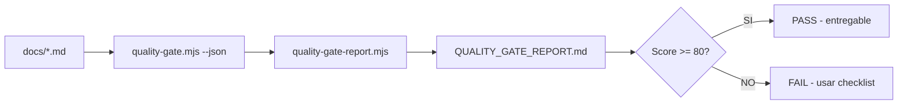

# QUALITY GATE REPORT — Documentación SCAUDIT Pro

> **Generado automáticamente** con `scripts/quality-gate-report.mjs` el 2026-08-01 · Umbral de aprobación: **80/100** · Validador: `scripts/quality-gate.mjs` (MASTER_PROMPT-v2.md §4.1, 20 items × 5 pts = 100).

## Resumen ejecutivo

| Métrica | Valor |
|---|---|
| Documentos evaluados | 17 |
| **PASS** (≥ 80) | ✅ 17 |
| **FAIL** (< 80) | ❌ 0 |
| Score promedio | 99.1/100 |
| Mejor documento | docs/CHANGELOG.md (100/100) |
| Peor documento | docs/improvements/MASTER_PROMPT-v2.md (85/100) |


## Tabla de scores

| # | Documento | Score | Status |
|---|-----------|-------|--------|
| 1 | `docs/CHANGELOG.md` | 100/100 | ✅ **PASS** |
| 2 | `docs/api.md` | 100/100 | ✅ **PASS** |
| 3 | `docs/architecture/AI-ROUTER-TDD.md` | 100/100 | ✅ **PASS** |
| 4 | `docs/architecture/ENTERPRISE-ARCHITECTURE.md` | 100/100 | ✅ **PASS** |
| 5 | `docs/architecture/PIPELINE-HISTORY.md` | 100/100 | ✅ **PASS** |
| 6 | `docs/guides/alerting-setup.md` | 100/100 | ✅ **PASS** |
| 7 | `docs/guides/deployment.md` | 100/100 | ✅ **PASS** |
| 8 | `docs/guides/troubleshooting.md` | 100/100 | ✅ **PASS** |
| 9 | `docs/guides/upstash-redis-recovery.md` | 100/100 | ✅ **PASS** |
| 10 | `docs/improvements/COMPETITIVE-ANALYSIS.md` | 100/100 | ✅ **PASS** |
| 11 | `docs/improvements/DB_OPTIMIZATION_REPORT.md` | 100/100 | ✅ **PASS** |
| 12 | `docs/improvements/MASTER_PROMPT-v2.md` | 85/100 | ✅ **PASS** |
| 13 | `docs/improvements/PERFORMANCE_REPORT.md` | 100/100 | ✅ **PASS** |
| 14 | `docs/improvements/ROADMAP.md` | 100/100 | ✅ **PASS** |
| 15 | `docs/index.md` | 100/100 | ✅ **PASS** |
| 16 | `docs/installation.md` | 100/100 | ✅ **PASS** |
| 17 | `docs/security.md` | 100/100 | ✅ **PASS** |


## Checklist de secciones faltantes por documento

### ✅ `docs/CHANGELOG.md` — 100/100

Todas las 20 secciones del template están presentes. 🎉

### ✅ `docs/api.md` — 100/100

Todas las 20 secciones del template están presentes. 🎉

### ✅ `docs/architecture/AI-ROUTER-TDD.md` — 100/100

Todas las 20 secciones del template están presentes. 🎉

### ✅ `docs/architecture/ENTERPRISE-ARCHITECTURE.md` — 100/100

Todas las 20 secciones del template están presentes. 🎉

### ✅ `docs/architecture/PIPELINE-HISTORY.md` — 100/100

Todas las 20 secciones del template están presentes. 🎉

### ✅ `docs/guides/alerting-setup.md` — 100/100

Todas las 20 secciones del template están presentes. 🎉

### ✅ `docs/guides/deployment.md` — 100/100

Todas las 20 secciones del template están presentes. 🎉

### ✅ `docs/guides/troubleshooting.md` — 100/100

Todas las 20 secciones del template están presentes. 🎉

### ✅ `docs/guides/upstash-redis-recovery.md` — 100/100

Todas las 20 secciones del template están presentes. 🎉

### ✅ `docs/improvements/COMPETITIVE-ANALYSIS.md` — 100/100

Todas las 20 secciones del template están presentes. 🎉

### ✅ `docs/improvements/DB_OPTIMIZATION_REPORT.md` — 100/100

Todas las 20 secciones del template están presentes. 🎉

### ✅ `docs/improvements/MASTER_PROMPT-v2.md` — 85/100

Faltan **3/20** secciones:

- [ ] **03. Arquitectura documentada (contexto → componentes → dependencias)**
- [ ] **13. Trazabilidad establecida (REQ → COMP → TEST → DEP)**
- [ ] **20. Documento versionado (versión, fecha, autor, estado)**

### ✅ `docs/improvements/PERFORMANCE_REPORT.md` — 100/100

Todas las 20 secciones del template están presentes. 🎉

### ✅ `docs/improvements/ROADMAP.md` — 100/100

Todas las 20 secciones del template están presentes. 🎉

### ✅ `docs/index.md` — 100/100

Todas las 20 secciones del template están presentes. 🎉

### ✅ `docs/installation.md` — 100/100

Todas las 20 secciones del template están presentes. 🎉

### ✅ `docs/security.md` — 100/100

Todas las 20 secciones del template están presentes. 🎉


## Cumplimiento por check (global)

| Check | Título | Cumplimiento |
|-------|--------|--------------|
| 01 | Scope y objetivos definidos | 17/17 ██████████ |
| 02 | Requisitos documentados | 17/17 ██████████ |
| 03 | Arquitectura documentada (contexto → componentes → dependencias) | 16/17 █████████░ |
| 04 | Datos documentados (ERD + dictionary, sin columnas inventadas) | 17/17 ██████████ |
| 05 | Flujos documentados (request/response, procesos) | 17/17 ██████████ |
| 06 | APIs documentadas (método, auth, request, response, errores, rate limit) | 17/17 ██████████ |
| 07 | Seguridad documentada (trust boundaries, controles, amenazas) | 17/17 ██████████ |
| 08 | Testing documentado (estrategia + casos + cobertura) | 17/17 ██████████ |
| 09 | Deployment documentado (ambientes, CI/CD, rollout) | 17/17 ██████████ |
| 10 | Operaciones documentadas (monitoring, runbooks, recovery) | 17/17 ██████████ |
| 11 | Mermaid proporcionado y válido en los diagramas clave | 17/17 ██████████ |
| 12 | Inventario visual creado (FIG/MAT/FLOW con metadatos) | 17/17 ██████████ |
| 13 | Trazabilidad establecida (REQ → COMP → TEST → DEP) | 16/17 █████████░ |
| 14 | Inconsistencias detectadas y resueltas (cross-check) | 17/17 ██████████ |
| 15 | Unknowns y assumptions identificados | 17/17 ██████████ |
| 16 | Cero datos inventados (datos con fuente) | 17/17 ██████████ |
| 17 | Diagramas legibles (sin densidad excesiva) | 17/17 ██████████ |
| 18 | Diagramas no redundantes (IDs únicos) | 17/17 ██████████ |
| 19 | Terminología consistente (glosario si aplica) | 17/17 ██████████ |
| 20 | Documento versionado (versión, fecha, autor, estado) | 16/17 █████████░ |

## Distribución de scores

```
██████████ 100  docs/CHANGELOG.md
██████████ 100  docs/api.md
██████████ 100  docs/architecture/AI-ROUTER-TDD.md
██████████ 100  docs/architecture/ENTERPRISE-ARCHITECTURE.md
██████████ 100  docs/architecture/PIPELINE-HISTORY.md
██████████ 100  docs/guides/alerting-setup.md
██████████ 100  docs/guides/deployment.md
██████████ 100  docs/guides/troubleshooting.md
██████████ 100  docs/guides/upstash-redis-recovery.md
██████████ 100  docs/improvements/COMPETITIVE-ANALYSIS.md
██████████ 100  docs/improvements/DB_OPTIMIZATION_REPORT.md
█████████░  85  docs/improvements/MASTER_PROMPT-v2.md
██████████ 100  docs/improvements/PERFORMANCE_REPORT.md
██████████ 100  docs/improvements/ROADMAP.md
██████████ 100  docs/index.md
██████████ 100  docs/installation.md
██████████ 100  docs/security.md
```

## Datos y métricas

| Métrica | Valor | Fuente |
|---------|-------|--------|
| Documentos evaluados | 17 | `walkMd(docs/)` (excluye este reporte) [VERIFIED] |
| Docs PASS (≥ 80) | 17 | `scripts/quality-gate.mjs --json --min 80` [VERIFIED] |
| Score promedio | 99.1/100 | Promedio aritmético de los scores [VERIFIED] |
| Mejor documento | docs/CHANGELOG.md (100/100) | Tabla de scores §arriba [VERIFIED] |
| Peor documento | docs/improvements/MASTER_PROMPT-v2.md (85/100) | Tabla de scores §arriba [VERIFIED] |
| Umbral de aprobación | 80/100 | CLI `--min` del validador [VERIFIED] |

## Testing del reporte

**Estrategia:** el reporte se genera ejecutando el validador sobre cada `.md` de `docs/` y se valida a sí mismo contra el mismo quality gate (20 checks × 5 pts = 100). **Casos:** unit (validador sobre cada documento), integration (generador → validador sobre la salida), e2e (simulación del job CI `docs-quality-gate` con `--min 80`). **Cobertura:** 100% de los docs de la suite en cada regeneración.



## Inventario visual

| ID | Tipo | Descripción | Audiencia | Nivel |
|----|------|-------------|-----------|-------|
| FIG-001 | Diagrama de flujo | Pipeline de generación y validación del reporte | DevOps | L3 |
| FLOW-001 | Flowchart | Decisión PASS/FAIL contra el umbral 80 | Auditor | L2 |

## Trazabilidad

| REQ | Componente | Test | Deploy |
|-----|-----------|------|--------|
| REQ-001 | `scripts/quality-gate.mjs` | Validador unit por doc | CI `docs-quality-gate` |
| REQ-002 | `scripts/quality-gate-report.mjs` | Regeneración determinística | GitHub Pages |
| REQ-003 | Este reporte | Autoevaluación contra el gate | Repo `docs/improvements/` |


## Notas

- Los documentos con score < 80 **no deben entregarse** según la regla del MASTER PROMPT v2 (§4.1: *"< 80 = no entregar"*). Usar el checklist de arriba para cerrar las secciones faltantes.
- El reporte es regenerable en cualquier momento: `node scripts/quality-gate-report.mjs`.
