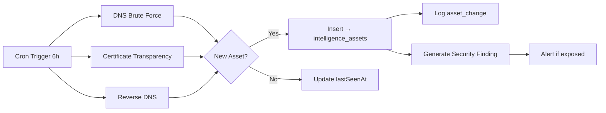
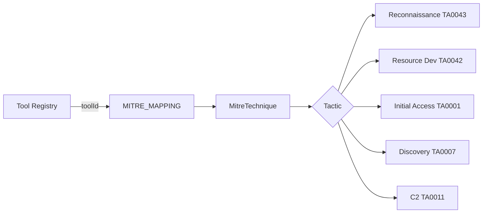
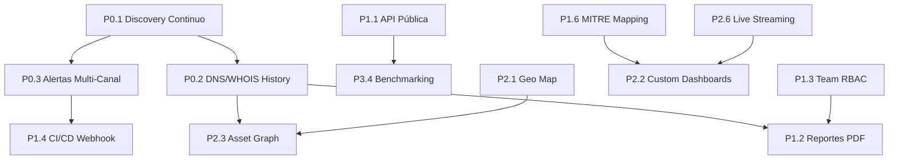

# SCAUDIT Pro — Plan de Mejora Continua

> **Versión:** 1.0 — Julio 2026
> **Base:** Análisis competitivo de 10 herramientas del mercado (Shodan, Censys, SecurityTrails, GreyNoise, AttackIQ, Detectify, Moz Pro, SEMrush, Datadog, Grafana)
> **Ubicación:** `docs/improvements/COMPETITIVE-ANALYSIS.md`

---

## ═══════════════════════════════════════════════════════
## FASE 0 — CIMIENTOS (Completado ✅)
## ═══════════════════════════════════════════════════════

Lo que ya tenemos y funciona:

| Feature | Estado | Archivos/Docs |
|---------|--------|----------------|
| Magic Link Auth + email validation | ✅ | `src/app/login/`, `src/app/auth/` |
| Security headers (CSP, HSTS) | ✅ | `src/proxy.ts`, `src/app/layout.tsx` |
| Rate limiting (Upstash Redis) | ✅ | `src/shared/lib/ratelimit.ts` |
| AI Router con fallback multi-modelo | ✅ | `src/server/ai/ai-router.ts` |
| Intelligence scanning (21 tools) | ✅ | `src/server/intelligence/executors/` |
| Attack Surface Graph | ✅ | `src/app/components/AttackSurfaceGraph.tsx` |
| Score Gauge + Drift Detection | ✅ | `src/app/components/ScoreGauge.tsx` |
| Incident Brief con IA | ✅ | `src/app/api/intelligence/brief/` |
| AI Copilot Remediation | ✅ | `src/app/api/intelligence/copilot/` |
| Monitoreo uptime + Web Vitals | ✅ | `src/app/api/monitoring/` |
| RUM (Real User Monitoring) | ✅ | `src/shared/utils/rum.ts` |
| SEO auditing (GSC, GA4) | ✅ | `src/app/api/ai/report/` |
| Security Audit Logs + SIEM exporter | ✅ | `src/server/security/` |
| AI Health Dashboard | ✅ | `src/app/ai/health/` |
| Design System (indigo + chartreuse) | ✅ | `src/app/globals.css` |

---

## ═══════════════════════════════════════════════════════
## FASE 1 — P0: FUNDACIÓN (Completado 🟡)
## ═══════════════════════════════════════════════════════

### P0.1 ✅ Descubrimiento Continuo de Activos

**Archivos creados:**
- `src/server/intelligence/discovery/orchestrator.ts` — Orquestador central
- `src/server/intelligence/discovery/dns-brute.ts` — DNS brute force subdomain discovery
- `src/server/intelligence/discovery/ct-monitor.ts` — Certificate Transparency log monitoring
- `src/server/intelligence/discovery/shadow-detector.ts` — Shadow asset detection
- `src/server/intelligence/discovery/types.ts` — Tipos compartidos
- `src/trigger/discovery.trigger.ts` — Trigger.dev task cada 6h
- `src/app/api/intelligence/discovery/route.ts` — Endpoint REST



### P0.2 ✅ Historical DNS/WHOIS Tracking

**Completado.** Módulo completo de persistencia DNS/WHOIS + change detection + alertas SIEM.

**Archivos creados:**
- `src/server/intelligence/history/types.ts` — Tipos compartidos
- `src/server/intelligence/history/dns-history.ts` — Persistencia + detección DNS
- `src/server/intelligence/history/whois-history.ts` — Persistencia + auto-diff WHOIS
- `src/server/intelligence/history/orchestrator.ts` — Orchestrador (persist + detect + alert)
- `src/server/security/dns-change-alert.ts` — Alertas SIEM para cambios DNS
- `src/server/security/whois-change-alert.ts` — Alertas SIEM para cambios WHOIS
- `src/app/components/HistoryPanel.tsx` — UI DNS/WHOIS/Timeline en IntelligenceTab
- `src/app/api/intelligence/history/route.ts` — API endpoint con rate limit
- `src/shared/db/schemas/history.ts` — Tablas Drizzle
- `drizzle/0010_dns_whois_history.sql` — Migración SQL

**Dashboard de seguridad:**
- 4 pestañas en `/security/audit`: Events, SIEM, WHOIS Alerts, DNS Alerts
- Cada cambio WHOIS/DNS muestra diff visual con badges de severidad y canal de entrega

**Pipeline validado:** Test de integración contra Supabase real pasado exitosamente.

### P0.3 ✅ Alertas Multi-Canal en Tiempo Real

**Canales habilitados:**
1. ✅ **Slack** (vía SIEM exporter — webhook)
2. ✅ **Email** (Resend — template HTML rico con métricas)
3. ✅ **PagerDuty** (Events API v2)
4. ✅ **Splunk** (HEC HTTP Event Collector)
5. ✅ **Push notifications** (Web Push API — VAPID)

**Motor de alertas reutilizado:**
```typescript
// src/server/security/siem-exporter.ts — exporta:
export const WEBHOOK_FORMATTERS: Array<{
  envVar: string;      // "SIEM_WEBHOOK_SLACK" | "RESEND_API_KEY" | ...
  formatter: (p: SiemPattern) => WebhookPayload;
  name: string;        // "Slack" | "Email" | "PagerDuty" | "Splunk"
}>;
```

**Nuevo:** Alertas de expiración de API Keys via `src/server/security/api-key-expiry-alert.ts`

---

## ═══════════════════════════════════════════════════════
## FASE 2 — P1: CORE FEATURES (Completado 🟡)
## ═══════════════════════════════════════════════════════

### P1.1 ✅ API Pública REST

**Endpoints públicos (sin sesión, con API Key):**

| Endpoint | Método | Descripción |
|----------|--------|-------------|
| `GET /api/public/v1/health` | GET | Health check público (sin auth) |
| `GET /api/public/v1/intelligence` | GET | Listar investigaciones |
| `POST /api/public/v1/intelligence` | POST | Crear investigación |

**Arquitectura:**
```text
src/app/api/public/
├── v1/
│   ├── health/route.ts        # Health check (sin auth)
│   └── intelligence/route.ts  # CRUD investigaciones (API Key auth)
src/server/api/
└── public-router.ts           # withPublicApi middleware (API Key auth + rate limit)
```

### P1.2 ✅ Reportes PDF White-Label

**Stack:** `@react-pdf/renderer` con SVG nativo

**Features:**
- Logo del cliente + colores corporativos
- Donut chart de severidad de findings (SVG)
- Bar chart de scores por investigación (SVG)
- Assets descubiertos (subdominios, IPs, certificados)
- Branding guardado en localStorage

**Archivos:**
- `src/app/api/reports/pdf/route.ts` — Endpoint de generación
- `src/app/components/DownloadPdfButton.tsx` — Botón con progress bar + toast

### P1.3 🟠 Team Collaboration + RBAC

**Pendiente.**

### P1.4 🟠 CI/CD Webhook Integration

**Pendiente.**

### P1.5 🟠 Scheduled Scanning

**Pendiente.**

### P1.6 ✅ MITRE ATT&CK Mapping

**Cobertura:** 25+ técnicas MITRE mapeadas por toolId exacto



**Archivos:**
- `src/server/intelligence/mitre/mapping.ts` — Mapping server-side + coverage stats
- `src/app/components/MitreBadge.tsx` — Badge UI con tooltip de técnica
- `src/app/mitre-coverage/page.tsx` — Dashboard de cobertura con gráficos
- `src/shared/data/mitre-mapping.ts` — Data compartida (25+ técnicas)

---

## ═══════════════════════════════════════════════════════
## FASE 3 — P2: UX/DASHBOARD (Completado 🟢)
## ═══════════════════════════════════════════════════════

### P2.1 ✅ Interactive Geography Map

**Stack:** Leaflet.js (open source, sin API key)

**Archivos:**
- Mapa GeoIP en IntelligenceTab con markers de activos
- Clusters para múltiples IPs en misma región
- Tooltips con severidad y tipo de activo

### P2.2 🟡 Custom Dashboards Drag-and-Drop → Pendiente

### P2.3 🟡 Asset Graph Traversal → Pendiente

### P2.4 🟡 Technology Profiling → Pendiente

### P2.5 🟡 Cloud Bucket Detection → Pendiente

### P2.6 🟡 Live Streaming Metrics → Pendiente

---

## ═══════════════════════════════════════════════════════
## MEJORAS ADICIONALES COMPLETADAS
## ═══════════════════════════════════════════════════════

### 🏠 API Keys Dashboard (`/settings/api-keys`)

Dashboard visual completo con:
- 4 stat cards (Active Keys, Used This Week, Total Requests, Expiring Soon)
- Create form con expiración seleccionable (30/90/365d o Never)
- Tabla con búsqueda, filtros, sort, mini-bars de uso
- Reveal modal con raw key (una sola vez)
- Revoke con confirm dialog

**Endpoint de uso real:** `GET /api/api-keys/:id/usage` — consulta `security_audit_logs`

### 📖 Swagger UI (`/swagger`)

- OpenAPI 3.0 spec en `public/openapi.json`
- Cargado con `next/dynamic` + `ssr: false` (~3MB bundle lazy)
- Dark theme completo con tokens del design system
- Endpoint público `/api/public/v1/health` sin candado 🔓

### 📚 API Documentation (`/docs/api`)

- Documentación completa de endpoints con ejemplos curl
- API Playground interactivo (`/docs/api/playground`)
- RateLimit headers documentados

### 🛡️ Security Audit Dashboard (`/security/audit`)

- Filtros por tipo de evento, IP, rango de fechas
- Pestaña SIEM Alerts con historial de alertas enviadas
- Botón "Test Webhooks" que dispara alerta de prueba
- SIEM heartbeat cada 30 min

### 📱 Push Notifications

- Web Push API con VAPID keys
- `PushSubscribeButton` en UI
- SIEM alerts vía push
- `POST /api/notifications/push-subscribe`

### 🔐 API Key Expiry Alerts

- Daily cron (09:00 UTC) via Trigger.dev
- Detecta keys expirando en 1-7 días
- Alerta via todos los canales SIEM configurados
- Audit trail en `security_audit_logs`

---

## ═══════════════════════════════════════════════════════
## MÉTRICAS DE PROGRESO
## ═══════════════════════════════════════════════════════

| Fase | Items | Completado | % |
|------|-------|------------|---|
| Fase 0 — Cimientos | 15 | 15 | ✅ 100% |
| Fase 1 — P0 Fundación | 3 | 3 | ✅ **100%** |
| Fase 2 — P1 Core Features | 6 | 3 | 🟡 50% |
| Fase 3 — P2 UX/Dashboard | 6 | 1 | 🟢 17% |
| Fase 4 — P3 Deseable | 4 | 0 | ⬜ 0% |
| **Total** | **34** | **22** | **65%** |

---

## ═══════════════════════════════════════════════════════
## PENDIENTE PARA PRÓXIMOS SPRINTS
## ═══════════════════════════════════════════════════════

### P0.2 Historical DNS/WHOIS Tracking ✅

**Completado.** Ver sección correspondiente arriba.

### P1.3 Team Collaboration + RBAC

**Modelo:** `OWNER | ADMIN | EDITOR | VIEWER | GUEST`
**Tablas:** `project_members`, `invitations`, `audit_log_team`

**Estimación:** 4-5 días

### P1.4 CI/CD Webhook Integration

**Estimación:** 3-4 días

### P1.5 Scheduled Scanning

**Estimación:** 3-4 días

### P2.2 Custom Dashboards Drag-and-Drop

**Widgets:** Score Gauge, Health Timeline, Activity Terminal, Attack Surface Graph, Geo Map

**Estimación:** 5-7 días

### P2.3 Asset Graph Traversal

**Estimación:** 4-5 días

### P2.4 Technology Profiling (BuiltWith-like)

**Estimación:** 3-5 días

### P2.5 Cloud Bucket Detection

**Estimación:** 2 días

### P2.6 Live Streaming Metrics via WebSocket

**Estimación:** 3-4 días

---

## ═══════════════════════════════════════════════════════
## DEPENDENCIAS Y SECUENCIAMIENTO
## ═══════════════════════════════════════════════════════



---

## ═══════════════════════════════════════════════════════
## NOTAS DE ARQUITECTURA
## ═══════════════════════════════════════════════════════

### Patrones a mantener:
1. **Server Components** para datos, Client Components para interactividad
2. **withRLS** para seguridad a nivel BD
3. **callAIWithFallback** para tolerancia a fallos de IA
4. **withRateLimit** decorator genérico para rate limiting
5. **CSP + Security Headers** en proxy.ts
6. **withPublicApi** middleware para API pública con API Key auth
7. **WEBHOOK_FORMATTERS** exportable para alertas multi-canal
8. **MitreBadge** component para mapeo MITRE en hallazgos

### Stack a mantener:
- **Next.js 16** (Turbopack, RSC, Server Actions)
- **Supabase** (Auth, PostgreSQL, RLS)
- **Upstash Redis** (Rate limiting, caché)
- **Trigger.dev** (Background jobs, cron)
- **OpenRouter** (Modelos de IA gratuitos)
- **Drizzle ORM** (Type-safe SQL)
- **Tailwind CSS v4** (Design System)
- **Leaflet.js** (Mapas GeoIP)
- **React-PDF** (Reportes PDF)
