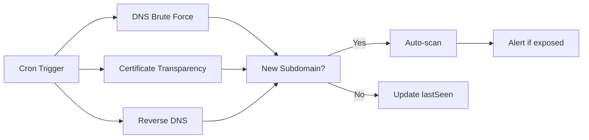
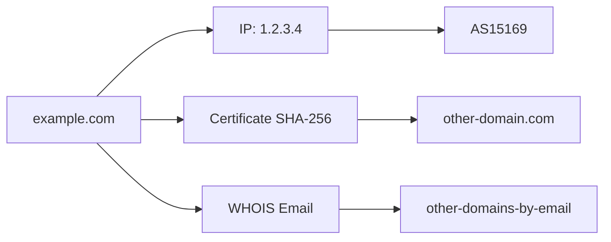
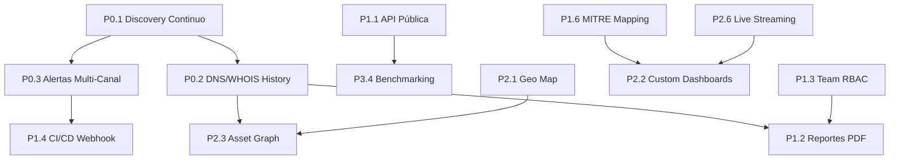
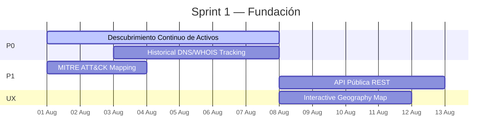

# SCAUDIT Pro — Plan de Mejora Continua

> **Versión:** 1.0 — Julio 2026
> **Base:** Análisis competitivo de 10 herramientas del mercado (Shodan, Censys, SecurityTrails, GreyNoise, AttackIQ, Detectify, Moz Pro, SEMrush, Datadog, Grafana)
> **Ubicación:** `docs/improvements/COMPETITIVE-ANALYSIS.md`

---

## ═══════════════════════════════════════════════════════
## FASE 0 — CIMIENTOS (Completado ✅)
## ═══════════════════════════════════════════════════════

Lo que ya tenemos y funciona:

| Feature | Estado | Archivos/Docs |
|---------|--------|----------------|
| Magic Link Auth + email validation | ✅ | `src/app/login/`, `src/app/auth/` |
| Security headers (CSP, HSTS) | ✅ | `src/proxy.ts`, `src/app/layout.tsx` |
| Rate limiting (Upstash Redis) | ✅ | `src/shared/lib/ratelimit.ts` |
| AI Router con fallback multi-modelo | ✅ | `src/server/ai/ai-router.ts` |
| Intelligence scanning (21 tools) | ✅ | `src/server/intelligence/executors/` |
| Attack Surface Graph | ✅ | `src/app/components/AttackSurfaceGraph.tsx` |
| Score Gauge + Drift Detection | ✅ | `src/app/components/ScoreGauge.tsx` |
| Incident Brief con IA | ✅ | `src/app/api/intelligence/brief/` |
| AI Copilot Remediation | ✅ | `src/app/api/intelligence/copilot/` |
| Monitoreo uptime + Web Vitals | ✅ | `src/app/api/monitoring/` |
| RUM (Real User Monitoring) | ✅ | `src/shared/utils/rum.ts` |
| SEO auditing (GSC, GA4) | ✅ | `src/app/api/ai/report/` |
| Security Audit Logs + SIEM exporter | ✅ | `src/server/security/` |
| AI Health Dashboard | ✅ | `src/app/ai/health/` |
| Design System (indigo + chartreuse) | ✅ | `src/app/globals.css` |

---

## ═══════════════════════════════════════════════════════
## FASE 1 — P0: FUNDACIÓN (Próximo Sprint)
## ═══════════════════════════════════════════════════════

### P0.1 🔴 Descubrimiento Continuo de Activos

**Inspiración:** Censys, Shodan Monitor, Detectify Shadow Assets  
**Impacto:** Crítico — detecta shadow IT, previene breach por activos olvidados



**Archivos a crear/modificar:**
- `src/server/intelligence/discovery/` (nuevo módulo)
- `src/trigger/discovery.trigger.ts` (nuevo)
- `src/app/api/intelligence/discovery/` (nuevo endpoint)
- `src/shared/db/schemas/intelligence.ts` — agregar tabla `discovered_assets`

**Estimación:** 5-7 días  
**Dependencias:** Trigger.dev, cron scheduling

### P0.2 🔴 Historical DNS/WHOIS Tracking

**Inspiración:** SecurityTrails Passive DNS  
**Impacto:** Forense, compliance, tracking de cambios en infraestructura

```typescript
// Tabla propuesta: dns_history
interface DnsHistoryEntry {
  id: string
  investigationId: string
  recordType: 'A' | 'AAAA' | 'MX' | 'TXT' | 'NS' | 'CNAME'
  query: string
  value: string
  firstSeen: Date
  lastSeen: Date
  changeCount: number
}

// Tabla propuesta: whois_history
interface WhoisHistoryEntry {
  id: string
  domain: string
  registrar: string
  createdDate: Date
  expiresDate: Date
  nameservers: string[]
  snapshotHash: string // hash del WHOIS completo para detectar cambios
  snapshotDate: Date
  diffSummary: string | null // cambios detectados vs snapshot anterior
}
```

**Archivos a crear:**
- `src/server/intelligence/history/` (nuevo módulo)
- Endpoint `GET /api/intelligence/history/:type/:target`
- UI de timeline comparativo en IntelligenceTab

**Estimación:** 4-5 días  
**Dependencias:** P0.1 (comparte motor de ejecución)

### P0.3 🔴 Alertas Multi-Canal en Tiempo Real

**Inspiración:** GreyNoise Alerts, Datadog Monitors, Shodan Monitor  
**Impacto:** Respuesta inmediata a cambios de seguridad

**Canales:**
1. ✅ Slack (vía SIEM exporter — ya existe en parte)
2. ❌ Email (SendGrid / Resend)
3. ❌ Webhook genérico (custom URL)
4. ❌ PagerDuty / Opsgenie
5. ❌ Notificaciones push en navegador

**Motor de alertas propuesto:**

```typescript
interface AlertRule {
  id: string
  projectId: string
  name: string
  condition: {
    metric: 'score_change' | 'new_asset' | 'cert_expiry' | 'tls_downgrade' | 'dns_change'
    threshold: number
    windowMinutes: number
    cooldownMinutes: number
  }
  channels: Array<{
    type: 'slack' | 'email' | 'webhook' | 'pagerduty' | 'push'
    config: Record<string, string>
  }>
  enabled: boolean
  lastFiredAt: Date | null
}
```

**Archivos a crear:**
- `src/server/alerting/engine.ts`
- `src/server/alerting/channels/` (cada canal como módulo)
- `src/app/api/alerting/rules/` (CRUD de reglas)
- UI en SettingsTab para configurar reglas

**Estimación:** 7-10 días  
**Dependencias:** P0.1 (genera eventos), P0.2 (detecta cambios)

---

## ═══════════════════════════════════════════════════════
## FASE 2 — P1: CORE FEATURES
## ═══════════════════════════════════════════════════════

### P1.1 🟠 API Pública REST

**Inspiración:** Shodan API, SecurityTrails API, GreyNoise API  
**Impacto:** Integraciones third-party, automatización, negocio API-as-a-Product

```typescript
// Endpoints propuestos
GET    /api/v1/intelligence/scan/:target     // Iniciar escaneo síncrono
GET    /api/v1/intelligence/investigations   // Listar investigaciones
GET    /api/v1/intelligence/investigations/:id  // Obtener detalles  
GET    /api/v1/intelligence/investigations/:id/findings  // Hallazgos
GET    /api/v1/projects                      // Listar proyectos
POST   /api/v1/projects                      // Crear proyecto
GET    /api/v1/health                        // Health check del sistema
```

**Arquitectura:**

```text
src/app/api/v1/
├── middleware/
│   ├── api-auth.ts          # API Key authentication
│   └── rate-limit.ts        # Rate limiting específico para API
├── intelligence/
│   ├── scan/route.ts
│   ├── investigations/route.ts
│   └── findings/route.ts
├── projects/
│   └── route.ts
├── openapi.json             # Documentación OpenAPI 3.0
└── health/route.ts
```

**Estimación:** 5-7 días  
**Dependencias:** `src/server/enterprise/api-auth.ts` (ya existe esqueleto)

### P1.2 🟠 Reportes PDF White-Label

**Inspiración:** Moz Pro, SEMrush, Datadog  
**Impacto:** Clientes enterprise, agencias que revenden el producto

**Características:**
- Marca personalizable (logo, colores, nombre de agencia)
- Seleccionar secciones incluidas
- Programación automática (semanal/mensual)
- Exportación en PDF y CSV
- Múltiples templates (ejecutivo, técnico, compliance)

**Archivos a crear/modificar:**
- `src/server/reports/generator.ts` — Motor de generación (PDFKit + HTML-to-PDF)
- `src/server/reports/templates/` — Templates markdown
- `src/app/api/reports/` — Endpoints CRUD + generación
- `src/app/components/ReportBuilder.tsx` — UI de configuración
- `src/trigger/report.trigger.ts` — Generación programada

**Estimación:** 6-8 días  
**Dependencias:** Sistema de branding en BD

### P1.3 🟠 Team Collaboration + RBAC

**Inspiración:** Censys Collections, Detectify Teams  
**Impacto:** Equipos multi-usuario, agencias, enterprise

**Modelo:**

```typescript
enum Role {
  OWNER = 'owner',       // Dueño del proyecto (facturación)
  ADMIN = 'admin',       // Admin (invitar, remover miembros)
  EDITOR = 'editor',     // Puede ejecutar escaneos, ver todo
  VIEWER = 'viewer',     // Solo lectura
  GUEST = 'guest'        // Solo reportes compartidos
}
```

**Tablas propuestas:**
- `project_members` — (projectId, userId, role, invitedBy, joinedAt)
- `invitations` — (email, projectId, role, token, expiresAt)
- `audit_log_team` — (projectId, userId, action, target, timestamp)

**Estimación:** 4-5 días  
**Dependencias:** Supabase Auth (ya integrado)

### P1.4 🟠 CI/CD Webhook Integration

**Inspiración:** Detectify GitHub/GitLab integration  
**Impacto:** Shift-left security, DevSecOps, escaneo automático en cada deploy

**Flujo:**
```text
1. Usuario configura webhook en GitHub → apunta a /api/webhooks/github
2. En cada push/PR, GitHub envía payload
3. SCAUDIT detecta el dominio del repositorio
4. Inicia escaneo inteligente automático
5. Crea un check en el PR con resultados
```

**Archivos a crear:**
- `src/app/api/webhooks/github/route.ts` — Handler GitHub
- `src/app/api/webhooks/gitlab/route.ts` — Handler GitLab
- UI en SettingsTab para configurar webhooks

**Estimación:** 3-4 días  
**Dependencias:** `src/app/api/webhooks/route.ts` (ya existe esqueleto)

### P1.5 🟠 Scheduled Scanning

**Inspiración:** Moz Pro, Detectify  
**Impacto:** Auditorías recurrentes automáticas sin intervención manual

```typescript
interface ScanSchedule {
  id: string
  projectId: string
  frequency: 'daily' | 'weekly' | 'monthly' | 'custom'
  cronExpression: string | null
  target: string
  tools: string[]  // qué tools ejecutar
  notifyOnComplete: boolean
  lastRunAt: Date | null
  nextRunAt: Date
  enabled: boolean
}
```

**UI:** Calendario de próximos escaneos, historial de ejecuciones programadas

**Estimación:** 3-4 días  
**Dependencias:** Trigger.dev (ya configurado)

### P1.6 🟠 MITRE ATT&CK Mapping

**Inspiración:** AttackIQ, GreyNoise CVE Tags  
**Impacto:** Framework estándar de ciberseguridad, compliance

**Archivo de mapping:**
```typescript
// src/server/intelligence/mitre/mapping.ts
const mitreMapping: Record<string, MitreTechnique> = {
  'dns.zoneTransfer': {
    techniqueId: 'T1583.001',
    techniqueName: 'DNS Zone Transfer',
    tactic: 'Initial Access',
    description: '...'
  },
  'tls.weakCipher': {
    techniqueId: 'T1573.002',
    techniqueName: 'Encrypted Channel / Asymmetric',
    tactic: 'Command and Control',
    description: '...'
  }
  // ... 20+ mappings
}
```

**UI:** Badge MITRE en cada hallazgo, tabla de cobertura ATT&CK

**Estimación:** 2-3 días  
**Dependencias:** Ninguna significativa

---

## ═══════════════════════════════════════════════════════
## FASE 3 — P2: UX/DASHBOARD
## ═══════════════════════════════════════════════════════

### P2.1 🟡 Interactive Geography Map

**Inspiración:** Shodan Geo Map, Censys IP Map  
**Impacto:** Visualización GeoIP inmediata de activos

**Stack:** Leaflet.js (open source, sin API key) o Mapbox GL

```tsx
// Componente propuesto: GeoMap.tsx
<GeoMap
  points={assets.map(a => ({
    lat: a.metadata?.asnGeo?.latitude,
    lng: a.metadata?.asnGeo?.longitude,
    label: a.value,
    severity: a.severity,
    type: a.assetType
  }))}
  heatmap={true}
  interactive={true}
/>
```

**Estimación:** 3-4 días

### P2.2 🟡 Custom Dashboards Drag-and-Drop

**Inspiración:** Grafana, Datadog  
**Impacto:** UX personalizable por usuario

**Widgets disponibles:**
- Score Gauge
- Health Timeline (chart)
- Activity Terminal
- Attack Surface Graph
- Geo Map
- Quick Stats (KPI cards)
- Alerts Feed
- MITRE ATT&CK Coverage

**Tecnología:** `react-grid-layout` o `dnd-kit` + `zustand` para persistencia

**Estimación:** 5-7 días  
**Dependencias:** Ninguna

### P2.3 🟡 Asset Graph Traversal

**Inspiración:** Censys Asset Graph  
**Impacto:** Navegación entre dominios ⇄ IPs ⇄ certificados ⇄ emails WHOIS



**UI:** Gráfico interactivo con d3-force o cytoscape.js, click para hacer zoom-in

**Estimación:** 4-5 días

### P2.4 🟡 Technology Profiling (BuiltWith-like)

**Inspiración:** BuiltWith, Wappalyzer  
**Impacto:** Perfil tecnológico de cualquier sitio, detección de stack

**Tecnologías a detectar:**
- CMS (WordPress, Shopify, Drupal, etc.)
- CDN (Cloudflare, Akamai, Fastly)
- Analytics (GA4, Meta Pixel, Hotjar, etc.)
- Frameworks JS (React, Vue, Angular)
- Hosting providers (AWS, Vercel, Netlify)
- Email providers (Google Workspace, Office 365)

**Archivos a crear:**
- `src/server/intelligence/profiler/` — Fingerprinting de tecnologías
- Utilizar `Wappalyzer` como engine open-source o implementar regex matching

**Estimación:** 3-5 días

### P2.5 🟡 Cloud Bucket Detection

**Inspiración:** Censys Cloud Detection  
**Impacto:** Detectar S3, GCS, Azure Blob Storage expuestos

**Check automático en cada escaneo:**
```typescript
// Por cada subdominio encontrado
const bucketChecks = [
  { provider: 'AWS S3', pattern: /\.s3\.amazonaws\.com$/ },
  { provider: 'GCS', pattern: /\.storage\.googleapis\.com$/ },
  { provider: 'Azure Blob', pattern: /\.blob\.core\.windows\.net$/ },
  { provider: 'DigitalOcean Spaces', pattern: /\.digitaloceanspaces\.com$/ },
]
```

**Estimación:** 2 días

### P2.6 🟡 Live Streaming Metrics via WebSocket

**Inspiración:** Datadog Live Dashboard  
**Impacto:** Observabilidad en tiempo real sin polling

**Stack:** WebSocket nativo o Server-Sent Events (más simple)

```typescript
// Endpoint SSE
GET /api/monitoring/stream?projectId=xxx
→ Evento cada 2-5s con métricas actualizadas
→ Tipos: uptime, latency, LCP, error rate, active users
```

**UI:** Gráficos que se actualizan en vivo con animaciones suaves

**Estimación:** 3-4 días  
**Dependencias:** WebSocket/SSE en Vercel (Edge Functions?)

---

## ═══════════════════════════════════════════════════════
## FASE 4 — P3: DESEABLE
## ═══════════════════════════════════════════════════════

### P3.1 🟢 Mobile App / PWA

**Stack:** Next.js ya es responsive parcialmente. Mejorar:
- Navegación mobile-first
- Push notifications
- Offline support con Service Workers
- Add-to-Homescreen

### P3.2 🟢 Anomaly Detection ML

**Técnica:** Detección de anomalías basada en ventana deslizante (media móvil + desviación estándar)

```typescript
// Algoritmo propuesto: Simple Moving Average + 3-sigma
function detectAnomaly(
  currentValue: number,
  historicalValues: number[]
): { isAnomaly: boolean; severity: 'low' | 'medium' | 'high' } {
  const avg = historicalValues.reduce((a, b) => a + b, 0) / historicalValues.length
  const stdDev = Math.sqrt(
    historicalValues.reduce((sq, n) => sq + Math.pow(n - avg, 2), 0) / historicalValues.length
  )
  const deviation = Math.abs(currentValue - avg)
  
  if (deviation > 3 * stdDev) return { isAnomaly: true, severity: 'high' }
  if (deviation > 2 * stdDev) return { isAnomaly: true, severity: 'medium' }
  if (deviation > 1.5 * stdDev) return { isAnomaly: true, severity: 'low' }
  return { isAnomaly: false, severity: 'low' }
}
```

### P3.3 🟢 Multi-Language (INGLÉS Primero)

**Estrategia:** i18n con `next-intl`
- Fase 1: EN (traducir todas las strings de UI)
- Fase 2: PT-BR
- Fase 3: FR, DE

### P3.4 🟢 Benchmarking Dashboard

**Métrica:** "How does your score compare to industry average?"

```typescript
interface Benchmark {
  industry: 'ecommerce' | 'saas' | 'finance' | 'healthcare' | 'media'
  avgScore: number
  avgLatencyMs: number
  avgUptimePct: number
  percentile: number // posición del usuario vs. industria
}
```

---

## ═══════════════════════════════════════════════════════
## MÉTRICAS DE PROGRESO
## ═══════════════════════════════════════════════════════

Usaremos esta tabla para trackear avance:

| Fase | Items | Completado | % |
|------|-------|------------|---|
| Fase 0 — Cimientos | 15 | 15 | ✅ 100% |
| Fase 1 — P0 Fundación | 3 | 0 | ⬜ 0% |
| Fase 2 — P1 Core Features | 6 | 0 | ⬜ 0% |
| Fase 3 — P2 UX/Dashboard | 6 | 0 | ⬜ 0% |
| Fase 4 — P3 Deseable | 4 | 0 | ⬜ 0% |
| **Total** | **34** | **15** | **44%** |

---

## ═══════════════════════════════════════════════════════
## DEPENDENCIAS Y SECUENCIAMIENTO
## ═══════════════════════════════════════════════════════



---

## ═══════════════════════════════════════════════════════
## SIGUIENTE SPRINT SUGERIDO
## ═══════════════════════════════════════════════════════

**Prioridad:** P0.1 + P0.2 + P1.6 (MITRE mapping es rápido y da valor inmediato)



---

## ═══════════════════════════════════════════════════════
## NOTAS DE ARQUITECTURA
## ═══════════════════════════════════════════════════════

### Patrones a mantener:
1. **Server Components** para datos, Client Components para interactividad
2. **withRLS** para seguridad a nivel BD
3. **callAIWithFallback** para tolerancia a fallos de IA
4. **Rate limiting** con Upstash Redis en todas las rutas
5. **CSP + Security Headers** en proxy.ts

### Patrones a mejorar:
1. **WebSockets/SSE** para datos en vivo (actualmente usa polling REST)
2. **Background jobs** via Trigger.dev para escaneos largos
3. **Caché de resultados** con Redis para escaneos repetidos
4. **Streaming de respuestas** de IA para UX más rápida

### Stack a mantener:
- **Next.js 16** (Turbopack, RSC, Server Actions)
- **Supabase** (Auth, PostgreSQL, RLS)
- **Upstash Redis** (Rate limiting, caché)
- **Trigger.dev** (Background jobs, cron)
- **OpenRouter** (Modelos de IA gratuitos)
- **Drizzle ORM** (Type-safe SQL)
- **Tailwind CSS v4** (Design System)
