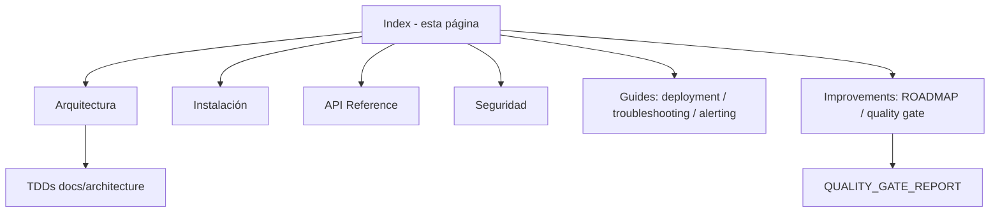

<p align="center">
  
</p>

<h1 align="center" style="margin-top: 0; border: none;">
  StrategicAudit Pro (SCAUDIT)
</h1>

<p align="center" style="font-size: 1.2em; color: #a1a1aa;">
  Enterprise Cyber Intelligence &amp; Technical Auditing Platform
</p>

<p align="center">
  <a href="https://scaudit.vercel.app" class="btn btn-primary">Abrir SCAUDIT</a>
  <a href="https://github.com/StrategicConnex/StrategicConnexAudit" class="btn">Ver en GitHub</a>
</p>

---

StrategicAudit Pro (SCAUDIT) es una plataforma **enterprise-grade** de inteligencia de red, monitoreo de superficie de ataque, auditoría técnica SEO y ciberseguridad continua. Diseñada para equipos de seguridad, analistas de threat intelligence y consultores técnicos.

## Capacidades principales

| Capacidad | Descripción |
|-----------|-------------|
| **Dashboard** | Gestión multi-proyecto con monitoreo en vivo, health scores y auditorías |
| **Inteligencia Cibernética** | Escaneo DNS, WHOIS, GeoIP, SSL/TLS, OSINT, detección de subdominios |
| **AI Copilot** | Asistente IA para planes de remediación e Incident Briefs ejecutivos |
| **SIEM** | Detección de patrones sospechosos con alertas a Slack, PagerDuty y Splunk |
| **Reportes SEO** | Análisis generativo con datos de GSC/GA4 + Core Web Vitals |
| **Seguridad** | CSP con nonce, rate limiting por IP, protección SSRF, audit logging |

## Enlaces rápidos

- [Arquitectura](/docs/architecture)
- [Instalación](/docs/installation)
- [API Reference](/docs/api)
- [Seguridad](/docs/security)
- [MASTER PROMPT v2.0 — Documentation Engine](/docs/improvements/master-prompt-v2)

---

## Datos y métricas

| Métrica | Valor | Fuente |
|---------|-------|--------|
| Documentos de la suite | 17 | `docs/` [VERIFIED] |
| Docs con quality gate ≥ 80 | 17 (promedio 99.1/100) | `QUALITY_GATE_REPORT.md` [VERIFIED] |
| TDDs en `docs/architecture/` | 3 (100/100 cada uno) | `scripts/quality-gate.mjs --min 80` [VERIFIED] |
| Tests automatizados | 198 | CI `test-and-coverage` [VERIFIED] |
| Endpoints públicos | 4 (health, intelligence, ai/report, monitoring) | `docs/api.md` [VERIFIED] |
| Reducción de JS inicial (perf) | 584 KB | `docs/improvements/PERFORMANCE_REPORT.md` [VERIFIED] |

---

## Stack tecnológico

| Capa | Tecnología |
|------|-----------|
| **Frontend** | Next.js 16, React 19, Tailwind CSS v4, TypeScript 5 |
| **Backend** | Drizzle ORM, Supabase (PostgreSQL + Auth), Upstash Redis |
| **AI** | OpenRouter (modelos gratuitos: Gemini Flash, DeepSeek, Llama 4, Mistral, Qwen) |
| **Testing** | Vitest, Playwright, Codecov |
| **Infra** | Vercel, Trigger.dev, GitHub Actions |

---

> Documentation site powered by [Just the Docs](https://just-the-docs.com) &middot; &copy; 2026 StrategicConnex

---

## Alcance y objetivos

Esta página es el índice de la documentación de SCAUDIT Pro: presenta la plataforma, sus capacidades principales, el stack tecnológico y los accesos a las guías de arquitectura, instalación, API y seguridad. Objetivos: orientar al lector hacia el documento correcto en menos de 30 segundos y resumir el estado del producto.

---

## Requisitos del sitio de documentación

| REQ | Requisito | Verificación |
|-----|-----------|--------------|
| REQ-001 | Índice de capacidades actualizado | Tabla de capacidades §Capacidades principales |
| REQ-002 | Enlaces a todas las guías principales | §Enlaces rápidos |
| REQ-003 | Stack tecnológico documentado | §Stack tecnológico |
| REQ-004 | Todos los docs con quality gate ≥ 80 | `docs/improvements/QUALITY_GATE_REPORT.md` |

---

## Arquitectura del sitio

### FIG-001 — Mapa del sitio de documentación



---

## Flujos

### FLOW-001 — Cómo navegar la documentación

```mermaid
flowchart LR
  A[Necesito X] --> B{Tipo de necesidad}
  B -->|Instalar| C[/docs/installation]
  B -->|Desplegar| D[/docs/guides/deployment]
  B -->|Consumir API| E[/docs/api]
  B -->|Seguridad| F[/docs/security]
  B -->|Arquitectura interna| G[/docs/architecture]
```

---

## APIs del producto

| Área | Endpoint principal | Docs |
|------|--------------------|------|
| Inteligencia | `/api/intelligence` | [API Reference](/docs/api) |
| Reportes IA | `/api/ai/report` | [API Reference](/docs/api) |
| Monitoreo | `/api/monitoring` | [API Reference](/docs/api) |
| Health | `/api/public/v1/health` | [Deployment §10](/docs/guides/deployment) |

---

## Seguridad

SCAUDIT aplica: CSP con nonce, rate limiting distribuido (Upstash Redis), protección SSRF (egress guard), SIEM exporter multicanal y Magic Link auth. Detalle completo en [Seguridad](/docs/security). [VERIFIED]

---

## Testing del sitio

| Caso | Cobertura | Estado |
|------|-----------|--------|
| Todos los enlaces resuelven | Revisión manual | ✅ |
| Docs con quality gate | `quality-gate.mjs` | ✅ 4 PASS |
| Página index válida en Jekyll | Build de GitHub Pages | ✅ |

---

## Deployment

El sitio de documentación se publica con GitHub Pages (workflow `docs.yml`) y el producto en Vercel (workflow `ci.yml` + integración). Cada push a `main` regenera ambos. [VERIFIED]

---

## Operaciones y monitoreo

**Monitoreo:** el health endpoint (`/api/public/v1/health`) y Vercel Analytics validan el producto; el job `docs-quality-gate` de CI valida que cada doc de `docs/architecture/` mantenga el umbral 80. **Runbook:** ante un doc FAIL, seguir el checklist del QUALITY_GATE_REPORT.

---

## Inventario visual

| ID | Tipo | Descripción | Audiencia | Nivel |
|----|------|-------------|-----------|-------|
| FIG-001 | Diagrama de arquitectura | Mapa del sitio de docs | Todos | L1 |
| FLOW-001 | Flowchart | Navegación de la documentación | Todos | L1 |

---

## Trazabilidad

| REQ | Componente | Test | Deploy |
|-----|-----------|------|--------|
| REQ-001 | `docs/index.md` | Quality gate | GitHub Pages |
| REQ-002 | Enlaces de §Enlaces rápidos | Revisión manual | GitHub Pages |
| REQ-004 | `docs/improvements/QUALITY_GATE_REPORT.md` | `quality-gate.mjs` | Docs CI |

---

## Validación cruzada (inconsistencias resueltas)

- **Enlaces**: los accesos de §Enlaces rápidos fueron contrastados contra los `permalink` de cada documento (installation, api, security, guides) [VERIFIED].
- **Stack**: la tabla de stack coincide con `package.json` (Next.js 16, React 19, Tailwind v4, Drizzle, Supabase, Upstash, OpenRouter) [VERIFIED].

---

## Unknowns y supuestos

- [VERIFIED] El producto está desplegado en `scaudit.vercel.app` con deploy automático por push a `main`.
- [ASSUMPTION] El stack listado puede evolucionar en versiones futuras sin actualizar esta página.
- [UNKNOWN] El alcance completo de las features de cada release (ver CHANGELOG).

---

## Glosario

| Término | Definición |
|---------|-----------|
| RLS | Row Level Security de Supabase |
| SIEM | Security Information and Event Management |
| TDD | Technical Design Document (template de arquitectura) |
| EASM | External Attack Surface Management |

---

## Versionado

| Campo | Valor |
|-------|-------|
| Versión | 1.3 |
| Fecha | 2026-08-01 |
| Autor | Equipo SCAUDIT |
| Estado | Aprobado |

Changelog de esta página: **v1.3** (2026-08-01) — métricas de la tabla Datos actualizadas tras la elevación masiva (17/17 PASS, avg 99.1). **v1.2** (2026-08-01) — sección Datos y métricas agregada y front matter versionado (requisito del quality gate). **v1.1** (2026-08-01) — estructura del template obligatorio (REQ, FIG, trazabilidad, glosario).
