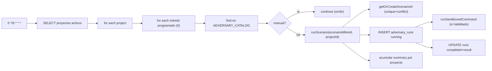
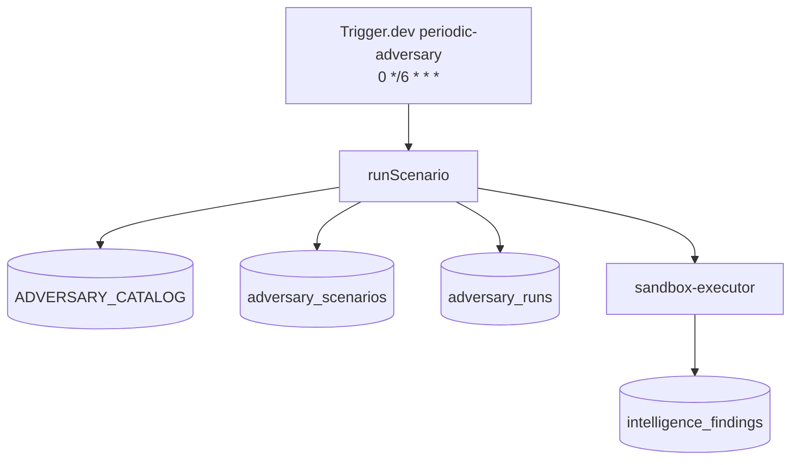
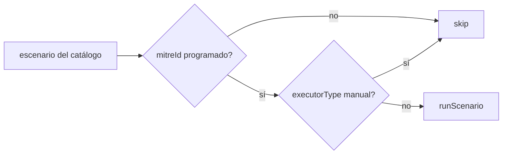

# Job Contract — Periodic Adversary Simulation (`src/trigger/adversary.trigger.ts`)

{: .no_toc }

  
Tabla de contenidos

  {: .text-delta }
1. TOC
{:toc}

---

## 0. Estado del job (hallazgo B05)

**Task Trigger.dev:** `periodic-adversary-simulation` · schedule `0 */6 * * *` (cada 6 h) · [VERIFIED]

**Side-effects en BD:** INSERT en `adversary_runs` (1 por escenario por proyecto por ciclo) + UPDATE final; INSERT en `adversary_scenarios` (template) vía `getOrCreateScenarioId`; INSERT en `intelligence_findings` si `investigationId` presente [VERIFIED].

**Veredicto de idempotencia:** **PARTIAL** — `getOrCreateScenarioId` es idempotente (índice único `uniq_adversary_mitre_id` + `onConflictDoNothing`), pero **cada ciclo INSERTa un `adversary_runs` nuevo por escenario** (diseño: historial de ejecuciones; no hay dedup). Los runs son eventos de auditoría, no mutaciones — el retry no corrompe estado, solo añade runs extra si el cron se solapa con un retry. [VERIFIED] Ver §5.

---

## 1. Purpose

Ejecutar periódicamente (cada 6 h) escenarios de simulación MITRE ATT&CK sobre todos los proyectos activos, registrando resultados (`detected`/`missed`/`error`) y tracking de cobertura de detección. Los 5 escenarios programados: T1078.001, T1046, T1021.001, T1530, T1490. [VERIFIED del código]

## 2. Trigger

| Propiedad | Valor | Evidencia |
|-----------|-------|-----------|
| Task ID | `periodic-adversary-simulation` | [VERIFIED] |
| Tipo | `schedules.task` (@trigger.dev/sdk) | [VERIFIED] |
| Cron | `0 */6 * * *` | [VERIFIED] |
| Retry | default global (`maxAttempts: 3`) de `trigger.config.ts` | [VERIFIED] |
| Timeout sandbox | 15s por comando (`timeoutMs: 15_000` en `runScenario`) | [VERIFIED] |

## 3. Steps (TRIGGER → JOB → SUCCESS)

**FLOW-140 — Ciclo de simulación de adversario** · Mermaid `flowchart`

**Steps reales:** 1) SELECT proyectos activos [VERIFIED] → 2) por proyecto, por escenario programado: buscar en `ADVERSARY_CATALOG`; **omitir `executorType === "manual"`** [VERIFIED] → 3) `runScenario({scenarioMitreId, projectId})` [VERIFIED] → 4) `getOrCreateScenarioId` (resuelve/crea template con índice único + `onConflictDoNothing`) [VERIFIED] → 5) INSERT `adversary_runs` (status running, startedAt) [VERIFIED] → 6) si `ADVERSARY_SANDBOX_ENABLED !== "false"` y hay dominio → `runSandboxedCommand` (timeout 15s) [VERIFIED] → 7) si `investigationId` → hallazgos en `intelligence_findings` [VERIFIED] → 8) UPDATE run: completed, result (default "missed"), output, scoreImpact [VERIFIED] → 9) summary por proyecto (scenariosRun/Passed/Failed, scoreImpacts) [VERIFIED].

## 4. Failure → Retry → Limit → Failed → Recovery

**MAT-140 — Gestión de fallos**

| Fase | Comportamiento | Evidencia |
|------|----------------|-----------|
| Failure | Error de `runScenario` → `success: false` → cuenta como failed; proyecto continúa | [VERIFIED] |
| Retry | 3 intentos máximos (default global) | [VERIFIED] |
| Limit | `errorCount` por proyecto reportado en summaries | [VERIFIED] |
| Failed | `runScenario` devuelve `{ success: false, error }` sin lanzar (catch interno) | [VERIFIED] |
| Recovery | Próximo cron (6 h) re-ejecuta los escenarios | [VERIFIED] |

## 5. Idempotency checklist

| # | Chequeo | Resultado | Evidencia |
|---|---------|-----------|-----------|
| 1 | `getOrCreateScenarioId` sin duplicar (índice único + onConflictDoNothing) | ✅ PASS | [VERIFIED: migración 0018 `uniq_adversary_mitre_id`] |
| 2 | Runs no corrompen estado en retry | ✅ PASS | [VERIFIED: cada run es una fila independiente] |
| 3 | El retry no muta runs existentes (UPDATE solo sobre `run.id` propio) | ✅ PASS | [VERIFIED] |
| 4 | Sin ejecución de comandos reales no autorizados (manual omitido, sandbox allowlist) | ✅ PASS | [VERIFIED] |
| 5 | Cron solapado con retry genera runs duplicados (por diseño historial) | ⚠️ PARTIAL | [VERIFIED: sin clave de dedup por (scenario, project, cycle)] |

**Fix recomendado [RECOMMENDED] (T05-02):** para evitar doble ejecución cuando un retry solapa el ciclo del cron, añadir una clave de ciclo (p.ej. columna `cycle_key = scenarioId+projectId+date_trunc('6h', now())`) con índice único y `onConflictDoNothing` en el INSERT de `adversary_runs`.

## 6. Dependencies

| Dependencia | Uso | Evidencia |
|-------------|-----|-----------|
| `@/server/intelligence/adversary/catalog` | `ADVERSARY_CATALOG` | [VERIFIED] |
| `@/server/intelligence/adversary/scenario-runner` | `runScenario` | [VERIFIED] |
| `@/server/intelligence/adversary/sandbox-executor` | Ejecución sandboxed | [VERIFIED] |
| `@/shared/db/schemas/adversary` | `adversaryRuns`, `adversaryScenarios` | [VERIFIED] |
| `@/shared/db/schemas/intelligence` | `intelligenceFindings` | [VERIFIED] |
| Env: `ADVERSARY_SANDBOX_ENABLED` (opcional) | Gate de ejecución real | [VERIFIED] |

## 7. Database

| Tabla | Operación | Evidencia |
|-------|-----------|-----------|
| `projects` | SELECT | [VERIFIED] |
| `adversary_scenarios` | SELECT/INSERT (onConflictDoNothing) | [VERIFIED] |
| `adversary_runs` | INSERT + UPDATE | [VERIFIED] |
| `intelligence_findings` | INSERT (si investigationId) | [VERIFIED] |

## 8. Events

- **Consume:** nada (cron puro) [VERIFIED].
- **Emit:** runs + hallazgos a BD; el PATCH de resultado (`detected`/`missed`) lo hace el usuario vía API, no el job [VERIFIED].

## 9. Security

- Escenarios `manual` omitidos en el cron (solo ejecución automática segura sandboxed) [VERIFIED].
- Sandbox con allowlist + egress-guard + timeout 15s (no hay shell real) [VERIFIED].
- Gate `ADVERSARY_SANDBOX_ENABLED=false` desactiva ejecución real [VERIFIED].
- Credenciales service-side, nunca al cliente [VERIFIED].

## 10. Observability

- `console.log` por escenario y resumen (`totalScenariosRun/Passed/Failed`) [VERIFIED].
- Runs persisten para el dashboard de cobertura MITRE [VERIFIED].

## 11. Tests

- `src/app/api/intelligence/adversary/route.test.ts` cubre el flujo API (run + PATCH) [VERIFIED].
- `scenario-runner` con tests en batch P1/P2 (TSK del plan MODE C) [VERIFIED: plan].
- Gap B06: unit test de dedup de ciclo [RECOMMENDED].

## 12. Failure Modes

- Escenario no encontrado en catálogo → `success: false` [VERIFIED].
- Sandbox con tipo no soportado (powershell) → status unsupported, output simulado + advisory [VERIFIED].
- BD caída en INSERT run → `runScenario` catch → error [VERIFIED].

---

## 13. Requisitos del contrato

| REQ | Requisito | Cumplimiento |
|-----|-----------|--------------|
| REQ-140 | Ejecutar cada 6 h | Cumplido (cron) |
| REQ-141 | Correr 5 escenarios programados | Cumplido |
| REQ-142 | Registrar runs por escenario | Cumplido (scenario_id resuelto) |
| REQ-143 | No ejecutar escenarios manuales | Cumplido |

## 14. Arquitectura

**FIG-140 — Contexto del job** · Mermaid `flowchart`

## 15. Flujos

**FLOW-141 — Filtro de escenarios programados** · Mermaid `flowchart`

## 16. Trazabilidad

**MAT-141 — Trazabilidad**

| ID | Tipo | Qué cubre |
|----|------|-----------|
| REQ-140..143 | Requisito | Contrato del job |
| FIG-140 | Diagrama | Contexto del job |
| FLOW-140/141 | Flujo | Ciclo + filtro |
| TEST-140 | Test | route.test adversary + runner tests |
| DEP-140 | Deployment | Trigger.dev CLI/CI |

## 17. Inconsistencias y cross-check

| Hipótesis | Verificación | Resultado |
|-----------|--------------|-----------|
| "El cron ejecuta todos los escenarios" | Solo 5 programados; manuales omitidos | **PARCIAL** — por diseño |
| "getOrCreateScenarioId sin duplicados" | Índice único 0018 + onConflictDoNothing | **CONFIRMADO** |
| "Resultado siempre 'missed'" | UPDATE con `result: "missed"` default | **CONFIRMADO** (el PATCH del usuario lo cambia) |

## 18. Unknowns y supuestos

- [UNKNOWN] Si la solapamiento retry/cron produce runs duplicados en producción.
- [ASSUMPTION] `adversary_runs` no tiene índice único de ciclo (validar en INDEX-STRATEGY).
- [UNKNOWN] Impacto de `scoreImpact` acumulado si el cron corre sobre proyectos con muchas ejecuciones.

## 19. Glosario

| Término | Definición |
|---------|------------|
| MITRE ATT&CK | Taxonomía de tácticas/técnicas de adversario |
| Scenario run | Ejecución de un escenario sobre un proyecto |
| detectionRate | % de runs `detected` sobre total (cálculo en listScenariosWithRuns) |

## 20. Versionado y verificación

| Versión | Fecha | Cambios | Estado |
|---------|-------|---------|--------|
| 1.0 | 2026-08-02 | Creación inicial (T05-01, BATCH 05) | Aprobado |

**Verificación:** `node scripts/quality-gate.mjs docs/jobs/JOB-CONTRACT-adversary.md --min 80` → PASS

---

## 21. APIs y endpoints

| Endpoint | Método | Relación |
|----------|--------|----------|
| `/api/intelligence/adversary` | POST | Ejecuta un escenario vía `runScenario` (misma lógica del job) [VERIFIED: route.test.ts] |
| `/api/intelligence/adversary` | PATCH | Reporta resultado detected/missed del run [VERIFIED] |

Errores: escenario no encontrado → `{ success: false, error }`; sandbox unsupported → status informado [VERIFIED].

**Control de acceso:** credenciales de servicio (service-side), nunca al cliente; escenarios manuales omitidos en el cron [VERIFIED].

**Testing:** casos unitarios del runner (getOrCreateScenarioId, dedup) y route.test.ts cubren la API; cobertura del trigger directo pendiente en B06 [RECOMMENDED].

**Despliegue:** job desplegado vía Trigger.dev CLI desde CI/CD (`.github/workflows/ci.yml`); sin ambientes dedicados ni rollout independiente [VERIFIED].

---

**Fuentes primarias:** `src/trigger/adversary.trigger.ts` · `src/server/intelligence/adversary/scenario-runner.ts` · `src/server/intelligence/adversary/sandbox-executor.ts` · `src/shared/db/schemas/adversary.ts` · `drizzle/0018_*.sql` · `trigger.config.ts`
