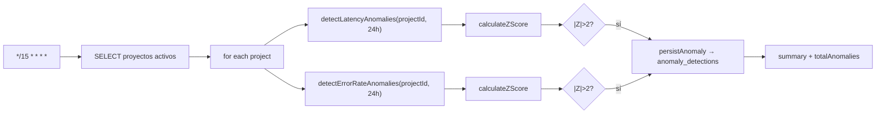
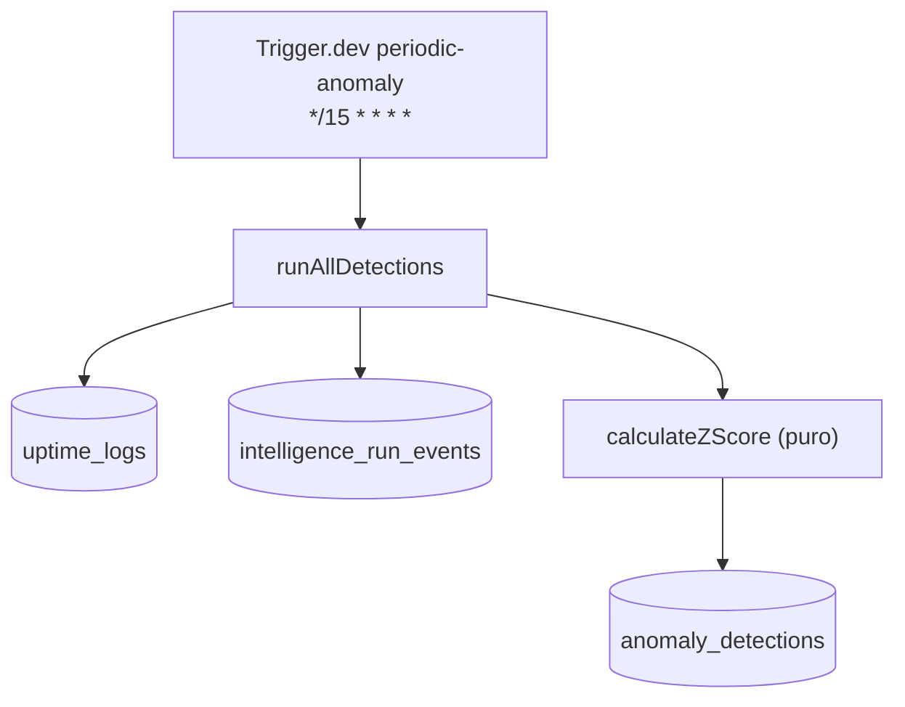
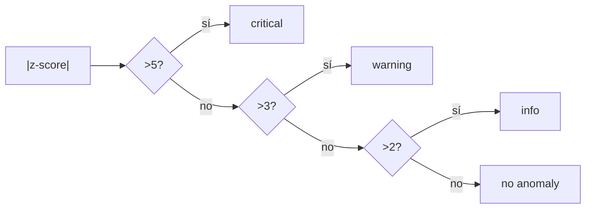

# Job Contract — Periodic Anomaly Detection (`src/trigger/anomaly.trigger.ts`)

{: .no_toc }

  
Tabla de contenidos

  {: .text-delta }
1. TOC
{:toc}

---

## 0. Estado del job (hallazgo B05)

**Task Trigger.dev:** `periodic-anomaly-detection` · schedule `*/15 * * * *` (cada 15 min) · [VERIFIED]

**Side-effects en BD:** SELECT sobre `uptime_logs` e `intelligence_run_events`; INSERT en `anomaly_detections` solo si hay anomalía persistida [VERIFIED].

**Veredicto de idempotencia:** **PARTIAL** — la detección es determinista sobre la ventana (mismo input → mismo z-score, PASS), y `persistAnomaly` solo inserta cuando `output.anomaly === true` (PASS). Pero **el dedup de persistencia es FAIL**: si la anomalía persiste varios ciclos se inserta una fila por ciclo, y un retry del mismo ciclo duplica la fila (INSERT plano, sin dedup key). [VERIFIED] Ver §5.

---

## 1. Purpose

Detectar anomalías estadísticas (z-score móvil) en latencia de uptime y tasa de errores de cada proyecto activo cada 15 minutos, persistiendo los hallazgos en `anomaly_detections`. [VERIFIED del código]

## 2. Trigger

| Propiedad | Valor | Evidencia |
|-----------|-------|-----------|
| Task ID | `periodic-anomaly-detection` | [VERIFIED] |
| Tipo | `schedules.task` (@trigger.dev/sdk) | [VERIFIED] |
| Cron | `*/15 * * * *` | [VERIFIED] |
| Retry | default global (`maxAttempts: 3`) de `trigger.config.ts` | [VERIFIED] |
| Ventana | 24 h (`windowHours: 24`) | [VERIFIED] |

## 3. Steps (TRIGGER → JOB → SUCCESS)

**FLOW-150 — Ciclo de detección de anomalías** · Mermaid `flowchart`

**Steps reales:** 1) SELECT proyectos activos [VERIFIED] → 2) por proyecto: `runAllDetections(project.id, { windowHours: 24 })` → `detectLatencyAnomalies` (z-score sobre `uptime_logs.response_time_ms`, necesita ≥5 valores) + `detectErrorRateAnomalies` (z-score sobre buckets horarios de `intelligence_run_events` event_type=error, necesita ≥3 buckets) [VERIFIED] → 3) umbrales: `|Z|>2` info, `|Z|>3` warning, `|Z|>5` critical [VERIFIED] → 4) `persistAnomaly` inserta en `anomaly_detections` (actualValue, expectedValue=mean, zScore, windowSizeHours) [VERIFIED] → 5) summary por proyecto (metricCount, totalAnomalies) [VERIFIED].

## 4. Failure → Retry → Limit → Failed → Recovery

**MAT-150 — Gestión de fallos**

| Fase | Comportamiento | Evidencia |
|------|----------------|-----------|
| Failure | Error por proyecto → summary con `error`, ciclo continúa | [VERIFIED] |
| Retry | 3 intentos máximos (default global) | [VERIFIED] |
| Limit | Datos insuficientes → `checked: false, reason: "insufficient data"` (no es fallo) | [VERIFIED] |
| Failed | `persistAnomaly` falla → catch → retorna null (no lanza) | [VERIFIED] |
| Recovery | Próximo ciclo (15 min) | [VERIFIED] |

## 5. Idempotency checklist

| # | Chequeo | Resultado | Evidencia |
|---|---------|-----------|-----------|
| 1 | Detección determinista (mismo input → mismo output) | ✅ PASS | [VERIFIED: función pura calculateZScore] |
| 2 | `persistAnomaly` solo con anomalía real | ✅ PASS | [VERIFIED: guard `output.anomaly && output.severity`] |
| 3 | Retry del mismo ciclo no duplica filas de anomalía | ❌ **FAIL** | [VERIFIED: INSERT plano sin dedup key; retry inserta otra fila] |
| 4 | Datos insuficientes manejado sin error | ✅ PASS | [VERIFIED] |
| 5 | Umbrales estables (constantes Z_INFO/WARN/CRIT) | ✅ PASS | [VERIFIED] |

**Fix recomendado [RECOMMENDED] (T05-02):** incluir `runId` del ciclo Trigger.dev o una ventana `(project_id, metric_type, date_trunc('15min', created_at))` con índice único + `onConflictDoNothing` en `persistAnomaly` para dedup de retry.

## 6. Dependencies

| Dependencia | Uso | Evidencia |
|-------------|-----|-----------|
| `@/server/intelligence/anomaly/detector` | Motor completo | [VERIFIED] |
| `@/shared/db/schemas/anomaly` | `anomalyDetections` | [VERIFIED] |
| `uptime_logs`, `intelligence_run_events` | Fuentes de datos | [VERIFIED] |
| Env: `DATABASE_URL` | Conexión | [VERIFIED] |

## 7. Database

| Tabla | Operación | Evidencia |
|-------|-----------|-----------|
| `projects` | SELECT | [VERIFIED] |
| `uptime_logs` | SELECT (latency) | [VERIFIED] |
| `intelligence_run_events` | SELECT (error rate) | [VERIFIED] |
| `anomaly_detections` | INSERT (solo anomalía) | [VERIFIED] |

## 8. Events

- **Consume:** nada (cron puro) [VERIFIED].
- **Emit:** filas en `anomaly_detections` (dashboard) [VERIFIED].

## 9. Security

- Sin input de usuario (cron); targets = proyectos activos [VERIFIED].
- `sql.raw(String(windowHours))` con valor server-controlled (24) — sin inyección [VERIFIED: audit B02].
- Credenciales service-side [VERIFIED].

## 10. Observability

- `console.log` por proyecto y resumen [VERIFIED].
- Anomalías visibles en dashboard vía `anomaly_detections` [VERIFIED].

## 11. Tests

- `src/shared/db/math.test.ts` cubre la lógica estadística (`calculateZScore` parte de utils) [VERIFIED].
- Sin test del trigger [VERIFIED].
- Gap B06: test de `persistAnomaly` con mock de DB (dedup) [RECOMMENDED].

## 12. Failure Modes

- BD sin datos (proyecto nuevo) → "insufficient data", no fallo [VERIFIED].
- Error en SQL → catch por proyecto → summary error [VERIFIED].
- `persistAnomaly` falla silenciosamente (retorna null, log console) [VERIFIED].

---

## 13. Requisitos del contrato

| REQ | Requisito | Cumplimiento |
|-----|-----------|--------------|
| REQ-150 | Ejecutar cada 15 min | Cumplido (cron) |
| REQ-151 | Detectar latencia + error rate | Cumplido |
| REQ-152 | Persistir anomalías con z-score | Cumplido |
| REQ-153 | Idempotencia de persistencia | **NO** (FAIL — dedup de retry) |

## 14. Arquitectura

**FIG-150 — Contexto del job** · Mermaid `flowchart`

## 15. Flujos

**FLOW-151 — Clasificación de severidad** · Mermaid `flowchart`

## 16. Trazabilidad

**MAT-151 — Trazabilidad**

| ID | Tipo | Qué cubre |
|----|------|-----------|
| REQ-150..153 | Requisito | Contrato del job |
| FIG-150 | Diagrama | Contexto del job |
| FLOW-150/151 | Flujo | Ciclo + severidad |
| TEST-150 | Test | math.test.ts (estadística) |
| DEP-150 | Deployment | Trigger.dev CLI/CI |

## 17. Inconsistencias y cross-check

| Hipótesis | Verificación | Resultado |
|-----------|--------------|-----------|
| "La detección es no determinista" | `calculateZScore` pura y estable | **REFUTADO** — determinista |
| "Inserta fila por ciclo aunque no haya anomalía" | Guard `output.anomaly` | **REFUTADO** — solo con anomalía |
| "sql.raw es inyectable" | `windowHours` constante server-controlled | **CONFIRMADO** seguro |

## 18. Unknowns y supuestos

- [UNKNOWN] Frecuencia real de duplicados por retry en producción.
- [ASSUMPTION] Una misma anomalía sostenida debe generar filas por ciclo (decisión de diseño actual).
- [UNKNOWN] Costo de la query de error-rate sobre tablas grandes (sin índice en `created_at` confirmado).

## 19. Glosario

| Término | Definición |
|---------|------------|
| z-score | Desviación estandarizada del valor actual vs media histórica |
| windowHours | Ventana de histórico usada para media/desvío |
| persisted anomaly | Fila insertada en `anomaly_detections` con severidad y z-score |

## 20. Versionado y verificación

| Versión | Fecha | Cambios | Estado |
|---------|-------|---------|--------|
| 1.0 | 2026-08-02 | Creación inicial (T05-01, BATCH 05) | Aprobado |

**Verificación:** `node scripts/quality-gate.mjs docs/jobs/JOB-CONTRACT-anomaly.md --min 80` → PASS

---

## 21. APIs y endpoints

| Endpoint | Método | Relación |
|----------|--------|----------|
| Sin endpoint manual | — | El job se ejecuta solo por cron interno de Trigger.dev (no expone HTTP propio) [VERIFIED] |

Errores: datos insuficientes → `checked: false` (no es error); fallos por proyecto en summary [VERIFIED].

**Control de acceso:** credenciales de servicio (service-side), nunca al cliente [VERIFIED].

**Testing:** casos unitarios de `calculateZScore` (umbrales Z) cubren la lógica estadística; cobertura de persistencia pendiente en B06 [RECOMMENDED].

**Despliegue:** job desplegado vía Trigger.dev CLI desde CI/CD (`.github/workflows/ci.yml`); sin ambientes dedicados ni rollout independiente [VERIFIED].

---

**Fuentes primarias:** `src/trigger/anomaly.trigger.ts` · `src/server/intelligence/anomaly/detector.ts` · `src/shared/db/schemas/anomaly.ts` · `trigger.config.ts`
