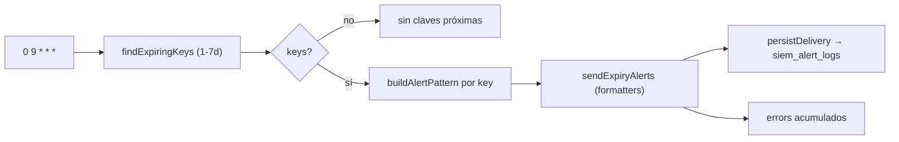
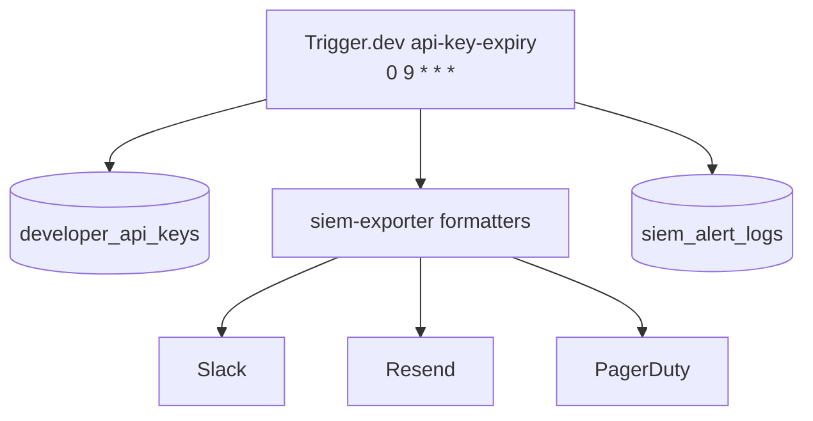
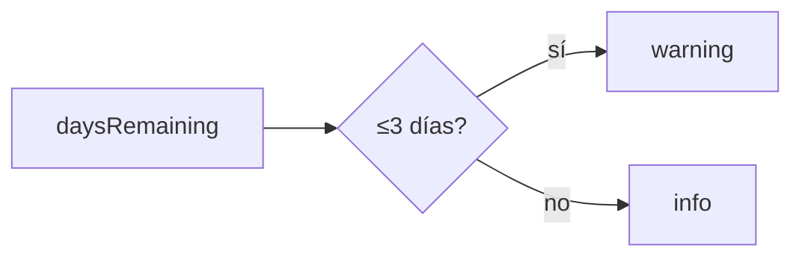

# Job Contract — API Key Expiry Alert (`src/trigger/api-key-expiry.trigger.ts`)

{: .no_toc }

  
Tabla de contenidos

  {: .text-delta }
1. TOC
{:toc}

---

## 0. Estado del job (hallazgo B05)

**Task Trigger.dev:** `api-key-expiry-alert` · schedule `0 9 * * *` (diario 09:00 UTC) · [VERIFIED]

**Side-effects en BD:** SELECT `developer_api_keys` (ventana 1–7 días), INSERT en `siem_alert_logs` vía `persistDelivery` (por entrega) [VERIFIED].

**Veredicto de idempotencia:** **PARTIAL FAIL** — la detección es idempotente (misma ventana → mismas claves), pero un retry del mismo ciclo re-envía alertas a los mismos canales y re-inserta filas de `siem_alert_logs` (sin dedup por `(key_id, fecha)`). [VERIFIED] Ver §5.

---

## 1. Purpose

Alertar diariamente sobre API keys de desarrollador que expiran en 1–7 días, enviando notificaciones por los canales SIEM configurados (Slack/Email/PagerDuty/Splunk). [VERIFIED del código]

## 2. Trigger

| Propiedad | Valor | Evidencia |
|-----------|-------|-----------|
| Task ID | `api-key-expiry-alert` | [VERIFIED] |
| Tipo | `schedules.task` (@trigger.dev/sdk/v3) | [VERIFIED] |
| Cron | `0 9 * * *` (diario 09:00 UTC) | [VERIFIED] |
| Retry | default global (`maxAttempts: 3`) de `trigger.config.ts` | [VERIFIED] |
| Ventana | 1–7 días antes de expiración | [VERIFIED] |

## 3. Steps (TRIGGER → JOB → SUCCESS)

**FLOW-200 — Ciclo de alerta de expiración** · Mermaid `flowchart`

**Steps reales:** 1) `findExpiringKeys`: claves con `expiresAt` en `[now+1d, now+7d]` (excluye las de hoy) [VERIFIED] → 2) por key: `buildAlertPattern` (SiemPattern con eventType `api_key_expiry`, severity warning si ≤3 días / info si no) [VERIFIED] → 3) `sendExpiryAlerts`: mismo pipeline de `WEBHOOK_FORMATTERS` de siem-exporter (Slack/PagerDuty/Splunk/Email), timeout 10s por fetch [VERIFIED] → 4) `persistDelivery` por entrega [VERIFIED].

## 4. Failure → Retry → Limit → Failed → Recovery

**MAT-200 — Gestión de fallos**

| Fase | Comportamiento | Evidencia |
|------|----------------|-----------|
| Failure | Errores por canal acumulados en `errors` | [VERIFIED] |
| Retry | 3 intentos máximos (default global) | [VERIFIED] |
| Limit | `success: errors.length === 0` | [VERIFIED] |
| Failed | Entregas fallidas persisten con status failed | [VERIFIED] |
| Recovery | Próximo ciclo diario | [VERIFIED] |

## 5. Idempotency checklist

| # | Chequeo | Resultado | Evidencia |
|---|---------|-----------|-----------|
| 1 | Detección idempotente (misma ventana → mismas claves) | ✅ PASS | [VERIFIED] |
| 2 | Alerta por key no duplicada en retry | ❌ **FAIL** | [VERIFIED: sin dedup por (keyId, fecha)] |
| 3 | `persistDelivery` safe-retry | ⚠️ PARTIAL | [VERIFIED: INSERT plano, sin constraint único] |
| 4 | Sin canales → error informativo, no bloquea | ✅ PASS | [VERIFIED] |
| 5 | Severidad estable (≤3d warning) | ✅ PASS | [VERIFIED] |

**Fix recomendado [RECOMMENDED] (T05-02):** registrar por key la última fecha de alerta (columna `last_alerted_at` en `developer_api_keys` o tabla de dedup) y omitir keys ya alertadas hoy; o índice único en `siem_alert_logs` para `(ruleEventType, metadata.keyId, detected_at)`.

## 6. Dependencies

| Dependencia | Uso | Evidencia |
|-------------|-----|-----------|
| `@/server/security/api-key-expiry-alert` | `runApiKeyExpiryCheck` | [VERIFIED] |
| `@/server/security/siem-exporter` | `WEBHOOK_FORMATTERS`, `persistDelivery` | [VERIFIED] |
| `@/shared/db/schemas` | `developerApiKeys` | [VERIFIED] |
| Env: `SIEM_WEBHOOK_*`, `RESEND_API_KEY`, `SIEM_EMAIL_*` | Canales | [VERIFIED] |

## 7. Database

| Tabla | Operación | Evidencia |
|-------|-----------|-----------|
| `developer_api_keys` | SELECT (ventana expiración) | [VERIFIED] |
| `siem_alert_logs` | INSERT por entrega | [VERIFIED] |

## 8. Events

- **Consume:** nada (cron puro) [VERIFIED].
- **Emit:** alertas a canales + logs en `siem_alert_logs` [VERIFIED].

## 9. Security

- No expone secretos (solo prefix de la key en logs) [VERIFIED].
- Reutiliza formatters con `escapeHtml` en email [VERIFIED].
- Credenciales service-side [VERIFIED].

## 10. Observability

- `logger.info/warn` con counts y keys (name/prefix/daysRemaining) [VERIFIED].

## 11. Tests

- **Sin test directo** [VERIFIED].
- Gap B06: test de dedup por key/fecha [RECOMMENDED].

## 12. Failure Modes

- Sin canales configurados → errors, `success: false` pero job no falla [VERIFIED].
- Key expira el mismo día (daysRemaining < 1) → omitida por diseño [VERIFIED].
- **Retry duplica alertas por key** (FAIL) [VERIFIED].

---

## 13. Requisitos del contrato

| REQ | Requisito | Cumplimiento |
|-----|-----------|--------------|
| REQ-200 | Ejecutar diario 09:00 UTC | Cumplido (cron) |
| REQ-201 | Detectar claves 1–7 días | Cumplido |
| REQ-202 | Alertar por canales SIEM | Cumplido |
| REQ-203 | Idempotencia por key/fecha | **NO** (PARTIAL FAIL) |

## 14. Arquitectura

**FIG-200 — Contexto del job** · Mermaid `flowchart`

## 15. Flujos

**FLOW-201 — Severidad por días restantes** · Mermaid `flowchart`

## 16. Trazabilidad

**MAT-201 — Trazabilidad**

| ID | Tipo | Qué cubre |
|----|------|-----------|
| REQ-200..203 | Requisito | Contrato del job |
| FIG-200 | Diagrama | Contexto del job |
| FLOW-200/201 | Flujo | Ciclo + severidad |
| TEST-200 | Test | pendiente B06 |
| DEP-200 | Deployment | Trigger.dev CLI/CI |

## 17. Inconsistencias y cross-check

| Hipótesis | Verificación | Resultado |
|-----------|--------------|-----------|
| "Reutiliza el pipeline SIEM" | `WEBHOOK_FORMATTERS` + `persistDelivery` importados | **CONFIRMADO** |
| "Sin duplicados por key" | Sin dedup por key/fecha | **CONTRADICCIÓN** — puede duplicar en retry |
| "Excluye claves de hoy" | `MIN_EXPIRY_DAYS = 1` | **CONFIRMADO** |

## 18. Unknowns y supuestos

- [UNKNOWN] Si existe tracking de `last_alerted_at` en la BD.
- [ASSUMPTION] La ventana 1–7 días es la deseada para preaviso.

## 19. Glosario

| Término | Definición |
|---------|------------|
| keyPrefix | Prefijo visible de la API key (seguro para logs) |
| daysRemaining | Días hasta expiración (ceil) |
| SiemPattern | Estructura de alerta compartida con siem-exporter |

## 20. Versionado y verificación

| Versión | Fecha | Cambios | Estado |
|---------|-------|---------|--------|
| 1.0 | 2026-08-02 | Creación inicial (T05-01, BATCH 05) | Aprobado |

**Verificación:** `node scripts/quality-gate.mjs docs/jobs/JOB-CONTRACT-api-key-expiry.md --min 80` → PASS

---

## 21. APIs y endpoints

| Endpoint | Método | Relación |
|----------|--------|----------|
| `/api/api-keys` | GET | Gestión de API keys (fuente de datos del job) [VERIFIED] |

Errores: sin canales configurados → `errors` informativo; `success: errors.length === 0` [VERIFIED].

**Control de acceso:** credenciales de servicio (service-side), nunca al cliente; solo keyPrefix en logs [VERIFIED].

**Testing:** casos unitarios del pipeline de alertas (buildAlertPattern, formatters) recomendados en B06 [RECOMMENDED].

**Despliegue:** job desplegado vía Trigger.dev CLI desde CI/CD (`.github/workflows/ci.yml`); sin ambientes dedicados ni rollout independiente [VERIFIED].

---

**Fuentes primarias:** `src/trigger/api-key-expiry.trigger.ts` · `src/server/security/api-key-expiry-alert.ts` · `src/server/security/siem-exporter.ts` · `trigger.config.ts`
