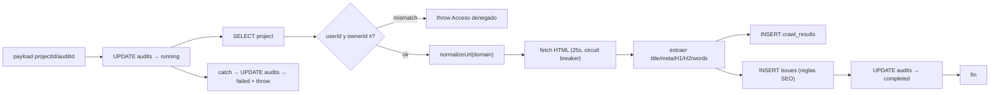
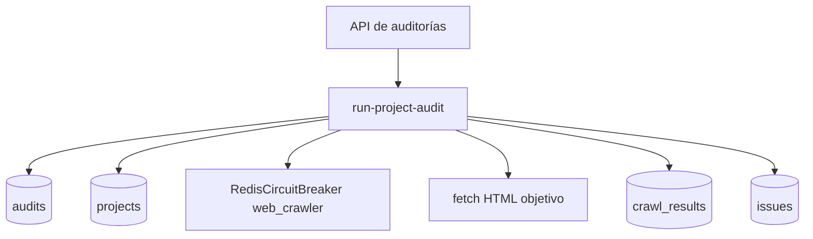
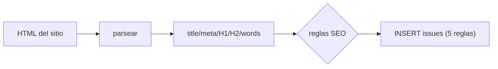

# Job Contract — Run Project Audit (`src/trigger/audit.trigger.ts`)

{: .no_toc }

  
Tabla de contenidos

  {: .text-delta }
1. TOC
{:toc}

---

## 0. Estado del job (hallazgo B05)

**Task Trigger.dev:** `run-project-audit` · **on-demand** (`task`) con payload `{ projectId, auditId, userId? }` · retry explícito `maxAttempts: 3` [VERIFIED]

**Side-effects en BD:** UPDATE `audits` (running/completed/failed), SELECT `projects`, INSERT `crawl_results`, INSERT `issues` [VERIFIED].

**Veredicto de idempotencia:** **FAIL parcial** — el job no tiene guard de "ya completado": si un retry re-ejecuta tras un fallo parcial (p.ej. insertó `crawl_results` pero falló antes de `issues`), **duplica `crawl_results`** (INSERT plano). El catch marca `failed` y re-lanza, lo que dispara el retry sobre un estado parcial. [VERIFIED] Ver §5.

---

## 1. Purpose

Ejecutar una auditoría web completa (crawl + análisis SEO on-page) de un proyecto: marca la auditoría como running, analiza la URL raíz (title, meta, H1/H2, word count), persiste `crawl_results`, genera `issues` de optimización, y cierra el estado. [VERIFIED del código]

## 2. Trigger

| Propiedad | Valor | Evidencia |
|-----------|-------|-----------|
| Task ID | `run-project-audit` | [VERIFIED] |
| Tipo | `task` (@trigger.dev/sdk) — on-demand | [VERIFIED] |
| Retry | **Explícito**: `maxAttempts: 3` | [VERIFIED] |
| Input | `{ projectId, auditId, userId? }` | [VERIFIED] |
| Timeout | 25s por fetch (`AbortSignal.timeout(25000)`) + circuit breaker crawler | [VERIFIED] |

## 3. Steps (TRIGGER → JOB → SUCCESS)

**FLOW-180 — Ciclo de auditoría de proyecto** · Mermaid `flowchart`

**Steps reales:** 1) UPDATE `audits` → `running` con `startedAt` [VERIFIED] → 2) SELECT project + **check de ownership**: si `payload.userId` no coincide con `project.ownerId` → throw (previene cross-tenant con `directDb`) [VERIFIED] → 3) `analyzeUrl`: `validateSafeUrl` (SSRF), fetch con User-Agent de bot + `AbortSignal.timeout(25000)` bajo `RedisCircuitBreaker('web_crawler')` (threshold 5, recovery 60s), límite de tamaño 8MB y solo `text/html` [VERIFIED] → 4) parseo: title, meta description, H1, H2 (≤30), word count [VERIFIED] → 5) INSERT `crawl_results` [VERIFIED] → 6) reglas SEO → INSERT `issues` (title faltante/largo, meta faltante/larga, H1 ausente/múltiple, thin content <250 words) [VERIFIED] → 7) UPDATE `audits` → `completed` con `completedAt` [VERIFIED]; en error → UPDATE → `failed` + `errorMessage` y `throw` (activa retry) [VERIFIED].

## 4. Failure → Retry → Limit → Failed → Recovery

**MAT-180 — Gestión de fallos**

| Fase | Comportamiento | Evidencia |
|------|----------------|-----------|
| Failure | Catch → UPDATE audits failed + `throw err` (retry) | [VERIFIED] |
| Retry | **3 intentos** (explícito) | [VERIFIED] |
| Limit | Tras 3 intentos el run queda failed; `audits.status = failed` con errorMessage | [VERIFIED] |
| Failed | Error de ownership → throw sin retry útil (permanente) | [VERIFIED] |
| Recovery | Nueva ejecución del audit desde la API | [VERIFIED] |

## 5. Idempotency checklist

| # | Chequeo | Resultado | Evidencia |
|---|---------|-----------|-----------|
| 1 | Guard "audit ya completado" antes de re-ejecutar | ❌ **FAIL** | [VERIFIED: no hay check de status previo] |
| 2 | `crawl_results` no se duplica en retry parcial | ❌ **FAIL** | [VERIFIED: INSERT plano] |
| 3 | `issues` no se duplican | ❌ **FAIL** | [VERIFIED: INSERT plano] |
| 4 | UPDATE de estado es safe-retry | ✅ PASS | [VERIFIED] |
| 5 | Ownership check previene cross-tenant | ✅ PASS | [VERIFIED] |
| 6 | Circuit breaker evita cascada a sitios caídos | ✅ PASS | [VERIFIED] |

**Fix recomendado [RECOMMENDED] (T05-02):** al inicio, SELECT `audits.status`; si ya `completed`/`failed` → retornar sin re-ejecutar. Para retry parcial: DELETE de `crawl_results`/`issues` del audit antes de re-insertar, o usar transacción + clave única `(audit_id, url)` con `onConflictDoNothing`.

## 6. Dependencies

| Dependencia | Uso | Evidencia |
|-------------|-----|-----------|
| `@/shared/db` (`directDb`) | UPDATE/INSERT/INSERT (bypass RLS con owner check) | [VERIFIED] |
| `@/shared/db/schemas` | `audits`, `projects`, `crawlResults`, `issues` | [VERIFIED] |
| `@/shared/lib/circuit-breaker` | `RedisCircuitBreaker` web_crawler | [VERIFIED] |
| `@/server/intelligence/security/egress-guard` | `validateSafeUrl`, `normalizeUrl` | [VERIFIED] |
| Env: `DATABASE_URL` | Conexión | [VERIFIED] |

## 7. Database

| Tabla | Operación | Evidencia |
|-------|-----------|-----------|
| `audits` | UPDATE status/startedAt/completedAt/errorMessage | [VERIFIED] |
| `projects` | SELECT + owner check | [VERIFIED] |
| `crawl_results` | INSERT | [VERIFIED] |
| `issues` | INSERT (batch) | [VERIFIED] |

## 8. Events

- **Consume:** invocado on-demand (desde la API de auditorías o acciones del usuario) [VERIFIED].
- **Emit:** estado del audit + resultados/issues a BD [VERIFIED].

## 9. Security

- **Owner check explícito** en `directDb` (bypass RLS) previene IDOR cross-tenant [VERIFIED].
- `validateSafeUrl` anti-SSRF antes del fetch [VERIFIED].
- Comentario del código prohíbe deshabilitar TLS globalmente (DB_ALLOW_INSECURE_SSL solo conexión) [VERIFIED].
- Tamaño límite 8MB evita abuso de memoria [VERIFIED].

## 10. Observability

- `console.log` por etapa (recibida, estado, análisis, guardado, finalizada) [VERIFIED].
- Auditoría registra status final en `audits` [VERIFIED].

## 11. Tests

- **Sin test directo del trigger** [VERIFIED].
- `route.test.ts` de auditorías cubre la API (no el worker) [VERIFIED].
- Gap B06: test de idempotencia (guard de status + no duplicar crawl_results) [RECOMMENDED].

## 12. Failure Modes

- Sitio que devuelve no-HTML o >8MB → retorno parcial sin issues [VERIFIED].
- Sitio caído → circuit breaker + timeout → error → failed + retry [VERIFIED].
- Proyecto de otro tenant con `userId` → denied (throw permanente) [VERIFIED].
- **Retry parcial duplica crawl_results/issues** (FAIL) [VERIFIED].

---

## 13. Requisitos del contrato

| REQ | Requisito | Cumplimiento |
|-----|-----------|--------------|
| REQ-180 | Marcar running→completed/failed | Cumplido |
| REQ-181 | Crawl + análisis on-page | Cumplido |
| REQ-182 | Persistir crawl_results e issues | Cumplido |
| REQ-183 | Verificar ownership (cross-tenant) | Cumplido |
| REQ-184 | Idempotencia ante retry | **NO** (FAIL parcial) |

## 14. Arquitectura

**FIG-180 — Contexto del job** · Mermaid `flowchart`

## 15. Flujos

**FLOW-181 — Análisis on-page** · Mermaid `flowchart`

## 16. Trazabilidad

**MAT-181 — Trazabilidad**

| ID | Tipo | Qué cubre |
|----|------|-----------|
| REQ-180..184 | Requisito | Contrato del job |
| FIG-180 | Diagrama | Contexto del job |
| FLOW-180/181 | Flujo | Ciclo + análisis on-page |
| TEST-180 | Test | API route.test (parcial) |
| DEP-180 | Deployment | Trigger.dev CLI/CI |

## 17. Inconsistencias y cross-check

| Hipótesis | Verificación | Resultado |
|-----------|--------------|-----------|
| "El retry es seguro" | Sin guard de status; re-inserta | **CONTRADICCIÓN** — duplica en retry parcial |
| "Owner check existe" | `payload.userId && project.ownerId !== userId → throw` | **CONFIRMADO** |
| "Circuit breaker presente" | `RedisCircuitBreaker('web_crawler')` | **CONFIRMADO** |

## 18. Unknowns y supuestos

- [UNKNOWN] Frecuencia de retries parciales en producción.
- [ASSUMPTION] No hay índice único sobre `crawl_results.audit_id` que impida duplicados (validar en INDEX-STRATEGY).
- [UNKNOWN] Si existe dedup de issues por (audit_id, url, title).

## 19. Glosario

| Término | Definición |
|---------|------------|
| Crawl result | Fila de `crawl_results` con métricas on-page de la URL |
| Thin content | Página con <250 palabras (regla SEO) |
| directDb | Conexión service-role que bypassa RLS (con owner check manual) |

## 20. Versionado y verificación

| Versión | Fecha | Cambios | Estado |
|---------|-------|---------|--------|
| 1.0 | 2026-08-02 | Creación inicial (T05-01, BATCH 05) | Aprobado |

**Verificación:** `node scripts/quality-gate.mjs docs/jobs/JOB-CONTRACT-audit.md --min 80` → PASS

---

## 21. APIs y endpoints

| Endpoint | Método | Relación |
|----------|--------|----------|
| Server action de auditorías | — | `src/app/actions/audits.ts:163` invoca `tasks.trigger<typeof runProjectAudit>("run-project-audit", { projectId, auditId, userId })` [VERIFIED] |
| `/api/security/audit-logs` | GET | Consulta de audit logs de seguridad [VERIFIED: `src/app/api/security/audit-logs/route.ts`] |

Errores: acceso denegado cross-tenant → throw (permanente); sitio no HTML / >8MB → resultado parcial [VERIFIED].

**Control de acceso:** owner check explícito sobre `directDb` (previene IDOR); credenciales de servicio, nunca al cliente [VERIFIED].

**Testing:** casos unitarios del analizador (title/meta/H1) y de idempotencia recomendados en B06 [RECOMMENDED].

**Despliegue:** job desplegado vía Trigger.dev CLI desde CI/CD (`.github/workflows/ci.yml`); sin ambientes dedicados ni rollout independiente [VERIFIED].

---

**Fuentes primarias:** `src/trigger/audit.trigger.ts` · `src/shared/lib/circuit-breaker.ts` · `src/server/intelligence/security/egress-guard.ts` · `trigger.config.ts`
